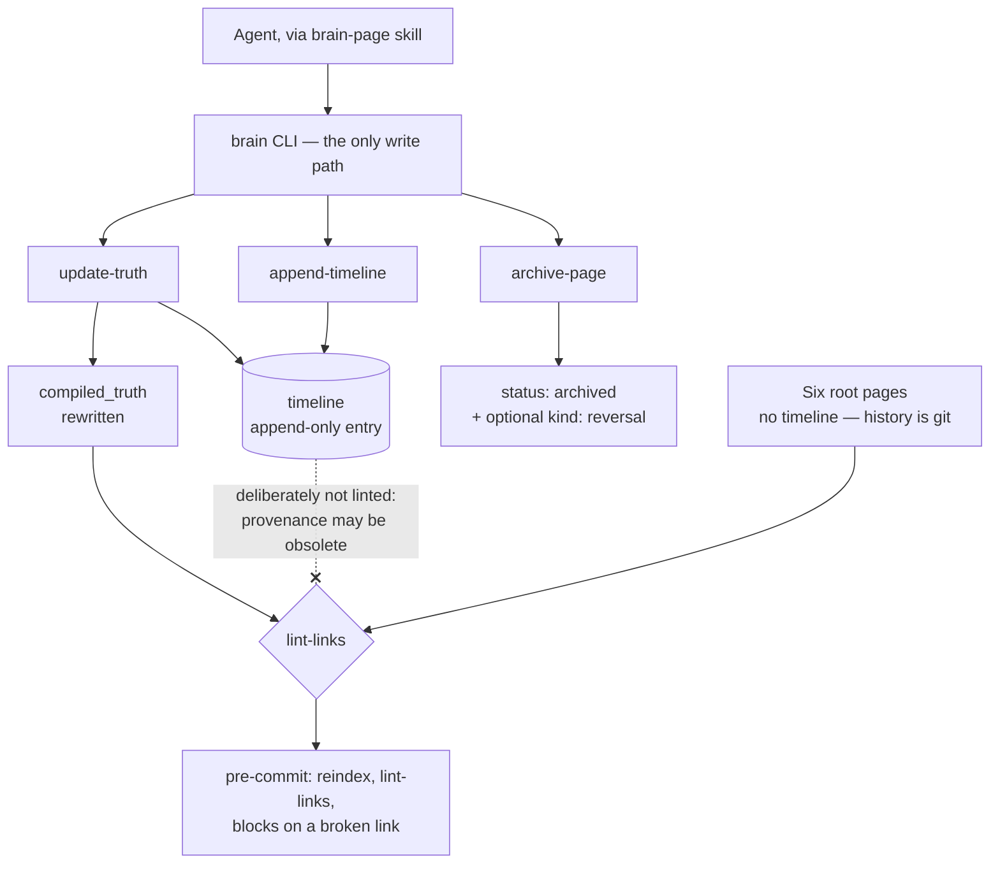

## 1. Executive Summary

brain.md is a small Apache-2.0 project — 22 files, 19 commits, a 522-line
zero-dependency Node library and a CLI over it — that stores a project's durable
knowledge as plain markdown in the repository and reads and writes it through one
command. It ships as four agent skills (`brain-bootstrap`, `brain-ingest`,
`brain-page`, `brain-setup`) and is deliberately agent-agnostic.

**The page format is the contribution.** Every page carries two sections:
`compiled_truth`, which is what is currently believed, and `timeline`, an
append-only list of entries typed `decision | evidence | reversal | note`. The
CLI's `update-truth` rewrites the first *and* appends to the second in one atomic
write, and the skill states the invariant plainly: a compiled_truth rewrite
*"can never silently skip its timeline entry."* Belief and the reason it changed
are one operation.

That is [evidence before belief](../../patterns/evidence-before-belief/) and an
[append-only audit](../../patterns/append-only-memory-audit/) expressed as a file
layout rather than as two tables, and it is the cleanest small instance of the
pair in this atlas.

**The second good decision is about what the linter does not check.**
`lint-links` treats compiled truth and root-page bodies as the current knowledge
graph and *"intentionally does not lint Page timeline entries, because timeline
is append-only provenance and may contain historical syntax examples or obsolete
references."* Most systems that keep history and validate links end up with a
choice between broken validation and rewritten history; this one draws the line
where it belongs — the current layer must be consistent, the historical layer
must be allowed to be wrong.

**And the third is the disclosure.** There is deliberately no `validate` command,
because every write goes through the CLI and the failure modes are therefore
structurally impossible — followed immediately by the limit: *"The guarantee
holds **only as long as you never hand-edit a brain file** — there is nothing to
catch a manual edit afterwards."* A project that states the boundary of its own
guarantee in the same paragraph as the guarantee is rare enough in this corpus to
name.

## 2. Mental Model

A page is a belief with its own history attached, and the CLI is the only door.

**Writes are correct-by-construction rather than validated.** Frontmatter is
generated, section markers are canonicalised, and the mutation vocabulary is
fixed: create, update, append-timeline, update-truth, archive, tag, root-page
rewrite, reindex.

**Current knowledge is rewritten; provenance is appended.** `append-timeline`
adds to the end and existing entries are never touched. `update-truth` does both
halves at once.

**Root pages are different on purpose.** Six fixed slugs — `background`,
`architecture`, `flow`, `mindmap`, `stack`, `roadmap` — validated by the CLI,
with a guaranteed canonical H1 and **no timeline**, because *"their history lives
in git."* That is a deliberate split between knowledge that needs an in-file
audit and knowledge whose audit is the version-control system.

**Archival is a status plus, optionally, a reversal.** `archive-page` sets
`status: archived` and can append a `kind: reversal` entry carrying why the page
was overturned, then reindexes. Nothing is deleted.

The dotted edge is the design decision worth taking: the append-only layer is
exempt from the check that keeps the current layer honest.

## 3. Architecture

No service, no database, no dependencies. A `brain/` directory in the repository,
a Node CLI resolved from a few known skill locations, and an optional git
pre-commit hook that runs `reindex` then `lint-links`, blocks the commit on a
broken link, and folds a regenerated `index.md` back into the commit when the
index lives inside the repo. A `brainRoot` redirect in `.mindmux/preferences.json`
allows a sidecar brain outside the repository, and the hook skips folding in that
case — a small correctness detail that many hook scripts would get wrong.

**A screening note that is about this atlas's tooling rather than about this
project.** `screen_repo.py` returned `NOTHING SCANNED` here, and this tree ships
`skills/brain-setup/hooks/pre-commit`. The hook is an *asset to be installed*
rather than an active hook in the checkout, so nothing executes on clone — but
the screen missed a hook payload because it looks at canonical install paths, and
that is a blind spot worth recording where it was found.

## 4. Essential Implementation Paths

- **Library** — `skills/brain-page/lib/brain.mjs`: `resolveBrainDir`,
  `splitFrontmatter`, `parseFrontmatter`, `compiledTruthMarkerRange`,
  `timelineMarkerRange`, `extractSection`, `countTimelineEntries`, `listPages`,
  `findWikiLinks`, `setFrontmatterField`, `normalizePageSectionMarkers`.
- **CLI** — `skills/brain-page/bin/brain.mjs` (530 lines).
- **Contract for agents** — `skills/brain-page/SKILL.md`, which states the
  invariants an agent must not work around.
- **Hook** — `skills/brain-setup/hooks/pre-commit`.
- **Seed brain** — `skills/brain-setup/assets/brain/`, the six root pages plus
  `index.md` and `pages/`.
- **Tests** — `skills/brain-page/test/brain.test.mjs`, 452 lines.

## 5. Memory Data Model

Frontmatter is CLI-generated and carries at least an id, a status and tags; the
body carries the two marked sections. A timeline entry has a `kind` —
`decision`, `evidence`, `reversal`, `note` — which is a small, well-chosen
vocabulary: three of the four are epistemic events and the fourth is explicitly
not.

What the model does *not* have is a status on the belief itself. `reversal`
records that something was overturned, and the page it overturned keeps whatever
compiled truth the same write installed; `status: archived` is lifecycle rather
than epistemics. So a reader can see that a reversal happened and cannot query
for beliefs that have been reversed.

## 6. Retrieval Mechanics

Section extraction by marker, wiki-links between pages, and a regenerated
`index.md`. There is no ranking, no embedding, no search — the retrieval story is
that an agent reads the index, follows links, and extracts the compiled truth of
the pages it needs. For a project-knowledge store of this size that is a
reasonable position, and the linter is what keeps the link graph navigable.

## 7. Write Mechanics

Synchronous, model-free, and funnelled. The interesting property is atomicity at
the *semantic* level rather than the filesystem level: `update-truth` is one
command that produces two effects, so the failure this atlas records
repeatedly — a belief changing with no record of why — is not expressible
through the supported interface.

The cost is stated: hand-edit a file and nothing notices. `reindex` and
`lint-links` are described as *"optional hygiene, not load-bearing gates"*, which
is accurate and unusually candid, and the pre-commit hook is the one place they
become enforcing.

## 8. Agent Integration

Four skills, each a markdown contract rather than code: bootstrap for standing a
brain up from an existing repository, ingest for pulling material in, page for
the read/write vocabulary, setup for installation. Claude Code, Codex, Cursor and
Pi are named as targets, and the CLI's skill-location search reflects that —
`~/.claude/skills/`, `~/.codex/skills/`, `~/.config/opencode/skills/`.

## 9. Reliability, Safety, and Trust

**The timeline earns `audit_log`.** It is a named, append-only record of
mutations to the belief, in the system's own store, and the write path cannot
change a belief without adding to it. Root pages are the exception and say so —
their history is git, which this atlas does not count as the mark, and the report
does not credit it there.

**Scope is a directory.** One brain per repository, resolved rather than
configured per call, with a redirect for a sidecar. That is the file-boundary
form of scope, and its limit is the usual one: a single-user store with no
tenancy and no authorisation.

**The guarantee is bounded and the boundary is published.** Correct-by-
construction writes, no validator, and one sentence saying exactly when the
property stops holding. Compare the systems in this atlas whose invariants are
asserted in a README and enforced nowhere.

**What is missing is a way to ask about the past.** The timeline is prose in a
markdown section: a person can read why a belief changed, and nothing can query
for reversals, count them, or find every page whose truth changed after a given
date without parsing the files. `countTimelineEntries` exists, which is the
beginning of that and not the end.

## 10. Tests, Evals, and Benchmarks

452 lines of Node test against a 522-line library — a ratio most projects this
size do not reach. The assertions that earn `negative_eval` are the boundary
ones: `assert.doesNotMatch(truth, /## Timeline/)` and
`doesNotMatch(truth, /real timeline/)` pin that timeline content cannot leak into
an extracted compiled truth, and further cases assert the raw section markers do
not survive into a rendered body.

That is a committed case asserting particular material must not come back from a
read path — the read path being the one that feeds an agent what it currently
believes. It is not a deletion-durability assertion, and this report does not
claim it is.

No benchmarks, and none claimed.

## 11. Patterns Worth Stealing

### Steal

**Make the belief rewrite and its provenance entry one command.** Not a
convention, not a code review rule — one subcommand that does both, so skipping
the second is not expressible.

**Exempt the append-only layer from the consistency check.** History is allowed
to contain obsolete references; current knowledge is not. Systems that lint
everything end up either rewriting history or disabling the check.

**Give history to git where an in-file audit adds nothing.** Root pages have no
timeline on purpose. Knowing which knowledge needs its own audit and which does
not is a decision most designs never make.

**Publish the boundary of your guarantee in the same breath as the guarantee.**
*"The guarantee holds only as long as you never hand-edit a brain file."*

### Avoid

**Do not rely on a funnel with an open side.** The CLI cannot enforce anything
against a text editor, and the project's answer — a pre-commit hook — is optional
and locates its own binary by searching four paths.

**Do not let provenance be readable only by a human.** Four entry kinds is a
usable vocabulary; without a query over them, the reversal history is prose.

### Fit

This suits a team that wants project knowledge to live in the repository, travel
with it, and be legible to any agent — and that is willing to make the CLI the
only way in. It is small enough to read in an afternoon and the format would
survive the tool disappearing, which is the strongest property a markdown memory
can have.

It is not the choice where memory must be searched rather than navigated, where
several agents write concurrently, or where a wrong belief must be provably
unable to return: `archive` and `reversal` record that something was overturned,
and nothing stops the same claim being compiled back into truth tomorrow.

## 12. Antipatterns / Risks

- **A funnel that a text editor bypasses**, with no validator by design.
- **Provenance without a query.**
- **No epistemic status on the page**, so reversed and current beliefs look the
  same in frontmatter.
- **An optional hook as the only enforcement**, which finds its CLI by searching
  well-known paths and silently skips when it cannot.

## 13. Build-vs-Borrow Takeaways

The page format is the borrowable thing, and it is borrowable without the code: a
current-knowledge section, an append-only typed timeline, and one write that
touches both. That shape drops into any markdown memory, including several
already in this atlas that keep history in a sibling file and let the two drift.

## 14. Open Questions

- Is a `validate` command genuinely unwanted, or unwanted *until* the first
  hand-edited brain is reported?
- Will timeline entries ever be queryable — the kinds are there and nothing reads
  them programmatically beyond counting.
- What happens when two agents update the same page's truth concurrently? The
  write is atomic per command and the store is a file.

## 15. Appendix: File Index

| Path | Role |
| --- | --- |
| `skills/brain-page/lib/brain.mjs` | Frontmatter, section markers, links, timeline counting |
| `skills/brain-page/bin/brain.mjs` | The CLI — the only supported write path |
| `skills/brain-page/SKILL.md` | The invariants, stated for the agent that must not work around them |
| `skills/brain-setup/hooks/pre-commit` | reindex, lint-links, block on broken link, fold the index in |
| `skills/brain-setup/assets/brain/` | Six root pages, index, `pages/` |
| `skills/brain-page/test/brain.test.mjs` | 452 lines, including the timeline-must-not-leak assertions |

## History

**2026-08-07** — [`5cecfdd4154687751f80e2d40f3a70a4fdca4543`](https://github.com/mindmuxai/brain.md/commit/5cecfdd4154687751f80e2d40f3a70a4fdca4543) — first reading. The screen returned **NOTHING SCANNED** — no manifest it recognises exists — so the tree was read by hand: a zero-dependency Node CLI with no package manifest, and one hook payload at `skills/brain-setup/hooks/pre-commit` that is installed by the setup skill rather than active in the checkout. Nothing executes on clone and nothing was run. The screen's miss is recorded in section 3 because it is a gap in this atlas's tooling rather than in the project.
