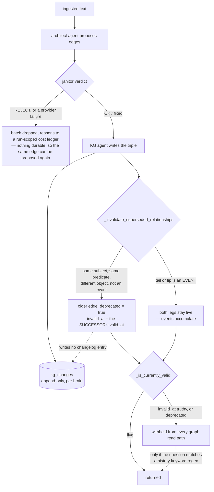

## 1. Executive Summary

BrainAPI turns text into an event-centric knowledge graph and answers questions
by walking it. The pitch is the walk: *"Not a nearest-neighbour guess — a
reasoned, walkable path through a graph it built for you."* Underneath is 45,741
lines of Python across six datastores, an agent swarm that proposes and vetoes
edges before they land, a FastAPI service, an MCP server, a React console, a TUI
installer, and five benchmark suites with a committed results ledger.

**Licence first, because it governs what a reader may do with any of this.**
BUSL-1.1, Licensor Lumen Platforms Inc., **Additional Use Grant: None**, Change
Date 2030-08-13 to Apache-2.0. The strict form: no production use is granted at
all before that date, not merely non-competing use. The Apache text ships in
`licenses/` for after the conversion.

Four findings, and the first two are the reason to read this report.

**The benchmark ledger publishes a number its own notes say is not ready.**
`benchmarks/REPORTS.json` describes itself as "Top published scores across
suites" and tops the LoCoMo leaderboard with `locomo-compose-sota-conv26-v4d` at
95.39%. The run directory beside it is committed in full — 152 rows of
per-question output — and **the headline recomputes exactly**: 145/152 = 95.39%,
with every per-category figure matching. Then `NOTES.md` in the same directory
says the run "is a selective residual re-score atop v4c corrects (not a cold
full-152 under identical loop counts for every row)", that a **"cold full re-run
under frozen v4d harness [is] recommended before external claims"**, that the
judge is the same model family as the answerer, and that this is an "exploratory
single-sample" on one conversation of LoCoMo's ten. Every one of those caveats is
the project's own. None of them travels with the number into the ledger.

**Supersession is the correction mechanism, and it is one time axis wearing
two.** `_invalidate_superseded_relationships` sets the older edge's `invalid_at`
to *the successor's* `valid_at`, so both ends of the interval are world time and
nothing records when the store learned anything. It then falls back to
`utcnow().strftime("%d/%m/%Y")` — day resolution, non-sortable — and it does not
matter, because all three read sites test `if props.get("invalid_at")` for
truthiness and never compare it to a query instant. There is no as-of query in
the repository.

**The validity filter itself is good and is applied everywhere**, which is rarer
than it should be. `_is_currently_valid` — false on `invalid_at`, false on
`deprecated` — is called from thirty-odd sites across `recommend.py`,
`personalize.py`, `entity_sibilings.py` and the retrieve controller. A superseded
edge stops being returned, and a keyword regex over the question decides whether
history comes back with it.

**Two node names reach Cypher unescaped.** `deprecate_relationship` builds
`WHERE a['name'] = '{subject.name}'` by f-string, on the two lines where it
carefully passes the *labels* through a twelve-replacement sanitiser that strips
`'`. Names come from LLM extraction over user text.

Three marks. BUSL-1.1, 426 commits since 19 October 2025, pinned at
[`b434f92a10d5b95aceab3f845d54472212672a10`](https://github.com/Lumen-Labs/brainapi2/commit/b434f92a10d5b95aceab3f845d54472212672a10)
(27 August 2026), with 585 test cases across 17,404 lines.

## 2. Mental Model

A memory is a triple, and the design's one real idea is what sits in the middle
of it. Instead of `(Alice, LIVES_IN, SF)` as the atom, an **event is a node** —
`Purchase`, `Trip` — and the actor's involvement is an edge to it. The README's
framing is *"who did what, to whom, when, and in what context"*, and the schema
follows: `Node.happened_at` exists precisely so an event node can carry when it
occurred.

That choice has a consequence the code is explicit about. A person accumulates
one leg per event and none of them supersede the others — the docstring says
*"an actor accumulates one leg per event and none of them supersede the
others"* — while a functional attribute like `LIVES_IN` has exactly one current
value and a newer one closes the older. So the store distinguishes **things that
happened**, which accumulate, from **things that are true**, which are replaced,
and that distinction is enforced in one function with three committed cases
around it.

**A memory has two states and one of them is a pair of properties.** Live, or
carrying `deprecated = true` and `invalid_at`. There is no candidate, no
verified, no rejected. The janitor agent does emit `OK / ERROR / REJECT` per
batch, but that verdict is a decision about whether edges are written at all —
its veto reasons go to `print()` and a run-scoped `cost_ledger`, never to a
field — so nothing that reaches the store carries an epistemic status, and
nothing that was refused leaves a durable trace.

Correction is therefore automatic, silent and one-directional: a newer edge of
the same type from the same subject to a different object closes the older one.
Nobody reviews it, nothing records why, and asserting the old value again writes
a new edge that closes the new one in turn.



## 3. Architecture

Six datastores, and the deployment stands up most of them.

- **Graph** — Neo4j (`src/lib/neo4j/client.py`, 2,343 lines) or a NetworkX graph
  persisted in Postgres (`networkx_client.py`, 1,628 lines) behind one
  `AbstractGraphStore`-shaped adapter. Two implementations of one interface, and
  the second exists so a reader can run without Neo4j.
- **Documents and the change log** — Mongo, one database per brain.
- **Vectors** — Milvus, Postgres/pgvector, or Qdrant.
- **Cache** — Redis. **Queue** — RabbitMQ, driving Celery ingestion.
- **Surfaces** — FastAPI (`src/services/api`), an MCP server with a separate
  stdio-HTTP bridge, a React console, and `brainapi-tui`, an npm-installed
  wizard that clones the repo and starts everything.

The agents are the interesting layer: `architect_agent.py` (1,993 lines)
proposes entities and relationships, `janitor_agent.py` (736) vetoes and repairs
them, `kg_agent.py` (615) writes, and `validator_agent`, `temporal_agent`,
`scout_agent` and `observations_agent` sit alongside.

### Deployment and ergonomics

This is the heaviest install in its family. A full run wants Neo4j, Mongo, a
vector store, Redis and RabbitMQ, plus an LLM provider for ingestion *and* for
retrieval — extraction, janitor, and answering are all model calls. There is no
degraded local mode that keeps the graph and drops the rest; the graph is the
product.

The store is not human-readable in any useful sense: a brain is a Neo4j database
and a Mongo database, and a wrong edge is repaired through the API or through
Cypher, not by editing a file. Against that, the change log gives an operator
something to read after the fact, which most graph systems in this atlas do not.

The TUI is the ergonomic answer and it is a real one — `brainapi init` clones,
installs, runs a wizard and starts the services — but note what it implies for a
reader evaluating the code: the documented path installs from a tree whose
dependency manifests changed within the last few days.

## 4. Essential Implementation Paths

**Ingest.** `POST` → Celery `ingest_data` (`src/workers/tasks/ingestion.py`, 1,648
lines) → architect proposal → janitor batch → KG write → invalidation sweep.
Fully asynchronous; nothing is retrievable until the task completes.

**The janitor gate** (`architect_agent.py:460-510`) is the part worth copying.
Three outcomes, and the comment states the invariant: *"Parse / provider failure
must not silently approve edges."* A `None` response drops the batch and appends
`janitor_parse_failure` to the ledger; a `REJECT` drops it and appends the veto
reasons; only `OK` or a repaired set proceeds. **It fails closed** — a model
outage loses candidate edges rather than admitting unvetted ones.

**Invalidation** (`ingestion.py:507-560`). Guards first: return if either end is
an event, return if either type is blank, skip inbound edges, skip the successor
itself, skip anything already carrying `invalid_at`. Then `update_properties`
with `{"invalid_at": valid_at or utcnow().strftime("%d/%m/%Y"), "deprecated":
True}`.

**Retrieval.** `src/services/api/controllers/retrieve.py` (2,235 lines) fuses
dense and lexical candidates — `SEARCH_MODE` is `hybrid`, `bm25`, `dense` or
`ilike`, with `SEARCH_BM25_K1` and `SEARCH_BM25_B` validated at config load —
then runs graph channels: PPR, entity siblings, catalog walks. Every predicate
crossing those paths passes `_is_currently_valid`.

**The history switch.** `_wants_historical_facts(request.text)` is a keyword
regex: `_HISTORY_MODE_RE` matches `previously`, `originally`, `chronolog`,
`contradict`, `first said`; `_CURRENT_TRUTH_RE` matches `now`, `currently`,
`latest` and suppresses it. When it fires, `_fact_predicates_allowed` returns
`True` unconditionally and superseded edges come back.

**Change log.** `save_kg_changes` → `insert_one` into `kg_changes`, from three
call sites in `KGAgentAddTripletsTool` and one in `KGAgentDeleteRelationshipTool`.

## 5. Memory Data Model

`src/constants/kg.py` declares the whole schema, and its temporal fields are
where the design gets read carefully.

```python
class Node(BaseModel):
    happened_at: Optional[str | None]   # when the event occurred
    last_updated: datetime = Field(default_factory=datetime.now)
```

`Predicate` carries `uuid`, `name`, `description`, `flow_key`, `last_updated`,
`deprecated`, `direction`, `amount`, `level`, `observations` and a free
`properties` dict. **`invalid_at` is not a declared field** — it lives in
`properties`, written by the invalidation sweep and read with
`props.get("invalid_at")`.

**Why `bitemporal` is withheld, in three steps.** `happened_at` is world time and
`last_updated` is record time, which looks like the two axes the mark asks for —
but `last_updated` is a `default_factory` timestamp that overwrites, which the
rubric names as *"not this"* in as many words. `invalid_at` looks like the
closing end of a validity interval, and the sweep sets it to the *successor's*
`valid_at` — so both ends of the interval are validity time and nothing records
when the store learned the old value had ended. And the decisive one: all three
read sites test `invalid_at` for truthiness. It is a boolean in a timestamp's
clothing, and the repository contains no query that asks what was believed on a
date.

**No trust, no provenance, no confidence.** Grepping `kg.py` and `data.py` for
`status`, `confidence`, `verified`, `trust` and `provenance` returns nothing.
`Node.polarity` is `positive | negative | neutral` and is about the claim's
valence, not its standing.

**Scoping is the brain, and the brain is the database.** Not a column, not a
predicate — Mongo's `database=brain_id` and Neo4j's `database_=brain_id`. The
middleware refuses a non-alphanumeric id before it reaches either, which is what
makes using an identifier as a database name safe.

## 6. Retrieval Mechanics

Three arms and a filter. Dense vectors from whichever store is configured; BM25
over Postgres, with `ilike` as a degraded mode and `dense` and `bm25` as
single-arm modes; and graph channels — `graph_channels.py` (903 lines),
`catalog_graph.py` (772), `recommend.py` (608), `personalize.py` — that expand
from seed entities.

**The validity filter is the strongest thing on this path.** Two copies of the
same predicate exist — `_is_currently_valid` in the retrieve controller and
`_predicate_currently_valid` in `entity_sibilings.py`, byte-identical in
behaviour — and between them they are called from more than thirty sites. Where
a two-hop expansion happens, *both* predicates are checked (`_is_currently_valid(r)
and _is_currently_valid(r2)`), so a path cannot be assembled through a superseded
edge in the middle. That the two copies exist rather than one import is the
mechanism's only softness: they can drift.

**The history affordance is a phrasing test.** Ask "where does Alice live now"
and superseded edges are excluded; ask "where did Alice previously live" and
they are all included, unfiltered, with no way to bound the answer to a date.
The regex is a reasonable heuristic and it is doing the job an as-of parameter
would do better — the retrieve request has no `as_of` field.

**Latency is measured and it is not small.** The committed LoCoMo run reports
retrieval p50 at 5,194 ms and p95 at 13,786 ms, with 43.8 million tokens across
answering and judging for 152 questions. Very few systems in this atlas report
retrieval latency at all; this one commits it per run.

## 7. Write Mechanics

Writes are queued and model-mediated end to end: extraction, vetting and
graph-writing are all LLM calls, so the lag from ingest to retrievability is a
full Celery task, and the token cost scales with the text rather than with the
number of facts kept.

**Deduplication happens by similarity at write time** — `KGAgentAddTripletsTool`
resolves a proposed subject and object against similar existing nodes before
inserting. Two `TODO` comments at `:130` and `:153` say the changelog should
record the merge when the resolved name differs from the proposed one, and it
does not, so a silent entity merge is the one mutation with neither an audit row
nor a way to see it happened.

**Supersession is unreviewed and unrecorded.** The sweep writes two properties
and returns; the `except Exception` around it prints and continues, so a failed
invalidation leaves the old edge live and the new edge live beside it, and
nothing retries. Two contradicting facts then both pass the validity filter.

**The Cypher construction on the deprecation path is the defect to fix first.**

```python
MATCH (a:{":".join(self._clean_labels(subject.labels))}) WHERE a['name'] = '{subject.name}'
MATCH (b:{":".join(self._clean_labels(object.labels))}) WHERE b['name'] = '{object.name}'
```

`_clean_labels` replaces spaces, hyphens, dots, commas, colons, semicolons,
brackets, braces and single quotes — thirteen chained `replace()` calls, one for
the space and twelve for punctuation, including the quote
that matters. It is applied to the labels and not to the names, on the same two
lines. Node names are produced by an LLM reading user-supplied text, so a name
containing an apostrophe breaks the query and a crafted one is injection against
a database the caller already holds a PAT for. Fourteen other methods in the same
file pass parameters properly; this one does not. The fix is a `$name`
parameter.

### Operational cost

Nothing re-reads the whole store on a schedule, so there is no corpus-scaled
nightly bill — but ingestion is expensive per document (architect + janitor +
KG-agent calls) and retrieval is expensive per query (answering is a model call
on top of a multi-second graph walk). The committed run's 43.8 million tokens
for 152 questions is the number to plan against; the ledger records it, which is
the right instinct.

## 8. Agent Integration

The surface is HTTP plus MCP. `retrieve/context` takes a question and returns an
answer with `triples` showing the path, `retrieve/entity/synergies` and
`retrieve/recommend` expose the graph channels directly, and the MCP server puts
the same operations in front of a coding agent, with a stdio-HTTP bridge for
clients that only speak stdio.

**Every route resolves the brain before it runs.** `get_brain_id` is a FastAPI
dependency reading `request.state.brain_id`, set by middleware that accepts the
id from a header, a query param, a JSON body or a multipart form — and then
validates it. The order matters: reserved-name check, then `isalnum()`, then the
PAT check, then the route. A caller cannot reach a store with an
unvalidated identifier.

**The agent has no memory tools of its own.** There is no `remember` or `forget`
exposed to a model in the way this atlas usually finds; writing is ingestion, and
correction is a side effect of ingestion. The `KGAgent*` tools are internal to
the swarm, not surfaced to an adopter's agent.

## 9. Reliability, Safety, and Trust

**Provenance exists at the document level and not at the claim level.** An
observation carries `inserted_at` and ingestion tracks its source, but a
predicate does not record which passage produced it, so a wrong edge cannot be
traced to the text that caused it — only deprecated.

**Prompt-injected facts have the ordinary graph-RAG path in, with one real
obstacle.** Extraction turns arbitrary text into proposed edges, but the janitor
sits between the proposal and the write and can veto the batch. That is more
than most systems here have. What it does not do is remember: a vetoed edge
leaves `janitor_drop_reasons` in a run-scoped ledger, so the same text ingested
again is vetted again from scratch, and a batch that passes on the second roll
is written.

**Multi-tenancy is the strongest part of the design.** Database-level partition
plus a per-brain PAT is a stronger boundary than the tag-based scoping this
atlas usually finds. State the widening flags with it: `BRAIN_CREATION_ALLOWED`
turns an unknown header into a new brain, `DEFAULT_BRAIN_FALLBACK` turns an
absent one into `default`, and a system PAT bypasses the per-brain check on every
route.

**Two marks withheld, with the reason.** `tombstone` — nothing anywhere is keyed
on a rejected value; deprecation is keyed on the relationship, and re-asserting a
closed claim writes a fresh edge that closes its replacement. `human_review` —
the only `approve`/`REJECT` vocabulary in the repository belongs to the janitor
agent adjudicating its own swarm's proposals; no surface puts memory content in
front of a person for a decision, and the console displays the graph rather than
gating it.

## 10. Tests, Evals, and Benchmarks

**585 cases across 17,404 lines in 73 files**, against 45,741 lines of source.
Fourteen skips, and every one is gated on the environment rather than excusing a
behaviour. Four are decorators — three `skipUnless` and one `skipIf` — on an
unavailable service or dependency (Postgres, the PostgreSQL/NetworkX imports).
The other ten are inline `self.skipTest` calls for material that is not in the
tree: three for absent local benchmark artifacts and stored ESCI evals, four for
frozen search datasets and smoke fixtures, three for optional search and recsys
plugins that are not installed. So most of the skipping is the benchmark corpus
being absent, not a service being down — which matters for reading section 10's
numbers, since the suite that runs by default is smaller than 585 by whatever
those ten cover.

`tests/test_event_hub_invalidation.py` is the best test in the repository and is
the whole basis of the `negative_eval` mark. Three cases over one fake graph
adapter: a functional attribute *is* superseded, and the assertion is made in
both directions through the real read-path predicate; an event leg is *not*; an
inbound edge is *not*. The two negative cases assert `graph.updates == []`, which
would be vacuous on its own and is not here, because the positive case proves the
same fake records a write when one happens. That is the shape this atlas asks
for and rarely finds.

`tests/test_benchmark_contract_guardrails.py` is worth naming for a different
reason: it asserts the search harness *must not* score through
`/retrieve/context` or `/retrieve/recommend`, and that the search client must not
default to particular endpoints. A test that stops a benchmark from measuring the
wrong thing is a rare artifact.

**The benchmark ledger, opened rather than cited.** `benchmarks/REPORTS.json`
carries five suites — LoCoMo, LongMemEval, BEAM, RecSys, Search — with 103
leaderboard entries between them and this description: *"Top published scores
across suites."*

- **LongMemEval's leaderboard is empty.** The suite, its runner and its shell
  wrapper are all committed; no result is.
- **Two run directories are committed of 103 entries** — the top LoCoMo run and
  the top BEAM run — each with `answers.jsonl`, `manifest.json`, `report.json`
  and `report.md`. That is far more than most projects publish, and it is what
  makes the rest of this section possible.
- **The LoCoMo headline recomputes exactly.** 152 rows, 145 with
  `judge_correct` true, 145/152 = 95.39% against the ledger's 95.39, and the four
  per-category figures match the report to the tenth of a point. Zero errored
  rows, zero duplicates, zero empty predictions.

And then the caveats, all of them the project's own, none of them travelling
with the number:

- **The scope is one conversation.** `scope: conv-26`, n=152, of LoCoMo's ten
  conversations. `NOTES.md` says so — *"exploratory single-sample; full-10 still
  required for protocol HyperMem claim"* — and the ledger field records it while
  the leaderboard position does not.
- **Category 5 is absent.** LoCoMo's adversarial category — the one where the
  right answer is a refusal — has zero rows in the file, and the report prints
  *"Abstention accuracy (cat 5): n/a (n=0)"*. The half of the benchmark that
  tests not answering was not run.
- **The judge is the answerer.** `answer_model` and `judge_model` are both
  `deepseek-v4-flash`, and `report.md` prints *"same family as answerer: True"*.
  `NOTES.md` lists "Shared-family judge (deepseek)" under Caveats.
- **The run is a selective re-score.** *"v4d seeded correct rows from v4c, then
  resumed the 11 residuals under the final harness."* Keeping the wins and
  retrying the losses is an optimistic procedure, and the notes say so:
  *"not a cold full-152 under identical loop counts for every row. Cold full
  re-run under frozen v4d harness recommended before external claims."* The
  artifact cannot be used to check that caveat — its 152 rows carry no per-row
  provenance field distinguishing a seeded row from a re-run one, and all 152
  timestamps fall inside one 44-minute window.
- **The tree was dirty.** `report.md` records `Git SHA: 78cbbae5… (dirty: True)`.

The honesty here is genuine and it is unusually complete — the notes even publish
the failed arms, including *"v4b 87.5% — books-nudge overfit — do not ship"*, and
diagnose all seven residual wrongs by hand. The gap is one of plumbing rather
than intent: `NOTES.md` is a file in a run directory, and `REPORTS.json` is what
a reader, a dashboard or an agent will quote. A `caveats` field on the
leaderboard entry, or a `status` that the ledger's own upsert refuses to mark
`ok` for a re-scored run, would close it.

**What I would want before trusting the number.** The cold full-152 the notes
ask for; the other nine conversations; category 5; and a judge from a different
family. The harness to do all four is in the repository.

## 11. For Your Own Build

### Steal

- **Make an event a node.** Modelling *who did what, when* as an event node with
  legs, rather than as attributes on the actor, is what lets this system say that
  two purchases both happened while two cities cannot both be current. The rule
  falls out of the data model instead of being a special case in the correction
  code.
- **Fail closed on a model failure in a write gate.** *"Parse / provider failure
  must not silently approve edges"* is four words of comment and the difference
  between an outage losing candidates and an outage admitting unvetted ones.
- **Apply the validity predicate at every expansion hop.** Checking both
  predicates of a two-hop path (`_is_currently_valid(r) and _is_currently_valid(r2)`)
  is what stops a superseded edge being laundered through the middle of a chain.
- **Commit per-question benchmark output.** `answers.jsonl` with the prediction,
  the gold, the judge verdict and the retrieved session ids is what let this
  report verify a headline instead of repeating it. Almost nothing in this atlas
  can be checked that way.
- **Test that your benchmark cannot measure the wrong thing.**
  `test_benchmark_contract_guardrails.py` asserts the search harness must not
  score through the context endpoint. Guarding the measurement is as valuable as
  guarding the code.

### Avoid

- **A ledger that drops the caveats its source recorded.** The notes here are
  better than most published methodology sections and they stop at the run
  directory. If a results file calls itself "top published scores", the fields
  that make a score interpretable — scope, judge independence, whether the run
  was cold — belong on the row, not next to it.
- **A closing timestamp taken from the successor.** Setting `invalid_at` to the
  new fact's `valid_at` puts both ends of the interval on the same axis and
  leaves nothing recording when the store learned. If you only ever test the
  field for truthiness, a boolean is more honest.
- **A history mode selected by keyword.** Deciding whether superseded facts are
  returned by regexing the user's question means "previously" and "before the
  change" behave differently from "as of March", and no phrasing bounds the
  answer to a date. Take an `as_of` parameter.
- **Sanitising the labels and interpolating the names.** The care is visible —
  twelve replacements including the quote — and it is applied to one of the two
  interpolations on each line. Parameterise.
- **An audit whose highest-volume writer bypasses it.** Four change types, real
  models, a queryable list endpoint — and the supersession that runs on every
  ingest writes none of them. An audit that covers the agent tools and not the
  pipeline answers "what did the agent do" and not "what happened to my graph".

### Fit

This is a serious engineering effort and a heavy one: six datastores, an agent
swarm, and model calls on both the write and the read path. It suits a reader who
wants a knowledge graph built and maintained for them, has the operational budget
for the stack, and values the traceable path over latency — p50 retrieval above
five seconds is the cost of the walk.

The BUSL grant makes that a narrower audience than the code implies. With
**Additional Use Grant: None**, there is no production use before 13 August 2030;
until then this is something to read, run locally, and learn the event-node idea
from, or to license. Read that way it is worth the time — the invalidation rule,
the fail-closed janitor and the committed per-question artifacts are each worth
more than the retrieval stack around them.

Anyone who needs an as-of query, a reviewable correction, or a record of what was
refused should expect to build all three.

## 12. Open Questions

- **Has the cold full-152 run the notes ask for been done?** If it has, it is not
  in the ledger; if it has not, `REPORTS.json` is publishing a number its author
  flagged as not yet publishable.
- **Why is LongMemEval's leaderboard empty when its harness is committed?** A
  suite that runs and reports nothing is either unfinished or a result nobody
  liked, and a reader cannot tell which.
- **Do the two copies of the validity predicate ever drift?** They are identical
  today and there is no test asserting they stay so.
- **Is the silent entity merge on the write path intended to stay unaudited?**
  Two `TODO`s in `KGAgentAddTripletsTool` say the changelog should record it.
- **What does `_invalidate_superseded_relationships` do when `update_properties`
  fails?** It prints and continues, leaving both edges live — whether anything
  reconciles that later is not visible in the tree.

## Appendix: File Index

**Data model**
- `src/constants/kg.py` — `Node`, `Predicate`, `Triple`; `happened_at`,
  `last_updated`, `deprecated`.
- `src/constants/data.py:81-160` — `KGChangesType` and the four change-log
  models.
- `src/constants/agents.py:105-130` — the janitor's `OK / ERROR / REJECT` and
  `veto_reasons`.

**Write path**
- `src/workers/tasks/ingestion.py:507-560` — `_invalidate_superseded_relationships`.
- `src/core/agents/architect_agent.py:460-510` — the fail-closed janitor gate.
- `src/core/agents/tools/kg_agent/KGAgentAddTripletsTool.py:130,:153,:187-244` —
  entity resolution, the two unaudited-merge `TODO`s, the change-log writes.
- `src/core/agents/tools/kg_agent/KGAgentDeleteRelationshipTool.py:112-131`.

**Read path**
- `src/services/api/controllers/retrieve.py:1289-1316` — `_is_currently_valid`,
  `_wants_historical_facts`, `_fact_predicates_allowed`.
- `src/core/search/entity_sibilings.py:38-45` — the second copy of the predicate.
- `src/core/search/recommend.py`, `personalize.py`, `graph_channels.py`,
  `catalog_graph.py` — its callers.

**Storage and scope**
- `src/lib/neo4j/client.py:1144-1186` — `deprecate_relationship` and the
  unescaped names; `:156-176` — `_clean_labels`.
- `src/lib/mongo/client.py:193-196,:359-448` — the change-log write and reads.
- `src/services/api/middlewares/brains.py:70-185`, `middlewares/auth.py:55-107`,
  `dependencies.py` — brain resolution, validation and the per-brain PAT.

**Benchmarks**
- `benchmarks/REPORTS.json` — the ledger.
- `benchmarks/runs/locomo-compose-sota-conv26-v4d/` — `NOTES.md`, `report.md`,
  `answers.jsonl`.
- `tests/test_benchmark_contract_guardrails.py`.

**Tests**
- `tests/test_event_hub_invalidation.py` — the three supersession cases.

## History

**2026-08-31** — [`b434f92a10d5b95aceab3f845d54472212672a10`](https://github.com/Lumen-Labs/brainapi2/commit/b434f92a10d5b95aceab3f845d54472212672a10) — count audit at the same pin. Two figures were wrong. `_clean_labels` (`src/lib/neo4j/client.py:156-176`) chains thirteen `replace()` calls, not twelve — one for the space and twelve for punctuation; the injection finding it supports is verbatim-correct and unchanged. Section 10 said all fourteen skips are `skipUnless` on an unavailable service; only four are decorators (three `skipUnless`, one `skipIf`) and ten are inline `self.skipTest` calls for absent benchmark artifacts, frozen datasets and uninstalled optional plugins. Every skip is still environment-gated and no behaviour is excused, but the default-run suite is correspondingly smaller than 585. No finding or mark changed.

**2026-08-30** — [`b434f92a10d5b95aceab3f845d54472212672a10`](https://github.com/Lumen-Labs/brainapi2/commit/b434f92a10d5b95aceab3f845d54472212672a10) — first reading, at 426 commits. Screened before reading: no auto-run surface, three build-time execution surfaces (a `Makefile`, `tests/conftest.py`, and a `prepublishOnly` script in `tui/package.json`), three unpinned surfaces, and **four dependency manifests inside the seven-day freshness cooldown** — nothing was installed and nothing was run, and both `AGENTS.md` and `CLAUDE.md` were read as data. Three marks. The report is organised around the second ingestion and around the benchmark ledger, because those are the two places where the design's intent and its plumbing come apart: the supersession rule is well-reasoned and unaudited, and the run notes are more careful than the file that publishes them.
