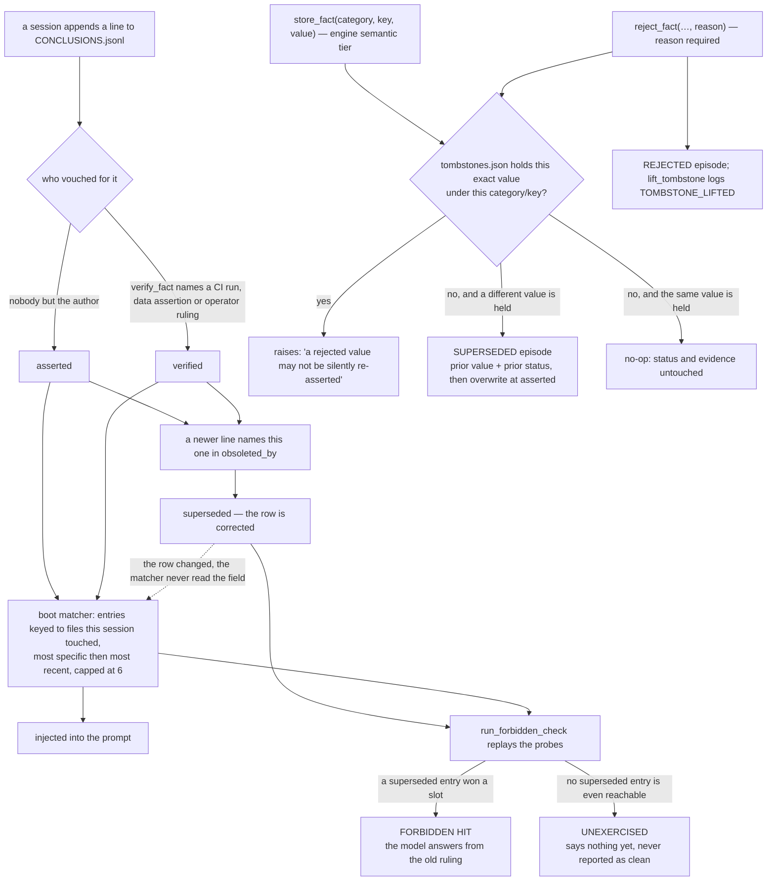

## 1. Executive Summary

breadcrumbs is a **copy-and-adapt kit**, not a library you install. 202 tracked
files at this commit, most of them markdown: templates for a rules file, a
session handoff, a decisions ledger and a settled-facts store; a CI kit of lint
guards and a fail-closed merge gate; pattern essays explaining each piece. MIT
licensed, no package manifest, no dependencies — every executable here is
stdlib Python 3 or POSIX shell. There being nothing to install is a stated
position rather than an omission: [`kit.json`](https://github.com/The-825/breadcrumbs/blob/abd08addf5f778fc8050894fe57eb1b0b57a8710/kit.json)
argues that *"a package would make our release cadence your dependency and fight
the adapt step"*, and offers a machine-readable inventory instead — eight
problem statements routed to artifacts, and per-artifact `assumes` and
`selftest` fields.

Two clusters of those files are a memory system, and they are the reason for
this report. The **ledger tools**, which is where the correction machinery
lives:

- [`templates/ledger-tools/memory_engine.py`](https://github.com/The-825/breadcrumbs/blob/abd08addf5f778fc8050894fe57eb1b0b57a8710/templates/ledger-tools/memory_engine.py)
  — 484 lines of three-tier file-native memory (working state, append-only
  episodes, semantic facts) for an agent loop you write yourself, carrying a
  rejected-value tombstone and an as-of replay.
- [`templates/ledger-tools/conclusions_audit.py`](https://github.com/The-825/breadcrumbs/blob/abd08addf5f778fc8050894fe57eb1b0b57a8710/templates/ledger-tools/conclusions_audit.py)
  — asks whether every ledger entry is still **true**.
- [`templates/ledger-tools/retrieval_exam.py`](https://github.com/The-825/breadcrumbs/blob/abd08addf5f778fc8050894fe57eb1b0b57a8710/templates/ledger-tools/retrieval_exam.py)
  — 1017 lines asking whether any entry can ever be **seen**.
- [`templates/ledger-tools/capture_nudge.py`](https://github.com/The-825/breadcrumbs/blob/abd08addf5f778fc8050894fe57eb1b0b57a8710/templates/ledger-tools/capture_nudge.py)
  — a prompt hook that fires when the operator's own wording looks like a
  ruling.

And the **memory desk**
([`templates/memory-desk/`](https://github.com/The-825/breadcrumbs/tree/abd08addf5f778fc8050894fe57eb1b0b57a8710/templates/memory-desk)),
a second and separate store built for the read side: a 60-line kernel, a
tab-separated fact index, an append-only capture journal, a 297-line `mem` CLI,
three harness hooks that push rows into context, and a written weekly curation
contract. Section 6 covers why it exists; the short version is in its own
essay, which designs *"for the weakest reader on their worst day"* and moves
every judgement call out of retrieval and into maintenance.

**The finding worth the reader's time is `run_forbidden_check()`**, landed in
[PR #22](https://github.com/The-825/breadcrumbs/pull/22) on 9 August 2026, five
days after the repository's first commit. It takes the entries marked
`obsoleted_by`, replays the boot
matcher against simulated session-start conditions, and names any superseded
entry that still wins a slot. The docstring states the argument: *"Correction
that stops at the ledger row and never reaches the retrieval lane is not
correction; the descent has to complete."* Several systems here test that a
corrected value stays out of a *query result* — [Verel](../verel/)'s suite
asserts a rejected fact is *"invisible to EVERY recall path"*. This one tests
the other read surface: the ranked, capped packet a session is handed **before
it asks anything**, where an entry can be missed by losing a tie-break rather
than by failing a filter. And the could-not-run case is a named verdict in the
tool's own output (`UNEXERCISED`) rather than a property of a fixture, so an
untested lane never reads as a clean one.

Two more things are unusually well judged. The exam's **survey mode**
(`--survey`) needs no ledger and no adoption at all: it walks a repo's markdown,
computes link distance from the boot surface (`CLAUDE.md`, `AGENTS.md`,
`README.md`, `.cursorrules`, `.github/copilot-instructions.md`), and reports
the *orphan* — a document nothing links, which a session never opens on its
own. And `memory_engine.verify_fact()` raises rather than writes when handed
empty evidence, which is the shortest possible statement of oracle-gated trust.

**Where it is weakest is the distance between the prose and the tree.**
[`docs/floating-memory.md`](https://github.com/The-825/breadcrumbs/blob/abd08addf5f778fc8050894fe57eb1b0b57a8710/docs/floating-memory.md)
describes a production memory layer in detail — an orphan git branch, a capped
head file, per-session append-only fold files, a projection computed at read
time, a trust rank, a reaper that greps merged history to check a fold's own
claim, an orphaned-branch matcher, a mishandled-claim SLA. None of that is in
this repository. `grep -rl fold --include='*.py'` at this commit returns only
the migration runner and a test-harness example, and `reaper` and `projection`
appear in no `.py` or `.sh` file at all. What ships is the smaller kit; what is
described is the system the kit was extracted from.

The essay itself opens by saying so, in a bolded header before the first
section: the fleet machinery *"runs in the system this pattern came out of and
does NOT ship in this kit"*, followed by a link to the ledger tools a reader can
copy today. That closes the entry point most likely to mislead, and it is the
only essay carrying such a header.
[`docs/breadcrumbs-whitepaper.md`](https://github.com/The-825/breadcrumbs/blob/abd08addf5f778fc8050894fe57eb1b0b57a8710/docs/breadcrumbs-whitepaper.md)
presents five mechanisms as the system, and two of them have no code path
in the tree: the recorder that refuses a completion claim while obligations
dangle (3.2), and the versioned handoff where a session acknowledges the state
version it booted on (3.4).

## 2. Mental Model

A memory here is **one line of JSON keyed to a repo path**. The schema is in
[`templates/CONCLUSIONS_TEMPLATE.md`](https://github.com/The-825/breadcrumbs/blob/e7940f325d6e102f53b782d50fc95ae75d9cdefa/templates/CONCLUSIONS_TEMPLATE.md):
`path`, `when`, `what` (one sentence, the durable fact), `evidence` (a PR
number, a commit SHA, a doc pointer), with optional `tags`, `relates_to`,
`obsoleted_by`, `supersedes`, and three provenance fields from
[`PROVENANCE.md`](https://github.com/The-825/breadcrumbs/blob/e7940f325d6e102f53b782d50fc95ae75d9cdefa/templates/ledger-tools/PROVENANCE.md)
— `src` (how it got into the ledger), `verified` (last checked against
reality), `by` (which surface wrote it, *"never a model identifier"*).

Nothing is extracted. A session writes a line because a human or the session
decided a fact would cost real time to re-derive. There is no embedding, no
consolidation pass, no summarizer.

**How a claim becomes a belief.** In `memory_engine.py` the semantic tier
carries a discrete `status` field. `store_fact()` writes `"asserted"`
unconditionally — the docstring is *"Nothing an agent stores starts verified."*
`verify_fact(category, key, evidence)` is the only promotion path and refuses an
empty oracle:

> "verified requires naming the oracle (a CI run, a data assertion, a human
> ruling); an agent may not mark its own claim verified with nothing behind it"

`build_context()` renders the state inline — `fact.env.python: >=3.11
[verified (ci run 4412 green on 3.11)]` — so a reader of the prompt sees the
oracle next to the claim, and an `asserted` fact is visibly one nobody checked.

**How a belief stops being one.** Never by editing. A wrong entry gets a newer
entry that names it: `obsoleted_by` on the old line (forward half),
`supersedes` on the new one (back half), in a dated pointer grammar
(`path`, `path@date`, `path@date#n`). The only sanctioned in-place edit on the
ledger is bumping `verified` on an unchanged claim, which records a
re-check rather than a rewrite. Two clocks then run over the survivors:
`conclusions_audit.py` marks an entry `STALE` when its keyed path is gone from
the tree and `AGING` when nothing re-verified it inside 180 days.

**How a value stops being admissible at all.** Supersession retires a *record*;
`reject_fact(category, key, value, reason)` retires a *value*. It writes a row
into `.memory/tombstones.json` keyed by `category/key` and then by the rejected
value itself, deletes the fact entry when that value is the one currently held,
and logs a `REJECTED` episode. From then on `store_fact()` raises rather than
writes when the same value arrives — the first thing it does, before it reads
`facts.json` at all. Lifting is a deliberate act with its own required reason
and its own `TOMBSTONE_LIFTED` episode, so the rejection and the reversal both
survive in the episodic trail even after the tombstone row is gone. The
docstring gives the reason a supersession alone is not enough: *"the next
session that re-derives the old value writes it right back, and nothing
remembers it was ever wrong."*

**And the part most designs skip.** Marking a row superseded does not remove it
from the lane. `CONCLUSIONS_TEMPLATE.md` tells adopters their matcher *should*
treat an `obsoleted_by` entry as excluded, and the exam's own model of a matcher
deliberately does not — `injected_for()` filters only `UNREACHABLE` — because
the exam exists to catch matchers that forgot. Running it against the shipped
sample reproduces the failure it was written for:

```
PART 4  FORBIDDEN HITS
  superseded=1  forbidden_hits=1
  FORBIDDEN: line 6 (key=templates/ledger-tools/union-merge.md) is
  obsoleted_by docs/removed-note.md and still injected on probe 'session
  editing the merge-behavior note'. The model sees the old ruling.
```

The check keys on the supersession marker, never on the value, and the reason is
pinned by a selftest: in a revert chain where a value goes A → B → A, the final
entry restating A is a legitimately current entry, and a check that tombstoned
by value would suppress it. That is a real distinction, correctly reasoned, and
it is why the two tiers are keyed differently — the hand-authored ledger on the
record, the engine's semantic store on the value. Section 5 is where that split
is worth arguing about.



## 3. Architecture

There is no server, no database, no daemon and no external dependency. The
runtime is `python3` and a git repository.

**What has to be running: nothing.** Adoption is copying files. The stores are
a `CONCLUSIONS.jsonl`, a `DECISIONS.md`, a `SESSION_STATE.md` at the repo root;
if you use the engine, a `.memory/` directory holding `session_state.json`,
`episodes.jsonl`, `facts.json` and `tombstones.json`; and if you use the desk, a
`memory/` directory holding `MEMORY.md`, `index.tsv` and `journal.jsonl`. Every
one is human-readable and repairable with a text editor, which is stated as a
design goal rather than an accident: retrieval is *"deterministic and
inspectable with cat and grep."* The desk states the same rule as a fallback
that its tests pin — *"grep -i '&lt;word&gt;' memory/index.tsv reads the same
rows; the tsv is the interface, mem is convenience."*

**Runtime shape.** Three things, with different lifetimes:

1. **A library.** `MemoryEngine` is imported into an agent loop you own. Its
   header says so first: *"ASSUMES an agent execution loop you control (you
   build the prompt, you call the model, you log what happened)."* It does not
   wrap a provider, does not ship an MCP server, and does not hook a harness.
2. **Harness hooks.** The memory-relevant ones span four events.
   `capture_nudge.py` (UserPromptSubmit),
   `templates/hooks/pre-compact-save.sh` (PreCompact),
   `post-compact-pointer.sh` (SessionStart, matcher `compact`), and the desk's
   trio: `session-start-memory.sh` (SessionStart), `prompt-index-hits.sh`
   (UserPromptSubmit) and `path_note_guard.py` (PostToolUse, matcher
   `Edit|Write|MultiEdit`). All fail open; the nudge catches every exception and
   returns 0 on principle, and the desk's hooks exit 0 on a missing desk, a
   missing `python3` and an unparsable payload alike.
3. **Report-only sweeps and one gate.** `conclusions_audit.py` and
   `retrieval_exam.py` are CLIs you run on a cadence or in CI. Neither writes to
   the ledger. The auditor exits 0 whatever it finds *"(this is a report, not a
   gate)"*; the exam exits nonzero only under `--fail-on-regression` or
   `--fail-on-forbidden`. The desk's `mem check` is the exception in posture —
   it exits 2 on a duplicate key, a dead source path, a malformed row, a bad
   journal line or a kernel past its 60-line cap, and it runs in this
   repository's own CI against this repository's own index.

**Concurrency.** Deliberate and honestly bounded. Episodes are append-only JSONL
so parallel writers do not contend, paired with a `merge=union` gitattributes
setting documented in
[`union-merge.md`](https://github.com/The-825/breadcrumbs/blob/e7940f325d6e102f53b782d50fc95ae75d9cdefa/templates/ledger-tools/union-merge.md).
`_write()` is atomic against a crash (temp file plus `os.replace`) and the
module header refuses to let that be mistaken for a lock: *"They do NOT make
concurrent read-modify-write safe: two agents updating session_state.json can
still lose an update."* The prescription is per-agent memory directories with a
shared episodic ledger.

**Cost to an operator:** an afternoon, and no infrastructure. That is the whole
pitch, and it is accurate.

## 4. Essential Implementation Paths

- **Capture (engine)** — `memory_engine.py`: `set_goal()`, `note(key, value)`,
  `log_episode(action, outcome, tags)`, `store_fact(category, key, value)`.
  `note()` re-inserts an updated key at the end of the dict so compaction's
  oldest-first flush orders by last update rather than first insertion.
  `store_fact()` on a key that already holds a *different* value writes a
  `SUPERSEDED` episode carrying the prior value and prior status before it
  overwrites, and the replacement re-enters at `asserted`; on a key that already
  holds the *same* value it returns without touching status or evidence.
- **Rejection (engine)** — `reject_fact(category, key, value, reason)` and
  `lift_tombstone(category, key, value, reason)`, at
  `templates/ledger-tools/memory_engine.py:209` and `:241`. Both refuse an empty
  reason, on the stated parallel that *"an unexplained rejection is as
  unauditable as an unexplained verification"*, and both log an episode.
  `store_fact()` consults `tombstones.json` at line 177 before anything else.
- **Capture (ledger)** — by hand, prompted by `capture_nudge.py`, which regexes
  the submitted prompt for ruling-shaped language (`\bruling\b`,
  `\bfrom now on\b`, `\bgoing forward\b`, clause-initial `always|never` with
  "never mind" excluded) and prints a same-turn reminder into the harness's
  context.
- **Compaction / promotion** — `MemoryEngine.compact()`: at
  `MAX_WORKING_ENTRIES = 8` the overflow is written to the episodic ledger as a
  `COMPACTION` row *before* the working file shrinks. The comment names the
  ordering guarantee: *"if the process dies between the two writes, the worst
  case is a duplicate episode, never a lost one."*
- **Retrieval / context assembly** — `MemoryEngine.build_context(query, as_of=None)`:
  newest-first episodes with exact keyword overlap promoted ahead of recency,
  capped at `MAX_EPISODES_IN_CONTEXT = 5`, emitted under a header that names its
  own limit: `=== MEMORY (retrieval: recency + exact keyword; no paraphrase
  match) ===`. Passing `as_of` cuts episodes at that timestamp, drops facts
  whose `recorded_at` is later, and extends the header with the exclusion and
  the one case it cannot cover.
- **Retrieval (desk)** — `templates/memory-desk/mem`: `lookup()` matches the
  normalised query against keys and aliases exactly, falls back to a token
  score weighting key and alias overlap 3× against answer overlap, and prints
  at most `MAX_HITS = 3` rows of three lines each. `--stdin` is the hook form
  and raises the floor to `MIN_HOOK_SCORE = 3`, so a prompt with no key overlap
  injects nothing.
- **Correction** — append a line with `obsoleted_by` on the old entry.
  `conclusions_audit._chain_issue()` resolves every pointer against the other
  ledger paths, the special paths, and the tree, and reports the ones that
  dangle.
- **Staleness** — `conclusions_audit._verdict_for()`: `SPECIAL` for
  `operations`/`domain`/`process`, `STALE` when `os.path.exists` fails on the
  key, `AGING` past `AGING_DAYS = 180` from `verified or when`, else `OK`.
- **Reachability** — `retrieval_exam.classify_reachability()` over
  `matched_files()`: glob keys via `fnmatch`, directory keys by prefix, exact
  paths by membership. More than `broad_fanout = 8` hits is `BROAD`; zero hits
  with no special key is `UNREACHABLE`.
- **Lane simulation** — `injected_for(probe, results, matcher)` ranks eligible
  entries by `(len(hits), -date.toordinal(), line_no)` and truncates at
  `injection_cap = 6`. `run_lane_probe()` diffs the injections across probes and
  reports `stuck` only when the lane was actually exercised.
- **Forbidden hits** — `run_forbidden_check()`, described above.
- **Survey** — `survey_repo()` builds a markdown link graph, BFS from the boot
  files, and classifies each document `booted` / `linked` / `deep` / `island` /
  `orphan`. `boot_weight()` reports the bytes and lines every session pays
  before any work happens.
- **Merge gating** — `ci-kit/workflows/greenlight_tiers.classify(files)` returns
  `AUTO` only when every changed file is an addition or modification inside
  `docs/`, `checklists/`, `README.md` or `planning/DECISIONS.md`; every deletion,
  every rename, an empty list and everything else returns `GATED`, which means
  the human approval label is required. `.github/workflows/automerge.yml` runs
  it from the base branch's checkout.
- **Integrity** — `mem check`: duplicate keys or aliases across rows, empty
  fields, a `checked` value that is neither a date nor `-`, a `source` path that
  resolves at neither the desk directory nor the repo root, a malformed journal
  line, a kernel past its cap. Exit 2 on any of them.
- **Tests** — six `--selftest` entry points and one unittest suite, 115 checks
  total, all offline against `tempfile` fixtures or the shipped kit itself.

### Two clocks, and a scope filter with no caller

`compose_context` takes `as_of`, `valid_at` and `audience`, and the three are
independent read-time masks over storage that is never modified.

`as_of` replays the **learned-at** axis and `valid_at` the **valid-at** axis;
the docstring states the composed question — *"as_of + valid_at asks 'what did
we believe at T about what was true at T2', the stale-belief postmortem
query"* — which is the query this atlas asks of every store and almost never
gets. Facts with no stamp are always included rather than silently dropped, and
the assembled header announces which filters ran, so a reader of the context can
tell it is a partial view.

The detail that makes the replay honest is on the trust axis. A fact whose
status is `verified` but whose `verified_at` is absent or later than `as_of`
renders as `asserted`, with the reasoning in the comment: the memory knew the
*value* by then, verification either has no timestamp *"(unknown, so never
assume it)"* or happened afterwards, so *"replay the honest state."* Most
as-of replays in this corpus rewind the value and leave the confidence at
today's level, which is the anachronism that makes a postmortem flattering.

`audience` filters a three-level scope lattice — `public < internal <
regulated` — at assembly. Two decisions in it are worth taking. A fact carrying
no scope field **counts as internal**, so pre-scope data fails closed against a
public audience rather than defaulting to the most permissive value. And when
any audience is set, the episodic tier is omitted **entirely**, because
supersession episodes embed prior values and would leak a regulated fact through
the audit trail — a side door the module's own selftest found, with the date in
the comment.

**`scope_enforced` is still withheld, and the reason here is not the usual
one.** In most systems the mark fails because a caller omits the filter; here
there is no caller at all. `compose_context` has no invocation anywhere in the
tree outside its selftest and the golden exam, because the engine ships as a
library for a loop the adopter writes. The scope key is stored, the filter is
real, and whether it is applied is a decision this repository does not make.

### Replay that is not allowed to conclude anything

`governed_replay.py` selects episodes for offline review and turns an external
evaluator's output into a typed proposal — and spends its docstring refusing the
implications of its own metaphor: *"The 'dreaming' analogy means replay during
an offline maintenance window. It does not imply feeling, consciousness, or
permission to trust the replay's own conclusions."* Every proposal preserves its
source episodes, carries `mutates: false`, and must pass a later authority gate
before anything durable changes; a missing or failed evaluation stays `unknown`
rather than becoming an absence. Several systems in this atlas run a nightly
"dream" pass that writes straight into the store; this is the same idea with the
write end removed and the reason written down.

## 5. Memory Data Model

Seven stores, all flat text.

| Store | Shape | Correction model |
| --- | --- | --- |
| Conclusions (`CONCLUSIONS.jsonl`) | One JSON object per line, keyed by repo path | Append + `obsoleted_by` / `supersedes` pointers |
| Decisions (`DECISIONS.md`) | Numbered prose entries, newest last | A "Superseded by D-n" line added to the old entry |
| Corrections (`CORRECTION_LEDGER`) | JSONL: `date`, `zone`, `oracle`, `tier`, `ref`, `note` | Append-only, never edited |
| Search misses (`SEARCH_MISSES`) | JSONL: `query` verbatim, `where_searched`, `suggested_home` | Append-only, never edited |
| Engine (`.memory/`) | `session_state.json`, `episodes.jsonl`, `facts.json`, `tombstones.json` | Working tier rewritten, episodes appended, a fact overwritten in place behind a `SUPERSEDED` episode, a rejected value refused at the door |
| Desk index (`memory/index.tsv`) | Five tab-separated fields: `key`, `aliases` (pipe-separated), `answer` (one line), `source`, `checked` | Rewritten in place by the weekly gardener pass, in a reviewed PR |
| Desk journal (`memory/journal.jsonl`) | One JSON object per line: `ts`, `type` in `fact\|decision\|gotcha\|todo\|state`, `text`, optional `key` and `source` | Append-only; the gardener promotes and never rewrites |

**Temporal fields.** In the ledger, `when` (the date the conclusion was reached)
and `verified` (the date it was last checked). `CONCLUSIONS_TEMPLATE.md`
describes a believed-as-of-X filter over them — *believed at X iff `when <= X`
and (no `obsoleted_by`, or its date is absent or later than X)* — which is the
shape of a bi-temporal query, and no code implements it. In the engine there is
a filter: `store_fact()` stamps every fact with `recorded_at`, and
`build_context(as_of=…)` drops facts stamped later and truncates episodes at the
cutoff. **That is one axis, and the docstring says which one**: *"This filters
learned-at only; a valid-at axis (when the fact was true in the world) is a
schema decision for your ledger, not this engine."* So the mark is withheld,
correctly and by the project's own account: "what did we know on Tuesday" is
answerable, "what was true on Tuesday" is not.

**What the replay does not replay is the trust axis**, and that is the sharper
limit. `verify_fact()` mutates the entry in place, writes no episode and does
not touch `recorded_at`, so a fact stored before the cutoff and verified after
it renders under `as_of` with the *later* oracle. Running the engine's own
worked example at this commit — store `env/python`, verify it against `ci run
4412`, take a cutoff, then verify it again against a run dated after the
cutoff — a replay at that cutoff prints:

```
fact.env.python: >=3.11 [verified (ci run 9999 green, run AFTER the cutoff)]
```

The header names its unstamped-facts limit and not this one. The replay answers
which facts existed, not what was believed about them, which is the question a
stale-belief postmortem usually has. The fix is the same missing piece section 9
names: an episode on promotion would make the status reconstructable, and
nothing writes one.

**Scoping.** The `path` key is a *relevance* key. `injected_for()` applies it as
a read-path predicate against the files a session touched, which is
mechanically the same operation a scope filter performs, but it answers "is this
about what I am working on", never "am I allowed to see this". There is no
user, tenant, project or agent key anywhere in the schema. For a single-operator
kit that is the right call, and it is why the scope mark is a dash rather than a
defect.

**The tombstone, and the one tier that has it.** `tombstones.json` is a durable
record keyed on the rejected value, consulted on the write path, and it earns
the mark: `store_fact()` reads it before it reads anything else and raises
rather than writes when the incoming value matches. Refusal is the whole
mechanism — there is no silent drop, no shadow row, no status the caller has to
remember to check — and the error text names the reason recorded at rejection
and the deliberate way out. The tombstone is scoped to the `category/key` it was
written for, which is right: I rejected `postgres 14` under `env/db` and the
same value still stored under `infra/db` and under `env/database`, because the
rejection was a statement about that key and not about that string.

**It covers one of the two stores that matter, and the flagship is the other
one.** The conclusions ledger — the artifact the kit is named around, the one
`retrieval_exam.py` audits — keys corrections on the *record*, through
`obsoleted_by`, and the project reasons about the value-keyed alternative there
explicitly and rejects it. From the revert-case selftest comment: a value that
flips A → B → A ends with a current entry restating A, so *"tombstoning by value
would be wrong and the check keys on supersession markers instead."* That
reasoning is correct for a hand-written ledger where nothing re-extracts. It
stops being correct the moment a model mines facts back into the store, and the
schema anticipates exactly that case — `PROVENANCE.md` describes a backfill pass
mining facts out of git history, and `CONCLUSIONS_TEMPLATE.md` warns that one
such backfill *"swamped the session-verified entries and wrecked lookup
precision."* A re-mining pass that re-derives a superseded fact writes a new line
with a new date and walks past every `obsoleted_by` in the file. The engine's
tombstone does not reach it: they are different stores with different write
paths, and nothing in the ledger tooling consults `tombstones.json`.

So the honest reading of this repository is a split. It is the clearest case in
the corpus of a project that reached the value-keyed question, answered *no* for
a store where the answer is defensible, and *yes* for the store where
re-derivation is the actual risk — and the revert-chain argument is why the two
answers are not a contradiction. What remains is that the backfill hazard the
project documents lives on the side that answered no.

Two boundaries on the mark, both narrow. The tombstone binds `store_fact()`
only: `note()` will still put a rejected string in the working scratchpad, which
is a scratchpad and not a claim. And the key is `str(value)`, so `3` and `"3"`
are one entry — conservative in the safe direction, since the collision refuses
more than it admits.

## 6. Retrieval Mechanics

Three retrievers, all keyword-exact, all deterministic, none semantic.

**The engine's.** `build_context()` splits the query on whitespace, drops tokens
of two characters or fewer, intersects against `action + " " + outcome`
lowercased and split, puts matches ahead of pure recency, and caps at five
episodes. The header string tells the model what it is not getting. There is no
scoring, no fusion, no reranking, no embedding — and the docstring says to add
semantic recall as a separate layer rather than pretend this one has it.

**The modelled one.** `retrieval_exam.Matcher` is not a retriever; it is a model
*of* the reader's retriever, and the script is unusually careful that the
difference stays visible:

> "If your real matcher diverges from the model, the numbers describe the model
> and not your system, which is worse than no numbers."

The four config keys (`special_paths`, `injection_cap`, `recency_field`,
`broad_fanout`) are the whole surface, and `docs/memory-measurement.md` names
the cap as the number to check first because *"it is almost always smaller than
people remember."*

**The desk's, which is the design argument rather than an implementation
detail.** `mem <words>` normalises the query, tries an exact match against every
key and alias, and only then falls back to a token score that weights key and
alias overlap three times as heavily as answer overlap. A hit is three lines:
answer, source, checked date. Three hits maximum. Everything about it is an
answer to a stated failure — [`docs/memory-desk.md`](https://github.com/The-825/breadcrumbs/blob/abd08addf5f778fc8050894fe57eb1b0b57a8710/docs/memory-desk.md)
argues that *"every memory system in this kit was written by strong models on
high effort, and most of it will be read by weak ones on low"*, and that the
weak session fails at judgement rather than at execution, so *"take every
judgment out of retrieval and move it into maintenance."*

Two consequences are worth lifting whatever you think of the premise. **A miss
is an instruction, never a bare "not found":** a failed lookup prints a scoped
`grep -ril '<token>'`, then a narrow read, then the exact `mem add` line that
writes the answer back, because a dead end invites a guess. And **the push
half** carries the retrieval the model never asks for: the kernel is injected at
`SessionStart`, the prompt is run through the index at `UserPromptSubmit`, and a
row aliased `file:<repo-relative-path>` is injected on the first `Edit`, `Write`
or `MultiEdit` against that file, which is the moment a gotcha about it matters.
`path_note_guard.py` explains its own event choice: `PostToolUse` rather than
`PreToolUse` because on this harness a pre-hook's plain stdout never reaches the
model and the JSON form that does would also carry a permission decision, *"which
an informational hook must not touch."*

The push half is also where the freshness discipline lands on the reader: every
row prints its `checked` date, and a row unchecked for more than
`STALE_DAYS = 90` prints `STALE, re-verify at the source` inline. The stated
goal is that the reader *"learns to trust dated answers and to re-verify flagged
ones"*. There is no verification behind the date — the essay says so, in a
section headed what the desk is not: *"the desk does not verify its own answers
beyond dates and dead links; a row is as good as its last gardening."*

**The failure modes this is built around are stated better than most systems
state their successes.** An `UNREACHABLE` entry is *"correct, well written, and
silently absent from every session that needed it"* — worse than no entry,
because no entry leaves a visible hole. A `BROAD` key fires constantly and
therefore *"wins the lane on traffic rather than on relevance."* A `stuck` lane
means a corpus scoring healthy while every session receives the same handful of
entries. And `run_use_readout()` names dead weight: an entry injected on every
probe with no `use_count`, paying boot tokens forever.

**Token budgeting** is a first-class concern and measured rather than estimated.
Survey mode's `boot_weight()` prints what the boot surface costs; the recorded
run of this repo against itself (2026-08-06, in `docs/memory-measurement.md`)
is 117 markdown documents, two booted, *"376 lines and 20,052 bytes charged to
every session."* Running `--survey` against this commit gives the same shape a
little heavier: 123 markdown documents, `CLAUDE.md` and `README.md` booted at
402 lines and 22,421 bytes, 121 linked, and zero orphans, islands or deep
documents. A repository that scores its own signage and keeps the orphan count
at zero while adding files is the demonstration the tool needs. The desk's
kernel cap is the same concern enforced instead of measured: `mem check` fails
the build past 60 lines, and the shipped kernel sits at 47.

## 7. Write Mechanics

**Nothing extracts.** Every write is a human or a session choosing to write, so
the entire class of extraction failures — hallucinated facts, over-eager
summarization, a consolidation pass rewriting a claim — does not exist here.
Neither does the coverage those mechanisms buy: what nobody writes down is not
remembered.

**What the desk changes is the price of writing, not who writes.** Its argument
is that same-turn capture is the right rule and fails for a specific reason:
*"capturing well is expensive"*, and choosing the right ledger, phrasing the
entry and finding the source mid-task is exactly the load that gets dropped
under pressure. So `mem add` has no quality bar beyond one typed sentence, the
journal is append-only, and a weekly gardener pass promotes durable entries into
index rows, dedupes, re-verifies stale rows at their sources and retires rows
with stated reasons. The contract is written down in
[`gardener/GARDENER.md`](https://github.com/The-825/breadcrumbs/blob/abd08addf5f778fc8050894fe57eb1b0b57a8710/templates/memory-desk/gardener/GARDENER.md)
with an ordered pass, a watermark appended last so nothing is processed twice,
and one boundary that is the reason the split works: *"Retire, never silently. A
retired row is listed in the PR body with one line of reason."* The pass itself
is prose — a contract for an agent or a person to follow, not a script — and the
companion `gardener.yml` template does the zero-dependency thing on a weekly
cron: count the journal entries past the watermark and open an issue.

**Nothing blocks.** `store_fact()` and `log_episode()` are file appends and a
JSON rewrite, no model call on the path. Lag from write to retrievable is a
filesystem write. No background pass re-reads or rewrites the store; the two
sweeps are read-only and invoked by hand.

**Append vs update.** Append-only for episodes, corrections, search misses and
the desk journal. The conclusions ledger is append-only by convention with one
sanctioned in-place edit (`verified`); the desk index is rewritten by the
gardener in a reviewed PR. The engine's `facts.json` is the exception in shape —
`store_fact()` overwrites `facts[category][key]` outright — but the overwrite is
not a silent one. When the incoming value differs from the stored one, the prior
value and prior status go to `episodes.jsonl` as a `SUPERSEDED` row first, and
the replacement re-enters at `asserted` rather than inheriting the oracle that
vouched for a value it no longer holds. That is the supersession discipline the
rest of the kit is built on, reaching the tier that sits furthest from the
ledger, and three selftests pin it.

**Restating an unchanged value is a no-op on every field.** The same-value
branch returns before touching status, evidence or `recorded_at`, so a fact
verified against a named oracle survives being written again with the value it
already holds. Running the module header's own worked example against this
commit — `store_fact("env", "python", ">=3.11")`, `verify_fact(…, evidence="ci
run 4412 green on 3.11")`, then the same `store_fact` again — leaves the entry
`verified` with its evidence intact and `episodes.jsonl` carrying no
`SUPERSEDED` row. Two committed checks pin both halves: that the restatement is
not a supersession, and that it keeps the status and the evidence. The
docstring's claim that *"a verified fact cannot vanish without a trace"* holds on
every path through the setter.

**Conflict handling.** None automatic. Two contradicting lines both live until a
human writes the pointer. `docs/memory-measurement.md` calls this out as the
fifth thing, the one that corrupts every other measurement — an entry whose
prose says it corrects an earlier one but carries no machine-readable pointer
*"is still live. It still ranks. It still competes for a capped injection lane
against the very entry that replaced it."* The prescribed fix is a scan that
**proposes** pointers for a human to rule on, restricted to the same key with a
strictly earlier date, *"because a wrong supersession pointer silently deletes a
live fact from every future injection."* That scan is described and not shipped.

**Filtering hostile input.** The kit's answer is at the write boundary, not the
read one:
[`SEARCH_MISSES.md`](https://github.com/The-825/breadcrumbs/blob/abd08addf5f778fc8050894fe57eb1b0b57a8710/templates/ledger-tools/SEARCH_MISSES.md)
requires screening the verbatim `query` field before append, because it is the
one field that captures whatever the user typed. `templates/hooks/outbound-pii-screen.sh`
is the shipped screen. On the read side the only guard is a threshold: `mem`'s
hook mode requires a score of 3 — one whole key or alias token — before it will
inject a row, which its own contract explains as keeping a weak match from
riding into the prompt. That is a noise floor rather than a defence, and the
rows it gates are ones a person curated.

## 8. Agent Integration

Claude Code is the assumed harness and the integration is entirely
convention-plus-hooks. `CLAUDE.md` is the boot surface; `SESSION_STATE.md` is
read first and refreshed on a spoken trigger word (*"Refresh it on a trigger
word you say out loud, not on 'keep it updated,' which means never"*);
`planning/DECISIONS.md` takes rulings the same turn they land.
`templates/commands/` holds 29 slash-command definitions, `templates/hooks/` and
`templates/memory-desk/hooks/` the harness-side scripts, and the desk ships a
`settings-snippet.json` wiring its three so adoption is a paste rather than a
transcription.

**A second, machine-facing surface.** `llms.txt` is the same map written for an
agent reading the repository — eight problem-shaped headings, one line per
artifact, the boot-file convention followed rather than described — and
`kit.json` is its structured twin, carrying an `assumes` string and a `selftest`
command per artifact. `ci-kit/kit_manifest_check.py` runs in CI and fails when
any artifact path, problem route or selftest script in the manifest does not
resolve, on the stated reasoning that *"manifest rot is silent because nothing
reads the manifest in this repo's own workflow."* It also holds the manifest to
its own promise about CI: `verify_all` says *"CI runs the same set,"* and every
selftest script named in `kit.json` must appear in
`.github/workflows/ci.yml` or the check fails, with two committed cases pinning
both verdicts. The guarantee is a substring test against the workflow text
rather than a claim that the step runs, so a script named only in a comment
would satisfy it — which is a small hole in a check that closes a real one.

**Agency over memory is direct at the desk and reviewed at the branch.** A
session writes a ledger line or journals a fact with no gate in the way; the
refusals inside the code are `verify_fact()` declining an empty oracle,
`reject_fact()` declining an empty reason and `store_fact()` declining a
tombstoned value. What sits above all of them is the merge gate in section 9.
The heavier refusals the whitepaper describes — a done-claim refused while
obligations dangle, a park requiring exactly one named accountable owner —
belong to the fold CLI, which is prose here.

**Compaction is handled explicitly**, and it is the neatest piece of harness
work in the repo. `pre-compact-save.sh` copies the full transcript JSONL to
`$HOME/.claude/compaction-saves` before every compaction, keeps the twenty
newest, and writes a `LATEST` pointer. `post-compact-pointer.sh` fires on
`SessionStart` with matcher `compact` and tells the fresh context where the save
landed, closing with the right instruction: *"Repo files stay the source of
truth for anything the summary paraphrases; trust them over the summary wherever
they disagree."* Saves live outside the repo on purpose, because a transcript
can contain anything the session touched.

**Portability.** The `BOOT_FILES` list in `retrieval_exam.py` covers
`CLAUDE.md`, `AGENTS.md`, `GEMINI.md`, `.cursorrules` and
`.github/copilot-instructions.md`, so survey mode is genuinely harness-neutral.
The hooks are Claude Code event names and would need porting. The whitepaper is
precise about how far the cross-vendor claim reaches: other vendors' models read
and review the system, but *"No non-Claude model has yet run the full write loop
as a participating member of the memory, so the portability claim covers reading
only."*

## 9. Reliability, Safety, and Trust

**The trust ladder is the design's spine**, and it is stated identically in code
and prose: human ruling, then oracle-verified, then asserted by a capable tier,
then asserted by a working tier, then unattributed — with only the unattributed
rank quarantined, on the argument that quarantining most of the fleet's memory
*"would train everyone to ignore the lane, which is worse than no lane."* That
is a judgement about adoption, made explicitly, and it is right.

The
[correction ledger](https://github.com/The-825/breadcrumbs/blob/e7940f325d6e102f53b782d50fc95ae75d9cdefa/templates/ledger-tools/CORRECTION_LEDGER_TEMPLATE.md)
sharpens it into an admission rule with four oracles — `ci_failure`,
`data_assertion`, `operator_ruling`, `reverted_pr` — and one exclusion that
several systems in this atlas would benefit from adopting:

> "Model-vs-model disagreement is never a correction. A stronger model
> 'disagreeing' with a cheaper one has no ground truth behind it, and neither
> does a model's own audit pass."

**Provenance.** `by` records the writing *surface*, never the model, on the
reasoning that model names date fast while a surface name tells you which
workflow to distrust when a class of entries turns out bad. `src` and `evidence`
are kept distinct — how the entry got in versus how a reader checks it — which
matters exactly once, when a backfill pass mines old facts and the two diverge.

**Prompt-injected false memory** is not defended against and the kit does not
claim otherwise: the whitepaper lists adversarial settings as addressed *"only
by the trust ladder's quarantine rank and the append-only forensic trail"* and
says they deserve fuller treatment.
[`docs/memory-threat-model.md`](https://github.com/The-825/breadcrumbs/blob/e7940f325d6e102f53b782d50fc95ae75d9cdefa/docs/memory-threat-model.md)
names four failure modes — unauthorized leakage, stale propagation,
contradiction persistence, provenance collapse — and maps each to the mechanism
answering it. It is a documentation pattern, not a mechanism, and says so.

**An audit log of memory mutations, covering the value axis and not the trust
axis.** `episodes.jsonl` is append-only, lives in the engine's own store rather
than in git, and carries four kinds of mutation row: `COMPACTION` naming the keys
a working-tier flush evicted, `SUPERSEDED` naming a semantic fact's prior value,
prior status and replacement, and `REJECTED` and `TOMBSTONE_LIFTED` naming a
value refused and a refusal reversed, each with its required reason. That is a
record of what changed, in the store, and it earns the mark. What it does not
cover is the trust axis: `verify_fact()` promotes a fact to `verified` and writes
no event. In a design whose spine is the trust ladder, the ladder is the one
thing the log does not watch — and section 5 is where that costs something, since
an as-of replay can reconstruct which facts existed and not what vouched for
them. Git history covers the file-based ledgers and is a different mechanism.

**The review surface is the merge gate, and it is fail-closed.**
[`.github/workflows/automerge.yml`](https://github.com/The-825/breadcrumbs/blob/abd08addf5f778fc8050894fe57eb1b0b57a8710/.github/workflows/automerge.yml)
squash-merges an agent-branch PR only after a person applies the `greenlight`
label on top of green required checks, with the label read from a fresh
`pulls.get` rather than from the triggering event's frozen payload, a missing
labels array counting as unlabeled, and every path — `workflow_run`,
`pull_request`, `workflow_dispatch` — funnelled through one `considerPR()`. The
memory here is files in git, so that label is the act of a person approving what
goes into the shared store, and the desk's curation contract routes explicitly
through it: *"The gardener proposes; a human merges."* The mark is earned on
that.

It is worth being exact about what it is. It is a repository gate, not a memory
gate: there is no reviewer field on a row, no approved status, nothing in any
store recording that an adjudication happened. It governs what reaches `main`,
not what the session that wrote the line reads back from its own working tree.
And the shipped policy exempts one of the stores.
[`ci-kit/workflows/greenlight_tiers.py`](https://github.com/The-825/breadcrumbs/blob/abd08addf5f778fc8050894fe57eb1b0b57a8710/ci-kit/workflows/greenlight_tiers.py)
lets a PR merge unlabeled when every changed file is an addition or modification
inside `docs/`, `checklists/`, `README.md` or `planning/DECISIONS.md` — and
`planning/DECISIONS.md` is the decisions ledger, a memory store in the table in
section 5. A ruling can therefore land on `main` on green alone, while a
conclusions line, keyed anywhere else in the tree, waits for the label. The
argument for tiering is stated and good — *"a blanket approval-label gate scales
the operator, not the system. Past a few PRs a day the label becomes a rubber
stamp applied in batches, which is worse than no gate, because it still LOOKS
like review"* — and everything else fails closed: deletions and renames always
gate, an unreadable input gates, an empty changed-files list gates, and the gate
runs the base branch's copy of the policy so a PR cannot loosen the rule on
itself. The exemption is a deliberate line drawn at a store rather than at a
risk, and it is the one place the policy and the memory model disagree.

Beside it the kit ships `greenlight-all.yml`, which batch-applies the label to
every green agent PR on one dispatch. It is a template and is not installed
here, and its header argues the dispatch *is* the operator's approval action —
but it is also, precisely, the batch rubber stamp the tiering rationale names.
Shipping both is coherent only if an adopter reads the second argument before
copying the first file.

The report-only posture is unchanged everywhere else and is the reason the gate
carries the weight: *"the auditor never writes"*, *"propose rather than apply"*,
*"Humans move the dials"*. The auditor's `--file-tasks` flag prints the issues a
tracker integration *would* file and `file_tasks()` is labelled a stub seam.

**Race conditions** are named rather than solved, which is the correct outcome
for a file-native design and is documented at the point of the danger rather
than in a footnote.

## 10. Tests, Evals, and Benchmarks

**No paper.** Grepping the tree for `arxiv`, `bibtex`, `@article`, `@misc`,
`doi`, `CITATION.cff` returns only the authority-citation guard, which is
unrelated. `docs/breadcrumbs-whitepaper.md` is a 403-line self-published essay,
not an indexed preprint, and it carries no evaluation.

**A golden retrieval corpus, which the corpus above mostly lacks.**
`memory_engine_golden.json` holds five synthetic cases and
`memory_engine_exam.py` replays them through the real engine in a temporary
directory. The shape is the part worth copying: **every case names an `expect`
list and a `forbid` list** — strings that must appear in the composed context and
strings that must not — so each case is a positive and a negative assertion over
the same assembly. `repeat: 2` on a case demands identical rendering both times,
which turns determinism into a checked property rather than an assumption. The
five cases cover fusion preferring a relevant older event over an irrelevant
newer one, a public audience failing closed against a regulated fact *and*
against the episodic tier, and learned-time replay excluding a fact recorded
after the cutoff. The header of the file states the limit itself: *"The corpus is
synthetic and public-safe."* Five hand-written cases measure that the pipeline
does what its author intended, not that recall is good — but a `forbid` list on
every case is a discipline this atlas asks for repeatedly and finds in a handful
of repositories.

**What is tested.** Six offline selftests and one unittest suite, which I ran
against the pinned commit on 2026-08-09, no dependencies installed:

| Script | Checks | Result |
| --- | --- | --- |
| `memory_engine.py --selftest` | 23 | all passed |
| `conclusions_audit.py --selftest` | 8 | all passed |
| `retrieval_exam.py --selftest` | 27 | all passed |
| `ci-kit/preflight/preflight.py --selftest` | 19 | all passed |
| `ci-kit/kit_manifest_check.py --selftest` | 7 | all passed |
| `ci-kit/workflows/greenlight_tiers.py --selftest` | 10 | all passed |
| `templates/memory-desk/tests/test_mem.py` | 21 | all passed |

`kit_manifest_check.py` against the real `kit.json` also passes — *"clean (every
path and selftest resolves)"* — and `mem check` against the shipped desk
reports *"memory ok: 13 rows, kernel 47/60 lines"*.

I also ran the exam over the committed fixture pair
(`sample_conclusions.jsonl` + `sample_probes.json`) against the repo tree, which
reproduced the documented output exactly: one `UNREACHABLE` entry, four distinct
injections across four probes, one dead-weight entry, and the one `FORBIDDEN`
hit quoted in section 2.

**The desk's suite is subprocess-driven end to end**, which is the right choice
for a tool whose contract includes exit codes: each test runs the real
executable against a throwaway desk and asserts the code a session would
actually get — 0 on a hit, 1 on a miss, 2 on a usage error or an integrity
failure. Its last class runs the *shipped* kit through its own gate, so the
template cannot rot without failing the build that carries it. One of its cases
is a negative assertion of a familiar shape on an unfamiliar surface:
`test_stdin_hook_mode_is_quiet_on_miss` asserts that a prompt with no index
overlap produces empty stdout, which is a committed case that particular
material must not be injected into a turn's context.

**The negative assertions are real and specific.** Four of the exam's 27 checks
assert about material that must *not* surface:

- a superseded entry keyed to a touched file **is** a forbidden hit;
- a superseded entry keyed to an untouched file is **clean**;
- a superseded entry that is unreachable reports **unexercised, never clean**;
- a revert chain (A → B → A) injects the *current* entry and reports **no** hit.

The third is the one worth copying. Several suites here defend against a vacuous
pass through fixture design — [Omi](../omi/) asserts the memory a user reviewed
away is absent *while the other three are present*. This one puts the
distinction in the verdict vocabulary instead, so "the bad thing did not happen"
and "the bad thing could not have happened" stay separate even after somebody
edits the fixture.

**The memory checks are inside the gate.** `.github/workflows/ci.yml` runs the
guard tests, the migration-runner tests, the decision-gate tests, the
memory-desk tests, the manifest check, a `Ledger-tool self-tests` step invoking
five `--selftest` entry points, the PII guard over the tree and the provenance
guard over the PR's commits. The step's comment carries the argument: *"The
memory tools guard everything else, so they cannot live outside the gate that
guards everything else… A report that exists only when someone remembers to run
it is not a safeguard, and neither is a selftest."* All 115 checks fail the
build when they fail.

**One tool runs against live data and the sharper one does not.** `mem check`
runs in CI against `templates/memory-desk/index.tsv`, the repository's own
thirteen-row fact index, so a source path that stops resolving or a key that
collides breaks the build rather than waiting for someone to notice. No step
runs `retrieval_exam.py --fail-on-forbidden` against a ledger, because the only
conclusions ledger in the tree is `sample_conclusions.jsonl` — a fixture built
to produce exactly one forbidden hit, so a gate over it would fail every build
by construction. The kit ships the ratchet and cannot run it on itself. Closing
that needs a conclusions store of the repository's own, which the repository
does not keep; the tool's sharpest mode is proven against fixtures and unproven
against a live corpus.

Second, and unchanged: nothing here is measured. The whitepaper's evidence is *"incidents
caught and work not redone, counted by hand"*, the limitations section says
numbers *"will follow rather than be promised"*, and section 4.5's archive audit
(216 conversations, ~1,300 turns) counts re-derivations in the operator's own
history rather than evaluating the system. The README describes a probe that
would bear on the desk's central claim — planted-trap questions put to a light
tier and a heavy one, with the light tier reported to answer *"the traps the
system carries as well as the heavy one does"* — and no trap set, no protocol
and no result is committed to the repository. That is a fair and unusually plain
accounting elsewhere, and it means there is no retrieval-quality result to
report.

## 11. For Your Own Build

### Steal

- **Test that the correction reached the prompt, not just the row.** Replay your
  boot matcher against a handful of realistic session-start conditions and
  assert that no entry you have marked superseded wins a slot. This is a few
  dozen lines against a store you already have, and it catches the failure where
  the correction landed, the row is right, and the model still answers from the
  old value.
- **Keep "could not run" separate from "passed."** `UNEXERCISED` for a lane no
  probe touched, `unexercised` for a forbidden check with nothing reachable to
  catch. A negative suite that reports green when it had no opportunity to fail
  is worse than none, because it retires the question.
- **Refuse `verified` without a named oracle, in the setter.** Twelve lines,
  raises rather than writes, and it converts "the model said so" from a default
  into something a caller has to lie about deliberately.
- **Measure reachability, not just truth.** A staleness sweep and a reachability
  sweep catch disjoint failures; an entry can be perfectly true and structurally
  invisible, and only the second sweep can tell you.
- **Ratchet reachability in CI, and watch the subtle regression.** More
  unreachable entries is obvious. *Fewer precise entries at the same total* is
  the one people miss, because re-keying a specific entry to something broad
  reads as tidying up and is a downgrade.
- **State the retrieval limit inside the injected block.** `=== MEMORY
  (retrieval: recency + exact keyword; no paraphrase match) ===` costs one line
  and tells the model what it is not being shown.
- **Exclude model-vs-model disagreement from your correction signal.** A
  self-improvement loop trained on opinion optimizes a proxy.
- **Record the writing surface, not the model.** When a class of entries turns
  out unreliable you need to know which workflow produced them.
- **Log the prior value before an overwrite, in the same call.** Six lines in
  `store_fact()` turn a destructive write into a supersession with a trace, and
  they belong beside the assignment rather than in a wrapper a caller can skip.
  Reset the replacement to your lowest trust state while you are there: a new
  value inheriting the old value's oracle is the quietest way a store starts
  lying. Then check for the adjacent case, which is the one that bites: a write
  that changes nothing must change *nothing*, not silently reset the fields the
  differing-value branch was written to reset.
- **Make a rejection refuse, and make it require a reason.** `reject_fact()`
  raises on an empty reason on the stated parallel that an unexplained rejection
  is as unauditable as an unexplained verification, and the value it wrote
  makes the next `store_fact()` of that value raise rather than quietly drop.
  Loud refusal on the write path is what turns a tombstone from a record into a
  guarantee, and the deliberate `lift_tombstone()` — with its own reason and its
  own logged event — is what keeps it from becoming a wall.
- **A miss should print the next command, not a dead end.** The desk's failed
  lookup emits a scoped grep, then a narrow read, then the exact write-back
  line. A bare "not found" is an invitation to answer from recall, and the
  cheapest sessions accept it.
- **Split capture from curation when capture keeps not happening.** One
  unpolished journal line in the turn, a scheduled pass that promotes,
  deduplicates and sources it later. The quality bar that was blocking the
  write moves to where someone has time for it, and the fact survives the turn
  it appeared in — which is the only thing that was ever at risk.
- **Tier your review gate by diff, and write the tiers as code.** A blanket
  approval label becomes a batch rubber stamp that still looks like review.
  `greenlight_tiers.py` is a hundred lines that decide which PRs still need a
  person, fails closed on every unknown, always gates deletions and renames, and
  runs from the base branch so a PR cannot widen its own safe set. Check the
  safe set against your *stores*, not just against your risk: a memory ledger
  that lands unreviewed because it looks like documentation is the failure this
  otherwise-careful policy makes easy.
- **A manifest that routes problems to files beats a package, for a kit meant to
  be edited.** `kit.json` gives an agent a machine-readable path from "my agent
  forgets everything between sessions" to four files and their selftests,
  without making the author's release cadence an adopter's dependency — and a CI
  check that every path in it resolves is what keeps it from rotting into a
  wild-goose chase.

### Avoid

- **Do not let a "should" in your schema doc stand in for a filter in your
  matcher.** `CONCLUSIONS_TEMPLATE.md` tells adopters to exclude superseded
  entries from current knowledge. The exclusion exists in exactly one place at
  this commit — the check that detects its absence.
- **Do not let a gate that runs your selftests stand in for a gate that runs
  your tool.** Five `--selftest` entry points are wired into CI and the
  forbidden check is not run against any ledger, because the only ledger in the
  tree is a fixture engineered to fail. `mem check` is the counterexample in the
  same repository — it runs in CI against the real index — and the contrast is
  the lesson: a tool whose fixtures are gated and whose live use is not is
  halfway to the argument it makes about reports.
- **Do not model a component you cannot read without labelling every number it
  produces.** The exam does this correctly and it is the harder discipline: a
  configured model of someone else's matcher will be wrong for some readers, and
  a wrong number that looks like evidence is worse than no number.
- **Do not describe a production system in a public kit without saying, at the
  top of each essay, which parts ship.** `floating-memory.md` carries that
  header and it is the model to copy — a bolded paragraph before the first
  section, naming the machinery that does not ship and linking what does. The
  whitepaper beside it presents five mechanisms with no such header and two of
  them have no code path, which is what the fix looks like when it is applied
  per-file rather than per-shelf.
- **Do not let a replay of "what did we know" imply "what did we believe".**
  `build_context(as_of=…)` filters facts by when they were recorded, which is
  exactly right, and renders each one's *current* status and oracle, which reads
  as history and is not. Any field mutated in place outside the timeline is
  invisible to a timeline query. Either stamp the mutation or log an event for
  it; the header that names one limit makes the unnamed ones easier to miss.
- **Do not draw an automation boundary at a file class when your stores are
  spread across classes.** The tier policy's safe set is documentation-shaped —
  `docs/`, `checklists/`, `README.md` — plus one exception, and that exception
  is a memory ledger. The category "low-risk prose" and the category "not a
  memory store" look identical until they diverge on one path.

### Fit

This is for **one person, or a small team, running many agent sessions against
one repository they cannot afford to break**, who is willing to treat memory as
a documentation and CI problem rather than an infrastructure one. If that
describes you, the cost is genuinely an afternoon and the ceiling is real: exact
keyword matching over a hand-written ledger, no semantic recall, no scope
boundary, and every write depending on someone deciding to write.

There are two entry points and they suit different problems. Take the **ledger
tools** if your problem is that corrections do not stick — the supersession
grammar, the two sweeps and the forbidden check are the answer to that, and they
are where the thinking is deepest. Take the **memory desk** if your problem is
that a cheap session never finds what is already written down: it is a smaller
idea, thirteen rows and one verb, and it assumes a curator will visit weekly.
The desk depends on that visit; adopting it without scheduling the gardener
buys you an index that rots with a `checked` date printed next to every stale
row.

**Walk away if** you need multi-tenant isolation, if your memories are extracted
from conversation rather than authored, if the corpus will exceed what a person
can curate by hand, or if you were hoping to install the fleet architecture the
whitepaper describes — that system is not here, and the kit is what one operator
found portable out of it.

**Take the exam even if you take nothing else.** `retrieval_exam.py --survey`
runs against any repository, needs no adoption, and answers a question most
teams have never asked about the memory they already have.

## 12. Open Questions

- Does the production system the docs describe exist as code anywhere, and is
  the fold CLI, the projection script or the reaper intended to ship? The
  extraction-boundary discipline in `docs/memory-threat-model.md` suggests parts
  of it are deliberately withheld, which is a legitimate answer, but the repo
  does not say which parts.
- Has `--fail-on-forbidden` ever been run against a real ledger, and did it find
  anything? The only conclusions ledger in the tree is a synthetic fixture built
  to produce exactly one hit, and `planning/DECISIONS.md` runs to D-12 without
  ruling on whether the repository should keep a conclusions store of its own —
  even though the desk's `index.tsv` shows the repository is willing to keep a
  live memory store and gate it.
- Is the decisions ledger's place in the tier policy's safe set a considered
  ruling or a convenience? D-12 lists it among *"docs/, checklists/, README.md,
  planning/DECISIONS.md"* without separating it from the documentation around
  it, and it is the only memory store in the set.
- Should the engine's tombstone reach the conclusions ledger, given that the
  documented backfill hazard lives there and not in the engine? The revert-chain
  argument says no for hand-authored entries; the backfill pass the provenance
  doc describes is not hand-authored.
- Does the operator's own conclusions store carry `use_count` stamps in
  practice? The readout exists; the discipline that feeds it is admitted to be
  leaky, and the repo keeps no conclusions ledger of its own to check against.
- What does the boot matcher in the production system actually do, and how far
  does the exam's four-key model diverge from it?
- What did the planted-trap probe in the README actually measure? The claim that
  a light tier answers carried traps as well as a heavy one is the desk's whole
  premise, and no trap set or result is in the tree.

## Appendix: File Index

**Memory tools**
- `templates/ledger-tools/memory_engine.py` — three-tier engine, asserted/verified, compaction, `SUPERSEDED` episodes, value tombstones, as-of replay
- `templates/ledger-tools/conclusions_audit.py` — STALE / AGING / SPECIAL / OK plus chain resolution
- `templates/ledger-tools/retrieval_exam.py` — reachability, lane probe, use readout, forbidden hits, survey mode
- `templates/ledger-tools/capture_nudge.py` — UserPromptSubmit capture nudge

**The memory desk**
- `templates/memory-desk/mem` — the one lookup verb, `add`, and the `check` integrity gate
- `templates/memory-desk/index.tsv` — thirteen live rows, five tab-separated fields
- `templates/memory-desk/MEMORY_TEMPLATE.md` — the 60-line kernel, floor section frozen
- `templates/memory-desk/gardener/GARDENER.md`, `gardener.yml` — the curation contract and its weekly trigger
- `templates/memory-desk/hooks/` — session-start kernel inject, prompt-time index hits, first-edit file notes, plus the settings snippet
- `templates/memory-desk/tests/test_mem.py` — 21 subprocess tests, the last three against the shipped kit

**Schemas**
- `templates/CONCLUSIONS_TEMPLATE.md` — the line format, dated supersession grammar, curation rules
- `templates/ledger-tools/PROVENANCE.md` — `src` / `verified` / `by`
- `templates/ledger-tools/CORRECTION_LEDGER_TEMPLATE.md` — the four-oracle admission rule
- `templates/ledger-tools/SEARCH_MISSES.md` — the miss ledger
- `templates/AUTHORITY_LEDGER_TEMPLATE.md`, `templates/authority_ledger.jsonl` — standing grants

**Fixtures**
- `templates/ledger-tools/sample_conclusions.jsonl` — six lines, every verdict
- `templates/ledger-tools/sample_probes.json` — four session-start conditions

**Harness**
- `templates/hooks/pre-compact-save.sh`, `templates/hooks/post-compact-pointer.sh`
- `templates/hooks/outbound-pii-screen.sh`
- `templates/commands/` — 29 slash commands, including `recall.md` and `checkpoint.md`

**Adoption surface**
- `kit.json` — problem-to-artifact routing, per-artifact `assumes` and `selftest`
- `llms.txt` — the same map for an agent reading the repository
- `ci-kit/kit_manifest_check.py` — fails CI when a manifest path or selftest script does not resolve, or when a named selftest is absent from `ci.yml`

**Reasoning**
- `docs/floating-memory.md` — the fleet architecture, prose only, behind a what-ships header
- `docs/memory-measurement.md` — the four instruments and their limits
- `docs/memory-threat-model.md` — four failure modes, mapped
- `docs/memory-desk.md` — the read side designed for the cheapest session
- `docs/breadcrumbs-whitepaper.md` — five mechanisms, the case study, the limitations

**Repo-level**
- `CLAUDE.md`, `SESSION_STATE.md`, `planning/DECISIONS.md` — the kit run on itself
- `.github/workflows/ci.yml` — what is actually gated
- `.github/workflows/automerge.yml`, `ci-kit/workflows/greenlight_tiers.py` — the label gate and the diff tiers that decide when it applies

## History

**2026-08-20** — [`8f034fc952cb9d10c32f53f4caa20a161f7c1a9f`](https://github.com/The-825/breadcrumbs/commit/8f034fc952cb9d10c32f53f4caa20a161f7c1a9f) — re-pinned 14 commits on, and unlike the previous re-read these are code. Screened again: nothing scanned beyond a single manifest, no auto-run surface, nothing installed. **`bitemporal` is awarded**, which the previous entry explicitly withheld on the ground that the `as_of` cutoff *"filters the learned-at axis only"*. `store_fact` now takes `valid_from`/`valid_until` beside the unconditional `recorded_at`, and `compose_context` filters the two independently, with the composed postmortem query named in its docstring and a golden case pinning it. Taking the report to six of seven marks; `scope_enforced` remains the only substantive gap and section 5 records why the reason is unusual — the audience filter exists and nothing in the repository calls it, because the engine ships as a library.

Also new: a golden retrieval corpus with a `forbid` list on every case (section 10), an offline replay path that produces proposals carrying `mutates: false` and is not permitted to conclude anything (section 5), a scoped scoring template, and consolidation persisted as review proposals rather than writes.

**2026-08-20** — [`e398e3521b8eaaecc726d4f4587f69ebb35de58e`](https://github.com/The-825/breadcrumbs/commit/e398e3521b8eaaecc726d4f4587f69ebb35de58e) — six commits on, and **not one line of code among them**: README, `SESSION_STATE.md`, the whitepaper, four new essays, `planning/DECISIONS.md`, `llms.txt` and a CI-kit note. Every mechanism claim in this report was made against a tree that is byte-identical here, so the marks stand at five without a re-derivation. Screened again: one `CLAUDE.md` addressed to a reading agent, recorded as data; no auto-run surface, no dependency manifest, nothing installed.

**One of those commits is a disclosure worth recording as a fact about the repository.** [`4d1b5dd4d95504cc8d72904286502102ec2e1c6b`](https://github.com/The-825/breadcrumbs/commit/4d1b5dd4d95504cc8d72904286502102ec2e1c6b) adds eight lines to `docs/prospective-memory-watches.md`: *"Pattern only. None of this ships as code in this kit. The watch table, the event log, and the freshness gate are each a schema plus a scheduled job against your own store."* Its message states why the line was added — the doc had grown two mechanism sections that day, *"A reader could reasonably have finished it thinking the kit contained a watch engine"* — and names this atlas's rubric as the prompt: *"A correction-adjacent mechanism described with no code behind it and no statement saying so is precisely what that rubric exists to catch, and it would have been a fair finding."* It would have been. This report never claimed a watch engine, because the reading found none; what changed is that the repository now says so where a reader meets the pattern rather than leaving it to be discovered.

**2026-08-19** — [`abd08addf5f778fc8050894fe57eb1b0b57a8710`](https://github.com/The-825/breadcrumbs/commit/abd08addf5f778fc8050894fe57eb1b0b57a8710) — re-read 29 commits on. Most are essays added to a repository whose documentation is a substantial part of what it is, and none of them changes a claim here. Two additions are mechanism.

**`templates/memory-desk/gardener/promote.py` is the gardener's mechanical half, and it says where it stops.** `mem add`'s help text promises that the gardener promotes durable entries to `index.tsv` on its next pass; GARDENER.md documents seven steps; this script implements the one that is genuinely mechanical — promote, plus the exact-key half of dedupe — and refuses the rest by name. Refresh is left alone because *"a stale row needs a human to re-read the source and judge whether the answer still holds"*, and retire because it is *"a reviewed act, not a side effect"*. Both are flagged rather than acted on. A script that automates the mechanical steps and enumerates the judgement it declines to make is the human-review posture this atlas asks for, written as a boundary in the tool rather than as a policy beside it.

`templates/ledger-tools/memory_engine.py` grew 281 lines and `templates/memory-desk/mem` 64, with `templates/memory-desk/tests/test_mem.py` added beside them. Marks unchanged.

**2026-08-09** — [`5d49be8f96b38051e2c0ed2435453d6d246d07e7`](https://github.com/The-825/breadcrumbs/commit/5d49be8f96b38051e2c0ed2435453d6d246d07e7)
— re-pinned six commits past the previous reading. Two marks added and one
published claim corrected.

`tombstone` is earned at
[`8ddb75865be4bd6e248de88847eb05d942f2dd66`](https://github.com/The-825/breadcrumbs/commit/8ddb75865be4bd6e248de88847eb05d942f2dd66):
`reject_fact()` writes `.memory/tombstones.json` keyed on the rejected value and
`store_fact()` raises on a match, pinned by five new checks. The same commit
added an `as_of` cutoff to `build_context()`; it filters the learned-at axis
only and says so, so `bitemporal` stays withheld.
[`1bdd8fe5a927d8d852fa85cca7a5f35c7432009a`](https://github.com/The-825/breadcrumbs/commit/1bdd8fe5a927d8d852fa85cca7a5f35c7432009a)
closed the same-value demotion this report named — a restatement is now a no-op
on status and evidence — and taught `kit_manifest_check.py` to fail when a
selftest named in `kit.json` is absent from `ci.yml`, closing the second. Both
commits' comments cite this atlas by name.

`human_review` was wrong as a dash, and wrong at both previously published
pins rather than overtaken. `.github/workflows/automerge.yml` has required a
human `greenlight` label on every agent-branch merge since before the first
reading; the mechanism was in `.github/workflows/` and the reading looked in the
memory tooling. What changed upstream is the shape rather than the existence:
[`20dcf8fe25d47b08c6c56bdb2d5801e13bde2f84`](https://github.com/The-825/breadcrumbs/commit/20dcf8fe25d47b08c6c56bdb2d5801e13bde2f84)
tiers the gate by diff, and its safe set includes `planning/DECISIONS.md`, one
of the memory stores.
[`37e3ea3e1a190eff987dbc50fbfb1eb5a20b2ab5`](https://github.com/The-825/breadcrumbs/commit/37e3ea3e1a190eff987dbc50fbfb1eb5a20b2ab5)
added the memory desk, a second store with its own index, journal, CLI, three
push hooks, a curation contract and an integrity gate that runs in CI against
the repository's own thirteen rows. New findings: an as-of replay renders each
fact's current status and oracle, so a fact verified after the cutoff replays
with an oracle that did not exist at it; and the README claims a planted-trap
comparison across model tiers with no trap set, protocol or result committed.

Screened before reading: 0 auto-run surfaces, 0 build-time exec, 0 unpinned
dependency surfaces, 1 `AGENT` file (`CLAUDE.md`, read as data). Nothing was
installed. Six `--selftest` runs, one unittest suite, one fixture run and one
`--survey` run of `retrieval_exam.py`, one real run each of
`kit_manifest_check.py` and `mem check`, and one scripted probe of
`store_fact`/`verify_fact`/`reject_fact`/`build_context(as_of=…)` against a
`tempfile` directory were executed with the system `python3`.

**2026-08-09** — [`e7940f325d6e102f53b782d50fc95ae75d9cdefa`](https://github.com/The-825/breadcrumbs/commit/e7940f325d6e102f53b782d50fc95ae75d9cdefa)
— re-pinned two commits past the previous reading, both landed the same day.
[`9573123920dd0bf552a15275834a3e519e65e9bf`](https://github.com/The-825/breadcrumbs/commit/9573123920dd0bf552a15275834a3e519e65e9bf)
closed three of the five weaknesses this report named, and its commit message
and three in-code comments cite this atlas by name: the four `--selftest` entry
points joined `.github/workflows/ci.yml`, `store_fact()` gained a `SUPERSEDED`
episode carrying the prior value and status before it overwrites (pinned by
three new checks, 15 in that script), and `docs/floating-memory.md` gained a
what-ships header. The pinned commit added `kit.json`, `llms.txt` and
`ci-kit/kit_manifest_check.py`.

The `audit_log` mark is earned at this commit: `episodes.jsonl` records a
semantic-tier mutation with its prior value and prior status, not only a
working-tier flush. Two claims corrected that were wrong at the previous pin,
both in the direction of understating the repository: `templates/commands/`
holds 29 command definitions, not 27, and `planning/DECISIONS.md` ran to D-10,
not D-5. `run_forbidden_check()` landed on 9 August 2026, not six days before
the first reading. Two new findings that survive the fixes: a same-value
`store_fact()` still drops a `verified` status and its oracle with no episode
logged, contradicting the new docstring, and `kit_manifest_check.py` proves
every manifest path resolves without checking the manifest's own claim that CI
runs the same selftests.

Screened before reading: 0 auto-run surfaces, 0 build-time exec, 0 unpinned
dependency surfaces, 1 `AGENT` file (`CLAUDE.md`, read as data). Nothing was
installed. Five `--selftest` runs, one fixture run and one `--survey` run of
`retrieval_exam.py`, one real run of `kit_manifest_check.py`, and one scripted
probe of `store_fact`/`verify_fact` against a `tempfile` directory were executed
with the system `python3`.

**2026-08-09** — [`9252553434e01cfb4058df797470c72645eef3fc`](https://github.com/The-825/breadcrumbs/commit/9252553434e01cfb4058df797470c72645eef3fc)
— first reading, at a commit dated 9 August 2026, 26 commits into the
repository's life. Screened before reading: 0 auto-run surfaces, 0 build-time
exec, 0 unpinned dependency surfaces (there is no package manifest of any kind),
1 `AGENT` file (`CLAUDE.md`, read as data). Nothing was installed. Three
`--selftest` runs and one fixture run of `retrieval_exam.py` were executed
directly with the system `python3`, which is safe here because every script is
stdlib-only and writes solely to `tempfile` directories.
