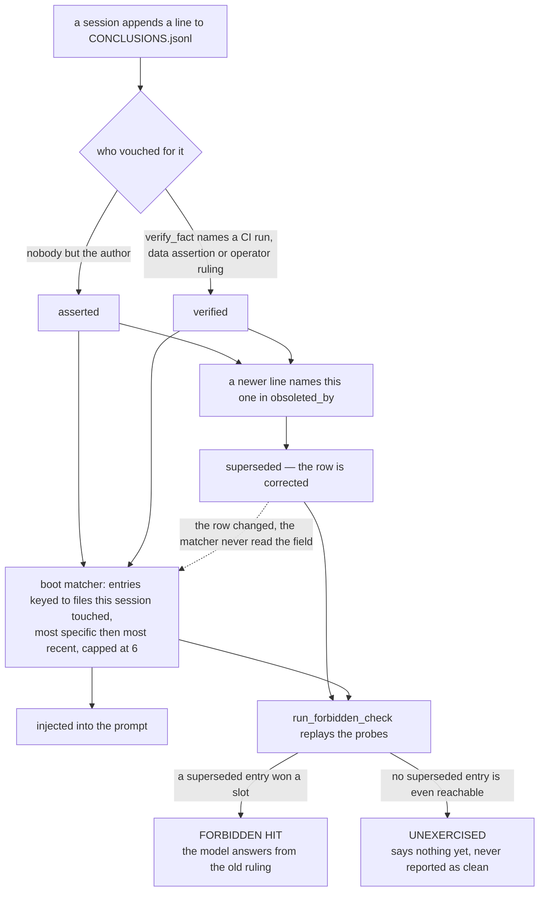

## 1. Executive Summary

breadcrumbs is a **copy-and-adapt kit**, not a library you install. 188 tracked
files at this commit, most of them markdown: templates for a rules file, a
session handoff, a decisions ledger and a settled-facts store; a CI kit of lint
guards and a fail-closed merge gate; pattern essays explaining each piece. MIT
licensed, no package manifest, no dependencies — every executable here is
stdlib Python 3 or POSIX shell. There being nothing to install is a stated
position rather than an omission: [`kit.json`](https://github.com/The-825/breadcrumbs/blob/e7940f325d6e102f53b782d50fc95ae75d9cdefa/kit.json)
argues that *"a package would make our release cadence your dependency and fight
the adapt step"*, and offers a machine-readable inventory instead — eight
problem statements routed to artifacts, and per-artifact `assumes` and
`selftest` fields.

Four of those files are a memory system, and they are the reason for this
report:

- [`templates/ledger-tools/memory_engine.py`](https://github.com/The-825/breadcrumbs/blob/e7940f325d6e102f53b782d50fc95ae75d9cdefa/templates/ledger-tools/memory_engine.py)
  — 344 lines of three-tier file-native memory (working state, append-only
  episodes, semantic facts) for an agent loop you write yourself.
- [`templates/ledger-tools/conclusions_audit.py`](https://github.com/The-825/breadcrumbs/blob/e7940f325d6e102f53b782d50fc95ae75d9cdefa/templates/ledger-tools/conclusions_audit.py)
  — asks whether every ledger entry is still **true**.
- [`templates/ledger-tools/retrieval_exam.py`](https://github.com/The-825/breadcrumbs/blob/e7940f325d6e102f53b782d50fc95ae75d9cdefa/templates/ledger-tools/retrieval_exam.py)
  — 1017 lines asking whether any entry can ever be **seen**.
- [`templates/ledger-tools/capture_nudge.py`](https://github.com/The-825/breadcrumbs/blob/e7940f325d6e102f53b782d50fc95ae75d9cdefa/templates/ledger-tools/capture_nudge.py)
  — a prompt hook that fires when the operator's own wording looks like a
  ruling.

**The finding worth the reader's time is `run_forbidden_check()`**, landed in
[PR #22](https://github.com/The-825/breadcrumbs/pull/22) on 9 August 2026, five
days after the repository's first commit. It takes the entries marked
`obsoleted_by`, replays the boot
matcher against simulated session-start conditions, and names any superseded
entry that still wins a slot. The docstring states the argument: *"Correction
that stops at the ledger row and never reaches the retrieval lane is not
correction; the descent has to complete."* Several systems here test that a
corrected value stays out of a *query result* — [Verel](../verel/)'s suite
asserts a rejected fact is *"invisible to EVERY recall path"*. This one tests
the other read surface: the ranked, capped packet a session is handed **before
it asks anything**, where an entry can be missed by losing a tie-break rather
than by failing a filter. And the could-not-run case is a named verdict in the
tool's own output (`UNEXERCISED`) rather than a property of a fixture, so an
untested lane never reads as a clean one.

Two more things are unusually well judged. The exam's **survey mode**
(`--survey`) needs no ledger and no adoption at all: it walks a repo's markdown,
computes link distance from the boot surface (`CLAUDE.md`, `AGENTS.md`,
`README.md`, `.cursorrules`, `.github/copilot-instructions.md`), and reports
the *orphan* — a document nothing links, which a session never opens on its
own. And `memory_engine.verify_fact()` raises rather than writes when handed
empty evidence, which is the shortest possible statement of oracle-gated trust.

**Where it is weakest is the distance between the prose and the tree.**
[`docs/floating-memory.md`](https://github.com/The-825/breadcrumbs/blob/e7940f325d6e102f53b782d50fc95ae75d9cdefa/docs/floating-memory.md)
describes a production memory layer in detail — an orphan git branch, a capped
head file, per-session append-only fold files, a projection computed at read
time, a trust rank, a reaper that greps merged history to check a fold's own
claim, an orphaned-branch matcher, a mishandled-claim SLA. None of that is in
this repository. `grep -rl fold --include='*.py'` at this commit returns only
the migration runner and a test-harness example. What ships is the smaller kit;
what is described is the system the kit was extracted from.

The essay itself opens by saying so, in a bolded header before the first
section: the fleet machinery *"runs in the system this pattern came out of and
does NOT ship in this kit"*, followed by a link to the ledger tools a reader can
copy today. That closes the entry point most likely to mislead, and it is the
only essay carrying such a header.
[`docs/breadcrumbs-whitepaper.md`](https://github.com/The-825/breadcrumbs/blob/e7940f325d6e102f53b782d50fc95ae75d9cdefa/docs/breadcrumbs-whitepaper.md)
presents five mechanisms as the system, and two of them have no code path
in the tree: the recorder that refuses a completion claim while obligations
dangle (3.2), and the versioned handoff where a session acknowledges the state
version it booted on (3.4).

## 2. Mental Model

A memory here is **one line of JSON keyed to a repo path**. The schema is in
[`templates/CONCLUSIONS_TEMPLATE.md`](https://github.com/The-825/breadcrumbs/blob/e7940f325d6e102f53b782d50fc95ae75d9cdefa/templates/CONCLUSIONS_TEMPLATE.md):
`path`, `when`, `what` (one sentence, the durable fact), `evidence` (a PR
number, a commit SHA, a doc pointer), with optional `tags`, `relates_to`,
`obsoleted_by`, `supersedes`, and three provenance fields from
[`PROVENANCE.md`](https://github.com/The-825/breadcrumbs/blob/e7940f325d6e102f53b782d50fc95ae75d9cdefa/templates/ledger-tools/PROVENANCE.md)
— `src` (how it got into the ledger), `verified` (last checked against
reality), `by` (which surface wrote it, *"never a model identifier"*).

Nothing is extracted. A session writes a line because a human or the session
decided a fact would cost real time to re-derive. There is no embedding, no
consolidation pass, no summarizer.

**How a claim becomes a belief.** In `memory_engine.py` the semantic tier
carries a discrete `status` field. `store_fact()` writes `"asserted"`
unconditionally — the docstring is *"Nothing an agent stores starts verified."*
`verify_fact(category, key, evidence)` is the only promotion path and refuses an
empty oracle:

> "verified requires naming the oracle (a CI run, a data assertion, a human
> ruling); an agent may not mark its own claim verified with nothing behind it"

`build_context()` renders the state inline — `fact.env.python: >=3.11
[verified (ci run 4412 green on 3.11)]` — so a reader of the prompt sees the
oracle next to the claim, and an `asserted` fact is visibly one nobody checked.

**How a belief stops being one.** Never by editing. A wrong entry gets a newer
entry that names it: `obsoleted_by` on the old line (forward half),
`supersedes` on the new one (back half), in a dated pointer grammar
(`path`, `path@date`, `path@date#n`). The only sanctioned in-place edit on the
ledger is bumping `verified` on an unchanged claim, which records a
re-check rather than a rewrite. Two clocks then run over the survivors:
`conclusions_audit.py` marks an entry `STALE` when its keyed path is gone from
the tree and `AGING` when nothing re-verified it inside 180 days.

**And the part most designs skip.** Marking a row superseded does not remove it
from the lane. `CONCLUSIONS_TEMPLATE.md` tells adopters their matcher *should*
treat an `obsoleted_by` entry as excluded, and the exam's own model of a matcher
deliberately does not — `injected_for()` filters only `UNREACHABLE` — because
the exam exists to catch matchers that forgot. Running it against the shipped
sample reproduces the failure it was written for:

```
PART 4  FORBIDDEN HITS
  superseded=1  forbidden_hits=1
  FORBIDDEN: line 6 (key=templates/ledger-tools/union-merge.md) is
  obsoleted_by docs/removed-note.md and still injected on probe 'session
  editing the merge-behavior note'. The model sees the old ruling.
```

The check keys on the supersession marker, never on the value, and the reason is
pinned by a selftest: in a revert chain where a value goes A → B → A, the final
entry restating A is a legitimately current entry, and a check that tombstoned
by value would suppress it. That is a real distinction, correctly reasoned, and
it is also exactly why this is not a rejected-value tombstone — see section 5.



## 3. Architecture

There is no server, no database, no daemon and no external dependency. The
runtime is `python3` and a git repository.

**What has to be running: nothing.** Adoption is copying files. The stores are
a `CONCLUSIONS.jsonl`, a `DECISIONS.md`, a `SESSION_STATE.md` at the repo root,
and — if you use the engine — a `.memory/` directory holding
`session_state.json`, `episodes.jsonl` and `facts.json`. Every one is
human-readable and repairable with a text editor, which is stated as a design
goal rather than an accident: retrieval is *"deterministic and inspectable with
cat and grep."*

**Runtime shape.** Three things, with different lifetimes:

1. **A library.** `MemoryEngine` is imported into an agent loop you own. Its
   header says so first: *"ASSUMES an agent execution loop you control (you
   build the prompt, you call the model, you log what happened)."* It does not
   wrap a provider, does not ship an MCP server, and does not hook a harness.
2. **Harness hooks.** `capture_nudge.py` (UserPromptSubmit),
   `templates/hooks/pre-compact-save.sh` (PreCompact) and
   `post-compact-pointer.sh` (SessionStart, matcher `compact`). All fail open;
   the nudge catches every exception and returns 0 on principle.
3. **Report-only sweeps.** `conclusions_audit.py` and `retrieval_exam.py` are
   CLIs you run on a cadence or in CI. Neither writes to the ledger. The
   auditor exits 0 whatever it finds *"(this is a report, not a gate)"*; the
   exam exits nonzero only under `--fail-on-regression` or
   `--fail-on-forbidden`.

**Concurrency.** Deliberate and honestly bounded. Episodes are append-only JSONL
so parallel writers do not contend, paired with a `merge=union` gitattributes
setting documented in
[`union-merge.md`](https://github.com/The-825/breadcrumbs/blob/e7940f325d6e102f53b782d50fc95ae75d9cdefa/templates/ledger-tools/union-merge.md).
`_write()` is atomic against a crash (temp file plus `os.replace`) and the
module header refuses to let that be mistaken for a lock: *"They do NOT make
concurrent read-modify-write safe: two agents updating session_state.json can
still lose an update."* The prescription is per-agent memory directories with a
shared episodic ledger.

**Cost to an operator:** an afternoon, and no infrastructure. That is the whole
pitch, and it is accurate.

## 4. Essential Implementation Paths

- **Capture (engine)** — `memory_engine.py`: `set_goal()`, `note(key, value)`,
  `log_episode(action, outcome, tags)`, `store_fact(category, key, value)`.
  `note()` re-inserts an updated key at the end of the dict so compaction's
  oldest-first flush orders by last update rather than first insertion.
  `store_fact()` on a key that already holds a *different* value writes a
  `SUPERSEDED` episode carrying the prior value and prior status before it
  overwrites, and the replacement re-enters at `asserted`.
- **Capture (ledger)** — by hand, prompted by `capture_nudge.py`, which regexes
  the submitted prompt for ruling-shaped language (`\bruling\b`,
  `\bfrom now on\b`, `\bgoing forward\b`, clause-initial `always|never` with
  "never mind" excluded) and prints a same-turn reminder into the harness's
  context.
- **Compaction / promotion** — `MemoryEngine.compact()`: at
  `MAX_WORKING_ENTRIES = 8` the overflow is written to the episodic ledger as a
  `COMPACTION` row *before* the working file shrinks. The comment names the
  ordering guarantee: *"if the process dies between the two writes, the worst
  case is a duplicate episode, never a lost one."*
- **Retrieval / context assembly** — `MemoryEngine.build_context(query)`:
  newest-first episodes with exact keyword overlap promoted ahead of recency,
  capped at `MAX_EPISODES_IN_CONTEXT = 5`, emitted under a header that names its
  own limit: `=== MEMORY (retrieval: recency + exact keyword; no paraphrase
  match) ===`.
- **Correction** — append a line with `obsoleted_by` on the old entry.
  `conclusions_audit._chain_issue()` resolves every pointer against the other
  ledger paths, the special paths, and the tree, and reports the ones that
  dangle.
- **Staleness** — `conclusions_audit._verdict_for()`: `SPECIAL` for
  `operations`/`domain`/`process`, `STALE` when `os.path.exists` fails on the
  key, `AGING` past `AGING_DAYS = 180` from `verified or when`, else `OK`.
- **Reachability** — `retrieval_exam.classify_reachability()` over
  `matched_files()`: glob keys via `fnmatch`, directory keys by prefix, exact
  paths by membership. More than `broad_fanout = 8` hits is `BROAD`; zero hits
  with no special key is `UNREACHABLE`.
- **Lane simulation** — `injected_for(probe, results, matcher)` ranks eligible
  entries by `(len(hits), -date.toordinal(), line_no)` and truncates at
  `injection_cap = 6`. `run_lane_probe()` diffs the injections across probes and
  reports `stuck` only when the lane was actually exercised.
- **Forbidden hits** — `run_forbidden_check()`, described above.
- **Survey** — `survey_repo()` builds a markdown link graph, BFS from the boot
  files, and classifies each document `booted` / `linked` / `deep` / `island` /
  `orphan`. `boot_weight()` reports the bytes and lines every session pays
  before any work happens.
- **Tests** — three `--selftest` entry points, 47 checks total, all offline
  against `tempfile` fixtures.

## 5. Memory Data Model

Four stores, four schemas, all flat text.

| Store | Shape | Correction model |
| --- | --- | --- |
| Conclusions (`CONCLUSIONS.jsonl`) | One JSON object per line, keyed by repo path | Append + `obsoleted_by` / `supersedes` pointers |
| Decisions (`DECISIONS.md`) | Numbered prose entries, newest last | A "Superseded by D-n" line added to the old entry |
| Corrections (`CORRECTION_LEDGER`) | JSONL: `date`, `zone`, `oracle`, `tier`, `ref`, `note` | Append-only, never edited |
| Search misses (`SEARCH_MISSES`) | JSONL: `query` verbatim, `where_searched`, `suggested_home` | Append-only, never edited |
| Engine (`.memory/`) | `session_state.json`, `episodes.jsonl`, `facts.json` | Working tier rewritten, episodes appended, a fact overwritten in place behind a `SUPERSEDED` episode |

**Temporal fields.** `when` (the date the conclusion was reached) and
`verified` (the date it was last checked). `CONCLUSIONS_TEMPLATE.md` describes a
believed-as-of-X filter over them — *believed at X iff `when <= X` and (no
`obsoleted_by`, or its date is absent or later than X)* — which is the shape of
a bi-temporal query. **It is not bi-temporal validity and no code implements
it.** `when` is a record time doing double duty; there is no interval during
which the fact was true, so "when did we believe the wrong value" is
answerable and "when was the value actually true" is not. The mark is withheld
and the near-miss is the interesting part: the pointer grammar carries a date
precisely so the as-of question becomes a one-line filter, and nobody has
written the filter.

**Scoping.** The `path` key is a *relevance* key. `injected_for()` applies it as
a read-path predicate against the files a session touched, which is
mechanically the same operation a scope filter performs, but it answers "is this
about what I am working on", never "am I allowed to see this". There is no
user, tenant, project or agent key anywhere in the schema. For a single-operator
kit that is the right call, and it is why the scope mark is a dash rather than a
defect.

**Why there is no tombstone.** `obsoleted_by` is keyed on a *record*, and the
project reasons about the value-keyed alternative explicitly — and rejects it.
From the revert-case selftest comment: a value that flips A → B → A ends with a
current entry restating A, so *"tombstoning by value would be wrong and the
check keys on supersession markers instead."* That reasoning is correct for a
hand-written ledger where nothing re-extracts. It stops being correct the moment
a model mines facts back into the store, and the schema anticipates exactly that
case — `PROVENANCE.md` describes a backfill pass mining facts out of git
history, and `CONCLUSIONS_TEMPLATE.md` warns that one such backfill *"swamped
the session-verified entries and wrecked lookup precision."* A re-mining pass
that re-derives a superseded fact writes a new line with a new date and walks
past every `obsoleted_by` in the file. This is the closest thing in the corpus
to a project that considered the rejected-value tombstone, understood the
failure it addresses, and declined it for a stated reason.

The engine's `SUPERSEDED` episode is the nearest miss of all, and it is worth
being precise about why it is not the mark. The row carries the retired value
verbatim — `prior_value`, `prior_status`, `new_value` — so a durable record of
a rejected value does exist in the store. Nothing reads it. `store_fact()`
consults `facts.json` and never the episode log, `build_context()` selects
episodes by keyword overlap for display, and no write path asks whether the
value arriving has been retired before. A tombstone is a record consulted on
the write or read path; this is a record consulted by a human grepping
`episodes.jsonl`.

## 6. Retrieval Mechanics

Two retrievers, both keyword-exact, both deterministic, neither semantic.

**The engine's.** `build_context()` splits the query on whitespace, drops tokens
of two characters or fewer, intersects against `action + " " + outcome`
lowercased and split, puts matches ahead of pure recency, and caps at five
episodes. The header string tells the model what it is not getting. There is no
scoring, no fusion, no reranking, no embedding — and the docstring says to add
semantic recall as a separate layer rather than pretend this one has it.

**The modelled one.** `retrieval_exam.Matcher` is not a retriever; it is a model
*of* the reader's retriever, and the script is unusually careful that the
difference stays visible:

> "If your real matcher diverges from the model, the numbers describe the model
> and not your system, which is worse than no numbers."

The four config keys (`special_paths`, `injection_cap`, `recency_field`,
`broad_fanout`) are the whole surface, and `docs/memory-measurement.md` names
the cap as the number to check first because *"it is almost always smaller than
people remember."*

**The failure modes this is built around are stated better than most systems
state their successes.** An `UNREACHABLE` entry is *"correct, well written, and
silently absent from every session that needed it"* — worse than no entry,
because no entry leaves a visible hole. A `BROAD` key fires constantly and
therefore *"wins the lane on traffic rather than on relevance."* A `stuck` lane
means a corpus scoring healthy while every session receives the same handful of
entries. And `run_use_readout()` names dead weight: an entry injected on every
probe with no `use_count`, paying boot tokens forever.

**Token budgeting** is a first-class concern and measured rather than estimated.
Survey mode's `boot_weight()` prints what the boot surface costs; the recorded
run of this repo against itself (2026-08-06, in `docs/memory-measurement.md`)
is 117 markdown documents, two booted, *"376 lines and 20,052 bytes charged to
every session."* Running `--survey` against this commit gives the same shape a
little heavier: 119 markdown documents, `CLAUDE.md` and `README.md` booted at
385 lines and 21,133 bytes, 117 linked, and zero orphans, islands or deep
documents. A repository that scores its own signage and keeps the orphan count
at zero while adding files is the demonstration the tool needs.

## 7. Write Mechanics

**Nothing extracts.** Every write is a human or a session choosing to write, so
the entire class of extraction failures — hallucinated facts, over-eager
summarization, a consolidation pass rewriting a claim — does not exist here.
Neither does the coverage those mechanisms buy: what nobody writes down is not
remembered.

**Nothing blocks.** `store_fact()` and `log_episode()` are file appends and a
JSON rewrite, no model call on the path. Lag from write to retrievable is a
filesystem write. No background pass re-reads or rewrites the store; the two
sweeps are read-only and invoked by hand.

**Append vs update.** Append-only for episodes, corrections and search misses.
The conclusions ledger is append-only by convention with one sanctioned in-place
edit (`verified`). The engine's `facts.json` is the exception in shape —
`store_fact()` overwrites `facts[category][key]` outright — but the overwrite is
not a silent one. When the incoming value differs from the stored one, the prior
value and prior status go to `episodes.jsonl` as a `SUPERSEDED` row first, and
the replacement re-enters at `asserted` rather than inheriting the oracle that
vouched for a value it no longer holds. That is the supersession discipline the
rest of the kit is built on, reaching the tier that sits furthest from the
ledger, and three selftests pin it.

**The gap the guard leaves is the equality test.** The episode is written only
when `prior.get("value") != value`; the dict assignment underneath is
unconditional. So restating a fact with the value it already holds rewrites
the entry to `{"status": "asserted", "evidence": None}` and logs
nothing. Running the module header's own worked example against this commit —
`store_fact("environment", "python", ">=3.11")`, `verify_fact(…, evidence="ci
run 4412 green on 3.11")`, then the same `store_fact` again — leaves the fact
`asserted` with
`evidence: None` and `episodes.jsonl` empty of `SUPERSEDED` rows. The direction
is fail-safe, since trust is lost rather than gained, but the docstring's claim
is that *"a verified fact cannot vanish without a trace"*, and on this path it
vanishes without one. The committed check next to it, *"restating the same value
is not a supersession"*, asserts the missing episode and not the surviving
status, so the case is pinned on the half that holds.

**Conflict handling.** None automatic. Two contradicting lines both live until a
human writes the pointer. `docs/memory-measurement.md` calls this out as the
fifth thing, the one that corrupts every other measurement — an entry whose
prose says it corrects an earlier one but carries no machine-readable pointer
*"is still live. It still ranks. It still competes for a capped injection lane
against the very entry that replaced it."* The prescribed fix is a scan that
**proposes** pointers for a human to rule on, restricted to the same key with a
strictly earlier date, *"because a wrong supersession pointer silently deletes a
live fact from every future injection."* That scan is described and not shipped.

**Filtering hostile input.** The kit's answer is at the write boundary, not the
read one:
[`SEARCH_MISSES.md`](https://github.com/The-825/breadcrumbs/blob/e7940f325d6e102f53b782d50fc95ae75d9cdefa/templates/ledger-tools/SEARCH_MISSES.md)
requires screening the verbatim `query` field before append, because it is the
one field that captures whatever the user typed. `templates/hooks/outbound-pii-screen.sh`
is the shipped screen.

## 8. Agent Integration

Claude Code is the assumed harness and the integration is entirely
convention-plus-hooks. `CLAUDE.md` is the boot surface; `SESSION_STATE.md` is
read first and refreshed on a spoken trigger word (*"Refresh it on a trigger
word you say out loud, not on 'keep it updated,' which means never"*);
`planning/DECISIONS.md` takes rulings the same turn they land.
`templates/commands/` holds 29 slash-command definitions, `templates/hooks/`
the harness-side scripts.

**A second, machine-facing surface.** `llms.txt` is the same map written for an
agent reading the repository — eight problem-shaped headings, one line per
artifact, the boot-file convention followed rather than described — and
`kit.json` is its structured twin, carrying an `assumes` string and a `selftest`
command per artifact. `ci-kit/kit_manifest_check.py` runs in CI and fails when
any artifact path, problem route or selftest script in the manifest does not
resolve, on the stated reasoning that *"manifest rot is silent because nothing
reads the manifest in this repo's own workflow."* That check is real, and it is
narrower than the manifest's own promise: `verify_all` says *"CI runs the same
set,"* and nothing compares `kit.json` against `.github/workflows/ci.yml`. The
two agree at this commit — every one of the manifest's seven selftest commands
appears in the workflow — by hand, not by construction.

**Agency over memory is total and unmediated.** The agent writes lines directly.
Nothing gates a write, nothing reviews one, and the only refusal in the entire
codebase is `verify_fact()` declining an empty oracle. The heavier refusals the
whitepaper describes — a done-claim refused while obligations dangle, a park
requiring exactly one named accountable owner — belong to the fold CLI, which is
prose here.

**Compaction is handled explicitly**, and it is the neatest piece of harness
work in the repo. `pre-compact-save.sh` copies the full transcript JSONL to
`$HOME/.claude/compaction-saves` before every compaction, keeps the twenty
newest, and writes a `LATEST` pointer. `post-compact-pointer.sh` fires on
`SessionStart` with matcher `compact` and tells the fresh context where the save
landed, closing with the right instruction: *"Repo files stay the source of
truth for anything the summary paraphrases; trust them over the summary wherever
they disagree."* Saves live outside the repo on purpose, because a transcript
can contain anything the session touched.

**Portability.** The `BOOT_FILES` list in `retrieval_exam.py` covers
`CLAUDE.md`, `AGENTS.md`, `GEMINI.md`, `.cursorrules` and
`.github/copilot-instructions.md`, so survey mode is genuinely harness-neutral.
The hooks are Claude Code event names and would need porting. The whitepaper is
precise about how far the cross-vendor claim reaches: other vendors' models read
and review the system, but *"No non-Claude model has yet run the full write loop
as a participating member of the memory, so the portability claim covers reading
only."*

## 9. Reliability, Safety, and Trust

**The trust ladder is the design's spine**, and it is stated identically in code
and prose: human ruling, then oracle-verified, then asserted by a capable tier,
then asserted by a working tier, then unattributed — with only the unattributed
rank quarantined, on the argument that quarantining most of the fleet's memory
*"would train everyone to ignore the lane, which is worse than no lane."* That
is a judgement about adoption, made explicitly, and it is right.

The
[correction ledger](https://github.com/The-825/breadcrumbs/blob/e7940f325d6e102f53b782d50fc95ae75d9cdefa/templates/ledger-tools/CORRECTION_LEDGER_TEMPLATE.md)
sharpens it into an admission rule with four oracles — `ci_failure`,
`data_assertion`, `operator_ruling`, `reverted_pr` — and one exclusion that
several systems in this atlas would benefit from adopting:

> "Model-vs-model disagreement is never a correction. A stronger model
> 'disagreeing' with a cheaper one has no ground truth behind it, and neither
> does a model's own audit pass."

**Provenance.** `by` records the writing *surface*, never the model, on the
reasoning that model names date fast while a surface name tells you which
workflow to distrust when a class of entries turns out bad. `src` and `evidence`
are kept distinct — how the entry got in versus how a reader checks it — which
matters exactly once, when a backfill pass mines old facts and the two diverge.

**Prompt-injected false memory** is not defended against and the kit does not
claim otherwise: the whitepaper lists adversarial settings as addressed *"only
by the trust ladder's quarantine rank and the append-only forensic trail"* and
says they deserve fuller treatment.
[`docs/memory-threat-model.md`](https://github.com/The-825/breadcrumbs/blob/e7940f325d6e102f53b782d50fc95ae75d9cdefa/docs/memory-threat-model.md)
names four failure modes — unauthorized leakage, stale propagation,
contradiction persistence, provenance collapse — and maps each to the mechanism
answering it. It is a documentation pattern, not a mechanism, and says so.

**An audit log of memory mutations, covering two of the three transitions that
matter.** `episodes.jsonl` is append-only, lives in the engine's own store
rather than in git, and carries `COMPACTION` rows naming the keys a working-tier
flush evicted and `SUPERSEDED` rows naming a semantic fact's prior value, prior
status and replacement. That is a record of what changed, in the store, and it
earns the mark. What it does not cover is the trust axis: `verify_fact()`
promotes a fact to `verified` and writes no event, and the same-value overwrite
in section 7 demotes one to `asserted` and writes no event either. In a design
whose spine is the trust ladder, the ladder is the one thing the log does not
watch. Git history covers the file-based ledgers and is a different mechanism.

**No human review surface in code, by an explicit and defensible choice.** The
posture throughout is report-only — *"the auditor never writes"*, *"propose
rather than apply"*, *"Humans move the dials"*. The auditor's `--file-tasks`
flag prints the issues a tracker integration *would* file and `file_tasks()` is
labelled a stub seam. A person reads a report and hand-edits a ledger; nothing
records the adjudication as an act. That is viewing plus manual editing, not a
review surface, so the mark is a dash — but the stance behind it (a wrong
automatic supersession is invisible and permanent, so the default must be a
human ruling on a cheap proposal) is more carefully argued than most systems
that do carry the mark.

**Race conditions** are named rather than solved, which is the correct outcome
for a file-native design and is documented at the point of the danger rather
than in a footnote.

## 10. Tests, Evals, and Benchmarks

**No paper.** Grepping the tree for `arxiv`, `bibtex`, `@article`, `@misc`,
`doi`, `CITATION.cff` returns only the authority-citation guard, which is
unrelated. `docs/breadcrumbs-whitepaper.md` is a 403-line self-published essay,
not an indexed preprint, and it carries no evaluation.

**What is tested.** Five offline selftests, which I ran against the pinned
commit on 2026-08-09 with `python3 <script> --selftest`, no dependencies
installed:

| Script | Checks | Result |
| --- | --- | --- |
| `memory_engine.py` | 15 | all passed |
| `conclusions_audit.py` | 8 | all passed |
| `retrieval_exam.py` | 27 | all passed |
| `ci-kit/preflight/preflight.py` | 19 | all passed |
| `ci-kit/kit_manifest_check.py` | 5 | all passed |

`kit_manifest_check.py` against the real `kit.json` also passes — *"clean (every
path and selftest resolves)"*.

I also ran the exam over the committed fixture pair
(`sample_conclusions.jsonl` + `sample_probes.json`) against the repo tree, which
reproduced the documented output exactly: one `UNREACHABLE` entry, four distinct
injections across four probes, one dead-weight entry, and the one `FORBIDDEN`
hit quoted in section 2.

**The negative assertions are real and specific.** Four of the exam's 27 checks
assert about material that must *not* surface:

- a superseded entry keyed to a touched file **is** a forbidden hit;
- a superseded entry keyed to an untouched file is **clean**;
- a superseded entry that is unreachable reports **unexercised, never clean**;
- a revert chain (A → B → A) injects the *current* entry and reports **no** hit.

The third is the one worth copying. Several suites here defend against a vacuous
pass through fixture design — [Omi](../omi/) asserts the memory a user reviewed
away is absent *while the other three are present*. This one puts the
distinction in the verdict vocabulary instead, so "the bad thing did not happen"
and "the bad thing could not have happened" stay separate even after somebody
edits the fixture.

**The memory checks are inside the gate.** `.github/workflows/ci.yml` runs the
guard tests, the migration-runner tests, the decision-gate tests, the manifest
check, a `Ledger-tool self-tests` step invoking all four `--selftest` entry
points, the PII guard over the tree and the provenance guard over the PR's
commits. The step's comment carries the argument: *"The memory tools guard
everything else, so they cannot live outside the gate that guards everything
else… A report that exists only when someone remembers to run it is not a
safeguard, and neither is a selftest."* The three ledger tools' fifty checks,
plus preflight's nineteen, fail the build when they fail.

**The exam itself is ungated**, and the reason is structural rather than
negligent. No step runs `retrieval_exam.py --fail-on-forbidden`
against a ledger, because the only ledger in the tree is
`sample_conclusions.jsonl` — a fixture built to produce exactly one forbidden
hit, so a gate over it would fail every build by construction. The kit ships the
ratchet and cannot run it on itself. Closing that needs a conclusions store of
the repository's own, which the repository does not keep; the tool's sharpest
mode is therefore proven against fixtures and unproven against a live corpus.

Second, and unchanged: nothing here is measured. The whitepaper's evidence is *"incidents
caught and work not redone, counted by hand"*, the limitations section says
numbers *"will follow rather than be promised"*, and section 4.5's archive audit
(216 conversations, ~1,300 turns) counts re-derivations in the operator's own
history rather than evaluating the system. That is a fair and unusually plain
accounting, and it means there is no retrieval-quality result to report.

## 11. For Your Own Build

### Steal

- **Test that the correction reached the prompt, not just the row.** Replay your
  boot matcher against a handful of realistic session-start conditions and
  assert that no entry you have marked superseded wins a slot. This is a few
  dozen lines against a store you already have, and it catches the failure where
  the correction landed, the row is right, and the model still answers from the
  old value.
- **Keep "could not run" separate from "passed."** `UNEXERCISED` for a lane no
  probe touched, `unexercised` for a forbidden check with nothing reachable to
  catch. A negative suite that reports green when it had no opportunity to fail
  is worse than none, because it retires the question.
- **Refuse `verified` without a named oracle, in the setter.** Twelve lines,
  raises rather than writes, and it converts "the model said so" from a default
  into something a caller has to lie about deliberately.
- **Measure reachability, not just truth.** A staleness sweep and a reachability
  sweep catch disjoint failures; an entry can be perfectly true and structurally
  invisible, and only the second sweep can tell you.
- **Ratchet reachability in CI, and watch the subtle regression.** More
  unreachable entries is obvious. *Fewer precise entries at the same total* is
  the one people miss, because re-keying a specific entry to something broad
  reads as tidying up and is a downgrade.
- **State the retrieval limit inside the injected block.** `=== MEMORY
  (retrieval: recency + exact keyword; no paraphrase match) ===` costs one line
  and tells the model what it is not being shown.
- **Exclude model-vs-model disagreement from your correction signal.** A
  self-improvement loop trained on opinion optimizes a proxy.
- **Record the writing surface, not the model.** When a class of entries turns
  out unreliable you need to know which workflow produced them.
- **Log the prior value before an overwrite, in the same call.** Six lines in
  `store_fact()` turn a destructive write into a supersession with a trace, and
  they belong beside the assignment rather than in a wrapper a caller can skip.
  Reset the replacement to your lowest trust state while you are there: a new
  value inheriting the old value's oracle is the quietest way a store starts
  lying.
- **A manifest that routes problems to files beats a package, for a kit meant to
  be edited.** `kit.json` gives an agent a machine-readable path from "my agent
  forgets everything between sessions" to four files and their selftests,
  without making the author's release cadence an adopter's dependency — and a CI
  check that every path in it resolves is what keeps it from rotting into a
  wild-goose chase.

### Avoid

- **Do not let a "should" in your schema doc stand in for a filter in your
  matcher.** `CONCLUSIONS_TEMPLATE.md` tells adopters to exclude superseded
  entries from current knowledge. The exclusion exists in exactly one place at
  this commit — the check that detects its absence.
- **Do not let a gate that runs your selftests stand in for a gate that runs
  your tool.** The four `--selftest` entry points are wired into CI and the
  forbidden check is not run against any ledger, because the only ledger in the
  tree is a fixture engineered to fail. A tool whose fixtures are gated and
  whose live use is not is halfway to the argument it makes about reports.
- **Do not model a component you cannot read without labelling every number it
  produces.** The exam does this correctly and it is the harder discipline: a
  configured model of someone else's matcher will be wrong for some readers, and
  a wrong number that looks like evidence is worse than no number.
- **Do not describe a production system in a public kit without saying, at the
  top of each essay, which parts ship.** `floating-memory.md` carries that
  header and it is the model to copy — a bolded paragraph before the first
  section, naming the machinery that does not ship and linking what does. The
  whitepaper beside it presents five mechanisms with no such header and two of
  them have no code path, which is what the fix looks like when it is applied
  per-file rather than per-shelf.
- **Do not guard the shape of a claim and leave the claim itself unguarded.**
  `kit_manifest_check.py` proves every path in `kit.json` resolves. The
  manifest's `verify_all` says CI runs the same set of selftests, and no check
  compares the manifest with the workflow; the two agree because someone edited
  both.

### Fit

This is for **one person, or a small team, running many agent sessions against
one repository they cannot afford to break**, who is willing to treat memory as
a documentation and CI problem rather than an infrastructure one. If that
describes you, the cost is genuinely an afternoon and the ceiling is real: exact
keyword matching over a hand-written ledger, no semantic recall, no scope
boundary, and every write depending on someone deciding to write.

**Walk away if** you need multi-tenant isolation, if your memories are extracted
from conversation rather than authored, if the corpus will exceed what a person
can curate by hand, or if you were hoping to install the fleet architecture the
whitepaper describes — that system is not here, and the kit is what one operator
found portable out of it.

**Take the exam even if you take nothing else.** `retrieval_exam.py --survey`
runs against any repository, needs no adoption, and answers a question most
teams have never asked about the memory they already have.

## 12. Open Questions

- Does the production system the docs describe exist as code anywhere, and is
  the fold CLI, the projection script or the reaper intended to ship? The
  extraction-boundary discipline in `docs/memory-threat-model.md` suggests parts
  of it are deliberately withheld, which is a legitimate answer, but the repo
  does not say which parts.
- Has `--fail-on-forbidden` ever been run against a real ledger, and did it find
  anything? The only ledger in the tree is a synthetic fixture built to produce
  exactly one hit, and `planning/DECISIONS.md` runs to D-10 without ruling on
  whether the repository should keep a conclusions store of its own.
- Should a same-value `store_fact()` preserve the `verified` status and its
  oracle, or is dropping both the intended fail-safe? Either answer is
  defensible; the docstring asserts the first and the code does the second.
- Does the operator's own conclusions store carry `use_count` stamps in
  practice? The readout exists; the discipline that feeds it is admitted to be
  leaky, and the repo keeps no ledger of its own to check against.
- What does the boot matcher in the production system actually do, and how far
  does the exam's four-key model diverge from it?

## Appendix: File Index

**Memory tools**
- `templates/ledger-tools/memory_engine.py` — three-tier engine, asserted/verified, compaction, `SUPERSEDED` episodes
- `templates/ledger-tools/conclusions_audit.py` — STALE / AGING / SPECIAL / OK plus chain resolution
- `templates/ledger-tools/retrieval_exam.py` — reachability, lane probe, use readout, forbidden hits, survey mode
- `templates/ledger-tools/capture_nudge.py` — UserPromptSubmit capture nudge

**Schemas**
- `templates/CONCLUSIONS_TEMPLATE.md` — the line format, dated supersession grammar, curation rules
- `templates/ledger-tools/PROVENANCE.md` — `src` / `verified` / `by`
- `templates/ledger-tools/CORRECTION_LEDGER_TEMPLATE.md` — the four-oracle admission rule
- `templates/ledger-tools/SEARCH_MISSES.md` — the miss ledger
- `templates/AUTHORITY_LEDGER_TEMPLATE.md`, `templates/authority_ledger.jsonl` — standing grants

**Fixtures**
- `templates/ledger-tools/sample_conclusions.jsonl` — six lines, every verdict
- `templates/ledger-tools/sample_probes.json` — four session-start conditions

**Harness**
- `templates/hooks/pre-compact-save.sh`, `templates/hooks/post-compact-pointer.sh`
- `templates/hooks/outbound-pii-screen.sh`
- `templates/commands/` — 29 slash commands, including `recall.md` and `checkpoint.md`

**Adoption surface**
- `kit.json` — problem-to-artifact routing, per-artifact `assumes` and `selftest`
- `llms.txt` — the same map for an agent reading the repository
- `ci-kit/kit_manifest_check.py` — fails CI when a manifest path or selftest script does not resolve

**Reasoning**
- `docs/floating-memory.md` — the fleet architecture, prose only, behind a what-ships header
- `docs/memory-measurement.md` — the four instruments and their limits
- `docs/memory-threat-model.md` — four failure modes, mapped
- `docs/breadcrumbs-whitepaper.md` — five mechanisms, the case study, the limitations

**Repo-level**
- `CLAUDE.md`, `SESSION_STATE.md`, `planning/DECISIONS.md` — the kit run on itself
- `.github/workflows/ci.yml` — what is actually gated

## History

**2026-08-09** — [`e7940f325d6e102f53b782d50fc95ae75d9cdefa`](https://github.com/The-825/breadcrumbs/commit/e7940f325d6e102f53b782d50fc95ae75d9cdefa)
— re-pinned two commits past the previous reading, both landed the same day.
[`9573123920dd0bf552a15275834a3e519e65e9bf`](https://github.com/The-825/breadcrumbs/commit/9573123920dd0bf552a15275834a3e519e65e9bf)
closed three of the five weaknesses this report named, and its commit message
and three in-code comments cite this atlas by name: the four `--selftest` entry
points joined `.github/workflows/ci.yml`, `store_fact()` gained a `SUPERSEDED`
episode carrying the prior value and status before it overwrites (pinned by
three new checks, 15 in that script), and `docs/floating-memory.md` gained a
what-ships header. The pinned commit added `kit.json`, `llms.txt` and
`ci-kit/kit_manifest_check.py`.

The `audit_log` mark is earned at this commit: `episodes.jsonl` records a
semantic-tier mutation with its prior value and prior status, not only a
working-tier flush. Two claims corrected that were wrong at the previous pin,
both in the direction of understating the repository: `templates/commands/`
holds 29 command definitions, not 27, and `planning/DECISIONS.md` ran to D-10,
not D-5. `run_forbidden_check()` landed on 9 August 2026, not six days before
the first reading. Two new findings that survive the fixes: a same-value
`store_fact()` still drops a `verified` status and its oracle with no episode
logged, contradicting the new docstring, and `kit_manifest_check.py` proves
every manifest path resolves without checking the manifest's own claim that CI
runs the same selftests.

Screened before reading: 0 auto-run surfaces, 0 build-time exec, 0 unpinned
dependency surfaces, 1 `AGENT` file (`CLAUDE.md`, read as data). Nothing was
installed. Five `--selftest` runs, one fixture run and one `--survey` run of
`retrieval_exam.py`, one real run of `kit_manifest_check.py`, and one scripted
probe of `store_fact`/`verify_fact` against a `tempfile` directory were executed
with the system `python3`.

**2026-08-09** — [`9252553434e01cfb4058df797470c72645eef3fc`](https://github.com/The-825/breadcrumbs/commit/9252553434e01cfb4058df797470c72645eef3fc)
— first reading, at a commit dated 9 August 2026, 26 commits into the
repository's life. Screened before reading: 0 auto-run surfaces, 0 build-time
exec, 0 unpinned dependency surfaces (there is no package manifest of any kind),
1 `AGENT` file (`CLAUDE.md`, read as data). Nothing was installed. Three
`--selftest` runs and one fixture run of `retrieval_exam.py` were executed
directly with the system `python3`, which is safe here because every script is
stdlib-only and writes solely to `tempfile` directories.
