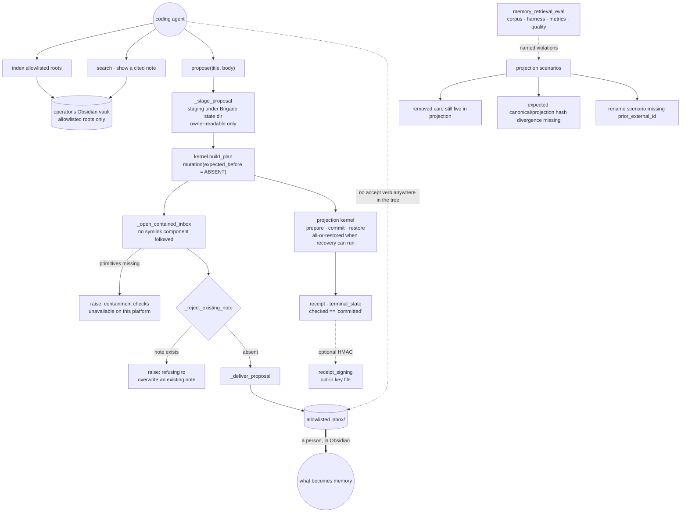

## 1. Executive Summary

Brigade tracks coding-agent work across tools, repositories and sessions —
tasks, receipts, synced tools, and a memory layer over an Obsidian vault the
operator already keeps. MIT, Python, 2,214 files.

**Two marks: `human_review` and `negative_eval`.**

The memory writer is the reason for the first, and it earns the mark by
*subtraction*. `memory_vault.py` indexes allowlisted roots, searches them,
shows a cited note — and its only write is to *"deliver additive proposals into
an allowlisted inbox."* There is no accept. The module has `propose`,
`_stage_proposal`, `_deliver_proposal` and `_reject_existing_note`, and nothing
anywhere in the tree accepts a vault proposal on the agent's behalf; the person
resolves it by handling the file in their own vault, in Obsidian, outside this
program.

The containment underneath it is the part worth copying.
`_open_contained_inbox` opens the inbox *"without following any symlink
component"* using directory-relative handles, and `_reject_existing_note`
refuses to overwrite. Both sit behind a guard that refuses to proceed at all
where the primitives are missing — *"vault containment checks are unavailable on
this platform"* is raised as an error rather than degraded into a plain
`open()`.

`audit_log` and `scope_enforced` are withheld, and both for reasons about shape
rather than care: receipts are per-run artifacts rather than one append-only
ledger, and the boundary is a filesystem one rather than a stored scope key.

## 2. Mental Model

Brigade treats a memory write the way it treats any other side effect: as a
planned operation with a captured pre-state, executed by a kernel that returns
a receipt. Nothing is written by a function that also decided to write it.

The vault is the operator's. Brigade indexes what it is allowed to see, cites
what it returns, and posts proposals into one directory. What becomes memory is
whatever the person keeps.

## 3. Architecture

## 4. Essential Implementation Paths

**The containment** — `src/brigade/memory_vault.py:1227-1242`.
`_open_contained_inbox` delegates to a directory-relative open and translates
each failure into a specific refusal: the platform lacks the primitives, the
vault is unreadable, the vault *"must be a real directory"*, the path is unsafe,
or the inbox *"escapes the vault"*. Five distinct errors, none of them a
fallback.

**The overwrite refusal** — `:1244-1258`. `_reject_existing_note` opens the
target name relative to the inbox handle; `FileNotFoundError` is the only
success, and every other outcome raises *"refusing to overwrite an existing
note."* Its first statement is the platform guard, so on a system without
containment primitives the function refuses rather than proceeding unprotected.

**The same rule at the kernel** — `:1382-1391`. The delivery is a planned
mutation with `expected_before=kernel.ABSENT`, so "this must not already exist"
is enforced twice by different means: once by the file handle, once as a
precondition of the transaction.

**The guarantee, stated honestly** — `src/brigade/projection/kernel.py:1-7`.
*"A planned operation either publishes every destination mutation or restores
every destination to its captured pre-operation state. The user-facing
guarantee is all-or-restored completion when the process can run recovery, not
simultaneous visibility across independent paths."* Most projects would write
"atomic" and stop. This one names the guarantee, the condition it depends on,
and the stronger property it is *not* claiming.

**The receipt check** — `memory_vault.py:1400-1402`. The receipt is attached to
the payload and `terminal_state` is compared against `"committed"`, so a
delivery that did not commit is not reported as one.

## 5. Memory Data Model

The vault's notes are the memory and they are markdown files the operator owns.
Brigade keeps a derived index and proposal staging under its own state
directory, *"owner-readable only"*, and a `brigade.vault-index.receipt.v1`
schema for what it did.

There is no status field on a note, no supersession pointer and no validity
window. The word `tombstone` appears three times: twice in the GitHub work-item
sync, where a 404 produces a stale-tombstone record — delete-sync, which the
rubric names as *not this* — and once in the evaluation harness as an expected
condition.

## 6. Retrieval Mechanics

Index and search over allowlisted roots, returning cited notes. The interesting
half is not the retriever but the harness that grades it — section 10.

## 7. Write Mechanics

Propose only, additively, into one directory, through the kernel. The staging
directory and the delivery are separate steps so a partially written proposal
never appears in the inbox.

## 8. Agent Integration

A CLI with a large command surface, receipts for runs and routes, attestation
records, and a skills subsystem with its own inbox — `skills_cmd/inbox.py`
carries an `inbox_accept`, which is for skill proposals rather than memory and
is a terminal command.

One guard worth naming from that subsystem: a co-owner *"cannot attest shared
instruction rewrite"* when a receipt conflict exists, so two harnesses sharing
an instruction file cannot both claim to have approved a change to it.

## 9. Reliability, Safety, and Trust

**`human_review`.** The producing agent has no verb that turns a proposal into
memory. The mark's strongest form is the absent one, and this is it: not a
review state the agent can transition, not an approve flag it can set, but a
directory it can add a file to and nothing more. The acceptance happens in the
operator's own editor.

**`negative_eval`** — section 10.

**`scope_enforced` is withheld.** The boundary is real, enforced and carefully
built, and it is a filesystem boundary: allowlisted roots and symlink-free
opens, not a stored scope key composed into a read. The mark measures the
second thing, and saying otherwise would make its count describe two different
mechanisms.

**`audit_log` is withheld.** Receipts are extensive — run, route, causal,
attestation — and they are per-operation artifacts written atomically rather
than one append-only ledger of memory mutations. Signing is *"optional local
HMAC"*, enabled by an env-configured key file, and at least one path unlinks an
install receipt during skills sync history. The material is richer than most
systems that do carry this mark; the shape is not the one it describes.

**`tombstone`, `trust_state` and `bitemporal` are withheld.** A note has no
status, no rejection record keyed on its content, and one clock.

## 10. Tests, Evals, and Benchmarks

A large pytest suite with committed fixtures under `tests/fixtures`,
`tests/guard/fixtures` and `src/brigade/fixtures`. Nothing was installed and
nothing was run.

The mark rests on `src/brigade/memory_retrieval_eval/`, a scenario-driven
harness with a corpus loader, a metrics module, a quality module and a reporter.
Its projection evaluator returns a *named violation string* rather than a
boolean, and the names are the assertions:

- `"removed card still live in projection"` — raised when a scenario expects a
  card tombstoned and the projection reports it live (`projection.py:230`).
- `"expected canonical/projection hash divergence missing"`, and its converse
  `"unexpected hash divergence"` — both directions, so a checker that always
  reported divergence would fail the second.
- `"rename scenario missing prior_external_id"` and `"move scenario missing
  prior_path"` — an identity change must carry what it was before.
- A `live_count` expectation compared against the scenario's health block.

Two things make this better than a pass/fail eval. The violation is a sentence,
so a failing run says which invariant broke rather than which case number did.
And the hash-divergence pair means the check cannot be satisfied by a constant
in either direction — the same property that makes the archived-row pair
elsewhere in this corpus worth having.

No paper.

## 11. For Your Own Build

### Steal

- **Give the agent a propose verb and no accept verb.** Not a status it can
  transition — no function at all. The queue then cannot be cleared by its
  producer, whatever a future caller intends.
- **Refuse on platforms that cannot enforce your guard.** *"vault containment
  checks are unavailable on this platform"* is a better outcome than a plain
  `open()` and a comment.
- **Open the directory, then work relative to the handle.** Resolving a path and
  then opening it is two operations and something can change in between;
  `dir_fd`-relative opens are one.
- **Enforce the same precondition twice by different means.** The note must not
  exist, checked once by the file handle and once as `expected_before=ABSENT` in
  the plan.
- **Name the guarantee you actually provide.** *"all-or-restored completion when
  the process can run recovery, not simultaneous visibility across independent
  paths"* tells a reader what to design around. "Atomic" does not.
- **Return a violation sentence, not a boolean.** The eval's failure messages
  are the specification.

### Avoid

- **Calling a pile of receipts an audit log.** Per-operation artifacts with
  optional signing answer "what did this run do", not "what has ever happened to
  this memory".

### Fit

Take the vault propose path whole if an agent writes into a store a person
owns — the containment, the double precondition and the missing accept verb are
about three hundred lines and they are the design. Take the rest if you want the
whole work-tracking product.

## 12. Open Questions

- Receipt signing is optional and off unless a key file is configured. What
  would make it the default — and what verifies the chain if it is?
- The vault writer proposes and never accepts. Is an in-Brigade accept
  deliberately withheld, or waiting on a way to verify who is accepting?
- The retrieval eval names violations precisely. Is it wired into CI, and does a
  violation fail a build?
- `tombstone` in the work-item sync is a 404 marker. Is a content-keyed
  rejection intended for vault notes, or is deletion the operator's business by
  design?

## Appendix: File Index

| Path | What it holds |
| --- | --- |
| `src/brigade/memory_vault.py` | index, search, cited show, and the propose path with its containment and overwrite refusal |
| `src/brigade/projection/kernel.py` | prepare/commit/restore, the `ABSENT` precondition, and the guarantee statement |
| `src/brigade/memory_retrieval_eval/projection.py` | the named violations the mark rests on |
| `src/brigade/memory_retrieval_eval/corpus.py` | the card and query loaders behind the scenarios |
| `src/brigade/receipt_signing.py` | the optional local HMAC over receipt digests |
| `src/brigade/skills_cmd/inbox.py` | `inbox_accept`, for skill proposals rather than memory |
| `src/brigade/harness_profile_cmd.py` | the co-owner attestation conflict on a shared instruction rewrite |

## Appendix: Recorded Searches

Run from the root of the checkout at the pinned commit.

| Claim | Command | Result at this pin |
| --- | --- | --- |
| Nothing accepts a vault proposal | `grep -rn "proposal" --include='*.py' src/brigade \| grep -iE "def .*(accept\|apply\|merge\|commit)"` | One hit, `skills_cmd/inbox.py:363` `inbox_accept`, which is the skills inbox; `memory_vault.py` has `propose`, `_stage_proposal`, `_deliver_proposal` and no accept |
| The containment guard fails closed | read `memory_vault.py:1227-1258` | Five distinct refusals, and `_reject_existing_note` raises when the primitives are unavailable before attempting anything |
| The precondition is enforced twice | read `memory_vault.py:1382-1391` | `expected_before=kernel.ABSENT` in the plan, beside the handle-level existence check |
| `tombstone` is delete-sync, not a value record | `grep -rn "tombstone" --include='*.py' src` | Three files: two in `worklore_github_sync` for a 404 marker, one in the eval harness as an expected condition |
| Receipt signing is optional | read `src/brigade/receipt_signing.py:1`, `:11-12` | *"Optional local HMAC signing"*, keyed off `BRIGADE_RECEIPT_SIGNING_KEY_FILE` |
| No stored scope key on a memory read | `grep -rn "scope" --include='*.py' src/brigade/memory_vault.py` | Allowlisted roots and containment; no principal key composed into a query |
| The licence carries no rider | `head -3 LICENSE`; `grep -n -i 'anthropic\|may not' LICENSE` | Stock MIT, no match |

## History

**2026-09-20** — [`f2b56bc0405027eecda11c48d303bf11e15a440f`](https://github.com/escoffier-labs/brigade/commit/f2b56bc0405027eecda11c48d303bf11e15a440f) — first reading, at 2,214 files. Screened before reading; nothing was installed and nothing was run, so the committed eval harness and fixtures were read rather than executed. MIT. Two marks, `human_review` and `negative_eval`. `human_review` is the absent-verb form: the memory writer can propose into an allowlisted inbox and nothing in the tree accepts on the agent's behalf. `scope_enforced` is withheld because the boundary is a filesystem one rather than a stored scope key, and `audit_log` because the receipts are per-operation artifacts with optional signing rather than an append-only ledger of memory mutations — in both cases the engineering is stronger than the withholding suggests, and the reason is recorded in section 9 and in the appendix.
