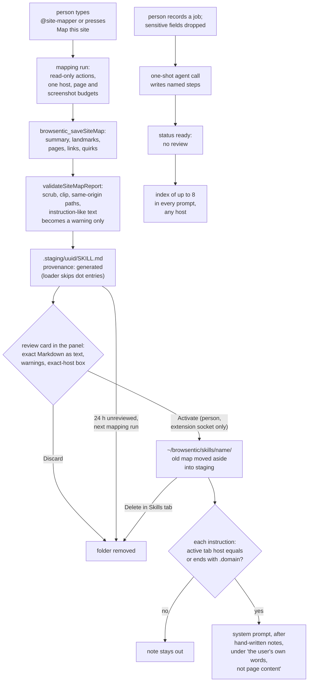

## 1. Executive Summary

Browsentic is an AI side panel for the browser a person uses every day. A
Manifest V3 extension talks over loopback to a local daemon, the Bridge,
which spawns an agent CLI the user is signed in to and hands it page tools
over MCP. Its memory is per-site: Markdown notes about how a site is laid
out, which the Bridge appends to the system prompt whenever the active tab's
host matches. Beside them sit recordings of a person doing a job, page tools a
person saved, and one profile of personal details.

What is notable is the gate on generated memory. A mapping run walks a site
read-only, locked to one host, and hands in a structured report; the Bridge
writes it into a staging folder the skill loader never opens, and only a
person pressing **Activate** on a review card moves it into place. The
producing run holds no verb that activates, and every runner but Antigravity
is launched with the CLI's own file and shell tools closed. What is weak is
the framing after activation and the paths without the gate. The prompt introduces every
site note, generated ones included, as *"the user's own words, not page
content"*. Recordings turned into steps by an agent become usable with no
review. Deleting an uploaded skill while the Bridge is offline leaves its file
on disk, where the loader keeps reading it.

Four findings shape the rest of this report.

- **The review gate is a directory the loader skips.** `prepareStaging`
  creates `.staging/<uuid>` (`src/daemon/agent/site-map-store.ts:84-98`),
  `readDir` drops every entry whose name starts with a dot
  (`src/daemon/agent/skills.ts:87`), and `commitStaging` has one caller, the
  `activateSiteMap` frame from the paired extension (`src/daemon/daemon.ts:491-499`).
- **Page-derived text is promoted to the user's voice.** `OVERLAY_INTRO`
  tells the model that site notes are *"the user's own words, not page
  content"* and that they win on facts about the site
  (`src/daemon/agent/prompt.ts:40`). A generated map's own first line says it
  was *"derived from that site's own pages"* (`site-map-store.ts:171-173`).
- **The researched-background section is unwired.** The mapping skill says
  web research is kept apart and *"the write-up marks it as researched rather
  than observed"* (`src/daemon/skills/site-mapper.md:41`). The tool schema has
  no field for it (`src/daemon/tool-host.ts:21-89`, `additionalProperties:
  false`) and `submitSiteMap` passes `background: null`
  (`src/daemon/agent/service.ts:673`), so researched text can arrive only
  unmarked, inside the fields that record what was observed.
- **The gate covers maps and not recordings.** A recording becomes `ready`
  the moment a one-shot agent call returns valid steps
  (`src/lib/bridge/recording-store.ts:105-141`), and up to eight ready
  recordings are listed in every run's prompt, whatever the host
  (`src/lib/bridge/run-port.ts:1061-1071`).

Two marks, `scope_enforced` and `human_review`. Section 9 names the five
withheld.

## 2. Mental Model

A memory here is an instruction overlay: text that changes what the agent is
told before it acts on a site. It is not a fact store. Nothing extracts facts
from conversations, nothing ranks, and nothing in the product asks the model
whether a note remains true.

There are four kinds, with different authors and different gates.

| Kind | Written by | Gate before use | Read by the agent as | Dies by |
| --- | --- | --- | --- | --- |
| Generated site map | a mapping run's report, rendered by the Bridge | person reads the Markdown and presses Activate | site notes, labelled machine-generated | Discard, Delete, 24-hour sweep if unreviewed |
| Hand-written site note | a person, by upload or by editing a file | none needed | site notes | Delete, or removing the file |
| Recording | a person's demonstration; steps written by a one-shot agent | none | an index in the prompt, then `page_readRecording` | Remove, or eviction past 20 |
| Profile | a person, in settings | secret check on save | "About the user" and standing instructions | clearing every field deletes the file |

**A generated map has two states, and the state is where it is.** A map in
`~/browsentic/skills/.staging/<uuid>/` is never loaded. A map in
`~/browsentic/skills/<name>/` is loaded on every run. Only `commitStaging`
moves one to the other (`site-map-store.ts:227-261`). After activation the
only trace of how it was made is `provenance: generated` in the front matter
(`:133`), which the loader honours only inside the uploaded directory
(`skills.ts:196`) and which orders the note after hand-written ones and labels
it `(machine-generated)` (`prompt.ts:148-155`). Nothing filters on it.

**Correction is replacement.** No note carries a version, a supersession link
or a reason. Re-mapping a site produces a new staged map; activating it moves
the old folder into staging under `<name>-replaced-<8 hex>` (`:255-257`), and
the sweep at the start of the next mapping run deletes it once the old map's
`generatedAt` is a day past (`:284-302`, called at `service.ts:617`). An edit to
a hand-written note applies to the next instruction, because all three skill
directories are re-read on every run (`skills.ts:71-77`).

**The agent's own memory is switched off.** Grok runs with `GROK_MEMORY=0`
(`src/daemon/agent/runners/grok.ts:29`), Qwen's `save_memory` is on the deny
list (`src/daemon/agent/runners/qwen.ts:24`), Claude Code is denied `Write`,
`Edit` and `Bash` (`src/daemon/agent/runners/claude.ts:11-37`), and Codex runs
in a read-only sandbox (`src/daemon/agent/runners/codex.ts:15-19`). The
guardrails document gives the reason for Grok: so *"what a page said cannot
resurface in the user's next Grok session"* (`docs/internals/guardrails.md:402`).
Of the channels that carry page text into a later prompt, the staged map is
the one an agent writes on purpose. The others are a recording's step names,
a scheduled task's last result, fenced as untrusted page data
(`src/daemon/agent/prompt.ts:88`), and a resumed conversation's
transcript, held by the agent CLI.

## 3. Architecture

Three processes. The extension's service worker and side panel hold the
browser side: tab sessions, conversations, recordings, saved tools, the
blocked-site list and an index of uploaded skills, all in `browser.storage`.
The Bridge is a Node daemon (`src/daemon/daemon.ts`) that binds to
`127.0.0.1`, pairs with each browser through a one-time code, reads and writes
everything under `~/.browsentic` and `~/browsentic`, and spawns the agent CLI
per run. The agent CLI reaches page tools through a stdio MCP server the
Bridge configures for that run, except Codex in conversation mode, which takes
them in-process (`docs/internals/guardrails.md:358`).

**Persistence.** Files, read fresh on every run. Skills come from three
directories in order, later shadowing earlier by name: the bundled set,
`~/.browsentic/skills/` (tagged `user`), and `~/browsentic/skills/` or the
configured `skillsDir` (tagged `uploaded`) (`skills.ts:47-53`, `:71-77`). The
profile is `~/.browsentic/profile.json` at mode 0600 (`src/daemon/profile.ts:33-40`).
Recordings, saved tools and the skill index live in the extension's
`storage.local` and are deleted with the extension
(`docs/internals/state.md`, *The exceptions*).

**Write surfaces.** The Bridge accepts `saveSkill`, `deleteSkill`,
`deleteSiteMap`, `activateSiteMap` and `discardSiteMap` frames only from a
paired extension socket (`daemon.ts:479-502`). The agent's surface is the page
tool registry plus two reserved tools; `browsentic_saveSiteMap` is offered
only during a mapping run (`service.ts:207`, `tool-host.ts:91-94`).

### Deployment and ergonomics

Install is one line on macOS or Windows, which fetches a desktop app, or
`npx browsentic@latest setup` with Node 20, followed by adding the extension
from its store and entering a pairing code. No API key and no service: the
model is whichever agent CLI the user pays for. The store is plain
Markdown on disk, readable and repairable by hand, and `browsentic skills`
lists every note in scope with where it came from (`src/daemon/cli.ts:237-257`).
Recordings and saved-tool code are not on disk, so they are inspected only
through the panel or the two recording tools.

## 4. Essential Implementation Paths

**Mapping run.** An instruction routed to `site-mapper` calls
`prepareMapping` (`service.ts:599-652`): `mapTargetFor` derives a skill name
from the tab's domain and refuses bundled names and hand-written ones
(`site-map-store.ts:33-64`); `sweepStaging` clears abandoned staging;
`prepareStaging` makes a 0700 folder; `fetchSiteIndex` reads `robots.txt` and
the sitemap, stored as evidence. The run's prompt is the mapping skill with no
overlays and no profile (`:650`). Every tool call passes `gateMappingInvoke`
(`src/daemon/agent/mapping.ts:49-60`), which admits seventeen read actions,
`page.clickElement` only when `allowClicks` is set, and navigation only to
absolute URLs on the mapped origin.

**Hand-in.** `browsentic_saveSiteMap` → `submitSiteMap`
(`service.ts:654-686`) refuses a second submission and a report over
256 KB, runs `validateSiteMapReport`, calls `stageSiteMap`, marks the run
submitted and pushes the draft to the panel. If the run ends without
submitting, its staging folder is discarded (`:533`, `:590`).

**Validation.** `validateSiteMapReport` (`src/lib/skills/site-map.ts:56-121`)
scrubs every prose field to one line with control characters, leading
Markdown markers, backticks and pipes stripped, then clips it
(`src/lib/skills/scrub.ts:10-20`). Page and link paths must resolve to the
mapped origin. A landmark selector must match `SELECTOR_RE`. Over an 8 KB
budget, landmark notes, reach descriptions, long purposes, quirks and finally
pages are shed in that order, each with a warning (`:153-180`).
`looksLikeInstruction` adds a warning for text such as *"ignore previous"* or
*"system prompt"* and removes nothing (`:115-119`, `scrub.ts:33-37`).

**Render and stage.** `stageSiteMap` writes `SKILL.md` with `category:
site-exploration`, the domain, `provenance: generated` and `generatedAt`,
plus `map.json`, `meta.json` and one file per page note
(`site-map-store.ts:113-160`). The body opens by calling itself *"a record of
what was seen, not a set of instructions"* and is cut at 16 KB
(`:162-225`).

**Review.** `SiteMapReview` shows the host, page and screenshot counts, a
`not active yet` badge, every warning, the whole Markdown in a `<pre>`, the
target directory, and a box to narrow the match to the exact host
(`src/extension/components/site-map-review.tsx:20-86`). Activate and Discard
send `activateMap` or `discardMap` through the run port
(`src/lib/bridge/run-port.ts:329-345`) to the Bridge socket
(`src/lib/bridge/socket.ts:211-217`).

**Activate.** `commitStaging` (`site-map-store.ts:227-261`) validates the
staging id against a UUID pattern and the staging root, reads `meta.json`,
refuses a name a person has since taken by hand, rewrites the domains line
for an exact-host match, moves any existing map aside, and renames the staging
folder into place.

**Read.** `routeSkill` (`skills.ts:138-167`) picks one base skill by counting
trigger words, or the `@name` pin; `overlaysFor` (`:169-183`) adds every
`site-exploration` note whose domains match the tab's host, longest first.
`buildSystemPrompt` (`prompt.ts:120-168`) adds the user's standing
instructions and profile, then the notes, hand-written before generated,
dropping by name any that would push the prompt past 64 KB (`:42`, `:157-160`).

**Delete.** `deleteSiteMap` removes the map folder recursively;
`deleteSkill` removes the `.md` file (`src/daemon/agent/skill-store.ts:53-83`).
Both refuse names outside the skills directory.

**Recordings.** `recorder.ts` captures events in the tab the recording
started in, dropping passwords, hidden fields, one-time codes and card-shaped
values (`src/lib/recordings/events.ts:53-67`). On stop,
`analyzeStoredRecording` sends the trace to `analyzeRecording`
(`src/daemon/agent/recording.ts:25-58`), a one-shot agent call whose output is
validated by `validateRecordingWorkflow` and stored beside the raw events
(`recording-store.ts:85-142`).

## 5. Memory Data Model

**Site note.** A Markdown file with front matter: `name`, `description`,
`category` (`general` or `site-exploration`), `domains`, `triggers`, and for
generated maps `provenance` and `generatedAt` (`skills.ts:20-30`,
`:185-199`). A generated map's folder adds `map.json` (the validated report),
`meta.json` (`name`, `host`, `domain`, `generatedAt`, `runId`),
`screenshots/`, `evidence/` and `pages/`. Per-page notes stay in `pages/` and
are never put in the prompt.

**Uploaded skill index.** The extension keeps its own copy of each uploaded
skill in `storage.local` with a sync status of `pending`, `saved` or `error`,
and pushes pending ones when the socket reconnects
(`src/lib/bridge/skill-store.ts:11-23`, `:116-120`). A generated map is
recorded there only as metadata pointing at its folder (`:93-114`).

**Recording.** Metadata — name, host, start URL, status `recording`,
`analyzing`, `ready` or `error`, whether values were captured, step count, goal
— in an index, and a body of raw events plus the synthesised workflow
(`recording-store.ts:16-38`). The status is a processing state; none of its
values says a workflow was checked.

**Saved tool.** Code a person approved and chose to keep, scoped to host and
first path segment and pinned to the origin it was approved on
(`src/lib/skills/saved-tool.ts:22-55`, `src/lib/bridge/saved-tools.ts:24-45`).
Keeping one also writes a `site-exploration` note describing it to the Bridge
(`src/lib/bridge/tool-registry.ts:39-64`, `:80-102`).

**Profile.** Fixed fields, up to 20 labelled details and up to 4,000
characters of standing instructions. `saveProfile` refuses anything
`findSecrets` reads as a password, key, token or card number, naming the field
(`src/daemon/preferences.ts:56-79`).

**Scope.** The domains list is the only scope key on a note. No user, agent
or tenant key exists; one Bridge serves every paired browser on the machine
and every one of them sees the same notes and profile.

**Time.** `generatedAt` on generated maps and `createdAt`/`updatedAt` on
recordings. No validity interval.

## 6. Retrieval Mechanics

There is no search over memory. A note reaches the model in one of two ways:
its domains match the host of the tab the instruction was given in, or the
person pins it with `@name`. Matching is suffix-on-a-dot: `docs.example.com`
matches a note for `example.com`, `notexample.com` does not
(`format.ts:118-124`). All matching notes go in, closest domain first, so a
site with a map and a hand-written note gets both.

**The host is read once per instruction.** `overlaysFor` takes
`context.url` at routing time (`skills.ts:170`). A run that opens a second
site keeps the first site's notes and gets none for the second. A resumed
conversation is brought up to date per message: `promptUpdate` resends only
the sections that changed, including the site-notes section, and names what
no longer applies (`prompt.ts:200-213`).

**Budget.** The whole system prompt is capped at 64 KB, a generated map body
at 16 KB, and a map's prompt-facing fields at 8 KB. A note that does not fit
is dropped by name and logged; later ones that fit go in
(`prompt.ts:152-163`).

**Recordings are listed, not matched.** Up to eight ready recordings that do
not touch a blocked site are attached to every side-panel run
(`run-port.ts:1059-1071`), rendered into a block of at most 4 KB
(`service.ts:771-803`). `page_listRecordings` filters by host and a substring
of the name or goal; `page_readRecording` returns the steps
(`src/lib/bridge/invoke.ts:401-455`).

**Cache placement.** Site notes are the last section of the system prompt.
For Claude Code, which resends the prompt its session began with, a change is
carried in the turn's message instead (`service.ts:520-523`).

## 7. Write Mechanics

Only two paths write memory without a person writing the text: the mapping
run and recording synthesis. Both are started by a person.

A mapping run is foreground and bounded: 15 pages and 10 screenshots by
default, ceilings of 40 and 24, 10 minutes by default and 30 at most, with
config able to narrow and not widen (`src/daemon/agent/config.ts:59-77`;
the page and screenshot budgets are enforced in `mapping.ts`). The agent writes nothing to disk itself;
screenshots it takes are saved into staging by the Bridge (`mapping.ts:119`), and the report is validated and rendered by the Bridge.

**Deduplication is by name.** One map per derived name; a second host that
would take an existing map's name gets a disambiguated one, and the same host
replaces its own (`site-map-store.ts:66-82`). Uploaded skills are capped at 50
(`skill-store.ts:8`, `:33-36`).

**Malicious input.** The mapping run reads pages whose text could be written
for it. The defences are structural: the run cannot change a page, cannot
leave the host, cannot run code, and its output is a typed report scrubbed to
single lines and clipped per field. Instruction-shaped text is flagged to the
reviewer, not removed. A landmark `selector` is checked against a character
class and not scrubbed (`site-map.ts:71-79`).

**Researched text is not separated.** With `research` on, the default, the
run may use web search. The schema has no field for what it found and the
Bridge passes `background: null`, so the `## Public background` section with
its *"(Researched from the open web, not from this site.)"* tag
(`site-map-store.ts:214-216`) is never rendered.

### Operational cost

- Write: a mapping run is minutes of agent time and up to 40 page loads,
  synchronous in the tab it runs in. Activation is a rename. A new map is
  readable on the next instruction after Activate.
- Recording synthesis: one agent call per recording, capped at 110 seconds,
  on a trace of at most 4 MB (`recording.ts:20-21`).
- Background: no pass rewrites the store. The staging sweep reads one
  `meta.json` per staged entry.
- Read: every matching note is injected in full on every instruction on that
  site, up to the prompt cap; nothing is summarised or ranked.

## 8. Agent Integration

The agent never asks for memory. The Bridge chooses the notes, the profile
and the recordings index and writes them into the system prompt before the
CLI starts. The agent's one memory verb is `browsentic_saveSiteMap`, offered
only in a mapping run and refused anywhere else with `UNKNOWN_ACTION`
(`service.ts:231-236`). Its description tells the model the map *"is staged for
the user to review before it takes effect"* (`tool-host.ts:24`).

Each runner is launched so that Browsentic's tools are all it holds. Claude
Code gets `--tools ''`, `--allowedTools mcp__browsentic` and a deny list
covering file, shell, task, scheduling and skill tools (`claude.ts:11-37`,
`:112-133`). Cursor denies `Shell(*)`, `Write(**)` and `Read(**)`
(`src/daemon/agent/runners/cursor.ts:22-23`); OpenCode opens its ruleset on
`"*": "deny"` (`src/daemon/agent/runners/opencode.ts:104`); Vibe enables only
the listed tools. Antigravity is the exception: the guardrails document
classes it `host`, with built-in tools *"governed by the user's own CLI
settings"* (`docs/internals/guardrails.md:359`).

An external MCP client can drive the same browser through `browsentic mcp`.
It gets the page tools and no notes, no profile and no `saveSiteMap`.

## 9. Reliability, Safety, and Trust

**The review is real and narrow.** It decides whether a generated map is
loaded at all, the person sees exactly the bytes that will be loaded, and the
card says the map *"was written from pages the agent read"*. After that the
map is trusted like anything the person wrote. The provenance label orders and
labels it and never withholds it.

**The framing undoes part of the label.** `OVERLAY_INTRO` sits above both
kinds of note and says they are *"the user's own words, not page content"*,
and that on facts about the site the notes win over the skill
(`prompt.ts:40`). Fetched site data in the same prompt is introduced as
*"untrusted data"* (`:46`). A generated map is page content a person approved,
so the intro is accurate for hand-written notes and wrong for the label printed
beneath it.

**Deletion has an offline gap.** `removeSkill` sends the delete to the Bridge
and then removes the extension's record without reading the answer
(`src/lib/bridge/skill-store.ts:85-91`). `skillOp` resolves offline as a
failure, not a throw (`socket.ts:219-238`), so with the Bridge down the panel
forgets the skill and the file stays in the directory the loader reads on
every run.

**Moved-aside maps are kept for one sweep.** A replaced map lives in staging
until the next mapping run, and goes then if its `generatedAt` is over a day
old. Nothing else reads it, and the test that says it is *"kept aside"*
(`site-map-store.test.ts:231-235`) asserts only that it was moved.

**Privacy.** Maps may include screenshots of signed-in pages, stored at 0600
in folders at 0700, and the review card says so. Recordings drop sensitive
fields unconditionally and, by default, all typed values. The profile refuses
secrets. Blocked sites are filtered from recordings on every read
(`invoke.ts:401-424`).

Capability marks:

- `human_review` — awarded. A generated map waits in a directory the loader
  skips until a person presses Activate; the producing run holds no activate
  verb, cannot write files under any runner but Antigravity, cannot run page
  code, and cannot navigate to an extension page. It covers site maps only.
- `scope_enforced` — awarded. The domains key is stored on each note and
  applied as a predicate before injection; a case asserts a lookalike domain
  stays out. It covers site notes only, read once per instruction.
- `trust_state` — withheld. Staged and active are two directories, not a
  field on the note, and once active the only status-like field,
  `provenance`, is read to order and label (`prompt.ts:149-155`,
  `cli.ts:237-257`) and by nothing that excludes.
- `negative_eval` — withheld. The one read-path exclusion case,
  `site notes for another site stay out`, asserts `overlays` equals `[]`
  (`skills.test.ts:131-133`); its positive control on the same fixture is the
  sibling test above it. No test asserts that a staged map is absent from
  `loadSkills`.
- `audit_log` — withheld. `daemon.log` records activations, discards, saves
  and removals as free text beside every tool call, and rotates to a single
  `.1` file at 2 MB (`src/daemon/log.ts:4-22`); it is a diagnostic log.
- `tombstone` — withheld. Discard and Delete remove the folder; nothing
  records what was rejected, and re-mapping the same site stages the same
  claims again.
- `bitemporal` — withheld. `generatedAt` only.

## 10. Tests, Evals, and Benchmarks

I installed, built and ran nothing. The tests below were read at the pin.

**The staging lifecycle is tested at the store.** `site-map-store.test.ts`
covers which hosts can be mapped and named, staging folder modes, the
rendered Markdown as an inline snapshot, the 16 KB cut, commit making a skill
`loadSkills` returns with `provenance: generated`, exact-host commit, refusal
when a person has taken the name, path-shaped and missing staging ids, discard
removing the folder, and the 24-hour sweep (`:74-281`). The tests drive the
store functions directly; the path from the panel's button through the socket
to `commitStaging` is not exercised.

**Routing and the scope predicate.** `skills.test.ts:127-141` asserts nested
domains match closest first, a lookalike domain matches nothing, and a note
with no domains applies only when pinned. The loader tests cover directory
order, shadowing, and that only the uploaded directory can claim
`provenance: generated` (`:59-96`).

**The mapping gate.** `mapping.test.ts` asserts read actions pass, changing
actions are refused, clicks need the setting, only the save tool is
reserved-allowed, other origins and relative URLs are refused, and budgets
hold (`:22-128`).

**Prompt assembly.** `prompt.test.ts` asserts hand-written notes precede
generated ones (`:52-54`), the cap drops notes by name (`:212-219`), and the
untrusted blocks are introduced as untrusted (`:128-143`). No case covers the
overlay intro's wording.

**What is missing.** No test that a staged map is absent from `loadSkills`,
which is the invariant the review rests on. No test of the offline delete. No
evaluation of whether maps help: no benchmark, no paper, and no citation in
the tree.

**CI.** `yarn check`, which compiles both halves and runs Vitest with
coverage, runs on every pull request and every push to `main`, beside a
Windows daemon job and the Swift tests (`.github/workflows/ci.yml:10-47`, `:83`, `:90-94`).

## 11. For Your Own Build

### Steal

- **Stage generated memory where the loader cannot see it.** A directory
  the reader skips makes "unreviewed" structural: there is no flag to forget
  to check.
- **Give the producing run a typed hand-in and nothing else.** A report
  schema with `additionalProperties: false`, rendered by trusted code, is
  easier to review and harder to inject through than free prose.
- **Show the reviewer the exact bytes that will load**, as text rather than
  rendered, with the target scope beside them and an option to narrow it.
- **Switch off the agent CLI's own memory** when it reads untrusted pages, so
  the only durable channel is the one you gate.
- **Flag instruction-shaped text at the review**, where a person decides, as
  well as at the scrubber.

### Avoid

- **One trust preamble over two provenances.** If a section can hold both
  person-written and page-derived text, its introduction has to be true of
  the less trusted one, or each note needs its own.
- **A documented provenance split with no field to carry it.** Researched
  text that has nowhere to go ends up unmarked in the observed text.
- **Deleting the local record before the remote delete is confirmed.**
- **Gating one generated-memory path and not its sibling.** Agent-written
  workflow steps are as much page-derived instruction as a site map.
- **Reading the scope once per run** when the run can move between scopes.

### Fit

Browsentic suits a person who drives their own logged-in browser with an
agent CLI they pay for, wants the agent to stop rediscovering the same
dozen sites, and is willing to read a map before trusting it. The memory is
small, local and legible, and the setup cost is an extension and a pairing
code. It is not a memory system to lift out: there is no API, no search, no
correction history, and one person per machine. Anyone who needs memory of
facts about a user beyond a profile form, or memory shared across people or
machines, will have to build those parts themselves.

## 12. Open Questions

- Was `background` in `stageSiteMap` meant to be filled from the run's web
  research, and is a schema field for it planned?
- Is the overlay intro meant to cover generated maps, or should generated
  notes get their own introduction matching the map body's first line?
- When the panel has dropped a skill's record and the file remains, can the
  Skills tab delete it from the Bridge's catalog?
- Should a synthesised recording wait for a person the way a map does?
- Is Antigravity's `host` containment measured anywhere, and does a headless
  Antigravity run soft-deny file writes without an allow rule?

## Appendix: File Index

- **Site maps:** `src/daemon/agent/site-map-store.ts`,
  `src/daemon/agent/mapping.ts`, `src/daemon/agent/sitemap.ts`,
  `src/lib/skills/site-map.ts`, `src/lib/skills/scrub.ts`,
  `src/daemon/skills/site-mapper.md`, `src/daemon/tool-host.ts`.
- **Loading and routing:** `src/daemon/agent/skills.ts`,
  `src/lib/skills/format.ts`, `src/daemon/agent/prompt.ts`,
  `src/daemon/agent/service.ts`.
- **Skill writes and deletes:** `src/daemon/agent/skill-store.ts`,
  `src/daemon/daemon.ts`, `src/lib/bridge/skill-store.ts`,
  `src/lib/bridge/socket.ts`, `src/lib/bridge/run-port.ts`,
  `src/extension/components/site-map-review.tsx`.
- **Recordings, saved tools, profile:** `src/lib/bridge/recording-store.ts`,
  `src/lib/bridge/recorder.ts`, `src/lib/recordings/`,
  `src/daemon/agent/recording.ts`, `src/lib/bridge/invoke.ts`,
  `src/lib/bridge/saved-tools.ts`, `src/lib/bridge/tool-registry.ts`,
  `src/lib/skills/saved-tool.ts`, `src/daemon/profile.ts`,
  `src/daemon/preferences.ts`.
- **Runner containment:** `src/daemon/agent/runners/*.ts`,
  `docs/internals/guardrails.md`.
- **Tests:** `src/daemon/agent/site-map-store.test.ts`,
  `src/daemon/agent/skills.test.ts`, `src/daemon/agent/skill-store.test.ts`,
  `src/daemon/agent/mapping.test.ts`, `src/daemon/agent/prompt.test.ts`,
  `.github/workflows/ci.yml`.

### Recorded searches

Checked against the checkout at the pinned revision, from the tree root.

- `git grep -n -E 'commitStaging|discardStaging|sweepStaging|prepareStaging|stageSiteMap' -- ':!*.test.ts'` — `commitStaging` is called only at `daemon.ts:492`.
- `git grep -n -E 'activateSiteMap|activateMap' -- src ':!*.test.ts'` — the protocol type, `socket.ts`, `run-port.ts`, `use-run.ts`, `App.tsx` and the daemon handler; no CLI, control or MCP path.
- `git grep -n -i -E 'externally_connectable|onMessageExternal|onConnectExternal'` — no match.
- `git grep -n -E 'saveSiteMap' -- src ':!*.test.ts'` — the reserved action, the tool descriptor in `tool-host.ts`, the mapping gate and `service.ts`.
- `git grep -n -E "background\.txt|background:" -- src/daemon ':!*.test.ts'` — the `null` at `service.ts:673` and the parameter types; no producer.
- `git grep -n -E 'provenance' -- src ':!*.test.ts' ':!*.md'` — `prompt.ts` (order, label), `skills.ts` (parse), `cli.ts` and the two desktop UIs (display); no filter.
- `git grep -n -E "\.staging" -- '*.test.ts' '*.test.tsx'` — the replaced-map count and two screenshot paths; no assertion that `loadSkills` skips staging.
- `git grep -n -E "not\.toContain|toBeUndefined\(\)|toEqual\(\[\]\)" -- src/daemon/agent/skills.test.ts src/daemon/agent/site-map-store.test.ts src/daemon/agent/skill-store.test.ts src/daemon/agent/prompt.test.ts` — the lookalike-domain case at `skills.test.ts:132` is the only absence assertion on retrieved notes.
- `git grep -n -E 'appendFileSync|createWriteStream' -- src/daemon ':!*.test.ts'` — `log.ts` only.
- `git grep -n -i -E 'valid_?from|valid_?until|valid_?to\b|as_?of\b' -- src` — no match.
- `git grep -n -i -E 'tombstone|rejectedValue|deny-?list' -- src/daemon/agent src/lib/skills src/lib/bridge/skill-store.ts src/lib/bridge/recording-store.ts` — test mocks and Cursor fixtures only.
- `git grep -n -i -E 'memor' -- 'src/daemon/agent/runners/*.ts' ':!*.test.ts'` — `GROK_MEMORY: '0'` in `grok.ts`, `save_memory` denied in `qwen.ts`, and prompt text telling the model not to answer from memory.
- `git grep -l -i -E 'arxiv|bibtex|@article|@misc|doi\.org|CITATION' -- .` — one Codex fixture; no paper and no `CITATION.cff`.

## History

**2026-10-08** — [`868fd857e7b8908b3a16400675bc4d955e056570`](https://github.com/imshaikot/browsentic/commit/868fd857e7b8908b3a16400675bc4d955e056570) — first reading, at the head of `main`, 17 commits past v0.8.0. Two marks, `scope_enforced` and `human_review`. Screened before reading from a full clone: 1 auto-run surface, `server.json`, an MCP registry manifest declaring `npx browsentic mcp`, which runs only when an MCP client is configured with it; 2 dependency files inside the seven-day cooldown; 2 build-time execution points (a `postinstall` of `wxt prepare` and a Tauri `build.rs`); 2 floating-range surfaces against present lockfiles. `LICENSE` is Apache-2.0 with no rider. Read with `git grep` and `sed`; nothing installed, built or run.
