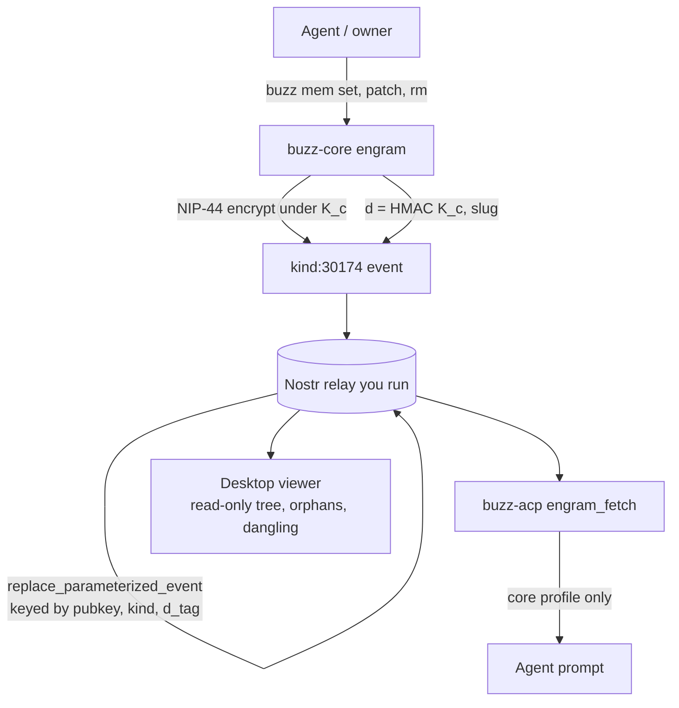

## 1. Executive Summary

Buzz is a workspace where people and agents share channels on a relay the
operator runs, and its memory layer is the part worth reading. Agent memory here
is not a library call or a service API — it is a **wire protocol**, specified as
NIP-AE and implemented against the spec clause by clause, with the code citing
rules by name (`spec: *Head selection* rule (3)`).

The design goal is unusual in this atlas and clearly stated by the mechanism:
**the infrastructure holding the memory should learn nothing from holding it.**
Bodies are NIP-44 encrypted under a conversation key derived from the agent and
owner keypairs, so the relay cannot read them. And the addressing is blinded
too — the `d` tag a relay indexes by is
`HMAC-SHA256(K_c, "agent-memory/v1/d-tag" || 0x00 || slug)`, so the relay cannot
tell `mem/values/honesty` from `mem/projects/q3`, or even that two engrams
belong to related topics. Nothing else in this atlas hides the *shape* of a
memory store from its own storage provider.

What is genuinely strong: a compare-and-swap write path
(`buzz mem patch --base-hash`) that refuses a diff generated against a value
another writer has since changed; last-writer-wins head selection with a
monotonic `created_at` and a deterministic event-id tiebreak; and a small piece
of prompt hygiene that most systems get wrong — the difference between "the
relay confirmed you have no core memory" and "the fetch failed", which produce a
nudge and *silence* respectively, so a transport error never teaches the agent
it has no past.

What is weakest is a direct consequence of the storage choice. Engrams are
parameterized-replaceable events: the relay stores one head per `d` tag and
**discards what it replaces**. So there is no version history, no way to see what
a memory said last week, and a tombstone is a statement that the slug is now
empty rather than a record of what was rejected. There is also no retrieval to
speak of — no embeddings, no search, no ranking anywhere in the memory path —
which is a defensible position for a store the agent curates by hand, and a hard
ceiling if it ever grows.

## 2. Mental Model

A memory is an **engram**: one `kind:30174` event whose decrypted body is either

```text
{"slug":"core","profile":"…"}          — the agent's identity surface
{"slug":"mem/…","value":"…"}           — one logical entry
{"slug":"mem/…","value":null}          — a tombstone
```

`Body` in `crates/buzz-core/src/engram.rs` is exactly that two-variant enum, and
`is_tombstone()` is `matches!(self, Body::Memory { value: None, .. })`.

Slugs are a namespace, not a schema:
`^mem/[a-z0-9][a-z0-9_-]{0,63}(/[a-z0-9][a-z0-9_-]{0,63})*$`, 255 bytes maximum.
Structure comes from **references** — literal `[[mem/some/slug]]` substrings
inside a body's free text, extracted by `extract_refs`. The desktop viewer walks
those refs from `core` to build a reachability tree, and reports two things the
walk produces: **orphans** (engrams not reachable from `core`) and **dangling
refs** (a `[[slug]]` pointing at something tombstoned or never written).

The state machine is short, and there is no epistemic content in it:

```text
   agent decides something is worth keeping
        │
        ▼
   buzz mem set / patch  ──►  encrypt, sign, publish
        │                          │
        │                     relay replaces the head for this d-tag
        │                     (the previous version is discarded)
        ▼
   engram is live ── reachable if some body references it, else an orphan
        │
        ├── mem patch --base-hash  ──► refused if the value moved underneath
        │
        └── mem rm ──► publish {value: null}
                            │
                            ▼
                   head is a tombstone; listings skip it;
                   refs to it become dangling.
                   What it used to say is gone from the relay.
```

Memory is **agent-controlled**, and unusually so: nothing derives, extracts,
summarizes, or scores. An engram exists because the agent wrote it, and says
what the agent wrote. The owner is a second principal who can also write —
`buzz mem set --owner …` — which makes this one of the few stores here where a
human and an agent are peers over the same namespace rather than one supervising
the other.

There is **no trust state and no provenance on a value**. An engram is signed,
so you know which key wrote it, and that is the entire epistemic apparatus.
Nothing marks a memory as a guess, a corroborated fact, or a thing the user
denied. `core` gets one structural protection: `mem rm` refuses to tombstone it.

## 3. Architecture

Rust, 26 crates, Apache 2.0. The memory path touches five of them:

- `buzz-core/src/engram.rs` (1,049 lines) — the protocol: slug validation, key
  derivation, d-tag HMAC, body encode/decode, event build, validate-and-decrypt,
  head selection, ref extraction.
- `buzz-cli` — the `buzz mem` verbs (`get`, `set`, `patch`, `hash`, `ls`, `rm`).
- `buzz-acp/src/engram_fetch.rs` (248 lines) — renders the core profile into the
  agent's prompt.
- `buzz-relay` — ingest, including the NIP-33 replaceable-event path.
- `buzz-conformance` — a property-test and replay-fixture harness for the spec.



`conversation_key(my_seckey, their_pubkey)` is symmetric, so agent and owner
derive the same `K_c` and either can read and write the namespace. The relay
sees signed events with opaque tags and nothing else.

### Deployment and ergonomics

- **What has to run:** a Nostr relay. Buzz ships one (`buzz-relay`), and the
  premise of the project is that you run it — "on a relay you own". There is no
  database to administer beyond what the relay needs, no vector service, no
  model provider. Memory costs no LLM calls at all.
- **Fully local and offline:** yes, and nothing degrades, because nothing in the
  memory path calls a model.
- **No API key is required to store anything**, which is rare here.
- **Hand-repairable:** partly. The store is a relay database of ciphertext, so
  you cannot fix it with a text editor, but `buzz mem get`, `hash`, `ls` and
  `patch` give you a complete command-line surface over plaintext, and the body
  format is a two-field JSON object.
- The install path is a Rust workspace build plus a relay; this is the heaviest
  part of adopting it, and it buys the sovereignty the design is about.

## 4. Essential Implementation Paths

**Write.** `buzz mem set` → `Body::Memory{slug, value}` →
`to_json_bytes` (hand-rolled so test vectors match byte-for-byte) → NIP-44
encrypt under `K_c` → `EventBuilder::new(Kind::Custom(KIND_AGENT_ENGRAM), …)`
with the HMAC `d` tag and a `p` tag → sign → publish
(`crates/buzz-core/src/engram.rs:430`).

**Compare-and-swap write.** `buzz mem patch` (`crates/buzz-cli/src/lib.rs:1602`)
reads a unified diff, requires `--base-hash` (a sha256 of the exact UTF-8 bytes
`mem get` returned), refuses if the slug moved since, and additionally
"refuses hunks whose context doesn't match the current value verbatim".
`--no-base-hash` disables the check and its doc comment says so plainly.

**Read.** `validate_and_decrypt` (line 475) checks kind, tag shape and
addressing per *Head selection* rules (1) and (5), then decrypts. Body parsing
rejects duplicate JSON member names at any nesting depth via a custom serde
visitor (line 276) because *Head selection* rule (3) demands strict rejection
and `serde_json` would otherwise take last-wins.

**Head selection.** `select_head` (line 564) takes the greatest `created_at`,
tie-broken by event id. `monotonic_created_at` (line 588) returns
`max(now, prior_head + 1)` so a write always beats the head it was based on even
under clock skew.

**Context injection.** `engram_fetch.rs` builds one prompt section from `core`
and nothing else. Its three-way return is the interesting part: `Some(profile)`
when a core exists, `Some(nudge)` when **the relay confirmed absence**, and
`None` when the fetch failed — with the comment that the caller injects nothing
in that case "so the agent doesn't conclude" it has no memory.

**Delete.** `buzz mem rm` publishes `{slug, value: null}`; the type system bars
`core`.

**Graph.** `desktop/src/features/agent-memory/lib/buildMemoryGraph.ts` walks
`[[slug]]` refs from `core` with a visited set, emitting `rootedTree`, `orphans`
and `dangling`.

**Storage.** `crates/buzz-relay/src/handlers/ingest.rs:2412` routes replaceable
kinds; engrams take the `replace_parameterized_event` branch keyed by
`(pubkey, kind, d_tag)`.

## 5. Memory Data Model

There is no table. The unit is an event, and its fields are the Nostr envelope
(`id`, `pubkey`, `created_at`, `kind`, `tags`, `sig`, `content`) plus a decrypted
body of one or two fields. Everything the atlas usually looks for in a schema is
absent by design: no confidence, no source, no category, no expiry, no version
column, no `deleted_at`.

**Temporal fields:** one, `created_at`, used for last-writer-wins. Not
bi-temporal — there is no validity interval, and because the relay replaces,
there is not even a record time series to reason over.

**Scoping** is the strongest form in this atlas and it is cryptographic rather
than procedural. The `d` tag is `HMAC(K_c, slug)` where `K_c` is derived from
the agent-owner keypair, and the relay filters by `(pubkey, kind, d_tag)`. A
different owner produces different d-tags for the same slug, so the namespaces
do not merely fail to join — they are not addressable across the boundary at
all. That earns `scope_enforced`, and it is worth noting that most systems here
earn it with a `WHERE` clause.

**Size limits are enforced at build time:** bodies over the NIP-44 plaintext
limit "MUST NOT be encrypted" and `body_too_large_rejected_at_build_time`
tests it.

## 6. Retrieval Mechanics

**There is none, and that is a position rather than an omission.**

No embeddings appear anywhere in the memory path. `buzz-search` does not touch
engrams. There is no ranking, no scoring, no recency weighting, no hybrid
fusion, no reranker. The three ways a memory reaches the model are:

1. `core` is fetched and injected into the prompt on every session by
   `engram_fetch`.
2. The agent reads a `[[slug]]` reference in something already in context and
   asks for that slug.
3. Someone runs `buzz mem get <slug>` or `buzz mem ls`.

So the reachability tree is not a visualization of retrieval — it *is* the
retrieval model. An engram not referenced from `core`, directly or transitively,
will never be seen unless the agent already knows its name. The desktop viewer
surfacing **orphans** is therefore a genuine diagnostic: an orphan is a memory
that exists and cannot be found.

The failure mode is the obvious one. This scales to a curated store of tens or
low hundreds of entries maintained deliberately, and not past that. There is no
mechanism by which a relevant memory surfaces because it is relevant.

## 7. Write Mechanics

Writes are **synchronous and cheap** — serialize, encrypt, sign, publish. No LLM
runs, so there is no extraction prompt to inspect, no consolidation pass, and no
deduplication. Whatever the agent decided to write is what is stored, verbatim.

Conflict handling is where the care went, and it is the best concurrent-write
story in this atlas:

- **Head selection** is last-writer-wins on `created_at`, tie-broken by event id
  so two events in the same second resolve identically for every reader.
- **`monotonic_created_at`** returns `max(now, prior_head + 1)`, so a writer with
  a slow clock still supersedes the head it read.
- **`mem patch --base-hash`** is optimistic concurrency control: the diff carries
  a sha256 of the value it was generated against, and the patch is refused if
  the current value hashes differently, *and* refused if any hunk's context does
  not match verbatim. `buzz mem hash <slug>` exists to capture the base hash.

Malicious input is handled at the envelope: signatures establish authorship,
`validate_and_decrypt` rejects wrong kinds, non-lowercase d-tags, and malformed
addressing, and the duplicate-member rejection closes a JSON parser
ambiguity that would otherwise let two readers disagree about a body. What is
*not* handled is content — an engram whose text is a prompt injection is stored
and injected like any other, and there is no filter, classifier or trust level
between the write and the prompt.

### Operational cost

- **Synchronous, and free of models.** A write is one encryption and one relay
  round trip. No system in this atlas has a cheaper write path.
- **Lag before a memory is retrievable: none in the extraction sense** — there is
  no extraction. The memory is live when the relay accepts the event.
- **No background pass exists**, so nothing rewrites the store, and the token
  bill for memory is zero.
- **On the read path**, exactly one section is injected per session: the `core`
  profile, rendered under a fixed header. It is unbounded in the sense that
  `core` is free-form text the agent maintains, so its size is the agent's
  discipline rather than a budget the code enforces.

## 8. Agent Integration

The agent surface is the `buzz mem` CLI, which the agent invokes as a tool, plus
the automatic `core` injection through ACP. There is an MCP server
(`buzz-dev-mcp`) but it is a development surface rather than the memory API.

Agency is total and unusual: the agent decides what a memory is, what it is
called, what it says, when to supersede it, and when to delete it. Nothing
supervises that. The counterweight is that the owner shares the namespace and can
read and rewrite anything in it from the same CLI.

The onboarding path is worth naming because it is a design decision rather than
copy: a new agent with no `core` gets a section telling it to create one and to
*ask the user about themselves*. Memory formation starts with an interview
rather than with observation, which is the opposite of the screen-capture systems
elsewhere in this atlas.

## 9. Reliability, Safety, and Trust

**Confidentiality is the strength, and it goes further than encryption at rest.**
Content is NIP-44 encrypted; addressing is HMAC-blinded. A relay operator — even
a malicious one — learns the number of engrams an agent has, their sizes, and
when they changed, and not what they are about. Traffic analysis over sizes and
timing remains available, and nothing here claims otherwise.

**Provenance is a signature and nothing more.** You can prove which key wrote an
engram. You cannot ask why it believes something, what it was derived from, or
whether anyone corroborated it. For a store the agent writes by hand this is a
defensible floor, and it means the memory layer cannot represent uncertainty at
all.

**The replaceable-event choice costs history.** `replace_parameterized_event`
keeps one row per `(pubkey, kind, d_tag)`. When an engram is rewritten the prior
ciphertext is gone from the relay. Three consequences follow: you cannot diff a
memory against its past, a mistaken overwrite is unrecoverable, and a tombstone
carries no information about what it replaced. This is the reason the report
withholds the tombstone mark — `value: null` is a **delete marker keyed on the
slug**, which the atlas's definition explicitly separates from a record of a
rejected *value*. Write the same wrong thing to the same slug again and nothing
objects.

**The audit crate does not cover memory.** `buzz-audit` is a hash-chained
append-and-verify log, and its `AuditAction` enum is
`EventCreated`, `EventDeleted`, `ChannelCreated/Updated/Deleted`,
`MemberAdded/Removed`, `AuthSuccess/Failure`, `RateLimitExceeded`,
`MediaUploaded` — relay and channel operations. No engram action exists, and
because the relay replaces rather than appends, there is no mutation history to
audit even in principle. `audit_log` withheld.

**The desktop viewer is explicitly read-only** — its own comment says "IXI-7
phase 1 read-only viewer", and the single Tauri command is `get_agent_memory`.
So `human_review` is withheld under the rule that a UI which only displays is
not a review surface. The near-miss is real and worth stating: the owner *does*
have authority over the agent's memory and can delete any of it — just from the
CLI, not from the screen that shows them what is there.

**`--no-base-hash`** is a documented escape hatch that turns the compare-and-swap
back into a blind write. It is honest about the risk in its help text, and it is
the kind of flag that ends up in a script.

## 10. Tests, Evals, and Benchmarks

**34 tests in `engram.rs` alone**, and they are the right ones: round-trip
encrypt/decrypt, rejection of non-lowercase d-tags, oversized bodies refused at
build time, head selection with an event-id tiebreak, distinct slugs that must
not collide onto one head, and eighteen cases pinning `extract_refs` behaviour —
unclosed brackets, triple brackets, UTF-8 either side, dedupe preserving first
occurrence, oversized slugs dropped, self-reference allowed.

`buzz-conformance` is a separate crate with **property tests**
(`proptest_checker.rs`) and **replay fixtures** (`replay_fixtures.rs`) plus a
documented `TRACE_SCHEMA.md` and `LIMITS.md`. Testing a memory protocol by
replaying recorded traces against a state-machine checker is a level of rigour
this atlas sees rarely, and it is the direct benefit of having written the spec
first.

There are **no benchmarks**, which is correct — there is nothing to score. No
LoCoMo run would mean anything for a store with no retrieval.

No test asserts that particular material must *not* be retrievable, so
`negative_eval` is withheld. The nearest thing is
`select_head`'s collision test, which asserts two distinct slugs do not map to
the same head — a correctness property, not a retrieval assertion.

**What I would want before trusting it:** a test that a tombstoned slug stays
tombstoned after a concurrent write with an older clock; and any test at all of
the `engram_fetch` three-way return, since the confirmed-absent versus
fetch-failed distinction is the subtlest thing in the memory path and the easiest
to regress.

## 11. For Your Own Build

### Steal

- **Blind the index, not just the payload.** Encrypting values while indexing
  them under their real names tells your storage provider the shape of everything
  you know. An HMAC of the key under a secret both endpoints hold costs one hash
  and removes that.
- **Compare-and-swap on a memory value.** `hash → edit → patch --base-hash` is a
  three-command protocol that makes concurrent agent edits safe without locks,
  and it is trivially portable to any store that can return bytes.
- **Monotonic timestamps for last-writer-wins.** `max(now, prior_head + 1)`
  removes clock skew as a correctness concern in about four lines. If you resolve
  conflicts by timestamp and have not done this, you have a bug waiting for a bad
  clock.
- **Distinguish "confirmed empty" from "could not check".** Injecting a
  "you have no memories yet" nudge on a *failed fetch* teaches the agent
  something false about itself. Returning nothing is the correct behaviour and
  almost nobody codes the third case.
- **Report orphans.** If reachability is your retrieval model, an unreachable
  memory is invisible, and a store that can list its own orphans can be repaired.

### Avoid

- **Replaceable storage for anything you may need to explain.** Choosing a
  substrate that discards what it overwrites forecloses version history, undo,
  and any future audit, and it is not a decision you can reverse later without
  changing the wire format.
- **Confusing a delete marker with a rejection record.** A null-valued head stops
  the old value being served and says nothing about *what* was wrong. If your
  concern is an agent re-asserting a corrected fact, this shape does not help.
- **Shipping a read-only memory viewer as the review story.** People who can see
  a wrong memory and not fix it in the same place will stop looking.
- **An escape-hatch flag on your concurrency check.** `--no-base-hash` is
  documented and dangerous; if you must have one, log every use.

### Fit

This is for someone whose actual requirement is that a third party must not be
able to read or profile their agent's memory — a regulated deployment, a
sovereignty-conscious org, a personal agent whose owner means it. Buy that and
you get a small, legible, model-free memory layer with an unusually careful
concurrency story and a spec you can reimplement. The Rust workspace and the
relay are the price, and the price is real.

Anyone whose memory has to *scale* should walk away now rather than later. A
store with no retrieval works while the agent can hold its own namespace in
mind, and there is no growth path here that does not mean designing retrieval
from scratch — embeddings over ciphertext the relay cannot read is a research
problem, not a backlog item. The same applies if you need to explain a memory's
history or prove a correction stuck: the substrate threw the evidence away.

And if you want memory that forms itself from conversation, this is the wrong
family entirely. Nothing here observes, extracts or infers. The agent writes what
it decides to write, or the store stays empty.

## 12. Open Questions

- **Does the relay retain any superseded engram anywhere?** The ingest path
  replaces, but whether backups, the mesh (`buzz-relay-mesh`), or a pubsub
  subscriber retains prior ciphertext was not traced, and it decides whether
  "deleted" is a claim about one server or about the system.
- **What happens to dangling refs over time?** The viewer reports them; nothing
  found repairs or garbage-collects them, so a long-lived `core` presumably
  accumulates references to things it deleted.
- **Is `core` size bounded anywhere?** It is injected on every session and is
  free-form text the agent maintains. No budget was found on the injection path.
- **How do multiple agents over one owner interact?** `K_c` is per agent-owner
  pair, so each agent has a private namespace — whether anything is intended to
  be shared between an owner's agents, and how, was not determined.
- **Is NIP-AE published outside this repository?** The code cites the spec by
  rule name throughout; the spec document itself was not located here, and
  whether it is public affects how reimplementable the protocol actually is.
- **Could this design have retrieval at all?** Section 11 says designing it would
  be starting from scratch, which is true of *server-side* similarity search over
  ciphertext and not true of the alternative: keep the index client-side and the
  content remote. A quantised 384-dimension index is roughly 38 MB for 100k
  memories, which is a phone. That argument, along with the two things
  encryption fixes rather than costs — crypto-shredding as the only answer to
  propagated copies, and a tombstone that blocks re-assertion *without* retaining
  the rejected value — is worked through in
  [a design note](https://github.com/neoneye/agent-memory-atlas/blob/main/notes/2026-07-29-what-survives-encryption.md).
  Nothing in it was read in code, including here.

## Appendix: File Index

**Protocol core**

- `crates/buzz-core/src/engram.rs` — slugs, `conversation_key`, `d_tag`, `Body`,
  `extract_refs`, `select_head`, `monotonic_created_at`, 34 tests
- `crates/buzz-core/src/kind.rs` — `KIND_AGENT_ENGRAM` (30174), `is_replaceable`

**Write and CLI**

- `crates/buzz-cli/src/lib.rs` — `mem get|set|patch|hash|ls|rm`
- `crates/buzz-cli/src/error.rs` — absent-or-tombstoned error

**Read and injection**

- `crates/buzz-acp/src/engram_fetch.rs` — core section, nudge, and the
  inject-nothing-on-failure case

**Storage**

- `crates/buzz-relay/src/handlers/ingest.rs` — `replace_parameterized_event`
- `crates/buzz-relay/src/nip11.rs` — NIP-33 advertisement

**Graph and UI**

- `desktop/src/features/agent-memory/lib/buildMemoryGraph.ts`
- `desktop/src/features/agent-memory/ui/MemorySection.tsx` — read-only viewer
- `desktop/src-tauri/src/commands/engrams.rs` — `get_agent_memory`

**Audit (not memory)**

- `crates/buzz-audit/src/action.rs` — `AuditAction`, no engram variant

**Tests**

- `crates/buzz-conformance/` — `checker.rs`, `transitions.rs`,
  `proptest_checker.rs`, `replay_fixtures.rs`, `TRACE_SCHEMA.md`, `LIMITS.md`
- `desktop/src/features/agent-memory/lib/buildMemoryGraph.test.mjs`
