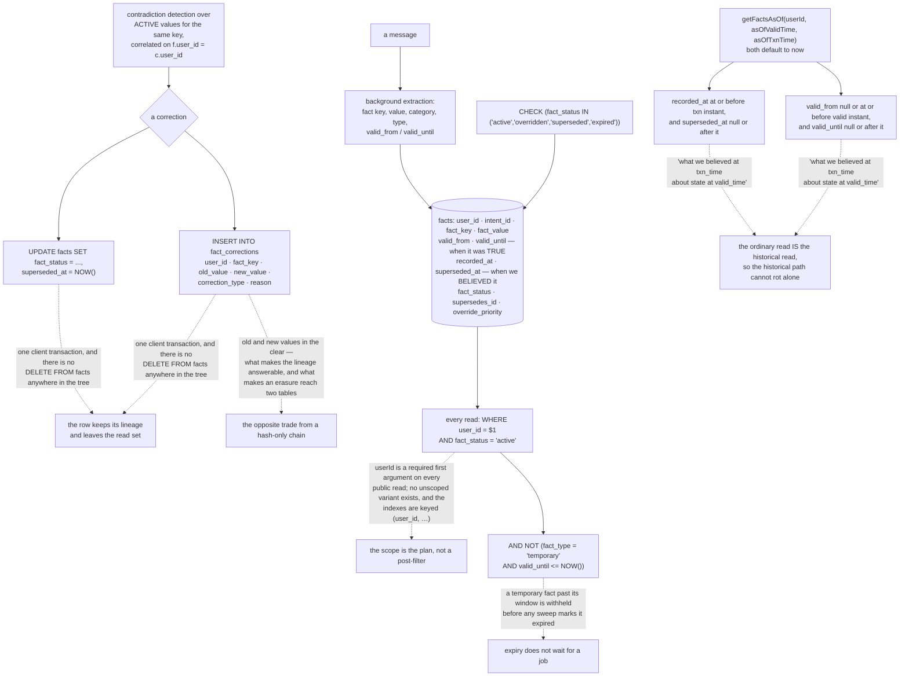

## 1. Executive Summary

bwmem is a "Memory SDK for AI chatbots" giving "your bot persistent, per-user
memory: bi-temporal facts, semantic search, emotional capture, contradiction
detection, quality scoring, session-texture carryover, held intentions,
knowledge graph, and multi-stage consolidation." AGPL-3.0, TypeScript, version
0.11.2, 17,259 lines across 105 files, on PostgreSQL with pgvector, Redis, and
optionally Neo4j. It is extracted from Luna, the vendor's longer-running agent
system.

**The document worth reading is a migration.** `007_bi_temporal_facts.sql` opens
by stating what the schema could not do before it:

> "The facts table already has valid_from / valid_until (when a fact was true in
> the world) and supersedes_id (lineage). What was missing is the second time
> axis — WHEN WE CHANGED OUR BELIEF — distinct from when something was true.
> Without this you can't honestly answer 'what did we believe about X on date
> Y' — you can only answer 'what was true on date Y.'"

It then defines each column in a single line, writes out the composed query, and
`getFactsAsOf(userId, asOfValidTime, asOfTxnTime)` implements it with both
instants defaulting to now. That default is the part that matters: the ordinary
read and the historical read are the same function with different arguments, so
the historical path cannot quietly break while the current one keeps working —
the failure the atlas found two reports into this same family.

**The status vocabulary is enforced by the database.** `fact_status` is
constrained to `active`, `overridden`, `superseded` and `expired`, every read
filters to `active`, and the partial index is built `WHERE fact_status =
'active'` — so the active set is the read set in the planner as well as in the
predicate. A superseded fact keeps its row, its lineage and its place in the
bitemporal history while leaving what the bot is handed.

**Scope is the other thing done without a gap.** `user_id` is stored on every
fact, is the first bound parameter of every read, and is a required argument with
no unscoped variant; the indexes are keyed on it. Migration 007 adds `intent_id`
beside it for facts that belong to one conversation thread "and should not bleed
into the user's general facts."

**The trade to notice is in the corrections log.** `fact_corrections` records
`old_value` and `new_value` in the clear, which is exactly what makes "how did we
come to believe what we believe" answerable — and exactly what
[Verimem](../verimem/), read a report earlier, argues an immutable log must never
contain, because it turns erasure into a contradiction. Both positions are
defensible; what bwmem does not have is a purge path that reaches both tables.

## 2. Mental Model

A **fact** is per-user, keyed, and never deleted.

A **status** is one of four, and only one of them is readable.

A **correction** writes a row saying what the value was, what it became, and why.

An **as-of read** is the ordinary read with two instants supplied.

## 3. Architecture

| Area | Role |
| --- | --- |
| `src/db/migrations/` | The schema, with the reasoning in the migration headers |
| `src/memory/facts.service.ts` | Writes, supersession, the corrections row, the as-of read |
| `src/memory/contradiction.service.ts` | Held contradictions over active values for one user |
| `src/memory/quality-scorer.service.ts` | Response scoring against what the store holds |
| `src/consolidation/` | The multi-stage background passes |
| `src/graph/` | Optional Neo4j sync, non-blocking and counted on failure |

## 4. Essential Implementation Paths

`src/db/migrations/007_bi_temporal_facts.sql:1-27` — the problem, the four
columns, and the composed query, before any DDL.

`src/memory/facts.service.ts:437-458` — both axes as parameters, each predicate
commented with the question it answers.

`src/db/migrations/001_core.sql:49-50`, `:65` — a status constrained by the
database and indexed on its own predicate.

`src/memory/facts.service.ts:590-621` — a supersession and its audit row in one
transaction.

## 5. Memory Data Model

A fact carries a user, an optional intent, a key and value, a category and type,
a confidence, an override priority, both validity bounds, both transaction
bounds, a status and a lineage link. Messages, sessions, held intentions and
emotional capture sit beside it, and `fact_corrections` records every belief
change.

## 6. Retrieval Mechanics

Full-text search with `to_tsquery` and semantic search over pgvector, both
scoped to the user and filtered to active facts, with a temporary-fact expiry
clause applied in the same predicate rather than depending on a sweep. A context
builder assembles what reaches the prompt.

## 7. Write Mechanics

Messages are recorded, facts extracted in the background, and a conflicting
value supersedes rather than overwrites: status and `superseded_at` on the old
row, a new row with `supersedes_id`, and a corrections row naming both values.
Graph sync is fire-and-forget with a counter on failure, so the optional service
cannot block a write.

## 8. Agent Integration

An SDK rather than a server: record messages, build context, inject into the
prompt. A Docker compose file brings up Postgres, Redis and Neo4j for local use.

## 9. Reliability, Safety, and Trust

The strong parts are the two axes with one read path, a status the database
constrains, and a user scope no read omits. The gaps are a corrections log that
stores plaintext values with no purge that reaches it, no value-keyed record to
stop a corrected fact being re-extracted, no person anywhere in the loop, and
tests that stop at the unit level.

## 10. Tests, Evals, and Benchmarks

Vitest unit tests over SQL shape, context formatting, consolidation gating,
contradiction handling and embedding behaviour. There is no store-level case
asserting that a superseded fact or another user's fact fails to come back,
which for a design that rests on exactly those two predicates would be the
cheapest assertion to add.

## 11. For Your Own Build

Write the migration header the way this one is written. Stating the question the
old schema could not answer, before the DDL, is what makes a second time axis a
decision rather than two more columns.

Default both as-of parameters to now. If the historical read is a separate
method, it will break separately and later.

Constrain the status in the database and index on the predicate you filter with.
It makes the active set the read set in two places instead of one.

Decide whether your audit log may hold values, and know what you are trading. In
the clear it answers how a belief formed; hashed or omitted it keeps erasure
possible. Either is defensible; having neither answer is not.

## 12. Open Questions

Whether an erasure path is planned that reaches `fact_corrections`. The facts
table is append-only by design and the corrections table holds the same values,
so a user's request to be forgotten currently has two places to go and one
mechanism.

Whether the `reason` column is meant to carry an explanation. It is populated
with one of two fixed strings today, and a column named `reason` in an audit log
invites a reader to expect the sentence somebody wrote.

## Appendix: File Index

| Path | What to read it for |
| --- | --- |
| `src/db/migrations/007_bi_temporal_facts.sql:1-27` | The clearest statement of why one time axis is not enough |
| `src/memory/facts.service.ts:437-458` | One read path serving both the current and the historical question |
| `src/db/migrations/001_core.sql:49-50`, `:65` | A status the database enforces and the index agrees with |
| `src/memory/facts.service.ts:590-621` | A supersession and its audit row, in one transaction |

## History

**2026-09-16** — [`a0f7c194121f7b89afa0439bcca44c86d66d0e99`](https://github.com/Bitwarelabscom/bwmem/commit/a0f7c194121f7b89afa0439bcca44c86d66d0e99) — first reading, at a commit dated 12 September 2026. Screened before opening, from a shallow clone: no auto-run surfaces, one build-time execution point, one unpinned dependency surface and two dependency files inside the seven-day cooldown, with `package-lock.json` present. Nothing was installed, built or run; no PostgreSQL, Redis or Neo4j was started, so the SQL described here is read from the migrations and the service source rather than executed.
