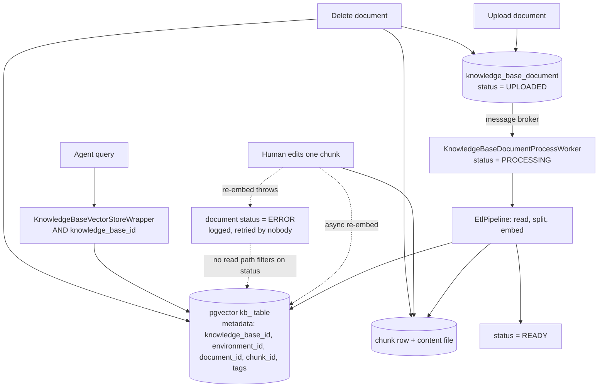

## 1. Executive Summary

ByteChef is a workflow-automation platform — 738,068 lines of Java across 6,998
files, 18,645 commits since 12 June 2016, Apache 2.0 with a commercially
licensed `server/ee/` tree — that has grown an AI-agent product on top of Spring
AI. It is not a memory system; it is a system that ships memory as a component,
and that framing explains both what is good in it and what is missing.

**The memory is two things with almost nothing in common.** A **knowledge base**
— documents uploaded, chunked, embedded into a pgvector table and searched — with
a real ingest pipeline, a background worker, chunk-level editing and a deletion
path that reaches every store a chunk lives in. And **chat memory**, nine
interchangeable Spring AI `ChatMemoryRepository` backends (JDBC, Redis, MongoDB,
Cassandra, Neo4j, S3, in-memory, a vector store, and the built-in application
database) behind `MessageWindowChatMemory`, which is a window over a durable
store rather than a store with a lifecycle.

**The best thing here is an ordering constant.**
`SanitizeTextAdvisor.getOrder()` returns
`Advisor.DEFAULT_CHAT_MEMORY_PRECEDENCE_ORDER - 1`, which places PII, secret-key
and URL masking exactly one step upstream of the chat-memory advisor — so the
text that reaches the repository is the masked text, not the raw one. It is
pinned by a test whose assertion message states the property rather than the
mechanism: *"SanitizeTextAdvisor MUST run before chat-memory advisor, otherwise
unsanitized text gets persisted."* Beside it, `AbstractAiAgentChatAction` throws
`IllegalStateException` when a workflow configures two `SanitizeText` or two
`CheckForViolations` elements, because two advisors at the same order make Spring
AI's ordering undefined — a design that depends on a total order refusing a
configuration that makes it a tie.

**The scope key is real on the knowledge-base read path.**
`KnowledgeBaseVectorStoreWrapper` is a `VectorStore` decorator holding one
`knowledgeBaseId`; every `similaritySearch` builds `knowledge_base_id = ?` and
AND-s the caller's own filter onto it, so a workflow-supplied expression can
narrow the result set and cannot widen it. The same decorator stamps the key on
every `add` and AND-s it into `delete(Filter.Expression)`.

**What is weakest is what surrounds that key.** Two ambient ThreadLocals carry
the rest of the isolation, and both fail *open to a real target*:
`TenantContext.currentTenant` is `ThreadLocal.withInitial(() -> "public")` and
selects a Postgres schema, and `EnvironmentContext.getCurrentEnvironment()`
returns `Environment.PRODUCTION` when nothing is bound, logging the fallback at
`debug`. A path that forgets to bind does not fail; it reads the default tenant
and production. Chat memory has no scope key at all — `findConversationIds()`
enumerates every conversation in the store, and the workflow editor renders that
list as a dropdown labelled with each conversation's opening message.

## 2. Mental Model

Two units, and the interesting one is the chunk, because it exists in three
places at once. `KnowledgeBaseDocumentChunk` is a Postgres row holding a
`vectorStoreId` and a `FileEntry`; the chunk *text* is in file storage and the
*embedding* is in the pgvector table. The row is the index of record, the file is
the content, and the vector is what retrieval actually searches. Every write and
every delete has to reach all three, and every claim about correction depends on
whether they agree.

Nothing here is a belief. There is no epistemic state on a memory: a chunk is not
candidate or verified or rejected, a conversation message is not disputed. The
one status field, `KnowledgeBaseDocument.status`, is a **pipeline stage** —
`STATUS_UPLOADED`, `STATUS_PROCESSING`, `STATUS_READY`, `STATUS_ERROR` — and it
lives on the document rather than on the chunk. `buildFilterExpression` does not
consult it, so it never reaches a query.

That gap has a concrete consequence, and it is the state machine worth drawing. A
person edits a chunk in the UI. `updateKnowledgeBaseDocumentChunk` replaces
the content file and the row inside a transaction and publishes an event; the
worker consumes it and re-embeds. Until that lands, the vector store still holds
the embedding of the *pre-edit* text, so the corrected chunk answers queries in
its uncorrected form. If the re-embed throws, the worker marks the **document**
`STATUS_ERROR` and returns — and because no read path filters on status, the
stale vector keeps answering indefinitely, while the UI shows an error the
retrieval path never learns about.

## 3. Architecture

A Spring Boot monolith that can be split: `server/libs` holds the platform,
`server/ee` the commercially licensed multi-tenant and AI-agent extensions,
`client` a React workflow editor, `sdks` embeddable front-ends, and `spring-ai` a
set of Spring AI contributions the project maintains itself, including an
`S3ChatMemoryRepository` written under the `org.springframework.ai` package.

Standing this up is not a small ask. Postgres with pgvector is required for the
knowledge base (`KnowledgeBasePgVectorConfiguration` builds a `PgVectorStore` on
a `kb_`-prefixed table, `initializeSchema(true)`), a message broker carries
ingest, file storage is pluggable across filesystem, S3 and others, and an
embedding model must be reachable before a document can be made searchable. Chat
memory adds whichever backend the workflow chose. The knowledge base is off
unless `bytechef.ai.knowledge-base.enabled=true` — every bean in the subsystem
carries that `@ConditionalOnProperty`.

**Multi-tenancy is schema-per-tenant, not a column.** `TenantContext` resolves a
Postgres schema per request; `MultiTenantDataSource` routes to it. That is a
stronger boundary than a predicate somebody has to remember to write, and it is
also why the memory code contains almost no tenant filters — the isolation is
below it. The cost is the default: `ThreadLocal.withInitial(() -> "public")`
means an unbound thread is a valid tenant rather than an error.

The store is inspectable but not hand-repairable in the useful sense. Rows are
Postgres, chunk text is in file storage, and the embedding is a vector column —
correcting a chunk by hand means fixing three stores in agreement, which is
exactly what the facade exists to do.

## 4. Essential Implementation Paths

- **Ingest.** `KnowledgeBaseDocumentFacadeImpl.uploadDocument` → event →
  `KnowledgeBaseDocumentProcessWorker.onKnowledgeBaseDocumentEvent` →
  `KnowledgeBaseEtlPipeline.process` (reader factory → transformer chain) →
  per-chunk `writeChunkToVectorStore` → `KnowledgeBaseVectorStoreWriter.writeChunk`.
- **Sanitize document metadata.** `KnowledgeBaseVectorStoreWriter.sanitizeDocument`
  strips `\0` (Postgres text columns reject it) and stamps `environment_id`,
  `knowledge_base_id`, `knowledge_base_document_id`, `knowledge_base_document_chunk_id`
  and both a `tag_names` list and a `tag_names_<name>: true` flag per tag.
- **Retrieve, scoped.** `KnowledgeBaseVectorStoreWrapper.similaritySearch`
  (component path) and `KnowledgeBaseFacadeImpl.buildFilterExpression` (platform
  path). The workflow-facing `VectorStoreDocumentRetriever` builds a Spring AI
  retriever whose `filterExpression` is a *string the author types*, parsed by
  `FilterExpressionTextParser`.
- **Correct.** `KnowledgeBaseDocumentChunkFacadeImpl.updateKnowledgeBaseDocumentChunk`
  → `KnowledgeBaseDocumentChunkEvent` →
  `KnowledgeBaseDocumentProcessWorker.onKnowledgeBaseDocumentChunkEvent` →
  `KnowledgeBaseEtlPipeline.processChunkUpdate`.
- **Forget.** `KnowledgeBaseDocumentFacadeImpl.deleteKnowledgeBaseDocument`:
  vectors by id, then chunk content files, then chunk rows, then the source file,
  then the document row.
- **Chat memory.** `AbstractAiAgentChatAction` reads the `conversationId` from
  the cluster element's parameters and passes it as
  `ChatMemory.CONVERSATION_ID`; `ChatMemory.of(...)` builds a
  `MessageWindowChatMemory` over the configured repository;
  `ChatMemoryDeleteAction`, `ChatMemoryGetMessagesAction`,
  `ChatMemoryAddMessagesAction` and `ChatMemoryListConversationsAction` expose it
  as workflow actions.
- **Guardrails.** `CheckForViolationsAdvisor` at `HIGHEST_PRECEDENCE`,
  `SanitizeTextAdvisor` at `DEFAULT_CHAT_MEMORY_PRECEDENCE_ORDER - 1`, with
  detectors in `PiiDetectorUtils`, `SecretKeyDetectorUtils`, `UrlDetectorUtils`,
  `KeywordMatcherUtils` and `LlmPiiDetectorUtils`.
- **Tenancy.** `TenantContext`, `MultiTenantDataSource`,
  `TenantRoutingS3ChatMemoryRepository`.

## 5. Memory Data Model

`knowledge_base` carries `name`, `description`, an `environment` ordinal and the
chunking parameters the ingest will use — `maxChunkSize` 1024,
`minChunkSizeChars` 100, `overlap` 200 — so chunking is configured per knowledge
base rather than globally, which is the right place for it.
`knowledge_base_document` carries the `FileEntry`, the status and its tags.
`knowledge_base_document_chunk` carries `knowledgeBaseDocumentId`,
`vectorStoreId`, the content `FileEntry`, and `@Transient` fields for `metadata`,
`score` and `textContent` that are populated on read rather than stored.

Every table carries Spring Data auditing — `@CreatedDate`, `@CreatedBy`,
`@LastModifiedDate`, `@LastModifiedBy` and an optimistic-locking `@Version`. That
is who last touched a row, not a record of what changed, so `audit_log` is
withheld: there is no append-only event stream of memory mutations anywhere in
the subsystem, and the only history a corrected chunk leaves is an overwritten
`lastModifiedBy`.

**Scoping is three mechanisms at three layers, and only one of them is a stored
key on the record.** The schema (tenant), the ThreadLocal (environment, which
selects model credentials rather than data), and `knowledge_base_id` (a metadata
field on every vector). `environment_id` is stamped into chunk metadata at write
by `sanitizeDocument` and **no read path filters on it** — isolation between a
staging and a production knowledge base is delivered by them being different
`knowledge_base_id`s, not by the environment key. The key is written, indexed by
the vector store, and never queried.

Temporal fields are record time only. There is no validity axis and no as-of
read, so `bitemporal` is withheld.

## 6. Retrieval Mechanics

Vector similarity, and nothing else. There is no BM25 arm, no fusion, no
reranking and no query transformation on the knowledge-base path —
`searchKnowledgeBase` builds a `SearchRequest` with `topK(10)` and a filter
expression, and returns what pgvector gives back. The modular RAG components
(`MultiQueryExpander`, `RewriteQueryTransformer`, `TranslationQueryTransformer`,
`CompressionQueryTransformer`, `ConcatenationDocumentJoiner`) exist as separate
cluster elements a workflow author can wire in front of a retriever, which is
Spring AI's Modular RAG surfaced as boxes on a canvas — powerful, and entirely
the author's responsibility to assemble.

**The tag filter is the one piece of real cleverness.** Because filter
expressions over an array metadata value are awkward, `sanitizeDocument` writes
both `tag_names: [...]` and a boolean flag per tag, `tag_names_<name>: true`, and
`buildTagFilter` OR-s equality checks over those flags. It is a denormalisation
chosen to fit the query language rather than the data, stated as such, and it
means adding a tag to a document requires rewriting every chunk's metadata —
which `updateKnowledgeBaseDocumentTags` does, chunk by chunk.

Chat memory does not retrieve. `MessageWindowChatMemory` returns the last N
messages of one conversation — Spring AI's default is 20 and no builder here
overrides it. The `chat-memory-vectorstore` backend is the exception worth
naming: it persists messages into a vector store, which makes *searching* past
conversation possible in principle, and the component still hands the agent a
window because that is what the `ChatMemory` contract returns.

Two failure modes follow from what is missing. Nothing filters on document
status, so a chunk whose re-embed failed stays in the candidate set with its old
embedding. And the retriever's `similarityThreshold` defaults to accept-all, so a
knowledge base with nothing relevant returns its ten least-irrelevant chunks
rather than nothing.

## 7. Write Mechanics

Ingest is asynchronous and event-driven: an upload returns as soon as the file is
stored, an event goes onto the message broker, and
`KnowledgeBaseDocumentProcessWorker` does the reading, splitting and embedding.
The document moves UPLOADED → PROCESSING → READY, or → ERROR with the exception
logged. Nothing retries, and nothing re-drives an ERROR document except a person
noticing it in the UI.

**Deletion is the part of this design that most systems in the atlas get wrong,
and ByteChef gets right.** `deleteKnowledgeBaseDocument` collects the chunks,
resolves the knowledge base to bind the environment, deletes the vectors by id,
deletes each chunk's content file, deletes the chunk rows, deletes the source
document file, then deletes the document row — inside a `@Transactional` facade.
The *order* is the part worth copying: vectors first, rows last. A crash midway
leaves a row whose vector is already gone, which makes a chunk unfindable; the
reverse order would leave a vector whose row is gone, which is a chunk that still
answers queries and can no longer be traced back to a document. One of those
failure modes is a gap and the other is a leak, and the code takes the gap.

The transaction does not extend to the vector store or the file store, which are
not transactional participants — so "all five deletes commit or none do" is not a
guarantee this design can make, and it does not claim it.

Chat memory writes happen inside the advisor chain during the model call, after
the sanitizer. There is no deduplication, no consolidation and no summarisation:
the window is the whole policy, and messages older than N fall out of the read
rather than being compacted into anything.

### Operational cost

The agent blocks on nothing memory-related except the retrieval it asked for.
Ingest is fully deferred, and the lag between uploading a document and its being
searchable is however long the worker takes — unbounded, unreported, and visible
only as a status. A chunk correction has the same lag, and during it the store
serves the pre-correction embedding. No background pass re-reads or rewrites the
store on a schedule; the only whole-store work is triggered by a tag change on a
document, which rewrites every chunk of it.

One read is worse than it looks. `ChatMemoryUtils.getFirstMessages` — the options
provider behind the conversation-id dropdown in the editor — calls
`findConversationIds()` and then, for each id, `findByConversationId(id)` to read
every message so it can display the first one. Opening that dropdown reads the
entire chat-memory store.

## 8. Agent Integration

Memory is a **cluster element**: the AI-agent node on the canvas has typed
sockets for a model, tools, a chat memory, a knowledge base, a document retriever
and guardrails, and the author drops components into them. That is a genuinely
good affordance — swapping Redis chat memory for Postgres is a different box, not
a code change — and it is also where the design's authority ends. Which
conversation id, which filter expression, which similarity threshold: all are
workflow configuration. The platform enforces the knowledge-base boundary and
leaves everything else to the author.

The model's agency over memory is nil on the knowledge-base side — it cannot
write a document or edit a chunk — and indirect on the chat side, where the
advisor writes the turn automatically. There is no `remember` tool.

Human review is a real surface rather than a viewer: the document view lists the
chunks a file was split into, a chunk's text can be edited and is re-embedded, and
a chunk can be deleted on its own. That is a person adjudicating what the agent
will retrieve, with effect, which is what the mark asks for.

## 9. Reliability, Safety, and Trust

**Redaction before persistence is the strongest property here.** The advisor
chain runs `CheckForViolationsAdvisor` at `HIGHEST_PRECEDENCE` — which can block
the call outright — then `SanitizeTextAdvisor` at
`DEFAULT_CHAT_MEMORY_PRECEDENCE_ORDER - 1`, then the chat-memory advisor. Masking
therefore happens upstream of the write, and the test that pins it
(`SanitizeTextAdvisorTest`) does not assert the constant alone: it builds a spy
advisor at the chat-memory order and asserts the sanitizer sorts before it, with
the reason in the assertion message. A second test in
`AbstractAiAgentChatActionTest` asserts Spring AI's *own* default ordering
between the chat-memory and tool-calling advisors, with a comment explaining that
it exists so a dependency bump breaks at the bump rather than in production.
Pinning a property of an upstream library that your safety argument rests on is
rare and worth copying.

**Two ambient scopes fail open.** `TenantContext.getCurrentTenantId()` defaults
to `"public"`; `EnvironmentContext.getCurrentEnvironment()` defaults to
`Environment.PRODUCTION` and logs it at `debug`. Neither is a bug on the happy
path — a request-scoped filter binds them — and both are the wrong default for a
boundary, because the failure of a *missing* binding is indistinguishable from a
correct binding to the default tenant. `TenantRoutingS3ChatMemoryRepository`
makes it concrete: it resolves `bucketPrefix + "-" + TenantContext.getCurrentTenantId()`
and calls `ensureBucketExists`, so an unbound thread does not merely read the
wrong place, it **creates** it. The project's own unit test encodes the default
as an expectation — `assertThat(EnvironmentContext.getCurrentEnvironment()).isEqualTo(Environment.PRODUCTION)`
after a `clear()` — which is a correct test of "clears after" and also a written
record that unbound means production.

**The conversation id is an address, not a permission.** It is typed into the
workflow by its author or supplied by an expression, `findConversationIds()` is
unscoped, and the editor's dropdown labels each id with that conversation's first
message. Nothing checks that the caller is entitled to the conversation it names.
In a single-operator deployment this is unremarkable; in the embedded,
multi-customer deployments the SDKs exist for, the boundary is the tenant schema
and nothing below it.

**Failure modes worth naming.** A failed re-embed marks the document and leaves
the stale vector retrievable. A failed ingest marks the document and leaves it
unsearchable, with no retry. A `delete(List<String>)` on the wrapper passes
straight through to the underlying store **without** the knowledge-base
predicate that `delete(Filter.Expression)` gets — so deletion by id is unscoped
where deletion by filter is scoped, and the asymmetry is invisible at the call
site.

## 10. Tests, Evals, and Benchmarks

1,817 test files and 5,466 `@Test` methods across the repository, with a CI
workflow; the knowledge-base subsystem carries fifteen test classes, most of them
Testcontainers integration tests against a real Postgres
(`@Import(PostgreSQLContainerConfiguration.class)`). I did not run them — this is
a Gradle monorepo requiring Postgres, pgvector and a broker. The coverage is
where it should be: the file storage round-trips UTF-8 and empty content, the
chunk service covers a chunk with no content and a chunk with no
`vectorStoreId`, the worker covers the error branches of both event handlers, and
`KnowledgeBaseDocumentFacadeIntTest` covers deleting a document with chunks,
without chunks, and with chunks that have no content.

**What is not tested is the boundary.** `KnowledgeBaseVectorStoreWrapper` — the
class that carries `scope_enforced` — has no test file at all, and no test
anywhere writes chunks into two knowledge bases and asserts that a search of one
does not return the other's. The mark is earned by reading the code, and a
refactor that dropped the AND would pass the suite. That absence is the atlas's
recurring finding stated once more: the mechanism is one expression, the
consequence of losing it is silent, and nothing holds it in place.

The write-side analogue does exist, which makes the gap sharper rather than
softer. The guardrail suite asserts that unsanitized text must not be
*persisted*, by construction rather than by string matching. Asserting that a
foreign chunk must not be *retrieved* is the same shape of test on the other
side, and it is the one missing.

There is no paper, no benchmark and no retrieval evaluation — grepping the README
and `docs/` for `arxiv`, `bibtex`, `Citation` and `doi` returns nothing, and there
is no `CITATION.cff`. Two agent-directed files, `AGENTS.md` and `CLAUDE.md`, are
contributor guidance for the React client — code style, state management, testing
conventions — and carry no instructions to a reading agent beyond that.

## 11. For Your Own Build

### Steal

- **Express "redact before you persist" as an ordering constant, then test the
  order.** `DEFAULT_CHAT_MEMORY_PRECEDENCE_ORDER - 1` is a one-line statement
  that masking runs upstream of the write, and the test builds a spy at the
  chat-memory order rather than asserting the integer, so it keeps meaning what
  it means if the constant moves.
- **Refuse a configuration that makes your ordering a tie.** Two advisors at the
  same precedence make the chain undefined, so the runtime throws at build time
  and names the collision. A safety property that depends on a total order should
  not silently accept an ambiguous one.
- **Pin the upstream defaults your design depends on.** A test asserting that
  Spring AI's chat-memory advisor still sorts before its tool-calling advisor,
  with a comment saying it exists so the regression surfaces at the
  dependency-bump PR, is a cheap way to stop somebody else's default from
  becoming your outage.
- **Delete the vector before the row.** When a memory lives in three stores and
  the delete cannot be one transaction, order the deletes so a crash leaves an
  unfindable record rather than an untraceable one. Vectors first, files, then
  rows.
- **Put the chunking parameters on the collection.** `maxChunkSize`,
  `minChunkSizeChars` and `overlap` are columns on `knowledge_base`, so two
  corpora in one deployment can be split differently without a redeploy.
- **Denormalise a tag into a boolean flag per value when your filter language is
  weak.** `tag_names_<name>: true` beside the array is ugly and it makes the tag
  filter a plain OR of equalities. State the cost — every chunk's metadata is
  rewritten when a tag changes — where the code does it.

### Avoid

- **A ThreadLocal scope that defaults to a real target.** `public` and
  `PRODUCTION` are both valid values, so a missing binding is indistinguishable
  from a correct one, and the S3 chat memory will create the default tenant's
  bucket on the way past. A scope that cannot be resolved should throw.
- **A status field the read path never consults.** `STATUS_ERROR` is set when a
  re-embed fails, and the stale embedding it describes stays in the candidate
  set. Either the retrieval filters on the state or the state is a UI decoration
  with a database column.
- **Scoping a decorator's filter-delete and not its id-delete.**
  `delete(Filter.Expression)` gets the knowledge-base predicate;
  `delete(List<String>)` does not. Two methods of one interface with two
  different boundaries is the shape that survives review.
- **An enumerable conversation list as an editor affordance.** Rendering every
  conversation id in the store, labelled with its first message, is a convenience
  built out of the absence of a scope key — and it also reads the whole store to
  populate a dropdown.
- **Retrieval whose default threshold accepts everything.** With
  `similarityThreshold` at accept-all and `topK` at 10, a query with no good
  answer returns ten bad ones, and the agent cannot tell the difference.

### Fit

Take this if you are already choosing a workflow-automation platform and want
agent memory to be one more component on the canvas rather than a system you
assemble. The knowledge base is a competent, complete implementation of
ingest-chunk-embed-retrieve with the delete path actually finished, the guardrail
ordering is better than most purpose-built memory libraries manage, and the
component model means the storage decision is reversible. The operational
prerequisites are real — Postgres with pgvector, a broker, an embedding model —
but they are prerequisites you were paying for anyway if you are running this
platform.

Do not adopt it *as* a memory layer. There is no epistemic state, no correction
that binds, no audit of what changed, no lexical arm and no fusion; the
conversation key is an address rather than a permission; and the parts a memory
system is judged on — deciding what to keep, noticing a contradiction, forgetting
on request by value — are not attempted, because that is not what a workflow
platform's agent node is for. And if you are running it multi-tenant with the
embedded SDKs, read `TenantContext` and `EnvironmentContext` first: the isolation
is real and it is carried by two ThreadLocals whose defaults are a live tenant
and a live environment.

## 12. Open Questions

- What binds `EnvironmentContext` on the worker threads that consume ingest
  events? The facade binds it around a search and the writer binds it around a
  write, both explicitly and with a `finally` clear — which suggests the ambient
  value is not trusted there, and raises the question of which paths rely on the
  default instead.
- Would a `knowledge_base_id` predicate on `delete(List<String>)` break any
  caller? The chunk facade deletes by id from a row it just read, so the id is
  already known to belong to the knowledge base — the predicate would be free
  there and would close the asymmetry.
- What is the intended recovery for a document stuck at `STATUS_ERROR`? Nothing
  in the tree retries, and the stale vectors of a failed chunk edit remain
  searchable, so the recovery is presumably delete-and-reupload — which is a
  different operation from "fix this chunk".
- The `chat-memory-vectorstore` backend persists messages into a vector store but
  is consumed through `MessageWindowChatMemory`, which returns a window. Is
  searching past conversations intended, and if so what would key it, given
  `findConversationIds()` is the only listing surface?

## Appendix: File Index

**Knowledge base**
- `platform-knowledge-base-api/.../domain/KnowledgeBase.java`,
  `KnowledgeBaseDocument.java`, `KnowledgeBaseDocumentChunk.java` — the model,
  the status constants and the per-collection chunking parameters
- `platform-knowledge-base-service/.../facade/KnowledgeBaseFacadeImpl.java` —
  `searchKnowledgeBase`, `buildFilterExpression`
- `.../facade/KnowledgeBaseDocumentFacadeImpl.java` — the five-store delete and
  the tag rewrite
- `.../facade/KnowledgeBaseDocumentChunkFacadeImpl.java` — chunk edit and chunk
  delete
- `platform-knowledge-base-worker/.../etl/KnowledgeBaseEtlPipeline.java`,
  `KnowledgeBaseVectorStoreWriter.java` — read/split/embed and the metadata stamp
- `.../worker/KnowledgeBaseDocumentProcessWorker.java` — both event handlers and
  their error branches
- `platform-knowledge-base-service/.../config/KnowledgeBasePgVectorConfiguration.java`

**Scoping**
- `ai/vectorstore/knowledgebase/.../util/KnowledgeBaseVectorStoreWrapper.java` —
  the decorator that carries the mark
- `platform-configuration-api/.../context/EnvironmentContext.java`
- `core/tenant/tenant-api/.../TenantContext.java`

**Chat memory**
- `ai/agent/chat-memory/chat-memory-builtin/.../cluster/ChatMemory.java`,
  `action/ChatMemoryDeleteAction.java`, `util/ChatMemoryUtils.java`
- `config/ai-chat-memory-config/.../TenantRoutingS3ChatMemoryRepository.java`
- `spring-ai/spring-ai-model-chat-memory-repository-aws/` — the S3 repository the
  project maintains under the Spring AI package

**Agent and guardrails**
- `ai/agent/src/.../action/AbstractAiAgentChatAction.java` — advisor assembly and
  the duplicate-guardrail refusal
- `ai/agent/guardrails/.../advisor/SanitizeTextAdvisor.java`,
  `CheckForViolationsAdvisor.java`
- `ai/agent/rag/.../VectorStoreDocumentRetriever.java` — the author-supplied
  filter expression

**Tests**
- `KnowledgeBaseDocumentFacadeIntTest`, `KnowledgeBaseDocumentChunkFacadeIntTest`,
  `KnowledgeBaseDocumentProcessWorkerIntTest`, `KnowledgeBaseFileStorageTest`,
  `KnowledgeBaseVectorStoreWriterTest`, `SanitizeTextAdvisorTest`,
  `CheckForViolationsAdvisorTest`, `AbstractAiAgentChatActionTest`

## History

**2026-08-17** — [`ee145ac61fc2bb816c1f883c5adc721f60b32879`](https://github.com/bytechefhq/bytechef/commit/ee145ac61fc2bb816c1f883c5adc721f60b32879) — First reading, at 18,645 commits on a repository whose first commit is dated 12 June 2016, at `v0.32.1-SNAPSHOT`. Screened before reading: 0 auto-run surfaces, 0 build-time execution paths, 0 dependency surfaces inside the seven-day cooldown, 11 unpinned manifests (six with lockfiles unchanged for 18 to 1,030 days), and 2 agent-directed files — `AGENTS.md` and `CLAUDE.md`, both contributor guidance for the React client, read as data. Nothing was installed, built or run; the Gradle monorepo needs Postgres, pgvector and a broker to test. In scope on the knowledge base rather than on the chat memory: documents are chunked, embedded, retrieved by a stored key, editable chunk by chunk and deletable across three stores, while the nine chat-memory backends are Spring AI `MessageWindowChatMemory` over a durable repository — a window, not a lifecycle. Two marks: `scope_enforced` (`KnowledgeBaseVectorStoreWrapper` AND-s `knowledge_base_id` into every search and cannot be widened by a caller filter) and `human_review` (chunk-level edit and delete, re-embedded on an event). Four near-misses stated in place — a document `status` that is a pipeline stage no read path consults, Spring Data auditing columns where an append-only mutation record would be, an `environment_id` written into every chunk's metadata and never filtered on, and a guardrail suite that asserts unsanitized text must not be *persisted* without any test asserting a foreign chunk must not be *retrieved*. No paper.
