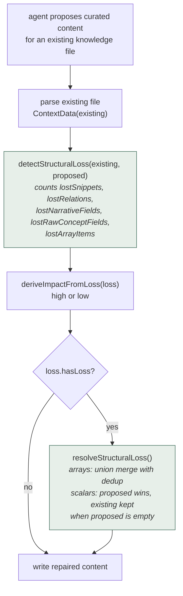
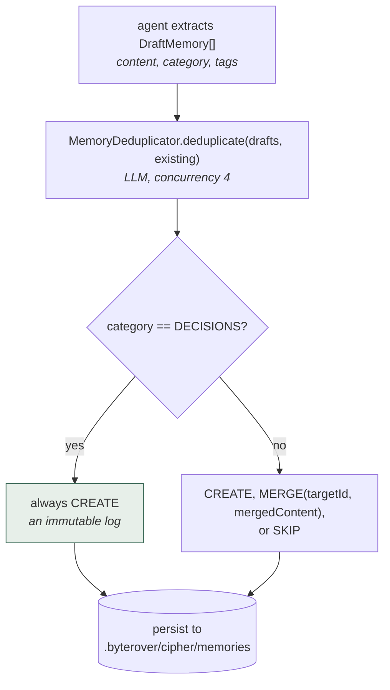
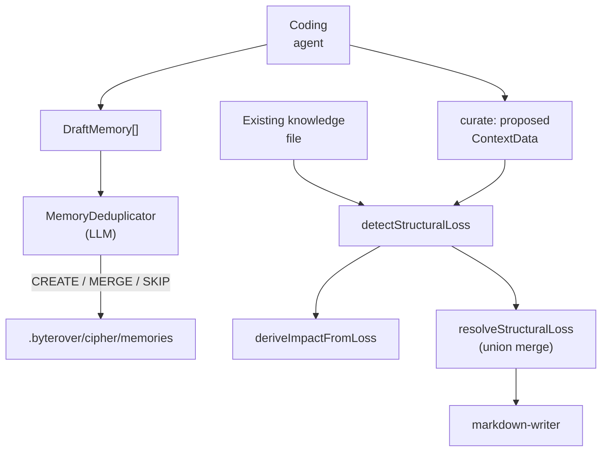

## 1. Executive Summary

ByteRover is a memory layer for autonomous coding agents, distributed as `byterover-cli` (`brv`) and mounted by [Hermes Agent](../hermes-agent/) as one of its official memory providers. The repository was previously known as Cipher; the package now identifies as `byterover-cli`.

**Licensing note, because it affects whether you can borrow from it: this repository is under the Elastic License 2.0, not an OSI-approved open-source licence.** ELv2 forbids providing the software to third parties as a hosted or managed service and forbids circumventing licence-key functionality. Widely circulated descriptions of ByteRover's engine as "open source" are inaccurate at this commit. Read the code for ideas by all means; check with counsel before vendoring it.

The local memory primitive is deliberately thin — a `Memory` is content plus id, timestamps, tags, and metadata carrying a `source` of `agent | system | user` and a `pinned` flag. There is no trust state, no scope hierarchy, and no supersession chain. On its own that would make this a minor entry.

What earns it a report is the **knowledge curation layer**, and specifically one idea the atlas has been missing:

```text
detectStructuralLoss(existing, proposed) -> StructuralLoss
resolveStructuralLoss(existing, proposed, loss) -> repaired content
```

Before an LLM "curate" pass is allowed to overwrite a knowledge file, ByteRover diffs the parsed existing content against the proposed replacement and counts precisely what would be **lost** — snippets, relations, narrative fields, raw-concept scalars, and array items. Additions are ignored, so enrichment passes cleanly; deletions are flagged as high structural impact and then automatically repaired by merging the lost material back in.

This is a cheap, deterministic answer to a failure the atlas repeatedly warns about and no other system here defends against directly: background summarization quietly discarding the evidence it was meant to compress.

The guard is not an isolated nicety, and the first version of this report missed
where it leads. Its verdict feeds `needsReview`, which puts the operation into a
queue a person clears with `brv review approve` or `brv review reject` — and
because impact is `maxImpact(agentImpact, structuralImpact)`, an agent can
escalate its own edit into that queue but cannot argue its way out of it. That
is the whole shape of a human-in-the-loop memory in about twenty lines: a
deterministic detector decides what a person must look at, and a rejection
restores the file from a backup taken before the write.

The knowledge layer also carries a real retriever — MiniSearch BM25 over a
cached index, with a relevance floor that lets the system answer "I don't have
that" — described in section 6 along with the corpus-size condition that turns
that floor off.

A second, smaller idea is worth noting: the deduplicator treats the `DECISIONS` category as an immutable append-only log that is never merged or skipped, while every other category is subject to LLM `CREATE` / `MERGE` / `SKIP` judgement. Making immutability a property of the memory *kind* is a lighter-weight alternative to a full trust-state machine.

## 2. Mental Model

Two layers with quite different sophistication.

**Memory** (`src/agent/core/domain/memory/types.ts`) — flat and simple:

```typescript
interface Memory {
  id: string
  content: string
  createdAt: number
  updatedAt: number
  tags?: string[]
  metadata?: {
    source?: 'agent' | 'system' | 'user'
    pinned?: boolean
    [key: string]: unknown
  }
}

interface MemoryConfig {
  storageDir?: string      // default: .byterover/cipher/memories
  maxMemories?: number
  defaultTags?: string[]
}
```

**Knowledge** (`src/agent/core/domain/knowledge/`, `src/server/core/domain/knowledge/`) — structured Markdown documents parsed into `ContextData`:

```typescript
ContextData {
  snippets: string[]
  relations: string[]
  narrative: { dependencies, examples, highlights, rules, structure }
  rawConcept: { author, flow, task, timestamp, changes[], files[], patterns }
}
```

Curation lifecycle — the part worth studying:



This is the atlas's only instance of a system **measuring what a model's rewrite
would destroy before accepting it**, and then repairing rather than refusing. Most
systems here take a proposed rewrite on trust; this one counts the losses by
category and merges the pieces back.

Memory write lifecycle:



One category is exempt from dedup by rule. `DECISIONS` always creates, so the
record of *what was decided* is append-only even though everything else can be
merged away — a per-kind lifecycle rather than one policy for the whole store.

## 3. Architecture

The repository is a TypeScript CLI and server, roughly 1,168 `.ts` files under `src/`, organized as `agent/`, `server/`, `oclif/`, `tui/`, `webui/`, and `shared/`.

Memory-relevant modules are small and easy to trace:

- `src/agent/core/domain/memory/types.ts` (111 lines) — the `Memory` model.
- `src/agent/infra/memory/memory-manager.ts` (640 lines) — persistence and lifecycle.
- `src/agent/infra/memory/memory-deduplicator.ts` (132 lines) — LLM dedup with CREATE/MERGE/SKIP.
- `src/agent/core/domain/knowledge/conflict-detector.ts` (107 lines) — `detectStructuralLoss`, `deriveImpactFromLoss`.
- `src/agent/core/domain/knowledge/conflict-resolver.ts` (133 lines) — `resolveStructuralLoss` and the merge helpers.
- `src/server/core/domain/knowledge/markdown-writer.ts` — the `ContextData` / `Narrative` / `RawConcept` shapes.



## 4. Essential Implementation Paths

### Structural-loss detection (`conflict-detector.ts`)

`countLostItems` compares normalized string arrays and returns how many existing entries are absent from the proposal. `countLostNarrativeFields` checks the five narrative fields (`dependencies`, `examples`, `highlights`, `rules`, `structure`) for ones that exist now and would not afterwards. `countLostRawConceptFields` does the same for scalars (`author`, `flow`, `task`, `timestamp`) and for the `changes` and `files` arrays.

The design comment states the key asymmetry plainly: it "only flags when existing content would be LOST, not when new content is added. This prevents false positives when the LLM is enriching content."

That asymmetry is what makes the guard usable in practice. A symmetric diff would fire on every legitimate rewrite; this one fires only on deletion, which is the direction that loses information.

`deriveImpactFromLoss` collapses the counts to `high` when anything at all would be lost and `low` otherwise — a blunt but honest signal, given that losing one relation and losing forty are both "the rewrite is destructive."

### Structural-loss resolution (`conflict-resolver.ts`)

`resolveStructuralLoss` is a no-op when nothing would be lost. Otherwise it rebuilds the proposal:

- **Arrays** (`snippets`, `relations`, `changes`, `files`) — union merge with deduplication, so nothing disappears.
- **Scalars** (narrative fields, raw-concept scalars, `patterns`) — proposed wins, with the existing value preserved when the proposal leaves the field empty.

The strategy is deliberately conservative in one direction only: the LLM may *rephrase* a scalar, but it cannot *empty* one, and it cannot drop a list item. This is repair rather than rejection — the curate operation still succeeds, it just cannot destroy.

Compare how the atlas's other systems handle the same risk. [Mastra](../mastra-observational-memory/) persists the exact source range a summary covers so the summary can be replaced rather than trusted. [MemPalace](../mempalace/) refuses the problem entirely by keeping verbatim drawers authoritative. ByteRover's answer is the cheapest of the three and the only one that operates as a guard on the rewrite itself.

### Deduplication (`memory-deduplicator.ts`)

Each draft is compared against existing memories by an LLM that must answer with one of `CREATE`, `MERGE` (with `targetId` and `mergedContent`), or `SKIP`, at concurrency 4. When there are no existing memories the LLM is skipped entirely and everything is a `CREATE`.

The `DECISIONS` category bypasses the LLM and always returns `CREATE`. The code calls this an "immutable log", and it is a meaningful epistemic statement: decisions are events that happened, so merging or skipping them would corrupt a historical record, whereas facts and observations can reasonably be consolidated.

This is a lighter-weight cousin of [evidence before belief](../../patterns/evidence-before-belief/) — rather than separating evidence rows from claims, it marks one category as evidence-shaped and exempts it from consolidation.

## 5. Memory Data Model

Storage is the local filesystem under `.byterover/cipher/memories`, with an optional `maxMemories` cap and optional cloud sync.

The model's limits are straightforward:

- **`source` is descriptive, not authoritative.** `agent | system | user` records who wrote a memory but gates nothing — an agent-sourced memory is as active as a user-sourced one. Contrast [RainBox](../rainbox/)'s five-actor model, where the actor determines whether a write lands active or candidate.
- **`pinned` is the only lifecycle flag.** No status, no expiry, no supersession chain, no rejected values.
- **Scope is a storage directory.** There is no user, project, or session key on the record itself; workspace separation comes from where the files live.
- **`maxMemories` is an unqualified cap** with no documented eviction policy in the inspected modules — which memory is dropped when the cap is hit is not visible here.

## 6. Retrieval Mechanics

There are two retrieval surfaces, and the first reading of this report saw only
the smaller one.

**The flat memory list is metadata filtering.** `ListMemoriesOptions` supports
`limit`, `offset`, and filtering by `tags` (OR logic), `source`, and `pinned`.
No ranking, no scoring.

**The knowledge tree has a full lexical retriever**, in
`src/agent/infra/tools/implementations/search-knowledge-service.ts` — 1,847
lines that the earlier reading did not open. It is MiniSearch BM25 over a
cached index of the context tree, and the parts worth naming are the ones that
decide what the agent does *not* see:

- documents are chunked at `CHUNK_SIZE_CHARS = 800` with `CHUNK_OVERLAP_CHARS = 120`, and the index carries an `INDEX_SCHEMA_VERSION` and a 5-second TTL, rebuilt when file mtimes move;
- raw BM25 scores are normalised monotonically as `score / (1 + score)` into `[0, 1)`;
- a **score-gap cut**: `scoreFloor = topScore * SCORE_GAP_RATIO` with `SCORE_GAP_RATIO = 0.7`, and the result loop `break`s at the first result below it, so a weak long tail is dropped rather than padded to `limit`;
- an **out-of-domain refusal**: if the best result scores below `MINIMUM_RELEVANCE_SCORE = 0.45`, the service returns zero results and the message *"No matching knowledge found for this query"* rather than the least-bad match;
- a second, term-based refusal when an AND search failed, significant query terms are absent from the corpus, and the top score is below `UNMATCHED_TERM_SCORE_THRESHOLD = 0.85`;
- **parent-score propagation**: `propagateScoresToParents` lifts the strongest child BM25 signal to domain and topic nodes at a decay per level, so a directory can surface on the strength of one file inside it;
- a maturity filter, `minMaturity` against `MATURITY_TIER_RANK = {core: 3, validated: 2, draft: 1}`, applied to both BM25 hits and propagated summaries;
- an `elementHint` structural pre-filter that restricts candidates by HTML tag and `attribute=value` before BM25 sees them — the mechanism the negative evals assert on.

**Both out-of-domain refusals are gated on `documentMap.size >= 50`.** The
comment states the intent — *"Only apply for corpora with enough documents for
reliable BM25 scoring"* — and the effect is that a knowledge base of fewer than
fifty documents has no relevance floor at all: every query returns its best
match, however irrelevant, and the "no matching knowledge" answer is
unreachable. The guard is off for exactly the corpus size a new project has.

**Scope is a path prefix, and it yields.** `SearchOptions.scope` restricts the
search to a subtree of the context tree, and a query string can carry its own
scope prefix. But when a scoped search returns nothing, the service calls
`runTextSearch` again with the scope argument replaced by `undefined` — the
comment says so: *"If scoped search returned nothing and we had a scope, fall
back to global search"*. A caller who asks for `auth` and gets nothing there is
answered from the whole tree without being told. That is a relevance
convenience, not a boundary, and it is the reason `scope_enforced` is withheld
below — along with the more basic one, that this key is a topic path rather than
a user, project or tenant.

## 7. Write Mechanics

Two paths, with quite different care applied:

1. **Memory drafts** → LLM dedup → persist. Every non-`DECISIONS` draft is subject to an LLM's judgement about whether it is new, and a `MERGE` rewrites an existing memory's content with LLM-produced text. That merge has no structural-loss guard of its own — the protection described above applies to knowledge-file curation, not to memory merging.
2. **Knowledge curation** → structural-loss detection → automatic repair → write.

The asymmetry is worth flagging: the more carefully guarded path is the document layer, while the memory layer — where an LLM rewrites stored content during `MERGE` — is the less protected one.

## 8. Agent Integration

ByteRover is delivered as the `brv` CLI with an MCP surface, and is documented as compatible with a long list of coding agents. It is one of the nine official [Hermes Agent](../hermes-agent/) memory providers, with the adapter living in that repository at `plugins/memory/byterover/`.

Because it is mounted through a host's provider interface, it inherits the boundary problem described in the [pluggable memory provider](../../patterns/pluggable-memory-provider/) pattern: the host has no interface-level way to propagate a deletion into ByteRover's store.

## 9. Reliability, Safety, and Trust

Strengths:

- Deterministic, non-LLM detection of destructive rewrites, with automatic repair.
- Loss detection is asymmetric by design, avoiding false positives on enrichment.
- An immutable category for decisions.
- Human-readable local Markdown storage with an explicit storage directory.
- Bounded dedup concurrency and a short-circuit when no comparison is needed.
- A human adjudication loop over curation: every DELETE and every high-impact edit is queued, and rejecting one restores the file from a backup taken before the write.
- A named log of memory *mutations* — operation type, path, reason and previous summary per curation task — kept separately from the query log.

Gaps:

- **No trust state.** `source` is metadata only; agent-written memories are immediately authoritative.
- **No tombstones or supersession**, so a removed memory can be re-extracted.
- **LLM `MERGE` rewrites memory content unguarded**, which is precisely the operation the knowledge layer protects against elsewhere.
- **The relevance floor is off below fifty documents**, so a small knowledge base cannot answer "I don't have that" (section 6).
- **`deriveImpactFromLoss` is binary** — correctly, since what it feeds is a queue-or-not decision, but it means the review queue cannot be ordered by how much was lost.
- **`maxMemories` eviction policy is not visible** in the inspected code.
- **The curate log is a ring of the newest 1,000 tasks**, pruned best-effort with the failure swallowed.
- **ELv2 licensing** materially constrains reuse and redistribution.

**The marks, and the three that were withheld.**

`human_review` is earned, and the mechanism is the nicest thing in the system.
`deriveReviewMetadata` marks an operation `needsReview` when it is a `DELETE` or
when its impact is high, and impact is not the agent's word alone:
`elevatedImpact = maxImpact(impact, structuralImpact)` at
`curate-tool.ts:1024-1026`, where `structuralImpact` comes from the deterministic
detector. The agent may raise its own impact; it cannot lower it below what the
detector found. A person then runs `brv review pending` and
`brv review approve` or `brv review reject`, and a rejection reads the backup
written before the edit and restores the file — or removes it, when the backup is
null because the operation was an ADD. Two limits belong next to the mark:
`brv review --disable` turns the queue off for a project, and the HTML curation
path computes `needsReview` from `meta.impact` with no structural fallback at
all, so an agent that asserts nothing there queues nothing. The comment at
`curate-html-log.ts:174-180` states that asymmetry deliberately —
*"semantic judgments stay with the agent"* — which is a defensible position and
the opposite of the one the markdown path takes.

`audit_log` is earned by the curate log rather than the query log. The
distinction matters: `brv query-log` records retrieval, which the atlas counts
as the other half of the pattern and not as an audit trail; the curate log
records mutations, one entry per task, each operation carrying its type, path,
reason, previous summary and outcome, saved through a temp file and `rename`.
It is a ring of the newest thousand entries and the review decision edits an
entry in place, so it is append-only in content but not in extent.

`negative_eval` is earned by the `elementHint` cases in
`search-knowledge-service-html-routing.test.ts`, which assert a document that is
in the corpus must not come back, with the positive control in the same block —
`severity=must` returns `a.html`, `severity=should` returns nothing, same store.
The mark is the weakest of the three, for a reason worth recording: the option
those cases exercise is exposed on the `ToolsSDK.searchKnowledge` surface and
has no caller in this repository, which the service's own comment says outright
(*"Wired but unused by today's callers"*). The default read path — BM25, the
relevance floor, the scope prefix — carries no must-not assertion at all. The
suite asserts about the seam most likely to be reached from outside, and is
silent about the one every agent actually uses.

**`scope_enforced` is withheld twice over.** `SearchOptions.scope` is a topic
path, not a user, project or tenant key — and it is abandoned rather than
enforced: an empty scoped result re-runs the search with the scope set to
`undefined`. A key that disappears when it would have excluded everything is a
ranking hint.

**`trust_state` is withheld**, and the near-miss is `maturity`. It looks exactly
like a trust vocabulary — `draft`, `validated`, `core` — it is stored, and
`minMaturity` filters it on the read path, which is three of the four things the
mark needs. What it is not is a judgement: `determineTier(importance,
currentTier)` is a thresholded float with hysteresis, promoting on
`importance >= PROMOTE_TO_CORE` and demoting below `DEMOTE_FROM_VALIDATED`. The
word "validated" names a score band, and nobody validated anything. The
`reviewStatus` field — `pending`, `approved`, `rejected` — *is* a judgement, but
it lives on the log entry rather than on the memory, and no read path consults
it.

**`tombstone` is withheld.** A rejection restores the previous content and then
deletes the backup; nothing records the rejected value, so the next curation run
may propose the same edit and a reviewer who has stopped reading will take it.

## 10. Tests, Evals, and Benchmarks

**The previous version of this report said there were none, and that was
wrong.** At this same commit the repository carries 526 `*.test.ts` files and
8,583 `it()` cases, including
`test/unit/agent/knowledge/conflict-detector.test.ts`,
`conflict-resolver.test.ts`, `test/unit/agent/memory/memory-deduplicator.test.ts`
and an 852-line `memory-manager.test.ts` beside a 1,037-line integration
sibling. The suites were not run here; the files were read.

The correction is worth stating precisely, because the earlier text named the
very edge cases it claimed were unverified. `conflict-detector.test.ts` asserts
that an empty proposal loses every snippet
(`expect(loss.lostSnippets).to.equal(3)`), that comparison is case-insensitive
(`Snippet-A` against `snippet-a` is no loss), that adding items is never loss,
that a missing `narrative` on the existing side is not loss, and that array
items inside `rawConcept` are counted. `deriveImpactFromLoss` has seven cases of
its own, and together they pin the binary behaviour this report described as a
weakness: every loss type returns `high`, no loss returns `low`. That is the
right shape for what it actually feeds — a queue-or-not decision, not a severity
display.

What remains true: there is **no committed retrieval or memory-quality
benchmark**, and no case asserts that the `MINIMUM_RELEVANCE_SCORE` floor keeps
an irrelevant document out — the one property that most needs a test, given that
the floor is disabled below fifty documents. `query-executor.test.ts:276` does
cover the out-of-domain tier, but with a stubbed search service returning an
empty list, so it asserts the executor's handling and not the floor.

## 11. For Your Own Build

### Steal

- **Structural-loss guard on LLM rewrites.** Parse before and after, count only what would be deleted, treat deletion as high impact, and merge the loss back automatically. This is the single most transferable idea in the repository and belongs in any system that lets a model rewrite stored knowledge.
- **Asymmetric diffing** — flag removals, ignore additions — as the way to make such a guard usable.
- **Union-merge repair** rather than outright rejection, so curation still succeeds.
- **An immutable memory category** for decisions and other event-shaped records.
- **Short-circuiting the LLM** when there is nothing to compare against.

### Avoid

- **Actor recorded but not enforced.**
- **LLM merge without a loss guard**, in the same codebase that implements one for documents.
- **Binary impact severity.**
- **No durable correction semantics** — no tombstones, no supersession.
- **Unspecified eviction** behind a raw `maxMemories` cap.
- **"Open source" positioning** that does not match the ELv2 licence in the repository.

### Fit

Borrow (as ideas — check the licence before borrowing code):

- `detectStructuralLoss` / `resolveStructuralLoss` conceptually, applied to *every* LLM rewrite path including memory merges.
- The immutable-category rule for decision logs.
- The CREATE/MERGE/SKIP dedup vocabulary, which is clearer than a similarity threshold.

Do not copy:

- The `Memory` model as a durable belief store; it lacks status, scope, provenance, and correction.
- LLM-driven merge without the structural guard.
- Any of the code itself into a hosted service, which ELv2 prohibits.

## 12. Open Questions

- Why is the structural-loss guard applied to knowledge curation but not to `MemoryDeduplicator`'s `MERGE` path?
- What is evicted when `maxMemories` is reached?
- Why is the relevance floor gated on a corpus of fifty documents, rather than scaled with corpus size? The effect is that the system's ability to say "I don't have that" switches on only after the knowledge base has grown.
- Why does an empty scoped search fall back to the whole tree instead of returning nothing for that scope?
- The `elementHint` grammar carries an `attribute=value` axis that the service calls "wired but unused by today's callers". What is it for?

## Appendix: File Index

- Memory model: `src/agent/core/domain/memory/types.ts`.
- Memory persistence: `src/agent/infra/memory/memory-manager.ts`, `index.ts`.
- LLM deduplication: `src/agent/infra/memory/memory-deduplicator.ts`.
- Structural-loss detection: `src/agent/core/domain/knowledge/conflict-detector.ts`.
- Structural-loss resolution: `src/agent/core/domain/knowledge/conflict-resolver.ts`, `utils.ts`.
- Document shapes: `src/server/core/domain/knowledge/markdown-writer.ts`.
- Licence: `LICENSE` (Elastic License 2.0).

## History

**2026-09-18** — [`1052ac1a5dd0fde4da8693d4712064f7876c269c`](https://github.com/campfirein/byterover-cli/commit/1052ac1a5dd0fde4da8693d4712064f7876c269c) — re-read at the same commit as the first reading. Nothing upstream had moved, so every correction here is the atlas's own, and two of them were serious. The first reading reported that no tests existed for the memory or knowledge modules and called that "the most significant evidence gap in this report"; at this same commit the repository carries 526 test files and 8,583 cases, including a `conflict-detector.test.ts` that asserts precisely the three edge cases the report named as unverified. The second reading error was larger: section 6 described retrieval as metadata filtering with no ranking, while `search-knowledge-service.ts` — 1,847 lines the first reading never opened — is a MiniSearch BM25 retriever with chunking, a relevance floor, a score-gap cut, parent-score propagation and a structural pre-filter. `stack_retrieval` goes from empty to `lexical` and `stack_source` from seeded to reviewed.

Three marks follow from the corrected reading. `human_review` on the curate review queue, whose trigger the agent cannot lower — `maxImpact(agentImpact, deriveImpactFromLoss(loss))` — and whose rejection restores the file from a pre-write backup. `audit_log` on the curate log, which records mutations and is distinct from the query log, which records reads and does not count. `negative_eval` on the `elementHint` cases, with the positive control in the same block. `scope_enforced`, `trust_state` and `tombstone` were each examined and withheld, with the reasons in section 9: the search scope is a topic path that is dropped when it matches nothing, `maturity` is a thresholded importance float rather than a judgement, and a rejected edit leaves no record of the value it rejected.

Two new findings sit beside the marks. Both out-of-domain refusals are gated on `documentMap.size >= 50`, so a knowledge base below fifty documents has no relevance floor and cannot answer "I don't have that". And an empty scoped search silently re-runs against the whole tree.

**2026-09-13** — the repository was renamed from `campfirein/cipher` to `campfirein/byterover-cli`, upstream of the pinned commit and after the reading below. No re-reading: the pin, `analyzed_at` and every finding are unchanged, and only `source_name`, `source_url`, `revision_url`, `archive_name` and the repositories-inspected entry moved. The slug is unchanged, so no published URL moved. The archive fork was renamed to `agent-memory-atlas-archive/campfirein--byterover-cli` to match.

**2026-08-09** — the repository has been renamed `campfirein/byterover-cli`; `campfirein/byterover-cli` redirects to it and the pin below resolves unchanged. Recorded because an outside corpus listed the new name as an uncovered system, and a join on `source_url` cannot see a rename.

**2026-07-27** — [`1052ac1a5dd0fde4da8693d4712064f7876c269c`](https://github.com/campfirein/byterover-cli/commit/1052ac1a5dd0fde4da8693d4712064f7876c269c) — first reading.
