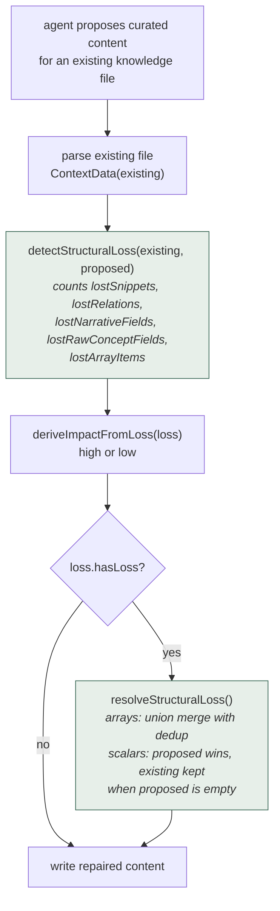
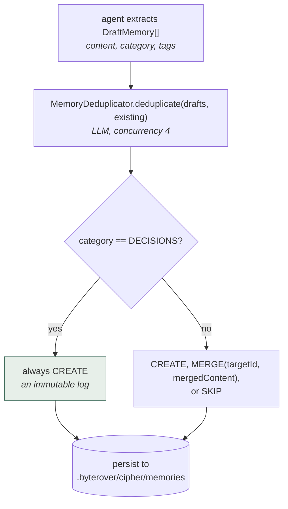
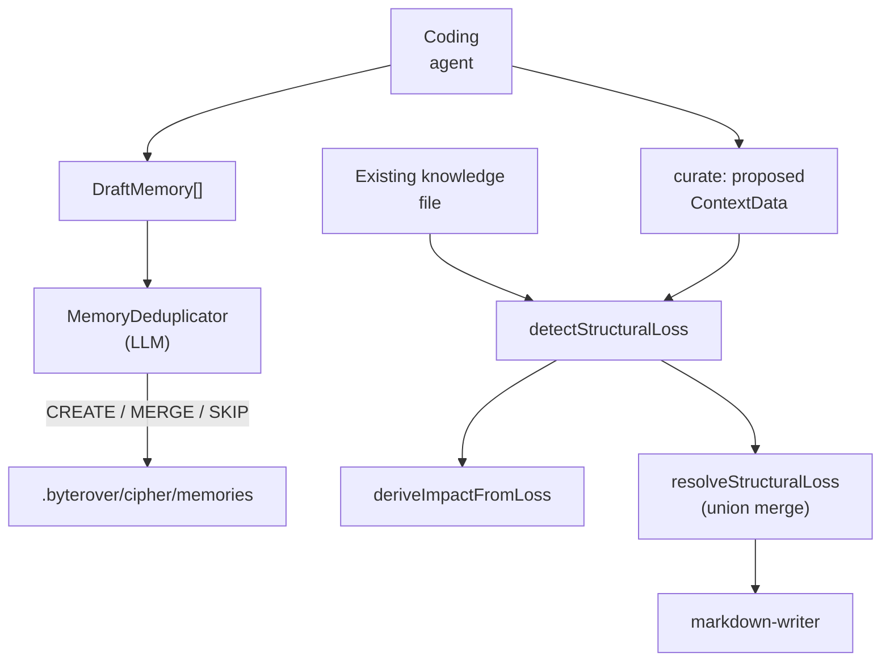

## 1. Executive Summary

ByteRover is a memory layer for autonomous coding agents, distributed as `byterover-cli` (`brv`) and mounted by [Hermes Agent](../hermes-agent/) as one of its official memory providers. The repository was previously known as Cipher; the package now identifies as `byterover-cli`.

**Licensing note, because it affects whether you can borrow from it: this repository is under the Elastic License 2.0, not an OSI-approved open-source licence.** ELv2 forbids providing the software to third parties as a hosted or managed service and forbids circumventing licence-key functionality. Widely circulated descriptions of ByteRover's engine as "open source" are inaccurate at this commit. Read the code for ideas by all means; check with counsel before vendoring it.

The local memory primitive is deliberately thin — a `Memory` is content plus id, timestamps, tags, and metadata carrying a `source` of `agent | system | user` and a `pinned` flag. There is no trust state, no scope hierarchy, and no supersession chain. On its own that would make this a minor entry.

What earns it a report is the **knowledge curation layer**, and specifically one idea the atlas has been missing:

```text
detectStructuralLoss(existing, proposed) -> StructuralLoss
resolveStructuralLoss(existing, proposed, loss) -> repaired content
```

Before an LLM "curate" pass is allowed to overwrite a knowledge file, ByteRover diffs the parsed existing content against the proposed replacement and counts precisely what would be **lost** — snippets, relations, narrative fields, raw-concept scalars, and array items. Additions are ignored, so enrichment passes cleanly; deletions are flagged as high structural impact and then automatically repaired by merging the lost material back in.

This is a cheap, deterministic answer to a failure the atlas repeatedly warns about and no other system here defends against directly: background summarization quietly discarding the evidence it was meant to compress.

A second, smaller idea is worth noting: the deduplicator treats the `DECISIONS` category as an immutable append-only log that is never merged or skipped, while every other category is subject to LLM `CREATE` / `MERGE` / `SKIP` judgement. Making immutability a property of the memory *kind* is a lighter-weight alternative to a full trust-state machine.

## 2. Mental Model

Two layers with quite different sophistication.

**Memory** (`src/agent/core/domain/memory/types.ts`) — flat and simple:

```typescript
interface Memory {
  id: string
  content: string
  createdAt: number
  updatedAt: number
  tags?: string[]
  metadata?: {
    source?: 'agent' | 'system' | 'user'
    pinned?: boolean
    [key: string]: unknown
  }
}

interface MemoryConfig {
  storageDir?: string      // default: .byterover/cipher/memories
  maxMemories?: number
  defaultTags?: string[]
}
```

**Knowledge** (`src/agent/core/domain/knowledge/`, `src/server/core/domain/knowledge/`) — structured Markdown documents parsed into `ContextData`:

```typescript
ContextData {
  snippets: string[]
  relations: string[]
  narrative: { dependencies, examples, highlights, rules, structure }
  rawConcept: { author, flow, task, timestamp, changes[], files[], patterns }
}
```

Curation lifecycle — the part worth studying:



This is the atlas's only instance of a system **measuring what a model's rewrite
would destroy before accepting it**, and then repairing rather than refusing. Most
systems here take a proposed rewrite on trust; this one counts the losses by
category and merges the pieces back.

Memory write lifecycle:



One category is exempt from dedup by rule. `DECISIONS` always creates, so the
record of *what was decided* is append-only even though everything else can be
merged away — a per-kind lifecycle rather than one policy for the whole store.

## 3. Architecture

The repository is a TypeScript CLI and server, roughly 1,168 `.ts` files under `src/`, organized as `agent/`, `server/`, `oclif/`, `tui/`, `webui/`, and `shared/`.

Memory-relevant modules are small and easy to trace:

- `src/agent/core/domain/memory/types.ts` (111 lines) — the `Memory` model.
- `src/agent/infra/memory/memory-manager.ts` (640 lines) — persistence and lifecycle.
- `src/agent/infra/memory/memory-deduplicator.ts` (132 lines) — LLM dedup with CREATE/MERGE/SKIP.
- `src/agent/core/domain/knowledge/conflict-detector.ts` (107 lines) — `detectStructuralLoss`, `deriveImpactFromLoss`.
- `src/agent/core/domain/knowledge/conflict-resolver.ts` (133 lines) — `resolveStructuralLoss` and the merge helpers.
- `src/server/core/domain/knowledge/markdown-writer.ts` — the `ContextData` / `Narrative` / `RawConcept` shapes.



## 4. Essential Implementation Paths

### Structural-loss detection (`conflict-detector.ts`)

`countLostItems` compares normalized string arrays and returns how many existing entries are absent from the proposal. `countLostNarrativeFields` checks the five narrative fields (`dependencies`, `examples`, `highlights`, `rules`, `structure`) for ones that exist now and would not afterwards. `countLostRawConceptFields` does the same for scalars (`author`, `flow`, `task`, `timestamp`) and for the `changes` and `files` arrays.

The design comment states the key asymmetry plainly: it "only flags when existing content would be LOST, not when new content is added. This prevents false positives when the LLM is enriching content."

That asymmetry is what makes the guard usable in practice. A symmetric diff would fire on every legitimate rewrite; this one fires only on deletion, which is the direction that loses information.

`deriveImpactFromLoss` collapses the counts to `high` when anything at all would be lost and `low` otherwise — a blunt but honest signal, given that losing one relation and losing forty are both "the rewrite is destructive."

### Structural-loss resolution (`conflict-resolver.ts`)

`resolveStructuralLoss` is a no-op when nothing would be lost. Otherwise it rebuilds the proposal:

- **Arrays** (`snippets`, `relations`, `changes`, `files`) — union merge with deduplication, so nothing disappears.
- **Scalars** (narrative fields, raw-concept scalars, `patterns`) — proposed wins, with the existing value preserved when the proposal leaves the field empty.

The strategy is deliberately conservative in one direction only: the LLM may *rephrase* a scalar, but it cannot *empty* one, and it cannot drop a list item. This is repair rather than rejection — the curate operation still succeeds, it just cannot destroy.

Compare how the atlas's other systems handle the same risk. [Mastra](../mastra-observational-memory/) persists the exact source range a summary covers so the summary can be replaced rather than trusted. [MemPalace](../mempalace/) refuses the problem entirely by keeping verbatim drawers authoritative. ByteRover's answer is the cheapest of the three and the only one that operates as a guard on the rewrite itself.

### Deduplication (`memory-deduplicator.ts`)

Each draft is compared against existing memories by an LLM that must answer with one of `CREATE`, `MERGE` (with `targetId` and `mergedContent`), or `SKIP`, at concurrency 4. When there are no existing memories the LLM is skipped entirely and everything is a `CREATE`.

The `DECISIONS` category bypasses the LLM and always returns `CREATE`. The code calls this an "immutable log", and it is a meaningful epistemic statement: decisions are events that happened, so merging or skipping them would corrupt a historical record, whereas facts and observations can reasonably be consolidated.

This is a lighter-weight cousin of [evidence before belief](../../patterns/evidence-before-belief/) — rather than separating evidence rows from claims, it marks one category as evidence-shaped and exempts it from consolidation.

## 5. Memory Data Model

Storage is the local filesystem under `.byterover/cipher/memories`, with an optional `maxMemories` cap and optional cloud sync.

The model's limits are straightforward:

- **`source` is descriptive, not authoritative.** `agent | system | user` records who wrote a memory but gates nothing — an agent-sourced memory is as active as a user-sourced one. Contrast [RainBox](../rainbox/)'s five-actor model, where the actor determines whether a write lands active or candidate.
- **`pinned` is the only lifecycle flag.** No status, no expiry, no supersession chain, no rejected values.
- **Scope is a storage directory.** There is no user, project, or session key on the record itself; workspace separation comes from where the files live.
- **`maxMemories` is an unqualified cap** with no documented eviction policy in the inspected modules — which memory is dropped when the cap is hit is not visible here.

## 6. Retrieval Mechanics

`ListMemoriesOptions` supports `limit`, `offset`, and filtering by `tags` (OR logic), `source`, and `pinned`. This is metadata filtering and pagination, not ranked retrieval: no vector search, lexical index, or scoring appears in the memory modules inspected.

ByteRover's marketing describes a hierarchical knowledge tree with tiered retrieval and fast pre-LLM lookup. The knowledge layer's `ContextData` structure and the `markdown-writer` are consistent with that, but the ranking machinery is not present in the memory domain modules reviewed here, and no claimed retrieval benchmark was found in the repository.

## 7. Write Mechanics

Two paths, with quite different care applied:

1. **Memory drafts** → LLM dedup → persist. Every non-`DECISIONS` draft is subject to an LLM's judgement about whether it is new, and a `MERGE` rewrites an existing memory's content with LLM-produced text. That merge has no structural-loss guard of its own — the protection described above applies to knowledge-file curation, not to memory merging.
2. **Knowledge curation** → structural-loss detection → automatic repair → write.

The asymmetry is worth flagging: the more carefully guarded path is the document layer, while the memory layer — where an LLM rewrites stored content during `MERGE` — is the less protected one.

## 8. Agent Integration

ByteRover is delivered as the `brv` CLI with an MCP surface, and is documented as compatible with a long list of coding agents. It is one of the nine official [Hermes Agent](../hermes-agent/) memory providers, with the adapter living in that repository at `plugins/memory/byterover/`.

Because it is mounted through a host's provider interface, it inherits the boundary problem described in the [pluggable memory provider](../../patterns/pluggable-memory-provider/) pattern: the host has no interface-level way to propagate a deletion into ByteRover's store.

## 9. Reliability, Safety, and Trust

Strengths:

- Deterministic, non-LLM detection of destructive rewrites, with automatic repair.
- Loss detection is asymmetric by design, avoiding false positives on enrichment.
- An immutable category for decisions.
- Human-readable local Markdown storage with an explicit storage directory.
- Bounded dedup concurrency and a short-circuit when no comparison is needed.

Gaps:

- **No trust state.** `source` is metadata only; agent-written memories are immediately authoritative.
- **No tombstones or supersession**, so a removed memory can be re-extracted.
- **LLM `MERGE` rewrites memory content unguarded**, which is precisely the operation the knowledge layer protects against elsewhere.
- **No ranked retrieval** in the inspected memory modules.
- **`deriveImpactFromLoss` is binary**, so severity is not proportional to what was lost.
- **`maxMemories` eviction policy is not visible** in the inspected code.
- **ELv2 licensing** materially constrains reuse and redistribution.

## 10. Tests, Evals, and Benchmarks

No test files specific to the memory or knowledge domain modules were located in this checkout, and no committed retrieval or memory-quality benchmark was found. The suites were not run.

For a system whose most valuable idea is a correctness guard — structural-loss detection — the absence of visible tests around `detectStructuralLoss` and `resolveStructuralLoss` is the most significant evidence gap in this report. The functions are pure and deterministic, so they are unusually easy to test; that they appear untested here means the guard's behaviour on edge cases (empty proposals, reordered arrays, case-variant duplicates) is unverified.

## 11. For Your Own Build

### Steal

- **Structural-loss guard on LLM rewrites.** Parse before and after, count only what would be deleted, treat deletion as high impact, and merge the loss back automatically. This is the single most transferable idea in the repository and belongs in any system that lets a model rewrite stored knowledge.
- **Asymmetric diffing** — flag removals, ignore additions — as the way to make such a guard usable.
- **Union-merge repair** rather than outright rejection, so curation still succeeds.
- **An immutable memory category** for decisions and other event-shaped records.
- **Short-circuiting the LLM** when there is nothing to compare against.

### Avoid

- **Actor recorded but not enforced.**
- **LLM merge without a loss guard**, in the same codebase that implements one for documents.
- **Binary impact severity.**
- **No durable correction semantics** — no tombstones, no supersession.
- **Unspecified eviction** behind a raw `maxMemories` cap.
- **"Open source" positioning** that does not match the ELv2 licence in the repository.

### Fit

Borrow (as ideas — check the licence before borrowing code):

- `detectStructuralLoss` / `resolveStructuralLoss` conceptually, applied to *every* LLM rewrite path including memory merges.
- The immutable-category rule for decision logs.
- The CREATE/MERGE/SKIP dedup vocabulary, which is clearer than a similarity threshold.

Do not copy:

- The `Memory` model as a durable belief store; it lacks status, scope, provenance, and correction.
- LLM-driven merge without the structural guard.
- Any of the code itself into a hosted service, which ELv2 prohibits.

## 12. Open Questions

- Why is the structural-loss guard applied to knowledge curation but not to `MemoryDeduplicator`'s `MERGE` path?
- What is evicted when `maxMemories` is reached?
- Is `detectStructuralLoss` tested anywhere? Its edge-case behaviour is unverified in this checkout.
- Should impact be proportional to the volume of loss rather than binary?
- How does the hierarchical retrieval described in ByteRover's documentation relate to the metadata-filter-only listing in these modules — is ranking implemented server-side or in the closed cloud component?

## Appendix: File Index

- Memory model: `src/agent/core/domain/memory/types.ts`.
- Memory persistence: `src/agent/infra/memory/memory-manager.ts`, `index.ts`.
- LLM deduplication: `src/agent/infra/memory/memory-deduplicator.ts`.
- Structural-loss detection: `src/agent/core/domain/knowledge/conflict-detector.ts`.
- Structural-loss resolution: `src/agent/core/domain/knowledge/conflict-resolver.ts`, `utils.ts`.
- Document shapes: `src/server/core/domain/knowledge/markdown-writer.ts`.
- Licence: `LICENSE` (Elastic License 2.0).

## History

**2026-07-27** — [`1052ac1a5dd0fde4da8693d4712064f7876c269c`](https://github.com/campfirein/cipher/commit/1052ac1a5dd0fde4da8693d4712064f7876c269c) — first reading.
