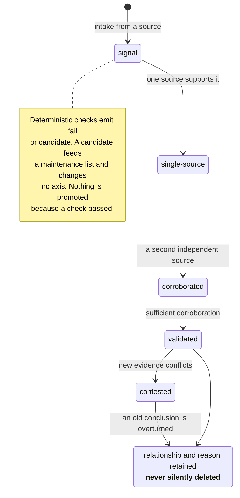

## 1. Executive Summary

Cambium is not a memory system. It says so in its second paragraph — *"Cambium
does not provide a knowledge corpus, a RAG engine, or a default domain policy"* —
and the repository **selects no profile of its own**: the four governance
placeholders in `K00/03` are unfilled and no composed vocabulary ships. What it
provides is the standard by which an operator and an LLM agent maintain a corpus
over time, twelve deterministic scripts that check whether they did, and a filled
reference profile under `profiles/examples/agent-atlas/` that shows what the
interface looks like answered.

It is in this atlas for the same reason [TERSE Memory](../terse-memory/) and
[MeMex Zero-RAG](../memex-zero-rag/) are: the durable thing is an adopter's
Markdown vault, and what this repository contributes is the correction,
provenance, staleness and evidence machinery around it — 5,687 lines of Python
and 6,453 lines of normative kernel text, inspectable at a pinned commit. Read it
as a governance layer, not a component. The scope caveat is real and is restated
wherever a claim depends on it.

**Its central idea is one this atlas keeps asking for and rarely finds: a check
that refuses to return a pass it has not earned.** Run against its own repository,
`check_freshness.py` reports

> `Conclusion: NOTHING CHECKED — all 153 file(s) skipped for lack of a resolvable
> volatility… This is not evidence of freshness.`

and exits 2. `check_vocab.py` exits **1** rather than assume a vocabulary when no
profile has been composed, printing the command that would fix it. A green run
that examined nothing is the most common way a quality gate lies, and two of
these tools are built so that it cannot happen.

**Its second idea is that passing a check must never promote a belief.** The
status standard is explicit: *"File existence, a resolvable wiki link, the
existence of an external checklist item, or a large page word count MUST NOT
automatically change any status"*, and *"A status MUST NOT be upgraded directly
because the file exists, its length reaches a threshold, or automated checks
pass."* The scripts emit `fail` and `candidate`; a candidate feeds a human's
maintenance list and changes nothing. The tools can block, and they cannot
believe.

**Its third is a genuinely governed write path.** A concurrent batch produces a
Coverage Delta and `apply_delta.py` merges it into the canonical ledger, because
— in the script's own words — *"the serial merge zone only executes deterministic
actions… delta application is done by this script, not by an LLM hand-editing the
large Ledger file."* It is dry-run by default, re-parses the merged result before
writing and **aborts rather than write a ledger that no longer parses**, writes
atomically, and rejects a page whose batch does not match the delta's.

Reservations. The repository ships no corpus, so every claim about maintaining
one over time is unexercised end to end, and there are 73 lines of tests covering
one of twelve scripts. Supersession keeps the
relationship and the reason and is keyed on a page rather than a value, so it is
history rather than a
[tombstone](../../patterns/rejected-value-tombstone/). And most of the 6,453
kernel lines are `MUST`/`MUST NOT` prose addressed to an agent — the boundary
between that prose and the twelve scripts is the main thing to measure before
adopting.

Licensing is scoped and unusually careful: Apache-2.0 for everything under
`Tools/`, CC-BY-4.0 for the standards and profile materials, spelled out per path
in `LICENSE.md`.

## 2. Mental Model

A page's standing is four independent axes that a machine may lower and only a
judgement may raise. The evidence ladder is the one this atlas cares about.



`authoring_status` (`unassessed → outline → drafted → reviewed`) runs beside it
and may be downgraded *"when a regression, source invalidation, or major
structural gap is found"*, together with a profile-registered readiness status
and the user's own `learning_status`. The standard's instruction is that the four
*"MUST NOT be merged into a single status chain"*, with a worked example of a page
that is `reviewed`, unbuilt, `single-source` and unlearned at once.

Separating "somebody checked the prose" from "the world supports the claim" is
the distinction most systems in this atlas collapse into one confidence float.
Here they are separate fields with separate owners and separate upgrade rules,
and the upgrade rules are the point: automation can only ever move a page *down*.

## 3. Architecture

```text
effective standard = domain-neutral kernel + exactly one selected profile
```

Twelve kernel modules `K00`–`K12` carry the normative rules — scope and
architecture, build execution, note types and ownership, content depth,
terminology, knowledge intake and evolution, sources and accuracy, metadata and
status, wiki links, writing, expression, quality assurance. Twelve runtime routes
`R01`–`R12` are execution paths, in a namespace deliberately kept independent of
`Kxx`. Read Sets bound which sources a route may load. Runtime Cards are compiled
shortcuts, and the ordering rule is stated plainly: *"Normative source text always
wins."*

`Tools/` is the enforceable part: `check_proof.py` (1,173 lines),
`stamp_cards.py` (743), `compose_vocab.py` (702), `kblib.py` (574),
`check_profile.py` (557), `check_residual_content.py` (520),
`check_freshness.py` (304), `check_links.py` (268), `apply_delta.py` (245),
`check_vocab.py` (242), `duplicate_check.py` (216), `check_moc.py` (143). Nine
schema templates cover the audit plan, coverage ledger and delta, execution
defaults, progress ledger, receipts, residual-scan config, terminal proof and
watermark.

### Deployment and ergonomics

Python 3 and no dependencies — `kblib.py` implements a restricted YAML subset
parser rather than taking a library, and the accepted subset is declared in each
template: scalars, one-level lists, one-level flat maps; no anchors, no block
scalars, no flow maps, no multi-document. Every script is a CLI over a vault
root and runs immediately.

The adoption cost is not the tooling. It is filling in a profile: the standard is
inert until an adopter answers the profile interface and composes a vocabulary,
and until then `check_vocab.py` correctly declines to check anything.

## 4. Essential Implementation Paths

### A run that checked nothing says so

`check_freshness.py` reads frontmatter, skips retired and merged pages, resolves
a page's volatility from an explicit declaration or a domain mapping, and
computes `review_by` as `last_verified + interval` — 120 days for fast, 365 for
slow, never for stable. Overdue and never-verified pages become candidates.

The decision worth taking is in the docstring and then in the output:

> "when every scanned file is skipped for lack of a resolvable volatility, the
> run reports NOTHING CHECKED as a candidate result — an all-skip run is not
> evidence of freshness."

Run against Cambium itself at this commit, that is exactly what happens: 153
files scanned, 153 skipped, `overdue=0` and `fresh=0` printed side by side, and a
conclusion that refuses to be read as a pass.

Most staleness checks in this atlas would have printed `overdue=0` and returned
zero. The difference between "no page is overdue" and "no page could be assessed"
is invisible in the first number and decisive for the operator, and this is the
only tool in the corpus that reports it as a distinct outcome.

`check_vocab.py` applies the same principle one level up. With no composed
vocabulary it does not fall back to a permissive default; it prints what is
missing, prints the command that fixes it, and exits 1.

### Candidates cannot promote

The result vocabulary is `fail` and `candidate`, and the freshness script states
the consequence: *"overdue and pending-first-verification pages are always
result=candidate — they only feed the maintenance-run candidate list and never
change any status axis of a page."*

Read that against the status standard's ban on automated upgrades and the
architecture is complete in one direction and deliberately absent in the other. A
deterministic check can fail a batch and can nominate work. It cannot mark a page
`reviewed`, cannot advance `evidence_maturity`, and cannot conclude that a page
is fresh. Everything that raises a page's standing requires a judgement the
tooling does not make.

This is the [promotion between tiers](../../patterns/promotion-between-tiers/)
gate written as a prohibition rather than as a mechanism, and it is a cleaner
statement of it than most implementations manage — because the component that
would be tempted to promote is the one explicitly denied the power.

### The merge zone an LLM may not touch

`apply_delta.py` is the governed write path, and its safeguards each close a real
failure:

- **Dry run by default.** `--apply` is required to write.
- **Re-parse before write.** The merged output is re-parsed with the restricted
  parser and the run **aborts without writing** if it no longer parses, so a
  merge cannot leave the canonical ledger unreadable.
- **Atomic write** via temp file and replace.
- **Out-of-scope protection.** A page whose `next_batch` or `batch` does not
  equal the delta's batch is rejected; `--force` overrides and records a per-page
  reason.
- **Unknown keys applied but warned**, because profile extensions may
  legitimately add them and the warning is the visibility hook.
- **Receipts merged by appending, deduplicated**, rewritten in the schema's block
  form rather than left as orphan list lines.

An agent proposing a structured delta that a deterministic script validates and
applies is the [governed write gateway](../../patterns/governed-write-gateway/)
in a filesystem rather than a database, and abort-on-unparseable is the part most
implementations of that pattern leave out.

### Evidence bound to the page

Coverage Ledger entries carry `gate_receipts` — ids of the form
`audit-check_links-20260721T000000Z-<fingerprint>-0001` — so the checks that
certified a page travel with the page's entry rather than living only in a log.
`check_proof.py` then enforces the terminal gate: completion requires the three
open-guidance counts at zero, `required_authoring_gaps=0`,
`unverified_batches=0`, `unresolved_invalidations=0`, a Terminal Proof with every
field populated, and a route list that must include the bootstrap,
audit-and-completion and targeted-audit routes because *"this is terminal
evidence"*.

A completion claim that must enumerate which routes and which cards produced it,
and that fails on any empty field, is a stronger definition of "done" than most
systems here have for "stored".

## 5. Memory Data Model

The unit is a Markdown page in the adopter's vault. Cambium owns its frontmatter
vocabulary: `type`, `domain`, `scope`, `level`, `depth`, `priority`, the four
status axes, `evidence_maturity`, `prerequisites`, `aliases`, `last_verified`,
`last_reviewed`, `volatility`, `lifecycle`, source metadata and `related`.
Machine-readable base values live in `vocabulary-base.yaml`; a profile may only
append through registered extensions, and *"Markdown prose remains the single
canonical owner of field semantics"* — the registries are projections, not a
second source of rules.

Around the corpus sits a state layer, shipped as templates rather than instances:
a Coverage Ledger of page-level status, a Progress Ledger of task and batch state
with an explicit task state machine, Coverage Deltas, an audit plan, script
receipts as JSONL, a residual-scan config, a watermark, and the Terminal Proof.

What is absent, measured against this atlas's rubric. There is no value-keyed
rejection: supersession is a relationship between pages with a retained reason,
which is history and not a guard against re-assertion. Validity time is not
tracked apart from record time — `last_verified` and `last_reviewed` are when
someone looked, not when the claim was true. And the Coverage Ledger's status
fields are **updated in place** by `apply_delta.py`, so the ledger holds current
standing and not its trajectory; the durable append-only material is the receipt
register, which records verifications rather than mutations. That is the other
half of the [append-only audit](../../patterns/append-only-memory-audit/)
pattern, and the half fewer systems build — but it is not the half the mark is
for, so the mark is withheld.

## 6. Retrieval Mechanics

There is no retrieval engine, and the repository says so. What exists is a
loading discipline: Read Sets define, per route, which sources an agent may read
back, and Runtime Cards are compiled shortcuts for routine work with a stated
precedence — when a Card is *"incomplete, disputed, or insufficient for an
exception"*, the agent reads back the Read Set and the kernel modules, and
normative text wins.

Compiled-shortcut-with-authoritative-fallback is a real context-assembly pattern
and the precedence rule is the load-bearing part; `stamp_cards.py` exists to keep
the compiled artifacts traceable to their sources. But nothing here ranks, scores
or filters memory, so most of this atlas's retrieval questions do not apply, and
`scope_enforced` is withheld for the plain reason that there is no read path on
which a scope key could be applied.

## 7. Write Mechanics

Writing is batched. A batch is *"an independently accepted unit of work with its
own manifest, dependencies, receipts, delta, and lifecycle"*; an agent is an
execution context, possibly several per batch; and a logical integrator
*"exclusively controls shared state, batch activation, queue changes, and serial
merges"*. Concurrent workers produce isolated outputs and the integrator merges
them one at a time, running global checks after each merge.

Single-writer-for-shared-state with isolated concurrent producers is the right
shape for LLM workers, and stating that the concurrency cap is on *batches*
rather than on agents is a distinction most designs blur.

### Operational cost

The checks are pure Python over a filesystem — no model, no service, no network.
`check_links.py` scanned 153 files and 1,171 links in under a second at this
commit. The real cost is the standard: an adopter must answer a profile
interface, compose a vocabulary, maintain ledgers and receipts, and route work
through batches. Cambium is explicit that this is for corpora maintained over
time, and the machinery would be absurd for anything smaller.

## 8. Agent Integration

No runtime, no MCP server, no framework binding. The integration surface is the
kernel text an agent is expected to load and obey, plus CLI checks a human or a
CI job runs. That places most of the standard's authority in the category this
atlas records for [MeMex Zero-RAG](../memex-zero-rag/): invariants expressed as
instructions to a model.

The difference, and it is material, is that Cambium moved a specific subset into
executable form — vocabulary conformance, link integrity, duplicate detection,
MOC coverage, residual content, profile validity, freshness, delta application
and terminal-proof completeness are scripts, not sentences. Measuring that
boundary is the most useful thing a prospective adopter can do, and this report's
own attempt is in section 10.

## 9. Reliability, Safety, and Trust

Strengths:

- **"Nothing checked" is a distinct result from "passed"**, in both the freshness
  and vocabulary checks, with the reasoning in the docstring and the refusal
  visible in the exit code.
- **Automated checks may never raise a status**, stated normatively and reflected
  in a result vocabulary with no promoting outcome.
- **Four independent status axes**, with an explicit prohibition on collapsing
  them and a worked example of their divergence.
- **A deterministic merge zone** an LLM is not permitted to hand-edit, dry-run by
  default, aborting rather than writing an unparseable ledger.
- **Receipts bound to ledger entries**, so the evidence for a page's standing
  travels with the page.
- **A terminal completion gate** requiring enumerated routes, cards and zeroed
  counts, failing on any empty field.
- **No dependencies**, including a hand-written restricted parser whose accepted
  subset is declared in every template it reads.
- **Scoped licensing** stated per path rather than as one blanket claim.

Gaps:

- **No corpus, so nothing is exercised end to end.** The reference profile shows
  the interface answered and `check_profile.py` passes on it; what remains
  undemonstrated is everything downstream of a vault — vocabulary conformance,
  freshness, duplicates, MOC coverage, residual content, delta application.
- **The kernel is prose.** Most `MUST` and `MUST NOT` rules have no script, and
  the enforcement boundary is not written down anywhere as a list.
- **Supersession is page-keyed with a retained reason**, which prevents silent
  deletion and does not prevent re-assertion.
- **Ledger status is updated in place**, so the append-only material is the
  verification register rather than a mutation history.
- **73 lines of tests over one of twelve scripts.**

## 10. Tests, Evals, and Benchmarks

`Tools/tests/` contains one file of 73 lines covering `check_links.py`. It runs
in 0.15s and its three tests pass. The other eleven scripts — including the
1,173-line terminal-proof gate that decides whether a corpus may be called
complete, and the delta applier that is the only thing permitted to write the
canonical ledger — have none.

There is no benchmark and nothing to benchmark; the outputs are conformance
verdicts, not rankings.

What can be measured is self-application, and it was, at this commit:

| Check | Target | Result |
| --- | --- | --- |
| `check_links.py` | the kernel | 153 files, 1,171 links, `missing=0 ambiguous=0` — **exit 0** |
| `check_profile.py` | `profiles/examples/agent-atlas` | `slots=10 bound_ok=10`, `sentinel_hits(fail)=0`, 13 files scanned — **exit 0** |
| `compose_vocab.py` | that profile's extensions | refuses: `K00/03` still carries `{{ standards_status }}`, `{{ selected_profile_manifest }}` — **exit 1** |
| `check_vocab.py` | the kernel | no composed vocabulary; prints the fix — **exit 1** |
| `check_freshness.py` | the kernel | `NOTHING CHECKED — … not evidence of freshness` — **exit 2** |

Two real passes, and they answer different questions. Every one of 1,171 wiki
links across 153 interlinked kernel files resolves, so the standard's own corpus
obeys its own K09 rule. And the reference profile binds all ten interface slots
with no unfilled-template marker left, so the profile interface is answerable in
practice rather than only in the abstract — with the tool's own caveat attached:
*"This checks structure, not whether the answers are good."*

The three non-passes are the design working, and the third one is the sharpest.
`compose_vocab.py` will not build a vocabulary from a validated example profile
because the **repository-level** governance page is deliberately uninstantiated —
adoption is a governance act, and the tool refuses to simulate one. So the
boundary is not "no worked instance"; it is that the worked instance stops
precisely where a real adopter's judgement would have to begin.

What that leaves unexercised is everything downstream of a composed vocabulary,
which is most of what the standard is for: conformance, freshness, duplicates,
MOC coverage, residual content, delta application, and the terminal proof.

## 11. For Your Own Build

### Steal

- **Make "nothing was checkable" a distinct outcome.** A gate that returns green
  when every input was skipped is the most common way a quality signal lies, and
  the fix is one branch and one sentence of output.
- **Deny your automation the power to promote.** Let checks fail and nominate;
  require a judgement to raise standing. Written as a prohibition it survives
  contact with a contributor who wants to save a step.
- **Split status into axes that cannot be merged**, each with an owner and its
  own upgrade rule. A single confidence float hides the case where the prose was
  reviewed and the evidence is still one source.
- **Let the model propose a delta and let a script apply it.** Keep the serial
  merge zone deterministic, dry-run by default, and abort rather than write a
  state file that no longer parses.
- **Bind receipts to the record.** A page entry carrying the ids of the checks
  that certified it answers "why do we believe this is reviewed" without a join.
- **Define completion as enumerated evidence.** Requiring which routes and cards
  produced a result, with zeroed open counts, makes "done" falsifiable.
- **Declare the parser subset you accept** in the template of every file you
  parse, if you write your own parser to avoid a dependency.

### Avoid

- **Gating your own demonstration on an adoption you decline to make.** The
  reference profile validates, and the vocabulary it would compose cannot be
  built, because `compose_vocab.py` requires the repository-level governance
  placeholders to be filled first. That is a defensible boundary and it means the
  half of the toolchain downstream of a vocabulary has no public passing run.
- **Leaving the prose/script boundary undocumented.** Twelve scripts beside
  twelve kernel modules invites a reader to assume the rules are enforced; a list
  of which `MUST` clauses have a check would cost a page and settle it.
- **Treating supersession-with-a-reason as protection against re-assertion.** It
  is history. Keyed on a page, it cannot stop the same conclusion arriving again
  under a new one.

### Fit

Right for an operator maintaining a substantial, long-lived corpus with LLM
agents who already feels the failure this standard is built around — that an
agent will claim completion it cannot evidence. The batch model, the terminal
proof and the governed merge are proportionate to that problem and to nothing
smaller.

Wrong as a memory component. It stores nothing, retrieves nothing and ranks
nothing, and adopting it means adopting a working method rather than adding a
dependency. The honest way to read this report is that Cambium's two best ideas —
a check that refuses to pass what it did not examine, and a toolchain forbidden
to promote a belief — are worth copying into systems that *do* store, most of
which have neither.

## 12. Open Questions

- Which kernel `MUST` clauses have a deterministic check and which do not? No
  list exists, and it is the number an adopter most needs.
- Is a value-keyed rejection compatible with the page-level supersession model,
  or does the corpus's unit rule it out?
- Does the Coverage Ledger's in-place update lose anything the receipt register
  does not recover?
- The reference profile binds every interface slot, and composing its vocabulary
  is blocked by the repo's own unfilled governance page. Is that ordering
  deliberate, or would a composed example vocabulary be shippable?
- `check_proof.py` is the largest script and the one gating completion. What
  would it take to test it?
- The freshness intervals (120 days, 365 days, stable never) are stated without
  derivation. What are they calibrated against?

## Appendix: File Index

- Kernel: `kernel/K00`–`K12`, notably `K06 Knowledge Intake and Evolution/`
  (source-to-knowledge pipeline, evidence maturity, supersession),
  `K08 Metadata and Status/03 Status Axes.md`, and `K12 Quality Assurance/`
  (completion gate, audit evidence reuse and invalidation, terminal audit).
- Governed write: `Tools/apply_delta.py`.
- Refusal-to-pass checks: `Tools/check_freshness.py`, `Tools/check_vocab.py`.
- Completion gate: `Tools/check_proof.py`.
- Other checks: `check_links.py`, `check_profile.py`, `check_moc.py`,
  `duplicate_check.py`, `check_residual_content.py`, `stamp_cards.py`,
  `compose_vocab.py`; shared parser `kblib.py`.
- Schemas: `Tools/schemas/` — `coverage_ledger`, `coverage_delta`,
  `progress_ledger`, `receipt.template.jsonl`, `terminal_proof`, `audit_plan`,
  `watermark`, `execution_defaults`, `residual_scan_config`.
- Tests: `Tools/tests/test_check_links.py`.
- Licensing: `LICENSE.md`, `LICENSES/`, `NOTICE`, `ATTRIBUTION.md`.

## History

**2026-08-20** — [`7181c94e9676f32aacc800030c0c83c3579e315e`](https://github.com/KimGLee/Cambium/commit/7181c94e9676f32aacc800030c0c83c3579e315e) — re-pinned 127 commits on, 272 files and +73,434 lines, across `Tools/` (137 files), `profiles/` and `kernel/`. Screened again: no auto-run surface, one build-time `Makefile`, no dependency manifest of any kind, so nothing was installed. Marks unchanged at `trust_state` and `human_review`. **One published claim in this report stopped being true, and two mechanisms are new.**

**There is a server now, and the way it is kept from becoming a judgment is the interesting part.** `Tools/mcp_server.py` is an MCP stdio server at protocol revision `2025-11-25`, whose `tools/list` is projected straight out of `Tools/compiled/mcp-tools.json`, itself compiled from the CLI contract by `compile_cli_contract.py`. Two properties are enforced rather than intended. It declares no `argparse` parser and no `main()`, so `discover_tools` cannot see it and it never appears in its own tool list — *"a transport that advertised itself as a callable operation would be the exact layer smear this file exists to avoid."* And it imports **nothing from the distribution** — not a check, not an applier, not `kblib` — with `Tools/tests/test_mcp_server.py` asserting the import set statically, *"so the property survives future edits."* The stated reason is the one this atlas keeps asking for: *"a module that cannot reach a judgment module cannot make a judgment."* The cost is a hand-rolled sha256 and a hand-rolled canonical `json.dumps`, and the file says so.

**Metadata authority became executable.** `Tools/apply_metadata_transition.py` (489 lines) consumes one typed Profile Gate receipt as a canonical metadata transition: only the Integrator may run `--apply`, a current-catalog producer receipt is validated first, Profile, K00, metadata-contract, page and Coverage inputs are compare-and-swapped under a shared runtime writer lock, and a pre-commit failure restores both Coverage and the exact page before-image. An authority that was a documented role is now a gate with an actor, a receipt and a rollback.

Also at this pin: freshness evidence closed over the full scan rather than a sampled one, legacy observations recording the field's vocabulary rather than the gate's enum, per-host registration and binding configs rendered with the run that produced them named in the header, and `compile_cli_contract` no longer claiming complete receipt extraction.

**2026-08-07** — [`78140714426d66b01246eb9cdefae00d7d93f74f`](https://github.com/KimGLee/Cambium/commit/78140714426d66b01246eb9cdefae00d7d93f74f) — 32 commits and 52,570 inserted lines on, and the work is the project auditing its own distinguishing property. Screened first: 0 auto-run surfaces, 1 build-time execution path, 0 unpinned surfaces, nothing inside the cooldown; nothing was built or run. Marks are unchanged. Seven remediation batches left 106 findings open, and the commit that matters separates them: most were wording and ownership consistency, while six *"had the same shape as the S1s this work started by fixing, which is that something passes by saying nothing"* — the failure class this report already credits the project for naming. The worked example is the vocabulary gate: `compose_vocab` was the one artifact writer not going through `atomic_write_text`, and `check_vocab` only asked whether the file existed, so **a zero-byte `vocab.yaml` made every controlled frontmatter value legal and exited 0**. Both sides now share one predicate — the artifact must parse, be a mapping, and carry a non-empty field set — and CI was added that would have caught the original two findings. A separate batch closes *"the bypasses an independent review found in the new checks"*, which is the second-order version of the same discipline: the checks that catch vacuous passes were themselves checked for vacuous passes.

**2026-08-04** — [`4f8bf4df77868ff9a86531539276cea11c28093d`](https://github.com/KimGLee/Cambium/commit/4f8bf4df77868ff9a86531539276cea11c28093d) — second reading, four commits on, prompted by the project's author. `profiles/examples/agent-atlas/` is a 603-line filled reference profile carrying no placeholder markers, and it was present at the previously pinned commit; `check_profile.py` passes on it — `slots=10 bound_ok=10`, `sentinel_hits(fail)=0`, 13 files scanned. Verified at the old pin before the re-pin. `compose_vocab.py` still refuses to build a vocabulary from it, because `K00/03` carries four uninstantiated `{{ }}` placeholders and adoption is a governance act the public repository declines to simulate, so `check_vocab.py` continues to exit 1 and `check_freshness.py` continues to report `NOTHING CHECKED`. Since the old pin: `ROADMAP.md` gains a typed-dependency-runtime section, and the example's adoption wording is rewritten — where it previously described the live Agent Systems Atlas corpus as "migration inputs to a future adoption task", it now records that the Atlas has completed a separate formal adoption of Cambium `3.0.0` against a materialized `profiles/agent-atlas/`, while adding that this example "remains a reference rather than an adoption certificate or proof of corpus-wide acceptance". That private instance state is not distributed, so nothing about it is checkable here.

**2026-08-04** — [`289515b5c961de6e283ffea60ccbe544827a11cc`](https://github.com/KimGLee/Cambium/commit/289515b5c961de6e283ffea60ccbe544827a11cc) — first reading. The three self-application runs in section 10 were executed against the repository at this commit, as was the test file; the exit codes are measured, not read.
