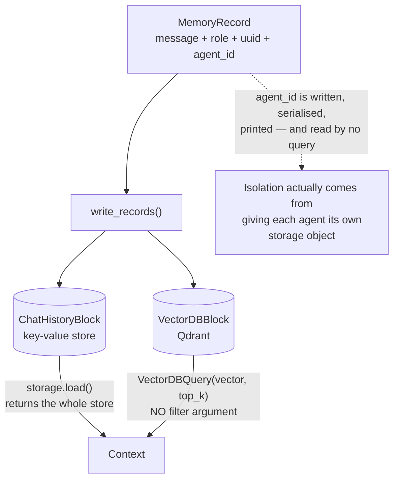

## 1. Executive Summary

CAMEL is a multi-agent framework — role-playing, workforce, society — and its
memory module is small: roughly 1,350 lines across `camel/memories/`, Apache-2.0.
The contract is three parts and it is genuinely clean. A `MemoryBlock` stores and
retrieves; an `AgentMemory` wraps a block and adds `retrieve`, `write_records`,
`clear` and a context creator; a `BaseContextCreator` turns retrieved records
into the messages that go to the model. Three implementations ship:
`ChatHistoryMemory` over a key-value store, `VectorDBMemory` over a vector store,
and `LongtermAgentMemory` composing both.

**The unit is a message, not a fact.** `MemoryRecord` holds a `BaseMessage`, the
role it played at the backend, a UUID, a timestamp and an `extra_info` dict.
Nothing extracts, summarises, or derives; what is stored is the transcript, and
what is retrieved is some of the transcript. That places CAMEL near the boundary
this atlas draws between memory and conversation-window management, on the memory
side of it only because `VectorDBMemory` embeds messages into a durable vector
store and recalls them by similarity across sessions rather than by recency
within one.

Two things in the module are worth a reader's attention, and both are gaps.

**Every record carries an `agent_id`, and no read path uses it.**
`ChatHistoryBlock.retrieve` calls `self.storage.load()` and returns the store.
`VectorDBBlock.retrieve` issues `VectorDBQuery(query_vector=..., top_k=limit)`
with no filter argument. The field is set in `write_records`, serialised by
`to_dict`, parsed back by `from_dict`, printed in `__repr__` — and consulted by
nothing that reads. Isolation in CAMEL comes from *handing each agent its own
storage object*, a separate JSON file or Qdrant collection, so the moment two
agents share a backend they share its memories. This is the exact case the atlas
rubric names — storing a boundary is not enforcing one — and it is unusually
legible here because the key is present, correct, and inert.

**`ScoreBasedContextCreator` no longer scores.** Its docstring describes "a
context creation strategy that orders records chronologically", and its
`token_limit` parameter is documented as *"Retained for API compatibility. No
longer used to filter records."* The name and the parameter outlived the
mechanism they described, which matters because the parameter reads, from a call
site, like a budget that is being enforced.

## 2. Mental Model

There is no epistemic model, and the design does not claim one. A message was
sent, so it is in the store; it stays there until someone pops it or clears
everything. Nothing is ever judged, corroborated, superseded or doubted, and no
field exists on which to record such a judgement.

What CAMEL models instead is *composition* — which is a reasonable thing for a
multi-agent framework to care about. `LongtermAgentMemory.retrieve()` returns
`chat_history[:1] + vector_db_retrieve + chat_history[1:]`, which keeps the
system message first, inserts the similarity hits after it, and follows with the
rest of the recent history. That ordering is a deliberate decision about where
recalled material sits relative to the live conversation, and it is written in
one line with no comment explaining it.

## 3. Architecture

Nothing to run for the default case: `ChatHistoryMemory` with `InMemoryKeyValue
Storage` needs no service, and `JsonStorage` makes it a file. Redis and a Mem0
cloud adapter are the other key-value options. The vector path defaults to
`QdrantStorage` with `OpenAIEmbedding`, so `VectorDBMemory` costs an embedding
call per message written and per retrieval, and — since the default embedding is
OpenAI's — an API key to store anything at all.

## 4. Essential Implementation Paths

- `camel/memories/base.py` (196) — `MemoryBlock`, `BaseContextCreator`,
  `AgentMemory` with the `agent_id` property.
- `camel/memories/agent_memories.py` (321) — the three memories.
- `camel/memories/records.py` (195) — `MemoryRecord`, `ContextRecord`,
  serialisation.
- `camel/memories/blocks/chat_history_block.py` (286) — key-value storage,
  windowing, system-message preservation.
- `camel/memories/blocks/vectordb_block.py` (111) — embed, write, unfiltered
  query.
- `camel/memories/context_creators/score_based.py` (169) — the chronological
  creator with the vestigial name.

## 5. Memory Data Model

`MemoryRecord` is the whole model: message, `role_at_backend`, `uuid`,
`extra_info`, `timestamp` (nanosecond-precision record time), `agent_id`.
`ContextRecord` wraps it with a `score` and a timestamp for the retrieval
result.

The absences follow from the unit. There is no status because there is no claim
to hold one; no validity time because a message has only the moment it was sent;
no provenance because the record *is* the provenance. `extra_info` is
`Dict[str, str]` and unused by the framework — the one place a caller could
attach something, with nothing reading it either.

## 6. Retrieval Mechanics

`ChatHistoryBlock.retrieve(window_size)` loads the stored records and, with a
window, keeps the leading SYSTEM or DEVELOPER message plus the most recent
`window_size` entries. That is window management, done carefully — pinning the
system message so a truncation cannot decapitate the agent is the right detail.

`VectorDBBlock.retrieve(keyword, limit)` embeds a string and returns the top
`limit` by similarity. The string is `VectorDBMemory._current_topic`, which
`write_records` sets to the content of the last USER message it saw. Two
consequences follow and neither is documented. The query is whatever the user
last said, so recall is driven by phrasing rather than by any analysis of what
the turn needs. And `_current_topic` is in-process state initialised to `""`, so
in a fresh process the first retrieval embeds the empty string and returns
whichever three records happen to sit nearest to it.

There is no fusion, no reranking, no recency weighting and no scope filter.

## 7. Write Mechanics

Writes block and are trivial: `write_records` appends to the key-value store, or
embeds and upserts to the vector store, on every turn. Empty-content records are
filtered out before embedding. There is no extraction, no consolidation, no
background pass and no compaction, so the store grows monotonically with the
conversation and the only bound on what reaches the model is the context
creator's ordering plus whatever window the caller passes.

## 8. Agent Integration

`ChatAgent` holds an `AgentMemory` and the `agent_id` setter propagates the
identifier down to it. A `MemoryToolkit` gives an agent save/load over its own
memory. The role-playing and workforce layers compose agents that each carry
their own memory object — which is, in practice, the isolation mechanism.

## 9. Reliability, Safety, and Trust

No marks are earned, and the interesting part is which near-misses exist.

**Scope**: described above. The field is there; nothing filters on it.

**Deletion**: `ChatHistoryMemory` can `pop_records(count)` from the end or
`remove_records_by_indices(indices)` — positional operations on a list, not
addressed removal, even though every record has a UUID that could address it.
`VectorDBMemory` raises `NotImplementedError` for both, with the message
*"VectorDBMemory does not support removing historical records"*, leaving
`clear()` as the only removal. So in `LongtermAgentMemory` — the composed
configuration a long-running agent is meant to use — deleting one thing a user
asked to be forgotten is not expressible on the durable half. It can be removed
from the recent transcript and remains in the vector index, retrievable by
similarity, indefinitely.

**Audit, trust state, bi-temporality, human review**: absent, and consistent
with a transcript store.

## 10. Tests, Evals, and Benchmarks

868 lines across four files in `test/memories/`, none run here. They cover
round-tripping records, windowing, the composed memory, and the
`NotImplementedError` paths. No test asserts that particular material must not
be retrieved — which follows: with no scope filter and no deletion on the vector
side, there is no boundary to assert about. No memory benchmark and no retrieval
quality measurement exists in the repository, and none is claimed.

## 11. For Your Own Build

### Steal

- **Split block, memory and context creator.** Storage, policy and prompt
  assembly are three concerns, and CAMEL's three-way split is the clearest small
  example of separating them. A custom backend means implementing one narrow
  interface.
- **Pin the system message through truncation.** Keeping index 0 when it is
  SYSTEM or DEVELOPER is two lines and prevents the worst windowing bug.
- **Decide where recalled material sits in the prompt, explicitly.**
  `chat_history[:1] + vector_db_retrieve + chat_history[1:]` is a real decision.
  Most systems make it accidentally.

### Avoid

- **A scope key that only travels.** `agent_id` on the record, absent from every
  query, is worse than no key: it reads at a call site like isolation, and the
  isolation is actually coming from whether you remembered to give each agent its
  own storage object.
- **A query that is whatever the user last typed.** Using the last user message
  as the recall key is cheap and couples retrieval to phrasing; initialising it
  to `""` means the first retrieval of a process is arbitrary.
- **Leaving a parameter named after a mechanism you removed.** `token_limit`,
  documented as no longer used to filter, is still in the constructor signature
  of a class still called `ScoreBasedContextCreator`.
- **A durable store you cannot delete one record from.** `NotImplementedError`
  on both removal paths plus `clear()` means the only supported forget is
  forgetting everything.

### Fit

Take CAMEL's memory if you are already using CAMEL and your agents are
short-lived, single-tenant, and their memory is genuinely just their transcript.
It is small, readable, and easy to replace — the `AgentMemory` ABC is the right
seam, and swapping in one of the fact-level systems in this atlas behind it is a
day's work.

Do not use it multi-tenant without adding a filter yourself, and do not use
`LongtermAgentMemory` anywhere a user can ask you to delete something.

## 12. Open Questions

- **Is the unfiltered vector query intentional?** `VectorDBQuery` carries no
  filter argument at this commit, so scoping recall would require a change to
  the storage interface rather than to the memory block — which may be why it is
  absent.
- **What is `extra_info` for?** Present on every record, serialised both ways,
  read by nothing in the framework.
- **Does anything downstream still depend on `token_limit`?** It is retained for
  API compatibility and no longer filters; whether callers still pass it
  expecting a budget was not traced.

## Appendix: File Index

| Path | Lines | What it holds |
| --- | --- | --- |
| `camel/memories/agent_memories.py` | 321 | ChatHistory, VectorDB and Longterm memories |
| `camel/memories/blocks/chat_history_block.py` | 286 | Key-value storage, windowing, system-message pinning |
| `camel/memories/base.py` | 196 | `MemoryBlock`, `AgentMemory`, `BaseContextCreator` |
| `camel/memories/records.py` | 195 | `MemoryRecord`, `ContextRecord`, serialisation |
| `camel/memories/context_creators/score_based.py` | 169 | Chronological ordering; the name is vestigial |
| `camel/memories/blocks/vectordb_block.py` | 111 | Embed, write, and the unfiltered query |
| `test/memories/` | 868 | Round-trips, windowing, the `NotImplementedError` paths |

## History

**2026-07-30** — [`ec48f997f3c2a700ae5a4cf0280792838fea81f8`](https://github.com/camel-ai/camel/commit/ec48f997f3c2a700ae5a4cf0280792838fea81f8) — first reading.
