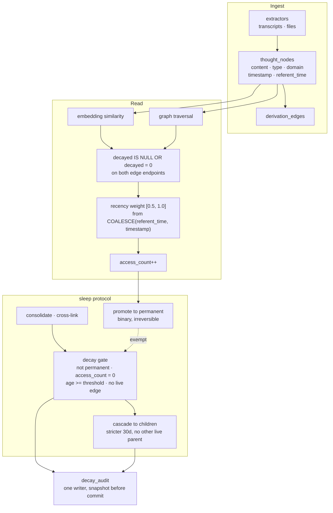

## 1. Executive Summary

Cashew is a thought graph for one person, stored in one SQLite file, with a
stated purpose its `PHILOSOPHY.md` puts plainly: two agents on the same base
model with different cashew brains respond differently because they have
different evidence about the human in front of them, and *"this divergence is
the point of the system."* It also draws a boundary most memory systems blur —
*"Cashew itself doesn't override anything. The agent's prompt decides how much
weight to put on graph evidence versus model defaults."*

Three marks, and all three are about forgetting rather than believing.

**Decay is a flag, not a delete**, and the gate in front of it is the design.
A node can only decay if it is not permanent, is older than the threshold, has
an access count of zero, and has no edge to a *live* neighbour — with
already-decayed neighbours explicitly not counting, because they are
*"effectively gone"*. Nothing that was ever read, and nothing the live subgraph
still reaches, is eligible.

**Every transition is audited by one writer.** `decay_audit.py` exists so that
all decay execution sites call the same helper, and it snapshots the node's
content and counters from the same connection so the audit row is a record of
what was lost rather than a pointer to a row that changed.

**The tests are the third mark**, and one of them is worth copying wholesale:
before asserting a decayed node is absent from a search, it asserts the node's
vector row is *still in the index*, with the comment *"proving search has to
filter it, not that it was never there."*

`trust_state` is withheld: there is no epistemic state here at all. The only
signal is access count, and it runs in the other direction — reads earn
permanence.

## 2. Mental Model

Nodes accumulate; nothing is judged true or false; some things stop being
reachable.

A node arrives from an extractor, carries a type and a domain, and is linked to
whatever it was derived from. Reading it increments a counter. Enough reads and
it is promoted to `permanent`, which `permanence.py` describes as *binary and
irreversible* — the comment in the file is *"you cannot erase traumas"*.

At the other end, the sleep protocol looks for nodes nobody has read, that are
old, and that nothing live points at. Those are marked decayed. They stay in the
table, drop out of every retrieval, and their passing is written to an audit
table.

Between the two, two clocks run in parallel and are deliberately not
interchangeable — one for when the store learned something, one for when the
thing happened.

## 3. Architecture

## 4. Essential Implementation Paths

- **Schema:** `core/db.py` — the node columns the repository's own scripts rely
  on, listed explicitly rather than assumed.
- **Decay:** `core/decay.py` — the gate, the cascade, and the two audit calls.
- **Audit:** `core/decay_audit.py` — the single writer and its lazy schema.
- **Permanence:** `core/permanence.py`.
- **Retrieval:** `core/retrieval.py` — the decayed filter, the event clock and
  the recency weight.
- **Consolidation:** `core/sleep.py`.

## 5. Memory Data Model

The node columns are enumerated in `core/db.py` with an honest caveat — *"not
exhaustive of every column — just the ones used by scripts we own"* — which is
the sort of scoping most schema constants omit.

Two fields deserve attention.

**`permanent`** is binary and one-way. The module's design notes give the
reasoning in four bullets, including that the threshold should be *discoverable
from data, not hardcoded magic*, and the promotion signal is access count on
the premise that frequently retrieved means important.

**`referent_time`** is an event clock beside the storage `timestamp`. It is
normalised on write by a helper that accepts ISO 8601 with an explicit offset,
converts to UTC, and **rejects naive datetimes outright** — *"we refuse to guess
local tz"* — raising on any parse failure with the stated preference to *"fail
loud over silent drift."*

## 6. Retrieval Mechanics

Similarity search and graph traversal both exclude decayed nodes, and the edge
join carries the predicate on *both* endpoints, so a live node cannot be used as
a stepping stone to a decayed one.

Recency is a gentle weight in `[0.5, 1.0]` that halves over about a year of
event age, and its unknown case is chosen rather than defaulted: an
unparseable timestamp neutralises to 1.0 rather than dropping the node, on the
stated ground that ranking on similarity alone beats discarding.

The clock the weight reads is `COALESCE(referent_time, timestamp)` — the
biographical clock — and the helper that loads it carries a rule in its
docstring worth quoting in full, because it is the thing most systems get
wrong by accident:

> Callers on the operational side (decay/GC/declassify/embeddings/recent
> activity) must NOT use this helper — read `timestamp` directly instead.

So a memory about something that happened last year, written today, ranks as old
for the user and is young for the garbage collector. The two clocks answer
different questions and the code says which is which.

## 7. Write Mechanics

Extractors pull nodes from agent transcripts and files. The sleep protocol is
the interesting write path: a work-capped, batched, Numpy-backed pipeline that
consolidates, cross-links, promotes and decays, wrapped by a
backwards-compatible class so existing callers keep working — a division the
module header states explicitly.

Decay writes through `log_decay_event` on the caller's connection, before the
caller commits, so the audit row and the flag are one transaction.

## 8. Agent Integration

A CLI, a daemon, extractors including one for agent archives, a dashboard with
its own metrics, and `skills/` and `integration/` directories for wiring an
agent to the graph. Distributed on PyPI as `cashew-brain`, MIT-licensed.

## 9. Reliability, Safety, and Trust

**Tombstone — awarded.** The row survives, every read excludes it, and the gate
that sets the flag is conservative in three independent ways at once: never
read, old enough, and unreferenced by anything live.

**Audit log — awarded.** One writer, a snapshot taken from the node row on the
caller's connection, and a lazily-created schema so an upgrade cannot lose the
first events. One caveat belongs on the record: `gc_decay_audit` prunes the
audit table, so the record of a forgetting is itself subject to retention.

**Negative eval — awarded**, on the pair quoted in the evidence record. The
`permanent_but_decayed` integrity case is the rarer half: asserting the check
returns 1 on a deliberately violated database proves the check can fail, which
is the property a green integrity number otherwise cannot demonstrate.

**Trust state — withheld, and there is nothing to withhold it from.** No field
records whether a node is believed, confirmed, disputed or superseded. Access
count is the only signal, and it earns permanence rather than gating belief.
That is consistent with the project's philosophy — the graph makes evidence
available and the agent's prompt decides what to do with it — and it means a
contradiction between two nodes is something the reader resolves, not the
store.

**Bitemporal — withheld.** Two clocks exist and the separation between them is
carefully enforced, but neither answers an as-of question: the event clock feeds
a recency weight in the ranking, and no read returns the graph as it stood at a
past instant.

**Scope enforced — withheld.** The boundary is one database per person. A
`domain` field labels nodes but no read filters on it, so it orders and groups
rather than partitions.

**Human review — withheld.** Nothing gates a node on anyone's approval.

## 10. Tests, Evals, and Benchmarks

**No paper.** Searched the README, `DESIGN.md`, `PHILOSOPHY.md` and `docs/` for
`arxiv`, `@article`, `@misc`, `doi.org` and a `CITATION.cff`: none.

42 test files with a `pytest.ini`, and the two that matter are in section 9's
evidence record. The decayed-search case is the one to read: it asserts the
stale vector row is present *before* searching, so the absence it then measures
is measured against an index that really contains the thing being filtered.
That ordering is the difference between a test that pins a filter and a test
that passes because the fixture was empty, and this project wrote the comment
explaining it.

No retrieval benchmark is committed and none is claimed. A `metrics-dashboard`
and a `metrics.py` exist for operational counters rather than for scoring
retrieval quality.

## 11. For Your Own Build

- **Prove the fixture contains what your filter must remove.** One extra
  assertion before the search — the stale row is still in the index — turns an
  absence check into evidence about the filter.
- **Make an integrity check fail on purpose in a test.** A checker that only
  ever reports zero is indistinguishable from a checker that cannot report
  anything else.
- **Gate forgetting on reachability, not just age.** Never read, old enough,
  *and* no edge to a live neighbour — with an already-decayed neighbour not
  counting — is a garbage collector rather than a TTL.
- **Name which clock each caller may read.** One docstring line forbidding the
  operational passes from using the biographical clock prevents a whole class
  of quiet drift.
- **Snapshot on the caller's connection.** The audit row and the state change
  then commit together, and the record describes what was lost rather than
  pointing at a row that has already changed.

## 12. Open Questions

- The decay audit is garbage-collected. What retention does it keep, and is
  there a deployment where the audit should outlive the nodes it describes?
- `permanent` is irreversible by design. What happens to a node promoted by a
  burst of reads that later turns out to be noise — is re-extraction the only
  route?
- `mood_state` is a column on every node and did not surface in the retrieval
  paths this reading covered. What reads it?

## Appendix: File Index

- Schema and paths: `core/db.py`
- Decay and cascade: `core/decay.py`
- Decay audit: `core/decay_audit.py`
- Permanence: `core/permanence.py`
- Retrieval, clocks and recency: `core/retrieval.py`
- Traversal: `core/traversal.py`
- Consolidation: `core/sleep.py`
- Event-clock normalisation: `core/session.py`
- Tests: `tests/test_embeddings.py`, `tests/test_permanence.py`,
  `tests/test_decay.py`, `tests/test_retrieval.py`

## History

**2026-09-19** — [`9c886cece87993869164770be85e2452be3e48cb`](https://github.com/rajkripal/cashew/commit/9c886cece87993869164770be85e2452be3e48cb) — first reading, at the head of `main`, version 1.2.1 on PyPI as `cashew-brain`. Screened with `scripts/screen_repo.py` before anything was read: a `tests/conftest.py` that executes on pytest collection, a `pyproject.toml` declaring dependencies with no lockfile beside it and changed five days before the reading, and a `CLAUDE.md` addressed to a reading agent — read as data throughout. Nothing was installed, built or run. Three marks. The reading covered the node schema and its two flags, the decay gate and its cascade, the audit helper and its snapshot discipline, the permanence promotion, the retrieval filters on both edge endpoints, the two clocks and the rule separating them, and the two test cases the marks rest on; the dashboard, the daemon and the extractor family were read as context rather than as subject. MIT. Four marks are withheld with reasons in section 9, and the one worth repeating is `trust_state`: there is no field recording whether a node is believed, and the project's own philosophy says why — the graph makes evidence available and the agent's prompt decides what weight to give it.
