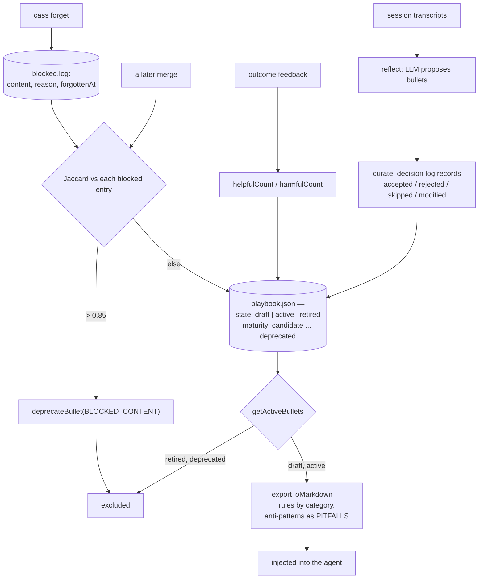

## 1. Executive Summary

CASS is procedural memory for coding agents — about 97,100 lines of TypeScript,
no database, a playbook of rules kept as JSON and rendered into markdown for
injection. Sessions are reflected on by a model, turned into candidate bullets,
curated, and promoted or demoted by what happened afterwards.

Three marks, and the one worth the reading is **a blocklist that survives
paraphrase.**

Forgetting a rule writes a `BlockedEntry` — `id`, `content`, `reason`,
`forgottenAt` — into a global `.cass/blocked.log`. On every playbook merge, each
incoming bullet is compared against each blocked entry by **Jaccard overlap of
token sets**, and anything above 0.85 is deprecated as `BLOCKED_CONTENT`
(`src/playbook.ts:415-437`). The key is the rule's own text rather than an
identifier, so a rule the user forgot cannot come back by being reworded — which
is the failure mode that makes most tombstones in this corpus decorative, because
an LLM re-extracting the same lesson rarely produces the same string twice.

**Two discrete vocabularies gate what an agent sees.** A bullet carries a `state`
of `draft`, `active` or `retired` and a `maturity` of `candidate`, `established`,
`proven` or `deprecated`. `getActiveBullets` drops retired, deprecated-by-maturity
and explicitly deprecated bullets, and `exportToMarkdown` — the function that
renders the playbook an agent reads — starts from it. `draft` is deliberately not
excluded, so a brand-new rule reaches the agent while a retired one does not.

**And then the finding that is not a mark.** `src/tracking.ts` contains a usage
analytics subsystem: a union of typed events, five writer wrappers
(`trackPlaybookChange`, `trackBulletMarked`, `trackCommandRun`,
`trackSessionCount`, `trackReflectionStats`), an append-only `usage.jsonl`, a
loader that filters by event type, and a passing test suite.

Nothing in `src/` calls any of it.

```sh
grep -rn "trackEvent(" src/ --include="*.ts" | grep -v "^src/tracking.ts"
```

Nothing at the pinned commit. The one production import from that module is
`src/orchestrator.ts:3`, which takes `ProcessedLog` and `getProcessedLogPath` —
the *processed-entries* half, which is used. One module, two halves, one wired.
`audit_log` is withheld on that basis, and section 9 says why the distinction is
worth more than the mark would have been.

## 2. Mental Model

A memory is a rule with a reputation, and forgetting is the only operation that
leaves a mark outside the playbook.



## 3. Architecture

A CLI over JSON files. Two playbooks — a global one and a per-repository one —
merged on read, with the blocklist global so a rule forgotten once stays forgotten
everywhere. No server, no database, no index.

The LLM is used for reflection, curation and gap analysis, with a provider
fallback chain (`src/llm.ts`). Nothing about retrieval needs a model: rendering is
a filter and a sort.

## 4. Essential Implementation Paths

- **Bullet schema** — `src/types.ts:66-96`; the enums at `:22-43`.
- **Blocklist** — `src/playbook.ts:38-43` (`BlockedEntry`), `:415-437` (the
  Jaccard comparison and `deprecateBullet`), `src/utils.ts:1189`, `:1216`.
- **Active set and rendering** — `src/playbook.ts:517-523` (`getActiveBullets`),
  `:525-531`, `:533-570` (`exportToMarkdown`).
- **Curation** — `src/curate.ts:187-189`; `DecisionLogEntry` at
  `src/types.ts:784-792`.
- **Outcome feedback** — `src/outcome.ts`; scoring and staleness in
  `src/scoring.ts`.
- **Unwired analytics** — `src/tracking.ts:20`, `:86-93`, `:151`, `:192-260`;
  the used half at `:481`.
- **Sanitisation** — `src/sanitize.ts`.

## 5. Memory Data Model

A bullet is unusually rich for a markdown-rendered store: `type` is `rule` or
`anti-pattern`, `isNegative` marks a prohibition, `kind` places it as a project
convention, stack pattern or workflow rule, and `source` records whether it was
learned, community, manual or custom.

Reputation is two counters — `helpfulCount` and `harmfulCount` — beside an array
of `feedbackEvents` and a `confidenceDecayHalfLifeDays` defaulting to 90.
Supersession is `deprecated`, `replacedBy` and `deprecationReason`.

`scope` is one of `global`, `workspace`, `language`, `framework` or `task` with an
optional `scopeKey`. **`scope_enforced` is withheld**: the field is stored and
counted in statistics (`src/playbook.ts:703`) and no read path filters on it.

```sh
grep -rn "scope" src/*.ts | grep -iE "filter\(|=== *b\.scope|scopeKey ==="
```

Nothing at the pinned commit.

## 6. Retrieval Mechanics

There is no retrieval engine. The playbook is filtered to its active bullets,
grouped by category, optionally truncated to a `topN`, and rendered as markdown —
with anti-patterns collected into a separate `PITFALLS (Anti-Patterns)` section
rather than mixed in with the rules.

That separation is a small, good decision. A prohibition and a prescription read
differently to a model, and putting them in one list invites the first to be
applied as the second.

## 7. Write Mechanics

Writes are command-driven and synchronous: a reflection pass proposes, a curation
pass decides, a merge writes. There is no lag and no background daemon.

**Curation keeps a decision log** — `DecisionLogEntry` records a `phase` of `add`,
`feedback`, `promotion`, `demotion`, `inversion` or `conflict`, an `action` of
`accepted`, `rejected`, `skipped` or `modified`, and a **required** `reason`. It
is a genuine record of why the store changed, and it is the automated curator's
reasoning rather than a person's, which is why **`human_review` is withheld**:
nothing in the command surface prompts for an approval.

```sh
grep -rn "prompt(\|confirm(\|readline\|inquirer" src/commands/*.ts src/curate.ts
```

Nothing matching an approve or review flow at the pinned commit.

## 8. Agent Integration

A CLI plus a `SKILL.md` contract, with the playbook exported as markdown for
injection. The agent reads; the commands write. There is no MCP server.

## 9. Reliability, Safety, and Trust

Sanitisation is taken seriously and tested: `src/sanitize.ts` runs over content
before it is stored, and `test/audit.test.ts:204-208` asserts that a bullet
containing `SUPER_SECRET` reaches neither the prompt sent to the model nor the
serialized payload.

**The unwired analytics subsystem is the most informative thing in this
repository**, and it is worth being precise about what it is and is not. It is not
a bug: nothing breaks, no user sees an error, and the tests pass because they call
the writers directly. It is a design that was finished at the module boundary and
never connected — five typed wrappers with a closed action vocabulary
(`add | remove | deprecate | update | merge`), an append-only log, and a loader
with filtering, all reachable only from `test/tracking.usage.test.ts`.

The reason it matters here more than usual: this is the module that would have
answered *what changed in the playbook and when*. A store whose whole premise is
that rules get promoted, demoted, deprecated and blocked has no record of any of
it beyond the current state of each bullet and a per-run decision log. The
mechanism to fix that exists, is typed, and is one import away.

## 10. Tests, Evals, and Benchmarks

A substantial suite — `test/serve-command.test.ts` at 1,489 lines,
`test/cli-playbook.e2e.test.ts` at 1,301, `test/config.test.ts` at 1,294 — with
end-to-end coverage of the CLI.

The negative cases that earn the mark are described in section 1 and the
frontmatter. What makes the blocked-filtering case count is the control on the
same line as the assertion: `expect(activeContents).not.toContain("Never use
eval()")` immediately beside `expect(activeContents).toContain("Always validate
inputs")`, over a playbook that demonstrably still has bullets in it.

`test/tracking.usage.test.ts` is the counter-example worth naming: it is a
well-written suite that proves the analytics writers work, and proves nothing
about whether anything calls them. A reader who took the suite as coverage would
conclude the audit trail exists.

No paper and no `CITATION.cff`:

```sh
grep -rn -i "arxiv\|bibtex\|@article\|citation\|doi" README.md docs/
```

Nothing was run. The screen reports an npm `postinstall` that runs
`bun run scripts/patch-standalone-deps.mjs`, and three dependency files changed
two days before the pin, inside the cooldown.

## 11. For Your Own Build

### Steal

**Key your blocklist on the text, and match it fuzzily.** An exact hash catches a
replay; 0.85 token overlap catches the reword, which is what an LLM actually
produces when it re-learns a lesson you deleted. This is the cheapest thing in
this report and the one most likely to be missing from your system.

**Keep the reason and the timestamp on a forget.** `BlockedEntry` carries both,
so a later reader can ask why a rule is unavailable rather than discovering that
it silently is.

**Render prohibitions separately from prescriptions.** A `PITFALLS` section is one
`filter` call and it stops a model reading "never use eval" as an instruction to
use eval.

**Let a draft reach the agent and a retired one not.** The default state admits
new rules immediately and the filter excludes only what was actively withdrawn,
which is the right asymmetry for a store whose failure mode is staleness rather
than noise.

### Avoid

**Shipping a typed event writer nobody calls.** Five wrappers, a closed action
vocabulary, an append-only log and a green test suite, with zero callers in the
source. The test suite is what makes this dangerous: it reports the subsystem as
working, because it is — in the sense that the function does what it says when
invoked, which nothing does.

**Storing a scope you never filter on.** Five scope values and an optional scope
key, used to increment a counter in a statistics function. Either the read path
uses it or the field is documentation.

### Fit

This suits a developer or small team who want their coding agent's rules to be
explicit, reviewable as a file, and correctable by deletion that actually holds.
The blocklist is the reason to choose it over a plain markdown rules file.

It is the wrong fit where you need to know the history of a rule rather than its
current state — the module that would tell you is not connected — or where
memory must be scoped between projects by the system rather than by which
playbook you loaded.

## 12. Open Questions

- **Why is the analytics subsystem unwired?** It is complete, typed and tested,
  which usually means it was connected once or was about to be.
- **Is 0.85 the right Jaccard threshold?** It is the number that decides whether a
  reworded rule returns, and nothing in the tree records how it was chosen.
- **Should `scope` filter the render?** A workspace-scoped rule currently reaches
  every workspace whose playbook was merged.
- **What happens when a blocked rule is genuinely right later?** The blocklist has
  no expiry and the entry keeps its reason, so the answer is presumably to edit
  the file — which is fine, and undocumented.

## Appendix: File Index

**Types and state**

- `src/types.ts` — enums (22-43), `PlaybookBulletSchema` (66-96),
  `DecisionLogEntrySchema` (784-792)

**Blocklist and rendering**

- `src/playbook.ts` — `BlockedEntry` (38-43), Jaccard block check and
  `deprecateBullet` (415-437), `getActiveBullets` (517-523),
  `getBulletsByCategory` (525-531), `exportToMarkdown` (533-570), scope statistics
  (703)
- `src/utils.ts` — blocklist paths (1189, 1216)

**Pipeline**

- `src/reflect.ts`, `src/curate.ts` (187-189), `src/outcome.ts`,
  `src/scoring.ts`, `src/gap-analysis.ts`, `src/audit.ts`, `src/sanitize.ts`

**Unwired analytics**

- `src/tracking.ts` — event union (20), `PlaybookChangeEvent` (86-93),
  `trackEvent` (151), the five wrappers (192-260), `ProcessedLog.append` (481, the
  half that is used)
- `src/orchestrator.ts:3` — the only production import

**Tests**

- `test/blocked-filtering.e2e.test.ts` (85-107), `test/audit.test.ts` (204-208, 620),
  `test/auto-outcome.test.ts` (122), `test/tracking.usage.test.ts` (223-240)

### Commands behind the absence claims

```sh
grep -rn "trackEvent(" src/ --include="*.ts" | grep -v "^src/tracking.ts"
grep -rn "from \"./tracking.js\"" src/ --include="*.ts"
grep -rn "scope" src/*.ts | grep -iE "filter\(|=== *b\.scope|scopeKey ==="
grep -rn "prompt(\|confirm(\|readline\|inquirer" src/commands/*.ts src/curate.ts
grep -rn -i "arxiv\|bibtex\|@article\|citation\|doi" README.md docs/
```

## History

**2026-09-13** — [`61561508a926c889487a5fcabe54ba9771100863`](https://github.com/Dicklesworthstone/cass_memory_system/commit/61561508a926c889487a5fcabe54ba9771100863) — first reading. Screened first: an npm `postinstall` running a patch script, and three dependency files changed two days before the pin and inside the seven-day cooldown, so nothing was installed and `bun test` was not run. Three marks. `tombstone` is earned on a blocklist keyed on the rule's own text and matched at 0.85 Jaccard overlap, which is the property that makes it survive an LLM rewording a lesson it was told to forget. `audit_log` is withheld on a declared-and-unwired usage-analytics subsystem: five typed event writers, an append-only `usage.jsonl` and a green test suite, with no caller anywhere in `src/` — the one production import from that module takes the processed-entries half instead. `scope_enforced` and `human_review` are withheld for absence, with the searches recorded.
