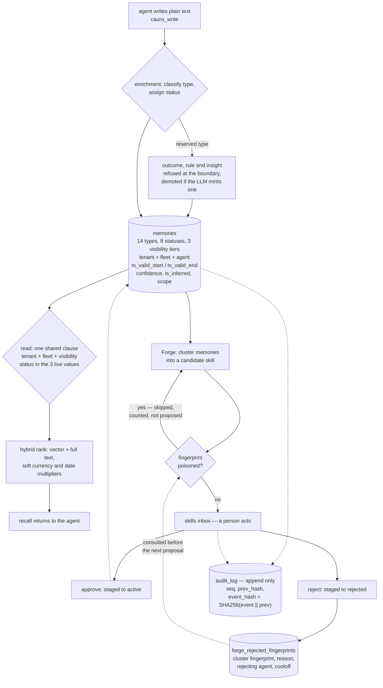

## 1. Executive Summary

Caura — renamed from MemClaw, with the old `memclaw_*` tool names, environment
variables and URLs kept working — is a governed memory layer for fleets of
agents sharing one store. It is the largest and most complete system in this
reading: Apache-2.0, version 3.7.0, 1,199 commits between 26 April and 10
September 2026 from eighteen authors, 66,323 lines in `core-api` and 36,570 in
`core-storage-api`, beside 143,878 lines of tests holding 5,729 test functions.
PostgreSQL with pgvector at 1,024 dimensions and a `tsvector` column, four
services, a plugin, and clients on npm and PyPI.

It carries all seven capability marks. That is worth stating carefully, because
the interesting question is not the count but whether each mechanism is wired to
a path a user or an agent can reach — and each one is.

**A rejection is remembered by the value, not the row.** When a person rejects a
staged skill in the inbox, `write_rejected_fingerprint` stores the candidate's
`cluster_fingerprint` in `forge_rejected_fingerprints` with the rejecting agent,
a reason and a cooloff. The next distillation run is handed a `PoisonChecker`
built against that table; `_distill_cluster` raises `_PoisonedClusterSkip` on a
hit and the run counts `candidates_skipped_poisoned` instead of proposing again.
The module docstring states the acceptance gate it was written for: *"Reject →
fingerprint written to poison table; Forge re-run does NOT propose the same
fingerprint."* That is a tombstone in the sense this atlas means — keyed on the
value, durable, consulted on a later write — and it is the mark almost nothing
else earns. Its limit is real and belongs in the same breath: the cooloff
defaults to thirty days, so this is a moratorium rather than a permanent refusal.

**Admissibility, ranking and provenance are three different fields.** Status is
one of eight values — `active`, `pending`, `confirmed`, `cancelled`, `outdated`,
`conflicted`, `archived`, `deleted` — and the enrichment LLM may downgrade a
write to `cancelled` or `conflicted` at capture. `LIVE_MEMORY_STATUSES` is the
three-value subset `(active, confirmed, pending)` that reads filter to, so five
of the eight withhold a memory entirely. Beside it, `confidence` is a nullable
float explicitly described as confidence in the *claim*, and `is_inferred` marks
a memory the system materialised by inference *"so it never silently overrides
an explicit fact."* Most systems here collapse those three into one number.

**The audit log is a hash chain with its own serialisation point.** Every
mutation appends a row carrying a tenant, an agent, an action, a resource type
and a JSONB detail. Migration 025 added a per-tenant chain — a monotonic `seq`,
the prior event's hash as `prev_hash`, and `event_hash = SHA256(canonical_event
|| prev_hash)` — and put the head in a separate one-row-per-tenant table locked
`FOR UPDATE`, so same-tenant batches serialise against each other *"without
taking a lock on the (large, append-only) `audit_log` table, and different
tenants never block one another."* Migration 026 added a per-event idempotency
key so a lost-ack retry of the async flush dedups before `seq` is assigned
rather than double-appending to the chain.

**The scope clause exists because the leak moved.** `_fleet_visibility_clause`
is the one builder every fleet-scoped read calls, and its docstring says why:
*"A54 established what happens otherwise — the identical predicate lived in
several queries, one was fixed, and the leak simply moved to the next copy."*
This is the third system in this reading to centralise a scope predicate after
discovering copies of it disagreed, which suggests the lesson is structural
rather than anecdotal.

**Where a reader should be careful.** Two of the seven marks — the tombstone and
the human review — live behind `org_settings.skills_factory.enabled` and return
`403 SKILLS_FACTORY_DISABLED` when the flag is off. They are reachable, tested
and real, and they are also a feature a tenant turns on rather than the default
path. And the accuracy figures in `BENCHMARKS.md` cannot be reproduced from this
tree; the file says so itself.

## 2. Mental Model

An agent writes plain text. Enrichment classifies it into one of fourteen types,
assigns a status, and may downgrade the write on the spot — a claim the
classifier reads as retracted becomes `cancelled`, one that contradicts a live
memory becomes `conflicted`. Three types the server derives for itself —
`outcome`, `rule`, `insight` — are refused at the write boundary, omitted from
the vocabulary the classifier is offered, and demoted if one slips through, so
an agent cannot mint the conclusions the system is supposed to reach on its own.

Once stored, a memory sits in a three-dimensional address: a tenant, an optional
fleet, an agent, and a visibility tier the writer chose. A read reconstructs the
intersection of those with one shared clause, filters to the three live
statuses, and ranks what remains by vector similarity and full-text score, with
soft multipliers where a hard filter would over-prune.

Above that sits the part the design is really about: the fleet learns. Outcomes
become rules, clusters of memories become candidate skills, and a candidate does
not become a skill until a person in an inbox approves it. If they reject it,
the fingerprint of the cluster is written down so the distiller does not walk
back with the same proposal. Every step of that — the write, the status change,
the approval, the rejection — appends to a hash chain that can be verified after
the fact.



## 3. Architecture

Four Python services and a plugin. `core-api` (66,323 lines) is the agent-facing
surface: MCP tools, HTTP routes, enrichment, the crystallizer, the evolve and
insights services, and the Forge. `core-storage-api` (36,570) owns PostgreSQL —
every SQL predicate lives here, which is what makes the single shared visibility
clause enforceable. `core-worker` (4,487) runs async work, `core-operations`
(2,041) holds operational tooling, and `plugin/` (17,830 lines of TypeScript) is
the harness integration. Clients ship for TypeScript and Python.

Storage is PostgreSQL with pgvector at 1,024 dimensions — the native width of
BAAI/bge-m3, with a comment tying the constant to the migration that widened the
column — and a `tsvector` column for full text. The migration chain is past
forty, and several migrations are quoted in the model file to explain indexes
that exist concurrently in both places.

Operationally this is a deployment, not a dependency: Docker Compose files for
development and for a local reranker, a release-please setup, pre-commit hooks,
CODEOWNERS, and a separate versioned plugin. A team adopting it is standing up
four services and a Postgres, which is the honest cost of what it does.

## 4. Essential Implementation Paths

- **Write.** `caura_write` → enrichment classifies type and status
  (`common/enrichment/service.py:92` validates against `MEMORY_STATUSES`) →
  reserved types demoted (`SERVER_RESERVED_MEMORY_TYPES`,
  `common/enrichment/constants.py:170`) → insert, guarded by
  `uq_memories_live_content_hash` on `(tenant, fleet, agent, content_hash)`
  where `deleted_at IS NULL`.
- **Scope clause.** `_fleet_visibility_clause`
  (`core-storage-api/.../postgres_service.py:275-291`) → `fleet_id IN (...)`,
  plus `fleet_id IS NULL` when not strict, plus `visibility == 'scope_org'`
  when org visibility is included.
- **Read.** hybrid search → tenant and fleet predicates, status in
  `LIVE_MEMORY_STATUSES`, `deleted_at IS NULL` → optional `valid_at` hard filter
  on `ts_valid_start` at day granularity (`:2735-2760`) → vector and full-text
  scores in the `ingredients` CTE → soft `currency_factor` for a lapsed
  `ts_valid_end` → optional rerank → top k.
- **Audit.** `log_action` mints a `client_event_id` → async flush batches to
  `core-storage-api` → the per-tenant `audit_chain_head` row is locked
  `FOR UPDATE` → dedup on `client_event_id` before `seq` is assigned → append
  with `prev_hash` and `event_hash`.
- **Distil.** the Forge cron builds a poison checker
  (`cron_handler._make_poison_checker(tenant, fleet)`) → `run_forge` clusters
  memories → `_distill_cluster` raises `_PoisonedClusterSkip` on a poisoned
  fingerprint → surviving candidates are filed to the inbox as `staged`.
- **Review.** `GET /v1/skills-inbox` lists staged → `approve` (with a pre-apply
  rescan), `reject` (plus `write_rejected_fingerprint`), `quarantine`, `defer`
  or `edit` (rehash, rescan, stay staged).

## 5. Memory Data Model

The memory row is the densest in this reading. Beyond content and type it
carries:

**Three address keys and a tier.** `tenant_id`, `fleet_id`, `agent_id`, and
`visibility` in `scope_agent` / `scope_team` / `scope_org`, defaulting to
`scope_team`. The constants file insists call sites import the named constant
rather than the bare string *"so a typo turns into a NameError at import time,
not a silent miss."*

**A status and two things that are not a status.** `status` decides
admissibility. `confidence` is *"confidence in this memory's CLAIM (extraction +
assertion), NULL = unknown/legacy"* and guards an invariant the comment
numbers — *"weak evidence must not delete strong."* `is_inferred` is true when
the system materialised the memory by inference, *"so it never silently
overrides an explicit fact,"* with lineage in `memory_derivations`.

**A validity window and a structured scope.** `ts_valid_start` and
`ts_valid_end` beside `created_at` and `updated_at`. The JSONB `scope` holds
*"structured validity qualifiers (role/task/location); two memories conflict
only if scopes overlap"* — so a contradiction is scoped rather than global,
which is a distinction most conflict detectors skip.

**An RDF projection.** `subject_entity_id`, `predicate` and `object_value`
render a memory as a triple against an `entities` table.

**Two unique indexes that are load-bearing.** `ix_memories_attempt_unique` on
`(tenant, COALESCE(fleet,''), client_request_id)` gives bulk-write idempotency;
`uq_memories_live_content_hash` on `(tenant, COALESCE(fleet,''), agent,
content_hash)` where not deleted enforces the dedup contract. The comment on the
second is worth quoting for its candour about the first attempt:
`ix_memories_content_hash` *"is NOT a substitute: it is non-unique and keyed on
`(tenant_id, content_hash)` only — it makes the lookup fast, it never made it
correct."* And `COALESCE(fleet_id, '')` appears in both because PostgreSQL treats
NULLs as distinct, so fleetless rows would otherwise escape the constraint.

## 6. Retrieval Mechanics

A hybrid SQL search assembled in layers. The `ingredients` CTE computes vector
similarity against pgvector and a full-text score from `ts_rank_cd`, carrying
raw row fields along *"so the derived layer never touches `memories` again before
the final top_k join."*

Hard predicates come first: tenant, the fleet-visibility disjunction from the
shared clause, `status IN LIVE_MEMORY_STATUSES`, `deleted_at IS NULL`. Then the
design makes a choice worth naming — **what would over-prune becomes a
multiplier rather than a filter**. A `valid_at` query hard-filters the start side
of the validity window but not the end side: a lapsed `ts_valid_end` applies a
`currency_factor` (default 0.5×) so *"an over-eager enrichment date can't
silently hide a semantically strong memory from historical-question queries."* A
date range does the same through `date_range_boost`. The start-side filter is
cast to DATE deliberately, because a strict timestamp comparison *"excludes
same-day memories written a few hours after the query was asked, which is too
aggressive for workflows where the question + its evidence share a day."*

That pattern — hard-filter what must be excluded, soft-weight what is merely
less likely — is the right instinct and it does mean a memory whose validity has
formally lapsed can still be returned, ranked down.

**The same parameter means two things in two queries, which is worth knowing
before relying on it.** On the hybrid search path the end bound is advisory. In
`memory_find_successors` (`:3496-3551`) `valid_at` hard-filters *both* bounds at
timestamp granularity — `ts_valid_start IS NULL OR <= valid_at` **and**
`ts_valid_end IS NULL OR >= valid_at`. So a strict as-of window does exist in
this codebase; it is on the successor lookup rather than on search, and a caller
who reads the search comment and assumes the semantics are shared would be
wrong in the safe direction on one path and the unsafe direction on the other.

An optional rerank pass runs against a local model, with its own Compose file.

## 7. Write Mechanics

`caura_write` takes plain text. Enrichment classifies the memory type and the
status, and the status vocabulary is a real classification rather than a
constant: the prompt's rules can land `cancelled` or `conflicted` at capture, so
a contradiction is caught on the way in rather than discovered on the way out.

**Three types an agent may not write.** `outcome`, `rule` and `insight` come out
of the evolve and insights services. They remain valid at the storage layer —
the schema enum is unchanged — but the route and MCP boundaries reject explicit
agent-supplied values, the enrichment prompt omits them from the offered
vocabulary, and `_validate_enrichment` demotes any that slips through to the
default type. The comment names the ticket and the reasoning: the classifier
*"must NOT mint these from agent content either."* This is a small, precise piece
of governance — the system reserves the vocabulary of its own conclusions.

Deduplication is enforced by a unique index rather than a check, and the write
path advertises the contract the index enforces. Bulk writes carry a
server-derived `client_request_id` from `X-Bulk-Attempt-Id` plus an index, so a
retried batch cannot double-insert.

Writes are not blocking on a model in the sense that matters: enrichment runs on
the write path but a degraded extraction is surfaced rather than swallowed —
there is a test named for exactly that (`test_a69_degraded_extraction_is_visible`).

## 8. Agent Integration

Sixteen MCP tools. The memory core is `caura_write`, `caura_recall`,
`caura_list`, `caura_manage` and `caura_stats`; `caura_evolve` turns outcomes
into rules and `caura_insights` derives insights; `caura_keystones` and
`caura_keystones_set` pin the memories that should always be in reach;
`caura_doc` and `caura_doc_search` handle documents, with the note that
`caura_recall` never returns documents and a doc's body becomes reachable by
meaning only through a minted memory; `caura_tune` and `caura_entity_get`
complete the surface.

The rename is handled with unusual care for a reader: `memclaw_*` tool names,
environment variables and URLs keep working, the yanked PyPI release still
installs the new client for exact pins, and the README states plainly which
aliases were *not* preserved.

Beside MCP there is an HTTP API, a versioned plugin, and clients on npm and
PyPI. The `.mcp.json` and `.claude/` directory in the repository are the
project's own agent configuration — the screen flagged them as auto-run
surfaces, which they are, for anyone who opens this tree in a harness.

## 9. Reliability, Safety, and Trust

**Tombstone — awarded, and it is the clearest instance in this reading.** A
rejected cluster fingerprint is written to `forge_rejected_fingerprints` with
the rejecting agent, a reason and a cooloff; the next distillation run is handed
a checker built against that table and skips the cluster, counting
`candidates_skipped_poisoned` rather than proposing. Keyed on the value, durable,
consulted on a later write. **The limit is the cooloff**: thirty days by
default, tenant-overridable through
`org_settings.skills_factory.rejection_cooloff_days`. After it lapses the same
cluster is proposable again, so this refuses a value for a window rather than
forever — a moratorium with an expiry, not a permanent record. It also covers
distilled skills rather than ordinary memories: rejecting a memory is a status
change, and nothing consults the rejected memory on a later write.

**Trust state — awarded.** Eight statuses, three live, five withholding.
`confidence` and `is_inferred` are separate fields doing separate jobs, and the
comment on `confidence` names the invariant it guards.

**Bitemporal — awarded.** A validity window queried by `valid_at`, distinct from
`created_at`. The soft end side is a deliberate weakening and is described above.

**Scope — awarded.** Tenant, fleet, agent and a three-tier visibility, applied
through one shared clause whose docstring records the leak that produced it.

**Audit log — awarded.** Append-only, per-tenant
hash-chained, with a separate serialisation head so the log is never locked, and
per-event idempotency so a retried flush cannot double-append. Legacy rows are
explicitly unchained and excluded from verification rather than quietly treated
as verified — a distinction a weaker implementation would have blurred.

**Human review — awarded.** The Skills Inbox is a genuine human-in-the-loop
surface: five actions over staged candidates, an approve that rescans before
applying, and an edit that rehashes and returns the candidate to staged rather
than sneaking a revision through. A candidate that is not approved does not
reach an agent.

**Negative evaluation — awarded.** Fleet-visibility isolation asserted in both
directions through the API, with the positive case exercising the same write and
search path so the absence case cannot pass on an empty corpus.

**Two caveats that belong beside the seven.** First, the inbox and the poison
table are gated on `org_settings.skills_factory.enabled` and return 403 when it
is off; both are reachable and tested, and both are a feature a tenant enables
rather than the default path. Second, the seven marks are not evenly weighted in
this design: the audit chain and the scope clause are load-bearing in every
request, while the tombstone and the review sit on the skill-distillation loop,
which is the newest part of the system.

## 10. Tests, Evals, and Benchmarks

5,729 test functions across `tests/` and `e2e/`, 143,878 lines — more test code
than application code. The naming is a map of the project's own defect history:
files are prefixed with ticket ids (`test_a13_`, `test_a54_`, `test_a55_`,
`test_a69_`, `test_c28_`, `test_caura721_`, `test_ph5a_`), so a reader can trace
a mechanism back to the incident that produced it.

The isolation family is the load-bearing one:
`test_a13_fleet_less_visible_to_fleet_scoped_search.py` writes through the API
with a per-test unique substring, makes enrichment synchronous *"so the
assertion is deterministic"*, and then asserts the four visibility cases
including fleet X visible to X and not visible to Y.
`test_cross_tenant_auth.py`, `test_cross_tenant_audit_surfaces.py`,
`test_entity_relations_scope.py` and `test_c28_confirm_scope_tenant_delete.py`
cover the same boundary on other surfaces.

**Benchmarks are claimed and not reproducible from this tree, and the project
says so.** `BENCHMARKS.md` reports LoCoMo accuracy of 77.6%, LongMemEval of
72.5%, token savings of 96.6% and 98.2%, and search latency of 23 ms p50 / 27 ms
p95 warm. It also states that *"the end-to-end accuracy/token harness isn't
bundled yet"*. What is committed is a rerank harness and a `benchmark/`
directory with focused scripts. The README additionally reports a production
deployment at eToro with 300+ agents, 26,500+ memories and 1,372 shared skills;
that is a product claim about an installation, not something a reading of this
tree can check, and it is recorded here as the former.

No paper of its own. The search turns up arXiv links, and they are citations
*to* the benchmarks it reports against — LoCoMo and LongMemEval in
`docs/performance.md:73` — rather than to work by this project. Nothing here
claims a publication.

## 11. For Your Own Build

### Steal

- **Key the rejection on the value and check it before proposing again.** The
  poison table is the whole tombstone pattern in one small mechanism: a
  fingerprint, a reason, a cooloff, and a checker injected into the loop that
  would otherwise repeat itself. The acceptance gate is written in the
  docstring, which is why it stayed wired.
- **Give the audit chain its own serialisation row.** Locking a one-row-per-tenant
  head `FOR UPDATE` gets ordering without contending on a large append-only
  table, and lets different tenants proceed independently.
- **Dedup the audit event before assigning the sequence number.** A retried
  flush that appends twice corrupts the chain; a `client_event_id` checked under
  the head lock makes the retry safe.
- **Separate admissibility, confidence and provenance into three fields.**
  `status`, `confidence` and `is_inferred` answer *may this be used*, *how sure
  are we of the claim*, and *did anyone actually say this* — questions a single
  score cannot keep apart.
- **Reserve the vocabulary of your own conclusions.** Refusing agent-supplied
  `outcome`, `rule` and `insight` at the boundary, omitting them from the
  classifier's offered vocabulary, and demoting any that slip through, stops an
  agent asserting the thing the system is supposed to derive.
- **Hard-filter what must be excluded; soft-weight what is merely less likely.**
  The lapsed-validity currency factor and the day-granularity start cast are
  both cases of resisting the over-eager filter.

### Avoid

- **Calling a cooloff a tombstone without saying so.** Thirty days is a
  reasonable policy and a different guarantee from *never again*; a reader
  scanning for a rejection record should not have to find the default in a
  constant.
- **Putting two of your governance mechanisms behind one feature flag.** The
  review surface and the rejection record are both dark when
  `skills_factory.enabled` is false, which is the configuration a new tenant
  starts in.
- **Publishing accuracy numbers whose harness is not in the tree.** The file is
  honest that the harness is not bundled, which is the right disclosure and
  still leaves the headline figures uncheckable by a reader.

### Fit

Caura suits an organisation running many agents on behalf of one company that
needs the memory to be governed rather than merely persistent — where somebody
will eventually ask who approved a shared skill, what an agent was allowed to
see, and whether the record of that has been tampered with. It answers all three
in the schema rather than in a policy document. The cost is proportionate: four
services, a Postgres with pgvector, a migration chain past forty, and a surface
big enough that adopting it is a platform decision. For a single agent on a
laptop this is enormously more machinery than the problem needs, and the README
says as much — the fleet axes are what it is built for. The team most likely to
be disappointed is one that wants the seven mechanisms without turning the
skills factory on, since two of them live there.

## 12. Open Questions

- Should a rejected *memory* poison its content the way a rejected skill poisons
  its cluster fingerprint? The mechanism exists one layer up and the memory path
  has a content hash that would key it.
- What happens at the end of a cooloff — is the operator told the fingerprint is
  eligible again, or does the same candidate simply reappear in the inbox?
- Is the audit chain verified on a schedule, or only on demand? The verification
  path excludes pre-migration rows by design; nothing in the tree says how often
  it runs.
- Should `valid_at` mean the same thing on both paths? Search treats the end
  bound as advisory and `memory_find_successors` treats it as binding; each
  choice is defensible alone and the pair is a trap for a caller.
- The JSONB `scope` says two memories conflict only when their validity
  qualifiers overlap. What populates it — the enrichment prompt, or a caller?

## Appendix: File Index

| Path | Lines | What it holds |
| --- | --- | --- |
| `core-api/` | 66,323 | MCP tools, HTTP routes, enrichment, crystallizer, evolve, insights, Forge |
| `core-storage-api/` | 36,570 | Every SQL predicate; `postgres_service.py` with the shared visibility clause (275-291), the hybrid search (2600-2900) and the poison lookup (9131-9145) |
| `common/models/memory.py` | — | The memory row: validity window (82-85), status (88-91), visibility (92-97), the contradiction model (118-128), the two unique indexes |
| `common/models/audit.py` | — | `AuditLog` with the hash chain (11-59) and `AuditChainHead` (62-80) |
| `common/enrichment/constants.py` | — | `MemoryType` (14 values), `MEMORY_STATUSES` (232-244), `SERVER_RESERVED_MEMORY_TYPES` (170) |
| `common/constants.py` | — | `LIVE_MEMORY_STATUSES` (25), `VECTOR_DIM` (31) |
| `core-api/src/core_api/constants.py` | — | `MEMORY_VISIBILITIES` (208-225) |
| `core-api/src/core_api/services/forge/` | — | `poison.py` (the rejected-fingerprint writer and checker), `forge_service.py` (the `PoisonChecker` type and the skip), `cron_handler.py` (the producer) |
| `core-api/src/core_api/routes/skills_inbox.py` | — | The HITL inbox: approve, reject, quarantine, defer, edit |
| `plugin/` | 17,830 | The TypeScript harness integration |
| `tests/`, `e2e/` | 143,878 | 5,729 test functions, ticket-prefixed by the defect each pins |
| `BENCHMARKS.md`, `benchmark/` | — | The claims, and the rerank harness that is bundled |

Searches behind the absence claims above, run from the repository root:

```sh
rg -n 'is_fingerprint_poisoned' --glob '!tests/**'                      # the checker, its route, and the Forge call site
rg -n 'LIVE_MEMORY_STATUSES' --glob '!tests/**'                         # the three-value live set on every read path
rg -n 'ts_valid_end' core-storage-api/src | rg -n 'where|>='            # soft on the search path (2755), hard on memory_find_successors (3548)
rg -n -i 'arxiv|bibtex|@article|@misc|Citation|CITATION.cff|doi' README.md docs   # citations to LoCoMo and LongMemEval; no paper of its own
rg -n 'harness' BENCHMARKS.md                                           # the file's own statement that the accuracy harness is not bundled
rg -n 'skills_factory.enabled' core-api/src                             # the flag gating the inbox and the poison write
```

## History

**2026-09-10** — [`816be36e32540c9133a817ad1e0e141823bae78d`](https://github.com/caura-ai/caura/commit/816be36e32540c9133a817ad1e0e141823bae78d) — first reading, at the head of `main`, the last commit of 10 September 2026. Screened before reading: three auto-run surfaces — the project's own `.claude/hooks/`, `.claude/settings.json` and `.mcp.json` — thirteen manifests inside the seven-day cooldown including four changed the same day, four build-time execution paths and ten unpinned dependency surfaces; nothing was installed, built or run, and the read was made from a full clone. Seven marks. The project was formerly MemClaw; the atlas held no report under either name, and `clawmem` is an unrelated repository. The reading covered the memory row and its lifecycle, the scope and status filters on the read path, the enrichment write boundary, the audit chain, and the skill-distillation loop with its inbox and poison table; the document, entity, keystone, insights and operational surfaces were read as context rather than as subject.
