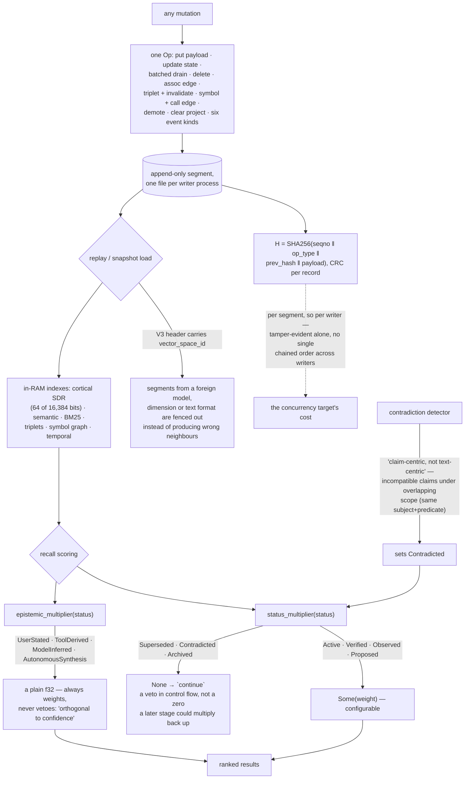

## 1. Executive Summary

chitta-field is an "[o]rganic associative memory substrate for cognitive AI
companions" — MIT, Rust, version 2.7.12, 57,134 lines across ninety-five files
with 287 test functions, a C FFI, and a stated design target of shared NFS
storage, multiple concurrent writers, and sub-millisecond in-process recall. It
is the backing store for a companion daemon that lives in a separate repository.

Three layers: an append-only op log as the durable write path, in-RAM indexes
(semantic, BM25, a cortical sparse index, triplets, a symbol and call graph, a
temporal index), and periodic binary snapshots so startup does not replay the
whole log. The cortical index encodes memories as Sparse Distributed
Representations — 64 active bits out of 16,384 — which makes associative recall a
bitwise overlap rather than an approximate-nearest-neighbour search, and is a
genuinely uncommon choice in this corpus.

**A veto is an `Option`, not a zero.** `status_multiplier` maps the seven memory
statuses to a scoring factor, and three of them do not have one:

```rust
MemoryStatus::Superseded | MemoryStatus::Contradicted | MemoryStatus::Archived => None,
```

The recall loop reads that as `... .is_none() => continue`. The distinction
matters more than it looks: a zero weight is a number, and any later stage that
normalises, re-ranks or blends can multiply it back up. `None` is not a number,
and the compiler makes every caller decide what to do about it. The comment at
the type it guards uses the right word — the status "vetoes the memory (excluded
from results)".

**Where a memory came from weights it and never withholds it.**
`EpistemicStatus` is `UserStated | ToolDerived | ModelInferred |
AutonomousSynthesis`, under a comment that states the design: "[h]ow a memory was
obtained — orthogonal to confidence." Its helper returns a plain `f32`, not an
`Option`, so provenance can rank a model-inferred memory below a user-stated one
and can never silently suppress it. Two axes, two return types, and the type
signatures carry the policy.

**Contradiction is about claims, not text.** The detector's header draws the line
this atlas keeps looking for:

> "Design: claim-centric, not text-centric. Two memories contradict when they
> make incompatible claims under overlapping scope (same subject+predicate), not
> merely when they are semantically similar."

Memory content is parsed into claim atoms and indexed by claim scope. Most
systems here that advertise contradiction detection are running a cosine
threshold, which finds restatements and misses genuine disagreements phrased
differently.

**The write path is a hash-chained op log.** Every mutation is an `Op` — the enum
covers payloads, state deltas, batched maintenance drains, deletes, association
edges, triplets and their invalidation, symbols and call edges, demotion, project
clearing, and six event kinds — appended from sixty-nine call sites in the store.
Records chain as `H = SHA256(seqno || op_type || prev_hash || payload)` with a
CRC each, and the V3 segment header carries a `vector_space_id` so replay can
"fence out segments written in a foreign vector space (model/dim/text-format)".
That last one is worth copying on its own: an embedding model or dimension change
otherwise surfaces as quietly wrong neighbours rather than as an error.

The caveat on that chain is structural and follows from the concurrency target.
There is one segment file per writer process, so the chain is per writer: each
writer's own history is tamper-evident, and the interleaving of several writers
is not a single chained order.

Two marks. What is absent: nothing is consulted at write time against a
contradicted or superseded memory, so the same claim can be written again and is
caught by the next reconcile pass rather than refused at the door; the remaining
state — strength, decay rate, confidence, and the configurable multipliers per
kind and per epistemic status — is continuous, and no ceiling was found on the
multipliers the way a ranking factor needs one; and there is no tenancy, the unit
being a project with its own clear op.

## 2. Mental Model

A **memory** has a status that can veto it and an epistemic status that only
weights it.

A **contradiction** is two claims about the same subject and predicate, not two
similar sentences.

The **log** is the truth; the indexes and snapshots are how you avoid re-reading
it.

A **segment** belongs to one writer.



## 3. Architecture

| File | Role |
| --- | --- |
| `src/store.rs` | The store, recall, and the maintenance passes (12,206 lines) |
| `src/ffi.rs` | The C surface (10,361) |
| `src/log.rs` | Segments, chaining, replay, fencing |
| `src/ops.rs` | The complete mutation vocabulary |
| `src/scoring/mod.rs` | Where a veto is an `Option` |
| `src/contradiction.rs` | Claim atoms and claim scope |
| `src/hdc.rs`, `src/hnsw.rs` | Hyperdimensional codes and the ANN index |
| `src/organ/` | Triplets, spans, epistemic debt |

## 4. Essential Implementation Paths

`src/scoring/mod.rs:163-182` — two helpers, two return types, one policy.

`src/state.rs:58-77` — the two enums, and the comment that keeps them apart.

`src/contradiction.rs:1-10` — claim-centric, in six lines.

`src/log.rs:11-30` — the chain, the CRC, and the lineage stamp.

## 5. Memory Data Model

A payload plus a state: version, chunk hash, deleted flag, strength, decay rate,
confidence, access count and timestamps, pin, tier (`0=L1 hippocampus,
1=L2 cortex, 2=L3 archive`), a retrieval history, an embed-pending flag, and the
two statuses. Pinning is exemption from decay.

An `EpistemicDebtStore` sits under `organ/` with its own `DebtStatus` — the
project tracks what it owes itself epistemically, which is an idea worth a longer
look than this reading gave it.

## 6. Retrieval Mechanics

The cortical SDR index is the hot path — overlap counting on 64-of-16,384 bit
codes, with no learned index to warm up or rebuild — with the semantic, BM25 and
graph indexes beside it, and a scoring decomposition that reports each multiplier
separately so a result can be explained rather than just ranked.

## 7. Write Mechanics

Append an op, update the in-RAM state, snapshot periodically. The maintenance
drain is explicitly documented as preserving each access timestamp and count,
which is the detail that keeps a batch pass from erasing the very signal decay
depends on.

## 8. Agent Integration

A library with a C FFI; the agent-facing daemon is a separate project. That split
is why this report stops at the substrate: what is asked of it, and how often, is
decided elsewhere.

## 9. Reliability, Safety, and Trust

The chain and the CRC are integrity; the vector-space fence is correctness under
model change; the veto is policy. The gap is at the door — nothing refuses a
write that restates a contradicted claim, so the reconcile pass carries the whole
burden of noticing.

## 10. Tests, Evals, and Benchmarks

287 test functions across the source and benches, with snapshot-migration paths
for five prior formats — the kind of code that only exists once a format has
actually shipped and changed. Nothing was built or run for this reading.

## 11. For Your Own Build

Return `None`, not `0.0`, when a state excludes. A zero weight survives
normalisation, re-ranking and blending; an `Option` forces every caller to handle
the exclusion, and the compiler checks that they did.

Keep "how it was obtained" and "whether to believe it" in different types. A
multiplier that can never be a veto is a design decision you can enforce in a
return type instead of a review comment.

Detect contradiction on claims, not similarity. Two sentences about the same
subject and predicate that disagree are what you want; two sentences that sound
alike are what cosine gives you.

And stamp the embedding lineage into the log header. A model or dimension change
without a fence does not fail — it quietly returns the wrong neighbours, which is
worse.

## 12. Open Questions

Whether anything orders the writers. The per-writer segment chain is
tamper-evident within a process; how several writers' histories are reconciled
was not traced.

What the epistemic-debt store does. It has its own status enum under `organ/` and
looks like a deliberate mechanism rather than a scratch table.

Whether the scoring multipliers are bounded. They are configurable per kind and
per epistemic status, and no ceiling was found.

## Appendix: File Index

| Path | What to read it for |
| --- | --- |
| `src/scoring/mod.rs:163-182` | A veto as an `Option`, beside a weight as an `f32` |
| `src/state.rs:58-77` | Two orthogonal enums, and the comment that says so |
| `src/contradiction.rs:1-10` | Why similarity is not disagreement |
| `src/log.rs:11-30` | A hash chain, a CRC, and a lineage fence |
| `src/ops.rs:14-40` | The whole mutation vocabulary in one enum |

## History

**2026-09-16** — [`f3176e587dced64dd3a6a663a40a58e3802b0a10`](https://github.com/genomewalker/chitta-field/commit/f3176e587dced64dd3a6a663a40a58e3802b0a10) — first reading, at a commit dated 16 September 2026. Screened before opening, from a shallow clone: two files scanned, no auto-run surfaces, one build-time execution point, no unpinned surfaces and one dependency file inside the seven-day cooldown. Nothing was installed, built or run.
