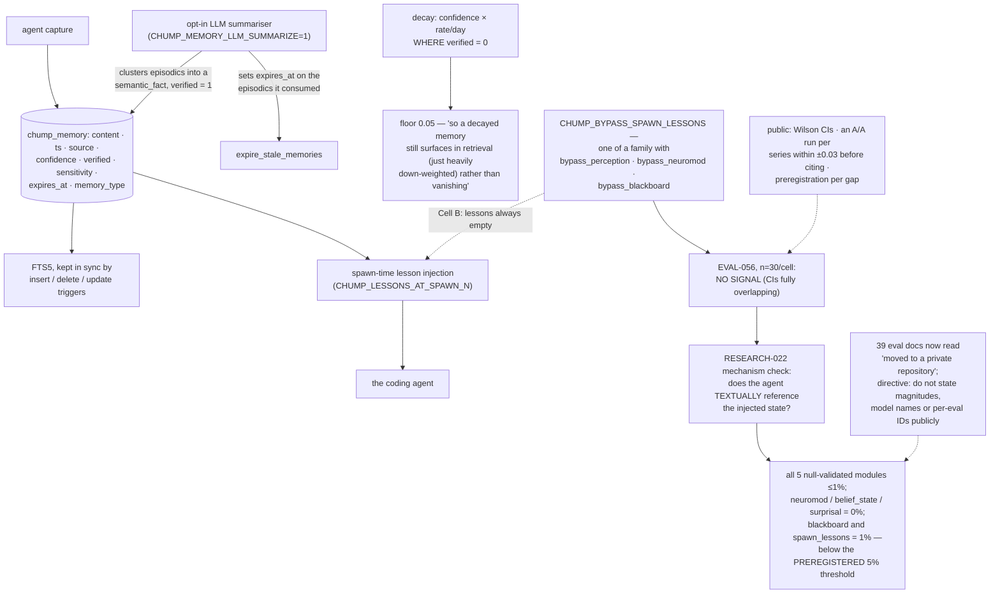

## 1. Executive Summary

Chump is "a multi-agent fleet coordinator + gap registry" — dual-licensed AGPL
and Apache, version 0.2.0, 326,308 lines of Rust with 4,071 test functions,
plus TypeScript and Python surfaces. It brings your own coding agent, runs on
your hardware, and is building toward "the coordination + governance layer that
runs a fleet of swappable coding-agent harnesses, with the human at ring-0."

Its memory is a SQLite table with an FTS5 index, a confidence float, a verified
flag, a sensitivity label and an optional expiry. By the atlas's usual
questions it is unremarkable: no scope key, no validity interval, no
supersession, no mutation record, and a `verified` flag that exempts a row from
confidence decay rather than gating any read. No marks.

The reason this report exists is what the project did next.

Chump shipped an environment flag, `CHUMP_BYPASS_SPAWN_LESSONS`, whose only
purpose is to turn its own memory injection off — "[c]ell A = normal (lessons
injected when `CHUMP_LESSONS_AT_SPAWN_N > 0`), Cell B = bypass active (lessons
always empty regardless of spawn-N)" — and ran a thirty-per-cell binary sweep to
find out whether the memory changed task accuracy.

`EVAL-056-memory-ablation.md` records the answer in its status line:

> "COMPLETE — n=30/cell binary-mode sweep; NO SIGNAL (CIs fully overlapping)"

It is not the only one. The flag belongs to a family —
`chump_bypass_perception()`, `chump_bypass_neuromod()`,
`chump_bypass_blackboard()`, `chump_bypass_spawn_lessons()` — so each cognitive
faculty can be switched off and measured, and `EVAL-054-perception-ablation.md`
and `EVAL-058-executive-function-ablation.md` report nulls too.

Then they checked a second way. `REMOVAL-001-addendum-RESEARCH-022.md` records a
mechanism-evidence analysis asking not whether the modules changed outcomes but
whether the agent ever *mentions* the state they inject:

> "All 5 NULL-validated modules show ≤1% reference rate in agent text output.
> `neuromodulation`/`belief_state`/`surprisal_ema` = 0%; `blackboard` and
> `spawn_lessons` = 1%. All below the preregistered 5% mechanistic-support
> threshold."

Two independent lines of evidence — outcome and mechanism — converging on the
same answer, against a threshold declared before the measurement. And the
addendum is careful about what it is allowed to conclude: "This addendum
integrates the new evidence **without** changing which sub-gaps are filed. It
updates rationales, not actions."

An atlas that spends most of its time establishing whether a mechanism does what
a README says should say plainly that this is the rarest thing in the corpus: a
project that built the off-switch for its own headline feature, measured it,
found nothing, and wrote it down.

The counterweight is equally plain. Thirty-nine of the eighty-three eval documents are now
stubs:

> "**This document has been moved to a private repository.** Per-eval result
> writeups, ablation tables, and judge-specific deltas are tracked in
> `chump-proprietary` (private, need-to-know)."

And the Research Integrity Directive, which is binding on "Claude Code, Cursor,
Chump-orchestrator, and any other automated or human contributor", instructs:
"Do not state magnitudes, model names, or per-eval IDs in public docs, PRs, or
external communications."

The methodology stayed public — Wilson intervals, A/A controls, preregistration,
judge composition rules. The results mostly did not. So a reader can audit how
this project measures and, for most of its corpus, not what it found. The four
surviving nulls are what the migration left behind rather than a representative
sample, and it would be wrong to read them as either the whole story or as
evidence the private half is worse.

## 2. Mental Model

A **memory** is a row with a confidence that decays unless it is verified.

A **verified** memory is an anchor: the summariser's output, exempt from decay,
and the episodics that produced it are expired.

A **bypass flag** is how a faculty is switched off so its absence can be
measured.

A **preregistration** is a file declaring what will count as an effect, written
before the run.

## 3. Architecture

| Area | Role |
| --- | --- |
| `crates/chump-memory-db/src/memory_db.rs` | The table, the triggers, decay, expiry and the summariser |
| `src/memory_graph.rs`, `memory_graph_tool.rs` | The graph beside the FTS index |
| `crates/mcp-servers/chump-mcp-memory` | The MCP surface |
| `src/env_flags.rs` | The four bypass flags |
| `docs/eval/` | 83 documents, 39 of them now private stubs |
| `docs/process/RESEARCH_INTEGRITY.md` | The binding methodology directive |
| `docs/architecture/MEMORY_GRAPH_VS_FTS5.md`, `docs/strategy/AGENT_MEMORY_TIERS.md` | The design arguments |

## 4. Essential Implementation Paths

`docs/eval/EVAL-056-memory-ablation.md` — the flag, the cells, the result.

`docs/eval/REMOVAL-001-addendum-RESEARCH-022.md` — the mechanism evidence, and
the sentence limiting what it changes.

`docs/process/RESEARCH_INTEGRITY.md` — the methodology, and the disclosure
policy.

`crates/chump-memory-db/src/memory_db.rs:276-300` — decay, and the comment
explaining the floor.

## 5. Memory Data Model

One table. `content`, `ts`, `source`, `confidence` defaulting to 1.0,
`verified` defaulting to 0, `sensitivity` defaulting to `'internal'`,
`expires_at`, and `memory_type` defaulting to `'semantic_fact'`, with an FTS5
mirror maintained by all three triggers — insert, delete and update — which is
the complete set and more than many projects manage.

`verified` is the only discrete field that does anything, and what it does is
exempt a row from decay. The doc comment is precise about the rest: "Verified
memories (verified >= 1) are anchors — untouched. Confidence floor is 0.05 so a
decayed memory still surfaces in retrieval (just heavily down-weighted) rather
than vanishing."

That last clause is why no trust mark is claimed. Nothing here withholds a
memory from a reader on the basis of a status; an old unverified memory is
ranked lower and still returned. `confidence` is a continuous weight, which the
atlas does not count, and there is no scope key, validity interval, supersession
pointer or record of mutations.

## 6. Retrieval Mechanics

FTS5 plus a memory graph, with a design document comparing the two. Confidence
weights rather than gates.

## 7. Write Mechanics

Agent capture, plus an opt-in summariser gated on
`CHUMP_MEMORY_LLM_SUMMARIZE=1` — "the opt-in gate MEM-003 calls out" — that
clusters episodic rows, writes a `semantic_fact` with `verified = 1`, and sets
`expires_at` on the sources it consumed so the next expiry pass removes them.

Consolidation that deletes its inputs is a real choice and worth noting: the
episodics are gone, so the semantic fact is the only remaining account of them,
and its provenance is whatever the summariser wrote into `source`.

## 8. Agent Integration

Bring-your-own agent across Claude Code, opencode, Codex CLI, Aider, goose or
manual commits, with an MCP memory server, a desktop app and a web surface. The
fleet coordination and the gap registry are the product; memory is a faculty
inside it, which is the framing under which it was ablated.

## 9. Reliability, Safety, and Trust

The methodology directive is the artifact to read, and it is unusually
demanding. Every eval series must include an A/A run — the same cell against
itself — to measure judge variance, and "A/A delta should be within ±0.03 before
results are cited". Preregistrations live at
`docs/eval/preregistered/<gid>.md` and must declare judge composition in
advance. Wilson confidence intervals rather than raw proportions.

Those are the controls a reader would ask for, and they were in place before the
nulls were found, which is what makes the nulls credible rather than merely
modest.

The disclosure policy is the other half and deserves to be stated without
editorialising. Moving per-eval results, ablation tables and model-tier deltas
into a private companion repository is a legitimate commercial decision. Its
effect on a reader is specific: the public tree now documents a method and four
outcomes, and directs contributors not to state magnitudes publicly. Anyone
citing Chump's cognitive-architecture findings from the public repository is
citing the method and the four survivors.

## 10. Tests, Evals, and Benchmarks

4,071 test functions, an `e2e` tree, and 83 eval documents of which 44 still
carry content.

The evaluation apparatus is the strongest part of this project and the memory is
not. Both statements come from the same source, which is the point.

## 11. For Your Own Build

Build the off-switch. A feature you cannot disable is a feature you cannot
measure, and `CHUMP_BYPASS_SPAWN_LESSONS` existing at all is what made the
question answerable. One environment flag per faculty, read in one place, wired
at the single injection point.

Measure mechanism as well as outcome. "Did accuracy change?" and "does the agent
ever refer to what we injected?" are different questions with different failure
modes, and a feature that fails both has failed in a way a single metric cannot
argue with. Declare the threshold first — the 5% here was preregistered, so the
result could not be re-framed afterwards.

Run an A/A control. Comparing a cell against itself measures the judge, and a
series whose A/A delta exceeds the tolerance has not earned the right to report
an A/B.

And publish the null. Almost every memory system in this corpus asserts that its
memory helps. Exactly one has tested that claim against a bypass and written
down that it did not, and the value of that write-up to everyone else is larger
than the feature would have been.

## 12. Open Questions

What happened to the five null-validated modules. `REMOVAL-001` names a decision
matrix; the matrix is now private, so whether the code was removed, kept or
reworked is not answerable from the public tree.

Whether the memory faculty has been re-evaluated since April 2026. The public
ablation is from `2026-04-20`; the repository is active five months later.

Whether the nulls generalise past this harness. A spawn-time lesson injection
that nothing references may say more about the injection point than about memory
in coding agents, and the write-up does not claim otherwise.

## Appendix: File Index

| Path | What to read it for |
| --- | --- |
| `docs/eval/EVAL-056-memory-ablation.md` | An ablation of the project's own memory, and its null |
| `docs/eval/REMOVAL-001-addendum-RESEARCH-022.md` | Mechanism evidence against a preregistered threshold |
| `docs/process/RESEARCH_INTEGRITY.md` | A/A controls, Wilson intervals, and the disclosure policy |
| `src/env_flags.rs:225-300` | Four faculties, four off-switches |
| `crates/chump-memory-db/src/memory_db.rs:74-96` | The table and its complete trigger set |
| `crates/chump-memory-db/src/memory_db.rs:276-300` | Decay, and the floor that keeps a memory retrievable |

## History

**2026-09-16** — [`631fcaa7f56ef6fa567cbc0ea9859d1b4bec4263`](https://github.com/repairman29/chump/commit/631fcaa7f56ef6fa567cbc0ea9859d1b4bec4263) — first reading, at a commit dated 15 September 2026. Dual-licensed AGPL-3.0 and Apache-2.0. Thirty-nine of the eighty-three documents under `docs/eval/` are stubs recording that the content moved to a private repository; the figures quoted here come from the write-ups that remain public. Screened before opening, from a shallow clone: eighty-eight files scanned, three auto-run surfaces, two build-time execution points, six unpinned surfaces and sixty-nine dependency files inside the seven-day cooldown, with `CLAUDE.md` and `AGENTS.md` read as data. Nothing was installed, built or run.
