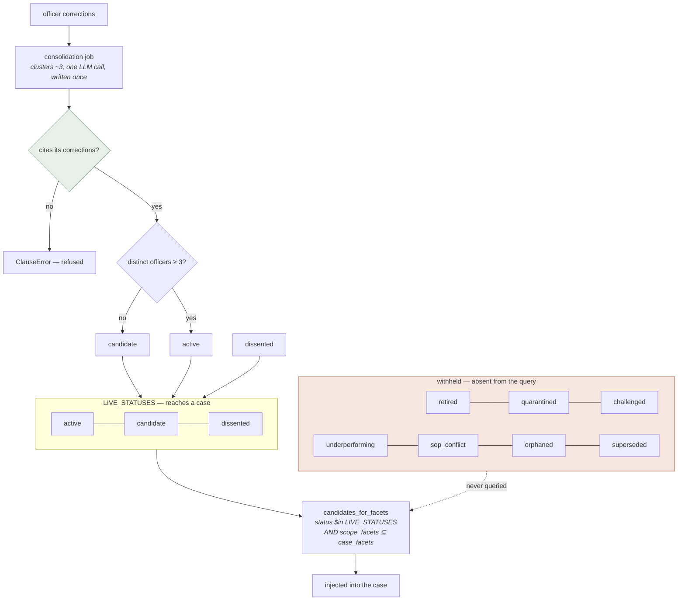

## 1. Executive Summary

Citra is a decision system for regulated back-office work — loan underwriting,
grid maintenance, insurance claims — built around one object: a **clause**, which
is what an experienced officer does, recovered from what they actually did.

The store is a single MongoDB collection and the object is small: one rule in 40
words or fewer, a set of facets it fires within, the corrections that taught it,
the officers who supported it and the officers who acted against it, firing
counters, and a status. Apache-2.0, 92 commits, and 116,582 lines of Python and
TypeScript in `smart-app-service` alone — of which 27,105 are the Python test
suite under `tests/`, leaving 89,477 lines of everything else. 1,688 Python test
functions across the tree.

**The status is the reason to read it.** Ten values exist and three of them fire:

```python
LIVE_STATUSES = ("active", "candidate", "dissented")
ALL_STATUSES  = ("candidate", "active", "dissented", "superseded", "retired",
                 "sop_conflict", "quarantined", "orphaned",
                 "challenged", "underperforming")
```

and `candidates_for_facets` puts that tuple straight into the query —
`"status": {"$in": list(statuses)}` — so a clause the system has stopped
believing is **absent from the result set**, not ranked below the ones it still
believes. This atlas withholds `trust_state` from systems that spend a status as
a score, and the code here states that rule as a defect it had and fixed:

> `PRECISION_FLOOR` *"used to appear in exactly one place — a stats field called
> `needs_refinement` — so a judgement officers had overruled on 4 of every 10
> cases it fired kept firing, merely ranked a little lower. Measured wrongness
> with no consequence is the same failure as knowledge that looks present and is
> not."*

Scope is the second mark and it is derived rather than declared. A clause fires
when `scope_facets ⊆ case_facets`, written as `$setIsSubset` on the read query,
and its facets are the **intersection** of the labels on every correction that
formed it — floored so that corrections only combine when their facets overlap,
which keeps a clause from being narrower than its own evidence agreed on.

Two things are unusual enough to name separately.

**The store refuses an unprovenanced clause.** `create_clause` raises rather than
insert one that cites no corrections, on the stated grounds that *"an
unprovenanced clause is LLM-authored policy, which this store does not accept"* —
a schema constraint enforcing whose knowledge this is.

**Corroboration is a headcount, and the project explains why it is not a
weight.** Promotion from `candidate` to `active` requires distinct officers, and
the comment on the `challenged` status works through the failure that creates —
three juniors sharing a misconception outvote the one person who knows better —
and then refuses the obvious fix: *"Weighting officers by seniority would encode
org hierarchy into an audit trail a regulator reads, and seniority is not
correctness. This is a ROLE-held stop: it does not rank anyone, it parks one
clause and forces a named human to decide."*

The gap is the one this atlas asks about most. Retiring or quarantining a clause
withholds it and keeps its evidence, but nothing is keyed on the **content**. The
consolidation matcher skips every non-live clause deliberately, so the
corrections that taught a quarantined judgement are unclaimed, re-cluster on the
next run, and author the same rule under a new id — which is the intended
behaviour for a clause withdrawn on its results and the wrong one for the case
the quarantine endpoint names in its own docstring.

## 2. Mental Model

```python
# smartapp_clauses — one document per learned judgement
{
  "clause_id": "C-002",
  "tenant_id": ..., "app_slug": ..., "modality": ..., "task_type": ...,
  "text": "DSA-sourced files get employment verified with the employer directly …",
  "text_words": 14,                    # CLAUSE_MAX_WORDS = 40
  "scope_facets": ["sourcing_channel:dsa"],   # the intersection of its evidence
  "match_tokens": [...],               # officer language, kept apart from the paraphrase
  "provenance": [...],                 # correction ids — required, enforced
  "support_officers": [...], "support_count": 3,
  "dissent_officers": [...], "dissent_count": 0,
  "fired_count": 0, "blamed_count": 0, "precision": None,
  "status": "active",                  # one of ten; three of them fire
  "version": 1, "history": [],         # appended on every set_status
  "refines": [], "refined_by": [], "contradicts": [], "superseded_by": None,
}
```



## 3. Architecture

The memory lives in one service. `smart-app-service` is 239 Python and TypeScript
files totalling 116,582 lines, 111 of those files and 27,105 of those lines being
the test suite, and the clause machinery is a small, legible part of it:

- `clause_store.py` (1,314 lines) — the collection, the statuses, the read query,
  the transitions and the ranking.
- `consolidation.py` — clusters corrections, matches them to an existing clause
  or authors a new one, detects contradictions.
- `clause_eval.py` — offline evaluation over the live set.
- `main.py` — the curator endpoints: quarantine, challenge, retire, SOP-conflict
  resolution, each role-gated.

Around it sit a decision API and SDK, an MCP service, a runtime, a UI, a
DuckDB query service, a reranker, and a bank demo — nineteen top-level services
in all, of which one holds the memory.

## 4. Essential Implementation Paths

### The read query (`clause_store.py:599`)

```python
q = {
    **_key(tenant_id, app_slug, modality, task_type),
    "status": {"$in": list(statuses)},          # default LIVE_STATUSES
    "$and": [
        {"$or": [{"scope_facets": {"$size": 0}},
                 {"scope_facets": {"$in": facets}}]},
        {"$expr": {"$setIsSubset": ["$scope_facets", facets]}},
    ],
}
```

Both marks are in one query. The `$in` on facets drives the multikey index and
`$setIsSubset` is the exact containment residual on the small candidate set — the
docstring calls it *"the query a graph database was not needed for"*, which is
the right instinct and rare in this corpus. A globally-scoped clause carries an
empty facet array and always matches.

### Written once, on purpose (`clause_store.py:222`)

The text is authored at birth from roughly three clustered corrections by a
single LLM call and **never rewritten**; later matching corrections touch
provenance, officer lists and counters. The stated reason is that a store which
re-summarises on every correction performs the Nth lossy re-encode of an already
lossy encode, and the earliest lessons degrade first. `match_tokens` keeps the
officers' own vocabulary separate from the LLM paraphrase, so later corrections
match officer language rather than the rendered rule.

### Parking on evidence, not authority (`clause_store.py:539`)

`apply_performance` writes fired and blamed counters from the consolidation job,
holds `precision` at `None` until `MIN_FIRED_FOR_PRECISION` firings so a
one-sample accident cannot condemn a clause, and then acts:

```python
if precision is not None and precision < PRECISION_FLOOR:
    ...
    await set_status(..., status="underperforming", actor="precision-monitor",
                     cause=(f"officers overruled this on {blamed} of {fired} "
                            f"cases it fired (precision {precision:.2f}, floor "
                            f"{PRECISION_FLOOR:.2f}) — parked pending review"))
```

The transition goes through `set_status`, so it lands in `history` with an actor
and a written cause. The comment names what this buys: *"three juniors who agree
can still form a team judgement, but the moment the cases show it is wrong it
stops being applied — nobody has to outrank anyone."*

### The audit trail, and the one writer that bypasses it

`set_status` snapshots the prior state into an append-only array:

```python
"$push": {"history": {
    "version": doc.get("version"), "text": doc.get("text"),
    "scope_facets": doc.get("scope_facets"), "status": doc.get("status"),
    "changed_by": actor or "system", "cause": cause, "at": now}}
```

`clause_store.py` contains no `$pop`, no `$pull` and no `$slice` at all, and it
is the only writer of `smartapp_clauses` inside the service — `main.py` and
`memory_export.py` only read it — so nothing trims `history`; the array only
grows.

The service does cap arrays elsewhere, which is the comparison that gives the
clause store its shape. `entity_links.py:210` pushes each new reference with
`{"$each": [ref], "$slice": -_MAX_REFS}` at `_MAX_REFS = 200` while `$inc`-ing a
separate `ref_count`, and `fraud_checks.py:1495` does the same at `-50`; four
further `$slice` uses (`fraud_checks.py:1003,1542,1568`, `entity_links.py:215`)
are read-time projections that fetch only the last few refs rather than drag a
hot entity's whole history over the wire. Those are evidence pointers on
high-cardinality fingerprint and entity documents, and dropping the oldest is the
right call there. The clause history is the one array the project chose not to
bound.

`record_dissent` is the exception to `set_status`. When an officer's dissent share crosses
`DISSENT_RATIO`, it flips `status` to `dissented` with a bare `$set` and no
history push. So the one transition that stops a clause being presented as a rule
— the one caused by officers disagreeing in the field rather than by a curator or
a monitor — is the one transition the trail does not record. Every other status
writer in the file routes through `set_status`.

Outside the service there is a second bypass, and it is the one the published run
used. `demo-data/tenants/acme-bank/scripts/memory_ab_dsa.py:134` toggles the
seeded clause between arms with
`update_one({...}, {"$set": {"status": status}})` straight onto the collection,
and `memory_ab.py:55` does the same with `update_many` across the whole app. They
are harness scripts rather than product code, but they demonstrate that the
audited path is a convention of `clause_store.py` and not a property of the
store: anything holding the Mongo URI can change a clause's status and leave no
history entry.

### Retirement, and why the same lesson comes back (`consolidation.py:513`)

```python
# Only a clause that is IN SERVICE may absorb new evidence. Skipping
# just retired/superseded meant a parked clause — quarantined by an
# admin, withdrawn on its results, orphaned — kept winning the match and
# swallowing the corrections that should have formed its REPLACEMENT.
if cl.get("status") not in cs.LIVE_STATUSES:
    continue
```

The reasoning is sound for the case it was written for. A clause parked on its
own bad results *should* release its corrections so a corrected replacement can
form; leaving it eligible meant officers went on correcting the same cases and
consolidation went on folding those corrections into a judgement nobody was
using.

The same branch covers `quarantined`, and the quarantine endpoint names its use
case explicitly: *"The tool for 'that officer was dismissed — pull their
teachings pending review'"*. Quarantining the clause withholds it. It does not
touch that officer's corrections, and `create_clause` consults no record of what
has been rejected, so the next consolidation run re-clusters the same evidence
and authors the same rule under a fresh id, `active` or `candidate`, with no edge
back to the clause a curator pulled.

## 5. Memory Data Model

The model is unusually complete for the questions this atlas asks — provenance,
support, dissent, counters, version, history, and a graph of `refines`,
`refined_by`, `contradicts`, `merged_from` and `superseded_by` edges.

What it does not carry:

- **No validity time.** `created_at`, `updated_at` and `last_confirmed_at` are
  all record time. There is nowhere to say a judgement held until the regulation
  changed in March, which for a compliance product is the axis a reader would
  expect. `bitemporal` is withheld on that.
- **No value-level key.** Covered above; the content hash a rejected-value
  tombstone would need is never computed, and nothing on the write path asks
  whether this rule has been thrown out before.
- **Officer identifiers in the store.** `support_officers` and
  `dissent_officers` hold identities, capped at 50, which is what makes a clause
  reviewable — and is also personal data in a system whose selling point is that
  the data never leaves.

## 6. Retrieval Mechanics

No embeddings anywhere in the clause path. Retrieval is subset containment on
facets, then an n-gram specificity backoff as the primary sort, with
`score_clause` breaking ties **within** a specificity tier from support count,
precision against a `PRECISION_PRIOR` of 0.8, and recency on a 180-day half-life.
Uncorroborated individual judgements are capped per case at
`MAX_INDIVIDUAL_JUDGEMENTS`, on the reasoning that a case *"may consult a few
uncorroborated opinions; it must never drown in twelve of them"*.

Deciding that a facet-subset query over a Mongo multikey index is enough — and
writing down that a graph database was considered and not needed — is the kind of
sizing judgement this corpus usually gets wrong in the other direction.

## 7. Write Mechanics

Corrections accumulate; a consolidation job clusters them; roughly three
clustered corrections author one clause through one LLM call. That is the only
model call on the write path. Promotion is a headcount of distinct officers.
Dissent is recorded and never resolved — *"a clause whose dissent share crosses
`DISSENT_RATIO` stops being injected as a rule and becomes a disagreement notice
plus a builder adjudication flag"* — which is a good answer to the case most
stores handle by averaging.

## 8. Agent Integration

Three surfaces over one store: a decision app, a REST API, and an embeddable
recommendation component, plus an MCP service. The curator endpoints under
`/apps/{slug}/memory/clauses/{clause_id}/…` are the governance surface, each
behind `_require_memory_curator` and each recording an actor and a cause.

## 9. Reliability, Safety, and Trust

Strengths:

- A status the read path filters on, with the ranking-versus-filtering
  distinction argued in the code as a bug the project fixed.
- A store that refuses an unprovenanced clause.
- Corroboration as a headcount, with a written argument against seniority
  weighting in an audit trail.
- Automatic parking on measured precision, by a monitor, with a written cause.
- An append-only per-clause history carrying actor and cause.
- A regression test for a privilege-escalation hole in the governance path.
- A published null result. Apache-2.0, nine CI workflows, 1,688 test functions.

Gaps:

- **No rejected-value tombstone**, and retirement actively releases the evidence
  that would re-form the clause.
- **`record_dissent` writes status without a history entry**, so the
  field-driven transition is the one the trail misses.
- **No validity time** in a product sold on regulatory defensibility.
- **The write path's only model call authors the text**, so the paraphrase of a
  rule three officers taught is LLM-written even though the policy it encodes is
  not — mitigated by `match_tokens` and by never rewriting, not removed.
- **Nine days old.** The first commit is 16 August 2026 and the pinned commit is
  25 August; 92 commits carry 116,582 lines in one service, so most of
  this tree arrived in bulk rather than accreting in the open, and the
  lockfiles predate the repository's own first commit.

## 10. Tests, Evals, and Benchmarks

1,688 Python test functions across 166 files, with 85 in `test_clause_store.py`
and 24 in `test_judgement_hierarchy.py` covering the memory directly — 1,137 of
the 1,688 sit in `smart-app-service`. The suites were
not run: eight dependency surfaces sat inside the seven-day freshness cooldown at
this pin, so nothing here was installed or executed.

The negative cases are the good ones. `test_judgement_hierarchy.py:462-486`
creates a clause, asserts it exists with `sop_conflict` status, asserts
`hits == []` under the comment *"suspended judgements never fire as judgements"*,
then resolves the conflict and asserts the clause returns to `active` — the
positive control, the negative assertion and the restore over one fixture.
`test_the_monitor_never_resurrects_a_curated_clause` runs the precision monitor
over a hand-quarantined clause and asserts the hold survives.
`test_dismissing_a_challenge_cannot_lift_an_admin_quarantine` documents a real
laundering path — dismissing a challenge re-derived the tier from
`support_count`, so challenge-then-dismiss promoted **any** parked clause to
active, lifting an admin's hold — and asserts it is refused at the door.

### The run, which recomputes

`docs/Citra-Decision-Memory-Credit-Note.pdf` reports a controlled experiment.
Four judgements were seeded into a live loan triage application; three restate
the written SOP and the fourth, `C-002`, appears in no document: *"DSA-sourced
files get employment verified with the employer directly — the submitted document
set is not enough."* Nineteen DSA-sourced applications were run twice with
identical inputs, the only difference being whether `C-002` was active, plus a
control arm of non-DSA files.

| Reported | |
| --- | --- |
| 14 vs 1 | cases where the judgement was used, memory on versus off |
| 19/19 | correctly targeted on DSA files |
| 0/2 | wrongly fired on control files |
| `p = 0.0005` | sign test over 15 discordant pairs |

The statistic recomputes. A one-sided sign test with 15 discordant pairs and at
most one against gives `(1 + 15) / 2¹⁵ = 0.000488`, which is the reported
`0.0005` and the README's *"about 1 in 2,000"* — `1 / 0.000488 = 2048`. The test
is also the right one for the design: the arms are the same nineteen files run
twice, so a paired test is correct and an unpaired one would overstate the result.
Naming the test beside the number is what makes that checkable, and the PDF names
it where the README gives only the figure.

**Two disclosures are worth more than the result.** The write-up states that not
one final decision changed — fourteen of the nineteen were policy declines either
way on bureau, FOIR or income floor — so *"this run measured a population where a
verdict change was structurally impossible. The money sits in the right-hand
branch of the diagram, which this run did not sample."* And the null result is
published deliberately: the three judgements that restate the SOP *"changed
nothing when retired… They fired, they were cited, they added no value"*, under
the reasoning that *"Any vendor can tell you their system learns. Fewer will tell
you which of their own features measurably does nothing."*

What is not committed is the run itself. There is no JSONL, CSV or fixture in the
tree from which the 14-versus-1 could be regenerated; the artifact is a PDF and
the numbers in it are the authors'. Against that, the README ships a five-step
protocol for reproducing the design on the reader's own data, and states
*"a result that only works in our hands is not a result."*

## 11. For Your Own Build

### Steal

- **Put the status in the query.** One tuple of live values in the `$in` is the
  entire difference between a state and a score, and it costs nothing.
- **Refuse the unprovenanced write.** A store that raises rather than accept a
  rule citing no evidence is one schema constraint away, and it decides whose
  policy the store holds.
- **Derive scope from the intersection of the evidence**, with a floor on how
  much the evidence must agree, instead of asking an author to declare it.
- **Count distinct humans, never weight them.** The written argument against
  seniority tiers in an auditable trail is worth reading before you add a
  reputation score.
- **Act on a measured precision instead of ranking by it**, and route the
  automatic transition through the same audited path a person uses.
- **Keep the teacher's vocabulary apart from the paraphrase**, so later evidence
  matches what people wrote rather than what a model rendered.
- **Publish which of your features did nothing.**

### Avoid

- **Releasing the evidence when you park the rule.** Withdrawing a clause on its
  results and quarantining one taught by a dismissed officer need different
  answers; one branch gives both the same one.
- **A transition that skips the audit path.** One `$set` beside a careful
  `set_status` is how a trail acquires a hole.
- **Record time only**, in anything that has to answer to a regulator.

### Fit

Borrow the status tuple and the subset predicate directly — they are twenty lines
and they carry two capability marks. Borrow the provenance refusal and the
headcount promotion. Do not assume the governance model is settled: it is nine
days of public history, and the most interesting comments in the file describe
holes the project has already had to close.

## 12. Open Questions

- Should quarantining a clause also mark its corrections, so a judgement pulled
  because of who taught it cannot re-form from the same evidence?
- Should `record_dissent` write a history entry like every other transition?
- What is the intended answer when a judgement was right until the regulation
  changed?
- Is the officer identity in `support_officers` subject to the same retention
  rules as the case data?

## Appendix: File Index

- The store: `smart-app-service/clause_store.py`.
- Clustering, matching and authoring: `smart-app-service/consolidation.py`.
- Offline evaluation: `smart-app-service/clause_eval.py`.
- Curator endpoints: `smart-app-service/main.py`.
- Tests: `smart-app-service/tests/test_clause_store.py`,
  `test_judgement_hierarchy.py`, `e2e_clause_memory.py`.
- The reported run: `docs/Citra-Decision-Memory-Credit-Note.pdf`.

## History

**2026-08-31** — [`3106ce5f122d00fe63b8ec9d445da771170fdcd6`](https://github.com/Trustedwear-Tech/citra-decision-system/commit/3106ce5f122d00fe63b8ec9d445da771170fdcd6) — same pin, three corrections. Section 4 and the `audit_log` evidence record asserted *"No `$pop`, no `$pull` on history, no `$slice` anywhere in the service"*. `$slice` appears six times — `fraud_checks.py:1003,1495,1542,1568` and `entity_links.py:210,215` — so the evidence was false as written even though the conclusion was not: none of the six touches the clause `history` array, `clause_store.py` carries no `$pop`, `$pull` or `$slice` at all, and it is the only writer of `smartapp_clauses` in the service. The claim is re-scoped to the store, and the capped `refs` arrays elsewhere (200 per entity link, 50 per fingerprint, with `ref_count` incrementing past the trim) are described as the contrast they are. Verifying that also turned up a second audit bypass beside `record_dissent`: `demo-data/tenants/acme-bank/scripts/memory_ab_dsa.py:134` and `memory_ab.py:55` set `status` directly on the collection, which is how the published A/B run toggled `C-002`. `audit_log` was re-checked in both directions and holds — the mark rests on a named append-only mutation record in the system's own store, which `set_status` and `reconcile_scope_families` provide; no mark moved. Second, section 1 read *"116,582 source lines in `smart-app-service` alone against 27,105 lines of tests there"*: both figures are correct but nested, not disjoint — the 116,582 counts all 239 `.py`/`.ts`/`.tsx` files including the 111 test files, leaving 89,477 lines outside `tests/`. Third, the test-function count was 1,679 across 169 files; an independent recount at this pin gives **1,688 `def test_` across 166 files**, 1,137 of them in `smart-app-service`.

**2026-08-31** — [`3106ce5f122d00fe63b8ec9d445da771170fdcd6`](https://github.com/Trustedwear-Tech/citra-decision-system/commit/3106ce5f122d00fe63b8ec9d445da771170fdcd6) — first reading, at 92 commits and nine days of public history. Screened before reading: no auto-run surface, eight build-time execution surfaces, twenty-seven unpinned surfaces and **eight dependency surfaces inside the seven-day freshness cooldown**, so nothing was installed and nothing was run. Five marks. `tombstone` is withheld on a specific finding rather than an absence: retirement and quarantine withhold a clause and deliberately release its corrections back to the matcher, which is right for a clause withdrawn on its results and wrong for the dismissed-officer case the quarantine endpoint names in its own docstring. `bitemporal` is withheld on record-time-only timestamps. The reported `p = 0.0005` recomputes exactly as a one-sided sign test over 15 discordant pairs, and the paired design the PDF names is the correct one for two arms over the same nineteen files.
