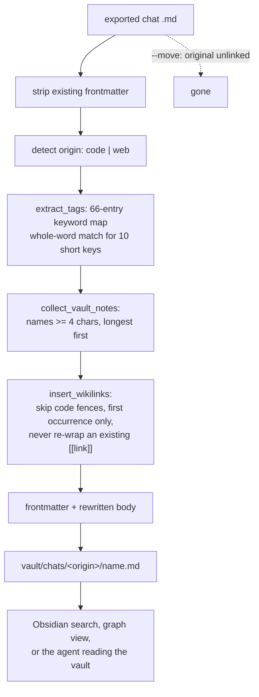

## 1. Executive Summary

This is a **recipe**, not a library: a README of 638 lines, a 387-line Python
importer, and a 46-line shell wrapper. It exists to solve the two problems its
first section names — *"Amnesia between sessions"* and codebase re-reading — by
pairing an Obsidian Zettelkasten vault as durable memory with
[Graphify](../../systems/graphify/), which the atlas already covers, as the code
index.

The part worth reading is `scripts/claude_to_obsidian.py`. It takes exported
Claude Code chats, strips any existing frontmatter, infers an origin (`code` or
`web`), derives tags from a 66-entry keyword map, stamps a created date from the
file's mtime, and files the note under `chats/<origin>/`. Then, before writing, it
**inserts `[[wikilinks]]` to existing vault notes into the body**.

That last step is the mechanism. `collect_vault_notes` gathers every note name in
the vault, filters names shorter than four characters, and sorts longest-first so
a longer name wins over a shorter one it contains. `insert_wikilinks` splits the
body on code fences and inline code, skips those segments, and links the **first
occurrence only** of each name, with a pattern that refuses to wrap a name already
inside `[[…]]`. A new note therefore arrives already connected to the graph, and
nobody had to maintain the connections.

Set beside [Serena](../../systems/serena/), which reads the same problem from the
other end, the contrast is the useful part. Serena *warns* about a bare memory
name that should have been a link, grades the warning by confidence, keeps a
similarity threshold with a test on each side of it, and hard-codes an ignore list
for names that are also English words. This *rewrites*, immediately, with a
four-character length floor as the only guard. A vault containing a note called
`test` or `python` will have the first prose occurrence of that word in every
imported chat turned into a link to it, and the original export is deleted if
`--move` was passed.

Where it is weakest is the claim on the tin. The README's headline is *"71.5x
fewer tokens per session"*, and nothing in this repository produces, measures or
records that figure — the token argument belongs to Graphify and to not
re-reading files, neither of which this code touches.

## 2. Mental Model

A memory here is **a whole conversation, kept verbatim, decorated**. There is no
extraction: nothing summarises the chat, nothing pulls a fact out of it, nothing
decides that one exchange mattered and another did not. What the importer adds is
a frontmatter block and a set of outbound links.

The state machine has two states and one transition:

- **Exported.** A Markdown file sitting in an export directory, produced by
  whatever Claude Code export the user ran.
- **Filed.** The same content, plus frontmatter, plus wikilinks, written under
  `chats/code/` or `chats/web/`. With `--move`, the export is unlinked.

There is no third state. Nothing supersedes, expires, decays or gets rejected.
A note is corrected by editing it in Obsidian and forgotten by deleting the file,
and neither leaves a record. Re-running the importer over the same export
overwrites the destination and re-derives the links from whatever the vault
contains at that moment, so the link set is a function of import order rather
than of content — the same chat imported before and after a note exists gets
different links.

Control is entirely the user's. The model never writes here; it reads a vault
that a person populated by running a script.

The interesting epistemic position is that this design **refuses to decide what
matters**. Everything is kept, and the finding is delegated to Obsidian's search,
its graph view, and the links the importer guessed. That is a coherent bet — it
cannot lose information to a bad extractor — and the cost is that the vault grows
with every session and nothing ever prunes it.



## 3. Architecture

Six files. `scripts/claude_to_obsidian.py` is the whole implementation;
`scripts/sync_claude_obsidian.sh` is a 46-line convenience wrapper; the rest is
the guide in English and Portuguese, a licence, and a scripts README.

There is no service, no database, no index and no dependency beyond the Python
standard library. Persistence is the Obsidian vault, which is a directory of
Markdown.

The two components the guide leans on are *not* in this repository. Obsidian is a
third-party application. Graphify is a separate project with
[its own report here](../../systems/graphify/), and the README's Part 3 is
installation and usage instructions for it. What this repository contributes is
Part 2, the import pipeline.

### Deployment and ergonomics

Python 3 and a text editor. Nothing runs in the background, no key is required,
and everything is offline. First run is one command with `--export-dir` and
`--vault-dir`, and `--dry-run` prints what would happen without touching
anything — which is the right default to offer for a script whose main action is
rewriting files.

The store is as inspectable and repairable as it gets: Markdown a person already
opens daily in a note-taking application. That is the strongest argument for this
whole shape, and it is why the atlas keeps finding it.

## 4. Essential Implementation Paths

**Capture** is external. The guide instructs the user to export chats; the
importer starts from files that already exist.

**Origin detection** — `detect_origin(filepath, content)` decides `code` or `web`
from the path and the content, or is overridden by `--origin`.

**Tagging** — `extract_tags(content)` scans for the 66 keys of `KEYWORD_TAG_MAP`,
which maps several spellings onto one tag (`gpt`, `claude` and `llm` all produce
`llm`; `postgres` and `mongodb` both produce `database`). Ten short keys —
`sql`, `llm`, `gpt`, `rag`, `nlp`, `git`, `api`, `rest`, `aws`, `gcp` — are held
in `SHORT_KEYWORDS` and matched only as whole words, which is a deliberate
false-positive guard on exactly the entries that would otherwise fire inside other
words.

**Link insertion** — `collect_vault_notes(vault_dir)` walks the vault with
`rglob`, skips any path component beginning with a dot, drops names under four
characters, and sorts by descending length. `insert_wikilinks(body, vault_notes)`
splits on ```` ```…``` ```` and `` `…` `` with a capturing regex so the code
segments survive in the output, skips any part starting with a backtick, and for
each note runs a case-insensitive word-boundary search with a `(?<!\[\[)` /
`(?!\]\])` guard, replacing the first hit and recording the name in a `linked` set
so it is not linked twice in the same note.

**Write** — `process_file` composes `build_frontmatter(title, tags, origin,
created)` with the rewritten body, creates `vault/chats/<origin>/`, writes, and
unlinks the source when `--move` was given.

There are no tests. There is no test directory, no CI configuration, and no
assertion anywhere in the tree.

## 5. Memory Data Model

The unit is a Markdown file. Its metadata is the frontmatter the importer builds:

| Field | Source |
| --- | --- |
| `title` | the export file's stem |
| `tags` | keyword map hits over the whole content |
| `origin` | `code` or `web`, inferred or forced |
| `created` | the export file's mtime, formatted `%Y-%m-%d` |

Using mtime for `created` is a small and consequential choice: it is the date the
export was written, not the date the conversation happened, and a bulk export
therefore stamps every note with one day.

Scoping is the origin folder and nothing else. There is no project key, no user,
no session id — a vault is one person's, and the design assumes it.

There is no validity interval, no version, no supersession pointer, no provenance
beyond the origin flag, and no link back to the source transcript once `--move`
has deleted it.

The graph structure is real but implicit: it lives in the `[[…]]` links inside
note bodies, which is where Obsidian looks for it. Nothing in this repository can
enumerate, validate or repair those links after they are written.

## 6. Retrieval Mechanics

**Nothing in this repository retrieves anything.** The vault is found by Obsidian,
by the operating system, or by an agent reading files, and the guide's workflow
section is about how a person drives that.

What the importer contributes to retrieval is done at *write* time, and it is
worth separating into two mechanisms with different reliability.

The **tags** are a coarse, high-precision index: 66 keywords, whole-word matching
for the ten that need it, and a many-to-one mapping so related spellings collapse.
For finding "the chats where I was doing something with embeddings", this works.

The **wikilinks** are the interesting one and the fragile one. Linking the first
occurrence only is a reasonable default — it makes the connection visible in
Obsidian's graph without turning the note into a sea of links — and skipping code
fences avoids the worst false positives, since a note named `docker` should not
link from inside a Dockerfile block. What is missing is any notion of whether the
match *meant* the note. A four-character floor removes `api` and `sql`; it does
not remove `test`, `error`, `pipeline` or `database`, all of which are plausible
note names and common English. Serena's answer to the same problem is a
similarity threshold, a token-Jaccard floor and an explicit ignore list for words
like `core`; this one has a length check.

The failure is silent and permanent. The link is written into the body, the
original is optionally deleted, and there is no report of what was linked.

## 7. Write Mechanics

Writes are **manual, batched and zero-LLM**. A person exports, a person runs the
script, and the script's only intelligence is a substring table. That is the
cheapest capture path in this atlas's vocabulary and it has the property the
[zero-LLM capture](../../patterns/zero-llm-capture/) page describes: nothing is lost
to a bad extractor, and nothing is condensed either.

There is no deduplication. Two exports of the same conversation produce two notes
unless they share a filename, in which case the second overwrites the first.
There is no consolidation pass and no merge.

Conflict handling is absent. `dest.write_text` overwrites unconditionally, so an
edit a person made in Obsidian to an imported note is destroyed by a re-import of
the same export.

Malicious or noisy input is not filtered at all. A chat transcript is written to
disk verbatim, and the only content-aware behaviour in the whole pipeline is the
code-fence skip.

### Operational cost

Zero on both paths, in the sense the rest of this atlas measures: no model call
is made by anything in this repository, at write or at read.

The lag before a memory is retrievable is however long it takes the user to
remember to run the script — this is a manual sync, and the guide's workflow
section is the only thing that makes it periodic.

Nothing runs in the background and no pass rewrites the store, with one
qualification: because links are derived from the vault's current contents at
import time, the *effective* link graph is only as good as the order things were
imported in, and the only way to re-derive it is to re-import, which overwrites
edits.

On the read side there is no injection to bound. Whatever the agent opens, it
opens; the vault is a directory and the cost is whatever the model chooses to read
— which is the same arrangement [Ollama](../../systems/ollama/) and
[Serena](../../systems/serena/) arrive at, without the index those two put in the
prompt.

## 8. Agent Integration

There is no programmatic integration. No MCP server, no hook, no plugin, no tool.
The agent sees the vault because the vault is on disk in a place the guide told
the user to put it, and Part 4 of the README is a workflow a person follows.

That is worth stating plainly rather than treating as a defect, because it is what
"recipe" means here and it is a genuine position: the composition is Obsidian for
memory, Graphify for code, Claude Code for work, and a person for glue. Nothing
has to agree on an interface.

The consequence is that every guarantee in this design is a habit. If the user
stops running the importer, memory stops accumulating, and nothing notices.

## 9. Reliability, Safety, and Trust

The provenance model is one field: `origin: code | web`. Nothing records which
export produced a note once `--move` has removed the source, and nothing records
what the importer changed.

`--dry-run` is the safety mechanism, and it is the right one to have. Against
that, the default behaviour of a tool whose main action is rewriting file bodies
is worth naming precisely: it edits the content it is filing, and the edit is not
reported, not reversible, and not idempotent with respect to vault state.

Prompt-injected false memories are not a live risk here in the usual sense —
nothing extracts claims — but the vault is instructions-adjacent: an agent pointed
at a Zettelkasten will read whatever is in it, and every word of every past
conversation is in it verbatim.

Multi-tenancy, auth, races and replication are all out of frame. This is one
person's laptop.

The gap that matters most is the same one the whole recipe shape has: **there is
no correction path other than editing the file, and no record that anything was
corrected.** For a store of verbatim transcripts that is defensible — a transcript
is a fact about what was said, not a claim about the world — but the guide's
framing is *persistent memory*, and a reader adopting it for decisions rather than
for recall will find nothing that can mark a decision superseded.

## 10. Tests, Evals, and Benchmarks

There are none. No test file, no CI workflow, no assertion in the tree.

The README's *Real Results* section is where the claims live, and the headline
figure — **71.5x fewer tokens per session** — is not produced by anything in this
repository. The token argument is Graphify's (a code index means the agent does
not re-read the tree) plus the general claim that persistent notes avoid
re-explaining a project. Neither is measured here, no method is stated, and no
run is committed.

This is the ordinary shape of a practitioner recipe and it should be read as one.
The value on offer is the arrangement, not the number.

What I would want before trusting the importer: a case asserting that a note name
appearing inside a fenced code block is not linked, one asserting that
`[[already-linked]]` is not double-wrapped, and one asserting that a longer name
wins over a shorter one it contains. All three behaviours are implemented and none
is pinned.

I ran nothing. Every claim here comes from reading the tree at
`c5f2e0b5465b66699f4ffcb108afee70d2cdf87b`, the only commit in the repository's
recent history and dated 1 June 2026.

## 11. For Your Own Build

### Steal

- **Link on the way in.** If your memory is a set of documents, deriving links at
  write time from the names already present costs one pass over the store and
  gives you a navigable graph nobody has to curate. Longest-name-first, first
  occurrence only, and never re-wrap an existing link are the three details that
  make it usable rather than noisy.
- **Skip code when scanning prose.** Splitting on fences with a *capturing* regex
  so the code segments survive into the output is a three-line habit, and it
  removes the largest single source of false matches in any technical corpus.
- **Give short keywords a different matching rule.** `SHORT_KEYWORDS` holds the
  ten riskiest entries in the keyword map, matched whole-word while the rest match
  as substrings. Splitting a keyword table by how dangerous each entry is costs
  nothing and is rarer than it should be.
- **Ship `--dry-run` for anything that rewrites content.** Especially when the
  same tool also offers to delete the original.

### Avoid

- **Do not rewrite a document body without recording what you changed.** A link
  insertion is an edit. If the output is the only artifact, the user cannot tell a
  good link from a bad one without re-reading everything, and cannot undo either.
- **Do not use a length floor as your only false-positive guard.** Four characters
  removes `api` and keeps `test`. The names most likely to collide with prose are
  exactly the generic ones a person is likely to use as note titles.
- **Do not derive durable structure from mutable ambient state.** Links here
  depend on which notes existed at import time, so the graph is a function of
  ordering, and the only way to re-derive it destroys manual edits. Either make the
  derivation re-runnable and non-destructive, or store the links separately from
  the body.
- **Do not put a number in the headline that your repository cannot produce.**

### Fit

Take this if you already live in Obsidian and want your Claude Code history to
land there tagged and connected, and are content for that to be a thing you run
rather than a thing that happens. It is 387 lines you can read in one sitting and
change to fit your own stack, which is the honest strength of the recipe genre.

Walk away if you want memory to be *selective*. Everything is kept, verbatim, and
the vault grows with every session — the design has no opinion about what matters
and no mechanism that could acquire one. Walk away too if more than one person is
involved, or if you need the agent to write memory rather than read it: neither is
in scope here, and neither has a seam to add.

## 12. Open Questions

- What does the Claude Code export step actually produce at the versions the guide
  targets? `detect_origin` reads the path and content to classify, which implies a
  shape the repository does not document.
- Does the Obsidian vault the guide describes carry any structure beyond
  `chats/<origin>/`? The README's Zettelkasten section was read as prose; whether
  the recommended folder scheme interacts with the importer's destination was not
  established.
- How large does the wikilink pass get on a mature vault? `collect_vault_notes`
  is an `rglob` and `insert_wikilinks` is a nested loop over every note name per
  body segment, which is fine for hundreds and untested for thousands.

## Appendix: File Index

**Write path and link insertion**
`scripts/claude_to_obsidian.py`

**Operator surface**
`scripts/sync_claude_obsidian.sh` · `scripts/README.md`

**Design record and claims**
`README.md` · `README.pt-BR.md`

## History

**2026-08-09** — [`c5f2e0b5465b66699f4ffcb108afee70d2cdf87b`](https://github.com/lucasrosati/claude-code-memory-setup/commit/c5f2e0b5465b66699f4ffcb108afee70d2cdf87b) —
first reading, from the
[awesome-ai-tokenomics triage](https://github.com/QuesmaOrg/awesome-ai-tokenomics).
Screened before reading: no auto-run surfaces, no dependency manifests at all —
the importer is standard library only — and therefore no cooldown or pinning
findings. Nothing was executed.
