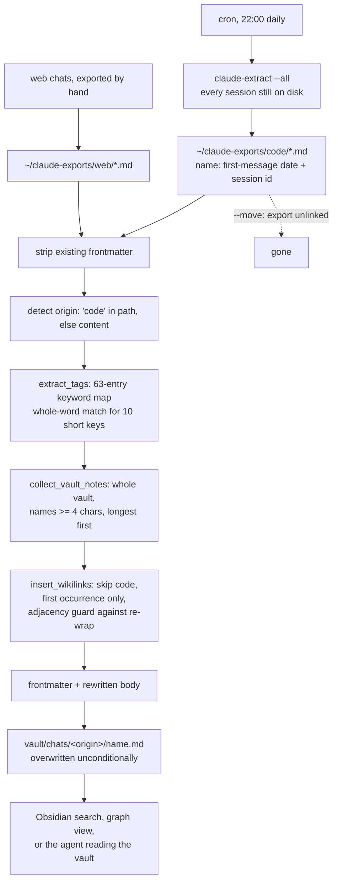

## 1. Executive Summary

This is a **recipe**, not a library: a guide that pairs an Obsidian Zettelkasten
vault, as durable memory, with [Graphify](../../systems/graphify/) as the code
index, plus three scripts that move Claude Code sessions into the vault. It
answers the two problems its first section names — *"Amnesia between sessions"*
and codebase re-reading. The memory half is an importer run by a nightly cron
job, a `SessionEnd` hook, and `/save` and `/resume` written as prose in the
vault's `CLAUDE.md`.

The mechanism is in `scripts/claude_to_obsidian.py`. The guide's wrapper runs
`claude-extract --all` to export every Claude Code session as Markdown, then runs
the importer with `--move`, and the README schedules the pair for 22:00 daily with
a crontab line (`scripts/sync_claude_obsidian.sh:28-43`, `README.md:280-281`).
The importer strips any existing frontmatter, infers an origin (`code` or `web`),
derives tags from a 63-entry keyword map, stamps a created date from the file's
mtime, and files the note under `chats/<origin>/`. Before writing, it **inserts
`[[wikilinks]]` to existing vault notes into the body**.

That last step is the mechanism. `collect_vault_notes` gathers every note name in
the vault, drops names shorter than four characters, and sorts longest-first, so a
longer name takes the first occurrence ahead of a shorter one it contains.
`insert_wikilinks` splits the body on code fences and inline code, skips those
segments, and links the **first occurrence only** of each name. Its guard against
re-wrapping looks only at the characters either side of a match, so a shorter name
in the middle of a link inserted moments earlier is wrapped again:
`supabase-auth-flow` then `auth` gives `[[supabase-[[auth]]-flow]]`
(`scripts/claude_to_obsidian.py:230`). A new note arrives connected to the graph,
and nobody maintains the connections.

Set beside [Serena](../../systems/serena/), which reads the same problem from the
other end, the contrast is the useful part. Serena *warns* about a bare memory
name that should have been a link, grades the warning by confidence, keeps a
similarity threshold with a test on each side of it, and hard-codes an ignore list
for names that are also English words. This *rewrites*, immediately, with a
four-character length floor as the only guard. A vault containing a note called
`test` or `python` will have the first prose occurrence of that word in every
imported chat turned into a link to it, and the wrapper always passes `--move`, so
the export it came from is deleted.

The schedule sets the cost of that rewrite. `claude-extract --all` exports every
session still in Claude Code's transcript directory, under a filename fixed by the
first message's date and the session id, so each nightly run re-imports every such
conversation onto the same `chats/code/` path. The write overwrites
unconditionally (`scripts/claude_to_obsidian.py:288`): an edit made in Obsidian to
an imported chat lasts until the next 22:00 run.

Where it is weakest is the claim on the tin. The README's tagline is *"71.5x
fewer tokens per session"* and its *Real Results* table gives a **499x** token
reduction per query. Nothing in this repository produces, measures or records
either figure — the token argument belongs to Graphify and to not re-reading
files, neither of which this code touches.

## 2. Mental Model

A chat note is **a whole conversation, kept verbatim, decorated**. The importer
extracts nothing: it does not summarise the chat, pull a fact out of it, or decide
that one exchange mattered and another did not. What it adds is a frontmatter
block and a set of outbound links.

The importer's state machine has two states and one transition:

- **Exported.** A Markdown file in `~/claude-exports/code/`, written there by
  `claude-extract --all`, or in `~/claude-exports/web/`, dropped there by hand
  from a browser extension.
- **Filed.** The same content, plus frontmatter, plus wikilinks, written under
  `chats/code/` or `chats/web/`. The wrapper passes `--move`, so the export is
  unlinked.

There is no third state. Nothing supersedes, expires, decays or gets rejected. A
note is corrected by editing it in Obsidian and forgotten by deleting the file,
and neither leaves a record. Every import overwrites the destination and
re-derives the links from whatever the vault contains at that moment, so the link
set is a function of the vault at the last import rather than of the note's
content. For Claude Code chats the last import is the most recent night the
transcript was still on disk.

Session logs have two other writers. The guide's `CLAUDE.md` template defines
`/save` as an instruction to the model — write `logs/YYYY-MM-DD-description.md`
with what was done, the decisions made and the pending items, add wikilinks,
commit and push — and `/resume` as the read: *"Read the 3 most recent session logs
in logs/"* and the project's `architecture/decisions.md` (`README.md:146-159`).
The `SessionEnd` hook in `scripts/session_autosave.py` is the third writer, and
the only session-log writer in code.

The importer **refuses to decide what matters**. Everything is kept, and the
finding is delegated to Obsidian's search, its graph view, and the links the
importer guessed. That bet cannot lose information to a bad extractor, and the
cost is that the vault grows with every session and nothing prunes it. The one
writer that does select is the model on `/save`, which states decisions and
pending items; nothing in code checks what it wrote.


```mermaid
%% caption: a nightly cron job exports every Claude Code session, then the importer tags each file from a fixed keyword map, wikilinks it against vault note names outside code fences, and overwrites its vault copy
flowchart TD
    C["cron, 22:00 daily"] --> X["claude-extract --all<br/>every session still on disk"]
    X --> E["~/claude-exports/code/*.md<br/>name: first-message date + session id"]
    B["web chats, exported by hand"] --> E2["~/claude-exports/web/*.md"]
    E --> S["strip existing frontmatter"]
    E2 --> S
    S --> O["detect origin: 'code' in path, else content"]
    O --> T["extract_tags: 63-entry keyword map<br/>whole-word match for 10 short keys"]
    T --> V["collect_vault_notes: whole vault,<br/>names >= 4 chars, longest first"]
    V --> L["insert_wikilinks: skip code,<br/>first occurrence only,<br/>adjacency guard against re-wrap"]
    L --> F["frontmatter + rewritten body"]
    F --> W["vault/chats/&lt;origin&gt;/name.md<br/>overwritten unconditionally"]
    E -.->|"--move: export unlinked"| G["gone"]
    W --> R["Obsidian search, graph view,<br/>or the agent reading the vault"]
```

## 3. Architecture

Fifteen tracked files. Three carry the implementation: the importer
`scripts/claude_to_obsidian.py`, the hook `scripts/session_autosave.py`, and
`scripts/sync_claude_obsidian.sh`, a wrapper that runs `claude-extract` and then
the importer. The rest are the guide in English and Portuguese, a `CHANGELOG.md`,
a licence, a scripts README, and a CI workflow with two helper scripts that check
the READMEs.

There is no service, no database and no index. Both Python scripts use only the
standard library. The wrapper needs `claude-conversation-extractor`, which the
guide installs with an unversioned `pip install`.

The two components the guide leans on are *not* in this repository. Obsidian is a
third-party application. Graphify is a separate project with
[its own report](../../systems/graphify/), and the README's Part 3 is
installation and usage instructions for it. What this repository contributes is
Part 2, the import pipeline, and Part 5, the hook.

### Deployment and ergonomics

Python 3, cron and a text editor. The wrapper runs from the crontab line the
README gives, the hook runs on session close, no key is required and everything
is offline. `--dry-run` prints what would happen without touching anything, which
is the right option for a script whose main action is rewriting files; the
wrapper does not pass it.

The store is as inspectable and repairable as it gets: Markdown a person already
opens daily in a note-taking application. That is the strongest argument for this
whole shape.

## 4. Essential Implementation Paths

**Capture** is `claude-extract --all --output "$EXPORT_DIR/code"` for Claude Code
sessions, skipped with a log line when the command is missing
(`scripts/sync_claude_obsidian.sh:28-35`). Web chats are exported by hand with a
browser extension into `~/claude-exports/web/`.

**Origin detection** — `detect_origin(filepath, content)` returns `code` for any
path containing `code`, which every file under the wrapper's `code/` export folder
does, and otherwise for content that hits two of four terminal indicators; an
`--origin` flag overrides both (`scripts/claude_to_obsidian.py:124-135`).

**Tagging** — `extract_tags(content)` scans for the 63 keys of `KEYWORD_TAG_MAP`,
which fold onto 51 tags (`gpt`, `claude` and `llm` all produce `llm`; `postgres`
and `mongodb` both produce `database`). Ten short keys — `sql`, `llm`, `gpt`,
`rag`, `nlp`, `git`, `api`, `rest`, `aws`, `gcp` — are held in `SHORT_KEYWORDS` and
matched only as whole words. The rest match as substrings, including keys that
fire inside other words: `rust` in *trust*, `test` in *latest*, `cron` in
*acronym*, and `go ` with its trailing space in *ago* (`:33-117`).

**Link insertion** — `collect_vault_notes(vault_dir)` walks the vault with
`rglob`, skips any path component beginning with a dot, drops names under four
characters, and sorts by descending length. `insert_wikilinks(body, vault_notes)`
splits on ```` ```…``` ```` and `` `…` `` with a capturing regex so the code
segments survive in the output, and skips any part starting with a backtick. For
each note it runs a case-insensitive word-boundary search guarded by `(?<!\[\[)`
and `(?!\]\])`, replaces the first hit with `[[<note>]]` in the note's own casing,
and records the name in a `linked` set so it is not linked twice (`:198-241`).
The guard tests adjacency, not containment, which is how a name in the middle of
a longer link is wrapped a second time.

**Write** — `process_file` composes `build_frontmatter(title, tags, origin,
created)` with the rewritten body, creates `vault/chats/<origin>/`, writes with
`dest.write_text`, and unlinks the source when `--move` was given (`:244-293`).

There are no tests. A CI workflow checks Python syntax, ruff's error-only rules,
shellcheck, links, heading parity between the English and Portuguese READMEs and
the JSON examples in the guide; nothing asserts what any script does.

## 5. Memory Data Model

The unit is a Markdown file. Its metadata is the frontmatter the importer builds
(`scripts/claude_to_obsidian.py:172-195`):

| Field | Source |
| --- | --- |
| `title` | the export file's stem |
| `tags` | `chat-import`, then keyword map hits over the whole content |
| `source` | the constant `claude` |
| `origin` | `code` or `web`, inferred or forced |
| `created` | the export file's mtime, formatted `%Y-%m-%d` |
| `processed` | the import time, to the minute |
| `status` | the constant `imported` |
| `type` | the constant `chat` |

Using mtime for `created` is a small and consequential choice. The extractor puts
the conversation's first-message date in the filename, and the importer ignores
it: `created` is the night the export was written, so every Claude Code chat
re-imported by a nightly run is re-stamped with that night's date.

Scoping is the origin folder and nothing else. There is no project key, no user,
no session id — a vault is one person's, and the design assumes it.

There is no validity interval, no version and no supersession pointer. The two
dates are both record times — when the export was written and when it was
imported — and no code reads either. Provenance is the origin flag and the
constant `source: claude`; no field names the export file, so nothing links back
to the transcript once `--move` has deleted it.

The graph structure is real but implicit: it lives in the `[[…]]` links inside
note bodies, which is where Obsidian looks for it. Nothing in this repository can
enumerate, validate or repair those links after they are written.

## 6. Retrieval Mechanics

**Nothing in this repository retrieves anything.** The vault is found by Obsidian,
by the operating system, or by an agent reading files, and the guide's workflow
section is about how a person drives that.

What the importer contributes to retrieval happens at *write* time, as two
mechanisms with different reliability.

The **tags** are a coarse index: 63 keywords, whole-word matching for the ten in
`SHORT_KEYWORDS`, and a many-to-one mapping so related spellings collapse. For
finding "the chats where I was doing something with embeddings", this works. Its
precision is lower than the short-key guard suggests, because the substring keys
it leaves out include `rust`, `test` and `go `.

The **wikilinks** are the interesting one and the fragile one. Linking the first
occurrence only makes the connection visible in Obsidian's graph without turning
the note into a sea of links, and skipping code fences avoids the worst false
positives, since a note named `docker` should not link from inside a Dockerfile
block. What is missing is any notion of whether the match *meant* the note. A
four-character floor removes `api` and `sql`; it does not remove `test`, `error`,
`pipeline` or `database`, all plausible note names and common English. Serena's
answer to the same problem is a similarity threshold, a token-Jaccard floor and an
explicit ignore list for words like `core`; this one has a length check.

The link targets are every note in the vault. `collect_vault_notes` skips only
dot-prefixed paths, so in the layout the guide recommends the candidates include
Graphify's generated notes — one per function or module — and every imported chat
and session log. The word boundary also matches inside a URL outside backticks: a
note named `docker` turns `https://hub.docker.com/` into
`https://hub.[[docker]].com/`.

The failure is silent. The link is written into the body, the export is deleted,
and there is no report of what was linked: the importer prints one line per file
to stdout, and the wrapper sends only stderr to its log.

## 7. Write Mechanics

Imports are **scheduled, batched and zero-LLM**. The crontab line the README
gives runs the wrapper at 22:00, which exports every Claude Code session and
imports it with `--move`; the importer's only intelligence is a substring table.
That is the [zero-LLM capture](../../patterns/zero-llm-capture/) shape: nothing is
lost to a bad extractor, and nothing is condensed either. The hook is zero-LLM as
well. `/save` is the exception: the model writes it.

The overwrite rests on the extractor's naming. At
[`a12b72e3be2e23d4ed1956fd67a09472b311e783`](https://github.com/ZeroSumQuant/claude-conversation-extractor/commit/a12b72e3be2e23d4ed1956fd67a09472b311e783),
the head of claude-conversation-extractor's `main` on 16 September 2025,
`--all` exports every JSONL session under `~/.claude/projects`, and
`save_as_markdown` names each file `claude-conversation-<date>-<id8>.md` from the
first message's date and the session id's first eight characters
(`src/extract_claude_logs.py:55-65`, `:309`, `:954-963`). The guide pins no
version, so a different release may name files differently.

There is no deduplication by content. With that naming, the same conversation
lands on the same path each night and replaces itself; two web exports of one chat
produce two notes unless they share a filename.

Conflict handling is absent. `dest.write_text` overwrites unconditionally, so an
edit a person made in Obsidian to an imported Claude Code chat is destroyed by the
next nightly run, for as long as the transcript stays where `claude-extract` finds
it.

Malicious or noisy input is not filtered at all. A chat transcript is written to
disk verbatim, and the only content-aware behaviour in the whole pipeline is the
code-fence skip.

### Operational cost

Zero model calls on both paths: nothing in this repository calls a model, at
write or at read. `/save` spends the user's own session.

The lag before an imported Claude Code chat is retrievable is up to a day under
the cron schedule; web chats wait for a person to export them. Session logs have
no lag: the hook writes when the session closes, and `/save` writes when it is
typed.

The importer is the pass that rewrites the store. Each night it re-imports every
exported Claude Code session and re-derives its links from the vault as it stands
at 22:00, so the link graph for those notes is recomputed daily, and the price is
the overwrite of any edit. Web chats are linked once, against whatever existed
when they were imported.

On the read side there is no injection to bound. Whatever the agent opens, it
opens; the vault is a directory and the cost is whatever the model chooses to read
— which is the same arrangement [Ollama](../../systems/ollama/)'s since-removed agent and
[Serena](../../systems/serena/) arrive at, without the index those two put in the
prompt.

## 8. Agent Integration

There is one programmatic integration with Claude Code, a `SessionEnd` hook, and
no MCP server, plugin or tool; the cron job runs outside the agent. The agent sees
the vault because the vault is on disk in a place the guide told the user to put
it. `/save` and `/resume` are prompt instructions in `CLAUDE.md`, and Part 4 of the
README is a workflow a person follows. `CHANGELOG.md` says 1.0.0 documents
implementing both under `~/.claude/` as real slash commands, and neither README
contains that documentation at this commit.

The hook reads the transcript JSONL Claude Code hands it and, with no model call,
writes a note holding the first user prompt (up to 300 characters), up to twenty
edited file paths, the first line of up to ten Bash commands (each cut at 120
characters), the user-turn count, and the start and end times. Sessions with fewer
than two user messages are skipped. The note lands in `<vault>/<cwd
basename>/logs/` when `<vault>/<cwd basename>/` exists and in `<vault>/logs/`
otherwise, named `YYYY-MM-DD-HHMM-auto-session.md`, tagged `auto-log`, with
`status: imported` (`scripts/session_autosave.py:148-208`). Each write and each
failure is appended as a line to `~/scripts/autosave.log`, and failures are
swallowed.

**The safety net lands on the read path it was meant to back up.** The guide's
layout has a global `logs/` and a `logs/` per project; `/save` and `/resume` name a
bare `logs/`. The hook writes into the project's folder whenever the vault folder
matches the repository's name — which the README tells you to arrange with a
symlink — so it shares a folder with `/save`. It fires on every non-trivial
session close, including a session whose rich log `/save` wrote minutes earlier.
After two sessions that each ended with `/save`, the three newest logs by write
time are two auto-logs and one `/save` log, and the decisions and pending items
`/resume` exists to recover are the part pushed out. The guide separates the two
only as an Obsidian search filter, `-tag:auto-log`, which a person applies; the
`/resume` instruction does not.

This is what "recipe" means here, and it is a position rather than a defect: the
composition is Obsidian for memory, Graphify for code, Claude Code for work, cron
for transport, and a person for glue. Nothing has to agree on an interface.

The consequence is that the one guarantee that matters is a habit. If the user
stops typing `/save`, decisions stop being recorded; the cron job keeps filing
transcripts and the hook keeps writing its thin log, and neither records a
decision.

## 9. Reliability, Safety, and Trust

The provenance model is the origin flag and a constant `source: claude`. Nothing
records which export produced a note once `--move` has removed the source, and
nothing records what the importer changed.

`--dry-run` is the safety mechanism, and it is the right one to have; the
scheduled path never passes it. Against that, a tool whose main action is
rewriting file bodies edits the content it is filing, and the edit is not
reported, not reversible, and not idempotent with respect to vault state.

The importer and the hook extract no claims, so an instruction injected into a
transcript is kept as text rather than promoted into a fact. `/save` is the path
that condenses a session into stated decisions, and `/resume` reads those back:
whatever the model was persuaded of during a session can be written there as a
decision, with nothing checking it. An agent pointed at the vault also reads every
word of every past conversation, verbatim.

The hook adds a narrower exposure of its own. It copies the opening prompt and
the first line of Bash commands into a Markdown file with no redaction, so a token
exported on a command line or pasted into a first message lands in the vault as
plain text. Where it goes from there depends on how the vault is synced: the guide
never makes the vault a git repository, and `/save`'s commit step says only
*"if in a repository"*. Routing by the working directory's basename means two
repositories with the same folder name share one `logs/` folder, and the README's
advice for a mismatch is a symlink inside the vault.

Multi-tenancy, auth, races and replication are all out of frame. This is one
person's laptop.

**No capability mark is earned.** `status: imported` is a constant written by the
importer and the hook and read by no code, so it is not `trust_state`; the vault
template's `active` and `draft` values are prose. `created` and `processed` are
both record times, not a validity interval. The per-project `logs/` folders are a
physical partition with no key applied on a read path, which the `scope_enforced`
definition excludes. `~/scripts/autosave.log` is append-only, but it is a debug
log outside the vault that records one writer's creations; the importer's
overwrites and deletions reach no log, so it is not `audit_log`. Editing in
Obsidian is authoring after the write, not `human_review`, and there are no
tests, so no `negative_eval`.

The gap that matters most is the same one the whole recipe shape has: **there is
no correction path other than editing the file, and no record that anything was
corrected** — and for imported Claude Code chats the nightly run undoes the edit.
For a store of verbatim transcripts that is defensible, since a transcript is a
fact about what was said, but the guide's framing is *persistent memory*, and a
reader adopting it for decisions will find nothing that can mark a decision
superseded.

## 10. Tests, Evals, and Benchmarks

There are none. The CI workflow is lint and documentation checks; there is no test
file and no assertion about behaviour.

The claims live in the README. The tagline at `README.md:3` is **71.5x fewer
tokens per session**, attributed to Graphify; the *Real Results* table at
`README.md:639-655` gives a **499x** token reduction per query, 137 imported
chats and 780-plus vault notes on a React and Supabase project that is not in the
repository. The token argument is Graphify's (a code index means the agent does
not re-read the tree) plus the general claim that persistent notes avoid
re-explaining a project. Neither is measured here, no method is stated, and no run
is committed.

This is the ordinary shape of a practitioner recipe and it should be read as one.
The value on offer is the arrangement, not the numbers.

What I would want before trusting the importer: a case asserting that a note name
inside a fenced code block is not linked, one asserting that a longer name wins
over a shorter one it contains, and one asserting that a shorter name inside a
link already inserted is left alone. The first two behaviours are implemented and
unpinned; the third fails at this commit.

I installed, built and ran nothing from this repository. To check the re-wrap
guard I copied the split and search regexes of `insert_wikilinks` into a scratch
Python snippet and ran it on three strings: notes `supabase-auth-flow` and `auth`
over the text *supabase-auth-flow* gave `[[supabase-[[auth]]-flow]]`, a note named
`docker` rewrote a URL, and a note named `python` replaced *Python* with
`[[python]]`. Every other claim comes from reading the tree at
`a89c275e139d25deb01529e6c7f1954844164ff7`, dated 11 September 2026, and the
extractor's source at the commit cited in section 7.

## 11. For Your Own Build

### Steal

- **Link on the way in.** If your memory is a set of documents, deriving links at
  write time from the names already present costs one pass over the store and
  gives you a navigable graph nobody has to curate. Longest-name-first and first
  occurrence only are the details that make it usable rather than noisy; guard
  against re-wrapping by containment, not by the characters beside the match.
- **Skip code when scanning prose.** Splitting on fences with a *capturing* regex
  so the code segments survive into the output is a three-line habit, and it
  removes the largest single source of false matches in any technical corpus.
- **Give short keywords a different matching rule.** `SHORT_KEYWORDS` holds ten
  short entries matched whole-word while the rest match as substrings. The split
  is the idea; this table leaves `rust`, `test`, `cron` and `go ` on the substring
  side, so derive the whole-word set from the table rather than listing it by hand.
- **Ship `--dry-run` for anything that rewrites content.** Especially when the
  same tool also offers to delete the original.

### Avoid

- **Do not rewrite a document body without recording what you changed.** A link
  insertion is an edit. If the output is the only artifact, the user cannot tell a
  good link from a bad one without re-reading everything, and cannot undo either.
- **Do not use a length floor as your only false-positive guard.** Four characters
  removes `api` and keeps `test`. The names most likely to collide with prose are
  exactly the generic ones a person is likely to use as note titles.
- **Do not schedule a re-import onto a path a person edits.** Here the nightly
  run re-derives the links and destroys the edit in one write. Either make the
  derivation non-destructive, or store the links separately from the body.
- **Do not put a number in the headline that your repository cannot produce.**

### Fit

Take this if you already live in Obsidian and want your Claude Code history to
land there tagged and connected, and are content for `chats/code/` to be a nightly
mirror of your transcripts rather than notes you edit. The importer is short
enough to read in one sitting and change to fit your own stack, which is the
honest strength of the recipe genre.

Walk away if you want memory to be *selective*. The pipeline keeps everything,
verbatim, and the vault grows with every session; the only selection is the
model's `/save`, a paragraph in `CLAUDE.md` it may or may not follow. Walk away
too if more than one person is involved: the hook's routing, the vault and the
cron job all assume one person's machine.

## 12. Open Questions

- Does the vault's `CLAUDE.md` reach a session whose working directory is the
  project repository? The guide defines `/save` and `/resume` there and routes the
  hook by the project directory's basename, and the README does not say how a
  session in a repository outside the vault loads the vault's instructions.
- How long do Claude Code transcripts stay where `claude-extract --all` finds
  them? That bounds the window in which a nightly run overwrites an imported chat,
  and the repository does not say.
- How large does the wikilink pass get on a mature vault? `collect_vault_notes`
  is an `rglob` and `insert_wikilinks` is a nested loop over every note name per
  body segment, which is fine for hundreds and untested for the thousands a
  Graphify export adds.

## Appendix: File Index

**Write path and link insertion**
`scripts/claude_to_obsidian.py`

**Transport and schedule**
`scripts/sync_claude_obsidian.sh` · `README.md` Part 2 (the crontab line)

**Session capture**
`scripts/session_autosave.py` (the `SessionEnd` hook) · `README.md` Parts 1 and 5
(`/save`, `/resume`, hook routing)

**Operator surface**
`scripts/README.md` · `.github/workflows/ci.yml` · `.github/scripts/`

**Design record and claims**
`README.md` · `README.pt-BR.md` · `CHANGELOG.md`

### Recorded searches

Run at the repository root at `a89c275e139d25deb01529e6c7f1954844164ff7`; each
returned what the report states.

```sh
git ls-files | grep -i -E 'test|spec'                     # nothing: no test files
rg -n -i 'mcp|modelcontextprotocol' scripts .github       # nothing: no MCP surface
rg -n -i 'anthropic|openai|requests|urllib|http' scripts/*.py   # nothing: no model or network call
rg -n '^(import|from) ' scripts/*.py                      # standard library only
rg -n '71\.5|499x' .                                      # README tagline and Results table only
rg -n 'status|auto-log|session-log' scripts/              # writes only; no reader of either
rg -n -i 'log' scripts/claude_to_obsidian.py              # one comment: the importer keeps no log
rg -n -i 'git init|git commit|commit \+ push' README.md   # only the /save step and a Graphify hook
rg -n -i 'node_modules|multi-repo|\.claude/commands' README.md README.pt-BR.md scripts/README.md  # nothing: CHANGELOG items absent
sed -n 33,114p scripts/claude_to_obsidian.py | grep -c '^    "[^"]*": "'   # 63 keyword-map entries
rg -n -i 'expire|ttl|supersed|delete|unlink|remove|prune' scripts/*.py   # only the --move unlink
rg -n -F '[[' scripts/                                    # insertion only; nothing reads links back
rg -n 'dry-run' scripts/sync_claude_obsidian.sh           # nothing: the scheduled path never dry-runs
rg -n '2>>|>>' scripts/sync_claude_obsidian.sh            # the importer's stdout is not logged
```

## History

**2026-09-30** — [`a89c275e139d25deb01529e6c7f1954844164ff7`](https://github.com/lucasrosati/claude-code-memory-setup/commit/a89c275e139d25deb01529e6c7f1954844164ff7) — upstream HEAD is this pin, so every change corrects the report. Screened before reading: `NOTHING SCANNED`, so the scripts, wrapper and CI were read by hand; the guide's `pip install claude-conversation-extractor` is unversioned. Nothing was installed, built or run from the repository. Import was called manual; the wrapper runs `claude-extract --all` and the README schedules it daily by cron, as it did at the first pin, so each night re-imports and overwrites every exported Claude Code chat ([section 7](#7-write-mechanics)). The keyword map has 63 entries, not 66. The re-wrap guard tests adjacency and nests a shorter name inside a longer link. The frontmatter table omitted four fields; `/save` was said to push the hook's secrets, which the guide does not arrange. No mark moved; the withheld marks are now named in section 9.

**2026-09-15** — [`a89c275e139d25deb01529e6c7f1954844164ff7`](https://github.com/lucasrosati/claude-code-memory-setup/commit/a89c275e139d25deb01529e6c7f1954844164ff7) — five commits on, 9–11 September 2026, tagged 1.0.0 in a new `CHANGELOG.md`. Screened before reading: the screen found no manifest, hook or agent file it can parse, so the two Python scripts, the shell wrapper and the CI workflow were read by hand; nothing was installed or run. The importer is byte-identical. Added: `scripts/session_autosave.py`, a zero-LLM `SessionEnd` hook that writes a mechanical session log into the vault's `logs/`, where `/resume` reads the three most recent logs, so the hook's notes displace `/save` logs from that read; and a CI workflow of lint and documentation checks with no behavioural tests. A claim present since the first reading was wrong and is corrected: the model did write to the vault at the previous pin, because the guide's `CLAUDE.md` template already defined `/save` as an instruction to write, link and commit a session log and `/resume` as an instruction to read the three newest. No capability mark is earned; `status: imported` and the `auto-log` tag are fixed at write time and filtered only by a person in Obsidian.

**2026-08-09** — [`c5f2e0b5465b66699f4ffcb108afee70d2cdf87b`](https://github.com/lucasrosati/claude-code-memory-setup/commit/c5f2e0b5465b66699f4ffcb108afee70d2cdf87b) —
first reading, from the
[awesome-ai-tokenomics triage](https://github.com/QuesmaOrg/awesome-ai-tokenomics).
Screened before reading: no auto-run surfaces, no dependency manifests at all —
the importer is standard library only — and therefore no cooldown or pinning
findings. Nothing was executed.
