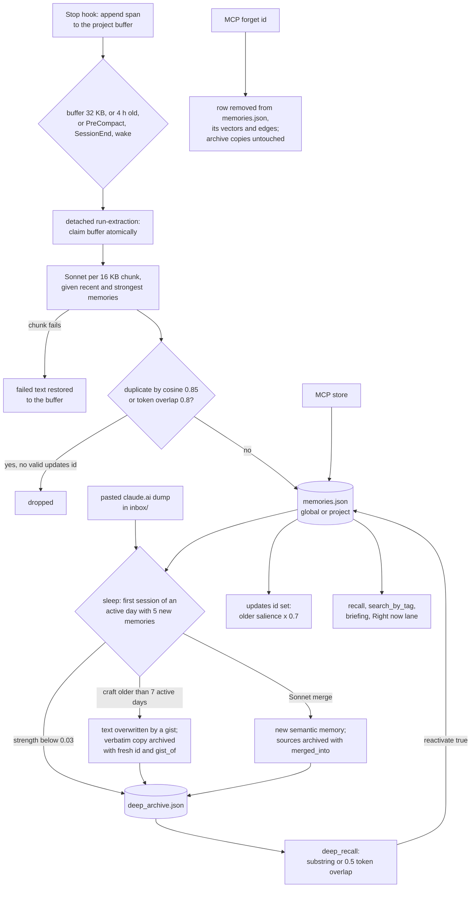

## 1. Executive Summary

Claude Engram (mlapeter) is a local memory system for Claude Code that models
itself on human memory. Hooks append each turn's transcript to a buffer; a
detached runner asks Sonnet what is worth remembering; a once-a-day "sleep"
decays, archives, compresses and merges what was stored; and every session
starts with identity documents and a briefing the model wrote for itself.
Storage is plain JSON under `~/.claude-engram/`, committed to a local git
repository at each consolidation. It is a different project from the one the
[Claude Engram](../claude-engram/) report covers, 20alexl/claude-engram.

What is notable is how much of the design is about not losing experience. The
buffer is claimed atomically and restored chunk by chunk when extraction fails,
merge sources and pre-gist originals go to an archive rather than being deleted,
merges keep the highest salience of their sources, and a failing pipeline
writes a self-check warning into the next session's context.

What is weak is correction. `forget` deletes the active row and nothing else, so
an archived verbatim copy of the same memory survives and can be reactivated.
The agent holds every correcting verb. The dashboard serves the whole store
with no authentication and no bind address.

The repository began as a React artifact for Claude.ai, `claude-engram.jsx`,
which keeps memories in the artifact's `window.storage` with JSON export and
import. That artifact is still in the tree, and the dashboard can reconcile its
backups with the hook-based store. This report covers the hook-based system at
the pin. The author's later project is [Counterparts](../counterparts/), whose
README names claude-engram as its first generation.

One mark: `negative_eval`, on two association-read cases with positive
controls. Section 9 names the six withheld. The licence is AGPL-3.0-only, with
a README note offering commercial licensing.

## 2. Mental Model

There are three stores. **World memories** are short notes the extraction model
writes in Claude's voice, each tagged with a register: `self`, `person` or
`craft`. **Episodes** are markdown narratives the session model writes when the
Stop hook blocks once and asks for one. **Identity documents** (`core.md`,
`craft.md`, `people/*.md`) are rewritten by Opus from dated deltas the session
model appends.

A world memory becomes a belief when the detached runner stores it; there is no
candidate state. It weakens in two ways. Its strength is average salience plus
access and consolidation bonuses minus a power-law decay on active days, scaled
by register (`src/core/strength.ts:12-66`). A later extraction that names it in
`updates` multiplies its salience by 0.7 (`src/core/interference.ts:21-57`).

It leaves the active store in four ways. Below strength 0.03, consolidation
archives it. A merge archives its sources with `merged_into`. Gist promotion
overwrites its text and archives a copy of the original under a fresh id with
`gist_of`. `forget` deletes the row. Only the last removes text from the active
file without moving it to the archive, and only the archive is read by
`deep_recall`, which can move a row back.

## 3. Architecture

The code is TypeScript on Bun. `install.sh` writes four hooks into
`~/.claude/settings.json` with `jq` and registers the MCP server at user scope
through `claude mcp add` (`install.sh:54-115`, `:139-141`). Each hook script
sources `hooks/load-env.sh`, which reads `~/.claude-engram/env` and, when
`ANTHROPIC_API_KEY` is still missing, sources the user's `~/.zshrc`
(`hooks/load-env.sh:20`).

`createStore(cwd)` binds a store to one working directory. It hashes the path to
twelve hex characters and resolves `global/` and `projects/` plus that hash
under the data directory, each holding `memories.json`, `deep_archive.json`,
`embeddings.json`, `associations.json` and `meta.json`
(`src/core/store.ts:133-168`). Writes take a `proper-lockfile` lock on the file
and rewrite it whole. The MCP server builds its store from `process.cwd()`, the
project Claude Code launched it in (`src/mcp/server.ts:25-31`).

Model calls are split by stakes: Sonnet extracts and consolidates, Haiku writes
gists, Opus writes the briefing and rewrites identity. Voyage embeddings are
optional and enable vector search, association edges and embedding dedup.

`snapshot.ts` initialises a git repository in the data directory, ignores
secrets and derived files, commits the whole store before and after every
consolidation, and pushes if a remote named `origin` exists
(`src/core/snapshot.ts:21-33`, `:46-98`).

### Deployment and ergonomics

It needs Bun, `jq`, git and an Anthropic API key; a Voyage key is optional.
Hooks call no model; extraction and consolidation run as detached children
spawned from the hooks. `ENGRAM_DISABLE=1` short-circuits every hook, and
`observerMode` stops recall from strengthening what it returns.
`session-start.sh` also reads `~/.memory-ab/assignment.json` and mutes the
briefing on days assigned to a sibling system, bansai
(`hooks/session-start.sh:22-24`). The installer passes the API key to
`claude mcp add -e`, so it is stored in the user's MCP configuration.

## 4. Essential Implementation Paths

**Encode.** `on-stop.ts` reads the transcript from a byte cursor, appends at
least 200 characters to the project buffer, and spawns `run-extraction.ts` when
the buffer passes 32 KB or its oldest span passes four hours
(`src/hooks/on-stop.ts:21-48`). The same hook blocks the stop once per session
chapter with instructions to write an episode file and optionally append to
`identity/deltas.md` (`:50-63`; `src/core/episodes.ts:20-53`).

**Select.** `run-extraction.ts` claims the buffer, loads up to 100 existing
memories from `getRecentAndStrong`, splits the buffer on span headers into
16 KB chunks, and calls `extractMemories` per chunk
(`src/hooks/run-extraction.ts:38-70`). Duplicates are dropped unless they carry
a well-formed `updates` id; survivors are stored and `applyInterference` runs
(`:76-105`). Failed chunks' text returns to the buffer before the claim is
cleared (`:120-131`).

**Wake.** `on-session-start.ts` advances the active-day clock, spawns
consolidation on the first session of a new active day with five new memories
or pending deltas, and injects the self-check warning, the identity block, the
Right now lane and the cached briefing (`src/hooks/on-session-start.ts:51-127`).

**Sleep.** `runConsolidation` takes a PID lock, commits a snapshot, drains the
inbox, backs up, auto-prunes, gists, merges in one or two passes, writes
association edges, rewrites identity, and commits again
(`src/core/consolidation.ts:244-309`, `:311-523`).

**Tools.** Nine MCP tools: `status`, `recall`, `search_by_tag`, `reinforce`,
`protect`, `store`, `forget`, `consolidate`, `deep_recall`
(`src/mcp/server.ts:40-429`).

## 5. Memory Data Model

| Field | Notes |
| --- | --- |
| `id` | `m_` plus epoch milliseconds plus four base-36 characters |
| `content` | declared `max(400)`; extraction truncates at 600 on a sentence boundary |
| `scope` | `global` or `project`; the project is the file, not a field |
| `register` | `self`, `person`, `craft`; older rows inferred from tags |
| `memory_type` | `episodic` until gisted or merged, then `semantic` |
| `salience` | novelty, relevance, emotional, predictive, each 0–1 |
| `access_count`, `last_accessed` | bumped by recall unless in observer mode |
| `created_at`, `created_active_day` | decay reads the active-day stamp |
| `source_session` | a session id, `mcp-store`, `consolidation` or a `claudeai-` id |
| `updated_from` | the memory this one superseded |
| `protected` | exempt from merge, prune, gist and interference |
| `archived`, `archived_at`, `merged_into`, `gist_of` | set on archive copies |

The schema is `MemorySchema` (`src/core/types.ts:21-49`). No code parses a
stored row against it, which is how extraction stores 600-character content
under a 400-character declaration. There is no author field, no status and no
validity interval.

## 6. Retrieval Mechanics

**Session start** injects three blocks. The briefing is cached text an Opus call
wrote at the previous SessionEnd from up to 60 memories chosen by strength, with
ten slots reserved for recent memories and the rest budgeted half craft, a
quarter person and a quarter self (`src/core/briefing.ts:63-161`). The Right now
lane is assembled by code: person and self memories from the last ten calendar
days, two per session, within 1,500 bytes (`:185-235`). A memory forgotten during
a session stays in the cached briefing until the next regeneration succeeds.

**Recall** tries an exact substring first and returns only those matches, sorted
by strength. Otherwise it scores token overlap, requiring four characters before
a substring counts as a stem, blends it 0.6 to 0.4 with a Voyage cosine when
enabled, and multiplies by strength compressed to the range 0.3 to 1 and a
recency boost capped at 1.5 (`src/core/store.ts:318-400`). The tool drops
results below strength 0.1 and appends up to six associations
(`src/mcp/server.ts:98-165`).

**Deep recall** reads only the archive files, prefers exact substrings, and
otherwise requires half the query tokens (`src/core/store.ts:751-790`).

## 7. Write Mechanics

Extraction is the main writer. The prompt tells Sonnet to extract only what is
absent or contradicted, to set `updates` only when a fact changed and only to
an id copied from the list, to prefer an empty list, and to resolve relative
dates against the span header (`src/core/salience.ts:32-72`). The runner accepts
an `updates` value only if it matches `^m_\d+_\w+$`
(`src/hooks/run-extraction.ts:77`).

Consolidation is the second. Its prompt asks Sonnet to merge redundancies,
*"keep the most recent information"* when memories contradict, generalize
patterns, and move person and self memories to global scope
(`src/core/consolidation.ts:153-174`). `applyConsolidation` refuses
cross-register merges, skips protected sources, takes the component-wise
maximum salience, and writes generalized memories as global (`:1079-1213`).

The claude.ai bridge is a third: a pasted dump is written verbatim to `inbox/`
and parsed at the next consolidation into an episode file and deduplicated
world memories (`:547-655`). A project-scoped fact lands in whichever project
the consolidation run belongs to, which `inboxFactScope`'s own comment flags
(`src/core/inbox.ts:103-113`).

### Operational cost

- Hooks: no model call.
- Extraction: one Sonnet call per 16 KB chunk of buffered transcript.
- Sleep: at most once per active day; Sonnet merges up to 20 memories a batch, Haiku
  gists up to 40 a chunk, and one streamed Opus identity rewrite.
- Briefing: one Opus call per SessionEnd.

## 8. Agent Integration

The session-start text names seven of the nine tools
(`src/hooks/on-session-start.ts:124`); `protect` and `deep_recall` are
registered but not named there. `store`'s description tells the model to
compress to 400 characters and to prefer global scope when in doubt
(`src/mcp/server.ts:295-303`).

The session model is also a writer outside the tools: the Stop hook's block
reason tells it to use its Write tool on a path under the data directory for
episodes and identity deltas (`src/core/episodes.ts:45-51`). Identity documents
are then rewritten by Opus and injected verbatim up to 34,000 characters
(`src/core/identity.ts:43`, `:114-175`).

The dashboard (`bun run dashboard`, enabled by `"dashboard": true`) adds search
across all projects, an identity history view, an inbox paste box, a
consolidate button, backup download and a v1-artifact sync.

## 9. Reliability, Safety, and Trust

**Forget does not reach the archive.** `remove` filters `memories.json` in both
scopes and purges vectors and edges (`src/core/store.ts:281-295`). The four
functions that touch `deep_archive.json` are load, archive, copy and reactivate
(`:642-749`). A gisted memory's verbatim original sits in the archive under a
fresh id (`src/core/consolidation.ts:448-455`), so forgetting the gist leaves
the original wording where `deep_recall` finds it, and `reactivate: true`
returns it to the active store. The tool also cannot forget an archived row: it
looks the id up in `loadAll`, which reads only active files
(`src/mcp/server.ts:344-349`).

**The dashboard is not local-only.** `Bun.serve` is called with a port and no
hostname (`src/dashboard/server.ts:107-110`), and Bun documents the default as
`0.0.0.0`. No route checks a credential. `GET /api/backup/download` returns every
memory in every project, and `POST /api/inbox` writes a file that the next
consolidation turns into memories (`:618-671`). The file header calls it a
*"local-only web UI"*.

**Dashboard actions use the dashboard's own directory.** `/api/consolidate`,
`/api/backup` and `/api/sync/apply` build their store from the dashboard
process's working directory, not from a project the user chose (`:595-597`,
`:635-637`, `:729-730`).

**The agent can rewrite its own memory.** `reinforce` with `new_content`
replaces text, `protect` exempts a memory from every decay path, and `forget`
deletes; none asks anyone.

Capability marks:

- `negative_eval` — awarded; section 10.
- `tombstone` — none. `forget` deletes; a later extraction sees only the recent
  and strong window, and nothing keyed on the text stops re-extraction.
  `recordSignal("forget")` adjusts salience weights for the extraction prompt,
  a per-dimension calibration, not a value.
- `trust_state` — no status field. Interference and merging change rank or move
  rows to an archive; the archive is a strength tier with no reason that tells a
  contradicted fact from a faded one.
- `bitemporal` — `created_at` and an active-day stamp only; dates live in prose.
- `scope_enforced` — the partition is the file. `scope` has two values, the
  project is the directory, and no read carries a predicate.
- `audit_log` — the events table is off unless the dashboard is enabled, mixes
  recalls with mutations, keeps 80-character snippets, and is deleted after 90
  days (`src/core/events.ts:8`, `:230-236`). The git snapshots are history.
- `human_review` — nothing waits. Inbox dumps and identity deltas are folded
  automatically, and the agent's `consolidate` tool runs that fold. The v1 sync
  lets a person resolve similar pairs, but its plan lives in process memory
  (`src/dashboard/server.ts:776-782`) and covers imports only.

## 10. Tests, Evals, and Benchmarks

Nothing was installed, built or run for this report; everything below is from
reading the tests at the pin. There is no CI workflow.

**The negative cases.** In `tests/core/associations.test.ts`, *"archiveMemories
purges edges touching the archived id"* links `m_1` to `m_2` and `m_3`, archives
`m_2`, and asserts `m_1`'s neighbours are exactly `m_3` (`:110-127`). *"writes
edges for similar same-scope survivors, skips dissimilar and cross-scope"*
builds an index where a global memory is nearly parallel to `m_1` and asserts
`m_1` reaches only `m_2` (`:142-172`). Both assert on the read recall follows.

**A vacuous one.** *"does not surface active memories"* stores an active memory
and asserts `deepRecall` returns nothing (`tests/core/archive.test.ts:191-198`).
The archive is empty, and `deepRecall` returns `[]` before matching
(`src/core/store.ts:757`).

**Invariants.** `memory-safety.test.ts` asserts merge sources are archived with
lineage, protected memories are never merged, pruned or weakened, gist chunks
fail independently, and git snapshots exclude `env`. `buffer.test.ts` covers the
atomic claim and per-chunk restore. `store.test.ts` pins the four-character stem
guard with the regression that motivated it.

**Experiment.** `experiments/entity-coherence/` scores per-entity models over
twelve scripted sessions with deterministic probes and commits several runs'
results. It imports nothing from `src/` and tests a candidate design, not this
store. Its README cites Zhang et al., [arXiv:2605.12978](https://arxiv.org/abs/2605.12978), on consolidated memories degrading under repeated LLM updates. `AUDIT-WHAT-FIRES.md` is the author's
own table of which mechanisms were ever measured.

## 11. For Your Own Build

### Steal

- **Encode dumb, select later, restore on failure.** A buffer claimed by rename
  and returned chunk by chunk keeps an API outage from reading as a quiet day.
- **Make the pipeline report its own failures in context.** The self-check block
  reads recent error events and tells the model memories may not be landing.
- **Never let deduplication lower importance.** A merged memory takes the
  maximum salience of its sources.
- **Refuse category-crossing merges in code, not only in the prompt.**
- **Decay on days used.** A month away costs nothing.

### Avoid

- **An archive `forget` cannot reach.** Every copy a compression step makes is a
  copy deletion must chase.
- **A dashboard with no bind address and no credential** serving the whole store.
- **A store path derived from the caller's working directory in a process that
  is not in a project.**
- **Correction verbs on the agent's tool surface with no record of who used them.**

### Fit

This suits one person who wants Claude Code to carry a relationship and working
context across sessions, and accepts model-written memories with no review. It
does not suit memory that must be corrected reliably, shared between people, or
kept private on a network. [Counterparts](../counterparts/) is the same author's
next attempt at the same goal, with typed correction and owner-only removal.

## 12. Open Questions

- Does any caller of `deep_recall` exclude `gist_of` copies whose active memory
  was forgotten? None was found in this reading.
- How often does the extractor re-create a memory that `forget` removed?
- Is the dashboard reachable from other hosts in normal use, or does a firewall
  stand in for the missing bind address?

## Appendix: File Index

- **Types and strength:** `src/core/types.ts`, `src/core/strength.ts`,
  `src/core/active-day.ts`, `src/core/config.ts`.
- **Store:** `src/core/store.ts`, `src/core/embeddings.ts`, `src/core/snapshot.ts`.
- **Write:** `src/hooks/on-stop.ts`, `src/core/buffer.ts`,
  `src/hooks/run-extraction.ts`, `src/core/salience.ts`,
  `src/core/interference.ts`, `src/core/inbox.ts`.
- **Sleep:** `src/core/consolidation.ts`, `src/core/identity.ts`,
  `src/hooks/run-consolidation.ts`.
- **Read:** `src/hooks/on-session-start.ts`, `src/core/briefing.ts`,
  `src/mcp/server.ts`.
- **Dashboard and sync:** `src/dashboard/server.ts`, `src/sync/*.ts`,
  `src/core/events.ts`.
- **Install:** `install.sh`, `hooks/*.sh`.
- **v1 artifact:** `claude-engram.jsx`, `docs/v1-artifact.md`.
- **Tests:** `tests/core/associations.test.ts`, `tests/core/archive.test.ts`,
  `tests/core/memory-safety.test.ts`, `tests/mcp/tools.test.ts`.

### Recorded searches

Checked against the checkout at the pinned revision.

- `grep -rn 'deep_archive\|archivePath(' src` — `store.ts:162-163`, `:643`, `:654`, `:701`, `:714`, and two dashboard reads; `remove` is not among them.
- `grep -rniE 'tombstone|forgotten|blocklist|denylist|deny-list' src` — three comments in `salience-weights.ts`; no stored rejected value.
- `grep -rnE '\bstatus\b|verified|candidate|rejected' src/core src/mcp src/hooks` — the status tool, HTTP statuses and local variables; no status field on a memory.
- `grep -rniE 'valid_(from|to|at)|invalid_at|expires_at|valid_until' src` — no match.
- `grep -rn 'hostname' src` — no match; `grep -n -i 'authoriz\|token' src/dashboard/server.ts` — no match.
- `grep -rn 'MemorySchema' src` — the definition and one comment in `inbox.ts`; no parse of a stored row.
- `grep -rn 'registerTool(' src/mcp/server.ts` — nine tools, none an approve or apply verb.
- `grep -rln '\.\./\.\./src' experiments/entity-coherence/src` — no match.
- `grep -rliE 'arxiv|bibtex|@article|@misc|doi\.org|CITATION' . --exclude-dir=.git` — the experiment README and its probe fixtures; no `CITATION.cff`.
- `ls .github` — absent.

## History

**2026-10-01** — [`91edd7e532ab75f7734055ec02051ac5c299c6e7`](https://github.com/mlapeter/claude-engram/commit/91edd7e532ab75f7734055ec02051ac5c299c6e7) — first reading, at the head of `main`, a commit dated 17 July 2026. One mark, `negative_eval`. Screened before reading: one auto-run surface (`hooks/`, five scripts that run only once `install.sh` registers them), no build-time execution point, nothing inside the cooldown, and one unpinned surface (caret ranges in `package.json`, with `bun.lock` committed); the screen raised no AGENT finding. `install.sh` was read by hand. Read with `grep` and `sed`; nothing installed, built or run.
