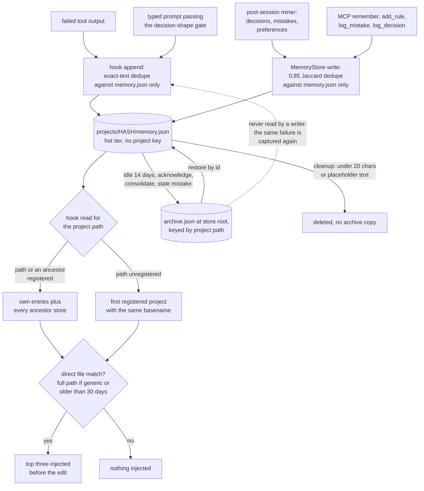

## 1. Executive Summary

Claude Engram is a set of Claude Code hooks plus an MCP server that turns a
coding session's own events into per-project memory. A failed tool call becomes
a *mistake*, a sentence the user types that reads as a choice becomes a
*decision*, and a rule is added by hand or seeded from a default pack. A
background miner reads past transcripts for more of the same. Before each edit
the hook scores the project's memories against the file and injects at most
three, and the session-start banner prints rules, mistakes and the last
checkpoint.

What is notable is the injection discipline. A memory reaches the prompt only
with a direct, path-aware file match. Generic basenames such as `utils.py` need
a full path, and so do entries older than 30 days. The code comments record the
incident behind each gate.

What is weak is the boundary and the correction path. Scope is a file per
project path, and both hook readers fall back to *any* registered project with
the same directory name when the current path is unregistered. An acknowledged
mistake is archived, and the next identical failure captures it again, because
dedupe reads only the hot tier. The post-session cleanup deletes a rule shorter
than 20 characters as "broken".

The first commit, on 20 January 2026, is titled *"Mini Claude MCP server with
38 tools"*; the tree at the pin carries only the Claude Engram name. Beyond the
memory store it ships checkpoint rings, a `/goal` run bracket, stall and
context-pressure detection, a code index and session mining. This report covers
the memory store and the mined patterns that feed the same banner.

One mark: `negative_eval`, on a scoping bench with positive controls and a
pytest case over the mined patterns report. Section 9 names the six withheld.

## 2. Mental Model

A memory is a `MemoryEntry`: a content string with a category, a relevance
from 1 to 10, tags, related files and access statistics
(`claude_engram/tools/memory.py:41-67`). It becomes a belief the moment it is
written; there is no candidate state and no model judgement between capture and
injection. Five producers write:

- **Failed tools.** `_auto_log_detected_mistake` parses the error class,
  message and traceback files out of the output and appends a `mistake` at
  relevance 9, `source: auto-detected` (`claude_engram/hooks/remind.py:2727-2873`).
- **Typed prompts.** `_auto_capture_from_prompt` runs `capture_decision`, which
  requires the shape `decision_gate.py` defines — a declarative sentence with a
  deciding word, not a question, acknowledgement, count or paste — and appends
  a `decision` (`remind.py:2624-2694`; `claude_engram/mining/decision_gate.py:1-14`).
- **The miner.** After a session it extracts decisions at confidence 0.6 or
  more, mistakes with an error type, and user corrections, and files each under
  the project whose files it names (`claude_engram/mining/extractors.py:1080-1199`).
- **The model.** `memory(remember)`, `memory(add_rule)`, `work(log_mistake)`
  and `work(log_decision)`.
- **The default pack.** Seeded once per project at session start
  (`claude_engram/default_pack.py:351-417`).

A memory leaves the injected set in four ways. It is archived: idle 14 days, a
machine-written mistake 21 days old that never recurred, or acknowledged. It is
consolidated into a digest and archived. It is deleted. Or cleanup judges it
broken. Only deletion and the broken rule remove it; the rest move it to
`archive.json`, from which `restore` brings it back. Rules, lessons and
mistakes never age out (`memory.py:2224-2234`). Relevance 8 or more exempts any
entry from age archiving, a threshold the comment places above every default
producer (`memory.py:29-38`).

**The archive is a tier, not a verdict.** An acknowledged mistake is moved, not
marked wrong, and no write path consults the archive. The hook writer derives
the entry id as `md5(content)[:12]` (`remind.py:2854`) and checks only the hot
file for identical text (`remind.py:2574`). The same failure the next day
writes the same id back into `memory.json`, and it injects again.

## 3. Architecture

Everything is Python and JSON on the local machine. The hooks run
`claude_engram.hooks.remind`, which `install.py` merges into
`~/.claude/settings.json` for eleven events (`install.py:138-245`). The MCP
server, `claude_engram.server:main`, exposes 16 tools; `memory`, `work`,
`context` and `session_mine` each bundle reads and writes behind an `operation`
enum (`claude_engram/tool_definitions_v2.py:62-204`).

A resident daemon binds a free port on `127.0.0.1` and writes the port to a
file in the store (`claude_engram/hooks/scorer_server.py:364-373`). It serves
embeddings and decision scores, and it also runs hook dispatch in-process:
a request carrying `hook_event`, a `stdin` payload and an `env` with
`CLAUDE_PROJECT_DIR` is fed to `remind.main()` (`:219-263`, `:266-285`). Hooks
fall back to in-process when the daemon is down.

The store lives under `CLAUDE_ENGRAM_DIR`, default `~/.claude_engram`. A
`manifest.json` maps each normalized project path to an eight-character md5
prefix, and `projects/HASH/` holds `memory.json`, the embedding matrix and
index, `patterns.json`, the session index and the checkpoint ring
(`memory.py:218-234`). The cold tier is one `archive.json` at the store root
whose `projects` object is keyed by path (`memory.py:177`, `:2193-2222`). The
README and the library book place it under `projects/HASH/`; the code and the
tests that read it (`tests/test_smoke.py:853`) use the root.

Two readers parse the same files. `MemoryStore` is a pydantic model with a
per-project cache, used by the MCP server and the miner. `HotMemoryReader` and
`hooks/storage.py` are stdlib-only dict readers, because the pre-edit hook has
a one-second budget and the pydantic import cost about 185 ms
(`claude_engram/hooks/hot_reader.py:1-9`).

**Concurrency is last-writer-wins with a merge.** Every write is a temp file
then `replace`. A `MemoryStore` that mutated a project on a stale base merges by
entry id before saving, and its docstring states the cost: it *"can resurrect an
entry the other writer deleted in the same instant"* (`memory.py:649-686`). The
hook writer is a plain read-modify-write with no merge (`remind.py:2531-2611`).

Embeddings are optional: the `semantic` extra brings sentence-transformers and
`BAAI/bge-base-en-v1.5`, served by the daemon. Ollama, when present, is used for
consolidation, reflection and scout search.

### Deployment and ergonomics

A virtualenv, an editable install and `python install.py`, which writes the
global hooks, a `.mcp.json` to copy per project, a launcher script and the
`/engram` skill, and runs data migrations. No service and no API key are needed
to store anything. The store is pretty-printed JSON, readable and repairable by
hand. The hooks are global, so every project opened afterwards is captured,
whether or not it has `.mcp.json`.

## 4. Essential Implementation Paths

**Hook capture.** `_append_memory_entry` registers an unknown project in the
manifest, loads `memory.json`, skips exact-content duplicates and an optional
caller predicate, appends, and writes an embedding to `embeddings_pending.json`
for the next `MemoryStore` load to merge (`remind.py:2531-2611`). Its callers
are the prompt capture (`:2676-2692`) and the failed-tool capture
(`:2856-2870`).

**Store write.** `remember_discovery` creates the project and runs
`_is_duplicate` at Jaccard 0.85 over the hot entries; a hit bumps the existing
entry's access count and relevance instead. It then extracts tags and file
references and appends (`memory.py:821-880`; `:587-611`). `add_rule` dedupes
against rules only (`:1850-1908`).

**Miner write.** The post-session phase routes each extraction with
`target_project_for_files`, then dedupes decisions on the bare sentence across
the destination and its ancestors, so the prompt hook's copy and the miner's
copy of one sentence are stored once (`extractors.py:1080-1199`).

**Pre-edit injection.** `_auto_run_pre_edit_check` loads the project through
`load_project_memory`, matches mistakes to the file name by regex (full path for
generic names), then calls `get_contextual_memories` for scored entries
(`remind.py:1048-1196`). The scorer and gate are `score_entry` and
`score_loaded_entries` (`hot_reader.py:171-308`).

**Session-start banner.** Rules with inheritance, past mistakes ranked by
`_mistake_scope`, the latest checkpoint, and `_recurring_lines` over the mined
`patterns.json` (`claude_engram/hooks/storage.py:196-247`; `remind.py:3661-3740`).

**MCP read.** `handle_memory` dispatches `search` to `search_memories`,
`hybrid_search` to keyword plus score plus vector RRF with a rerank, and
`recall`, `recent`, `list_rules` and `list_mistakes` to direct reads
(`claude_engram/handlers.py:1441-1924`; `memory.py:1254-1326`, `:2904-2986`).

**Correction.** `modify_memory`, `delete_memory`, `batch_delete` (rules and
mistakes refused by category, allowed by id), `promote_to_rule` and
`restore_from_archive` (`memory.py:2013-2180`, `:2436-2467`).
`acknowledge_mistake` moves one mistake into the archive (`handlers.py:1884-1918`).
`forget` calls `forget_project`, which removes the project directory and its
manifest entry (`memory.py:988-1008`).

**Maintenance.** `cleanup_memories` finds broken entries, near-duplicates
(Jaccard, then embeddings when available), archivable entries and decay, and
`_apply_cleanup` applies them (`memory.py:1337-1739`). The miner calls it with
`dry_run=False` and default decay after each post-session run, then
`archive_stale_mistakes` over every registered project
(`claude_engram/mining/background.py:458-486`). `consolidate` asks Ollama for a
dated digest of a tag group of ten or more, keeps the top five originals and
archives the rest (`memory.py:3090-3293`).

## 5. Memory Data Model

| Field | Notes |
| --- | --- |
| `id` | md5 of the content, first 12 hex characters, with a counter suffix on collision in the target project (`memory.py:568-585`) |
| `content` | free text; mined entries carry prefixes such as `MISTAKE: `, `DECISION: `, `USER PREFERENCE: ` |
| `category` | rule, mistake, decision, discovery, context, lesson, priority, note |
| `source` | `auto-detected`, `auto-prompt`, `session_mining`, `add_rule`, `consolidation`, or none |
| `relevance` | 1-10; manual remember 5, auto-prompt 6, mined decisions 7, mined mistakes 8, auto-detected mistakes 9, rules 9 |
| `tags`, `related_files` | extracted from content by regex, plus caller values |
| `created_at`, `last_accessed`, `access_count` | recency and frequency inputs to the scorer |
| `archived_at` | set when moved to the cold tier |
| `detector` | rules only: a hand-written matcher on tool name, command, paths or input |

The containing `ProjectMemory` adds a summary, key files, recent searches, file
and tag indexes and clusters (`memory.py:97-130`).

**Scope is the file.** Nothing on the entry names its project; the project is
whichever `memory.json` it sits in. Workspace inheritance is a read-time walk:
`HotMemoryReader.load_entries` and `load_project_memory` add every registered
ancestor's entries, and the loader marks them `_inherited` in memory only
(`hot_reader.py:365-393`; `storage.py:80-189`). Rules inherit on the MCP side
through `get_rules_with_inheritance` (`memory.py:1940-1984`). Other MCP reads
open only the named project's file, so a memory the pre-edit hook injects from
the workspace root is not found by `memory(search)` in the sub-project.

**The unregistered-path fallback crosses the boundary.** When no entry is found
for the path or its ancestors, `HotMemoryReader.load_entries` loads the first
registered project whose directory basename equals the current one
(`hot_reader.py:386-392`). `load_project_memory` goes further: when the path
itself is unregistered, it takes the same-basename project *before* considering
ancestors (`storage.py:132-138`). A new checkout named `backend` or `api`
therefore reads another registered `backend`'s rules and mistakes on its first
edits, until a write registers it. This was read, not reproduced.

The default-pack seeder reads its coverage through the same loader
(`default_pack.py:312-326`), so a same-named project's rules can make it skip
seeding. No temporal validity, no provenance beyond `source`, no link from a
consolidated digest to the originals it replaced, and no version history.

## 6. Retrieval Mechanics

**Hook injection is gated, not only ranked.** `score_entry` sums file match
0.35, tag overlap 0.20, recency 0.20 on a 30-day half-life, relevance 0.15 and
access frequency 0.10, plus 0.3 for rules, 0.25 for lessons and 0.2 for
mistakes (`hot_reader.py:19-26`, `:171-219`). `score_loaded_entries` then
admits a non-rule only when its path-aware file match clears a gate of 0.5
divided by an outcome weight bounded to 0.8-1.2. Past 30 days it also needs a
full-path match, unless it is a mistake. A rule rides along only when it names
the file or its directory, capped at one, and only beside a file-relevant
memory. With nothing file-relevant the hook injects nothing (`:237-308`).

`_file_match_score` treats diverging paths with a shared basename as no match.
Generic names — `__init__.py`, `README.md`, `CLAUDE.md`, `pyproject.toml`,
`utils.py` and about forty more — score zero without a full-path signal
(`hot_reader.py:30-148`).

**The outcome loop.** `mining/outcomes.py` records which kinds of injection
preceded passing tests and writes a multiplier the gate reads
(`hot_reader.py:222-234`). It shifts the threshold; it does not change any
memory.

**MCP search.** `search_memories` is word-set intersection with tag and file
index lookups, sorted by stored relevance, and it bumps access counts on every
hit (`memory.py:1254-1326`). `hybrid_search` fuses keyword (weight 1.5), score
ranking (1.0) and vectors (0.5) by RRF with k=60, reranks by embedding, and
drops zero scores, because the score arm contributes candidates for any query
(`:2904-2986`). Vector hits join to hot entries by id, so a deleted memory's
orphan vector is never returned (`:2842-2902`).

**Mined patterns.** Recurring errors carry a `projects` list computed from the
edits of the sessions they occurred in (`claude_engram/mining/patterns.py:283-415`).
The banner shows one only when that list intersects the session's project, or
when the list is empty (`remind.py:3683-3706`). The MCP `session_mine(errors)`
recomputes the same list and prints every entry without applying it
(`handlers.py:2286-2305`).

## 7. Write Mechanics

Writes are hot-path and model-free on the hook side: a regex parse of an error,
a regex or semantic score over a prompt sentence, then the shape gate. The
semantic tier asks the local daemon and falls back to regex when it is down.
The miner runs detached after each session and on a debounced live tick, and
calls no hosted model; `consolidate` and `reflect` call Ollama when it runs.

**Dedupe reads the hot tier only.** The hook compares whole content strings
against `memory.json`, and the store compares Jaccard 0.85 against
`proj.entries`, the hot list (`remind.py:2574`; `memory.py:841`). The archive,
which holds every acknowledged and hygiene-archived mistake, is never
consulted.

**Cleanup deletes on its own judgement.** `_is_broken_memory` flags empty text,
anything under 20 characters, a few truncation strings and placeholder endings
(`memory.py:1600-1651`). The broken pass skips only lessons (`:1383-1405`), and
broken entries are removed without an archive copy (`:1701-1706`). The miner
runs this with `dry_run=False` after every post-session pass
(`background.py:465`). The MCP `session_start` runs it too, under a comment
calling that call non-destructive (`handlers.py:684-692`). A rule stored
without a reason and under 20 characters — `Never push to main` is 18 — is
deleted at the next session end. Entries touched by decay and age archiving
are archived before they leave the hot file.

**Tool- and agent-derived text is stored like the user's.** A traceback
message, a `(from user)` sentence and a `(confirmed)` assistant proposal the
user said yes to all become memories. Nothing but `source` and a prefix tells
them apart, and the hook injects each as a relevant memory for the file.

### Operational cost

- Write: synchronous on the hook path, one JSON parse and rewrite of the
  project file per captured event, plus an optional local embedding. No LLM.
- Deferred: mined memories appear after the session-end miner finishes. The
  library book records a post-session run at about 3.1 GB resident for seven
  minutes (`library-book/10-appendix.md:326`); that figure is the project's,
  not measured here.
- Background rewrite: every post-session run cleans the project it mined and
  sweeps stale mistakes across every registered project.
- Read: at most three memories and one rule per edit, and a bounded banner at
  session start. Injection arrives as hook output beside the tool call, after
  the cached prefix.

## 8. Agent Integration

The hooks do the work; the model need call nothing. `/engram` tells the model
to use the tools on purpose. Subagents get no injections, but their edits are
tracked. After compaction the banner re-injects rules, mistakes and the
checkpoint banked before it.

The model holds every memory verb: `remember`, `add_rule`, `modify`, `delete`,
`batch_delete`, `promote`, `archive`, `restore`, `acknowledge_mistake`,
`cleanup`, `consolidate` and `forget`. The last removes a project's whole store
directory (`tool_definitions_v2.py:62-204`). Only eight analysis tools carry
`readOnlyHint` (`:729-739`), so a client that auto-approves read-only tools
still asks before `memory`.

The MCP half works with any MCP client. The hook half depends on Claude Code's
event model, transcript format and statusline; the SessionStart banner warns
when the transcript format is no longer recognized.

## 9. Reliability, Safety, and Trust

**The boundary is a directory name away from leaking.** A physical partition
per project path is a real boundary. The same-basename fallback in both hook
readers undoes it for the sessions most likely to trip it: a fresh clone, a
renamed checkout, the same repository at a second path. Workspace pooling is
handled with more care — `_mistake_scope` ranks a sibling's pooled mistake last
and `_recurring_lines` filters attributed errors — but ranking is not
exclusion. The pre-edit path calls `get_past_mistakes` without a project, so a
pooled sibling mistake naming the same file name still fires
(`remind.py:1066-1087`).

**The hook daemon trusts every local caller.** `_handle_client` reads one JSON
line from any connection to the loopback port, and a `hook_event` request runs
the hook dispatcher with the caller's `stdin` payload and `CLAUDE_PROJECT_DIR`
(`scorer_server.py:219-263`, `:266-285`). The accepted events include `prompt_json` and `tool_failure_json`, the two capture paths (`:172-182`). No token or peer check was found in
the daemon or `hook_client.py`. Any process on the machine that can read the
port file or scan ports can therefore write mistakes and decisions into any
project path. This was read, not reproduced.

**Forget does not reach the cold tier.** `forget_project` removes
`projects/HASH/` and the manifest entry and never touches `archive.json`, where
that project's archived rows stay keyed by path (`memory.py:988-1008`,
`:2208-2222`). Registering the same path again makes `archive_search` and
`restore` find them.

**Provenance.** Error text from any tool, including a command that printed a
file the agent read, becomes a relevance-9 mistake, and a recurring error is
replayed with its recorded fix. Nothing marks machine-captured text as
unverified when it is injected.

**Concurrency.** Hook writes can race the MCP server. The store's merge keeps
both sides' additions and can resurrect a concurrent delete, as its docstring
says. A consolidated digest is stamped with its date, which is the only
representation of uncertainty.

Capability marks:

- `negative_eval` — awarded; evidence in section 10.
- `tombstone` — withheld. `acknowledge_mistake` archives the record, and the
  writers dedupe against the hot file only. The id is already a hash of the
  text and the archive already holds it, so the tombstone is one lookup away;
  that lookup is not in the tree.
- `trust_state` — withheld. `archived_at` keeps an entry out of hook reads, but
  it marks a storage tier reached by age and hygiene as well as by
  acknowledgement, and `archive_search` returns the entry as a memory. Nothing
  says a memory is not believed. Categories are types, and the decision gate is
  a write-time filter.
- `bitemporal` — withheld. `created_at`, `last_accessed` and `archived_at`
  record system time only.
- `scope_enforced` — withheld. `MemoryEntry` has no project key; the scope is
  which `memory.json` a row sits in, a physical partition. The one
  key-plus-predicate is `projects` on mined recurring errors. The banner filters
  on it, `session_mine(errors)` over the same data does not, and rows with an
  empty list pass.
- `audit_log` — withheld. No mutation record exists. `injection_outcomes.json`
  is a feedback log, run reports are per-session artifacts, and the library
  book's changelog documents the code.
- `human_review` — withheld. No memory waits for anyone, and the agent holds
  every verb, including `promote` and `forget`.

## 10. Tests, Evals, and Benchmarks

Nothing was installed, built or run for this report; what follows is from
reading the tests at the pin.

**Two kinds of test.** `tests/test_smoke.py` and nineteen `bench_*.py` files
hold pytest-style functions, 198 in all. The other bench scripts are `__main__`
programs that print PASS or FAIL per case and return counts. The README's
product figures (*"multi-project isolation 11/11"*) come from those. There is no
CI configuration in the tree.

**The negative cases.** `bench_multi_project.py` seeds a workspace root and
`backend` and `frontend` sub-projects. For a backend file it requires `JWT` and
the workspace `linter` rule and forbids `React` and `Tailwind`, and for a
frontend file the mirror (`:177-199`). Each case checks the combined output of
`MemoryStore.score_and_rank` and `HotMemoryReader.get_scored_memories`
(`:286-313`). The required keywords make an empty result fail. The two cases
that forbid a file-irrelevant workspace mistake have no required keyword. A
failing case prints FAIL; the script and `bench_integration.py`, which
aggregates it, exit zero either way (`bench_integration.py:87-98`, `:125-126`).

`test_recurring_errors_are_scoped_to_the_sessions_project` writes a pooled
`patterns.json` and asserts that `KeyError: 'sue'` appears in one sub-project's
banner lines and `InputEncoderRegistry` does not, then the reverse for the other
sub-project (`test_smoke.py:246-274`). This one fails the pytest run.

**A negative half the positive half entails.**
`test_edit_reminders_need_a_file_match_for_rules_and_a_full_path_when_old`
asserts ids 1, 3 and 5 are injected and 2 and 4 are not, at `limit=3`
(`test_smoke.py:193-206`). With three required ids in a result capped at three,
the exclusion cannot fail on its own. The rule gate for id 4 is not exercised,
because the one-rule cap would hide a leak.

**Vacuous in part.** `test_hybrid_search_drops_the_zero_score_tail` asserts an
empty result for a no-match query, then `all(score > 0 …)` over a second query
that could return nothing (`test_smoke.py:529-546`).

**Retrieval benchmarks.** `bench_longmemeval.py`, `bench_convomem.py` and
`bench_locomo.py` load the published datasets from a path argument into a
`MemoryStore` and score recall. No dataset and no result file is committed, so
the README's R@5 of 0.966 and the other figures are claims this reading could
not check. They measure the MCP store's `hybrid_search`, not the hook injection
that is the product's main read path.

**Missing.** No test forgets a project and checks the archive, re-captures an
acknowledged mistake, covers the same-basename fallback, runs cleanup over a
short rule, or sends a hook event to the daemon from outside a hook. No paper or
citation block is in the tree.

## 11. For Your Own Build

### Steal

- **Gate injection on direct relevance and be silent otherwise.** Ranking
  always returns something; a gate that returns nothing when nothing matches
  keeps a pre-edit injection from becoming noise.
- **Make file matching path-aware and distrust generic basenames.** A shared
  `__init__.py` or `README.md` is not evidence that two memories concern the
  same file.
- **One capture gate for every producer.** The prompt hook, the transcript
  miner and the pruning migration share `decision_gate.py`, so a rule tightened
  once applies to live capture, backfill and the existing store.
- **Archive, never delete, on every automatic path** — and write down, as
  `consolidate` does, why the earlier delete was wrong.
- **Merge by id on a stale save, and document what the merge can resurrect.**

### Avoid

- **A fallback that picks a scope by name.** When a scope lookup misses, return
  nothing; a directory basename is not an identity.
- **Dedupe against the hot tier only.** Anything a person dismissed lives in the
  cold tier, and the next capture of the same text walks past it.
- **A validity heuristic that deletes.** A length floor for "broken" should
  archive, and should never apply to the categories the rest of the system
  treats as permanent.
- **A loopback socket as an entry point without a secret.** A port file in the
  user's store plus a per-start token costs a few lines.
- **A benchmark harness that cannot fail.** A printed FAIL in a script that
  exits zero reads, in a README, as a pass.

### Fit

This suits one developer on Claude Code who wants their own failures and stated
preferences to come back at the file they concern, with no service to run and
a store they can read. It does not suit shared machines, several people in one
store, or anyone who must show that a dismissed memory stays dismissed or that
a project's memory stays in that project. The install is global and captures
every project opened afterwards; a reader who works across client codebases
should weigh that before running it.

## 12. Open Questions

- How often does the same-basename fallback fire in practice, and does anything
  register a project before its first pre-edit read?
- Can a sandboxed tool subprocess reach the daemon's loopback port under Claude
  Code's sandbox settings?
- Is the README's placement of `archive.json` under `projects/HASH/` the
  intended design, with the root file a leftover?
- What do the retrieval benchmarks give on the hook injection path rather than
  on `hybrid_search`?

## Appendix: File Index

- **Store and schema:** `claude_engram/tools/memory.py`.
- **Hook read path:** `claude_engram/hooks/hot_reader.py`,
  `claude_engram/hooks/storage.py`, `claude_engram/hooks/remind.py`
  (`_auto_run_pre_edit_check`, `get_contextual_memories`, `_recurring_lines`,
  `_hook_session_start`).
- **Hook write path:** `claude_engram/hooks/remind.py` (`_append_memory_entry`,
  `_auto_capture_from_prompt`, `_auto_log_detected_mistake`),
  `claude_engram/hooks/intent.py`, `claude_engram/mining/decision_gate.py`.
- **Daemon:** `claude_engram/hooks/scorer_server.py`,
  `claude_engram/hooks/hook_client.py`.
- **Miner:** `claude_engram/mining/background.py`,
  `claude_engram/mining/extractors.py`, `claude_engram/mining/patterns.py`.
- **MCP:** `claude_engram/server.py`, `claude_engram/handlers.py`,
  `claude_engram/tool_definitions_v2.py`.
- **Install and defaults:** `install.py`, `claude_engram/default_pack.py`,
  `claude_engram/migrations.py`.
- **Tests:** `tests/test_smoke.py`, `tests/bench_multi_project.py`,
  `tests/bench_injection_relevance.py`, `tests/bench_integration.py`,
  `tests/bench_longmemeval.py`.

### Recorded searches

Checked against the checkout at the pinned revision, from the tree root.

- `grep -rliE 'arxiv|bibtex|@article|@misc|doi\.org' . --exclude-dir=.git` — no match, and no `CITATION.cff`.
- `grep -rniE 'renamed|formerly|previously (called|named)|mini.claude|mini_claude' --exclude-dir=.git .` — two matches about project directories and one changelog line renaming a response class; none renames the project. The commits API gives the first commit's title.
- `grep -rnE 'tombstone|blocklist|denylist' --include='*.py' .` — no match.
- `grep -rnE 'valid_from|valid_to|valid_until|effective_at|invalid_at' --include='*.py' .` — no match.
- `grep -rnE 'audit_log|mutation_log|events\.jsonl|memory_events|history\.jsonl' --include='*.py' claude_engram` — no match.
- `grep -rn 'archive' claude_engram/mining/*.py claude_engram/hooks/storage.py` — the stale-mistake sweep and read-side skips; no writer reads the archive before appending.
- `grep -rn --include='*.py' 'archive\.json\|archive_file' .` — the root `archive.json` in `memory.py`, `migrations.py` and two tests; no per-project archive path.
- `grep -rn --include='*.py' 'cleanup_memories(' .` — `handlers.py:379`, `handlers.py:688`, `mining/background.py:465`.
- `grep -rn -i 'name-based' tests claude_engram` — the two fallbacks in `hot_reader.py` and `storage.py`; no test.
- `grep -niE 'auth|secret|nonce|hmac|token' claude_engram/hooks/scorer_server.py claude_engram/hooks/hook_client.py` — two comment lines about text tokens; no caller check.
- `ls -a | grep -E '^\.github$|^\.gitlab|^\.circleci'` — no CI configuration.

## History

**2026-09-30** — [`a7903274531c2ca00659b03e173f0f0f2079333a`](https://github.com/20alexl/claude-engram/commit/a7903274531c2ca00659b03e173f0f0f2079333a) — first reading, at the head of `main`, the 0.8.61 commit dated 27 September 2026. One mark, `negative_eval`. Screened before reading: no auto-run surface, no build-time execution point, one dependency file inside the cooldown (`pyproject.toml`; every file in a depth-1 clone dates to the tip), one unpinned surface (`pyproject.toml` with no lockfile), and `CLAUDE.md` recorded as data. Read with `grep` and `sed`; nothing installed, built or run.
