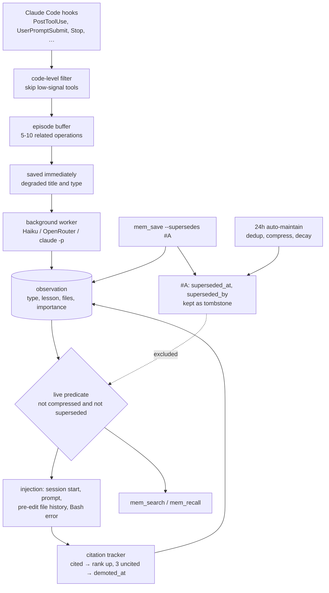

## 1. Executive Summary

claude-mem-lite is a persistent memory plugin for Claude Code. It started as a
redesign of claude-mem that batches tool calls before calling a model. It is
MIT, version 6.9.1, with 1,288 commits since 8 February 2026, about 52,000
lines of JavaScript modules and 5,725 test cases in 412 files. It runs on
Node 22 with `better-sqlite3` and nothing else: no vector store and no
embeddings.

Capture is automatic:

1. Seven lifecycle hooks record tool use, prompts, failures and session
   boundaries.
2. Deterministic filters drop low-signal tool calls.
3. Related operations are grouped into an episode, which is saved at once
   with inferred metadata.
4. A background worker asks Haiku (or an OpenRouter model, or `claude -p`) to
   classify it, title it and extract a lesson.

Recall is lexical and heavily tuned, with FTS5 BM25 over weighted columns,
synonym and CJK expansion, pseudo-relevance feedback and scoring for recency,
importance and file overlap. Memory is injected at session start, on each
prompt, before an edit and after a Bash error.

Two things set it apart:

- **Correction is explicit.** A save can name the observations it retracts. They
  are kept as tombstones with a link to the correction, and one predicate —
  not compressed, not superseded — keeps them out of every injection, search
  and export path. A test pins every read site that carries only half of it, and why.
- **Claims are measured and withdrawn in public.** A 30-query retrieval
  benchmark gates CI against a committed baseline. The README records
  LongMemEval results with the stricter metric beside the flattering one, and
  it retracts an earlier explanation of its own precision figure as wrong.

The predicate has one gap. The two save paths disagree about tombstones.
A manual save deduplicates against live rows only, so a correction is never
refused as a copy of what it corrects. The automatic save that hooks use
deduplicates against every row in the window, superseded ones included. Within
seven days, an automatically captured observation whose title and narrative
resemble a retracted one is dropped without a trace. The remaining costs are
policy: recall spans projects by default at a reduced weight, the plugin
rewrites a managed block in the project's committed `CLAUDE.md` on every
session start, and nothing records who changed an observation beyond
pre-delete snapshots.

Two marks: `human_review`, `negative_eval`.

## 2. Mental Model

Memory is a set of **observations** per project. Each is typed, graded 1 to 3
for importance, tied to the files it touched, and optionally carries a
*lesson learned* that ranks above its narrative.

Four processes shape which observations reach the agent:

- **Supersession** retires a row by stamping `superseded_at` and
  `superseded_by`: explicitly from a save that names it, or automatically when
  dedup keeps the higher-importance twin.
- **Compression** folds old low-value rows into weekly summaries through
  `compressed_into`.
- **Decay** lowers ranking by type-specific half-lives: decisions 90 days,
  discoveries 60, bugfixes 14, changes 7.
- **Citation feedback** counts whether the agent cites an injected observation
  by id. Each citation raises its score and each uncited injection lowers it through a
  streak; at three the streak resets and `demoted_at` is stamped. No branch
  changes importance, so a missed citation cannot evict a row.

## 3. Architecture

| Area | Files |
| --- | --- |
| Hooks | `hook.mjs` (dispatch), `hook-episode.mjs`, `hook-llm.mjs`, `hook-memory.mjs` (prompt injection), `hook-context.mjs` (session start), `hook-handoff.mjs`, `hook-precompact.mjs`, `hook-optimize.mjs`, shell hooks in `hooks/` |
| Store | `schema.mjs` (tables, FTS5 triggers, migrations), `lib/save-observation.mjs`, `lib/observation-write.mjs`, `lib/delete-core.mjs`, `lib/maintain-core.mjs`, `lib/compress-core.mjs` |
| Retrieval | `search-engine.mjs`, `scoring-sql.mjs`, `nlp.mjs`, `synonyms.mjs`, `stop-words.mjs`, `deep-search.mjs`, `rerank.mjs`, `lib/inject-search-core.mjs`, `lib/recall-core.mjs`, `lib/error-recall-core.mjs` |
| Feedback | `lib/citation-tracker.mjs`, `lib/cite-back-hint.mjs` |
| Surfaces | `server.mjs` and `tool-schemas.mjs` (MCP), `mem-cli.mjs` and `cli/`, `commands/*.md`, `install.mjs`, `adopt-*.mjs` |
| Evaluation | `benchmark/` (fixtures, CI gate, LongMemEval runners), `experiment/` |

### Deployment and ergonomics

- **Install:** `/plugin install claude-mem-lite`, `npx`, or `node install.mjs
  install` from a clone. It registers hooks and the `mem-lite` MCP server and
  creates `~/.claude-mem-lite/`.
- **Model:** Haiku through `ANTHROPIC_API_KEY` by default, OpenRouter if that
  key is set, else the local `claude -p`. With no model the degraded observation
  stands.
- **Hand-repairable:** yes. One SQLite file, `claude-mem-lite doctor`,
  `fts-check` to rebuild indexes, `export` and `restore`, and snapshots before
  hard deletes.
- **Writes outside its directory:** a managed block in `<cwd>/CLAUDE.md` and a
  detail file under `<cwd>/.claude/`, re-applied on every session start unless
  opted out.

The screen of this checkout found five auto-run surfaces (the plugin manifest
directory, `.githooks/`, `.mcp.json`, `hooks/` and `hooks/hooks.json`), no
build-time execution, one unpinned surface and `package.json` with its lockfile
inside the seven-day cooldown, and read `CLAUDE.md` as data. Nothing was
installed, built or run.

## 4. Essential Implementation Paths

- **Save** — `lib/save-observation.mjs`: resolve project, recent live rows for
  Jaccard dedup (`:230-240`), parse supersede tokens for observations and
  events (`:256-262`), short-circuit on a duplicate while reporting the
  swallowed supersession (`:274-292`), scrub, MinHash, CJK bigrams, insert rows
  and file links and stamp superseded ids in one transaction (`:353`).
- **Live predicate** — `lib/inject-search-core.mjs:50-53`,
  `COALESCE(compressed_into, 0) = 0 AND superseded_at IS NULL`.
- **Search** — `search-engine.mjs:64-86`: FTS5 match, live predicate, optional
  project, type, date, importance and branch filters, low-signal title filter,
  a score combining BM25, decay, importance, lesson presence, noise penalty and
  citation factor.
- **Prompt injection** — `hook-memory.mjs`: coverage threshold over weighted
  columns, cross-project multiplier (`:155-168`), stale-lesson hint (`:202`),
  delimiter neutralisation.
- **Dedup supersession** — `lib/maintain-core.mjs:126-185`, guarded so a row
  already superseded by an explicit correction keeps its numeric link.
- **Delete** — `lib/delete-core.mjs:13-60`: snapshot, strip related ids,
  recover children compressed into the doomed rows, delete.

## 5. Memory Data Model

`observations` (`schema.mjs:226-244` plus migrations `:336-422`) holds the
content fields above and bookkeeping: `minhash_sig`, `access_count`,
`injection_count`, `cited_count`, `uncited_streak`, `demoted_at`,
`decay_seen_count`, `optimized_at`, `search_aliases`, `branch`, `scope`
(`file`, `module`, `project` or `environment`), `compressed_into`,
`superseded_at` and `superseded_by`. `observation_files` normalises file paths.
`events` holds auto-captured activity with its own FTS table and supersession
column; `session_summaries`, `user_prompts`, `session_handoffs` (with the git
SHA at handoff), `citation_log` and `deferred_work` complete it.

**Tombstones are id-keyed.** A superseded row remains so its correction chain
and timeline stay navigable, and `mem_get` prints a retraction notice. On the manual path the dedup window reads only live rows, so re-saving the
retracted text is not refused (`save-observation.mjs:229-240`). The automatic
path reads superseded rows too (section 7), but as a side effect of generic
dedup over a seven-day window, not as a record of rejected values. `tombstone`
is withheld.

**Statuses.** Supersession and compression are lifecycle, `demoted_at` is a
citation bookkeeping stamp, and `scope` is an applicability label used only
behind an opt-in flag. None records belief in a claim, so `trust_state` is
withheld. There is one time axis, `created_at_epoch`, so `bitemporal` is
withheld.

## 6. Retrieval Mechanics

**Query building** tokenises, drops stop words, expands abbreviations and
domain synonyms (more than 100 pairs, including Chinese to English), scans
unsegmented Chinese for known words, and joins terms with AND, relaxing to OR
when nothing matches.

**Expansion.** Pseudo-relevance feedback takes discriminative terms from the
top hits, bucketed by Porter stem but emitted in the surface form stored, since
the FTS index is unstemmed. Concept co-occurrence adds related concepts. `--deep`
issues several model-rewritten queries fused by reciprocal rank, and a weak
result auto-escalates to deep unless disabled.

**Scoring** multiplies BM25 over title (10), lesson (8), subtitle and narrative
(5) by a clamped recency factor with per-type half-life, importance, a lesson
bonus, a noise penalty from repeated uncited injection, and a citation factor.
Results from sessions, prompts and events are normalised before merging.

**Injection surfaces** use the same predicate:

- session start fills a 2,000-token knapsack by recency and importance, sized to
  recent activity;
- each prompt injects matches above a coverage threshold, skipping a result set
  that overlaps the last one by more than 80%;
- editing a file shows its history;
- a failed Bash command searches for past fixes.

**Scope** is the current project by boost, not by filter. Other projects'
observations are admitted at 0.4 of their score (`hook-memory.mjs:155-168`),
lowered from 0.7 after off-topic cross-project decisions were found winning
slots. A search without `project` covers every project. `scope_enforced` is
withheld.

## 7. Write Mechanics

**Episodes.** Tool calls pass a code-level filter (`skip-tools.mjs`,
`lib/low-signal-patterns.mjs`), accumulate under a PID-aware lock into an
episode file, and flush after a batch of related operations. The flush saves an
observation immediately with a degraded title and inferred type, then a worker
enriches it. A failed enrichment leaves the degraded row; a successful one can
retract the pre-saved row in favour of the enriched one (`hook-llm.mjs:74`).

**Dedup differs by path.** A manual save (`lib/save-observation.mjs`) compares
title and content Jaccard above 0.7 against *live* rows from the last five
minutes, and `force` overrides it. The automatic save that episodes and summaries
go through (`hook-llm.mjs:220`, called from `persistHaikuSummary` and
`saveEpisodeImmediate`) runs three tiers, none with the live predicate:

- five-minute title Jaccard (`:275-289`);
- for low-signal titles, an exact match over seven days and Jaccard over three
  (`:291-322`);
- MinHash over title and narrative above 0.8 against the project's last 200
  signatures from seven days (`:325-341`).

A hit returns `null` and nothing is logged. A lesson retracted by `save
--supersedes` therefore still suppresses an automatically captured observation
that resembles it for up to seven days — useful when the capture repeats the
retracted claim, silent when it restates the corrected one in similar words.
The liveness invariant test covers sites that carry half the predicate, not
queries that carry none, so these three are outside it.

**Supersession by a save** reports every requested id it did not apply, with a
reason — malformed, missing, other project, already superseded, or swallowed by
a duplicate short-circuit — so a failed correction is not read as success
(`tests/save-observation-supersedes.test.mjs:164-259`).

**Maintenance** runs at most every 24 hours under a process lock: decay,
exact and fuzzy dedup, marking compressible rows, purging stale ones after a
backup, and vocabulary normalisation.

**No mutation record.** Updates, supersessions, compressions and deletes change
rows in place. Snapshots before destructive operations give pre-images, and
`citation_log` records citations, not changes. `audit_log` is withheld.

**Secrets** are scrubbed before storage for more than 15 credential patterns.

## 8. Agent Integration

- **MCP** — 18 tools, 9 listed (`mem_search`, `mem_recent`, `mem_timeline`,
  `mem_get`, `mem_save`, `mem_recall` and three for deferred work) and the rest
  callable when named, including `mem_browse`, `mem_delete`, `mem_update`,
  `mem_maintain` and `mem_export`. Each description says when not to use it.
- **Slash commands** — `/mem`, `/lesson`, `/bug`, `/adopt`, `/unadopt`, running
  the bundled CLI by absolute path.
- **Auto-adopt** writes a system-authority block into the project's
  `CLAUDE.md` pointing the agent at `mem_recall` and `mem_save`. The README
  states that this touches a normally committed file on every session start,
  and documents per-project and global opt-outs.
- **Handoff** records request, completed work, next steps and key files on
  exit, clear or compact, and injects them when the next session looks like a
  continuation, including any handoff at the current git `HEAD`.

## 9. Reliability, Safety, and Trust

**The live predicate is guarded as an invariant.** Eleven sites read rows with
only the compression half, each adjudicated in `CLAUDE.md` and pinned by
`tests/live-predicate-adjudication.test.mjs`, which fails when a new bare site
appears and when a writer that must carry the full predicate loses it.

**Retracted content stays out of derived text.** Compression, handoff decisions
and error recall were each found admitting superseded rows and fixed, with tests
named for the audit rounds that found them.

**Old lessons are flagged, not trusted.** An injected observation older than 30
days that names files carries `[verify-before-use]`.

**Context injection is defended** against memory text closing the injection
block early.

**Agent authority over deletion.** `mem_delete` and `mem_maintain` are callable
by the agent. Their descriptions tell it to preview first and to delete only on
the user's request; the tools require `confirm=true` to act, which the agent can
supply.

**Injection of recorded content.** Observations come from tool output
summarised by a model. Scrubbing covers secrets, not instructions.

## 10. Tests, Evals, and Benchmarks

5,725 test cases in 412 Vitest files, many named for the audit round that
produced them, covering schema migrations, every injection path, supersession,
dedup, compression, citation feedback, handoff, install shapes and platform
gates. None was run for this report.

**Negative retrieval.** `tests/user-prompt-search.test.mjs:65` asserts a
superseded row is excluded while its live counterpart is returned, and
`tests/error-recall-core.test.mjs:171-262` plants superseded, compressed and
low-signal decoys beside a live match on the error-recall path. That earns
`negative_eval`.

**Benchmarks.**

- **In-repo retrieval benchmark:** 200 observations and 30 queries including
  hard negatives, run on the production search path. `benchmark/baseline.json`
  commits Recall@10 0.90, Precision@10 0.85, nDCG@10 0.97 and MRR@10 0.96, and
  `npm run benchmark:gate` fails CI on more than 5% drift.
- **LongMemEval:** the README reports 95.2% recall_any@5 for the lexical
  stack, 96.8% with a rerank, and 87.8% under fractional recall@5. The runners
  are committed; the result files are not.
- **Retracted claims.** The README withdraws its earlier attribution of lower
  precision to a TF-IDF arm the gate never executed, and records that the arm
  was A/B tested, found net-negative and removed.

## 11. For Your Own Build

### Steal

- **One named live predicate, and a test that pins every departure from it.**
- **Supersession that reports what it did not do,** id by id with a reason.
- **Save degraded first, enrich later,** so a model outage loses metadata rather
  than memory.
- **Citation feedback on injected memory,** scoped to ranking so a missed
  citation cannot evict a row from the candidate pool.
- **A retrieval benchmark in CI** with hard negatives and a committed baseline,
  on the path production runs.
- **Surface-form PRF** over an unstemmed index.

### Avoid

- **Two save paths with different dedup rules.** Decide once whether a tombstone
  takes part in dedup, and log what dedup drops.
- **Cross-project recall as the default** for a tool installed across unrelated
  repositories, unless the penalty is tuned per install.
- **Rewriting a committed project file on every session start** without a
  per-repository opt-in.

### Fit

This suits a single developer using Claude Code across many projects who wants
automatic, cheap capture and strong lexical recall with no services, and values
a memory that can retract its own mistakes. It is Claude Code-specific, local and
single-user by construction, and it keeps no history of changes to an
observation beyond snapshots.

## 12. Open Questions

- **Should the automatic save's dedup tiers carry the live predicate,** or is
  suppressing close re-captures of a retracted lesson intended?
- **Should cross-project recall become opt-in per project** now that the
  penalty had to be steepened once?
- **Would a change log on observations** — who superseded, updated or deleted
  what, and why — be worth its weight next to the snapshots?
- **Will the LongMemEval result files be committed** beside the in-repo
  baseline?

## Appendix: File Index

- `schema.mjs`, `lib/save-observation.mjs`, `lib/inject-search-core.mjs`, `lib/maintain-core.mjs`, `lib/delete-core.mjs`, `lib/citation-tracker.mjs`
- `search-engine.mjs`, `scoring-sql.mjs`, `hook-memory.mjs`, `hook-context.mjs`, `hook-llm.mjs`, `hook-episode.mjs`
- `server.mjs`, `tool-schemas.mjs`, `mem-cli.mjs`, `commands/mem.md`
- `tests/live-predicate-adjudication.test.mjs`, `tests/user-prompt-search.test.mjs`, `tests/error-recall-core.test.mjs`, `tests/save-observation-supersedes.test.mjs`
- `benchmark/benchmark.mjs`, `benchmark/baseline.json`, `benchmark/longmemeval.mjs`

**Searches behind the absence claims**

- `grep -n "superseded_at IS NULL\|liveObsFilterSql" lib/save-observation.mjs` — the manual dedup window reads live rows only
- `sed -n 272,342p hook-llm.mjs | grep -c liveObsFilterSql` — zero on the automatic path's three dedup queries
- `grep -n "project = " search-engine.mjs` — `(? IS NULL OR o.project = ?)` on every observation query
- `grep -rn "CREATE TABLE" schema.mjs` — no table records changes to observations
- `ls benchmark | grep -i longmem` — runners only, no results

## History

**2026-09-15** — [`0e31b3db7684fcbc063bdd89d5d04cdef004dfc8`](https://github.com/sdsrss/claude-mem-lite/commit/0e31b3db7684fcbc063bdd89d5d04cdef004dfc8) — first reading, at a commit dated 14 September 2026. Screened before opening: five auto-run surfaces (plugin, hook and MCP manifests), no build-time execution, one unpinned surface, two dependency files inside the cooldown, and `CLAUDE.md` read as data. Nothing was installed, built or run.
