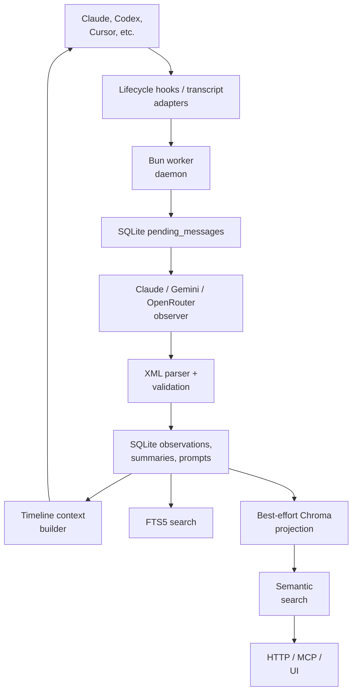

## 1. Executive Summary

Claude-Mem is a local-first memory sidecar for coding agents. Lifecycle hooks
capture prompts and tool activity, a background observer compresses queued
events into structured observations and session summaries, SQLite remains the
canonical store, and Chroma supplies an optional semantic projection.

Its best idea is operational: the hook path durably queues work and degrades
without blocking the coding agent. Compression can fail, the vector projection
can lag, and the observer can restart while the raw queue and canonical rows
remain inspectable.

The name understates its current scope. The repository includes integrations
for Claude Code, Codex, Cursor, Windsurf, OpenCode, OpenClaw, and other agent
surfaces, plus local HTTP/MCP access, optional cloud synchronization, and an
emerging authenticated server mode.

Claude-Mem is not a general belief or knowledge-graph system. It stores useful
LLM-written accounts of work, reinjects a recent project timeline, and exposes
search. Those observations have source/session metadata but no
candidate/verified/rejected truth state.

The inspected package version is `13.12.4` (2026-07-23).


## 2. Mental Model

The core pipeline is:

```text
agent lifecycle hooks
    -> durable pending_messages queue
    -> observer model
    -> XML observations + session summary
    -> canonical SQLite rows
    -> optional Chroma and cloud projections
    -> project-scoped search or bounded timeline injection
```

An observation is not the raw tool event. It is a compressed interpretation
with a type, title, narrative, facts, concepts, and file evidence. The queue is
the recoverable work ledger; SQLite is the local source of truth; Chroma is a
rebuildable semantic index.

Two session identifiers distinguish the host conversation from the observer
model's memory session. Project and platform source provide the main retrieval
boundaries.


## 3. Architecture



The worker owns local session lifecycle, capture, generation, storage, search,
context, and synchronization. `SessionStore` contains a long migration chain;
`DatabaseManager` composes SQLite, Chroma, and optional cloud sync.

A newer server-owned schema introduces projects, agent events, memory items,
sources, teams, API keys, and audit log. `docs/server-storage-boundary.md`
explicitly says this is additive: legacy observations remain the worker search
source of truth until a future backfill and reader switch.


## 4. Essential Implementation Paths

Capture and generation:

- `src/cli/hook-command.ts` and integration installers: host event entry points.
- `src/services/worker/SessionMessageBuffer.ts`: event buffering.
- `src/services/sqlite/SessionStore.ts`: durable queue and canonical tables.
- `src/services/worker/ClaudeProvider.ts` and
  `OpenAICompatibleProvider.ts`: observer execution and retry behavior.
- `src/services/worker/agents/ResponseProcessor.ts`: XML validation, canonical
  storage, acknowledgement, and projection fan-out.

Retrieval and injection:

- `src/services/worker/search/SearchOrchestrator.ts`: strategy selection.
- `src/services/worker/search/strategies/SQLiteSearchStrategy.ts`: lexical and
  filter search.
- `src/services/worker/search/strategies/ChromaSearchStrategy.ts`: semantic
  retrieval and SQLite hydration.
- `src/services/context/ContextBuilder.ts`: read-only project timeline.
- `src/services/context/ObservationCompiler.ts`: scoped observation and summary
  queries.

Privacy, deletion, and transition:

- `src/utils/tag-stripping.ts`: private and protocol-tag stripping.
- `src/services/worker/validation/PrivacyCheckValidator.ts`: prompt-level
  suppression.
- `src/services/worker/http/routes/DataRoutes.ts`: transaction-aware local and
  synchronized deletion.
- `src/services/sync/ChromaSync.ts`: projection repair and backfill.
- `src/storage/sqlite/schema.ts`: future server-owned schema.


## 5. Memory Data Model

The active local model centers on:

- `sdk_sessions`: content session, memory session, project, platform, and
  lifecycle metadata.
- `user_prompts`: privacy-stripped prompt text and prompt number.
- `pending_messages`: queued observation or summary work with tool input/output
  and processing status.
- `observations`: type, title, subtitle, facts, narrative, concepts, files read
  and modified, model fields, timestamps, and content hash.
- `session_summaries`: request, investigation, learning, completion, next steps,
  notes, and timestamps.
- `observation_feedback`: user feedback over derived observations.

SQLite foreign keys link observations and summaries to memory sessions.
Content hashes deduplicate near-simultaneous reprocessing. The code derives file
write evidence from actual tool payloads and overwrites model-proposed modified
file lists, a useful example of deterministic evidence outranking generated
metadata.

The future `memory_items` / `memory_sources` model is not yet a replacement for
these tables and should not be treated as the current canonical path.


## 6. Retrieval Mechanics

Filter-only queries use SQLite. When Chroma is configured, ordinary text queries
use semantic search, then hydrate result IDs from SQLite. Platform-scoped empty
semantic results can fall back to SQLite.

This is not general hybrid fusion. `HybridSearchStrategy` is used for
file-oriented lookup: SQLite produces metadata candidates and Chroma reranks
their intersection. When Chroma is absent, the main orchestrator does not
automatically run lexical search for a non-empty query; when a Chroma query
throws, the orchestrator wraps the failure as `ChromaUnavailableError` rather
than transparently falling back.

SQLite supplies FTS5 indexes for observations, summaries, and prompts. Search
supports project, platform, type, concept, file, and date filters.

Automatic session-start context uses a different path. `ContextBuilder` reads
recent project-scoped observations and summaries, filters configured types and
concepts, and renders a chronological timeline with only a small number of full
observations. It is bounded progressive disclosure, but it is primarily
recency/configuration driven rather than query-specific semantic retrieval.


## 7. Write Mechanics

Hooks enqueue prompt and tool activity into `pending_messages`. The observer
claims a batch and generates XML. `ResponseProcessor` then:

- Classifies quota and authentication failures and restores claimed messages to
  pending.
- Treats ordinary non-XML prose as a confirmed no-op to prevent retry loops.
- Defers storage when the memory-session identifier is not ready.
- Parses valid observations and summaries.
- Replaces model-reported modified files with deterministic tool evidence.
- Stores canonical rows in SQLite.
- Acknowledges the queue only after canonical storage.
- Starts Chroma and cloud synchronization outside the canonical transaction.

Chroma failure is logged and tolerated, so capture survives without vector
search. Content-hash deduplication prevents repeated rows from hook retries.

The tradeoff is explicit: a valid parse with no observations can clear a batch,
and a non-XML low-signal response is intentionally dropped rather than retried
forever. Durable queues prevent accidental loss from crashes, not every
semantic loss from the observer.


## 8. Agent Integration

The project hooks setup, session start, prompt submission, tool use, stop or
summary, and session end. It can capture without asking the primary agent to
remember explicitly and reinject context automatically on a later session.

Local MCP exposes search, timeline, observation lookup/addition, session-start
context, semantic context, progressive smart-search operations, and corpus
tools. The server recall MCP intentionally offers a smaller search, context,
and recent surface.

Multiple adapters normalize host-specific transcripts and platform sources into
the same local model. Worktree/project adoption helps related coding sessions
share context, but it also means project naming is part of the isolation policy
and must be tested carefully.


## 9. Reliability, Safety, and Trust

Strengths:

- A durable SQLite queue separates hook latency from model compression.
- Provider authentication and quota failures preserve the claimed batch.
- SQLite is canonical; Chroma is a best-effort, repairable projection.
- Canonical storage happens before queue acknowledgement.
- Content hashes and tool-use IDs reduce duplicate capture.
- `<private>...</private>` and internal protocol blocks are stripped before
  generation and persistence.
- Context reads open SQLite read-only with a busy timeout.
- Synchronized deletion refuses to strand acknowledged replicas when cloud
  identity is unavailable.
- Project, worktree lineage, and platform source constrain most reads.

Limitations:

- Tag stripping is syntax-based and cannot guarantee secret detection.
- A missing prompt row fails open to avoid freezing a session after a startup
  race; this is availability-favoring behavior, not a privacy proof.
- Generated observations become active context without verification.
- Ordinary semantic search can fail when Chroma is unavailable even though FTS
  data exists.
- Local mode assumes a trusted user boundary; server authentication is a
  separate, evolving surface.
- The additive server schema creates two memory models during a transition.


## 10. Tests, Evals, and Benchmarks

The inspected tree contains 237 TypeScript test files. Coverage includes hook
lifecycle, transcript adapters, queue recovery, context rendering, privacy,
schema migration, foreign keys, Chroma synchronization, cloud sync, API
endpoints, provider error classification, installer behavior, and server
storage contracts.

The source suite was not run for this atlas review because it requires Bun and
several optional services. No committed end-to-end memory-quality benchmark was
found. Token-economics telemetry measures compression and context volume; it
does not establish recall correctness or factual accuracy.

The test breadth supports an operational-maturity claim. It does not validate
the observer's facts, the ideal context mix, or general retrieval quality.


## 11. For Your Own Build

### Steal

- Durable hook capture before LLM work.
- Canonical relational rows plus rebuildable semantic projections.
- Acknowledge queue work only after canonical persistence.
- Distinguish retryable provider failures from intentional no-op output.
- Derive file mutations from tool evidence, not model narration.
- Render compact timelines and expand only selected observations.
- Make privacy suppression visible and test race behavior explicitly.
- Refuse a local delete that cannot be replicated safely.


### Avoid

- Calling semantic-or-lexical fallback “hybrid” when ranks are not fused.
- Automatically activating generated observations as trusted instructions.
- Letting project-name heuristics carry more isolation responsibility than
  explicit stable project IDs.
- Maintaining a large schema migration chain without continuously exercised
  recovery tests.
- Adding a second canonical-looking memory model before readers have migrated.
- Treating compression savings as evidence of memory quality.


### Fit

Borrow Claude-Mem when the product is a coding agent and reliable lifecycle
capture matters more than a general-purpose knowledge model. Its queue,
canonical/projection split, transcript adapters, privacy tags, context renderer,
and recovery behavior would be expensive to reproduce well.

Build a smaller path when explicit memory writes are acceptable or when the
environment lacks stable hooks. The reusable minimum is durable event capture,
asynchronous compression, source-linked observations, lexical fallback,
bounded context, and exact deletion.

Before using observations for consequential automation, add trust state and
source display. Also change ordinary semantic search to degrade to FTS when
Chroma is unavailable if availability is more important than ranking
consistency.


## 12. Open Questions

- When will `memory_items` replace legacy observations, and how will the switch
  avoid dual-write divergence?
- Should a failed Chroma query fall back to FTS automatically?
- How are generated claims corrected or marked rejected so they do not return?
- Can context selection incorporate a current-task query without losing its
  predictable recent timeline?
- What stable identity replaces project-name and worktree heuristics in shared
  deployments?
- Which observer quality benchmark will detect lossy or fabricated summaries?


## Appendix: File Index

- `src/services/sqlite/SessionStore.ts`: canonical schema, migrations, queue.
- `src/services/worker/agents/ResponseProcessor.ts`: generated-output commit.
- `src/services/worker/SessionMessageBuffer.ts`: durable capture buffer.
- `src/services/worker/search/SearchOrchestrator.ts`: search selection.
- `src/services/worker/search/strategies/HybridSearchStrategy.ts`: file lookup.
- `src/services/context/ContextBuilder.ts`: context assembly.
- `src/services/context/ObservationCompiler.ts`: project-scoped reads.
- `src/utils/tag-stripping.ts`: privacy and protocol stripping.
- `src/services/worker/validation/PrivacyCheckValidator.ts`: privacy decision.
- `src/services/worker/http/routes/DataRoutes.ts`: deletion routes.
- `src/services/sync/ChromaSync.ts`: vector projection and repair.
- `docs/server-storage-boundary.md`: active/future schema boundary.

## History

**2026-07-27** — [`132b46343e60ecf4057c427736c57b08f7615dfe`](https://github.com/thedotmack/claude-mem/commit/132b46343e60ecf4057c427736c57b08f7615dfe) — first reading.
