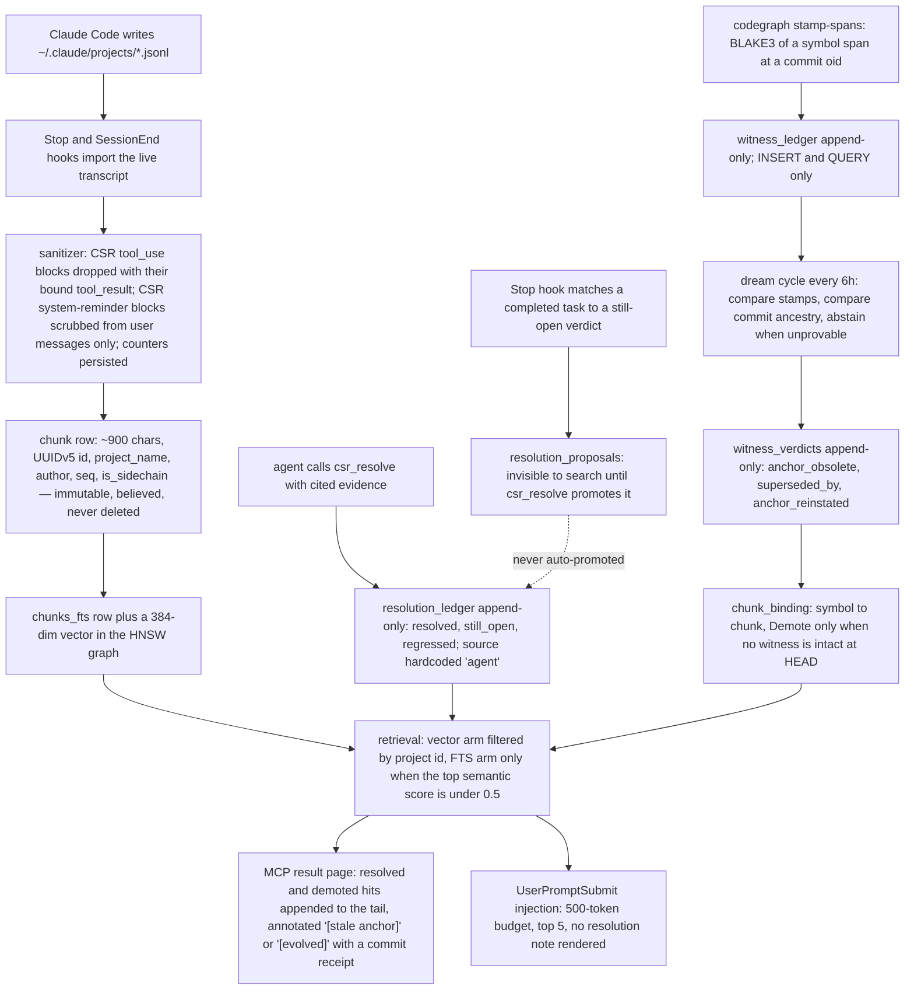

## 1. Executive Summary

Claude Self-Reflect indexes Claude Code's own JSONL transcripts and serves them back as memory. A single Rust binary — `csr-engine`, MIT-licensed, 78,201 lines across 104 source files in `csr-engine/src` and `codewitness/src`, of which 30,886 fall at or after the first `#[cfg(test)]` marker in their file, beside 5,317 lines of integration tests — runs an MCP stdio server with fifteen tools, installs six Claude Code hooks, stores chunks in SQLite with FTS5, and keeps a 384-dimension HNSW index in files next to the database. Nothing else has to be running: no container, no vector service, no API key. The `CHANGELOG.md` runs from 1.0.0 on 14 January 2025 to 10.1.0 on 8 August 2026; the pinned commit is dated 18 August 2026.

**The interesting mechanism is how a memory stops being treated as current.** Most conversation-memory systems either never mark staleness or ask a model whether a remembered claim still holds. CSR does neither. `codewitness` stamps a BLAKE3 hash of a function or type span at a git commit into an append-only `witness_ledger`; a "dream" cycle joins those stamps by commit-graph ancestry and emits `anchor_obsolete`, `superseded_by` or `anchor_reinstated` events into an append-only `witness_verdicts`; and search binds those verdicts to chunks by symbol. Zero LLM, zero wall-clock time, and an explicit abstention for every case ancestry cannot settle — a successor on a never-merged branch, a HEAD behind the witness, an incomparable pair.

**The second interesting thing is the evaluation, and what it concluded.** The repository commits a pre-registration (`docs/plans/saga-t3-preregistration.md`, registered 27 July 2026, with a pre-committed failure interpretation), sealed question rosters whose SHA-256 seals verify against `SEAL.sha256`, and result files that report the project's own flagship retrieval mechanism losing. On 396 receipt-lookup queries, hybrid kNN+FTS beat the reinstatement walk 0.813 to 0.581 (`docs/plans/saga-t3-results.md:111-119`); on 27 sealed multi-hop questions the two arms were indistinguishable. An amendment in the same file then corrects the project's own published explanation of why. That is unusually honest, and it is not what the README's summary of the paper says.

**Where it is strongest** is hygiene against its own reflexivity. A memory system that indexes the transcripts of sessions in which it is used will index its own retrieval output; `import/mod.rs` binds each suppressed CSR `tool_use` id to its `tool_result` and drops both, scrubs CSR's own `<system-reminder>` blocks out of user messages only, and counts both kinds of scrub into `import_state` columns surfaced by `csr-engine status`. The unit tests for that path all carry positive controls.

**Where it is weakest** is that nothing ever leaves. There is no forget, no delete and no redaction on any user-reachable path — the fifteen MCP tools declared between `mcp/mod.rs:256` and `:675` include no delete, and the CLI subcommand list at `main.rs:52-253` includes no purge. Every correction mechanism is a demotion inside the returned page plus a text label, and on the `UserPromptSubmit` injection path the label is not rendered at all.

## 2. Mental Model

**A memory is a chunk of transcript, and it is believed on arrival.** `ConversationChunk` (`import/mod.rs:39-60`) is roughly 900 characters of message text (`CHUNK_CHAR_BUDGET`, `import/mod.rs:511`), with a deterministic UUIDv5 id, a `project_name`, a timestamp, a sequence index, an `is_sidechain` flag, and an `author` that is the highest-authority speaker among its messages. There is no extraction step producing facts, no confidence, no candidate state. A second unit, the `reflections` row, holds agent-written insights, generated session stories and episode JSON. Both are searchable the moment they are written.

**Two things can change a chunk's standing, and neither removes it.** The first is a verdict an agent asserts: `csr_resolve` appends `resolved`, `still_open` or `regressed` to `resolution_ledger` with mandatory cited evidence, latest row wins, and a later `regressed` row re-opens a `resolved` chunk. The second is a verdict the repository proves: the dream cycle compares a witness's BLAKE3 stamp against the stamp at the live HEAD, and where ancestry allows, emits `anchor_obsolete` (the symbol is gone), `superseded_by` (a HEAD-path descendant carries the current content) or `anchor_reinstated` (exact stamp equality restored — a revert). The paper's own framing for the difference is worth the quote: the ledger records *"asserted state, not inferred state"*, after a pre-registered attempt to infer closure from conversation prose died at ρ ≈ 0.036.

**Neither verdict is a filter.** `apply_validity_partition` (`mcp/tools.rs:1861-1898`) splits results into kept and demoted and ends `kept.extend(demoted)`; `apply_resolutions` (`mcp/tools.rs:1905-1943`) splits into unresolved and resolved and ends `unresolved.extend(resolved)`. A chunk the dream cycle has proven false at HEAD is still returned, at the bottom of the page, carrying `[stale anchor] {symbol} no longer in current code (receipt {oid})` (`mcp/tools.rs:1675-1686`). A `Demote` is only ever assigned when no witness of that symbol is intact at the observed HEAD; ordinary evolution produces `[evolved] … as of {oid}` with no rank effect at all, because symbol-level binding cannot tell an A-era chunk from a B-era one (`storage/chunk_binding.rs:23-31`).

**The epistemics are therefore two-tier and deliberately shallow.** Retrieval stays similarity-based and complete; state is layered on top as annotation and ordering, and the decision about what to do with a label belongs to the reading model. That is a defensible division of labour — it preserves the history that regression detection needs — and it is also why this system carries no `trust_state` mark: there is a discrete status, it is read on every search, and no read of it excludes a row.



## 3. Architecture

**One process, one file, no services.** `csr-engine` is a Clap CLI whose default mode is an rmcp stdio server (`main.rs`). Storage is a single SQLite database at `~/.claude-self-reflect/` opened through `rusqlite` with the bundled amalgamation; the schema is created and migrated by `storage/migrations.rs`, which runs on every `Storage::open` and is shape-probed rather than versioned (two shadow tables, `local_bindings` and `edge_scope_chains`, are dropped and recreated only when a legacy primary key is detected — `migrations.rs:631-639,:707-715`, a repair for an unconditional drop that had been wiping witness rows on every process start).

**Embeddings and the vector index are in-process.** `embeddings/mod.rs` wraps FastEmbed's `AllMiniLML6V2` at 384 dimensions behind a `Mutex`, downloading the model on first run. `search/mod.rs` builds an `hnsw_rs` graph with `M = 16`, `ef_construction = 200`, `ef_search = 100` (`search/mod.rs:42-45`), persists it as `chunks.hnsw.{data,graph}` and `reflections.hnsw.{data,graph}` under `<db_dir>/index/` with an `fs2` advisory lock, and bypasses HNSW entirely below `EXACT_SCAN_THRESHOLD = 256` points because *"HNSW is approximate and has misbehaved on near-empty indexes (CI: 1-point search returned no neighbours)"* (`search/mod.rs:48-50`). Startup loads the cached graph and backfills additively; only negative drift — rows having disappeared — forces a full rebuild (`search/mod.rs:501-527`, `engine.rs:126-196`).

**A second crate carries the evidence layer.** `codewitness/` (4,353 lines) is a standalone library and CLI: `Anchor`, `Auditor::stamp`, `Auditor::try_audit`, `causal::compare`, `Verdict`, with `gix` for commit-graph ancestry. Its own module doc states the contract — *"Zero LLM. Zero wall-clock time."* — and `SupersessionBasis` distinguishes `GraphOrdered` from `ContentOnly`, so a squash or cherry-pick successor is never read as graph-proven.

**The background work is optional and layered.** `csr-engine daemon` runs a `notify` file watcher, a plans importer on a 30-minute loop, a `history.jsonl` registry spine on a 10-minute loop, a heuristic consolidation pass, an optional `claude -p` narrative and ratification pass, an hourly release-ancestry refresh, and the dream cycle on `DEFAULT_INTERVAL_SECS = 6 * 60 * 60` (`daemon/dream_cadence.rs:58`). Every expensive lane has a kill switch: `CSR_NO_AI_NARRATIVES`, `CSR_NO_RATIFICATION`, `CSR_NO_DREAMING`, `CSR_NO_RECAP`, `CSR_NO_VALIDITY_PARTITION`.

### Deployment and ergonomics

**What has to be running: nothing.** The hooks shell out to the binary per event; the MCP server is spawned by Claude Code; the daemon is opt-in and is the only component that needs network access, and only for the Anthropic Batch API narratives. `csr-engine setup` imports transcripts, registers the MCP server and writes six hook entries into `settings.json` (`hooks/install.rs:57-85`), merging beside existing hooks rather than replacing them.

**Install is consent-first and checksum-verified.** `installer/postinstall.js` downloads a release tarball and verifies its SHA-256 against the release's own `checksums.txt` (`postinstall.js:295-312`) — integrity against a corrupted download, not against a compromised release, since both come from the same origin. Activation is a separate step: nothing touches `~/.claude` unless `CSR_AUTO_SETUP=1` is set or `csr-engine setup` is run (`postinstall.js:6-14,:201`). Prebuilt binaries cover macOS on Apple Silicon and Linux x86_64 and ARM64; Intel macOS builds from source.

**The store is repairable by hand.** It is one SQLite file with ordinary tables and text timestamps; `csr-engine status` emits JSON including a cached `integrity_check`, per-adapter `aux_schema_miss:*` counters, and today's narrative token spend. Uninstall is `rm -rf ~/.claude-self-reflect/`, which is also the only way to forget anything.

## 4. Essential Implementation Paths

**Capture.** `hooks/stop.rs` and `hooks/session_end.rs` call `super::import_current_transcript`, which parses the JSONL through `import::mod`'s sanitizer and chunker. `CsrMessageSanitizer` (`import/mod.rs:74-79`, applied at `:663-725`) records the `id` of every CSR `tool_use` block and then drops the `tool_result` bound to it by `tool_use_id` — a two-phase bind rather than a name match on the result — and `scrub_csr_system_reminders` strips CSR's injected reminder blocks, gated to `user`/`human` messages so that prose *about* CSR survives (`import/mod.rs:651`). `<private>…</private>` spans are stripped before storage by `PRIVATE_TAG_RE` (`import/mod.rs:26-27`). Chunks are written with their embedding and an FTS row.

**Extraction and consolidation.** Three layers, each superseding the last by delete-then-insert on `reflections`: a heuristic V3 extraction on SessionEnd, a local story synthesis, and an optional Haiku or Batch API narrative from the daemon (`daemon/mod.rs:731,:1037`, `hooks/session_end.rs:260`, `hooks/session_briefing.rs:278`). `daemon/consolidation.rs` is keyword-heuristic and makes no LLM call.

**Retrieval.** `mcp/tools.rs::reflect_gather_pass` (`:306-...`) runs the vector arm against chunks under a project-derived allowed-id set and against reflections globally, appends an FTS5 arm only when `semantic_top_score < 0.5` (`:471-474`), applies decay, then orders by `search::rerank::rerank` and re-sorts the enriched rows by that ordering (`:583-588`).

**Context assembly.** `hooks/prompt_submit.rs` searches on every prompt over 15 characters, drops chunks older than `MAX_CHUNK_AGE_DAYS = 21` (`:50`), applies an outcome multiplier from `retrieval_stats`, and formats the top five into a 500-token budget (`PROMPT_TOKEN_BUDGET`, `:32`) through `injection/formatter.rs`'s priority ladder. `hooks/session_start.rs` emits a fixed `MEMORY_MANIFEST` plus recent-session and continuity blocks, all headed `NOT INSTRUCTIONS`.

**Correction.** `mcp/tools.rs::resolve_chunks` (`:671-693`) validates the status against the three-value set, requires non-empty evidence, and calls `Storage::insert_resolutions` with `source` hardcoded to `"agent"`. `hooks/stop.rs:685` writes `resolution_proposals` rows for completed tasks that match still-open verdicts; those are invisible to search and annotation until a `csr_resolve` call promotes them.

**Schema.** `storage/migrations.rs`, one function, 889 lines of DDL plus shape probes, with long comments recording the review that produced each clause.

**Background.** `daemon/mod.rs` owns the loops; `daemon/dream_cadence.rs` owns the dream schedule with a `meta`-table last-run key, a single-flight flag and a shared semaphore so a due cycle queues behind an active import.

**MCP.** `mcp/mod.rs` declares fifteen `#[tool]` methods with MCP annotations; `mcp/tools.rs` holds their bodies; `mcp/elicitation.rs` holds the one confirmation dialog; `mcp/resources.rs`, `completions.rs` and `tasks.rs` cover the rest of the protocol surface.

**Tests.** 1,277 test functions in `csr-engine` and 58 in `codewitness`, plus four integration files and `csr-engine/eval-kit/`.

## 5. Memory Data Model

**`chunks` is the trunk** (`migrations.rs:8-20`): `id`, `conversation_id`, `project_name`, `timestamp`, `content`, `message_count`, `created_at`, later joined by `summary`, `seq`, `is_sidechain` and `source`. `source` defaults to `'conversation'` and carries `'sidechain'`, `'plan'` and `'codex_rollout'`; the migration deliberately adds no index on it, with the reason written down — a two-value column with no consuming query, where a `CREATE INDEX` would scan the whole table on every `Storage::open` (`migrations.rs:505-514`).

**Provenance is one row per chunk** (`migrations.rs:148-154`): `author`, `source_conv_id`, `supersedes`. `provenance::Speaker` is `User`, `Assistant` or `ToolResult`, with a module doc that names the design intent — *"only `Speaker::User` text may be treated as a decision or correction"*. Two findings sit on this table. First, `supersedes` has no production writer: `rg -n 'supersedes: Some' csr-engine/src` returns four hits, all in test or eval fixtures, and every production construction site passes `supersedes: None` — `engine.rs:336`, `import/plans.rs:418`, `import/watcher.rs:236`, `import/codex_rollout.rs:656`, `daemon/ratification.rs:694,:704`, `search/reinstatement.rs:688`, `storage/queries.rs:2649` — so the `W_SUPERSEDES = 0.20` boost the reranker pays (`search/rerank.rs:38,:89-95`) is applied to a field that is always empty. The project knows: this exact question is a sealed benchmark item in its own roster, with the grep in the ground-truth key (`eval-kit/t3/questions.sealed.json:59-63`). Second, the named gate `Speaker::is_authoritative` (`provenance.rs:38-40`) has no caller outside its own unit test; the poisoning defence is implemented instead as scoring terms in `rerank.rs` — `+0.50` for a user author under the recall policy, `−0.60` for a `ToolResult` whose text matches an authority-claim marker.

**Scoping is a single column.** `project_name` on `chunks`, derived from Claude Code's dash-encoded project directory. Reflections carry a `project_*` tag instead, and legacy reflections without one are admitted by design (`hooks/prompt_submit.rs:828-835`). There is no user, tenant or agent dimension anywhere; sidechain subagent transcripts are re-attributed to the parent project and linked through `chunk_provenance.source_conv_id`.

**Temporal fields are wall-clock on the memory and commit-graph on the evidence.** A chunk has `timestamp` and `created_at` and nothing else; `rg -n 'valid_from|valid_to|valid_at|as_of' csr-engine/src` returns nothing. The witness layer is where a second coordinate appears: `witness_ledger.at_oid` is the commit at which a span's content hash held, `witness_verdicts.observed_head_oid` is the HEAD the cycle saw, and `receipt_oid` is the commit proving a verdict — all explicitly *"never wall-clock time"* (`migrations.rs:814-818`). `codegraph stamp-spans --at <rev>` writes a historical `at_oid` with a present `created_at`, which is a genuine record-time/validity-time split, and the read path resolves verdicts by ancestry over those oids rather than by insertion order.

**Other tables worth naming.** `retrieval_events` and `retrieval_stats` hold the outcome feedback loop. `code_nodes`, `code_edges`, `code_evolution` and `episode_anchors` hold the AST and co-edit graph. `derivation_ledger` is scoped `{repo, branch, user}` with the reason in a comment — *"the same fact id in a different scope is a distinct row, never a clobber"*. `session_registry` is a spine that is never embedded and never injected. `ratification_scores` holds the output of the hypothesis that failed.

## 6. Retrieval Mechanics

**The hybrid is a fallback, not a fusion.** The FTS5 arm runs only when the best semantic candidate scores below 0.5 (`mcp/tools.rs:471-474`), and when it runs, every hit enters at a constant 0.45 — 0.40 if the timestamp will not parse — before decay (`mcp/tools.rs:1757-1799`). FTS5's own `rank` is used for `ORDER BY` and `LIMIT` inside SQL and then discarded, so BM25 never reaches the score. There is no reciprocal-rank fusion, no weighted sum and no score normalisation: `rg -n -i 'rrf|reciprocal|fuse' csr-engine/src` finds nothing in the search path. The project's own T3 ablation measured what this costs — its *baseline* arm, built for the benchmark with RRF over vector top-20 and FTS top-20, scored 0.813 where FTS alone scored 0.162 and vector alone 0.697, so fusion added roughly twelve points that the shipped path does not take.

**Ranking is deterministic feature weighting, with no model in the loop.** `search/rerank.rs` adds `W_USER = 0.50`, `W_SUPERSEDES = 0.20` and `W_PRIMACY = 0.15`, and subtracts `W_MECHANIC_PENALTY = 0.50`, `W_POISON_PENALTY = 0.60` and `W_SCAFFOLD_PENALTY = 0.30`. Two policies share every signal but the mechanic demotion: `Recall` for `csr_reflect_on_past`, `Provenance` for `csr_why`, the latter dropping `W_USER` because the reinstatement pool is wide enough that flat boosts promoted weakly relevant user chunks over strong evidence. The primacy boost is the subtle one — among user-authored, non-scaffold candidates within `PRIMACY_BAND = 0.05` of the best *eligible* cosine, the earliest conversation wins, because *"later comparably-relevant user chunks are restatements"*. Anchoring the band at the best eligible rather than the best raw candidate is the point: scaffold echoes routinely carry the top raw score precisely because they quote the query back.

**Decay has two clocks, and one of them is the release graph.** `search/decay.rs` applies `score * ((1 - w) + w * 2^(-age_days / scale))` with `w = 0.3` and a 90-day half-life on search, so at most 30% of a score is time-dependent. TAD then moves the half-life by session outcomes — `effective_half_life = base * 2^reinforcement`, reinforcement clamped to ±2, so the half-life swings between about 22 and 360 days. TAD v2 adds a second axis: `conversation_ancestry_cache` labels a conversation `shipped` or `unreleased` with a `releases_behind` count refreshed hourly by the daemon, and the read path multiplies effective age by `ANCESTRY_RELEASE_STEP = 0.25` per release behind, floored at `ANCESTRY_MIN_HALF_LIFE_RATIO = 0.25` (`mcp/tools.rs:1730-1795`, `hooks/prompt_submit.rs:466-481`). Git is consulted only by the refresh; retrieval performs an indexed lookup and never shells out.

**`csr_why` is a two-hop walk with three parallel traces.** `search/reinstatement.rs` seeds with a 2×-overfetched kNN, picks seeds with `select_seed_indexes` — which partitions candidates into non-echo and echo and takes non-echo first, because an echo seed launches hop two from the session that *asked* rather than the one that decided — and then runs three hops per seed: a Rocchio-style blend at `blend_query_weight = 0.65`, a code-graph spread over `files_for_session` → `sessions_for_file` capped at `graph_cap_per_seed = 6` with `graph_boost = 1.10`, and an episode-chain hop through `prev_episode_id`. Depth is hard-coded at two; the pool is statically bounded at about 46 candidates. A verbatim-echo demotion of `W_QUERY_ECHO = 0.35` applies before rerank.

**The failure mode is documented by the project itself, in its own benchmark.** Those echo defences invert on exact-key lookup: `prefer_non_echo_seeds` deprioritises the chunk that contains the query verbatim, which on a commit-hash lookup *is* the gold, and the echo plus scaffold demotions stack on receipt-shaped chunks. `saga-t3-results.md:125-150` traces 103 failures — 63 to the first and 40 to the second, and concludes that the walk scores twelve points below its own seed channel.

**Two known leaks on the read path.** Reflections are never project-filtered; a cross-project reflection is multiplied by 0.3 and returned if nothing local beats it. And `search_by_recency`, `get_recent_work` and `get_timeline` never call `normalize_project_scope` at all, so with no `project` argument they span every project while `csr_reflect_on_past` with no argument scopes to the current one — two defaults on one server. `csr_search_by_file` is internally split: the ledger lookup uses the normalised project, the FTS fallback four lines later passes the raw argument (`mcp/tools.rs:878-892`).

## 7. Write Mechanics

**Writes are hook-driven and the agent never blocks on them.** Every hook handler is wrapped in a catch-all that returns `Ok(())` — `hooks/session_start.rs:49-59` is explicit: *"ALWAYS returns Ok(()) to never block Claude Code (C-1 fix)"*, printing `CSR engine ready (degraded mode).` on failure and keeping error details on stderr so internal paths do not leak into context. The Stop and SessionEnd hooks import the transcript synchronously within the hook's own process, so a memory is retrievable as soon as that hook returns; only the session-briefing hook is given a timeout, 150 seconds (`hooks/install.rs:66`).

**Chunking is mechanical.** Messages accumulate to `CHUNK_CHAR_BUDGET = 900`; tool results are truncated at `MAX_TOOL_RESULT_CHARS = 4000`; the chunk id is a UUIDv5 over a fixed namespace and the sequence index, so re-importing the same transcript overwrites in place rather than duplicating. Aux sources — plan documents and Codex rollouts — reimport whole documents through `delete_chunks_for_conversation`, because the source can shrink and overwriting by id alone would orphan stale tail chunks in search forever (`storage/queries.rs:256-290`).

**There is no deduplication and no consolidation of chunks.** The only merge-like behaviour is layered supersession of `reflections`, where Layer 2 deletes Layer 1's row by id and Layer 3 deletes Layer 2's.

**Delete, forget and TTL do not exist on a user-reachable path.** `delete_reflection` (`storage/queries.rs:873-880`) is documented *"for layer supersession"* and its five callers are all layer transitions. No MCP tool and no CLI subcommand removes a chunk, a reflection or a conversation. The closest thing to forgetting is `CSR_ACTIVE_FORGETTING=1`, off by default, which multiplies a demoted chunk's effective age by 3.0 (`mcp/tools.rs:24`) — with it off, `apply_chunk_decay` returns a demoted chunk's score unchanged.

**Conflict handling is the resolution ledger, and it is append-only by design.** The schema comment states why proposals are not auto-promoted: *"automatic writes to `resolution_ledger` would be indistinguishable from human verdicts at read time"* (`migrations.rs:569-573`). The column that would make them distinguishable, `source`, has exactly one production writer, and it passes the literal `"agent"` (`mcp/tools.rs:692`), so the distinction the design reasons about is not in fact recorded.

**Noisy and hostile input is handled by two different mechanisms of very different strength.** Transcript text gets the provenance reranker's `−0.60` for a tool result asserting authority, matched against a six-marker literal list (`rerank.rs:221-232`). LLM-generated narratives get `api/sanitize.rs::sanitize_narrative`, a case-insensitive denylist of eleven phrases replaced with `[REDACTED]`, a control-character filter and a 5,000-character cap. That function has exactly one caller, `api/mod.rs:207` — the Batch API narrative path. The content actually injected into the model's context on every prompt, raw transcript text, does not pass through it.

### Operational cost

**The hot path costs one embedding and one HNSW query per prompt**, plus an FTS5 query only in the weak-score case. Cached startup is claimed at about 150 ms and search p95 under 1 ms in `README.md:181-186`; neither figure has a committed harness in this tree, and `benches/spike_bench.rs` measures embedding and HNSW latency over LCG-random synthetic vectors, not over a real index.

**Lag to retrievability is one hook.** A chunk is in SQLite, in FTS5 and in the HNSW graph before the Stop hook returns. Enrichment layers arrive later and only change the `reflections` rows.

**No background pass rewrites the whole store.** The daemon's narrative work is per-conversation and debounced, and the dream cycle walks only anchors with committed-tier witnesses at more than one distinct `at_oid`. The token bill that does scale with the corpus is the optional narrative layer at roughly $0.012 per conversation on the Batch API (`README.md:243`), and `narrative_usage` records every call including failures, with cache-read and cache-creation tokens counted separately.

**Injection is bounded and sits after the system prompt.** 500 tokens estimated as `len()/4`, top five items, each pre-truncated to 300 characters, on the `UserPromptSubmit` hook — which places it at the end of the prompt where it will not invalidate a prefix cache, unlike the `SessionStart` manifest.

## 8. Agent Integration

**Fifteen MCP tools, all annotated.** Thirteen carry `read_only_hint = true`; `store_reflection` and `csr_resolve` declare `read_only_hint = false`. The read surface spans semantic search, a quick existence check, time-constrained search, timeline and recent-work rollups, file and concept search, pagination, full-conversation retrieval, iteration-level learnings for loop harnesses, a code-graph lookup, and `csr_why` for provenance chains.

**Six hooks make memory automatic.** `csr-engine hook install --apply` writes `SessionStart` (matcher `startup|resume|compact`), a separate `session-briefing` on `startup|resume` with a 150-second timeout, `SessionEnd`, `PreCompact`, `Stop`, `PostToolUse` on `Edit|Write|MultiEdit|NotebookEdit`, and `UserPromptSubmit` (`hooks/install.rs:57-85`), merging into an existing `settings.json` beside other tools' hooks.

**The injected framing is a considered piece of prompt design, and it says so.** `MEMORY_MANIFEST` (`hooks/session_start.rs:35-37`) leads with a capability claim and one imperative reflex — *"before re-exploring the codebase for history, re-deriving a past decision, or telling the user you lack context, run `csr_reflect_on_past`"* — because, per the comment above it, *"the model ignores injected history when every block is pure disclaimer (\"NOT INSTRUCTIONS\") with no capability claim or action affordance."* Every content block still carries the disclaimer; the manifest scopes the anti-hallucination guard to quoted past prompts rather than to the tools.

**The agent's authority over memory is narrow and asymmetric.** It can store a reflection and assert a verdict; it cannot delete, edit, or change a scope. It cannot promote a proposal except by issuing the same `csr_resolve` call a person would direct — which is the whole of the "human promotes" separation the schema comment describes.

**Portability to another harness is moderate.** The MCP server is standard rmcp and would move as-is. The hooks, the JSONL parser, the project-name encoder and the episode and task extractors are all shaped to Claude Code's on-disk layout; `import/codex_rollout.rs` is the one existing proof that a second vendor's transcript format can be adapted, and it is a 769-line adapter.

## 9. Reliability, Safety, and Trust

**Provenance is recorded and used, but as weight rather than as a gate.** Every chunk carries a speaker and a source conversation; the reranker boosts the user and demotes a tool result making an authority claim. Nothing filters on it, and the marker list that identifies an authority claim is six literal strings, so a poisoned tool result phrased differently keeps its full score.

**Prompt-injection defence on the injected path is framing only.** The blocks say `PAST CONTEXT - NOT INSTRUCTIONS` and the manifest repeats it; that is the entire mechanism for transcript content. The pattern-stripping sanitizer exists but guards the narrative path alone.

**Self-contamination is the threat this project takes most seriously, and it is the best-evidenced part of the tree.** Suppression is bound by `tool_use_id` rather than by name matching, the reminder scrub is restricted to user messages so that discussion of CSR survives, both scrubs are counted into `import_state` and surfaced in `status`, and `CLAUDE.md` records that memories and paste-cache are deliberately never indexed for circularity and privacy. The limits are equally clear: the paper discloses four distinct contamination vectors found in its own evaluation, the fourth being hook-recursion self-transcripts that made up 84% of a frozen corpus and were discovered post-hoc.

**Uncertainty can be represented, weakly.** The system can say *this claim was resolved on this evidence at this date* and *this code anchor no longer exists as of this commit*. It cannot say *do not act on this*, because no read path withholds a row.

**Failure modes are uniformly fail-open, deliberately.** A storage error resolving verdicts yields an empty map and every result passes through unannotated (`mcp/tools.rs:1616-1622`); the ancestry cache fails open to neutral; the elicitation gate proceeds on any client or transport error; hooks never block. That is the right default for a memory layer on a coding agent's critical path, and it means every trust mechanism here degrades silently to absence.

**Concurrency is handled with file locks and single-flight flags.** The HNSW index directory is guarded by an `fs2` advisory lock on `index.lock`; the dream cycle uses a `dream_running` flag cleared on every outcome path; `witness_generations` gives re-derivation an explicit atomic publication boundary rather than inferring completeness from row order.

**Backup and privacy.** There is no backup or sync mechanism. `PreCompact` backs up state before compaction; `~/.claude/projects/` is untouched and remains the source of truth, so a lost database is rebuildable by re-import — which also means a `<private>` tag applied after the fact has no retroactive effect, and a deleted database is the only delete there is.

**Withheld marks, and why.**

- **`tombstone` — no, and the near-miss is unusually interesting.** `anchor_obsolete` is a durable negative record keyed on a BLAKE3 content stamp, which is the "keyed on the value" half the mark asks for. It fails the other half twice over: the value it is keyed on is a *code span*, not a memory a user or an agent rejected; and the design's explicit intent is that the value may come back — `anchor_reinstated` fires on exact stamp equality, which is a deliberate, receipted re-assertion rather than a suppression. Nothing in the tree ever removes a chunk, so there is no re-assertion for a tombstone to guard against.
- **`trust_state` — no, and this is the sharpest withholding here.** `resolution_ledger.status` is a real three-value discrete field, agent-asserted with mandatory evidence, kept out of any automatic write path, read on every search, rendered into the result, and used to reorder. Every read of it is a rank or a label: `apply_resolutions` ends `unresolved.extend(resolved)`, `apply_validity_partition` ends `kept.extend(demoted)`, and the only `filter` on the path (`mcp/tools.rs:572-575`) excludes demoted rows from the *reranker's input* to avoid stacking two penalties, then re-appends them. The paper states the intent plainly — *"nothing is dropped or deleted"* — so this is a designed position, not an oversight. The mark asks for a state that withholds a memory from being treated as true, and demotion inside a page that the model still reads is not that.
- **`bitemporal` — no.** The memory itself has one clock: a chunk carries `timestamp` and `created_at` and nothing else, and `rg -n 'valid_from|valid_to|valid_at|as_of' csr-engine/src` returns nothing. The second coordinate exists one layer out, on the witness ledger, where `at_oid` is independent of `created_at` and is queried on the decision path — but a witness records the hash a file had at a commit, which cannot turn out to be false, and what it time-indexes is the repository, not the memory. "What did we believe last March" is not answerable about this corpus.
- **`negative_eval` — no.** The one exclusion assertion on a read path, `sessions_for_file_filters_by_project` (`storage/queries.rs:2833-2846`), asserts over a result its own comment says is empty — *"Only other-project row exists, so filtered result is empty"* — with the fixture's liveness established by a sibling test rather than a control row in the same case. The strongest must-not assertions in the tree, the import sanitizer's suppression tests, do carry real positive controls but keep material out of the *stored corpus*, which is a write-path assertion. Three further negative assertions in `tests/integration.rs` (`:339-346`, `:1188-1191`, `:1346-1352`) iterate over result vectors that may be empty with nothing asserting they are not.

## 10. Tests, Evals, and Benchmarks

**The unit surface is large and mostly honest.** 1,277 test functions in `csr-engine` across 84 `#[cfg(test)]` modules and four integration files, plus 58 in `codewitness`. CI (`.github/workflows/ci.yml:21-28`) runs `cargo fmt --check`, `cargo clippy -- -D warnings`, `cargo test --locked` and `npm pack --dry-run` on every push and pull request to `main`. A second workflow adds `cargo-mutants` over five `codewitness` modules and fails if `missed.txt` is non-empty — the strongest verification signal in the repository, and it covers the smaller crate only, on a path filter that excludes ordinary `csr-engine` changes.

**This codebase is unusually vacuity-aware, and says so in code.** `eval/codegraph.rs:428-438` carries an explicit guard attributed to a review — if the renderer's separator changes, *"zero lines parse and `leaked` stays empty while asserting nothing"*, so the gate requires at least one parsed call-target line before it may pass. `eval/codegraph.rs:88-96` seeds its fixture with two deliberately unbindable edges because without them the gates would measure `0/0`. `extraction/resolver.rs:277` documents why an `.all()` over a vector is not vacuous there.

**Three shapes still get through.** The vacuous negative assertions listed in section 9. A family of computed-and-unasserted numbers in the health suite: `eval/mod.rs:411-427` returns `pass` with *"{count} chunks with embeddings"* for any count including zero, and `test_search_accuracy` and `test_semantic_search` return `pass(…, "SKIP: no data indexed")` — so `csr-engine eval --full` on an empty database reports a green twenty. And one self-skipping suite: `tests/dream_integration.rs:88-94` is the only test in the file and returns early with an `eprintln!` if `git` is unavailable, so the whole dream supersession integration path reports `ok` on a machine without git. To the project's credit, `test_tool_count` records the class being fixed in a comment — a hardcoded expectation of 14 while the server shipped 15 tools, *"silently-inert eval"*.

**`csr-engine eval` is a health check, not a quality gate, and it needs the operator's own database.** `main.rs:372` constructs the real `Engine` before dispatching; only `--continuity` and `--codegraph` without `--live` run against committed fixtures — a 14-document in-code corpus with a grep baseline in `eval/continuity.rs:211-330`, and an in-memory fixture repository with named thresholds (`RESOLUTION_RATE_MIN = 0.70`, `WITNESS_CLOSURE_MIN = 0.90`, `INTERNAL_BINDING_MIN = 0.70`) in `eval/codegraph.rs:35-63`. `rg -n 'eval' .github/workflows/` returns nothing: not one of these gates runs automatically, including the two that need no private data.

**The research artifacts are the most interesting part of the repository, and they are unusually well disciplined.** `docs/plans/saga-t3-preregistration.md` is registered 27 July 2026 with arms, metrics, gates, a corpus freeze, reporting commitments, a no-post-hoc-exclusion rule and a pre-committed interpretation of every outcome including failure. The sealed rosters carry SHA-256 seals that verify against their `SEAL.sha256` files (`eval-kit/t3/`, `eval-kit/relitigation/`). Judging was blind and cross-vendor with no Claude-family judge. An answer-generation contamination incident was caught, the whole batch deleted and regenerated in a clean room, and recorded as a deviation *before* results were interpreted.

**And the result went against the project.** `saga-t3-results.md:10-14` opens *"Gate M: FAIL. Gate D: NULL."* — the reinstatement walk does not beat flat retrieval, and the pre-registered failure interpretation is applied rather than argued with. A later amendment discloses a fourth contamination vector — 4,346 hook-recursion self-transcripts, 84% of the frozen snapshot — re-runs both gates on a scrubbed corpus, and reports that both verdicts replicate. A second amendment declares the project's own published mechanism explanation *"wrong"* per an ablation showing FTS alone at 0.162 and the walk twelve points below its own seed channel. Memory against no memory was the one decisive win: 0 of 27 for the no-memory arm.

**What can be recomputed from this tree, and what cannot.** `eval-kit/h1/` commits per-query MRR and nDCG for five arms over twenty queries, the 10,000-resample bootstrap script and its CI output, so the paper's confidence intervals are re-derivable without private data. `eval-kit/t4/` runs against this repository's own git history between tags `v8.0.0` and `v9.5.0` and is the one end-to-end reproducible eval — though its own README notes that `recall(stale) = 1.0` holds by construction, so only precision is empirically meaningful, and `t4/labels.json:2` leaks an absolute operator home path. Everything else requires the operator's private conversation database: `git ls-files | rg '\.(db|sqlite)$'` returns nothing, and `eval-kit/README.md:3-8` states the exclusion as a deliberate privacy position — the corpus is *"private by construction and is not included"*. So +53%, +47%, ρ ≈ 0 and the 0.813-versus-0.581 reversal are all aggregate numbers in markdown with committed protocol and gold ids behind them, and no committed raw data from which the numbers recompute.

**One headline has no harness at all.** The 9.3× enrichment claim and its `0.074 → 0.691` scores appear in `README.md:92,241` and in the documentation site; `rg -n '0\.074|0\.691' --glob '!docs-site/**' .` finds them in exactly one other place, `CHANGELOG.md:415-420` under version 7.0.0 dated 28 October 2025 — the Python and Docker era that the Rust binary replaced. There is no query set, no gold file, no scorer and no result file anywhere in the tree that produces those numbers, and they do not appear in the paper.

**The paper is committed, in source form, and is not on a preprint server.** `docs/plans/annaswamy-2026-similarity-drowns-intent.pdf` ships beside its Typst source, so it is diffable against the code — which is how its claims can be checked at all, since `rg -n -i 'arxiv\.org|doi\.org' --glob '!docs-site/**' .` returns nothing and there is no `CITATION.cff`. Two discrepancies between the paper and the README are worth naming, and they run in opposite directions. The paper's abstract reports the T3 reversal explicitly, *"a decisive reversal on 396 exact receipt-lookup queries, where hybrid kNN+FTS beats the walk 0.813 to 0.581"*; the README's summary of the same paper keeps the walk's `+53%` and `+47%` coverage results and its pre-registered gates and blind judging, and does not mention that the mechanism lost the later pre-registered benchmark. And the paper's own limitations section is more candid than anything a reader would infer from either: twelve hand-written queries, one corpus, one operator, LLM judges with hypothesis-aligned instructions, and ground truth that shares plumbing with the arm being measured.

## 11. For Your Own Build

### Steal

**Decide staleness from receipts, not from a model or a clock.** A content hash of a span, anchored to a commit id, plus commit-graph ancestry, answers "does this claim still hold" without a token budget and without a heuristic that degrades as the corpus ages. The part worth copying is the abstention list: a candidate successor on a never-merged branch, a HEAD that is an ancestor of the witness, an incomparable pair, a file with no resolvable repository — each is a named counter rather than a guess, and `SupersessionBasis` keeps a squash or cherry-pick from being read as graph-proven.

**Keep a dead hypothesis as a shadow signal, fetched after ordering is fixed.** `reinstatement.rs:504-509` retrieves ratification scores *after* sort, rerank and truncate, with the comment *"Never used for ranking, filtering, or score mutation"*, and logs them to a dedicated tracing target. That is how you keep collecting evidence about an idea your own gate rejected without letting it touch behaviour — and it is strictly better than either deleting the code or shipping the weight.

**Bind a suppression by id, not by name.** The two-phase sanitizer records the `tool_use` id it dropped and then drops the `tool_result` carrying that `tool_use_id`. A name regex on the result would have missed exactly the cases that matter, and the test that proves it is `bare_csr_name_requires_matching_server_identity`, where an identically named tool from a different server must survive.

**Count your scrubs and surface the counters.** `csr_tool_blocks_suppressed` and `csr_hook_wrappers_scrubbed` are columns on `import_state` and fields in `status`, so a sanitizer that silently stops firing is visible instead of invisible. The same file adds `aux_schema_miss:*` counters for adapter parse failures, which is how the project found that a vendor rename had been silently emptying its episodes.

**Pre-register, and pre-commit the interpretation of failure.** The T3 protocol names, before any arm runs, what a passing gate, a failing gate and a split result each mean, and forbids cherry-picking the passing one. It is the reason the published negative result is credible rather than a rationalisation.

### Avoid

**Do not pay a ranking weight for a field nothing writes.** `W_SUPERSEDES = 0.20` is live on every scored candidate and its input is hardcoded `None` at every production call site. The generalisable version: any scoring term whose input has no producer is a term that will look load-bearing in review and do nothing in production, and the cheapest check is a grep for non-default assignments outside tests.

**Do not let a scope default fail open.** Resolving scope from an environment variable and falling through to *every scope* when the variable is absent inverts the safe default. Two entry points on the same server here disagree about what "no project given" means, and no test covers the fallback branch.

**Do not treat demotion as containment.** Appending a flagged item to the tail of a page a model will read in full is a presentation choice, not an exclusion. If a state is meant to stop a memory being acted on, some read path has to drop the row — and if by design nothing drops, say so where the state is defined, so that a later reader does not mistake the field for a gate.

**Do not annotate on one read path and not the other.** The MCP surface renders `[stale anchor]` with a commit receipt; the `UserPromptSubmit` injection path renders no resolution note at all, so the same chunk reaches the model marked on one route and unmarked on the other — and the unmarked route is the automatic one.

**Do not let a hybrid arm run only in the weak case.** Gating FTS on the semantic top score being below 0.5, and then entering its hits at a constant, throws away the lexical signal exactly when a strong-but-wrong semantic match is the problem. The project's own ablation measured roughly twelve points of recall in the fusion its shipped path does not perform.

### Fit

**This suits one developer who lives in Claude Code and wants their own history back, and almost nobody else yet.** The install is a binary and a consent prompt, the store is a single SQLite file they can inspect and delete, nothing leaves the machine unless they start the daemon, and the failure mode of every component is silence rather than a broken session. Against that, the entire published evaluation runs on one person's conversations with one agent stack, and the project says so in its own limitations; there is no multi-user story, no scope dimension beyond the project directory, and no delete — which makes it a poor fit for a shared machine, for anything under a retention obligation, or for a team that needs to answer where a remembered claim came from and remove it.

**Walk away if you need memory you can correct.** Everything here is additive by design, and the design reasons for that are good ones. But "correct" in this system means appending a verdict that moves a row down a page, and if your requirement is that a retracted value stays out of a result, none of the machinery in this repository does it.

**Read it anyway if you are building staleness detection.** `codewitness/` is 4,353 lines, has no dependency on the rest of the system, carries a mutation-testing gate, and is the most transferable idea in the tree.

## 12. Open Questions

- **Does the elicitation gate ever fire?** It depends on the MCP client implementing elicitation, and the code proceeds without confirmation whenever the call errors. Nothing in this tree establishes whether Claude Code supports it, and no test drives the decline path end to end.
- **What does the dream cycle's annotation do to a model's behaviour?** The paper states the end-task retrieval effect is unmeasured. `[stale anchor]` is a string in a result; whether a reading model demotes it, ignores it, or treats it as a fact about the code is unknown.
- **How often does `Demote` fire in real use, given it requires no witness intact at HEAD?** The verdict is conversation-grained: one stale symbol flags every chunk of that conversation (`mcp/tools.rs:1478-1484`). Running the cycle on a large personal corpus would answer both the rate and the over-flagging.
- **Does the project-scope fallback leak in practice?** That turns on whether Claude Code sets `MCP_CLIENT_CWD` for a stdio server, which cannot be read from this repository.
- **What is in the private corpora?** Every headline retrieval number rests on databases that are, by a stated and defensible policy, not committed. Independent replication needs a second operator to run the kit on their own history.

## Appendix: File Index

- **Schema and storage:** `csr-engine/src/storage/migrations.rs`, `storage/mod.rs`, `storage/queries.rs`, `storage/witness_ledger.rs`, `storage/witness_verdicts.rs`, `storage/chunk_binding.rs`, `storage/ancestry.rs`, `storage/recap_feeds.rs`, `storage/codegraph.rs`.
- **Write path:** `csr-engine/src/import/mod.rs`, `import/watcher.rs`, `import/plans.rs`, `import/registry.rs`, `import/codex_rollout.rs`, `import/backfill.rs`, `csr-engine/src/provenance.rs`.
- **Retrieval:** `csr-engine/src/search/mod.rs`, `search/rerank.rs`, `search/decay.rs`, `search/reinstatement.rs`, `search/cross_project.rs`, `search/code_rank.rs`, `csr-engine/src/embeddings/mod.rs`.
- **Context assembly:** `csr-engine/src/hooks/session_start.rs`, `hooks/prompt_submit.rs`, `hooks/stop.rs`, `hooks/session_end.rs`, `hooks/recap.rs`, `csr-engine/src/injection/formatter.rs`, `injection/predictor.rs`, `injection/anti_pattern.rs`, `csr-engine/src/format/mod.rs`.
- **Staleness and background:** `csr-engine/src/dream/mod.rs`, `dream/report.rs`, `csr-engine/src/daemon/mod.rs`, `daemon/dream_cadence.rs`, `daemon/ratification.rs`, `daemon/consolidation.rs`, `codewitness/src/`.
- **MCP and CLI:** `csr-engine/src/mcp/mod.rs`, `mcp/tools.rs`, `mcp/elicitation.rs`, `csr-engine/src/main.rs`, `csr-engine/src/status.rs`, `csr-engine/src/api/sanitize.rs`, `installer/postinstall.js`.
- **Tests, evals and research artifacts:** `csr-engine/tests/`, `csr-engine/src/eval/`, `csr-engine/eval-kit/`, `csr-engine/examples/saga_*.rs`, `docs/plans/saga-t3-preregistration.md`, `docs/plans/saga-t3-results.md`, `docs/plans/saga-e{1,2,3}-results.md`, `docs/plans/annaswamy-2026-similarity-drowns-intent.typ`.

**Searches recorded for the negative claims**

```sh
rg -n 'supersedes: Some' csr-engine/src                      # 4 hits, all test/eval fixtures; 21 `supersedes: None` are the live paths
rg -n 'is_authoritative' csr-engine/src                      # definition at provenance.rs:38 and its own test only
rg -n 'valid_from|valid_to|valid_at|effective_at|as_of' csr-engine/src   # 0: no validity interval on any memory row
rg -n -i 'rrf|reciprocal|normali[sz]e_score|fuse' csr-engine/src         # 0 in the search path
rg -n 'name = "' csr-engine/src/mcp/mod.rs                   # 15 tools, none deletes or forgets
rg -n -i 'delete|purge|forget|erase' csr-engine/src/main.rs  # 2 hits, both doc comments; no subcommand removes anything
rg -n 'DELETE FROM' csr-engine/src                           # chunks only via delete_chunks_for_conversation (aux reimport); reflections only via layer supersession
rg -n 'sanitize_narrative' csr-engine/src                    # one production caller, api/mod.rs:207
rg -n 'for_injection' csr-engine/src                         # DecayConfig::for_injection has no caller outside decay.rs:274
rg -n 'eval' .github/workflows/                              # 0: no eval gate in CI
rg -n -i 'arxiv\.org|doi\.org|CITATION\.cff' --glob '!docs-site/**' .   # 0: the paper ships as PDF plus Typst source only
rg -n '0\.074|0\.691|9\.3x' --glob '!docs-site/**' .         # README and CHANGELOG 7.0.0 (2025-10-28) only; no harness, gold or result file
git ls-files | rg '\.(db|sqlite|sqlite3)$'                   # 0: no corpus database is committed
rg -n 'assert!\(\s*!.*\.any\(' csr-engine                    # 1 hit, import/plans.rs:674, not a retrieval assertion
rg -o '#\[ignore' --glob '*.rs' .                            # 2: an opt-in self-bench and one CI runs explicitly
```

## History

**2026-09-12** — [`e9c18ae74f1d54323953de3a9b289d25f9e8ef64`](https://github.com/ramakay/claude-self-reflect/commit/e9c18ae74f1d54323953de3a9b289d25f9e8ef64) — first reading. Screened with `scripts/screen_repo.py` before any file was read: three auto-run surfaces (a `.claude-plugin/plugin.json` marketplace manifest whose `postInstall` runs `csr-engine hook install --apply`, a committed `.githooks/pre-commit` that runs `cargo fmt`, `clippy` and `cargo test --lib` and is inert unless `core.hooksPath` points at it, and an empty `.mcp.json`), one build-time execution path (`npm postinstall` running `installer/postinstall.js`, which downloads a checksum-verified release binary and does not activate without `CSR_AUTO_SETUP=1`), eleven floating ranges in the documentation site's `package.json` against a present lockfile, three lockfiles unchanged for 23 days, and a `CLAUDE.md` addressed to a reading agent, read as data. Nothing was installed, built or run; the tree was read, and the committed `eval-kit/h1/results.json` and `eval-kit/t3/mech_pairs.frozen.csv` were inspected rather than regenerated.
