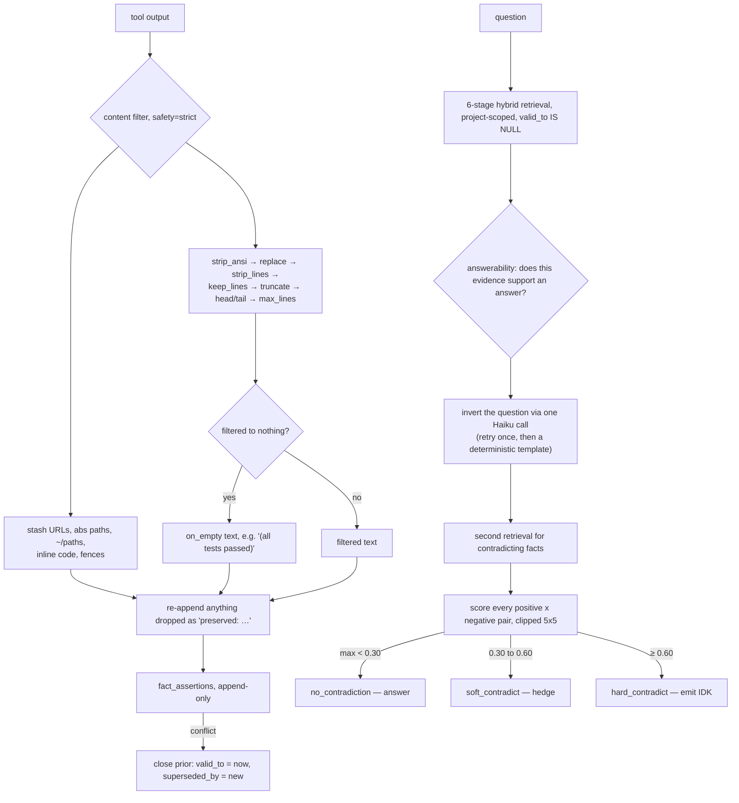

## 1. Executive Summary

total-agent-memory is a 68,000-line MIT Python memory layer for coding agents,
distributed through PyPI, npm, Homebrew, GHCR and nine IDE installers. It is
pinned here at `vbcherepanov/claude-total-memory`, the URL it was cloned from;
the package, the README title and the project's own container badge all say
`total-agent-memory`, so the repository has been renamed and GitHub is
redirecting. This report uses the new name and the old URL.

Most of it is the familiar stack: a hybrid retriever, a knowledge graph,
background enrichment workers, a dashboard.

**Three things in it are worth the read.**

**First, negative-evidence retrieval.** `src/memory_core/negative_retrieval.py`
performs "a deliberate **second** retrieval against an *inverted* query — one
phrased to surface facts that would CONTRADICT the most likely answer." Each
(positive, negative) pair is scored by the contradiction detector, and the
maximum score picks one of three outcomes: below 0.30 nothing conflicts, between
0.30 and 0.60 the answer "should hedge", at or above 0.60 "the router should
treat the question as unanswerable and emit IDK rather than pick a side."

The module docstring states the failure it exists for, with an example: memory
holds "Alice loves teal" and "Alice told Bob she actually hates teal now", and
positive retrieval surfaces near-matches "which sound supportive while a
contradicting fact sits one sentence away."

Almost everything in this atlas retrieves what matches. This retrieves what
would *disagree*, and lets the disagreement win.

**Second, lossy compression with an un-loseable class.**
`src/content_filter.py` is a declarative pipeline configured by eleven TOML
files under `filters/` — one per tool output shape (`pytest.toml`,
`stack_trace.toml`, `git_status.toml`, `docker_ps.toml`, `sql_explain.toml` and
so on). Under `safety = "strict"`, URLs, absolute paths, `~/` paths, inline code
and code fences are extracted **before** filtering and any that the filter
dropped are re-appended with a `preserved:` tag.

So the filter may be as aggressive as its author likes and a declared class of
high-value tokens still provably survives. Every rule also declares `on_empty` —
`pytest.toml` says `on_empty = "(all tests passed)"` — so filtering to nothing
produces a statement rather than a silence.

**Third, a measured false-veto and the fix kept beside the original.**
`src/ai_layer/verifier.py` `_decide()` carries two profiles. The default is the
legacy "strict `p_contradict > 0.6` veto, no margin… the path the legacy test
suite exercises". The calibrated profile requires
`p_contradict >= τ_c AND (p_contradict - p_entail) >= margin`, because "the
margin stops moderate-confidence 'contradicts' from vetoing answers the model
also weakly supports — the dominant false-veto failure mode on dialogue
evidence."

A named dominant failure mode, a threshold change derived from it, and the old
behaviour retained rather than silently replaced.

**The claim to discount is the competitive one**, section 10.

## 2. Mental Model

Facts are assertions with a validity interval. Writing a conflicting assertion
does not edit anything: it closes the old one (`valid_to = now`,
`superseded_by = new id`) and appends the new. Invalidation without replacement
sets `valid_to` and an `invalidation_reason`.

Answering is a pipeline: retrieve positively, ask whether the evidence supports
an answer at all, retrieve negatively against an inverted query, score the
conflict, and let a hard contradiction override the answer.

## 3. Architecture

`src/` holds 68 modules outside tests: `memory_core` (with `temporal` and
`episodes`), `ai_layer`, `graph`, `ingestion`, `reflection`, `associative`,
`cognitive`, `ast_ingest`, `workers`, `memory_systems`, `tools`, `metrics`.

There is an enforced layer wall: `negative_retrieval` "lives in `memory_core`
and therefore must not import `ai_layer.*` (enforced by
`tests/test_v11_layer_separation`)". Collaborators arrive as `Protocol`-typed
callables — `search_fn`, `contradiction_fn`, `llm_client`. A dependency
direction asserted by a test rather than by convention is worth naming; few
systems here do it.

Three separate work queues (`deep_enrichment_queue`, `triple_extraction_queue`,
`representations_queue`) and a consolidation daemon run behind the write path.
Their `status='pending'` values are queue states, not epistemic ones.

## 4. Essential Implementation Paths

**Filter** — `src/content_filter.py`: `_extract_whitelist()`, `run_pipeline()`,
`_append_preserved()`, `filter_with_stats()`; rules in `filters/*.toml`.

**Assert** — `src/temporal_kg.py`: append with `valid_from`, close the prior
with `valid_to`/`superseded_by`, invalidate with `invalidation_reason`.

**Verify** — `src/ai_layer/verifier.py` `_decide()`, the two calibration
profiles.

**Refute** — `src/memory_core/negative_retrieval.py`: invert, retrieve, score,
bucket.

## 5. Memory Data Model

`fact_assertions` is append-only. `valid_to IS NULL` means currently valid;
`valid_from` and `created_at` are both stored, which is what makes the as-of
query meaningful rather than decorative. `superseded_by` links a closed
assertion to its replacement, and `invalidation_reason` records why an assertion
was closed without one.

There is no status enum on a fact, no provenance beyond `source`, `context` and
`project`, and no record of a value that was *rejected* — a wrong assertion is
closed, not marked as refuted, so re-ingesting the same wrong text writes it
again as a fresh assertion.

## 6. Retrieval Mechanics

Six stages — BM25, semantic, fuzzy, graph, cross-encoder, MMR — then the
answerability classifier, then the negative pass.

The negative pass has three engineering details worth copying. The inverted
query is "a small Haiku prompt; we retry once on bad output (empty / multi-line
garbage / echoing the original question) and then fall back to a deterministic
template" — so a bad LLM response degrades to a working query rather than an
exception. Both evidence lists "are clipped to 5 entries before the
cross-product so we never run more than 25 evaluations per call". And an empty
positive list short-circuits "without an LLM call".

The as-of query is real: `valid_from <= timestamp AND (valid_to IS NULL OR
valid_to > timestamp)`, so history can be read at a past point rather than only
as a current view. That, with the separately stored `created_at`, earns
`bitemporal`.

`project = ?` sits in the same WHERE clause as `valid_to IS NULL` on the
assertion reads — a stored key applied as a read-path predicate, which earns
`scope_enforced`.

## 7. Write Mechanics

Writes append. Correction closes and supersedes. Deletion, in the assertion
store, is closing with a reason.

Enrichment is queued rather than inline, with three queues and a consolidation
daemon, so the write path stays cheap and the expensive work is retryable.

## 8. Agent Integration

An MCP server, a CLI, hooks, installers for nine IDEs, Docker and GHCR images,
launchd and systemd units, and a skill directory. `CLAUDE.md.template`,
`AGENTS.md.template`, `codex-global-rules.md.template` and
`agent-rules.md.template` ship the instruction side alongside the server.

The `filters/*.toml` set is the integration detail that matters: it is where
tool output is cut down before it becomes memory, and it is configuration a user
can read and edit without touching Python.

## 9. Reliability, Safety, and Trust

**Bitemporal — awarded.** As-of query plus separately stored assertion time.

**Scope enforced — awarded.** `project` on the read path.

**Negative eval — awarded**, on two counts: `tests/test_negative_retrieval.py`
is a committed suite whose subject is a mechanism that exists to produce IDK on
adversarial questions, with tests for the threshold boundaries
(`test_score_just_above_soft_threshold_is_soft_contradict`,
`test_decision_thresholds_match_spec`), the failure paths
(`test_search_failure_is_swallowed_into_no_contradiction`), and the LLM
degradation path (`test_inverted_query_falls_back_to_template_on_llm_failures`).
`benchmarks/analyze_failures.py` and the committed
`evals/embedding-ab-2026-04-27.json` are the measurement side of the same
instinct.

**Tombstone — no.** Closing an assertion does not stop the same value being
asserted again.

**Trust state — no.** `confidence` is a float; the `status` columns are queue
states.

**Human review — no.** Nothing found that routes a memory to a person.

**Audit log — no.** `fact_assertions` is append-only and carries
`invalidation_reason`, which is close, but it is the store itself rather than a
separate record of who changed what; there is no audit table.

## 10. Tests, Evals, and Benchmarks

**No paper.** 150 test files in `tests/` (the README badge says 1,769 tests
passing), a benchmarks directory with LoCoMo and LongMemEval harnesses, an
ensemble judge, a failure analyser, an embedding A/B, and **dated result JSONs
committed to the repository** — `evals/longmemeval-2026-04-17.json`,
`longmemeval-v8-baseline-2026-04-24.json` and its log,
`embedding-ab-2026-04-27.json`.

Committing the result file, with `dataset_source`, `run_date`, version, mode,
`k`, `questions_evaluated`, `questions_skipped` and a stated `skip_reason`, is
better practice than most of this corpus manages. The self-reported numbers are
`r_at_5_recall_any` 0.9617, `r_at_5_recall_all` 0.8447, nDCG@5 0.8244, 38.8 ms
average, over 470 questions.

**The comparative claim is where to be careful.** The README badge and
`docs/vs-competitors.md` headline "**+10.8 pp over Supermemory's published
85.4%** on the same dataset". That subtracts this project's `recall_any@5` — at
least one required fragment in the top five — from another project's overall
headline figure, and nothing in the repository establishes that the two numbers
measure the same quantity.

To the project's credit, the caveat is printed directly underneath: it defines
both recall variants and states that its own strict `recall_all@5` is 84.5%,
which is *below* the 85.4% it is being compared against. The document calls that
"still at parity". A reader who takes the badge without the footnote gets a
different impression than a reader who takes both.

The other detail: the 30 skipped questions are the **abstention** type,
"excluded by bench (not a recall task)". That exclusion is the benchmark's, not
this project's — but abstention is precisely what negative retrieval was built
for, so the headline recall figure cannot speak to the mechanism this report
finds most interesting. Nothing in the tree measures the IDK path end to end.

**I ran nothing.** The numbers above are what the repository reports about
itself.

## 11. For Your Own Build

### Steal

- **Retrieve for the refutation, not just the match.** One inverted query, one
  extra search, a contradiction score, and three buckets — answer, hedge, IDK.
  It addresses the failure that similarity search cannot see: the contradicting
  fact that does not resemble the question.
- **Let the hard contradiction win.** "Treat the question as unanswerable and
  emit IDK rather than pick a side" is a policy most memory layers never state.
- **Bound the extra cost before you add it.** Both lists clipped to five before
  the cross-product, at most 25 scores; one LLM call with one retry and a
  deterministic template fallback; an empty-positive short circuit that skips
  the LLM entirely. This is how you add a second retrieval pass without
  doubling the bill.
- **Give lossy compression an un-loseable class.** Extract URLs, absolute paths
  and code spans before filtering; re-append what the filter dropped. The rules
  can then be aggressive without anyone auditing them for what they might eat.
- **Make every filter declare `on_empty`.** `"(all tests passed)"` turns
  "filtered to nothing" from an ambiguous silence into a fact.
- **Keep the old threshold profile when you recalibrate.** Two named profiles,
  the legacy one still exercised by the legacy suite, and a docstring saying
  which failure mode the new one addresses.
- **Assert the layer wall with a test.** `memory_core` must not import
  `ai_layer`, enforced by `tests/test_v11_layer_separation`, with collaborators
  passed as `Protocol` callables.
- **Commit the result file, not the number.** `dataset_source`, `run_date`,
  version, retrieval mode, `k`, questions evaluated *and skipped* with the
  reason. A badge is a claim; this is evidence.

### Avoid

- **Do not headline a cross-system delta between differently-defined metrics.**
  The footnote here is honest and the badge is not, and the badge is what gets
  read. If the like-for-like number is 84.5% against 85.4%, that is the
  comparison, and the honest headline is "comparable".
- **Do not let closing an assertion stand in for rejecting a value.** `valid_to`
  plus `superseded_by` records that a belief ended; nothing prevents the same
  wrong text being re-asserted by the next ingest.

### Fit

Good for a local-first coding agent where you control the machine and want the
retrieval stack, the filters and the temporal store as one installed thing. The
distribution surface is unusually complete for a single-maintainer project.

`negative_retrieval.py` and `content_filter.py` are worth reading even if you
adopt nothing else. Both are self-contained, both are ideas rather than
plumbing, and both address failures the rest of this atlas mostly does not
name.

## 12. Open Questions

- **Is the IDK path measured?** The mechanism targets abstention; the benchmark
  excludes abstention questions. Nothing found closes that gap.
- **Which verifier profile ships by default?** `_decide()` defaults to the
  legacy strict veto when no `calibration` is passed; which callers pass it was
  not traced.
- **What is `safety = "semantic"`?** The docstring lists strict, semantic and
  off; only strict's whitelist behaviour was read.
- **Does the filter apply before or after the assertion is written?** The
  ordering determines whether the un-loseable class is guaranteed in storage or
  only in what the agent sees.

## Appendix: File Index

**Negative evidence** — `src/memory_core/negative_retrieval.py` (the design
notes `:1-58`, `THRESHOLD_SOFT` / `THRESHOLD_HARD`, `negative_retrieve`),
`tests/test_negative_retrieval.py`,
`tests/fixtures/negative_retrieval_fixtures.json`

**Content filter** — `src/content_filter.py` (whitelist patterns `:42-47`,
`_extract_whitelist` `:122`, `run_pipeline` `:151`, `_append_preserved` `:134`),
`filters/pytest.toml`, `stack_trace.toml`, `git_status.toml`, `cargo.toml`,
`docker_ps.toml`, `http_log.toml`, `json_blob.toml`, `markdown_doc.toml`,
`npm_yarn.toml`, `sql_explain.toml`, `generic_logs.toml`

**Temporal store** — `src/temporal_kg.py` (append and close `:58-115`,
invalidate `:144-165`, as-of query `:201-210`)

**Verification** — `src/ai_layer/verifier.py` (`_decide` `:385-432`),
`src/ai_layer/answerability.py`, `src/contradiction_detector.py`

**Queues and workers** — `src/deep_enrichment_queue.py`,
`src/triple_extraction_queue.py`, `src/representations_queue.py`,
`src/enrichment_worker.py`, `src/workers/consolidation_daemon.py`

**Evaluation** — `benchmarks/longmemeval_bench.py`, `locomo_bench.py`,
`locomo_bench_llm.py`, `analyze_failures.py`, `embedding_ab.py`,
`ensemble_judge.py`, `temporal_filter.py`, `v11_pipeline.py`,
`evals/longmemeval-2026-04-17.json`, `evals/embedding-ab-2026-04-27.json`,
`evals/longmemeval-v8-baseline-2026-04-24.json`

**Claims** — `docs/vs-competitors.md` (the benchmark table `:95-101`, the
"+10.8 pp" line `:119`, the "How to read this" note `:121-125`)

## History

**2026-08-09** — [`616d9a6f8b507c16b4cdfef4e823af59d949cc09`](https://github.com/vbcherepanov/claude-total-memory/commit/616d9a6f8b507c16b4cdfef4e823af59d949cc09) — first reading. Screened before reading; the tree was read, never installed, and no benchmark was run.
