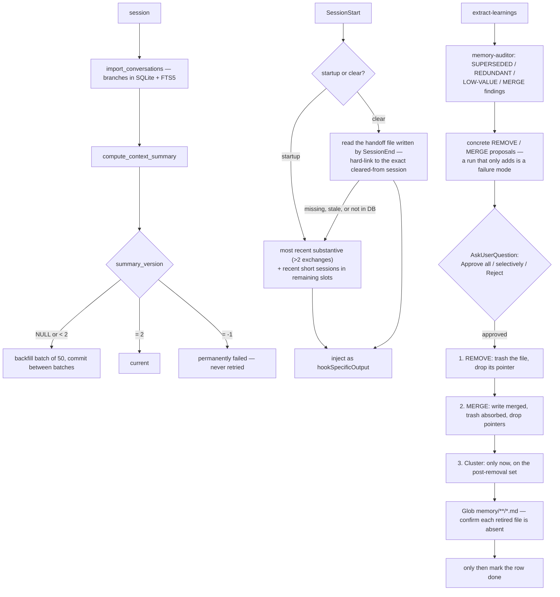

## 1. Executive Summary

Claudest is a marketplace of eight Claude Code plugins; **`claude-memory`** is
the one this report covers. It stores every session in SQLite with FTS5 and BM25
ranking, injects precomputed summaries of recent sessions at session start, and
offers an `extract-learnings` skill that promotes durable insights into
`CLAUDE.md`, `MEMORY.md` and topic files.

**The artifact worth the report is `extract-learnings/SKILL.md`** — a
consolidation protocol specified with more care than most systems here give their
code, and one line in it is the best sentence in this batch:

> "Convert the auditor's SUPERSEDED / REDUNDANT / LOW-VALUE / MERGE findings into
> concrete REMOVE/MERGE proposals — **a run that only adds is a failure mode**."

A consolidation pass that never retires anything is a growth pass with a
consolidation label on it, and this atlas has read many. Naming that as a
*failure* — a condition the run should be judged against — is the correction.

**Three more rules in the same protocol earn their place:**

**Ordering.** "ONLY after retirements and merges are settled" does the overflow
check run, and only on the reduced set. "Clustering never runs before retirement;
it must not mask removable entries." Splitting an over-full section into a
cluster file before deleting its dead entries hides exactly what should have been
deleted, and produces a tidy-looking memory that is still wrong.

**Reversibility.** "Delete each retired topic file with `Bash: trash <path>`
(**trash, never rm — reversible**)."

**Verification.** "After REMOVE/MERGE, run `Glob memory/**/*.md` from resolved
path and confirm each retired file is gone. **Never mark a REMOVE/MERGE row 'done'
unless the file is verified absent — claiming a deletion that did not happen is
the exact failure this guards against.**"

That is an agent instructed not to trust its own report of its own action, with
the failure mode it is guarding written next to the check. It is the same
discipline this atlas applies to the systems it reads.

**And none of it lands without approval** — `AskUserQuestion: Approve all /
Approve selectively / Reject`.

## 2. Mental Model

Two layers. Sessions accumulate automatically in SQLite and are searchable.
Durable learnings are promoted out of them into markdown, by an explicit,
gated, audited process.

## 3. Architecture

`plugins/claude-memory/` is about 8,800 lines: `hooks/` (import, sync, setup,
backfill, context injection, consolidation check, onboarding, handoff clearing),
`skills/` (`recall-conversations`, `extract-learnings`, `get-token-insights`),
`agents/` (`memory-auditor.md`, `signal-discoverer.md`), and `commands/`.

The storage claim is worth noting for what it rules out: "SQLite database with
full-text search (FTS5, BM25 ranking, **zero external dependencies**)". No
embedding model, no vector store, no service — the same constraint
[mnemos](../mnemos/) accepts, and the same consequence: lexical retrieval only.

`get-token-insights` is a separate concern bolted to the same data — turns,
tool calls, session metrics, hook executions and an import log, with an HTML
dashboard for cache hit rates and spending. Instrumenting the agent's cost from
the same transcript store that provides its memory is a reasonable economy.

## 4. Essential Implementation Paths

**Consolidate** — `plugins/claude-memory/skills/extract-learnings/SKILL.md` (the
allowed-tools list including `AskUserQuestion` and `trash` `:6-18`, the
consolidation-pressure rule `:109`, the approval gate `:111`, the apply order
`:115-118`, the deletion verification `:121`, the completion condition `:133`),
`agents/memory-auditor.md`, `agents/signal-discoverer.md`.

**Summarise** — `hooks/backfill_summaries.py` (the batch and poison-pill contract
`:1-21`, the selection predicate `:40`, the success and failure updates
`:52-59`), `hooks/import_conversations.py` `:391`.

**Inject** — `hooks/memory-context.py` (the two selection algorithms `:1-16`).

## 5. Memory Data Model

`branches` in SQLite with a `context_summary`, a `context_summary_json` and a
`summary_version`, mirrored into FTS5.

**`summary_version` does three jobs with one integer**, and the pattern is worth
stealing: `NULL` or `< 2` means *needs summarising*, `2` means *current for this
summariser*, and `-1` means *permanently failed*. The backfill selects on the
first, writes the second on success and the third on error — "to avoid infinite
retry". A background pass that keeps failing on the same document every cycle is
one of the commonest quiet defects in this corpus, and one column fixes it while
also giving you a re-summarise trigger when the summariser version changes.

The curated layer is markdown with a pointer discipline: `MEMORY.md` sections
hold entries, sections over 25 entries migrate to
`memory/clusters/<section>.md` replaced by a single pointer, and clusters must
stay "a pure trigger-index" with rule bodies extracted into topic files.

## 6. Retrieval Mechanics

FTS5 with BM25 for search, and precomputed summaries for injection —
precomputation is the right call for a session-start hook, where the budget is
milliseconds and the summary would otherwise be an LLM call in the critical
path.

**The two selection algorithms are the detail to copy.** On *startup*: the most
recent substantive session (more than two exchanges) plus recent short ones in
the remaining slots. On *clear*: read a handoff file written by the SessionEnd
hook "to hard-link to the exact cleared-from session", and if that session is not
substantive, append the most recent one that is.

Distinguishing "you opened Claude Code" from "you ran `/clear` mid-task" is a
real distinction — after a clear you want the thing you were just doing, not the
most recent thing you finished — and the fallthrough is explicit: "if handoff
file is missing, stale, or session not in DB", use the startup logic.

Scope is the database. No scope key reaches a query.

## 7. Write Mechanics

Sessions import automatically. The curated layer is written only through
`extract-learnings`, and the ordering constraint in section 1 is the part that
makes it a consolidation rather than an accumulation.

The auditor's finding vocabulary — SUPERSEDED, REDUNDANT, LOW-VALUE, MERGE —
is a taxonomy of *reasons to remove*, which is what makes "a run that only adds
is a failure mode" enforceable: the auditor produces findings, the protocol
requires them to become proposals.

## 8. Agent Integration

A plugin marketplace: `/plugin marketplace add gupsammy/claudest`, then install
any of eight plugins, with auto-update toggleable. `claude-memory` brings its own
hooks, skills, agents and commands.

The README links a Reddit write-up as "the full story behind the architecture",
which is a pointer off-repository — the design reasoning that matters most is in
`SKILL.md` and is in the tree.

## 9. Reliability, Safety, and Trust

**One mark: human review.** `AskUserQuestion: Approve all / Approve selectively /
Reject` gates every consolidation edit, and "Approve selectively" is the option
that makes it a real review rather than a confirmation dialog — a person can take
three removals and decline the fourth.

**Trust state, tombstone, bitemporal, audit log, scope, negative eval — no.**
`summary_version = -1` is a processing state, not an epistemic one.

**The safety design around deletion is the strongest part** and is worth
separating into its three independent guards: *approval* before anything applies,
*trash rather than `rm`* so an approved mistake is recoverable, and *verification
by `Glob`* so a claimed deletion that did not happen cannot be marked done. Any
one of the three alone would be insufficient; together they are the most careful
treatment of agent-initiated memory deletion in this atlas.

**The risk is the test count.** Two test files against 8,800 lines of hooks that
run on every session start and edit the user's `CLAUDE.md` and `MEMORY.md`. The
protocol is specified in prose for an LLM to follow, and prose is not enforced —
the ordering rule, the removal requirement and the verification step are all
instructions the model may skip under pressure, with nothing failing loudly if it
does.

## 10. Tests, Evals, and Benchmarks

**No paper, no benchmark, no committed results.** Two test files at the
repository root against eight plugins.

The verification step inside `SKILL.md` is, in effect, a runtime test the agent
performs on itself — `Glob` after `trash`, and the completion condition is stated
as a conjunction: "Phase 4 is complete when all approved edits are applied, every
REMOVE/MERGE is verified absent via Glob, the marker is written, and the summary
table is presented."

Specifying completion as a checkable conjunction rather than "when done" is good
practice for an agent protocol. It is still a prompt.

**I ran nothing.**

## 11. For Your Own Build

### Steal

- **Judge a consolidation run by what it removed.** "A run that only adds is a
  failure mode" turns consolidation from a label into a condition, and gives the
  auditor's findings somewhere to land.
- **Give the auditor a vocabulary of reasons to remove.** SUPERSEDED, REDUNDANT,
  LOW-VALUE, MERGE — four named findings, each convertible into a concrete
  proposal.
- **Settle removals before reorganising.** "Clustering never runs before
  retirement; it must not mask removable entries." Splitting an over-full section
  before deleting its dead entries produces a tidy memory that is still wrong.
- **Offer "approve selectively".** Approve-all-or-nothing is a confirmation
  dialog; per-item approval is a review.
- **Trash, never `rm`.** An approved mistake stays recoverable.
- **Verify the deletion actually happened, and say what you are guarding
  against.** "Never mark a REMOVE/MERGE row 'done' unless the file is verified
  absent — claiming a deletion that did not happen is the exact failure this
  guards against."
- **State completion as a conjunction.** Edits applied *and* deletions verified
  *and* marker written *and* summary presented.
- **Use one integer for needs-work, current and poisoned.** `summary_version <
  2` selects, `= 2` marks current, `= -1` marks permanently failed — a
  re-summarisation trigger and a retry guard in one column.
- **Distinguish a fresh start from a `/clear`.** After a clear the user wants the
  session they just left, not the most recent thing they finished; hard-link it
  via a handoff file and fall through cleanly when it is missing or stale.
- **Precompute what a session-start hook injects.** The budget there is
  milliseconds.
- **Filter trivial sessions out of injection.** More than two exchanges as the
  substantive threshold.

### Avoid

- **Do not leave a protocol this careful enforced only by prose.** The ordering
  rule, the removal requirement and the verification step are instructions to a
  model, and nothing fails loudly when they are skipped. The `Glob` check is
  scriptable; so is "did this run produce any removals".
- **Do not run 8,800 lines of session hooks on two test files** when those hooks
  edit the user's memory files.

### Fit

Worth adopting if you use Claude Code and want session history searchable plus a
disciplined promotion path into your instruction files. The consolidation
protocol is the reason, and it transfers: it is a specification, not code, and it
would improve most of the memory systems in this atlas that have a consolidation
pass.

Read `extract-learnings/SKILL.md` regardless of what you build. It is the
clearest statement here of what a consolidation pass owes the user.

## 12. Open Questions

- **Does anything check that a run produced removals?** The rule is stated in the
  prompt; no code enforces it.
- **What do `memory-auditor` and `signal-discoverer` disagree about?** Two agents
  with different jobs feed the same protocol; their interaction was not traced.
- **Is `summary_version = -1` ever cleared?** A permanently failed summary would
  otherwise never recover after a summariser fix.
- **How does the handoff file get invalidated?** "Stale" is handled; the staleness
  criterion was not read.

## Appendix: File Index

**Consolidation protocol** — `plugins/claude-memory/skills/extract-learnings/SKILL.md`
(allowed tools including `AskUserQuestion` and `trash` `:6-18`, the
consolidation-pressure rule and the clustering-after-retirement ordering `:109`,
the approval gate `:111`, the apply order `:115-118`, the `Glob` verification and
its stated failure mode `:121`, the completion conjunction `:133`),
`plugins/claude-memory/agents/memory-auditor.md`,
`plugins/claude-memory/agents/signal-discoverer.md`

**Summaries** — `plugins/claude-memory/hooks/backfill_summaries.py` (the contract
`:1-21`, `BATCH_SIZE` `:21`, the selection `:40`, the success and poison-pill
updates `:52-59`), `hooks/import_conversations.py` (`:391`)

**Injection** — `plugins/claude-memory/hooks/memory-context.py` (the two
selection algorithms and the fallthrough `:1-16`), `hooks/clear-handoff.py`,
`hooks/memory-setup.py`, `hooks/consolidation-check.py`, `hooks/hooks.json`

**Skills** — `plugins/claude-memory/skills/recall-conversations/`,
`get-token-insights/scripts/ingest_token_data.py` (`turns` `:114`,
`turn_tool_calls` `:137`, `session_metrics` `:155`, `hook_executions` `:190`,
`token_import_log` `:200`)

## History

**2026-08-09** — [`1c634ac064bc24f1d3ecc3e2cfa5c0f29b3ce4a9`](https://github.com/gupsammy/claudest/commit/1c634ac064bc24f1d3ecc3e2cfa5c0f29b3ce4a9) — first reading, covering the `claude-memory` plugin of the eight in the marketplace. Screened before reading; the tree was read, never installed, and no hook was run.
