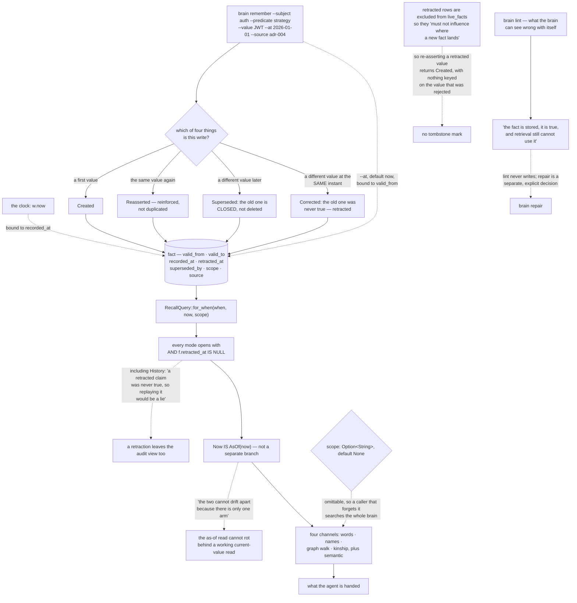

## 1. Executive Summary

Claudinio Brain is "[b]itemporal knowledge-graph memory for AI agents. One
binary, one file, no server, and no model on the write path." MIT, Rust, version
0.3.0, 13,173 lines across 28 source files, one SQLite database holding facts,
entities, aliases and predicates with an FTS5 index and a vector table beside
them.

The README opens with the problem statement rather than a feature list:

> "Give an agent a vector store and ask how a service authenticates. It will
> find every answer anyone ever wrote down and pick one. It has no way to know
> which of them is still true, because \"we use JWT\" and \"we *used* JWT\" are
> the same sentence to a similarity score."

The answer is a timeline. Writing a new value does not overwrite the old one, it
closes it, so `brain get auth strategy` and `brain get auth strategy --as-of
2026-03-01` are answered from one record.

**The mechanism to take away is how the two reads are kept honest.** A store
with a working current-value query and a subtly broken as-of query looks
correct in daily use, and the bug surfaces only when somebody asks about the
past — which is the one question such a store exists to answer.
`RecallQuery::for_when` refuses the shape that allows it: one function builds
the temporal predicate for every mode, and the current-value mode is not a
branch of its own.

> "It also leaves `Now` with nothing of its own to mean: it *is* `AsOf(now)`,
> and the two cannot drift apart because there is only one arm."

The atlas has just read the failure this prevents. [Engram
Cognitive](../engram-cognitive/) carries the same four columns and stamps them
all from one clock, so its as-of query reads a version chain over write time.
Here the two axes come from different places by construction: the insert binds
`micros(w.valid_from)` from the caller's `--at` and `micros(w.now)` from the
clock, in the same statement.

**The second distinction is retraction.** `valid_to` means a value stopped being
true; `retracted_at` is annotated "set when we learn it was NEVER true", and the
two are different columns. A retraction is excluded from every read mode
including history, because "a retracted claim was never true, so replaying it
would be a lie" — an unusual choice, and a defensible one, since a history view
that replays a claim nobody ever should have made is an audit trail that
misleads. The distinction reaches the caller too: a write returns `created`,
`reasserted`, `superseded` or `corrected`, and an agent that gets a `superseded`
it did not expect is told what that means — "the brain already knew something".

## 2. Mental Model

A **fact** is an entity, a predicate and an object over an interval of world
time, recorded at an instant of brain time.

A **supersession** is a value that stopped being true.

A **retraction** is a value that was never true, and it leaves even the history.

A **scope** is a namespace you must remember to ask about.

A **lint finding** is a fact that is stored, true, and unreachable.

## 3. Architecture

| Area | Role |
| --- | --- |
| `src/store/schema.sql` | Six tables, the two time axes, and the indexes that make them cheap |
| `src/brain/mod.rs` | Writes, the four outcomes, retraction, and entity resolution |
| `src/recall.rs` | The four channels and the one temporal predicate they share |
| `src/lint.rs`, `src/repair.rs` | What the brain can see wrong with itself, and the separate decision to fix it |
| `src/studio/` | A loopback UI that reads and writes |
| `src/hook.rs`, `hooks/` | Harness integrations for eight agent surfaces |
| `evals/` | Five scored suites plus a holdout nothing is tuned against |

## 4. Essential Implementation Paths

`src/recall.rs:1214-1224` — one temporal predicate for every mode, and the
argument for why `Now` has no branch of its own.

`src/brain/mod.rs:711-733` — the insert, binding valid time from the caller and
transaction time from the clock in one statement.

`src/brain/types.rs:227-236` — four write outcomes, each documented with what it
means rather than what it does.

`src/brain/mod.rs:1444-1467` — `live_facts` and `retract_fact`: what a retraction
excludes, and where its reason is written.

`src/brain/mod.rs:1469-1488` — `find_entity`, where declared aliases resolve a
write and learned ones are refused.

`src/lint.rs:1-17` — a memory system reporting on its own unreachable contents.

## 5. Memory Data Model

One `fact` row is the unit: entity, predicate, and an object that is text, a
number or another entity — the last making the fact an edge, which is how the
graph exists without a second table. Around it: `valid_from`/`valid_to` for world
time, `recorded_at`/`retracted_at`/`superseded_by` for what the brain did,
`confidence`, `reassert_count`, `scope`, `source`, and a JSON `locator` described
in the schema as "index, not warehouse". Entities carry declared and learned
aliases in a separate table with the distinction stored on the row.

## 6. Retrieval Mechanics

Four channels answer one question — lexical BM25 over FTS5, entity-name
resolution, a graph walk over entity-valued facts, and kinship, which finds
entities that share a value with the one asked about and have no edge to it.
A semantic channel sits beside them over a static potion-base-8M embedding
shipped in the repository, which is why the project can claim "no embedding
endpoint to call" while still embedding on write. Every channel receives the
same temporal predicate from `for_when`.

## 7. Write Mechanics

A write resolves the entity, decides which of four things is happening, and
either creates, reinforces, closes-and-creates, or retracts-and-creates. Closing
sets `valid_to` on the old row and points `superseded_by` at the new one, so the
closure's own `recorded_at` is when the change was learned. The vector is written
inside the same transaction as the fact, because "[a] vector written separately
could be lost on a crash, leaving a fact the semantic channel can never find --
invisible, and undetectable without a scan."

## 8. Agent Integration

A CLI, an MCP server, a loopback studio, and hook bundles for Claude Code,
Codex, Cursor, Gemini, Cline, OpenCode and others, registered through a plugin
manifest. The Stop and SessionEnd hooks record what a session did "from the
harness's own transcript, with no model involved."

## 9. Reliability, Safety, and Trust

The strong parts are the temporal invariants, the retraction semantics, and the
alias split. The weak part is scope: it is stored, it partitions the vector
index, and the query still takes it as an optional argument that defaults to
nothing, so isolation depends on every caller remembering. There is no mutation
log separate from the fact table, and a retraction's reason is concatenated into
`source`, the same free-text column that records who asserted the fact.

## 10. Tests, Evals, and Benchmarks

Thirty-six integration test files, and an eval suite that states its own premise:
"Tests prove correctness; evals measure quality. A brain can satisfy every
bitemporal invariant and still be useless if recall never surfaces the answer."
Five scored suites plus `--holdout`, "the suite nothing is tuned against", and
`--misses` to name the cases still wrong. Each suite's README entry says what it
justifies — `graph.jsonl` exists to justify having a graph at all, `kin.jsonl` to
justify looking past it.

## 11. For Your Own Build

Collapse your current-value read into your as-of read. If `now` is a separate
code path from `as_of`, the two will disagree eventually and only the rarer one
will be wrong.

Separate "stopped being true" from "was never true" in the schema, not in a
comment, and decide deliberately which of them your history view replays.

Write the lint. A fact that is stored, true and unreachable fails silently, and
no test you would think to write covers it.

## 12. Open Questions

Whether scope should default to the brain's own configuration rather than to
nothing. Every other boundary in this project is enforced structurally; this one
is left to the caller, and the tests that cover it all pass the argument
explicitly.

Whether a retracted fact should really leave `history`. The argument given is
sound for replay, but it means the record of a claim having been made and
withdrawn exists only inside a concatenated `source` string.

## Appendix: File Index

| Path | What to read it for |
| --- | --- |
| `src/recall.rs:1214-1224` | One arm for now and then, and why that is the point |
| `src/store/schema.sql:71-78` | Two time axes labelled in the schema itself |
| `src/brain/types.rs:227-236` | Four write outcomes, each meaning something different |
| `src/brain/mod.rs:1469-1488` | A load-bearing `WHERE` clause, and the comment that says so |
| `src/lint.rs:1-17` | What a memory system can see wrong with itself |
| `tests/step16_scope.rs:67-88` | A must-not assertion that proves its own premise first |

## History

**2026-09-16** — [`6b6e57413aa38bb7cba24183c21bb41510d2d72c`](https://github.com/claudin-io/claudinio-brain/commit/6b6e57413aa38bb7cba24183c21bb41510d2d72c) — first reading, at a commit dated 1 September 2026. Screened before opening, from a shallow clone: nine files scanned, three auto-run surfaces (a Claude Code plugin manifest and two hook directories registering SessionStart, Stop and UserPromptSubmit), no build-time execution points, one unpinned dependency surface and none inside the seven-day cooldown. `Cargo.lock` is present and unchanged for fourteen days. Nothing was installed, built or run.
