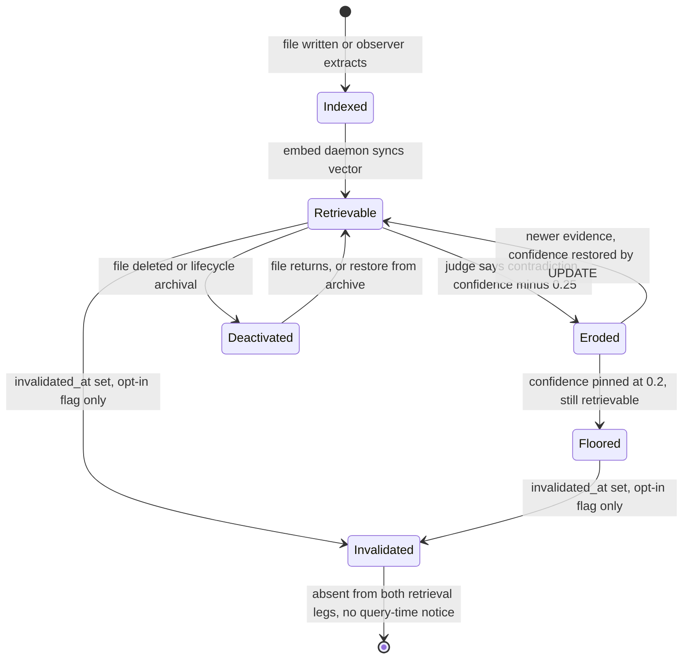

## 1. Executive Summary

ClawMem is an on-device memory layer for coding agents — Claude Code, OpenClaw
and Hermes — built on a single local SQLite vault with FTS5, `sqlite-vec` and a
local GGUF model. TypeScript on Bun, MIT licensed, no API keys required. On its
face it is another entry in the [file-backed local vault](../basic-memory/)
family: Markdown on disk is the source of truth, a watcher indexes it, hooks
capture what happens in a session, and an MCP server hands results back.

**The reason it earns a report is section 6.** ClawMem shipped the thing this
atlas keeps describing: a composite score blending recency decay, confidence,
content-type half-lives, co-activation reinforcement, quality, pin state and
revision count. Then it built an offline eval harness with hand-labelled gold
evidence, ran the composite stack against the raw channel score, and **the
composite stack lost by a factor of three**. `src/scoring-regime.ts` records the
numbers in a header comment: raw cosine ranked 16 of 19 judged targets first
(MRR 0.912) where the composite stack managed 1 of 19 (MRR 0.307) and filtered
14 of 19 below its own `minScore`. On the lexical route, raw BM25 scored MRR
0.848 against the shipped composite's 0.415.

The project's response is the interesting part. It did not tune the weights. It
inverted the default: on the direct retrieval routes results now rank by the raw
channel score, and *every* metadata signal — including pin — is allowed to act
only inside groups of exactly equal raw scores. The stated reason is a magnitude
argument worth quoting in full: "every metadata signal large enough to matter is
larger than the 0.03–0.10 raw margins that separate right answers from wrong
ones". The old knob, `mcp_direct_tuned_weights`, still parses and prints a
deprecation warning saying it has no effect (`src/config.ts:228`).

The correction machinery is weaker than the ranking work and the project says so
itself. A configured judge classifies new facts against the ones they resemble;
a contradiction erodes the older document's `confidence` by 0.25 with a 0.2
floor, and — only behind an opt-in flag — sets `invalidated_at`, which is a hard
predicate on both retrieval legs. `docs/guides/contradiction-invalidation.md`
states the exposure plainly: "There is no warning at query time, no '1 result
suppressed' line, and nothing in the normal retrieval path that would lead you
to look." A system that documents its own silent-suppression hazard and ships
the mechanism disarmed is doing something the atlas has asked for elsewhere and
rarely seen.

## 2. Mental Model

A ClawMem vault has two populations that behave differently and are kept apart
by a collection name.

**Authored documents** are Markdown files the user wrote. The watcher indexes
them, `origin` is set to `fs`, and the filesystem is the authority: if the file
disappears, the row is deactivated with `deactivated_reason = 'absent'`.

**Derived documents** live in the reserved `_clawmem` collection — observations
extracted from session transcripts by a local GGUF observer, deductions
synthesised by the consolidation worker, diary entries, handoffs. Their `origin`
is `api`, they have no backing file **by design**, and the absence reconciler
must never touch them. The column exists because it did once:
`src/store.ts` carries the note that `active` is written by three unrelated
owners — absence reconciliation, forget, and archival — and that "a forget on a
file-backed document was silently undone by the next reindex" until
`deactivated_reason` was added to tell them apart.

A fact becomes a belief by being written to a file or extracted by the observer.
It stops being one along one of three paths, and only one of them is epistemic:

- **absence** — the file is gone, so `active = 0` with reason `absent`;
- **archival** — a lifecycle policy sweeps it out, reversibly;
- **contradiction** — a judge says a newer fact conflicts, so `confidence` drops
  by 0.25 and, if the operator has armed it, `invalidated_at` is set.

The third path is the only one where the system claims something is *wrong*
rather than gone, and it is the one that requires an external model to be
configured before it will run at all.

The diagram's asymmetry is the design: erosion is a ranking signal and fully
reversible with one `UPDATE`; invalidation is a hard predicate and reversible
only by someone who already knows to look for it.

## 3. Architecture

One SQLite file per vault, and the vault is the isolation boundary — multiple
vaults are multiple database files, not a tenant column.

Around it run four things, none of which the agent waits for:

- **the watcher** (`src/watcher.ts`), which reconciles the Markdown tree into
  `documents` and `content`;
- **the embed daemon** (`src/vector-daemon.ts`), which drains rows whose
  `embed_state` is `pending` into `content_vectors`. A trigger resets
  `embed_state = 'pending'` whenever content changes (`src/store.ts:821`), so
  the vector index is eventually consistent with the text index and never
  transactionally so;
- **the consolidation worker** (`src/consolidation.ts`), a three-phase pass —
  A-MEM note backfill, cluster synthesis into `consolidated_observations`, and
  deductive synthesis of cross-session conclusions;
- **an optional heavy lane**, off behind `CLAWMEM_HEAVY_LANE`, which runs the
  same work on a longer interval inside a configured hour window, gated on the
  observed query rate in `context_usage` so it does not compete with an
  interactive session for the GPU.

Operationally this is a single-user install: Bun, a GGUF model file, and either
systemd units or a launch agent. There is no server to stand up, no vector
database, and no cloud dependency. The cost an operator carries is that
concurrency is real anyway — the heavy lane takes a row in `worker_leases` with
a random fence token and an expiry, because two ClawMem processes on one vault
is a supported state.

## 4. Essential Implementation Paths

**Prompt → context.** `src/hooks/context-surfacing.ts` runs on every prompt,
classifies intent (`src/intent.ts`), retrieves, and wraps the result in
`<instruction>`, `<facts>` and `<relationships>` blocks that tell the model to
treat the content as already-known background. Entities named in the prompt are
resolved against `entity_nodes` and current-state triples are appended as raw
`subject predicate object` lines (`src/vault-facts.ts`).

**Session → memory.** `src/hooks/decision-extractor.ts` fires on Stop, hands the
transcript to the local observer (`src/observer.ts`, Qwen3-1.7B via
`src/llm.ts`), and receives typed `Observation` records — `decision`, `bugfix`,
`preference`, `milestone`, `problem` and five more — each with facts, a
narrative, concepts, files touched and optional triples. Those are written as
documents under `_clawmem/observations/`.

**Query → results.** `src/mcp.ts` routes to `searchFTS` and `searchVec`
(`src/store.ts:4057`, `:4306`), fuses, optionally reranks, and then hands off to
`src/scoring-regime.ts` to decide whether metadata participates at all.

**Contradiction → mutation.** `src/judge.ts` resolves a judge from
`CLAWMEM_JUDGE_*`; `src/merge-guards.ts` resolves the effective policy;
`src/consolidation.ts:805` performs the `supersede` mutation. Every evaluation
writes rows to `judge_runs` and `judge_events` (`src/judge-audit.ts`).

## 5. Memory Data Model

`documents` is the spine, and it has accreted: 22 columns arrive through an
`ALTER TABLE` migration ladder at `src/store.ts:425-462`. The ones that carry
meaning rather than statistics:

| Column | What it is |
| --- | --- |
| `active`, `deactivated_reason` | Lifecycle, plus **which of three owners** turned it off |
| `origin` | `fs` or `api` — whether the filesystem reconciler may deactivate it |
| `invalidated_at`, `invalidated_by`, `superseded_by` | Correction: hard read-path exclusion, backlink, replacement pointer |
| `confidence` | A float, default 0.5, floored at 0.2 by erosion |
| `authored_at` vs `modified_at` | When the content was written vs when it was filed |
| `review_by` | A date after which a session-start hook nudges the user |
| `embed_state`, `embed_attempts`, `embed_error` | Vector-index lag, made inspectable |

`authored_at` is a small idea worth naming. Importing a two-year-old ChatGPT
export used to make every message rank as fresh; recency and temporal filters
now run on `COALESCE(authored_at, modified_at)`, so mined history ranks as
history. Vaults mined before the column existed get a metadata-only
`--backfill-dates` lane.

Beside `documents` sit a graph and an audit tier. `entity_triples` is the
graph's typed layer and carries `valid_from`, `valid_to`, `confidence`,
`source_doc_id` and `created_at` — **validity time held separately from record
time**, with the read path filtering `(valid_from IS NULL OR valid_from <= ?)
AND (valid_to IS NULL OR valid_to >= ?)` (`src/store.ts:2101`, `:2118`) and an
MCP tool whose description is literally "what was true about X on date Y?". A
new assertion for an existing `(subject, predicate, object)` closes the old
interval with `UPDATE entity_triples SET valid_to = ?` rather than overwriting
it (`:2082`). That earns `bitemporal`, and it is worth being precise that it is
earned by the triple store: `documents` has no validity axis of its own.

## 6. Retrieval Mechanics

Two regimes, selected per query by `selectScoringRegime`
(`src/scoring-regime.ts`).

**Raw** is the default. Results rank by the channel's own score — vector cosine,
or the monotonic `|bm25|/(1+|bm25|)` transform on the FTS route. Document
metadata, pin included, breaks ties between exactly equal raw scores and does
nothing else.

**Recency-composite** fires only when `hasRecencyIntent(query)` is true, and
restores the pre-v0.22.0 behaviour in full: the weighted blend, the multipliers,
the pin boost, the content-type priority sort and a composite-scale `minScore`.

The measured basis for that split is in the file header, quoted in section 1.
What makes it a finding rather than a tuning note is *which* result it
contradicts. The README sells the composite stack — SAME-style recency decay,
half-lives, co-activation reinforcement, quality scoring, revision-count
durability. The eval says that on the direct routes those signals actively
destroy the ranking, and the code now agrees with the eval instead of the
README. Composite scoring still exists, still has a documentation page, and now
runs on a minority of queries by design.

Around the two regimes: query expansion through the local model, intent
classification into WHY/WHEN/ENTITY/WHAT, reciprocal rank fusion, MMR
(`src/mmr.ts`), a cross-encoder rerank with a golden-set health check
(`src/health/rerank-health.ts`), beam search over semantic, temporal and causal
graphs (`src/graph-traversal.ts`, `src/causal-retrieval.ts`), and per-session
focus boosting.

Three predicates are applied in candidate selection on every route rather than
as a post-filter: `active = 1`, `invalidated_at IS NULL`, and the excluded
collections. The comment at `src/store.ts:4096` gives the reason — putting them
in the `WHERE` means "`limit` is satisfied with allowed content by
construction", where a post-filter over a fixed overfetch can be starved by
higher-ranked ineligible rows. That is the correct way to implement a visibility
boundary and it is not the common one.

## 7. Write Mechanics

**Writes do not block the agent.** File writes are picked up by the watcher;
hook-generated observations are written on Stop, after the turn. The lag before
a memory is retrievable differs by leg: FTS5 is updated in the indexing
transaction, so lexical recall is immediate, while vector recall waits on the
embed daemon draining `embed_state = 'pending'`. A memory written now is
findable by keyword now and by similarity later, and `clawmem doctor` reports
the backlog.

Indexing is transactional — the project's claim is that a crash mid-index leaves
zero partial state — and hook output is deduplicated inside a 30-minute window
on a normalised content hash, which is the cheapest defence against a hook that
fires twice.

The consolidation worker is the pass that rewrites material rather than adding
to it. Phase 2 clusters related observations and merges them; before any merge
it runs `passesMergeSafety` (`src/text-similarity.ts`) and a name-aware
dual-threshold entity check (`src/merge-guards.ts`) whose stated purpose is to
stop "Alice decided X" merging into "Bob decided X". Phase 3 synthesises
cross-session deductions and validates every draft against an anti-contamination
wrapper before writing.

Correction has two settings and a gate. `CLAWMEM_CONTRADICTION_POLICY=link` is
the default: both rows stay active and `invalidated_by` is set as a backlink for
operator queries. `supersede` sets `invalidated_at`, `invalidated_by`,
`superseded_by` and `status = 'inactive'` on the older row
(`src/consolidation.ts:805-820`). The gate is the interesting part:
`resolveEffectiveContradictionPolicy` **downgrades `supersede` to `link` when no
judge is configured**, warns once per process, emits a
`merge_supersede_blocked` audit event per occurrence, and reports the state in
`clawmem doctor`. The reasoning is in the comment — "an unaudited heuristic
whose number-mismatch score sits exactly at the default action threshold must
never select deactivation". A system that refuses to run its own destructive
path on its own fallback classifier is exercising a judgement most of this
corpus does not make.

What none of this produces is a tombstone. `invalidated_at` and `superseded_by`
are keyed on the *record*. Nothing keys on the value, so the same claim
extracted again tomorrow lands as a new document with no memory that a judge
already rejected it. The nearest thing in the tree is `retired_causal_edges`, a
non-pruned archive holding a complete row image with `retired_at`,
`retired_run_key`, `operator_note` and a unique index on
`(source_id, target_id, relation_type)` — but restoring an edge **deletes the
archive row** (`src/causal-writer.ts:1240`), and the causal writer never
consults the archive before creating an edge. It is an undo buffer, not a
refusal record.

## 8. Agent Integration

Four surfaces, one vault. Claude Code hooks (ten of them, in `src/hooks/`) cover
SessionStart bootstrap, per-prompt context surfacing, pre-tool injection,
pre-compact extraction, post-compact re-injection, Stop-time decision
extraction, handoff generation, a feedback loop that boosts referenced notes and
decays unused ones, a staleness nudge and a curator nudge. Each hook declares a
token budget — 200 for the curator nudge, 250 for staleness — and fails open.

The MCP server (`src/mcp.ts`) exposes the same retrieval to any MCP client, with
`memory_retrieve` auto-routing by classified intent. An OpenClaw plugin and a
Hermes `MemoryProvider` (`src/hermes/`) read the same SQLite file, which is what
makes the cross-runtime claim true rather than aspirational: a decision captured
in a Claude Code session is a row, and the other two runtimes query rows.

## 9. Reliability, Safety, and Trust

**Scope.** `_clawmem` is excluded from the candidate pool on every retrieval
route unless the caller passes `includeInternal: true`
(`resolveExcludedCollections`, `src/mcp.ts:128`). That is a stored scope key
applied as a read-path filter, deny-by-default, in the SQL — it earns
`scope_enforced`. Be precise about what boundary it draws: it separates the
system's own derived observations from the user's notes so the agent does not
retrieve its own reasoning as evidence. It is a visibility boundary, not
tenancy. Cross-user isolation is "use a different vault file", and the
`collection` filter on user content is an optional parameter, not a floor.

**Audit.** `judge_runs` and `judge_events` exist because, in the header's own
words, "interactive hosts do not persist hook stderr, so these rows are the only
durable evidence erosion calibration can read". A run records model, endpoint,
prompt version, a SHA-256 of the response, the outcome, and admitted/rejected/
duplicate/inconsistent counts; a provider failure that falls back to the
heuristic writes **two** rows linked by `fallback_from_run_id`, committed
atomically before the heuristic verdict is used. Events carry per-verdict
reason codes and `score_before`/`score_after`. There is no `UPDATE` against
either table anywhere in the tree; the only `DELETE` is retention pruning
(`src/judge-audit.ts:235`), which cascades a fallback pair as a unit. Alongside
them, `causal_run_events` records every write-scope graph mutation and
`maintenance_runs` journals every worker attempt with per-phase counts. That is
`audit_log`, and it is unusually well-motivated.

**Prompt injection** is treated as a live threat in two places. Retrieved
content is wrapped in framing that marks it as background knowledge
(`src/promptguard.ts`, `src/hooks/context-surfacing.ts`), and the judge protocol
puts untrusted vault content only in the user payload, JSON-encoded inside
per-request CSPRNG nonce markers, with instructions confined to the system
prompt (`src/judge.ts`).

**The honest weakness** is stated by the project. Erosion is reversible and
visible in ranking; invalidation is neither. An invalidated document is gone
from search with no query-time signal, and the documentation names this as the
reason the flag ships unarmed and tells the reader to measure their own vault
first, with the SQL to do it. It also flags that before v0.28.0 the classifier
ran, called the model, parsed a verdict — and then looked the target up by a
`clawmem://collection/path` URI against a column storing the bare path, so no
lookup could ever match and every verdict was discarded. Classification
happened; mutation did not. Anyone upgrading is told to treat contradiction
handling as newly-effective rather than newly-fixed.

## 10. Tests, Evals, and Benchmarks

**No paper.** No `arxiv`, `CITATION.cff`, DOI or BibTeX block appears in the
tree; the README cites other people's papers (A-MEM, MAGMA, QMD, SAME, Engram)
as sources for its mechanisms.

84 unit test files plus `tests/e2e`, `tests/hooks`, `tests/integration` and a
smoke test. **I did not run them** — the screen flagged `package.json` and
`src/openclaw/package.json` as changed within the seven-day cooldown, so this
tree was read, not installed.

Two evaluation artifacts are committed and they are different in kind. The
offline harness (`src/eval/`) loads hand-labelled gold JSONL from **outside** the
vault, resolves each evidence ref to an active document, and excludes any example
with an unresolved ref from scoring — the header's reason being that "partial
gold would silently inflate recall". Telemetry proposes candidates, never truth.
That harness is what produced the section 6 numbers.

`eval-bundles/judge-override-2026-08-01/` holds raw capability-eval output for
three judge configurations (two Haiku runs, one Sonnet). Committed JSON, not a
summary table — which means a reader can check the claim rather than take it.

What is absent is a negative case. `goldExampleSchema` (`src/eval/gold.ts`) is a
`z.strictObject` with `gold_evidence` and no counterpart field, so the harness
can assert what recall *should* return and has no way to express what it must
not. In a system whose correction path silently removes documents from search,
the eval that would prove the removal worked is exactly the one that cannot be
written.

## 11. For Your Own Build

### Steal

- **Measure your composite score against the raw channel score before you ship
  it.** This is the transferable finding. Metadata blending is intuitive,
  universal in this corpus, and here it cost two thirds of the MRR. The
  magnitude argument generalises: if your signals move the score by more than
  the margin separating a right answer from a wrong one, they are not
  refinements, they are noise with a theory attached.
- **When the eval contradicts the design, change the default and keep the
  deprecation warning.** `mcp_direct_tuned_weights` still parses and still warns
  that it does nothing. That is cheaper than a migration and more honest than
  silent removal.
- **Record why a row was deactivated, not just that it was.** Three owners wrote
  `active` and one silently undid another's work. `deactivated_reason` plus
  `origin` is two columns that make a whole class of reconciliation bug
  impossible.
- **Refuse the destructive path when the classifier that selects it is
  unaudited.** Downgrading `supersede` to `link` without a configured judge,
  loudly and with an audit event, is a small amount of code standing between a
  heuristic threshold and permanent deletion.
- **Preserve authorship time separately from filing time.** One `COALESCE` in
  the recency predicate is the difference between an imported archive being
  history and it being today's news.
- **Put visibility predicates in candidate selection, not in a post-filter.**
  Otherwise `limit` is satisfied with rows you are about to throw away.

### Avoid

- **Do not ship a silent suppressor.** ClawMem's own documentation is the best
  argument here: a hard read-path predicate with no query-time signal means a
  wrong invalidation is undetectable by the person it affects. The flag being
  off by default mitigates it; a "1 result suppressed" line would fix it.
- **Do not let an LLM verdict be the whole of correction.** A judge output
  drives a fixed 0.25 decrement with no calibration record beyond the audit
  table, and the heuristic fallback sits exactly at the action threshold — which
  the code notices, and defends against by refusing rather than by improving the
  heuristic.
- **Do not mistake an undo buffer for a tombstone.** `retired_causal_edges`
  looks like a rejected-value record and is not one: restore deletes the archive
  row, and nothing consults it before creating an edge.
- **Do not let the README outrun the eval.** Half the feature list here
  describes signals that the shipped default now excludes from most queries.
  Both are true; only one is the behaviour.

### Fit

This is for one person on one machine who wants their coding agent's memory to
be a directory of Markdown they can read, and who is prepared to run a local
model. There is no service, no tenancy, and no story for two people sharing a
vault beyond "use two vaults". At 34,000 lines across 55 source files in `src/`
alone, with a 22-column migration ladder on the central table and four
integration surfaces, the maintenance budget is not small — this is a system to
adopt, not to vendor a subsystem from.

The reason to read it even if you will never run it is section 6. Very few
projects in this atlas built the eval that could embarrass their headline
mechanism, and fewer still shipped the result as the default.

## 12. Open Questions

- **How much of the composite stack is now dead weight?** Recency-composite
  survives for recency-intent queries, but half-lives, co-activation
  reinforcement, quality scoring and revision-count durability are all still
  computed and stored. Whether they earn their write cost on the remaining
  minority of queries is not something the committed evals answer.
- **What does the judge cost per session, and how often is it right?**
  `judge_runs` is designed to make this answerable, and no aggregate is
  committed to the repository.
- **What happens to an invalidated document that the user then edits?** The
  watcher reindexes it; `invalidated_at` lives on the row. Whether an edit
  clears it was not traced, and it is the question a user would hit first.
- **Does the entity-triple validity axis reach any user-facing path other than
  the graph tool?** Document recall does not filter on `valid_from`/`valid_to`,
  so bi-temporal correctness holds for triples and not for the documents they
  were extracted from.

## Appendix: File Index

**Schema and store** — `src/store.ts` (6,521 lines: `documents` at `:401`,
migrations `:425`, `entity_triples` `:1107`, `retired_causal_edges` `:1006`,
`judge_runs`/`judge_events` `:1313`/`:1337`, `searchFTS` `:4057`, `searchVec`
`:4306`)

**Ranking** — `src/scoring-regime.ts` (the measured basis and the regime split),
`src/memory.ts` (`applyCompositeScoring`, `hasRecencyIntent`), `src/mmr.ts`,
`src/health/rerank-health.ts`

**Retrieval** — `src/mcp.ts` (routes, `resolveExcludedCollections` at `:128`),
`src/intent.ts`, `src/graph-traversal.ts`, `src/causal-retrieval.ts`,
`src/vault-facts.ts`, `src/session-focus.ts`

**Write path** — `src/indexer.ts`, `src/watcher.ts`, `src/observer.ts`,
`src/conversation-synthesis.ts`, `src/amem.ts`, `src/entity.ts`

**Correction** — `src/merge-guards.ts`, `src/judge.ts`, `src/judge-audit.ts`,
`src/consolidation.ts:734-820`, `src/causal-writer.ts` (retire/restore at
`:1120-1245`), `docs/guides/contradiction-invalidation.md`

**Background** — `src/consolidation.ts`, `src/maintenance.ts`,
`src/worker-lease.ts`, `src/vector-daemon.ts`, `src/canary.ts`

**Integration** — `src/hooks/` (ten hooks), `src/hooks.ts`, `src/server.ts`,
`src/openclaw/`, `src/hermes/`

**Evaluation** — `src/eval/gold.ts`, `types.ts`, `metrics.ts`, `replay.ts`,
`run.ts`, `report.ts`; `eval-bundles/judge-override-2026-08-01/`

**Safety** — `src/promptguard.ts`, `src/deductive-guardrails.ts`,
`src/validation.ts`, `src/limits.ts`

## History

**2026-08-09** — [`264cea726748ce975f6ae566409996e8146b7438`](https://github.com/yoloshii/clawmem/commit/264cea726748ce975f6ae566409996e8146b7438) — first reading. Screened before reading: no auto-run surface, two dependency manifests inside the seven-day cooldown, so the tree was read and never installed and no test was run.
