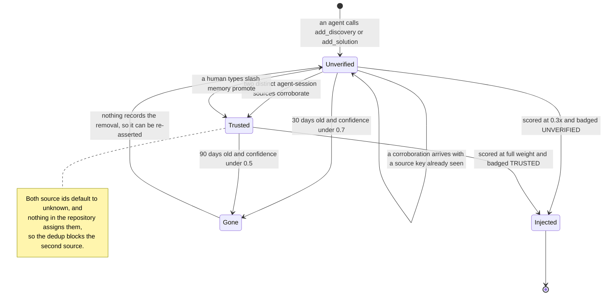

## 1. Executive Summary

CLIO is a **terminal-native coding agent written in pure Perl** — 160 modules and
102,862 lines under `lib/`, no CPAN, no npm, no pip, core modules only. That is
not a curiosity for this atlas so much as a constraint that shapes everything
downstream: there is no vector index, no embedding call and no database anywhere
in the memory system, because there is nothing to depend on. Memory is JSON on
disk and arithmetic.

The memory architecture is three tiers. **Short-term** is a fixed-size FIFO of
recent messages. **YaRN** — backronymed here as "Yet another Recurrence
Navigation", not the RoPE technique — is a full conversation archive that
compresses dropped messages into an accumulating `<thread_summary>` merged across
successive trim cycles. **Long-term memory** is `.clio/ltm.json`, per project,
holding five entry types (discoveries, problem-solutions, code patterns,
workflows, failures) that are injected into the system prompt at session start.

The reason to read this repository is the **corroboration tier system**, which is
the most thoroughly wired trust state in the atlas. Every LTM entry carries
`tier: unverified | trusted`, and the tier reaches the agent through three
independent channels rather than one:

- **Scoring** — `score_entry` multiplies by `0.3` for an unverified entry
  (`LongTerm.pm:889`), so it competes badly for the injection budget.
- **The prompt itself** — `_render_entry` appends a literal `[UNVERIFIED]` or
  `[TRUSTED]` badge plus the corroboration count to every rendered line
  (`LongTerm.pm:1028`), so the model is told the standing of each claim.
- **Decay** — `consolidate` decays unverified confidence at twice the rate and
  ages unverified entries out at 30 days against 90, with a higher confidence
  floor to survive (`LongTerm.pm:1226`, `:1253`).

The stated purpose is defence against memory poisoning, and the design is
correspondingly careful: promotion requires two corroborations from **distinct**
`agent:session` pairs, deduplicated so one source cannot vouch twice, and the
manual override `promote_entry` is wired only to the `/memory promote` slash
command — a human at the keyboard, never the model.

It could not work as shipped, and now it can. The source key is
`$source_agent:$source_session`, defaulting to
`$ENV{CLIO_AGENT_ID} // 'unknown'` and `$ENV{CLIO_SESSION_ID} // 'unknown'`
(`LongTerm.pm:474`). Until 31 July 2026 neither variable was assigned anywhere in
the repository, so every corroboration computed the same key, the sybil guard
`next if grep { $_ eq $source_key }` skipped the second one,
`corroboration_count` stopped at 1, and no entry ever reached the threshold of 2.
The failure was silent: nothing errored, every entry stayed `[UNVERIFIED]` at
`0.3x` forever, and because the penalty was then uniform across the corpus it
changed no relative ranking — the mechanism built to discriminate between
corroborated and uncorroborated knowledge discriminated between nothing.

**[`7af1d1cf8fd3ec6c5a8f5ddd39ace991d2979d6a`](https://github.com/SyntheticAutonomicMind/CLIO/commit/7af1d1cf8fd3ec6c5a8f5ddd39ace991d2979d6a)
wired it, and its test file cites this atlas as where the bug was flagged.** Both
entry points now stamp the identity before any tool runs: the `clio` script sets
`CLIO_AGENT_ID` to the broker agent id or `main` and `CLIO_SESSION_ID` to the
session id, and `SubAgent.pm` gives each child its own broker agent id, so a
parent and its sub-agents are genuinely distinct sources.

A second defect went with it, blocking the same mechanism from the other side and
invisible to a grep. `add_corroboration`, `promote_entry` and `get_entry_tier`
took an `entry_type` filter in the singular — `discovery`, `pattern` — and used
it directly as the LTM hash key, while entries are stored under plural keys —
`discoveries`, `code_patterns`. Every type-filtered call returned "No entry
matching", always. A `%LTM_CATEGORY_MAP` now normalizes in all three. Two
independent silent defects in one promotion path, and only one of them was
visible without running the property.

Two things the fix does not do, and both are live.

**The default is still the trap, and it is asserted as such.** The identity is
wired in the callers, not in the library. `LongTerm.pm` still falls back to
`unknown:unknown`, and the first subtest of the new regression file pins that
behaviour deliberately — *"default identity collapses to unknown:unknown and
never promotes"*. That is the right call for a regression test and it means
anything embedding `CLIO::Memory::LongTerm` without going through the `clio`
script or `SubAgent.pm` inherits the original bug intact.

**A session restart is now a vote.** The comment in `clio` states the identity
model plainly: *"Two sessions of the same agent count as different sources… a
session restart is a real barrier, not a free vote."* One person running
`clio --new` twice therefore promotes any entry they corroborate in both
sessions, without a second agent involved. Against an attacker who has already
achieved prompt injection in a single agent, restarting a session is not much of
a barrier. Stating the threat model in a comment beside the assignment is better
practice than most of this atlas manages; the model chosen is the weaker of the
two available, and `CLIO_AGENT_ID` is the field that would carry the stronger
one.

## 2. Mental Model

An LTM entry is **a typed claim about the project with a standing**. Not a
message, not a document, not a node — a sentence an agent asserted, carrying a
confidence float it chose, a tier the system computes, and a count of who has
independently said the same thing.

The five types are not interchangeable and the code knows it: `score_entry`
weights solutions at 1.3, patterns at 1.1, discoveries at 1.0, failures at 0.9
and workflows at 0.8, on the stated reasoning that *"solutions are actionable,
patterns are conventions."* A memory system that ranks by what a claim is *for*
rather than only by how well it matches is uncommon here.

### How a thing becomes a belief

**Only by the agent deciding to say so.** `memory_operations` exposes
`add_discovery`, `add_solution`, `add_pattern` and `add_corroboration`; the
system prompt instructs the model to record something when it discovers a
pattern, fixes a recurring bug, or learns a fact about the codebase. There is no
extraction pass and no automatic capture — `tests/unit/test_ltm_autocapture.pl.disabled`
tests a `CLIO::Memory::AutoCapture` module that **is not in `lib/CLIO/Memory/`**,
so that path was built and withdrawn, leaving the disabled test as its only
trace.

A new entry is born `unverified` with a caller-supplied confidence. It is
immediately eligible for injection — the tier costs it score, not visibility.

Promotion is meant to work like this: a second agent, in a different session,
independently confirms the claim and calls `add_corroboration`; the source key is
appended if new; at two distinct sources the entry flips to `trusted`. The
sybil-resistance is the dedup on the source list, and the intent is sound. The
identifiers it deduplicates on are the problem, in two compounding ways. They
default to a constant nothing sets, and where they are *not* defaulted they are
**tool parameters the model fills in** — `source_agent` and `source_session` are
optional string arguments on `memory_operations`. So the mechanism is either
unable to count to two, or counting identities supplied by the party it is
defending against.

### How a belief stops being one

Four ways, none of which leave a trace.

*Decay.* `consolidate` reduces confidence by 0.1 per 30-day period past a
threshold, doubled for unverified entries, with a floor of 0.3.

*Age-out.* An unverified entry older than 30 days with confidence under 0.7 is
dropped; a trusted entry survives to 90 days and a floor of 0.5.

*Dedup.* `consolidate` merges near-identical entries by Jaccard similarity over
extracted text.

*Prune.* A separate, flat `prune` drops by `max_age_days` (90) and
`min_confidence` (0.3) with no tier awareness at all — so the two cleanup paths
disagree about whether tier matters, and `/memory prune` invokes the one that
says it does not.

All four **delete**. There is no tombstone, no archive, no supersession pointer
and no log of what was removed. An entry that decayed out because nobody
corroborated it is indistinguishable from one that never existed, and the next
session's agent is free to rediscover and re-assert it — at which point it is
new, unverified, and starts the 30-day clock again.

## 3. Architecture

A single Perl program. `clio` is the entrypoint; `lib/CLIO/` holds 160 modules
covering providers, tools, sessions, sub-agents, MCP, a TUI, skills and memory.
Fifteen provider configurations, with native protocol adapters for Anthropic and
Google and OpenAI-compatible HTTP for the rest.

**Persistence is files.** `.clio/ltm.json` per project for long-term memory,
`.clio/memory/` for the session key-value store, session JSON files carrying
short-term memory inline, and YaRN thread archives. Writes go through
`CLIO::Util::AtomicWrite` — temp file plus rename — which the LTM module's own
docs cite as one of the patterns worth remembering.

**There is no server, no daemon and no worker.** Consolidation is called inline
from `PromptManager` while building the system prompt
(`PromptManager.pm:1551`), behind `maybe_consolidate`'s two gates: at least 24
hours since the last run and at least 20 entries. That is a clean instance of
gating an expensive path, and it also means the sweep happens on a user's turn,
in-process, and its cost lands on whichever turn crosses the threshold.

**Retrieval, on the injection path, does not exist.** `render_budgeted_section`
scores *every* entry, sorts, and emits the top slice under a 12,000-character
(~3,000-token) budget. There is no query, no relevance to the current task, and
no embedding — the ranking is `confidence × recency × type × usage × tier`, with
a 60-day recency half-life. An agent that wants something specific calls
`memory_operations` with a search, which is substring matching over entry text.

### Deployment and ergonomics

This is the lightest deployment in the atlas. Perl 5.32 and core modules; no
CPAN, no package manager, no service, no API key for storage. `install.sh` or a
Docker image. It runs over SSH into a headless box, which is the stated design
goal.

The store is a JSON file you can read, diff and hand-edit, and it lives in the
project directory. `--no-ltm` skips injection and `--incognito` skips both LTM
and custom instructions — described as *"fresh audit mode"*, which is the same
instinct [LoreKit](../lorekit/)'s skill documentation states in prose: a pass
that is meant to be adversarial must not be biased by prior runs. Here it is a
flag rather than advice.

## 4. Essential Implementation Paths

**Write** — `lib/CLIO/Tools/MemoryOperations.pm` dispatches
`add_discovery` / `add_solution` / `add_pattern` / `add_corroboration` into
`lib/CLIO/Memory/LongTerm.pm:117`, `:163`, `:212`, `:471`.

**Tier** — `add_corroboration` (`:471`) builds `$source_agent:$source_session`,
dedups against `corroboration_sources`, and promotes at count 2.
`promote_entry` (`:537`) sets the tier unconditionally and stamps `promoted_by`.
`get_entry_tier` (`:581`) reports.

**Score** — `score_entry` (`:852`), `get_scored_entries` (`:908`).

**Inject** — `render_budgeted_section` (`:945`) → `_render_entry` (`:1023`,
where the badge is attached) → `PromptManager.pm:1566`, gated by
`PromptBuilder.pm:119` for `--no-ltm` / `--incognito`.

**Consolidate** — `maybe_consolidate` (`:1372`) → `consolidate` (`:1201`):
tier-doubled decay, tier-differentiated age-out, Jaccard dedup via
`_jaccard_similarity` (`:1426`).

**Prune** — `prune` (`:1626`), flat and tier-blind, reached from
`/memory prune`.

**Human surface** — `lib/CLIO/UI/Commands/Memory.pm`: `list`, `store`, `clear`,
`prune`, `stats`, `corroborate`, `promote`, `tier`.

**Context recovery** — `lib/CLIO/Memory/YaRN.pm`'s `compress_messages`, plus
`ShortTerm.pm`'s FIFO and `TokenEstimator.pm`.

## 5. Memory Data Model

An entry is a JSON hash. Common fields: the claim text (named per type — `fact`,
`error`/`solution`, `pattern`), `confidence`, `timestamp`, `updated`,
`examples`, `source_agent`, `tier`, `corroboration_count`,
`corroboration_sources`, and type-specific counters (`solved_count`,
`search_count`, `verified`).

**`corroboration_sources` is the interesting column**, because it is the only
place in this atlas where a memory stores *the set of distinct principals that
have vouched for it*. Most systems here store a count or a confidence; this
stores identities, which is what makes the sybil dedup expressible at all. That
the identities are unusable at this commit does not make the shape wrong — it
makes it the right shape wired to the wrong source.

**Scoping is a directory.** LTM is `.clio/ltm.json` resolved from the current
working directory. There is no user, agent, team or tenant key, and no scope
field on an entry. Two projects share nothing; one project shared by two people
through git shares everything, including the `source_agent: 'unknown'` stamp on
every row.

**Temporal fields are record time only** — `timestamp` when first added,
`updated` when last touched. `absolutize_dates` (`:1460`) exists to convert
relative date language inside entry text, which is a small acknowledgement of
the problem the atlas's own methodology has a rule about, applied to the data
rather than the prose.

## 6. Retrieval Mechanics

Two distinct paths, and only one of them is retrieval in the usual sense.

**The injection path is a ranked dump.** Everything is scored; the highest slice
that fits 12,000 characters is rendered into the system prompt at session start.
Nothing about the current task influences the selection. For a per-project store
of tens of entries this is defensible and cheap — and it means the budget, not
relevance, is the only thing standing between the agent and the whole corpus.

**The tool path is substring matching.** `search_entries` and `_text_matches`
walk the arrays and compare lowercased text. No index, no ranking beyond the
score, no fuzzy matching.

The scoring function is the most legible in the atlas and worth reading as a
specimen: `confidence × recency × type_weight × usage × tier_weight`, where
usage adds `log(1 + solved_count) * 0.3` for solutions and
`log(1 + search_count) * 0.2` for anything agents have looked for, both with the
diminishing-returns rationale in a comment.

Failure modes:

- **The tier penalty is currently uniform**, so it reorders nothing.
- **`search_count` is a popularity loop.** An entry agents search for scores
  higher, which makes it likelier to be injected, which makes it likelier to be
  searched for. The atlas warns about exactly this; the diminishing-returns log
  softens it without breaking the cycle.
- **No relevance on the injection path** means a long-lived project's most
  valuable entry can lose its slot to a newer, more confident, less useful one.
- **Substring search misses paraphrase**, which matters more here than usual
  because corroboration is *found* by substring: `add_corroboration` matches an
  existing entry by `index(lc($text), $search_lc)`. An agent that phrases the
  same claim differently creates a second entry instead of corroborating the
  first.

## 7. Write Mechanics

Writes are **synchronous, agent-initiated and model-free**. No extraction prompt
exists because no extraction happens; the model calls a tool with the claim
already phrased. Cost is a JSON serialise and an atomic rename.

The confidence on a new entry is **supplied by the caller** — the model states
how sure it is, and nothing checks. That is the weakness the tier system exists
to compensate for, and the compensation is structural rather than evaluative: it
does not ask whether the claim is true, it asks whether anyone else said it. That
is the correct instinct, and it is why the broken source identity matters more
than a normal bug would.

Deduplication happens after the fact, in `consolidate`, by Jaccard similarity
over token sets. Two agents phrasing the same discovery differently produce two
entries until a consolidation pass merges them — or does not, if the wording
diverges enough.

Conflict handling does not exist. Two contradictory discoveries coexist, both
injected, both badged `[UNVERIFIED]`, ordered by score. Nothing detects the
contradiction and nothing surfaces it.

### Operational cost

Nothing blocks on a model or a network. The one place cost concentrates is
`maybe_consolidate` running inline on prompt build — a full pass over every
entry with a pairwise Jaccard comparison for dedup, on the turn that crosses the
24-hour gate. At the scale this store is designed for that is milliseconds; the
gate exists precisely so it is not paid every turn.

Injection is bounded at ~3,000 tokens and lands in the system prompt at session
start, not per turn, so it sits in the stable prefix rather than invalidating a
cache on every request.

That bound is a constant, and the rest of the context budget stopped being one in
this round. `TokenEstimator::compute_prompt_budget` now derives the conversation
budget from the model's declared `max_output_tokens` instead of reserving a flat
25% — or 50% after a trim — of the context window, with the module's own example
being a 1M-context model whose 128K output cap frees 172K of usable prompt that
the percentage heuristic was holding back. Three trim paths use it
(`ConversationManager`, `MessageValidator`, `ErrorHandler`) and it has a new
68-assertion test.

The memory slice did not move with it. `PromptManager.pm:1566` still calls
`render_budgeted_section(max_chars => 12000)` with the number written at the call
site, so a model with a million tokens of context and a model with eight thousand
receive the same three thousand tokens of long-term memory. That is defensible as
a default — more memory is not obviously better when the selection is a ranked
dump with no query — but it is now the one part of the context calculation that
does not know what model it is talking to.

## 8. Agent Integration

CLIO *is* the agent, so there is no integration surface in the plugin sense —
memory reaches the model two ways. The system prompt carries the budgeted LTM
section at session start, and `memory_operations` is one tool among many with
thirteen operations spanning the session key-value store, LTM writes, LTM
maintenance and `recall_sessions`.

The division of authority is the notable part and it is drawn deliberately. The
model may **write** entries, **corroborate** them, prune and inspect statistics.
The model may **not** promote — `promote_entry` is absent from the tool's
`supported_operations` list and reachable only from `/memory promote`. So the
one operation that unconditionally grants trust is fenced behind a human.

That fence is real and worth crediting, because it is the shape the atlas keeps
asking for: an automatic path with a threshold, and a manual override that only a
person can reach. What weakens it is that the automatic path is the one that does
not work, which inverts the intended default — instead of most entries being
promoted by corroboration and a few by hand, none are promoted by corroboration
and only hand-promoted entries are ever trusted.

Sub-agents can be spawned with file and git locks, which is what makes "two
distinct agents corroborating" a coherent idea in the first place, and the spawn
path now stamps `CLIO_AGENT_ID` with the child's broker agent id
(`SubAgent.pm:261`) so a parent and its sub-agent are genuinely distinct sources.
That is the configuration the tier system was designed for.

## 9. Reliability, Safety, and Trust

**The threat model is stated and it is the right one.** The docs name memory
poisoning explicitly and describe the tier system as the defence, including the
sybil concern in the phrase *"corroborations from the same `agent:session` pair
are deduplicated."* Very few systems in this atlas name an adversary at all.

**The defence has three real components and, now, a working input.** Scoring
penalty, prompt badge and differential decay are all implemented and all
reachable, and the corroboration counter that drives them is fed by identifiers
the two shipped entry points assign at startup. What remains is the strength of
the boundary rather than its existence: an `agent:session` pair where a restart
mints a new session means a single agent can supply both votes across two runs,
so the sybil resistance holds against a second voice in the same session and not
against the same voice twice.

**The guidance to the model is unusually good.** Agents are instructed to *"trust
but verify"* — to validate `[UNVERIFIED]` procedural patterns before acting on
them, and to corroborate what they independently confirm. Putting the standing of
a claim in the prompt beside the claim, rather than filtering silently, treats
the model as a participant in the trust decision. With promotion now reachable,
the badge finally varies across entries, which is the condition under which that
instruction means anything.

**Secret redaction runs before content reaches the provider**, per the README,
which is the right ordering and matches what the atlas expects.

**Data-loss risk is the deletion model.** Decay, age-out, dedup and prune all
remove rows outright with no archive and no record. A user who wants to know why
a memory disappeared has the log lines and nothing else, and `/memory clear`
empties the store.

**The two cleanup paths disagree.** `consolidate` treats an unverified entry as
more disposable; `prune` does not distinguish. A user running `/memory prune`
after reading the tier documentation gets behaviour the documentation does not
describe.

## 10. Tests, Evals, and Benchmarks

213 test files and 3,434 assertions across 40,587 lines against 102,862 lines of
source — broad coverage for a project of this size, and it includes a
`terminal-bench` directory and integration suites for sessions, sub-agents,
corruption recovery and provider protocols.

The memory layer is covered unevenly. `tests/unit/test_ltm_budget.pl` is good
work: it tests `score_entry` ordering (recent-high-confidence above
old-low-confidence, solutions above discoveries at equal confidence),
`get_scored_entries`, budgeted rendering, and that a tight budget forces
exclusions. `test_ltm_integration.pl` and `test_yarn_collaboration.pl` cover the
round trip and the archive.

**The tier system had no test, and that is how the bug survived.** At the
previous pin a grep across `tests/` for `corroborat`, `'trusted'`,
`add_corroboration` or `promote_entry` returned nothing: a mechanism with a
stated threat model, three enforcement points and a documented promotion
threshold, and no committed test. A single assertion that two corroborations
promote an entry would have failed and surfaced the unset environment variables
immediately. It remains the clearest case in the atlas of the specific value of a
test on a *mechanism* rather than on a *function* — every function here worked.

`tests/unit/test_ltm_corroboration.pl` now exists, 412 lines and thirteen
subtests, and it is the test that was missing. **I ran it: 92 assertions, none
failing**, on Perl 5.34 with `perl -Ilib`. It covers the default-identity trap,
promotion from two distinct sources, same-agent-different-session, env-var
identity, same-key dedup, the render badges, manual promote, save/load of
`corroboration_sources`, all five categories, tier-differentiated age-out during
consolidation, identity stamping by the `add_*` methods, explicit arguments
overriding the env vars, and the singular-to-plural filter mapping.

Two properties of it are worth separating from the fact that it passes. It
asserts the *shape* of the mechanism, not just its parts — subtest 2 walks an
entry from `unverified` to `trusted` by adding two corroborations under different
identities, which is the property the design claims. And subtest 1 pins the
broken default as intended behaviour, which is honest about where the fix lives:
in the callers, not in the library.

`tests/unit/test_ltm_autocapture.pl.disabled` tests a module that no longer
exists. Renaming a test rather than deleting it is a reasonable habit; leaving it
alongside 213 live files with no note of why is how a reader concludes automatic
capture exists when it does not.

No retrieval-quality evaluation, and none is really available: with a ranked-dump
injection and substring search there is nothing to score. Beyond
`test_ltm_corroboration.pl` I inspected the tests rather than running them.

## 11. For Your Own Build

### Steal

**Make a trust state cost something in three places at once.** A tier that only
filters is easy to ignore; CLIO's costs score weight, appears as a badge in the
rendered prompt, and shortens the age-out. Each is a few lines, and together they
mean an uncorroborated claim is quietly disadvantaged in ranking, explicitly
flagged to the model, and first to expire.

**Store the set of corroborating sources, not a count.** `corroboration_sources`
as an array of `agent:session` strings is what makes "two *independent* sources"
checkable rather than assertable, and it is the difference between a threshold
and a counter someone can spin.

**Fence the unconditional override behind a human.** Automatic promotion by
threshold, manual promotion by slash command, and the manual one absent from the
model's tool list. That is one line of tool registration doing real work.

**Weight a memory by what kind of claim it is.** Solutions at 1.3, workflows at
0.8, on the reasoning that solutions are actionable and workflows are
descriptive. Most ranking functions here treat all memory as one substance.

**Gate the expensive maintenance pass on two conditions, not one.** Twenty
entries *and* twenty-four hours means a busy day does not trigger a sweep and
neither does a stale, tiny store.

### Avoid

**Don't build a trust threshold on an identifier nothing assigns.** The whole
mechanism here turned on `CLIO_AGENT_ID` and `CLIO_SESSION_ID`, which were read
in seven places and written in none. Both entry points now set them at startup,
and the library default of `'unknown'` survives — pinned by a test — so the
lesson stands with a sharper edge: if a security property depends on an
environment variable, set it where the process starts *and* make the library
refuse rather than default, because a default of `'unknown'` converts a missing
configuration into a silent policy change for the next caller who arrives.

**Don't let the party you are defending against name its own witnesses.** Where
the env fallback does not apply, `source_agent` and `source_session` arrive as
optional tool arguments the model fills in. Sybil resistance evaluated on
caller-supplied identity is not resistance; derive the identity from the runtime
or do not claim the property.

**Don't ship two cleanup paths that disagree about your own trust model.**
`consolidate` treats unverified entries as more disposable and `prune` does not,
and the user-facing command calls the one that ignores the tier.

**Test the mechanism, not just the functions.** Every function in CLIO's tier
system behaved correctly in isolation. The property — *two corroborations promote
an entry* — was the thing that was broken, and it was exactly the assertion
nobody had written. Two independent defects were sitting in that gap, not one;
the second, a singular filter key against plural storage, was invisible to
inspection and would have failed the first time anyone asserted the property.
`test_ltm_corroboration.pl` is now the shape to copy: subtest 2 walks an entry
from `unverified` to `trusted` rather than checking that the pieces work.

**Don't leave a `.disabled` test for a module you removed.** It is a claim about
capability that outlives the capability.

### Fit

This suits **one developer who lives in a terminal and wants an agent with no
install surface**, and on that brief it is unusually well built: SSH into
anything with Perl, no runtime to provision, a memory file you can read and edit,
and an incognito flag for when you want the agent to think without its history.
The memory system is proportionate to that — tens of entries per project, ranked
arithmetically, injected once.

It does not suit a team, and not only because there is no scope key. A shared
`.clio/ltm.json` in git would carry every collaborator's discoveries stamped
`source_agent: 'unknown'`, with no way to tell whose claim is whose — which is
also, not coincidentally, the configuration in which the corroboration mechanism
would be most valuable and is most thoroughly disabled.

Read it for the tier design regardless of what you are building. The three-channel
enforcement and the source-set corroboration are the best-shaped answer in this
atlas to "how do I stop my agent believing something it made up once", and the
fault is in two unset variables rather than in the idea.

## 12. Open Questions

- **Is a session restart the boundary the threat model wants?** The identity
  comment argues it is. An attacker who can inject into one session can usually
  reach the next one too, and `CLIO_AGENT_ID` already exists to express the
  stronger rule. Whether the looser choice was made for the single-user case or
  on the merits is not recorded anywhere in the tree.
- **Will anything stop the library default returning?** The fix lives in two
  callers and the fallback to `unknown:unknown` is still in `LongTerm.pm`, pinned
  by a test as intended. A third entry point added later inherits the original
  bug by default rather than by omission.
- **What happened to `CLIO::Memory::AutoCapture`?** The disabled test implies an
  automatic-capture path was built. Whether it was removed for accuracy, cost or
  scope would say something about whether agent-initiated writes are a choice or
  a fallback.
- **How large does `ltm.json` get in practice?** Injection is budgeted but
  storage is not, and `consolidate` runs inline; the author has been developing
  CLIO with CLIO since January 2026, so a real store exists and would answer it.

## Appendix: File Index

**Long-term memory** — `lib/CLIO/Memory/LongTerm.pm` (1,725 lines: writes at
`:117`–`:440`, corroboration and tiers at `:471`–`:617`, scoring at `:852`,
rendering at `:945`–`:1092`, consolidation at `:1201`–`:1406`, persistence at
`:1513`–`:1584`, prune at `:1626`).

**Session and context** — `lib/CLIO/Memory/ShortTerm.pm`,
`lib/CLIO/Memory/YaRN.pm`, `lib/CLIO/Memory/TokenEstimator.pm`.

**Agent surface** — `lib/CLIO/Tools/MemoryOperations.pm` (1,099 lines, thirteen
operations).

**Human surface** — `lib/CLIO/UI/Commands/Memory.pm` (`corroborate`, `promote`,
`tier`, `prune`, `clear`, `stats`).

**Injection** — `lib/CLIO/Core/PromptManager.pm:1551`–`:1576`,
`lib/CLIO/Core/PromptBuilder.pm:119`.

**Tests** — `tests/unit/test_ltm_corroboration.pl`,
`tests/unit/test_ltm_budget.pl`, `tests/unit/test_prompt_budget.pl`,
`tests/integration/test_ltm_integration.pl`,
`tests/unit/test_yarn_collaboration.pl`,
`tests/unit/test_ltm_autocapture.pl.disabled`.

**Documentation** — `docs/MEMORY.md` (500 lines, and accurate about everything
except whether the promotion path can fire).
