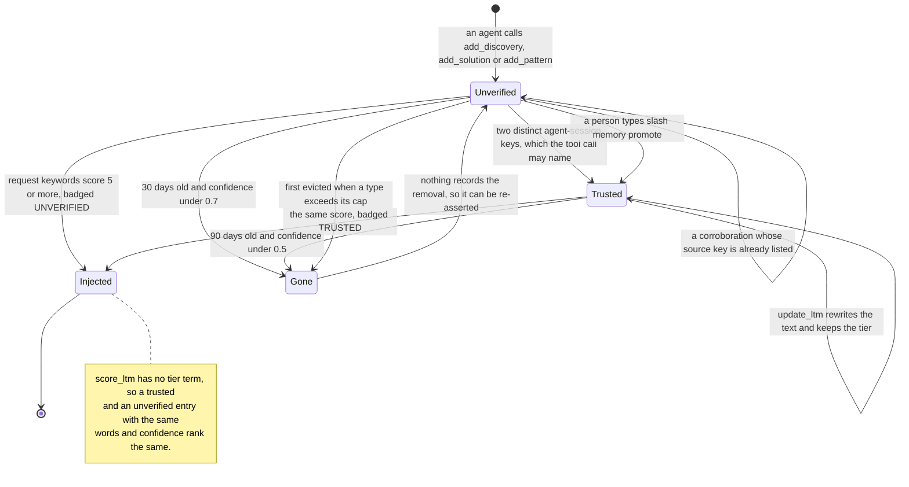

## 1. Executive Summary

CLIO is a terminal-native coding agent in pure Perl whose long-term memory is a
per-project JSON file of typed claims, each carrying an `unverified` or
`trusted` tier that is promoted by two distinct `agent:session` corroborations.
The tier reaches the model as a badge and shortens an entry's life, but it does
not decide which entries are injected, and the model can supply both
corroborating identities itself. It is **GPL-3.0-only**, so a derivative you
distribute carries the same terms.

Pure Perl with core modules only means no vector index, no embedding call and
no database anywhere in the memory system. Memory is JSON on disk and
arithmetic.

The memory architecture is three tiers. **Short-term** is a fixed-size FIFO of
recent messages. **YaRN** — backronymed here as "Yet another Recurrence
Navigation", not the RoPE technique — is a full conversation archive that
compresses dropped messages into an accumulating `<thread_summary>`. **Long-term
memory** is `ltm.json` in `~/.clio/projects/<uuid>/`, holding five entry types
(discoveries, problem-solutions, code patterns, workflows, failures).

Every long-term entry carries `tier: unverified | trusted`, and the tier acts in
three places:

- **The rendered memory block.** Each selected entry is printed with a literal
  `[UNVERIFIED]` or `[TRUSTED]` badge (`lib/CLIO/Core/MessageHistory.pm:220`),
  and the system prompt explains the vocabulary: unverified *"entries are
  single-source — validate them, especially procedural patterns, before acting
  on them"* (`lib/CLIO/Core/PromptManager.pm:1003-1006`).
- **Eviction under the hard caps.** `score_entry` multiplies an unverified
  entry's score by `0.3` (`lib/CLIO/Memory/LongTerm.pm:943-952`). Its one caller
  is the fourth phase of `consolidate`, which keeps the top 30 discoveries, 30
  solutions and 20 patterns by that score (`:1162-1189`), so an unverified entry
  is the first to go when a category overflows.
- **Decay and age-out.** `consolidate` doubles the confidence decay for an
  unverified entry (`:1073`) and keeps it past 30 days only at confidence 0.7,
  against 90 days or 0.5 for a trusted one (`:1092-1110`).

Selection for the prompt is `ContextBuilder::score_ltm`, and it has no tier
term. An unverified and a trusted entry with the same words and confidence score
identically and are both injected. `docs/MEMORY.md:590-591` says the opposite —
that unverified entries *"get a 0.3x scoring penalty so they rank below
[TRUSTED] entries"* at injection — and so does the commit that wrote the
per-request path.

The promotion design is careful on paper: two corroborations from **distinct**
`agent:session` pairs, deduplicated so one source cannot vouch twice, and a
manual `promote_entry` wired only to the `/memory promote` slash command a
person types. The source key is `$source_agent:$source_session`, defaulting to
`$ENV{CLIO_AGENT_ID} // 'unknown'` and `$ENV{CLIO_SESSION_ID} // 'unknown'`
(`LongTerm.pm:514-516`).

Until 31 July 2026 neither variable was assigned anywhere in the repository, so
every corroboration computed the same key, the dedup skipped the second one and
no entry could reach the threshold of 2.
[`657c8bcd7b76f69a11e9deee72551f1fd1b0e2e0`](https://github.com/SyntheticAutonomicMind/CLIO/commit/657c8bcd7b76f69a11e9deee72551f1fd1b0e2e0)
wired it, and its test file cites this atlas as where the bug was flagged. The
`clio` script sets `CLIO_AGENT_ID` to the broker agent id or `main` and
`CLIO_SESSION_ID` to the session id (`clio:1079-1080`), and
`lib/CLIO/Coordination/SubAgent.pm:268-269` gives each child its own agent id.

The same commit fixed a second defect on the same path. `add_corroboration`,
`promote_entry` and `get_entry_tier` took a singular `entry_type` filter —
`discovery`, `pattern` — and used it as the hash key, while entries live under
plural keys. Every type-filtered call returned "No entry matching". A
`%LTM_CATEGORY_MAP` normalizes all three.

Three weaknesses are live at this pin:

- **The model names its own witnesses.** `add_corroboration` is an operation of
  the model's `memory_operations` tool, and `source_agent` and `source_session`
  are optional string arguments on it. Two calls naming two sources promote an
  entry to `[TRUSTED]`.
- **A trusted entry's text is mutable.** `update_ltm`, another operation of the
  same tool, replaces a claim's text through `update_entry` and leaves `tier`
  and `corroboration_sources` as they were (`LongTerm.pm:307-392`).
- **The library default is the original trap.** `LongTerm.pm` falls back to
  `unknown:unknown`, and the first subtest of the regression file pins that
  behaviour — *"default identity collapses to unknown:unknown and never
  promotes"*. Anything embedding `CLIO::Memory::LongTerm` without going through
  the two entry points inherits the bug.

## 2. Mental Model

An LTM entry is **a typed claim about the project with a standing**. Not a
message, not a document, not a node — a sentence an agent asserted, carrying a
confidence float it chose, a tier the system computes, and the list of sources
that have said the same thing.

The five types are not interchangeable in the eviction score: `score_entry`
weights solutions at 1.3, patterns at 1.1, discoveries at 1.0, failures at 0.9
and workflows at 0.8, on the stated reasoning that *"solutions are actionable,
patterns are conventions"* (`LongTerm.pm:918-925`). That weighting decides
which entries survive a hard cap; it does not decide which are injected.

### How a thing becomes a belief

**Only by the agent deciding to say so.** `memory_operations` exposes
`add_discovery`, `add_solution`, `add_pattern` and `add_corroboration`, and the
system prompt tells the model to store new patterns, solutions or discoveries as
it works. There is no extraction pass and no automatic capture. A
`_prompt_session_learnings` routine in `lib/CLIO/UI/Chat.pm:3201` would ask the
user for learnings at exit and store them as verified discoveries, and nothing
calls it.

A new entry is born `unverified` with a caller-supplied confidence, 0.8 by
default, and is immediately eligible for injection — the tier costs it standing
in the badge and in eviction, not visibility.

Promotion is meant to work like this: a second agent, in a different session,
independently confirms the claim and calls `add_corroboration`; the source key
is appended if new; at two distinct sources the entry flips to `trusted`
(`LongTerm.pm:568-572`). The dedup on the source list is the sybil resistance.
The identifiers it deduplicates on are the weakness: where they are not taken
from the environment they are tool parameters the model fills in, and one agent
restarted once also counts as two sources.

A belief can change underneath its standing. `update_ltm` rewrites the text of
the first entry whose text contains a search string and refreshes its
`updated` stamp, and a `[TRUSTED]` entry keeps its tier and its source list with
a claim nobody corroborated.

### How a belief stops being one

Five ways, none of which leave a trace.

*Decay.* `consolidate` reduces confidence by 0.1 per 30-day period past 60 days
without an update, doubled for unverified entries, with a floor of 0.3.

*Age-out.* An unverified entry older than 30 days with confidence under 0.7 is
dropped; a trusted entry survives to 90 days and a floor of 0.5.

*Dedup.* `consolidate` merges near-identical entries by Jaccard similarity at
0.7, keeping the more confident.

*Hard caps.* Over 30 discoveries, 30 solutions or 20 patterns, the lowest
`score_entry` values are dropped, and the `0.3` tier weight puts unverified
entries at the bottom.

*Prune.* A separate, flat `prune` drops by `max_age_days` (90) and
`min_confidence` (0.3) with no tier awareness, and both `/memory prune` and the
model's `prune_ltm` operation reach it.

All five **delete**. There is no tombstone, no archive, no supersession pointer
and no log of what was removed. An entry that aged out because nobody
corroborated it is indistinguishable from one that never existed, and the next
session's agent is free to re-assert it as new and unverified.

```mermaid
%% caption: the tier decides the badge, eviction order and lifetime, not selection; selection is keyword overlap, and promotion accepts source names the model supplies
stateDiagram-v2
    [*] --> Unverified: an agent calls add_discovery, add_solution or add_pattern
    Unverified --> Unverified: a corroboration whose source key is already listed
    Unverified --> Trusted: two distinct agent-session keys, which the tool call may name
    Unverified --> Trusted: a person types slash memory promote
    Trusted --> Trusted: update_ltm rewrites the text and keeps the tier
    Unverified --> Injected: request keywords score 5 or more, badged UNVERIFIED
    Trusted --> Injected: the same score, badged TRUSTED
    Unverified --> Gone: 30 days old and confidence under 0.7
    Trusted --> Gone: 90 days old and confidence under 0.5
    Unverified --> Gone: first evicted when a type exceeds its cap
    Gone --> Unverified: nothing records the removal, so it can be re-asserted
    Injected --> [*]
    note right of Injected
        score_ltm has no tier term, so a trusted
        and an unverified entry with the same
        words and confidence rank the same.
    end note
```

## 3. Architecture

A single Perl program. `clio` is the entrypoint; `lib/CLIO/` holds 165 modules
covering providers, tools, sessions, sub-agents, MCP, a TUI, skills and memory.
Eighteen provider entries sit in `lib/CLIO/Providers.pm`, with native protocol
adapters for Anthropic and Google and OpenAI-compatible HTTP for the rest.

**Persistence is files, outside the project tree.** Runtime data lives in
`~/.clio/projects/<uuid>/`: `ltm.json` for long-term memory, `memory/` for the
session key-value store, `sessions/` for session JSON carrying short-term
memory, and YaRN archives. The UUID is read from `.clio/project_uuid` at the
project root and generated on first launch (`lib/CLIO/Util/PathResolver.pm:181`).
Writes go through `CLIO::Util::AtomicWrite` — temp file plus rename
(`LongTerm.pm:1624`).

The first launch that generates a UUID also moves an older layout's
`.clio/ltm.json`, `sessions/`, `memory/`, `vault/` and `logs/` into the new
directory, skipping any target that exists (`PathResolver.pm:340`). The UUID
file is covered by the `.clio/*` rule CLIO writes into `.gitignore` at startup
(`lib/CLIO/Util/GitIgnore.pm:52-57`), so each clone gets its own store, and a
directory copy that carries the file shares one.

**There is no server, no daemon and no worker.** `maybe_consolidate` runs
in-process when a session starts and when one is loaded
(`lib/CLIO/Session/Manager.pm:207`, `lib/CLIO/Session/State.pm:215`), behind
two gates: at least 24 hours since the last run and at least 20 entries. Its
cost lands on whichever session start crosses the threshold.

**Injection is per request.** `WorkflowOrchestrator` reads every entry through
`get_entries_for_projection`, `ContextBuilder::score_ltm` keeps at most five by
keyword relevance, and `MessageHistory::messages_to_prose_dynamic` renders them
into a block prepended to the user's message. An agent that wants something
specific calls `memory_operations` with `search`, which is substring matching
over entry text.

### Deployment and ergonomics

Perl 5.32 and core modules; no CPAN, no package manager, no service, no API key
for storage. `install.sh` or a Docker image. It runs over SSH into a headless
box, which is the stated design goal.

The store is a JSON file you can read, diff and hand-edit, in a directory named
by a UUID you look up in the project's `.clio/project_uuid`. `--no-ltm` skips
injection and `--incognito` skips both LTM and custom instructions
(`clio:309-316`) — described as *"fresh audit mode"*, the same instinct
[LoreKit](../lorekit/)'s skill documentation states in prose: a pass meant to be
adversarial must not be biased by prior runs. Here it is a flag rather than
advice.

## 4. Essential Implementation Paths

**Write** — `lib/CLIO/Tools/MemoryOperations.pm` dispatches `add_discovery` /
`add_solution` / `add_pattern` into `lib/CLIO/Memory/LongTerm.pm:146`, `:192`
and `:246`, and saves through `_save_ltm`, which resolves the file with
`PathResolver::find_ltm_path`.

**Tier** — `add_corroboration` (`:511`) builds `$source_agent:$source_session`
(`:516`), dedups against `corroboration_sources`, and promotes at count 2
(`:568`). `promote_entry` (`:612`) sets the tier unconditionally and stamps
`promoted_by`. `get_entry_tier` (`:658`) reports. The tool handler
(`MemoryOperations.pm:1184-1218`) reads both source names from the call and
defaults the agent to `CLIO_AGENT_ID` or `main`.

**Correct** — `update_ltm` (`MemoryOperations.pm:1017`) → `update_entry`
(`LongTerm.pm:307`): substring match, text replaced, tier untouched.

**Select** — `WorkflowOrchestrator::_read_ltm_entries_for_projection`
(`lib/CLIO/Core/WorkflowOrchestrator.pm:3225`, gated on `skip_ltm` at `:1209`)
→ `ContextBuilder::score_ltm` (`lib/CLIO/Core/ContextBuilder.pm:326`). The score
is three times the input overlap, twice the task and unresolved overlaps, plus
confidence, plus 2 for framework-meta entries during framework work; threshold
5, cap 5, confidence floor 0.5 (`:92-94`, `:390-434`). The tier is copied
through at `:412` and not scored.

**Inject** — `MessageHistory::messages_to_prose_dynamic`
(`lib/CLIO/Core/MessageHistory.pm:192-250`): five entries, 500 characters each,
grouped by type under `## Long-Term Memory`, badge at `:220`; prepended to the
user message at `WorkflowOrchestrator.pm:1291-1294`.

**Consolidate** — `maybe_consolidate` (`LongTerm.pm:1217`) → `consolidate`
(`:1046`): tier-doubled decay (`:1073`), tier-differentiated age-out
(`:1092-1110`), Jaccard dedup via `_jaccard_similarity` (`:1280`), hard caps
ordered by `score_entry` (`:1162-1189`, scoring at `:907`).

**Prune** — `prune` (`:1717`), flat and tier-blind, reached from
`/memory prune` and the model's `prune_ltm`.

**Human surface** — `lib/CLIO/UI/Commands/Memory.pm:84-110`: `list`, `store`,
`clear`, `prune`, `stats`, `corroborate`, `promote`, `tier`, routed from
`Chat.pm:514` for input that begins with `/`.

**Context recovery** — `lib/CLIO/Memory/YaRN.pm`'s `compress_messages`, plus
`ShortTerm.pm`'s FIFO and `TokenEstimator.pm`.

## 5. Memory Data Model

An entry is a JSON hash. Common fields: the claim text (named per type — `fact`,
`error`/`solution`, `pattern`), `confidence`, `timestamp`, `updated`,
`examples`, `source_agent`, `source_session`, `tier`, `corroboration_count`,
`corroboration_sources`, and type-specific counters (`solved_count`,
`search_count`, `verified`).

**`corroboration_sources` is the column to copy**, because it stores the set of
distinct principals that have vouched for the entry rather than a count, and that
is what makes the sybil dedup expressible at all. The author is not in the set:
`add_discovery` stamps `source_agent` and starts `corroboration_sources` empty
(`LongTerm.pm:166-176`), so an author's own later corroboration counts as one of
the two.

**Scoping is a directory.** LTM is `ltm.json` in the data directory the
project's UUID names, resolved from the process's working directory by walking
up to the nearest `.clio/` or `.git/` (`PathResolver.pm:830-851`). There is no
user, agent, team or tenant key, and no scope field on an entry. Two projects
share nothing, and two clones of one repository share nothing either, because
each generates its own UUID.

**Temporal fields are record time only** — `timestamp` when first added,
`updated` when last touched, including by a text rewrite or a search hit.
`absolutize_dates` (`:1314`) converts relative date language inside entry text
at write time.

## 6. Retrieval Mechanics

Two paths, and only one reaches the prompt without being asked.

**The injection path is relevance selection.** On every request `score_ltm`
tokenizes the user input, the active task and the unresolved state, scores each
entry by keyword overlap with them plus its confidence, drops anything under
confidence 0.5, keeps what scores 5 or more, and caps the list at five
(`ContextBuilder.pm:326-434`). A framework-meta boost of 2 lifts entries naming
two or more prompt-and-context words when the request is about the framework
too.

**The tier is not a term in that score.** It is copied onto the selected entry
at `:412` so the renderer can badge it. The upstream commit that built this
path, [`398e72b7f8183804dc6b9ce2ab920c5060609b9f`](https://github.com/SyntheticAutonomicMind/CLIO/commit/398e72b7f8183804dc6b9ce2ab920c5060609b9f)
on 10 September 2026, describes it as restoring *"the three-channel tier
enforcement (scoring penalty + prompt badge + differential decay)"*. It carried
the tier through to the badge; the scoring penalty stayed in `score_entry`,
whose one caller is the cap phase of `consolidate`.

**The tool path is substring matching.** The `search` operation queries the
session key-value store and `LongTerm::search_entries`
(`MemoryOperations.pm:365-366`), which accepts an entry when the query is a
substring of its text or two query words appear in it. Every hit sets `updated`
to the current time and increments `search_count` (`LongTerm.pm:829-832`). That
resets the entry's decay and age-out clocks and raises its cap score, so
searching an entry keeps it alive; it does not affect injection.

Failure modes:

- **Selection ignores standing.** A single-source entry and a corroborated one
  compete on keywords and self-reported confidence alone; the badge is the only
  difference the model sees.
- **Keyword overlap misses paraphrase.** A request phrased differently from the
  entry scores under 5 and the entry is not shown, however relevant.
- **Corroboration is found by substring.** `add_corroboration` matches an
  existing entry by `index(lc($text), $search_lc)` (`LongTerm.pm:537`), so an
  agent that phrases the same claim differently creates a second entry instead
  of corroborating the first — and a short search string corroborates whichever
  entry contains it first.

## 7. Write Mechanics

Writes are **synchronous, agent-initiated and model-free**. No extraction prompt
exists because no extraction happens; the model calls a tool with the claim
already phrased. Cost is a JSON serialise and an atomic rename, and the entry
is selectable on the next request.

The confidence on a new entry is **supplied by the caller** — the model states
how sure it is, and the tool checks only that it lies between 0 and 1
(`lib/CLIO/Tools/MemoryOperations.pm:848`, `:944`). Confidence is also a term in the injection
score and the gate of its 0.5 floor, so the one number selection reads is the
one the model sets. The tier's compensation is structural rather than
evaluative: it asks whether anyone else said the claim, not whether it is true.

Deduplication happens after the fact, in `consolidate`, by Jaccard similarity
over token sets. Two agents phrasing the same discovery differently produce two
entries until a consolidation pass merges them — or does not, if the wording
diverges enough.

Conflict handling does not exist. Two contradictory discoveries coexist, both
badged `[UNVERIFIED]`, and both are injected when a request matches them.

### Operational cost

Nothing blocks on a model or a network. The one place cost concentrates is
`maybe_consolidate` at session start — a full pass over every entry with a
pairwise Jaccard comparison for dedup, on the start that crosses the 24-hour
gate. At tens of entries that is milliseconds.

Injection is bounded at five entries of 500 characters each
(`MessageHistory.pm:197-198`) and sits in the user message, rebuilt every
request. The system prompt holds no memory content, so the prompt prefix a
provider caches is unaffected; the upstream commit that put it there gives that
as the reason.

The context budget around it is model-aware. `TokenEstimator::compute_prompt_budget`
derives the conversation budget from the model's declared `max_output_tokens`,
and three trim paths use it (`ConversationManager`, `MessageValidator`,
`ErrorHandler`). The memory block does not: five entries of 500 characters
reach a million-token model and an eight-thousand-token model alike.

## 8. Agent Integration

CLIO *is* the agent, so there is no integration surface in the plugin sense —
memory reaches the model two ways. The per-request memory block rides in the
user message, and `memory_operations` is one tool among many with thirteen
operations spanning the session key-value store, LTM writes, LTM maintenance
and `recall_sessions` (`MemoryOperations.pm:65`).

The division of authority is drawn deliberately and is incomplete. The model may
**write** entries, **rewrite** them with `update_ltm`, **corroborate** them,
prune and inspect statistics. The model may **not** promote — `promote_entry` is
absent from `supported_operations` and reachable only from `/memory promote`.
`add_corroboration` is on the tool with both identity arguments, so the
threshold path is reachable by the same caller the fence excludes.

Sub-agents can be spawned with file and git locks, which is what makes "two
distinct agents corroborating" a coherent idea, and the spawn path stamps
`CLIO_AGENT_ID` with the child's broker agent id (`SubAgent.pm:268`). That is the
configuration the tier system was designed for.

## 9. Reliability, Safety, and Trust

**The threat model is stated.** `docs/MEMORY.md:229` introduces the tier system
as a defence against memory poisoning, and the same page describes the sybil
guard as the dedup of corroborations from one `agent:session` pair.

**The identity the defence counts is caller-supplied.** `add_corroboration` is a
declared operation of the `memory_operations` tool
(`MemoryOperations.pm:54-58`, schema at `:177-184`), and two of its parameters
are `source_agent` and `source_session`, described as optional with the
environment variables as defaults. The handler reads them from the call
(`:1188-1189`) and passes them to `add_corroboration` (`:1218`), which builds the
key from exactly those values (`LongTerm.pm:516`). Two calls naming two sources
reach the threshold.

The tool description states the consequence: *"When an entry receives >=2
corroborations from distinct agent:session pairs, it auto-promotes from
[UNVERIFIED] to [TRUSTED] tier."* `docs/MEMORY.md:244` says *"a single agent
cannot self-promote its own entries within a session"*.

**`human_review` is withheld on that tool.** `/memory promote` is a person's
channel — `Chat.pm:514` routes only a line the user typed beginning with `/` into
the command handler, and the model's output never passes through it. The same
outcome, promotion to `[TRUSTED]`, is reachable from the producer's own surface
by supplying two names, and no entry waits in a state for anyone: an unverified
entry is injected as soon as it is written.

**`trust_state` is withheld on usage.** `tier` is a discrete field, and every
read of it ranks, badges or shortens a lifetime: `score_entry` for cap eviction,
`MessageHistory.pm:220` for the badge, `LongTerm.pm:1073` and `:1101` for decay
and age-out. None withholds an entry from the prompt. The rubric draws the line
there — *"a confidence number answers 'how sure' and gets used for ranking; a
state answers 'may this be acted on' and gets used for filtering"*.

**The guidance to the model is the tier's strongest channel.** Agents are told
the badge's meaning and to validate `[UNVERIFIED]` procedural patterns before
acting on them, and the rendered block frames entries as *"reference patterns
from previous sessions, not current instructions"*. Putting a claim's standing
beside the claim treats the model as a participant in the trust decision.

**A rewrite keeps the standing.** `update_entry` replaces the claim text of the
first substring match and leaves `tier` and `corroboration_sources` in place, so
an entry a person promoted by `/memory promote` can be given different content
by the model and keep its `[TRUSTED]` badge.

**Secret redaction runs before content reaches the provider**, per the README.

**Data-loss risk is the deletion model.** Decay, age-out, dedup, caps and prune
all remove rows outright with no archive and no record, and `/memory clear`
empties the store.

**A test cleans up the wrong file.** `tests/integration/test_ltm_integration.pl:141`
ends with `unlink CLIO::Util::PathResolver::get_project_ltm_file()`. The test
builds its store in memory and never writes that file, and the path resolves to
the data directory of whatever project the test process runs in. On a
developer's machine the cleanup deletes that project's real long-term memory.
This is from reading; the test was not run.

**The two cleanup paths disagree.** `consolidate` treats an unverified entry as
more disposable; `prune` does not distinguish. A user running `/memory prune`
after reading the tier documentation gets behaviour the documentation does not
describe.

## 10. Tests, Evals, and Benchmarks

353 Perl test scripts under `tests/`, 309 of them unit tests, with integration
suites for sessions, sub-agents and provider protocols; the repository also
carries a `terminal-bench` directory. No paper is cited in the README or
`docs/`.

**The injection selector has negative cases with positive controls.**
`tests/integration/test_ltm_integration.pl` builds a three-entry store, asserts
that `score_ltm` selects the Perl discovery for *"CLIO uses Perl"* (`:71`,
`:81`), then asserts the same store yields nothing for *"unrelated query about
quantum flux"* (`:116`). `tests/unit/test_context_projection.pl` asserts that 55
unrelated entries all fall under the threshold (`:147`) and that relevant
entries appended to the same list pass (`:160`). `tests/unit/test_prose_followups.pl`
pairs a framework memory that surfaces during framework work (`:482`) with the
same memory absent for unrelated work (`:499`).

Each is a populated result set with a named entry excluded and a control
showing the selector returns something, which is what the `negative_eval` mark
asks for. None asserts anything about the tier, and no test asserts that an
unverified entry ranks below a trusted one at injection — the property the docs
claim and the code does not have.

`tests/unit/test_ltm_corroboration.pl` covers the tier: 408 lines, thirteen
subtests — the default-identity trap, promotion from two distinct sources,
same-agent-different-session, env-var identity, same-key dedup, the tier field,
manual promote, save/load of `corroboration_sources`, all five categories,
tier-differentiated age-out, identity stamping by the `add_*` methods, explicit
arguments overriding the env vars, and the singular-to-plural filter mapping. I
ran it at [`6f462b8a5a5d8c33c1d624824668aff8ab67ebca`](https://github.com/SyntheticAutonomicMind/CLIO/commit/6f462b8a5a5d8c33c1d624824668aff8ab67ebca)
on Perl 5.34 with `perl -Ilib`: 92 assertions, none failing. I ran nothing at
this pin.

It asserts the *shape* of the mechanism — subtest 2 walks an entry from
`unverified` to `trusted` under two identities — and subtest 1 pins the broken
default as intended behaviour. Subtest 12, *"explicit args override env-var
fallback"*, asserts the property section 9 describes as the weakness: two named
sources promote.

`tests/unit/test_ltm_budget.pl` tests `score_entry` ordering and `update_entry`,
and asserts nothing about the tier surviving an update.

## 11. For Your Own Build

### Steal

**Make a trust state cost something in more than one place.** CLIO's tier
appears as a badge beside the claim, orders eviction when a category is full,
and shortens the age-out. Each is a few lines, and together an uncorroborated
claim is flagged to the model, first to be evicted and first to expire.

**Store the set of corroborating sources, not a count.** `corroboration_sources`
as an array of `agent:session` strings is what makes "two *independent*
sources" checkable rather than assertable.

**Fence the unconditional override behind a human.** Manual promotion by slash
command, absent from the model's tool list, is one line of tool registration
doing real work.

**Test relevance selection in both directions.** CLIO's selector tests pair an
unrelated query that must return nothing with a related one that must return
the entry, over the same store.

**Gate the expensive maintenance pass on two conditions, not one.** Twenty
entries *and* twenty-four hours means a busy day does not trigger a sweep and
neither does a stale, tiny store.

### Avoid

**Don't let the party you are defending against name its own witnesses.**
`source_agent` and `source_session` arrive as optional tool arguments the model
fills in. Sybil resistance evaluated on caller-supplied identity is not
resistance; derive the identity from the runtime or do not claim the property.

**Don't let an edit inherit a standing it did not earn.** A text rewrite that
keeps `trusted` turns every promoted entry into a slot anyone with the update
verb can refill. Reset the tier and the source list on a content change.

**Don't let the ranker and the docs disagree about the trust signal.** The
0.3x weight sits in a function the injection path does not call, and the
documentation and the commit that built the path both describe it as applied
there. A test asserting that a trusted entry outranks an unverified twin would
have failed.

**Don't build a trust threshold on an identifier with a silent default.** The
library's `'unknown'` fallback converts a missing configuration into a policy
change for the next caller. Set the identity where the process starts *and* make
the library refuse rather than default.

**Don't ship two cleanup paths that disagree about your own trust model.**
`consolidate` treats unverified entries as more disposable and `prune` does not,
and the user-facing command calls the one that ignores the tier.

**Don't resolve a test's cleanup path from the live process.** A cleanup that
asks the application where its data lives deletes the application's data.

### Fit

This suits **one developer who lives in a terminal and wants an agent with no
install surface**: SSH into anything with Perl, no runtime to provision, a memory
file you can read and edit, and an incognito flag for when you want the agent to
think without its history. The memory system is proportionate to that — tens of
entries per project, selected by keyword, injected five at a time.

It does not suit a team. Each clone has its own store, so knowledge does not
travel with the repository, and the corroboration mechanism — whose value is
independent confirmation — never sees a second person's session.

Treat the tier as advice to the model, not as a gate. The design names the
right threat and stores the right shape of evidence; at this pin the model can
supply that evidence itself and selection ignores it.

## 12. Open Questions

- **Is a session restart the boundary the threat model wants?** The identity
  comment in `clio` argues it is — *"a session restart is a real barrier, not a
  free vote"*. An attacker who can inject into one session can usually reach the
  next, and `CLIO_AGENT_ID` exists to express the stronger rule.
- **Was the tier meant to be a term in `score_ltm`?** The docs and the commit
  message say it is. Whether its absence is a regression or a decision is not
  recorded in the tree.
- **Will anything stop the library default returning?** The fallback to
  `unknown:unknown` is in `LongTerm.pm`, pinned by a test as intended. A third
  entry point added later inherits the original bug by default.
- **How large does `ltm.json` get in practice?** The caps bound three of five
  types at 80 entries, and workflows and failures are bounded only by age-out.

## Appendix: File Index

**Long-term memory** — `lib/CLIO/Memory/LongTerm.pm` (1,816 lines:
`add_discovery` at `:146`, `update_entry` at `:307`, `add_corroboration` at
`:511`, `promote_entry` at `:612`, `score_entry` and the 0.3x tier weight at
`:907`–`:952`, `get_entries_for_projection` at `:973`, `consolidate` at `:1046`
with the doubled decay at `:1073`, the differential age-out at `:1092`–`:1110`
and the hard caps at `:1162`–`:1189`, `maybe_consolidate` at `:1217`, `prune` at
`:1717`).

**Storage location** — `lib/CLIO/Util/PathResolver.pm` (`get_project_data_dir`
at `:181`, migration at `:340`, `get_project_ltm_file` at `:542`,
`find_clio_dir` at `:830`), `lib/CLIO/Util/GitIgnore.pm`.

**Selection and rendering** — `lib/CLIO/Core/ContextBuilder.pm` (`score_ltm` at
`:326`, constants at `:92`–`:94`), `lib/CLIO/Core/MessageHistory.pm:192`–`:250`
(the memory block, badge at `:220`), `lib/CLIO/Core/WorkflowOrchestrator.pm:1209`
and `:1291`–`:1294`, `lib/CLIO/Core/PromptManager.pm:997`–`:1006` (the "Trust but
Verify" briefing).

**Session and context** — `lib/CLIO/Memory/ShortTerm.pm`,
`lib/CLIO/Memory/YaRN.pm`, `lib/CLIO/Memory/TokenEstimator.pm`,
`lib/CLIO/Session/Manager.pm:195`–`:207`, `lib/CLIO/Session/State.pm:204`–`:215`.

**Agent surface** — `lib/CLIO/Tools/MemoryOperations.pm` (1,256 lines;
`supported_operations` at `:65`, `update_ltm` at `:1017`, `add_corroboration` at
`:1184`).

**Identity** — `clio:1079`–`:1080`, `lib/CLIO/Coordination/SubAgent.pm:268`–`:269`.

**Human surface** — `lib/CLIO/UI/Commands/Memory.pm` (`corroborate`, `promote`,
`tier`, `prune`, `clear`, `stats`), `lib/CLIO/UI/Chat.pm:514`.

**Tests** — `tests/unit/test_ltm_corroboration.pl`,
`tests/integration/test_ltm_integration.pl`,
`tests/unit/test_context_projection.pl`, `tests/unit/test_prose_followups.pl`,
`tests/unit/test_messages_to_prose_dynamic.pl`, `tests/unit/test_ltm_budget.pl`,
`tests/unit/test_prompt_budget.pl`, `tests/unit/test_yarn_collaboration.pl`.

**Documentation** — `docs/MEMORY.md` (647 lines; the tier table at `:231`–`:234`
and the session-start description at `:587`–`:591` credit injection with the
0.3x penalty).

## Appendix: Recorded Searches

Run from the root of the checkout at the pinned commit.

| Claim | Command | Result at this pin |
| --- | --- | --- |
| The 0.3x tier weight exists | `git grep -n -E "tier_weight" -- lib/CLIO/Memory/LongTerm.pm` | `:944-952`, `0.3` for unverified, multiplied into the score |
| `score_entry` has one caller, the cap phase | `git grep -n -E "score_entry\(" -- lib` | `lib/CLIO/Memory/LongTerm.pm:1179` only |
| The injection score has no tier term | `git grep -n -E "tier" -- lib/CLIO/Core/ContextBuilder.pm` | comments at `:59`, `:388` and `:417`, and the pass-through at `:412`; no arithmetic |
| Every read of the tier ranks, badges or ages | `git grep -n -E "tier[^=]{0,12} (eq\|ne) '" -- lib` | the badge, promotion, `score_entry`, decay, age-out and two display lines; none excludes an entry from selection |
| The age-out is a third, not a half | read `lib/CLIO/Memory/LongTerm.pm:1092-1110` | 30 days or confidence 0.7 for unverified; 90 days or 0.5 for trusted |
| The sybil key takes caller values | read `lib/CLIO/Memory/LongTerm.pm:511-516` and `lib/CLIO/Tools/MemoryOperations.pm:1184-1218` | `$source_key = "$source_agent:$source_session"` from the call's arguments |
| A rewrite keeps the tier | `git grep -n -E "tier\|corroboration" -- lib/CLIO/Memory/LongTerm.pm`, then read `:307-392` | no hit falls inside `update_entry` |
| No scope key on a read | `git grep -n -i -E "tenant\|user_id\|owner\|namespace" -- lib/CLIO/Memory` | Nothing |
| No deletion record | `git grep -n -i -E "tombstone\|audit_log\|deleted_at\|archive" -- lib/CLIO/Memory` | Nothing |
| No automatic capture module | `git ls-files \| grep -i -E "autocapture"`; `git grep -n -i -E "autocapture" -- lib tests` | Nothing; the disabled test was deleted on 10 September 2026 |
| No paper | `git grep -n -i -E "arxiv\|bibtex\|@article\|@misc\|doi\.org" -- README.md docs` | Nothing |
| No caller for the session-learnings prompt | `git grep -n -E "_prompt_session_learnings" -- lib clio` | the POD heading and the definition, `lib/CLIO/UI/Chat.pm:3191` and `:3201` |
| No model call in the memory modules | `git grep -n -i -E "APIManager\|send_request\|chat_completion" -- lib/CLIO/Memory` | comments in `TokenEstimator.pm` only |
| No database in the memory modules | `git grep -n -i -E "DBI\|sqlite\|DB_File" -- lib/CLIO/Memory` | Nothing |
| The integration test never writes the file it deletes | `git grep -n -E "save\|get_project_ltm_file" -- tests/integration/test_ltm_integration.pl` | the `unlink` at `:141` and two lines containing the word in fixture text |
| No test compares trusted and unverified at selection | `git grep -l -E "score_ltm" -- tests \| xargs git grep -n -E "trusted\|TRUSTED" --` | badge rendering and tier pass-through assertions; none orders one tier above the other |
| No test of the tier across an update | `git grep -n -E "tier" -- tests/unit/test_ltm_budget.pl` | Nothing |
| Tree and suite size | `git ls-files lib \| grep -E "\.pm$" \| xargs cat \| wc -l`; `git ls-files tests \| grep -c -E "\.pl$"` | 114,919 lines in 165 modules; 353 test scripts |

## History

**2026-09-28** — re-pinned to [`444398c59cb0ec93bd0f84cbdaef7b6b2e408aa0`](https://github.com/SyntheticAutonomicMind/CLIO/commit/444398c59cb0ec93bd0f84cbdaef7b6b2e408aa0). The old pin left `main` because upstream rewrote every commit after [`4042f85ca60dd7448f3570264ed654097395bd8b`](https://github.com/SyntheticAutonomicMind/CLIO/commit/4042f85ca60dd7448f3570264ed654097395bd8b) (21 January 2026), stripping free-tier model suffixes: no rewritten tree equals an old one, the pin's release commit has no counterpart, and its parent's rewrite differs from the pin in 19 files, none of them memory code. Tag `20260918.2` and the archive keep the pin. LTM moved to `~/.clio/projects/<uuid>/`. Three claims were wrong at the old pin: injection is tier-blind keyword selection, the 0.3x weight only orders cap eviction ([§6](#6-retrieval-mechanics)), and the autocapture test was already deleted. `negative_eval` is awarded on relevance tests already committed there ([§10](#10-tests-evals-and-benchmarks)). Screened: one build-time exec path; nothing installed, built or run.

**2026-09-19** — re-pinned to [`1d9acc7d2ddbf68960baedd6cf6e8ba047abead6`](https://github.com/SyntheticAutonomicMind/CLIO/commit/1d9acc7d2ddbf68960baedd6cf6e8ba047abead6). **Both marks are withdrawn; the report now carries none.** The first reading was made on 2026-09-17, a day before the rubric's `human_review` wording narrowed, and re-testing it turned up a second finding beside it. `human_review` rested on `/memory promote`, and that half holds: `Chat.pm:513` routes only a line the user typed beginning with `/` into the command handler, so the slash command is the user's channel and the model's output never enters it. What defeats the mark is the tool next to it — `add_corroboration` is a declared operation of the `memory` tool whose schema exposes `source_agent` and `source_session` as optional strings, the handler passes them through, and `LongTerm.pm:516` builds the sybil key from exactly those values, so two calls naming two sources promote an entry to `[TRUSTED]` without a person. The tool's own description states the consequence. The report's existing risk line said *"one agent restarted twice can self-corroborate"*; the tool makes the restart unnecessary. `trust_state` is withdrawn separately: the tier multiplies the injection score by `0.3` and shortens the age-out, and nothing filters on it, which is the ranking-versus-withholding line the rubric draws. Both mechanisms keep their description in sections 1, 5 and 9 — the differential decay in particular is still worth copying. Screened again first; nothing installed or run.

**2026-09-17** — [`e0a9574e76a2582334aed5ceed6f32a3a4a8a267`](https://github.com/SyntheticAutonomicMind/CLIO/commit/e0a9574e76a2582334aed5ceed6f32a3a4a8a267) — re-pinned after 34 commits. The command surface behind `human_review` and the corroboration test are byte-identical; `LongTerm.pm` gained 21 net lines below the anchored regions, and both cited spans were checked line by line and hold the same code — the 0.3 tier weight for uncorroborated entries at `:947` and the thirty-day unverified age cutoff at `:1092`, with `:1102` still keeping a row that is either inside the window or at 0.7 confidence. Both marks stand on unchanged behaviour. Nothing was installed, built or run.

**2026-09-11** — [`e0a9574e76a2582334aed5ceed6f32a3a4a8a267`](https://github.com/SyntheticAutonomicMind/CLIO/commit/e0a9574e76a2582334aed5ceed6f32a3a4a8a267) — re-read, 321 files and 44,010 insertions past the previous pin in a single commit, with `LongTerm.pm` rewritten by 695 lines and `MemoryOperations.pm` by 367. **The tier machinery survived the rewrite intact** — all four effects re-verified: the 0.3x `tier_weight` in `score_entry`, the `[UNVERIFIED]` / `[TRUSTED]` badge, the doubled confidence decay, and the differential age-out. Marks unchanged at two. **One first-reading error, in the description rather than the body.** The summary line said the tier *"halves the age-out"*; the body has always said 30 days against 90, which is a third, and the unverified branch also demands a higher confidence floor to survive (0.7 against 0.5). Corrected. **Two things moved.** The badge is no longer rendered in `LongTerm.pm` — the path is `MessageHistory.pm:207` — and the scored slice is assembled in a new `ContextBuilder.pm`, which carries the tier through at `:367` without adjusting the score there; the penalty stays where it was, in `score_entry`. **One refinement worth naming**: `add_corroboration` now distinguishes *"you already corroborated this one"* from *"no such entry"*, under a comment explaining that the dedup path used to return the same shape as a genuine miss, so neither callers nor tests could tell them apart. Every `LongTerm.pm` line number in the appendix had drifted and is re-pinned. Screened before reading: one build-time exec path, an `AGENTS.md` read as data, no auto-run surface; nothing was built or run.

**2026-07-31** — [`6f462b8a5a5d8c33c1d624824668aff8ab67ebca`](https://github.com/SyntheticAutonomicMind/CLIO/commit/6f462b8a5a5d8c33c1d624824668aff8ab67ebca) — The unset-identity defect this report found is fixed upstream in [`7af1d1cf8fd3ec6c5a8f5ddd39ace991d2979d6a`](https://github.com/SyntheticAutonomicMind/CLIO/commit/7af1d1cf8fd3ec6c5a8f5ddd39ace991d2979d6a), whose test file cites this atlas as where it was flagged. The same commit fixed a second defect this report had missed, blocking the same mechanism from the other side: `add_corroboration`, `promote_entry` and `get_entry_tier` used the singular `entry_type` filter directly as the storage key while entries live under plural keys, so every type-filtered call returned "No entry matching". One defect was visible from a grep and the other only from running the property.

**2026-07-31** — [`1c84ed9cb6161304579123ce1e291d1ac4b0eb86`](https://github.com/SyntheticAutonomicMind/CLIO/commit/1c84ed9cb6161304579123ce1e291d1ac4b0eb86) — First reading.
