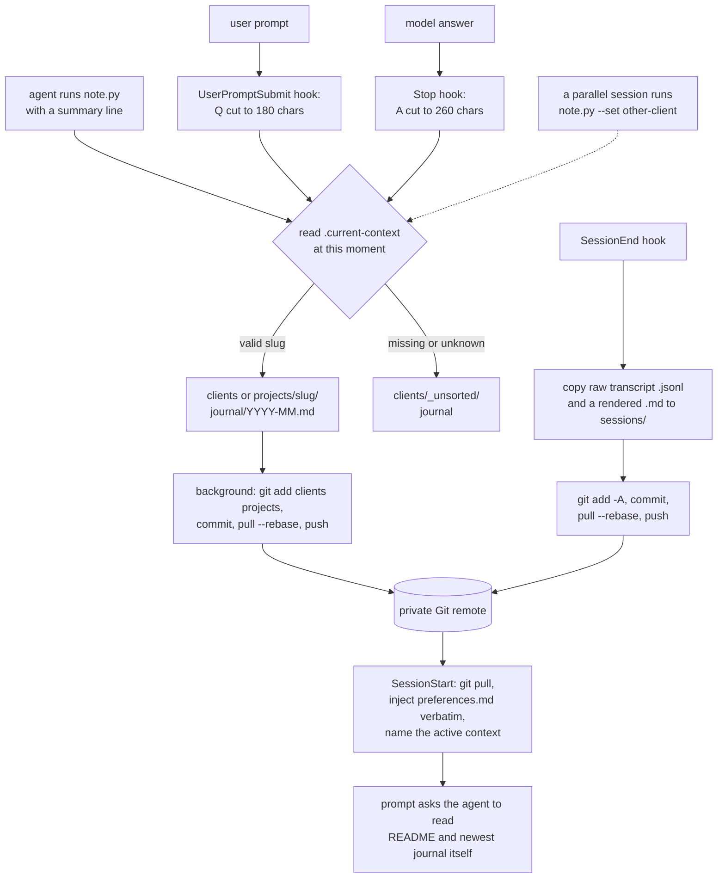

## 1. Executive Summary

Cloud Alter Ego is a template repository that turns a private Git repo into the
shared memory of every Claude Code and Codex session a person runs. Hooks append
each question and answer to a journal for the active client or project, save the
raw transcript at session end, and commit and push after every turn, so every
device and every account pulls the same history. A session starts with the
person's working rules injected verbatim.

What is notable is that capture never depends on the model: the hooks write the
journal whether or not the agent remembers to. What is weak is everything after
the write. No code reads the journal back — the agent is asked to — and the
choice of which client a line belongs to is one machine-wide file that any
session can change.

The code is five Python hooks and a note-taking helper, about a thousand lines
with no tests. The rest of the repository is the memory itself as shipped
defaults: 113 lines of working rules, runbooks under `skills/`, technical notes
under `techniques/`, and templates for client and project folders. The closest
design in this atlas is [Claude Code Memory Setup](../claude-code-memory-setup/),
whose SessionEnd hook also files transcripts into a notes store.

Three findings shape the rest of this report.

- **Client journals cross-contaminate under parallel sessions.** The active
  context is one gitignored file, `.current-context`, and every journal write
  rereads it (`tools/note.py:59-65`, `tools/auto_journal.py:186`). Two sessions
  on one machine working for two clients write each other's questions and
  answers into the wrong client's journal, in a repository whose own rules say
  *"Never mention another client, not even as a reference"*
  (`preferences.md:86`).
- **Raw transcripts are pushed unfiltered.** `save_session.py` copies the
  session's JSONL, tool calls and tool results included, then runs
  `git add -A`, commits and pushes (`tools/save_session.py:108`, `:116-128`).
  Nothing in `tools/` scans for secrets; the safeguard is a rule asking the
  person not to store any, and a warning at install time if the remote is
  public.
- **Recall is a sentence.** The only memory code puts into context is
  `preferences.md`. The journal reaches the agent if it obeys *"first read its
  README.md and the newest file in its journal/ folder"*
  (`tools/session_start.py:168`), which is one month's file.

No capability mark. Section 9 says why each is withheld.

## 2. Mental Model

A memory is a line of text. It is written in one of two ways and never changes
state afterwards.

- **The hook line.** `UserPromptSubmit` writes the prompt, cut to 180 characters,
  as `[auto claude <session>] Q: ...`; `Stop` reads the transcript tail and writes
  the last assistant text, cut to 260, as `... Q: (answer) | A: ...`
  (`auto_journal.py:129-159`, `:172-186`). A file holding the last line written
  suppresses an exact repeat (`:179-182`).
- **The agent line.** The agent runs `note.py "<what happened>"`, which appends
  `- HH:MM <text>` under the day's heading (`note.py:107-124`). It carries no
  prefix, which is the only thing that tells it apart from a hook line.

Both go to `<context>/journal/<YYYY-MM>.md`, where the context is whatever
`.current-context` names when the line is written, and `clients/_unsorted/`
when it names nothing valid (`note.py:59-65`, `:107-108`).

Nothing becomes a belief by code. A line is a record that a turn happened; the
agent decides whether to promote it into a context README, a technique or a
rule, and does so by editing Markdown. The rules frame journal content as
evidence rather than fact: *"Your own earlier conclusion (also from the journal)
is not a confirmed fact"* (`preferences.md:64`). Nothing stops being believed
either: there is no delete and no forget, and Git keeps every line on every
clone.

## 3. Architecture

Nothing runs between sessions. Each hook is a short Python process started by
Claude Code or by Codex's `notify`, with the Git working tree as its only store.

**Installation.** `tools/install.py` registers five hook entries in
`settings.json` of every Claude Code config directory it finds — `~/.claude`,
any `~/.claude-<name>` holding a settings file or a `projects/` folder, and
`CLAUDE_CONFIG_DIR` — after copying each file to a timestamped backup
(`tools/session_start.py:27-33`, `:66-99`, `:110-129`). It appends a pointer
block to each global `CLAUDE.md`, turns off commit and PR attribution, and for
Codex prepends `auto_journal.py --codex` to any existing `notify` program and
appends a block to `~/.codex/AGENTS.md` (`tools/install.py:87-103`, `:145-169`).
It warns when `gh` reports the remote as public (`:72-84`).

**Self-repair.** `session_start.py` reruns the same registration on every
session start, so a second account on the machine gets the hooks the first time
any account opens a session (`session_start.py:145-161`). That is convenient
and it is also a writer of every Claude Code configuration on the machine, run
from a repository the session has just pulled.

**Sync.** Session start runs `git pull --rebase --autostash` with a 20-second
timeout and ignores failure (`session_start.py:57-63`). After every journal line
`auto_journal.py` starts a detached `--sync` process that takes a lock file
(stale after ten minutes), stages `clients/` and `projects/` only, commits,
rebases and pushes, and aborts a failed rebase (`auto_journal.py:189-233`).
SessionEnd stages everything with `git add -A` (`save_session.py:115-128`).
Journals use git's built-in union merge (`.gitattributes:3`).

### Deployment and ergonomics

Python 3.8 and git, a private remote, and Claude Code with hooks; Codex is
optional and `tools/start_agents.ps1` is Windows-only. No package, no
dependency, no service: the clone is the install. Every journal line costs a
background commit and push, and the repository grows by one raw transcript per
session forever. The store is plain Markdown a person can read and fix in any
editor, and Git history is the only undo.

## 4. Essential Implementation Paths

**Session start.** `main` pulls, re-registers hooks, reads the context, and
prints one `additionalContext` block: the repository path, the active context,
the instruction to read the context README and newest journal, the instruction
to write one line per turn, and the whole of `preferences.md`
(`session_start.py:157-187`). Above 9,000 characters it prepends a warning
rather than trimming, because Claude Code cuts hook output above about 10,000
characters to a short preview (`:22-23`, `:179-181`).

**Prompt and answer.** `auto_journal.main` dispatches on `hook_event_name`.
`on_prompt` stores the raw prompt in a per-session file and writes the hook
line. `on_stop` reads up to 3 MB of the transcript tail, finds the last real
user message and the last assistant text, and, if that user message is not the
one `on_prompt` stored, writes a warning line instead that the transcript is not
being written (`auto_journal.py:61-110`, `:141-159`).

**Codex.** `notify` passes the turn as a JSON argument; `from_codex` takes the
last input message and `last-assistant-message`, and any previously configured
notify program is started first with the same payload (`auto_journal.py:162-169`,
`:242-256`).

**Session end.** `save_session.main` copies the transcript to
`<context>/sessions/<timestamp>-<id>.jsonl`, renders a Markdown version that
keeps user and assistant text and replaces each tool call and result with a
placeholder, then commits and pushes (`save_session.py:63-89`, `:97-128`).

**Contexts.** `note.py --new-client|--new-project` copies the template folder,
substitutes the name, adds a row to the index and makes it active;
`--set` writes the slug to `.current-context` (`note.py:68-104`).

## 5. Memory Data Model

| Artifact | Path | Written by | Read by |
| --- | --- | --- | --- |
| Working rules | `preferences.md`, reasons in `preferences-background.md` | the person or the agent, by hand | SessionStart, verbatim |
| Context README | `<kind>/<slug>/README.md`, kind `clients` or `projects` | template, then the agent or person | the agent, when told to |
| Journal | `<slug>/journal/<YYYY-MM>.md` | hooks and `note.py`, append | the agent, newest file only |
| Transcript | `<slug>/sessions/<ts>-<id>.jsonl` and `.md` | SessionEnd | nobody in code; a runbook after a session switch |
| Techniques, skills | `techniques/*.md`, `skills/*.md` | the agent or person | the agent, when a rule or README points there |
| Active context | `.current-context`, gitignored | `note.py --set` | every journal write and SessionStart |

A journal line has a time, an optional `[auto <agent> <session>]` prefix and
free text. There is no id, no author beyond that prefix, no status and no link
to the transcript it summarises other than the shared date and folder.

**Scope is a folder, chosen by one local file.** Every client and project of
the person lives in one repository. The write side picks a folder from
`.current-context`; the read side has no restriction at all, since the agent
reads files with its own tools and the rules point it at whichever context is
active. A client folder is a physical partition with no key on a line and no
predicate on any read.

## 6. Retrieval Mechanics

There is no search, no index and no ranking. Code puts exactly one memory into
context: `preferences.md`, about 7,700 characters at this commit, on every
session start. Everything else arrives because the agent follows an
instruction. The injected text asks it to read the context's README and *"the
newest file in its journal/ folder"*, which is the current month, so on the
first days of a month the journal it reads is nearly empty and the previous
month's is one file further than it was asked to look. The rules add a
`git fetch`, `git log` and journal read before any diagnosis
(`preferences.md:67-68`).

The journal it reads is mostly hook lines: a prompt cut at 180 characters and
the final assistant paragraph cut at 260, with tags and newlines stripped and
em dashes replaced by commas (`auto_journal.py:45-49`). The agent's own summary
line is the higher-value entry, and the two are interleaved with nothing but the
`[auto ...]` prefix between them.

## 7. Write Mechanics

Writes are automatic and synchronous at the file level, asynchronous at the
remote. A hook line is on disk before the hook returns and on the remote after
the detached sync's commit, rebase and push, typically seconds later; a second
device sees it at its next session start or its next sync's rebase. Nothing
blocks the agent: every hook swallows its errors into
`.auto-journal/errors.log` (`auto_journal.py:52-58`, `:262-263`).

**The active context is shared state.** `.current-context` is one file per
clone. A session that sets client B changes where every other open session on
the machine writes next, and the Stop hook of a session working for client A
appends A's question and answer to B's journal, which the next sync pushes. The
SessionEnd copy of A's whole transcript lands in B's `sessions/` the same way
(`save_session.py:38-42`, `:106`). A session that never sets a context writes
into `_unsorted`. Remote Control sessions, which the README says rarely end, make
long-lived parallel sessions the normal case rather than the edge.

**Journals merge by union.** `merge=union` keeps both sides of a conflicting
hunk, which is what lets two devices append to the same month without stopping
a rebase. It also means a line one device removed and another device's edit
touched nearby can come back; that is how git's union driver behaves, inferred
here and not exercised.

### Operational cost

- Write: one file append per turn plus a background `git add`, `commit`,
  `pull --rebase` and `push` per line; a transcript copy and a full commit at
  session end.
- Background: none between sessions.
- Read: about 7,700 characters of rules per session start, plus whatever the
  agent chooses to open.

## 8. Agent Integration

Claude Code gets five hooks: SessionStart, UserPromptSubmit, Stop, SessionEnd
and a PreToolUse guard on Bash and PowerShell that blocks commands containing
an AI attribution line (`tools/block_ai_attribution.py:17-46`). Codex gets the
`notify` chain and an `AGENTS.md` block telling it to read the rules and write
journal lines itself, since it has no session-start hook. Neither gets a memory
tool: reading is the agent's own file tools, writing is `note.py` through the
shell.

The repository also asks the agent to absorb other memory systems into it.
*"Knowledge that only lives in a local agent memory file is invisible to other
agents and devices: move it here"* (`preferences.md:112-113`), and the
`context-doctor` runbook reads every file under `~/.claude/projects/*/memory/`
and moves rules and procedures into this repository.

## 9. Reliability, Safety, and Trust

**Privacy is a rule, not a filter.** The raw transcript holds every tool input
and output of the session — files read, command output, anything the agent
saw — and it is committed with `git add -A` and pushed to a remote that every
device and account clones. `git grep -n -i -E 'secret|redact|password|mask' --
tools` finds no filter. The README requires the remote to be private and says
never to store secrets; the installer checks visibility once, and only for a
GitHub remote with `gh` installed (`install.py:72-84`).

**The repository runs its own code on every machine.** Session start pulls the
repository, then the next hook runs whatever `tools/*.py` the pull brought, and
`session_start.py` rewrites every Claude Code `settings.json` on the machine to
point at them. Anyone with push access to the private remote can change what
every hook does on every device.

**Failures stay quiet.** Errors go to a log file and the hooks return success.
A failed rebase is aborted in the sync and at session end, so the repository is
not left mid-rebase by them (`auto_journal.py:223-227`,
`save_session.py:122-127`); the session-start pull ignores its result, so a
conflict there can leave a rebase in progress until one of those aborts runs.

**Correction is editing.** A wrong line can be edited or deleted in a file and
stays in Git history and on every clone that pulled it.

Capability marks:

- `tombstone` — withheld. Nothing records a rejected value; there is no delete.
- `trust_state` — withheld. No field; the one statement about trust is a rule
  that journal conclusions are not confirmed facts.
- `bitemporal` — withheld. A line has the time it was written.
- `scope_enforced` — withheld. Folders are a physical partition chosen on write
  by a shared local file, and no read is restricted to the active one.
- `audit_log` — withheld. Git history is the only record of an edit; the journal
  records turns, not memory mutations.
- `human_review` — withheld. Every line is live when written; a person editing a
  file is authoring after the fact.
- `negative_eval` — withheld. There are no tests.

## 10. Tests, Evals, and Benchmarks

I built and ran nothing; everything here is from reading the tree at the pin.

There is no test, no CI workflow and no evaluation: no `tests/` directory, no
`.github/`, and `git grep -n -i -E 'pytest|unittest|def test_' -- tools`
returns nothing. No paper or citation file is in the tree. The hooks' behaviour
is documented in `WORKFLOW.md` and the changelog, and checked by nothing.

## 11. For Your Own Build

### Steal

- **Capture in hooks, not in the model's goodwill.** A UserPromptSubmit and a
  Stop hook that write a line whatever the model does are the floor under every
  memory the agent is asked to write.
- **Inject the rules verbatim and warn when they outgrow the channel.** A
  pointer to a rules file gets skipped; the length warning names the actual
  limit of the hook channel.
- **Union-merge append-only logs.** It removes the conflict that would
  otherwise stop every multi-device rebase.
- **Back up a settings file before rewriting it**, with a timestamped name, and
  ship an uninstall that removes exactly what the install added.

### Avoid

- **A machine-global "current scope" file read at write time.** Pass the scope
  through the session — the hook payload carries a session id — or record it
  per session.
- **`git add -A` of raw transcripts to a shared remote.** Store the rendered
  text, or scrub tool results, before a push.
- **Recall by instruction only.** If the journal matters, put its relevant part
  into the session-start context instead of asking the agent to go and read it.
- **A memory repository that also ships the hooks it runs.** Pin the tools, or
  keep them in a repository other devices do not push to.

### Fit

It suits one person working alone across several machines and Claude accounts
who wants a readable diary of every turn and a fixed set of rules in every
session, and who will run one client at a time. It does not suit anyone running
parallel sessions for different clients, anyone whose sessions read credentials
or client data, or anyone who wants the agent to recall something it was not
explicitly told to look for.

## 12. Open Questions

- Is `.current-context` meant to be per session? The hook payload carries a
  `session_id` that would key it.
- Does the author intend transcripts to be scrubbed before push, or is the
  private remote the whole of the privacy model?
- Would a journal digest in the SessionStart context replace the instruction to
  read the newest file?

## Appendix: File Index

- **Hooks:** `tools/session_start.py`, `tools/auto_journal.py`,
  `tools/save_session.py`, `tools/block_ai_attribution.py`.
- **Writer and contexts:** `tools/note.py`, `clients/_template/README.md`,
  `projects/_template/README.md`.
- **Install:** `tools/install.py`, `tools/start_agents.ps1`,
  `tools/sessions.example.json`.
- **Rules and runbooks:** `preferences.md`, `preferences-background.md`,
  `skills/context-doctor.md`, `skills/remote-control-sessions.md`.
- **Merge and ignore:** `.gitattributes`, `.gitignore`.
- **Docs:** `README.md`, `WORKFLOW.md`, `CHANGELOG.md`.

### Recorded searches

Checked against the checkout at the pinned revision, from the tree root.

- `git grep -n -i -E 'secret|redact|password|mask' -- tools` — no match; no filter on what is committed.
- `git grep -n -E 'current_context\(' -- tools` — read in `note.py`, at every `auto_journal.py` write and at session end; nothing keys it by session.
- `git grep -n -i -E 'pytest|unittest|def test_' -- tools` — no match; no tests.
- `git ls-files | /usr/bin/grep -E '^(tests?/|\.github/)'` — no match.
- `git grep -n -i -E 'delete|remove|forget' -- tools/note.py tools/auto_journal.py tools/save_session.py` — the lock file removal only; no verb removes a journal line.
- `git grep -n -i -E 'embed|bm25|fts5|vector|sqlite|similar|grep' -- tools` — no match; no retrieval code. (`search` and `index` match only `re.search`, the attribution guard's pattern test and the README index row writer.)
- `git grep -l -i -E 'arxiv|bibtex|@article|@misc|doi\.org|CITATION'` — no match, and no `CITATION.cff`.

## History

**2026-10-09** — [`37687bbb730686d72e606bd432bfca99e104f2c0`](https://github.com/SebastiaanBoon/cloud-alter-ego/commit/37687bbb730686d72e606bd432bfca99e104f2c0) — first reading, at the head of `main`. No mark. Screened before reading: the screen scanned one file and found nothing, since the hooks are installed by `tools/install.py` into the user's own Claude Code and Codex settings rather than declared in the tree; `tools/` and `.gitattributes` (a built-in `merge=union` driver, not a checkout filter) were read by hand. Nothing was installed, built or run.
