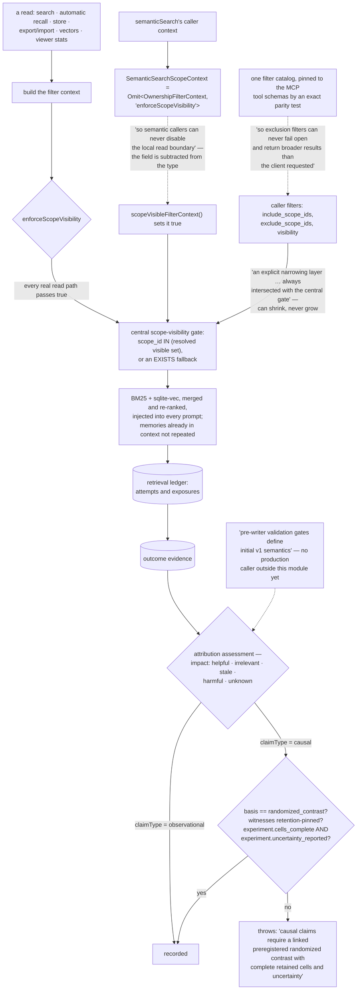

## 1. Executive Summary

codemem is "persistent coding memory across sessions, machines, and teammates"
for OpenCode, Claude Code and Codex — MIT, TypeScript, 375,155 lines across a
dozen packages with 290 test files, local SQLite with FTS5 and `sqlite-vec`,
optional peer-to-peer sync, and automatic context injection. Its opening line is
the problem statement: "The code is still there. The reasoning usually isn't."

Two mechanisms are enforced by the type system rather than by discipline, and
they are why this report exists.

**The flag that could disable the read boundary is removed from the caller's
type.** Scope visibility is an opt-in filter-context flag, documented as opt-in
"so low-level filter unit tests and non-memory callers can keep using the pure
filter builder, while store/search paths can make scope visibility a hard
invariant". Every real read path passes `true` — search, automatic recall, the
store, export/import, the vector path, the viewer's stats routes. Caller-supplied
`include_scope_ids` and `exclude_scope_ids` are "an explicit narrowing layer …
always intersected with the central scope-visibility gate", so an argument can
shrink the visible set and never grow it.

Then the part worth copying:

```ts
// Deliberately omits `enforceScopeVisibility` so semantic callers can never
// disable the local read boundary — scopeVisibleFilterContext() always forces
// it on below.
export type SemanticSearchScopeContext = Omit<OwnershipFilterContext, "enforceScopeVisibility">;
```

The semantic-search entry point is the one a caller constructs a context for, and
the field that could turn the boundary off is subtracted from that type. The
function sets it to `true` itself. A reviewer does not have to notice a missing
flag, because the flag cannot be written.

**One catalog for every tool-exposed filter, with the failure direction named.**
The filter schema is "[s]ingle source of truth for the filter keys and value types
accepted by both memory tool surfaces", pinned to the MCP tool schemas "by an
exact parity test", and the reason is stated rather than assumed:

> "Keeping one catalog means a filter added here cannot be silently omitted from
> either surface, so exclusion filters can never fail open and return broader
> results than the client requested."

An exclusion filter a surface forgot to implement does not error — it returns
more than was asked for. Naming that is what makes the parity test worth
maintaining.

**And then there is the attribution layer, which is unlike anything else in this
corpus.** Retrieval attempts and exposures are ledgered; outcomes carry evidence;
an assessment labels a memory's impact `helpful | irrelevant | stale | harmful |
unknown` on one of seven bases — temporal follow-up, source-location overlap,
explicit reference, content overlap, human review, blinded evaluator, randomized
contrast. And an assessment declares a claim type: `observational` or `causal`.

The gate on the second one:

> "causal claims require a linked preregistered randomized contrast with complete
> retained cells and uncertainty"

thrown unless the basis *is* a randomized contrast, the contrast validates, every
witness row is retention-pinned, and each carries both an
`experiment.cells_complete` and an `experiment.uncertainty_reported` reference
code. A memory system that will not let you record "this memory helped" as a
causal claim without a preregistered randomised design, complete cells, retained
evidence and a reported uncertainty. Most systems here assert that their memory
improves outcomes; this one encodes the standard such an assertion would have to
meet.

**It is not wired up yet, and the file says so.** "These pre-writer validation
gates define initial v1 semantics. Once production writers are enabled, semantic
rule changes require a contract version bump." `recordAttributionAssessment` has
no caller outside its own module. So the contract and its 5,052 lines of tests
exist ahead of the writers — which is a legitimate order to build in, and means a
reader should not take the taxonomy as a description of what the product records
today.

The impact label is diagnostic in the same way: a `harmful` assessment is counted
in a diagnostics view and filters nothing, so nothing withholds a memory judged
harmful. And retrieval carries no epistemic state of its own — no status, no
provenance class, no supersession on the read path.

One more artifact deserves mention. The recall evaluation runs "the immutable
historical source and frozen harness separately", asserting the pinned commit's
tree hash and individual blob hashes against a manifest, and pinning the fixture
digest and provenance in the report. Re-running an evaluation against a
cryptographically pinned snapshot of the code that produced it is a standard very
few benchmarks in this corpus meet.

## 2. Mental Model

A **scope** is what this device may read, and the switch that turns the check off
does not exist where a caller can reach it.

A **filter** is declared once, or it fails open somewhere.

An **attribution** says how it knows, and a causal one has to have run an
experiment.



## 3. Architecture

| Area | Role |
| --- | --- |
| `packages/core/src/filters.ts` | The scope gate and the clause builder |
| `packages/core/src/vectors.ts` | Semantic search, and the type that removes the flag |
| `packages/core/src/memory-filter-schema.ts` | One catalog for both tool surfaces |
| `packages/core/src/attribution-assessment.ts` | Impact labels, bases, and the causal gate |
| `packages/core/src/retrieval-ledger.ts`, `outcome-evidence.ts` | Attempts, exposures, outcomes |
| `packages/viewer-server/`, `plugins/` | The viewer, sync routes, and harness plugins |

## 4. Essential Implementation Paths

`packages/core/src/vectors.ts:105-117` — a flag subtracted from a type, and why.

`packages/core/src/filters.ts:22-36`, `:299-308` — opt-in by design, enabled
everywhere, and intersection rather than widening.

`packages/core/src/memory-filter-schema.ts:1-13` — one catalog, and the failure
it prevents.

`packages/core/src/attribution-assessment.ts:1185-1222` — what a causal claim
costs.

## 5. Memory Data Model

Memory items with a kind, project, scope id, visibility, session and timestamps,
beside a retrieval ledger of attempts and exposures and an outcome-evidence
store. The interesting shape is that second half: the system models *whether a
retrieved memory did any good* as first-class data rather than as an intuition.

## 6. Retrieval Mechanics

FTS5 BM25 and `sqlite-vec` merged and re-ranked, injected automatically, with
unchanged memories already in the agent's context not repeated — a small
deduplication against the context window itself that keeps injection from
crowding out the conversation.

## 7. Write Mechanics

An observer processes sessions through the configured model provider, and the
README says plainly that this "can incur costs or consume plan usage" — a
disclosure most tools with an LLM extraction step leave to the reader's bill.

## 8. Agent Integration

Plugins for OpenCode 1 and 2 (the latter marked beta), Claude Code and Codex
hooks, an MCP server, and a viewer. Screening flags two auto-run surfaces and
eight unpinned dependency surfaces at this pin.

## 9. Reliability, Safety, and Trust

The read boundary is the enforced part, and it is enforced well. The epistemic
part — whether a memory helped, and on what basis anyone could claim it — is
specified rigorously and not yet populated.

## 10. Tests, Evals, and Benchmarks

290 test files, including a 20,198-line viewer-server suite and a 5,052-line
attribution suite, plus a frozen-harness evaluation that verifies the pinned
commit's tree and blob hashes and the fixture digest before scoring. Nothing was
installed or run for this reading.

## 11. For Your Own Build

Subtract the dangerous flag from the caller's type. `Omit<Context, "enforceX">`
on the path most likely to forget is a review comment the compiler makes for you.

Declare every filter key once, and say which way an omission fails. "Exclusion
filters can never fail open" is the sentence that justifies the parity test to
whoever inherits it.

Separate an observational claim from a causal one before you need to. Once
"memory improves outcomes" is something you want to say, the design that would
support it has to have existed beforehand — preregistered, cells complete,
uncertainty reported.

And pin the evidence a claim rests on. Retention-pinning the witness rows means
the experiment behind a causal claim cannot be garbage-collected out from under
it.

## 12. Open Questions

When the attribution writers land. The gates, the contract version and the tests
are in place; nothing calls them.

Whether a harmful assessment will ever withhold. Today it is counted in
diagnostics and filters nothing.

What the sync path does with scope visibility. Replication carries selected
scopes across machines, and the boundary on the receiving side was not traced.

## Appendix: File Index

| Path | What to read it for |
| --- | --- |
| `packages/core/src/vectors.ts:105-117` | A flag the caller cannot write |
| `packages/core/src/filters.ts:22-36`, `:299-308` | A gate every read enables, and filters that only narrow |
| `packages/core/src/memory-filter-schema.ts:1-13` | One catalog, and the direction an omission fails |
| `packages/core/src/attribution-assessment.ts:16-28`, `:1185-1222` | Seven bases, two claim types, and one refusal |

## History

**2026-09-16** — [`6391c66b1d1ea9757ba9a984076bb2f15673a3b7`](https://github.com/kunickiaj/codemem/commit/6391c66b1d1ea9757ba9a984076bb2f15673a3b7) — first reading, at a commit dated 15 September 2026. Screened before opening, from a shallow clone: thirty-three files scanned, two auto-run surfaces, one build-time execution point, eight unpinned surfaces and fourteen dependency files inside the seven-day cooldown. Nothing was installed, built or run.
