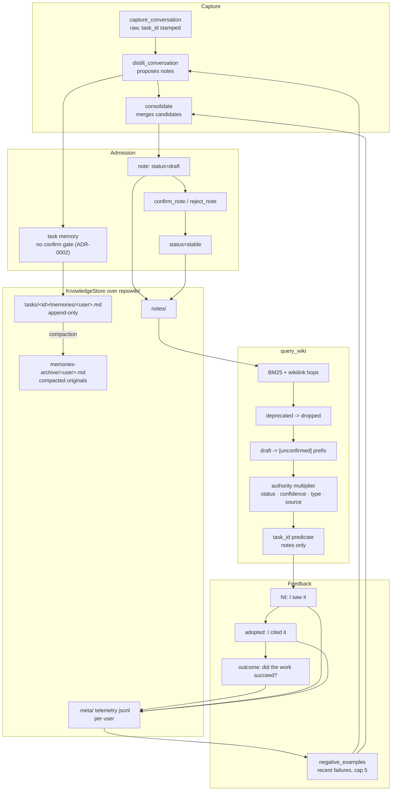

## 1. Executive Summary

CodeWiki-Plus began as a fork of FSoft-AI4Code's CodeWiki and kept its
toolchain — Tree-sitter parsing, dependency graphs, topological sort, Mermaid
validation — while growing into something the upstream is not. The README's own
comparison table is the clearest statement of that: against *Knowledge
management*, *Knowledge trust*, *Task memory* and *Search*, the upstream column
reads "None" four times. Every mechanism this report is about is this project's
own addition to a documentation generator.

What it added is a file-backed knowledge base with two memory kinds. **Notes**
are markdown files with frontmatter, entering as `draft` and reaching `stable`
through a `confirm_note` gate. **Task memories** are timestamped entries inside
a per-user file, written directly with no gate — and the project explains the
asymmetry rather than leaving it to be noticed: task-scoped progress knowledge
carries bounded, task-lifetime noise cost, while notes enter the shared,
retrieval-indexed base and keep the quality gate.

The mechanism worth the reader's time is how one read path treats three
statuses three different ways. In `handle_query_wiki`, a `deprecated` note hits
`continue` and leaves the result set entirely. A `draft` note is returned, with
its title rewritten to `[unconfirmed] <title>`. Everything else is weighted by
an authority multiplier that folds status, confidence level, note type and
source into a number clamped to 0.7–1.3. Excluded, labelled, or weighted — the
three responses a memory system can have to a claim it is unsure of, all three
present and applied to different values of the same field.

Beside it is a telemetry chain that reaches further than most: `hit` (I saw
it), `adopted` (I cited it), `outcome` (after using it, did the work succeed?).
The failures that chain records become `negative_examples` injected into the
prompt that writes the next note. The report awards `trust_state`, `tombstone`,
`scope_enforced`, `audit_log` and `negative_eval`, and section 9 says why
`human_review` is withheld.

## 2. Mental Model

Think of it as two stores with different admission rules, sharing one root.

The **note store** is the shared, indexed, retrievable one. A note is proposed
by distillation, lands as `draft`, is returned by queries with an
`[unconfirmed]` badge, and becomes ordinary material when someone confirms it.
Retiring it is `deprecated`, and that value is the one the query path drops.

The **task-memory store** is per-user, append-only, and bounded by the task's
own lifetime. An entry is a timestamped markdown block with a short persistent
id. Correcting one does not edit it: a `> [superseded 2026-09-18 by #a3f2]`
line is inserted above it, and the readers that assemble context partition on
that line while a person reading the file still sees both.

Around both sits a usage record that is unusually complete. Most systems can
tell you a memory was retrieved. This one records that it was retrieved, that
the agent actually cited it, and — at the end of the task — whether the work
succeeded, then feeds the recent failures back into the prompt that writes the
next batch.

## 3. Architecture



## 4. Essential Implementation Paths

- **Store facade and entry format:** `codewiki/src/store.py` — `KnowledgeStore`,
  `format_memory_entry`, `new_entry_id`, `entry_is_superseded`,
  `supersede_memory`, and the atomic-write and locking helpers above them.
- **Query and status handling:** `codewiki/mcp/tools/note_query.py` —
  `handle_query_wiki`, the deprecated `continue`, the `[unconfirmed]` prefix,
  the `task_id` predicate.
- **Ranking:** `codewiki/src/retrieval.py` — `bm25_score` and `_doc_authority`
  with its status, confidence, type and source offsets.
- **Task memory:** `codewiki/mcp/tools/task_manager.py` — the layout contract in
  the module docstring, the live/superseded partitions, compaction.
- **Telemetry and feedback:** `codewiki/mcp/tools/telemetry.py`,
  `outcome_report.py`, and the `negative_examples` payloads in
  `distill_conversation.py` and `note_consolidation.py`.

## 5. Memory Data Model

A **note** is a markdown file whose frontmatter carries the axes this report
turns on: an OKF `status` (`draft` / `stable` / `deprecated`, with legacy
vocabularies normalised on read), a `confidence_level` (`strong` / `weak` /
`shadow`), a `verified` block, an optional `task_id`, and a note type that also
feeds the authority multiplier (decision above pitfall above lesson and
architecture above workaround).

A **task memory** is an entry inside `tasks/<task_id>/memories/<user_id>.md`:

```
### 2026-09-18 14:30 #a3f2

<content>
```

The id is four base36 characters minted with `secrets.choice` and checked
against the ids already in the file, falling back to eight characters rather
than looping. The heading's timestamp is not necessarily the append time — a
distilled conversation stamps its `captured_at`, the dialogue's own time, so
the entry is dated when it happened rather than when it was written down.

Retirement is a line, not a field: `> [superseded 2026-09-18 by #a3f2]`
inserted above the entry, carrying both halves of the correction.

## 6. Retrieval Mechanics

`handle_query_wiki` scores notes and wiki pages with BM25 over a shared
retrieval kernel, expands through wikilinks, and multiplies each document's
score by an authority factor. That factor is pure arithmetic over frontmatter:
note type, OKF status, the confidence dimension, and a source penalty for
`raw/sources/` material, clamped to 0.7–1.3 so no single axis can dominate.

Three things about this are worth separating, because the project separates
them:

1. The **exclusion** is one line: `if note_st == "deprecated": continue`. Only
   that value leaves the result set.
2. The **label** is the draft case, which rewrites the title rather than
   hiding the note.
3. The **weight** is everything else, and the code calls the status component
   a gate while implementing it as an offset — a distinction a reader should
   keep, because a deprecated note is dropped by the `continue` above, not by
   its −0.35.

One exemption is documented and is the kind of thing that is usually
discovered late: the deduplication recall that distillation uses to find
near-identical existing notes runs with `apply_authority=False`, so similarity
is never polluted by confidence. Without it, a migration that dropped old notes
to `shadow` would blind conflict detection at exactly the moment it mattered.

## 7. Write Mechanics

Notes arrive through capture and distillation, land as `draft`, and the ingest
path returns the caller an instruction rather than assuming: the response
carries the `[unconfirmed]` prefix and says to call `confirm_note` after
review. `reject_note` and a batch status setter complete the lifecycle, and the
batch tool refuses a transition whose current value is not what the caller
asked for, recording `"reason": "not draft"` per skipped file.

Task memories skip that gate, and ADR-0002's reasoning is recorded where the
asymmetry lives: task-scoped progress knowledge has bounded, task-lifetime
noise cost, while notes enter the shared retrieval-indexed base.

The file discipline underneath is stated as a set of constraints that must
hold: per-user files are append-only and each user writes only their own;
concurrent writers are serialised by an atomic temp-file replace; compaction is
author-exclusive, and *"nobody ever rewrites another user's file"*; `task_id` is
derived from the title, immutable, and there is no rename tool.

## 8. Agent Integration

Fifty-three MCP tools, driven by the IDE's own model rather than a configured
API key — the README's first difference from upstream is "zero-config, IDE
model driven". A CLI and hooks sit beside them, and session bindings under
`.meta/task_bindings/<session_id>.json` let a capture know which task it
belongs to, with the binding consumed on a successful write.

## 9. Reliability, Safety, and Trust

**Trust state — awarded, on the exclusion.** `deprecated` is dropped from a
query outright. That is the state that withholds, and the mark rests on it
rather than on the authority multiplier, which is the ranking axis. The draft
case is the interesting middle: the note is returned and badged, which is a
third answer to "am I sure about this" that most implementations do not offer.

**Tombstone — awarded.** One writer, five readers, a marker carrying the date
and the successor, and a compaction path that archives originals rather than
dropping them.

**Scope enforcement — awarded on the task axis, with the user axis named for
what it is.** The `task_id` predicate is real and tested both ways. Per-user
files are described by the project as *git-level conflict isolation*, and
loading is layered rather than partitioned: another user's memories reach the
caller as a summary and a couple of recent entries. That is a deliberate
design, not a leak, but a reader should not mistake per-user files for per-user
visibility.

**Audit log — awarded.** Three event kinds, per-user append-only JSONL, a
verdict validated at the tool boundary, and an aggregation that folds every
user's stream into per-document usage.

**Human review — withheld, twice over.** The `trust_tier` helper derives
`unverified` / `machine-confirmed` / `human-reviewed` from a `verified` block,
and `human-reviewed` is earned when an entry's `by` field starts with the
string `human:` — a value the writer supplies, so the tier records a claim
about who reviewed rather than establishing it. And the tier is not consumed:
`note_query.py` computes it onto the result entry, and `knowledge_loop.py`
imports `_trust_tier` without calling it. The label reaches a reader; nothing
in the tree acts on it.

**The outcome signal is self-assessed.** `report_outcome`'s own header says
collection timing is caller-owned — the agent reports at the natural end of a
task, *"the only moment it can honestly judge the result"*. That is a fair
argument for when to ask, and it leaves the grader and the graded as the same
party. The binary vocabulary helps: `result must be 'success' or 'failure'
(binary, no grading)`.

## 10. Tests, Evals, and Benchmarks

**No paper.** Searched the README and `docs/` for `arxiv`, `@article`, `@misc`,
`doi.org` and a `CITATION.cff`: none. The design documents under `docs/` are
the project's own, several of them studies of other systems — including an OKF
adaptation plan, a framework this atlas covers separately.

The Python suite is substantial and the two cases this report leans on are
built correctly, each pairing an absence with the presence it is measured
against (section 9's `negative_eval` record quotes both). `tests/` also carries
a golden retrieval baseline, an OKF regression file and an MCP smoke test.

Two cautions for a reader counting coverage. `tests/conftest.py` executes on
pytest collection, which the screening pass flags and which matters only if you
run the suite. And the authority tests exercise the multiplier — that
deprecated clamps low, that ordering follows authority, that a status change
refreshes it — rather than the `continue` that actually removes a deprecated
note from a query; that behaviour is covered instead by the end-to-end note
flow, which matches on the `[unconfirmed]` substring.

## 11. For Your Own Build

- **Give yourself three responses, not two.** Excluded, labelled, weighted.
  Most systems pick one and apply it to every retired value; here `deprecated`
  is dropped, `draft` is returned with a badge, and the rest is a multiplier.
- **Put the retirement marker in the document.** A blockquote line naming the
  date and the successor survives being read by a person, copied into a diff,
  or opened outside the tool.
- **Record the third event.** Retrieval logs stop at "this was returned". The
  chain that matters is seen, cited, and did the work succeed — and the third
  one is the only one that can be fed back as a negative example.
- **Exempt the dedup recall from your authority weighting.** Similarity used
  for conflict detection must not inherit a confidence penalty, or a migration
  that downgrades old notes will blind exactly the check that catches
  contradictions.
- **Say what per-user files buy.** Conflict isolation and read isolation are
  different properties, and a layout that delivers the first is easy to
  describe as if it delivered the second.

## 12. Open Questions

- `_trust_tier` is imported into `knowledge_loop.py` and never called there.
  Was a consumer planned, or is the tier meant only as a label on a query
  result?
- The authority multiplier calls the status component a gate. Is the `continue`
  on `deprecated` intended as the gate and the offsets as ranking, or did the
  offset predate the exclusion?
- Other users' task memories reach a caller as a summary. Is there a
  deployment where that is the wrong default, and is there a way to turn it
  off?

## Appendix: File Index

- Store, entry format, supersession: `codewiki/src/store.py`
- Retrieval kernel and authority: `codewiki/src/retrieval.py`
- Query path and status handling: `codewiki/mcp/tools/note_query.py`
- Note lifecycle: `codewiki/mcp/tools/note_lifecycle.py`,
  `note_ingest.py`, `note_consolidation.py`
- Task memory: `codewiki/mcp/tools/task_manager.py`
- Telemetry and feedback: `codewiki/mcp/tools/telemetry.py`,
  `outcome_report.py`, `distill_conversation.py`
- Tests: `tests/test_task_manager.py`, `tests/test_authority_p0.py`

## History

**2026-09-19** — [`4b826918d6fd4d954064190683a9455bb40805ff`](https://github.com/mambo-wang/CodeWiki-Plus/commit/4b826918d6fd4d954064190683a9455bb40805ff) — first reading, at the head of `main`, version 5.10.1 on PyPI. Screened with `scripts/screen_repo.py` before anything was read: no auto-run surface, one build-time execution path (`tests/conftest.py` at pytest collection), two dependency manifests inside the seven-day cooldown, and an `AGENTS.md` addressed to a reading agent which was read as data. Nothing was installed, built or run. Five marks. The reading covered the store facade and its entry format, the note lifecycle and its confirm gate, the query path's three-way treatment of status, the authority multiplier, the task-memory layout and its supersession marker, the telemetry chain and the negative-example feedback, and the two test cases the `negative_eval` mark rests on; the documentation generator the project grew out of — the Tree-sitter toolchain it inherited from upstream CodeWiki — was read as context rather than as subject. MIT, with the upstream's copyright line retained and the fork relationship stated in the README. Two findings worth carrying: `_trust_tier` is imported by `knowledge_loop.py` and never called there, so the OKF trust tier is a label on a query result rather than an input to anything; and the `human-reviewed` tier is earned by a `verified` entry whose `by` field begins with the string `human:`, which the writer supplies, so `human_review` is withheld on both grounds.
