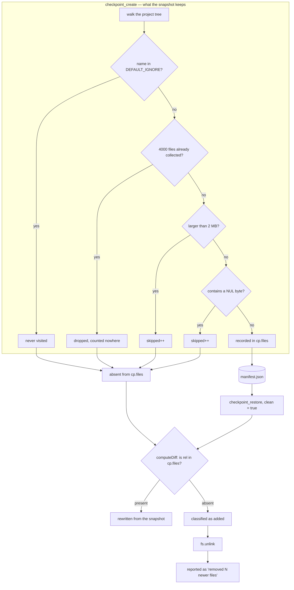

## 1. Executive Summary

Dev MCP Suite is four stdio MCP servers in one npm package, **MIT**, 84 files
and roughly 7,400 lines of JavaScript with one runtime dependency — the MCP SDK
itself. `project-memory` keeps an Obsidian-style Markdown vault with wikilinks
and a keyword index. `devjournal` keeps a per-project JSONL timeline and one
canonical handoff. `checkpoint` snapshots files outside git. `context-pack`
produces briefings and a repository audit. No database, no daemon, no network
unless an embedding endpoint is configured.

The design is legible, and that is not incidental. Every durable
artifact is a file a person can open, diff and repair by hand: a note is
Markdown with YAML frontmatter, an index is JSON, a journal is JSONL, a
checkpoint is content-hashed blobs beside a manifest. That is a real property
and it is worth the reading.

**Three of the tools it advertises do not exist.** Each server answers
`tools/list` from a literal array and dispatches `tools/call` through a `switch`
whose `default` branch throws `Unknown tool`. Forty-two tools are
declared; thirty-nine have a `case`. `memory_import_session`
(`project-memory/server.js:439`), `pack_dense_brief`
(`context-pack/server.js:243`) and `journal_standup` (`devjournal/server.js:197`)
are declared with descriptions and full input schemas, so every MCP client puts
them in the model's tool menu — and no handler for any of them exists anywhere
in the tree. There is no `importSession`, no `denseBrief`, no `standup`. Calling
one throws.

They are not obscure. Release 3.5.0 is titled *Token-Dense Briefing, Standup
Digest & Semantic Session Import* after exactly these three, the CHANGELOG lists
each under **Added** with a benefit claim, and `docs/ROADMAP.md` marks all three
✅ under "Status Terkini". Three more items in the same release — `pack_search`,
`pack_find_todos`, the unified `checkpoint_diff` — are fully wired, so this is
not a release that shipped nothing. The README's tool table is the one document
that gets it right: it lists none of the three. The wire protocol advertises
what the README does not.

**One mark, `negative_eval`**, and the rest are withheld for the same underlying
reason: a note has no status. There is no field distinguishing a proposed memory
from an accepted one, a superseded value from a current one, or a line the agent
wrote from a line the auto-indexer scraped out of a chat transcript. Deletion
unlinks the file. Nothing records that it existed.

**The finding that matters is in `checkpoint`, and it destroys data.**
`checkpoint_create` declines to store three classes of file — anything past a
4,000-file cap, anything over 2 MB, anything containing a NUL byte — and records
only the second and third in a `skipped` counter nobody surfaces at restore
time. `checkpoint_restore` with `clean: true` then walks the tree, calls
anything absent from the manifest "added since the checkpoint", and unlinks it
(`checkpoint/server.js:291-296`). Those are the same files. Running the tool the
README recommends before a risky refactor, and then reverting, deletes every
image, PDF, database file and large asset in the project, and reports the count
as `removed N newer files`.

## 2. Mental Model

A thing becomes a memory the moment a tool call succeeds, and it becomes one
without any claim being made about it. `memory_save` takes a title and a body,
writes `notes/<id>.md`, adds a row to `index.json`, and returns
(`project-memory/server.js:531-547`). There is no pending state, no review, no
confidence, no source. The `kind` field — `note`, `decision`, `task`, `log`,
`snippet` — is a free string supplied by the caller and used for display.

A memory stops being one only through `memory_delete`, which unlinks the file
and deletes the index entry (`:757-768`). Nothing is left behind, which means
nothing downstream can know a note was removed rather than never written — and
`memory_auto_index` will happily re-derive an equivalent note on its next run,
because it dedups against nothing.

The interesting path is the second one. `memory_auto_index` reads the last three
git commits, the current branch, and — this is the part worth pausing on — the
five most recently modified files under `.codex/sessions`, `.codex`,
`.gemini/logs`, `.gemini`, `.agents/logs` or `logs`. It matches each line
against a bilingual keyword regex whose alternatives include `architecture`,
`arsitektur`, `migration`, `migrasi`, `decision`, `keputusan`, `strategy`,
`strategi`, `refactor`, `database`, `schema` and `tradeoff`. It takes
up to 300 characters of the matching line verbatim, and saves it as a note
titled *Session Digest* (`project-memory/auto-indexer.js:12-91`, the keyword list at `:54`, the note built at `:133-137`). Those files
are conversation transcripts. Whatever flowed through the session — a web page
the agent read, a tool result, a pasted error — is eligible to become a durable
memory on a keyword match, and arrives carrying no marker that distinguishes it
from a note the agent composed on purpose.

## 3. Architecture

Four independent processes, each a `Server` from `@modelcontextprotocol/sdk`
over `StdioServerTransport`, each launched by the MCP client. Nothing has to be
running beforehand and nothing runs between calls. An operator stands this up
with one command and stops it by closing the client.

State lives under `~/.ai-shared-memory/` by default — `vault/` for notes,
`checkpoints/` for snapshots — overridable with `MEMORY_VAULT_DIR` and
`CHECKPOINT_DIR`. The vault path in `project-memory/server.js:41-43` disagrees
with the module's own header comment, which still documents
`~/.codex/memories/vault` (`:11`).

The project key is `projectSlug(dir)`: the directory basename, sanitized, plus
the first eight hex characters of a SHA-1 of the resolved absolute path
(`project-memory/server.js:54-60`). Two checkouts of the same repository in
different directories are different projects; the same directory reached through
a symlink resolves to the same one.

Network is optional and confined to two places: an OpenAI-compatible
`/v1/embeddings` endpoint and an optional LLM reranker, both configured by
environment variable. With neither set, the suite performs no network I/O at
all, and `lib/update-check.js` is the only other component that would.

The `init` wizard (`lib/init-wizard.js`, `bin/init.mjs`) writes MCP server
entries into whichever client configuration files it finds — Codex CLI's
`config.toml`, Claude Code, Cursor, Windsurf, Hermes, Antigravity. That is the
component with the widest blast radius on a user's machine, and it is the one
with the fewest assertions behind it: `tests/init-wizard.test.mjs` carries four.

## 4. Essential Implementation Paths

**Save a note** — `project-memory/server.js:531` `save()`, then
`buildFrontmatter` (`:105`), `ensureGraphState` (`project-memory/graph.js`), and
`embedOne` (`project-memory/embedding.js`).

**Recall** — `project-memory/server.js:570`, with `graphBoost` at `:115`,
`rerank` in `project-memory/rerank.js`, and the offline vector in
`project-memory/local-embed.js`.

**Cross-project recall** — `globalRecall()` at `:693`, over
`loadGlobalNotes(VAULT_ROOT)` from `project-memory/global-index.js:18`.

**Auto-derive from transcripts** — `project-memory/auto-indexer.js:94`
`runAutoIndexer`, saved by `project-memory/server.js:895` `autoIndex()`.

**Snapshot and revert** — `checkpoint/server.js` `walk()` (`:50`), `create()`
(`:185-207`), `computeDiff()` (`:219`), `restore()` (`:274`, with the clean
branch and its unlink at `:291-296`).

**Compress a journal** — `devjournal/compress.js:12` `compressJournalEntries`.

**Audit a repository** — `context-pack/server.js:418` `audit()`, with the
pattern tables at `:38-60`.

## 5. Memory Data Model

A note is a file. Its frontmatter carries `id`, `title`, `kind`, `tags`,
`aliases`, `created` and `dir`; the body is the Markdown the caller supplied
under an `# <title>` heading. `index.json` holds the same fields plus
`keywords`, `file`, and — when an embedding was produced — `embedding` and
`embModel`.

**There is one time field, and the caller sets it.** `memory_save` accepts an
optional `created` argument documented as "Optional ISO timestamp to backdate
the note", validated by a regex that checks only for a leading `YYYY-MM-DD`
(`project-memory/server.js:540`). There is no separate ingest time. `created` is
the tiebreaker on every sort in the file (`:181`, `:616`, `:622`, `:628`,
`:719`, `:740`), so a model that backdates a note controls its position in
recall, and nothing anywhere records when the write actually happened. That is
why `bitemporal` is withheld: not a missing valid-time dimension, but a single
transaction time that is not recorded at all.

**No status, anywhere.** No column, no frontmatter key, no enum. A note is
present or it is unlinked. `trust_state` is withheld because there is no field
to carry it, and `tombstone` because deletion leaves nothing — `del()` unlinks
and returns, and no subsequent write consults what was removed.

Journal entries are JSONL: `timestamp`, `entryType`, `title`, `text`, `tags`,
`files`. A checkpoint manifest record is `{ id, label, created, files, stored,
skipped }`, where `files` maps a relative path to `{ hash, size }`.

## 6. Retrieval Mechanics

`memory_recall` tokenizes the query, scores index rows on keyword overlap, adds
a small `graphBoost` of 0.05 per wikilink whose target substring-matches a query
token (`project-memory/server.js:115-122`), and optionally reranks by cosine
over embeddings. `mode` selects `auto`, `semantic` or `keyword`.

**The offline "vector" engine is a lexical method.**
`project-memory/local-embed.js` builds a 384-element vector by hashing each
whole word into one bucket with weight 2.0, hashing every character trigram of
that word into the same 384 buckets with weight 1.0, applying `1 + log(tf)`, and
L2-normalizing. It is a hashed bag of words and trigrams. Cosine over it cannot
relate two texts that share no character trigrams, which is what "semantic"
ordinarily promises — the README's *Intelligent Local-First Semantic Search*
heading and its "384-dimensional... vector engine" describe a representation
whose only similarity signal is surface form. The dimension matches
`all-MiniLM-L6-v2`; the content does not. It is a reasonable fuzzy-match
fallback, and the character trigrams give it genuine robustness to typos and
inflection that plain keyword matching lacks. It is not an embedding.

Collisions are not incidental at this size: words and trigrams share one
384-bucket space, so a long note's vector is dominated by trigram mass, and any
two buckets collide at a rate a 384-dimensional dense embedding would not.

`memory_global_recall` runs the same scoring over every project in the vault,
ordering same-project notes first. It is a separate tool rather than a flag,
which is the right shape.

## 7. Write Mechanics

**Writes block the agent and there is no lag.** `save()` awaits the file write,
the index write, the Obsidian folder check and `ensureGraphState` before
returning, so a note is retrievable by the next tool call. When a remote
embedding endpoint is configured, `embedOne` is awaited inside that path
(`:549`), which puts a network round trip on the critical path of every save;
when it is not, the local hash vector is effectively free.

**No background pass rewrites the store.** There is no daemon, no consolidation,
no decay, no scheduled job. `memory_auto_index` is the only pass that writes
without a human-authored body, and it runs only when an agent calls it.

That pass appends unconditionally. `autoIndex()` saves an `Auto-Index` note titled with the date and the
branch, plus one note per distinct matched keyword, on every invocation,
with no check against what it wrote last time (`project-memory/server.js:895-916`). Call it twice and the vault holds two copies; delete one and call
it again and it returns.

`runAutoIndexer` accepts a `dryRun` parameter and never reads it
(`project-memory/auto-indexer.js:94`); the dry-run gate lives in the caller. The same shape
appears in `devjournal/compress.js:12`, where `maxTokens = 500` is destructured
and never consulted — the compressor truncates at fixed counts of 10 decisions,
10 blockers and 15 files, and reports an `estimatedTokenCount` computed as
`length / 4` that nothing checks against the budget it accepted. Both were found
by scanning free functions for destructured defaults with no reference in the
body; the scan does not cover class methods, so the list is a floor.

## 8. Agent Integration

Forty-two tools declared across four servers, thirty-nine of them callable; the
three that are not are named in section 1, and the gap is invisible to a client
because `tools/list` and the `tools/call` switch are separate literals nothing
cross-checks. Every tool that touches project state takes a `dir` argument
described as "Project directory (defaults to CWD)".

**That is the scoping story, and it is why `scope_enforced` is withheld.** The
project slug is derived from `dir`, and `dir` is a string the model supplies. An
agent that knows or guesses another project's path reads that project's notes
through ordinary `memory_recall`; no predicate refuses it, because the predicate
*is* the argument. `memory_global_recall` then crosses every project explicitly.
The design is coherent — a local single-user tool where the agent is trusted
with the filesystem anyway — but it is a convention, not an enforcement, and a
report comparing it against systems that filter on a stored `scope` column
should say which it is.

`context-pack`'s `pack_audit` is the surface with the sharpest edge.
`isIgnored(rel)` builds a shell command by interpolation —
`` execSync(`git check-ignore -q -- "${rel}"`) `` (`context-pack/server.js:460`)
— where `rel` comes from walking a directory the model named. A file whose name
contains a double quote and a shell metacharacter executes as part of that
command. Creating such a filename is legal on macOS and Linux, so auditing an
untrusted checkout is enough. Every other `execSync` in the file uses a constant
command string with `cwd`, which is the safe form and is what this call should
have been.

## 9. Reliability, Safety, and Trust

**The capture-restore asymmetry.** Stated once more because it is the reason to
read this report: `create()` skips files over `MAX_FILE_BYTES` (2,000,000) and
files containing a NUL byte, incrementing `skipped`, and `walk()` stops
collecting at `MAX_FILES` (4000) without counting anything
(`checkpoint/server.js:35-36`, `:60`, `:194-196`). `computeDiff()` classifies
every current file absent from `cp.files` as `added` (`:224`), and
`restore({ clean: true })` unlinks every entry in `added`. The three skip
conditions and the delete condition are the same set. The tool description
promises to "Delete files created after the checkpoint" (`:131`); what it
deletes is every binary and every large file that was present all along.

**Failures are swallowed in ways that read as success.** `restore()` wraps each
file write in `catch { /* ignore */ }` and reports `Restored N files` with no
denominator, though `Object.keys(cp.files).length` is in scope. The `clean` loop
increments `removed` unconditionally after an `unlink` whose rejection is
discarded, so the reported count is an upper bound. `compressJournalEntries`
wraps its entire body in one `try`, and `JSON.parse` on a single malformed line
of `log.jsonl` therefore returns `No log entries found` — a total, silent loss
of the journal presented as an empty one.

**The secret scanner reads a prefix.** `pack_audit` scans files smaller than
65,536 bytes and reads the first 16,384 of them
(`context-pack/server.js:38-60`, `:506-512`). A credential past byte 16,384, or
in any qualifying file over 64 KB, is not seen, and the report says nothing
about having read a prefix. The directory walk is capped at depth 6.
`isGitTracked` returns `true` when a path has no `git status --porcelain` entry
— "assume tracked if no status" (`:453-457`) — which is right for clean tracked
files and wrong for files inside an untracked directory, since porcelain
collapses those to the directory name.

**Transcript ingestion is an injection path into durable memory**, described in
section 2. The role field is read from `parsed.type || parsed.role ||
parsed.source` and written into the note body as text; nothing distinguishes a
line the user typed from a line a fetched web page contributed.

`audit_log` and `human_review` are withheld with no near-miss to report: there
is no mutation record of any kind, and `memory_dedup` — which does the right
thing by emitting `suggested merge` lines and never deleting
(`project-memory/server.js:672-691`) — is advisory prose returned to the same
agent that holds `memory_delete`. A suggestion the requester can act on
unilaterally is not a review gate.

## 10. Tests, Evals, and Benchmarks

**285 assertion calls across 113 cases in 13 committed test files**, twelve of
which `run-tests.mjs` executes — four server suites and eight top-level ones.
`project-memory/test.rerank.mjs` is the thirteenth, and no runner reaches it:
the server loop runs `<server>/test.mjs` by exact name and `EXTRA_TESTS` only
globs `tests/`, so its three assertions are committed and never executed. The
suite runs against a hand-rolled harness
(`_testkit/harness.mjs`, 133 lines) that spawns each server and speaks MCP to
it. These are integration tests through the real tool surface, which is the
right level, and CI runs them on Node 18, 20 and 22 with a separate tarball
smoke job that installs the package and checks every binary reports the
manifest's version.

**`negative_eval` is earned, and it is not vacuous.**
`devjournal/test.mjs:112-115` logs `Set up auth` as type `done` and `Refresh
undecided` as type `blocker`, queries `journal_timeline` with `type: blocker`,
and asserts the blocker present and the done entry absent. The control is at
`:120`, where `journal_search` asserts the same excluded entry is still
retrievable — so the absence is the filter and not an empty store. Two more
carry the same shape: `memory_dedup suggests merges without deleting notes`
(`project-memory/test.mjs:444-450`) asserts the suggestion text present and
`Deleted note` absent, and the delete case at `:475-477` asserts a removed id
absent from a list populated by earlier saves in the same file.

**The test runner's discovery and execution disagree about the working
directory.** `EXTRA_TESTS` is built from `fs.existsSync("tests")` and
`fs.readdirSync("tests")` — relative to `process.cwd()` — and each result is
then run as `path.join(__dirname, t)` (`run-tests.mjs:13-14`, `:39`). Invoked
from the repository root, as CI does, both agree and all eight top-level suites
run. Invoked from anywhere else, discovery finds nothing, the eight suites are
silently skipped, the summary prints only the four server rows, and the process
exits 0. The failure is a green run that asserted about half of what it appears
to.

**The clean-restore test cannot see the defect in section 9.**
`checkpoint/test.mjs` seeds a fixture of exactly two small text files
(`src/a.txt`, `README.md`, `:12-14`) and asserts at `:47-53` that a `clean`
restore reverts a modification, restores a deletion and removes a new file. Each
assertion holds. The fixture contains no binary, nothing over 2 MB and nothing
near 4,000 files — that is, nothing `create()` would skip — so the case is
green against code that deletes every skipped file. It asserts the outcome on
inputs chosen so the mechanism cannot misbehave.

**The published pass count is a count of the tree, not of a run.**
`docs/ROADMAP.md:17` claims *"113 / 113 unit test (100% PASS)"* and
`CHANGELOG.md:7` repeats *"113/113 unit tests pass"*. There are exactly 113
`it(` cases in the tree — and `run-tests.mjs` can reach only 111 of them,
because the two in `project-memory/test.rerank.mjs` are in the file no runner
lists. The denominator was counted from the files rather than taken from a run.

More to the point, none of those 113 cases touches the three tools release 3.5.0
is named after: searching every test file for `import_session`, `dense_brief`
and `standup` returns nothing. The suite reports 100% while three advertised
tools throw, because passing was never a claim about them. That is not a gate
that cannot fail — it is coverage that stops short of exactly what the version
number is about, which is the more ordinary and more common failure.

**No paper, no benchmark, no committed result.** A case-insensitive search of
the tree for `arxiv`, `bibtex`, `@article`, `@misc`, `citation` and `doi`
returns nothing; there is no `CITATION.cff`; and the single occurrence of
`benchmark` is a non-goal in a design document
(`docs/superpowers/specs/2026-06-15-provider-chain-v1-1-design.md:87`). The
README's claim that `journal_compress` cuts token costs by about 90 percent has
no measurement in the repository, and the function that would produce one
accepts a token budget it never reads.

## 11. Patterns Worth Stealing

### Steal

- **Make cross-scope reads a different tool, not a flag.** `memory_recall` is
  per-project and `memory_global_recall` crosses the vault. A caller cannot
  widen the scope by omitting an argument or passing `null`; it has to name a
  different tool, which is visible in a transcript and in a tool allowlist. This
  is cheaper than a scope column and gets much of the benefit.
- **Let the dedup pass suggest and refuse to act.** `memory_dedup` emits
  `suggested merge` lines with a score and named reasons — title match, Jaccard
  body overlap, link-neighbourhood overlap — and deletes nothing. A committed
  test asserts the absence of `Deleted note` from its output. Automatic merging
  of memories is a good way to lose the one that was right.
- **Keep the store openable.** Markdown with YAML frontmatter, JSON indexes,
  JSONL journals, content-hashed blobs. Every failure mode in this report is
  diagnosable with `cat`, and every one of them is repairable by hand. Systems
  in this corpus that wrap the same amount of behaviour in a database buy
  concurrency and lose that.
- **Report what the snapshot declined to take.** The inverse of the defect here.
  `create()` already computes `skipped`; the fix to the data-loss path is to
  carry the skipped set into the manifest and exclude it from `added` in
  `computeDiff`, which is a few lines and turns a destructive operation into a
  correct one.

### Avoid

- **A destructive operation whose input set is the complement of a lossy
  capture.** `clean` deletes what the snapshot does not contain, and the
  snapshot is allowed to not contain things for reasons unrelated to when the
  file appeared. Any time a revert is defined as "remove what is not in the
  backup", the backup's exclusion rules become deletion rules.
- **A caller-settable creation timestamp as the only time field.** Accepting a
  backdate is defensible when importing history; making it the sole temporal
  field, with no recorded write time, means a wrong or adversarial value cannot
  be detected or undone.
- **String interpolation into `execSync` with a filename.** Every other shell
  call in `context-pack/server.js` passes a constant command and a `cwd`.
- **One `try` around a whole parse loop.** A single malformed JSONL line
  reporting as "no entries" is worse than an error, because the caller acts on
  it.
- **Naming a hashed bag of trigrams an embedding.** The technique is fine and
  the honesty cost is zero — calling it fuzzy lexical matching would describe it
  accurately and still sell the feature.

### Fit

This suits a solo developer working in one repository at a time on a personal
machine, who wants a memory they can read in a text editor and who will not be
running `checkpoint_restore` with `clean: true` on a project containing images
or databases. The maintenance budget is genuinely low: no database to migrate,
no service to keep up, one dependency.

It does not suit shared or multi-tenant use, and the reason is structural rather
than a missing feature. Scoping is an argument, not a predicate; there is no
audit record; and the auto-indexer reads chat transcripts into durable memory
with no provenance marker. A second person, or a second agent with different
trust, has nothing to rely on. Nor does it suit anyone who needs to know what a
memory used to say — there is no supersession and no deletion record, so the
only history is the one the filesystem happens to keep.

## 12. Antipatterns / Risks

- **Three declared tools have no implementation** — `memory_import_session`,
  `pack_dense_brief`, `journal_standup`. They reach every client's tool list,
  are announced as done in the CHANGELOG and the roadmap, and throw when called.
  An agent that picks one from its menu gets an error, not a fallback.
- **Data loss on `checkpoint_restore({ clean: true })`** for every binary file,
  every file over 2 MB, and every file past the 4,000 cap. Highest-severity
  finding in this report.
- **Silent snapshot truncation at 4,000 files**, with no counter and no message.
  A large project is checkpointed in part and the operator is told
  `Files stored: 4000` with no indication that more existed.
- **Shell metacharacters in filenames reach `execSync`** through `pack_audit`.
- **Chat transcripts become durable memories on a keyword match**, carrying no
  provenance and no status, and are recalled alongside deliberate notes.
- **`memory_auto_index` appends duplicates on every run** and re-derives notes
  that were deliberately deleted.
- **The whole journal reads as empty** if one line of `log.jsonl` fails to parse.
- **Five manifests declare `@modelcontextprotocol/sdk` as `^1.0.0` with no
  lockfile** anywhere in the tree, so an install resolves whatever the registry
  offers that day.
- **The secret scanner's prefix read and depth-6 walk are not disclosed** in its
  own output, so a clean `pack_audit` is weaker evidence than it appears.

## 13. Build-vs-Borrow Takeaways

Borrow the shape, not the code. The file layout — a note per file with
frontmatter, one JSON index per project, wikilinks resolved at save time — is a
sound design for a single-user agent memory and takes an afternoon to
reimplement with the corrections in section 11. What a reader would be adopting
along with the code is a checkpoint implementation with a destructive bug, a
retrieval path whose offline mode is lexical under a semantic name, and a
scoping model that is an argument.

If the goal is a vault an agent can write into and a human can read, this is a
good worked example to read first and a poor one to depend on unmodified. If the
goal is memory that several agents or people share, the absent status field is
not a gap to fill but a different design.

## 14. Open Questions

- Is the 4,000-file cap in `walk()` intended as a performance bound or a storage
  bound? It is enforced with `break` inside the per-directory loop, so the
  recursion continues to traverse the rest of the tree after the cap is reached,
  doing no work. Either the cap or the traversal appears to be unintended.
- `findGlobalCandidates` (`project-memory/global-index.js:33`) is exported and
  has no caller in the tree; the only other occurrences are in the design
  document that specified it
  (`docs/superpowers/plans/2026-06-18-v1-5-0-knowledge-graph.md:290`, `:343`,
  `:366`). It implements a cheaper cross-project filter than the one
  `globalRecall` actually runs. Whether it was superseded or never wired is not
  recoverable from the tree.
- The vault default in code (`~/.ai-shared-memory/vault`) and the one in the
  module header (`~/.codex/memories/vault`) disagree. Which is canonical matters
  to anyone migrating an existing vault.
- `memory_import_session` is registered at `project-memory/server.js:439` and
  `backfill-sessions-v2.mjs` exists at the root; what relationship they have to
  the auto-indexer's transcript path was not traced.

## 15. Appendix: File Index

| Path | What it holds |
| --- | --- |
| `project-memory/server.js` | 931 lines; 16 tools, the vault, the index, recall and global recall |
| `project-memory/auto-indexer.js` | git log, mtimes and chat-transcript scraping into notes |
| `project-memory/local-embed.js` | the 384-bucket word-and-trigram hash vector |
| `project-memory/global-index.js` | cross-project note loading; `findGlobalCandidates` has no caller |
| `project-memory/dedup.js` | Jaccard-based duplicate scoring, suggestion only |
| `project-memory/graph.js` | wikilink resolution and backlinks |
| `checkpoint/server.js` | 318 lines; snapshot, diff, restore, and the `clean` path |
| `context-pack/server.js` | 747 lines; briefings, impact, guard, telemetry, audit |
| `devjournal/server.js` | 415 lines; timeline, handoff, resume, standup |
| `devjournal/compress.js` | fixed-count truncation with an unread token budget |
| `lib/init-wizard.js` | writes MCP entries into six clients' configuration files |
| `run-tests.mjs` | the runner whose discovery is CWD-relative |
| `_testkit/harness.mjs` | 133-line MCP client and assertion harness |
| `docs/superpowers/` | 10 design documents; specs and plans, including features not in the tree |

### Recorded searches

Checked against the checkout at the pinned revision.

- Searched the tree case-insensitively for `arxiv`, `bibtex`, `@article`, `@misc`, `citation` and `doi` with one `grep -rinE` excluding `.git` — no match, and no `CITATION.cff`.
- `grep -rinE "benchmark|locomo" . --exclude-dir=.git` — one match, a non-goal line in a design document.
- `grep -rn "findGlobalCandidates" . --exclude-dir=.git` — four matches: the definition and three lines of the design document.
- `find . -name "*.js" -o -name "*.mjs" | xargs wc -l` — 7,369 lines across 50 files.
- A scan of every `function` declaration for destructured defaults unreferenced in the body returned `dryRun` in `auto-indexer.js` and `maxTokens` in `compress.js`. It does not cover class methods.
- `grep -rn "import_session\|importSession\|dense_brief\|denseBrief\|standup" . --exclude-dir=.git` — thirteen matches, every one a `tools/list` declaration, a CHANGELOG entry or a roadmap line. None is an implementation.
- A full inventory of the four servers' methods (`grep -rn "^  async [a-zA-Z]*" */server.js`, 50 distinct names) contains nothing that implements those three tools.

## History

**2026-09-21** — [`8a39bce80c9e977c7889df7399ec3f1c4959055d`](https://github.com/verrysimatupang99/codex-dev-mcp-suite/commit/8a39bce80c9e977c7889df7399ec3f1c4959055d) — first reading, at version 3.5.1. Screened before reading: 0 auto-run surfaces, 0 build-time execution points, 5 unpinned manifests, all declaring `@modelcontextprotocol/sdk` at `^1.0.0` with no lockfile beside them; no `.gitattributes` and no `.gitmodules` at this commit. Nothing was installed and nothing was run — every claim here was read from the source and its committed tests, including the test-runner and clean-restore findings, which are read from `run-tests.mjs` and `checkpoint/test.mjs` rather than observed in a run. One mark, `negative_eval`.
