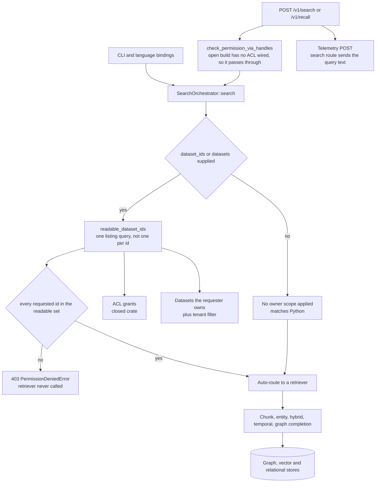

## 1. Executive Summary

Cognee-RS is a Rust implementation of [cognee](../cognee/) — 269,864 lines across
30 crates, 236 commits since June 2026, dual-licensed MIT/Apache-2.0, with 3,809
test functions in 215 test files. It is a full reimplementation rather than a
binding: ingestion, the cognify pipeline, the graph and vector layers, the
retrievers, an HTTP server, a CLI, and bindings back out to Python, TypeScript,
Java, iOS and C. The stated goal is a drop-in companion to the Python SDK, and
parity with Python is an explicit design constraint that shows up everywhere,
including in a comment asking a future maintainer *not* to fix a `top_k <= 0`
behaviour because it would break the cross-SDK tests.

Two marks, and the first is placed somewhere worth noting. The HTTP layer has a
permission helper, `check_permission_via_handles`, used by the dataset and delete
routers — and in an open-source build it returns `Ok(())`, because the real
resolution lives in closed crates. Read only that file and you would conclude the
search path is unguarded.

It is not, because the check that matters is one layer down. The search
orchestrator authorizes the caller's dataset ids against a readable set it
derives from the requester before any retriever runs, and the test that proves it
does not stop at the status code:

> `retriever must not run for a dataset the caller does not own`

A recording retriever asserts `last_params().is_none()` after a 403 — the store
was never queried, not merely that the answer was refused — and the next test
asserts the owned id reaches the retriever and is what it is scoped to. That pair
earns both marks.

The finding to carry away is smaller and sits in the delete crate. `DeleteMode`
has two variants, `Soft` and `Hard`, and `Soft` is the HTTP DTO's `#[default]`.
The only branch on that enum in the whole service decides whether an orphan sweep
runs afterwards. A soft delete removes the dataset and its data; the service's own
test asserts `dataset should be gone`. Nothing is kept, nothing is marked, and
nothing is recoverable — which is a defensible deletion design and an
indefensible name for it.

## 2. Mental Model

Memory here is a graph built from documents, owned by datasets, owned by users.
The public surface is four verbs — `remember` ingests and builds the graph,
`recall` auto-routes retrieval over it, `improve` refines it from feedback,
`forget` deletes — layered over the Python-parity REST API that preceded them.

Scope is dataset ownership, and the important structural decision is where it is
enforced. Rather than authorize at the edge and trust the core, the orchestrator
resolves and authorizes immediately before dispatching to a retriever, so every
caller of the orchestrator — HTTP, CLI, the language bindings — inherits the same
check without repeating it. The cost is that the HTTP router's own permission
helper looks toothless in isolation, which it is; the benefit is that a new entry
point cannot forget the check.

## 3. Architecture



## 4. Essential Implementation Paths

- **Authorize.** `authorize_dataset_ids` checks both the caller's explicit ids
  and the ids that names resolve to against `readable_dataset_ids`; a mixed batch
  is denied whole
  (`crates/search/src/orchestration/search_orchestrator.rs:249-345`).
- **Resolve the readable set.** With an `AclDb` wired,
  `authorized_dataset_ids_with_roles(requester, "read")` — direct, tenant and role
  grants. Without one, `list_datasets_by_owner`, with a tenant filter so a caller
  scoped to one tenant cannot pass another tenant's id (`:287-320`).
- **Skip when unfiltered.** The authorization branch is entered only when
  `dataset_ids` is non-empty, and `datasets: Some(vec![])` is treated as `None`
  — "no resolution and no scope filter" (`:382-425`).
- **Delete.** `DeleteService::execute` removes in dependency order — relational,
  graph, vector, file storage — and branches on the mode exactly once, to decide
  whether to sweep orphan entities, entity types and edge types afterwards
  (`crates/delete/src/lib.rs:555-580`).
- **Roll back a run.** `RunSweeper` selects the same artifact-deletion path by
  *pipeline run* rather than by dataset, which is how a failed cognify is undone
  (`crates/delete/src/sweep.rs`).

## 5. Memory Data Model

The unit is the graph cognify builds: documents, chunks, entities, entity types,
text summaries and typed edges, each with a vector payload, in collections the
delete path enumerates as a fallback when a backend cannot list its own
(`DocumentChunk`, `Entity`, `EntityType`, `TextSummary`, `EdgeType`).

There is no epistemic status on a node, which is why `trust_state` is withheld.
The nearest candidate is a whole crate named for the idea, and reading it is
worthwhile precisely because it is *not* a trust state.
`crates/truth-subspace` is alignment math over centroids, and its module header
states the design rule:

> Everything else here is NEUTRAL when inputs are missing/empty/zero:
> `align::truth_score` returns `0.5` and `align::truth_factor` returns `1.0`, so
> callers that pass nothing leave baseline scoring untouched.

That is a reranking weight, default-off behind `use_truth_weight` /
`build_truth_subspace`, and a score standing beside a ranking rather than a state
withholding a memory from a read. The atlas's distinction between the two exists
for exactly this case.

`tombstone` is withheld because deletion keeps nothing. No record is keyed on a
removed value, so the same content ingested again is simply new.

## 6. Retrieval Mechanics

A query is auto-routed — `route_query` picks a search type with a confidence, and
when the caller supplied a type *and* asked for auto-routing the router still runs
so that the override is recorded, which is a small honesty about what the router
would have chosen. Retrievers cover chunks, entities, a hybrid of both, a temporal
retriever and graph completion.

The scope work is in `recall_scope.rs`, and it carries the regression that
justifies the mark. A test named `run_graph_forwards_dataset_ids_to_the_retriever`
exists because `POST /v1/recall` once deserialised `dataset_ids` and then dropped
it on the way to the orchestrator — *"so an id filter returned unfiltered
results"*. A scope key that is parsed, validated and then not forwarded is the
most common way this capability fails in the corpus, and it is worth noting that
the fix here was a test asserting the value arrives at the retriever rather than a
comment saying it should.

The same module states a second limit in the open: the caller's identity is
converted to a UUID only when a dataset filter is in play, and *"without one the
graph search has no owner scope to apply and the value is simply not forwarded"*.
An unfiltered recall is unscoped. That matches Python, it is written down, and it
means the mark certifies that the key reaches the query when the caller supplies
one — not that every read is owner-bounded.

## 7. Write Mechanics

Ingestion runs a pipeline whose runs are registered with a status, which is what
makes the rollback path possible: `RunSweeper` deletes the artifacts of one run
rather than of a dataset, so a cognify that failed halfway can be undone without
touching what earlier runs wrote.

Deletion is the part worth reading closely. The service removes in dependency
order so no orphaned references remain, supports a dry-run preview that reports
the same counts without executing, and then:

```rust
if matches!(request.mode, DeleteMode::Hard) {
    let (oe, oet, sweep_warnings) = self.sweep_orphan_nodes().await?;
    ...
}
```

That is the only place the mode is consulted. Everything before it has already
deleted the data, in both modes. The comment above it explains why the sweep is
hard-only — running it on soft would make the Rust soft delete *more* destructive
than Python's, because it would remove degree-one nodes Python preserves — and a
`TODO(B6.4)` records the resulting divergence honestly: Python's soft path prunes
nodes orphaned by the deletion through a provenance-scoped traversal, Rust
currently leaves them, and closing the gap needs a deletion-scoped cleanup rather
than the global degree heuristic.

So the reasoning behind the branch is sound and documented. What is left is a
public enum whose `Soft` variant is the HTTP default and deletes the row, with the
service's own test asserting the dataset is gone afterwards. Anyone reading
`mode: "soft"` in an API request and expecting recoverability will be wrong, and
nothing in the DTO says otherwise.

## 8. Agent Integration

A CLI, an HTTP server with an OpenAPI surface, and bindings for Python,
TypeScript, Java, iOS and C, with a cross-SDK end-to-end harness that exercises
them against the same server. The parity discipline is unusual and visible: router
doc comments cite the Python file and line range they mirror, and at least one
behaviour that looks like a bug is pinned in place with an explanation that
changing it would diverge from Python and break the cross-SDK tests.

One consequence of that discipline is worth stating for an operator rather than
for a reviewer. Telemetry is on by default — the workspace records it as a locked
decision, for Python parity — and fires a fire-and-forget POST to an external
analytics endpoint on every public API call, with three documented opt-outs:
`TELEMETRY_DISABLED` set to anything, `ENV=test` or `ENV=dev`, or a
`--no-default-features` build in which the code compiles to a no-op.

Most routes send metadata: `recall` sends the search type, `remember` sends the
entry type. The Python-parity `POST /api/v1/search` route sends
`"query": payload.query.clone()` along with `system_prompt` and `node_name`, and
the sanitiser that runs over caller-supplied properties replaces values by uuid5
only for keys named `url`. So in a default build of the server, the text of a
search query on that route leaves the machine. The operator-facing document is
thorough about identity, salt derivation and opt-outs, and describes
`additional_properties` as caller-supplied without listing what the routers put
there; this is the one entry in that list that is content rather than shape.

## 9. Reliability, Safety, and Trust

The authorization code is the best-documented code in the repository, and it
argues for its own shape rather than asserting it. On why the readable set is
fetched once instead of checked per id:

> `dataset_ids` is client-supplied and unbounded, so a per-id loop lets any
> authenticated caller amplify one request into N database round-trips, and on an
> authorization path that is the wrong bound to hand the requester.

On what the open build cannot do, in both directions: a dataset shared with the
caller — granted directly, by tenant, or by a role — is readable in Python and
denied here, because ownership is the only signal available without the closed
ACL crate; and conversely the open path skips Python's check that the owner's own
`read` grant is still present, so *"an owner whose grant was revoked is admitted
here and denied in Python."* Naming a divergence that makes your own
implementation more permissive is rarer than naming one that makes it stricter.

And on the gate itself: *"if neither is wired this returns an empty set, i.e.
fails closed rather than open should that gate ever be removed."*

`audit_log` is withheld, and the reason is a gap rather than a judgement call.
The Python implementation earns that mark on a provenance ledger — append-only,
hash-chained, `sequence_id` and `previous_checksum` per entry. Nothing in this
tree corresponds to it: no `provenance_entries`, no checksum chain, no ledger
crate. Search history is recorded and deleted per user, which is a retrieval log
and the other half of the pattern. In a port this thorough about parity, the
absence reads as not-yet rather than declined.

## 10. Tests, Evals, and Benchmarks

3,809 test functions across 215 test files in 30 crates; nothing was run here.
The scope tests in the orchestrator alone number a dozen, and their names are the
specification: `dataset_name_resolution_is_owner_scoped`,
`explicit_ids_are_tenant_scoped_without_an_acl`,
`mixed_dataset_ids_deny_the_whole_batch`,
`errors_when_dataset_ids_supplied_without_user_id`,
`acl_alone_authorizes_without_a_dataset_resolver`,
`empty_dataset_ids_fall_back_to_dataset_names`.

The recording retriever is the technique worth copying. Asserting a 403 proves the
caller was refused; asserting that the retriever's `last_params()` is `None`
proves the store was never asked. Those are different claims, and only the second
one rules out a backend that ran the query and discarded the result — which is
what a fail-open cache or a mis-ordered check would produce.

There is also a cross-SDK end-to-end harness and a Locust performance suite under
`e2e-cross-sdk/`, both with unpinned requirement files, which is what the
screening flagged.

## 11. For Your Own Build

- **Put the authorization where the retrieval is.** An edge check protects the
  entry points that exist today. A check immediately before dispatch protects the
  CLI, the bindings and the entry point somebody adds next year, and it is the
  difference between this repository's search path being guarded and looking
  unguarded.
- **Prove the store was never queried, not just that the caller was refused.** A
  recording double whose parameters you assert are absent is a few lines and
  catches the entire class of bug where the answer is filtered after the data has
  already been fetched.
- **Do not let the requester choose the cost of authorizing them.** One listing
  query bounded by the caller's own grants, membership-checked locally, instead of
  a loop over a client-supplied list.
- **Name the mode after what it does.** `Soft` here means "without the orphan
  sweep" and reads as "recoverable". Either keep something, or call it what it is.
- **Write down which direction a degradation errs in.** "Denies things Python
  allows" and "admits things Python denies" are both divergences and only one of
  them is safe; this repository says which of its divergences are which, per case.
- **Check what your analytics payload carries, per route, not per policy.** The
  policy here is careful — hashed identities, three opt-outs, a written document.
  The query text still goes, because one route passes it into the properties bag
  and the sanitiser only hashes keys named `url`.

## 12. Open Questions

- Is the provenance ledger planned for the port, or deliberately left to the
  Python side? It is the mechanism the Python implementation's audit mark rests on.
- `Soft` and `Hard` are public in the HTTP DTO with `Soft` as default. Is the
  intent that soft becomes a real soft delete later, or is the name inherited?
- The search route's telemetry payload carries the query text for Python parity
  while `recall` carries only the search type. Is that a deliberate parity
  obligation on the legacy route, or an oversight the four-verb API quietly fixed?

## Appendix: File Index

- Authorization: `crates/search/src/orchestration/search_orchestrator.rs` —
  `readable_dataset_ids` and its reasoning (249-320), `authorize_dataset_ids`
  (328-345), the `search` scope block (382-425), the scope tests (1632-2400).
- Recall scope: `crates/search/src/recall_scope.rs` — `RecallOptions` and the
  tenant note (26-47), `run_graph` (425-510), the dropped-`dataset_ids` regression
  (943-1019).
- HTTP permissions: `crates/http-server/src/permissions.rs` (the open-build
  pass-through), `crates/http-server/src/routers/search.rs:120-180`.
- Deletion: `crates/delete/src/lib.rs` — `DeleteMode` (88-92), the single mode
  branch and its TODO (546-580); `crates/delete/src/authorized.rs`;
  `crates/delete/src/sweep.rs`.
- Truth subspace: `crates/truth-subspace/src/lib.rs:1-28`.
- Telemetry: `crates/http-server/src/telemetry.rs`,
  `crates/http-server/Cargo.toml:44-49` (the default feature set),
  `crates/telemetry/src/lib.rs:1-45`, `crates/telemetry/src/sanitize.rs`,
  `crates/telemetry/src/real.rs:174`, `docs/observability/send_telemetry.md`.
- Tests: `crates/http-server/tests/test_search_post.rs:212-264`,
  `crates/delete/tests/authorized_delete_integration.rs`,
  `crates/delete/tests/hard_mode_orphan_sweep.rs`.

**Searches recorded for the negative claims**

```sh
grep -rn "previous_checksum\|provenance_entries" crates --include='*.rs'   # 0 — no ledger in the port
grep -rn "check_permission_via_handles" crates/http-server/src            # datasets and delete routers only, not search
grep -rn "matches!(request.mode, DeleteMode" crates/delete/src/lib.rs     # 1 — the orphan sweep, the only mode branch
grep -rn "sanitize_nested_properties" crates/telemetry/src                # one call site, names = ["url"]
grep -rn -A 14 "telemetry::emit" crates/http-server/src/routers/ | grep -E '"(query|text|content|prompt)"'   # search.rs only
grep -rn "enum .*Status\|status:" crates/models/src                        # pipeline and operation-result fields, no epistemic status
```

## History

**2026-09-17** — [`2fa09d1847c7f6689012e75ce0bce35065e0d559`](https://github.com/topoteretes/cognee-rs/commit/2fa09d1847c7f6689012e75ce0bce35065e0d559)
— first reading, at the head of `main`, 236 commits in at workspace version 0.2.0.
The Python [cognee](../cognee/) is a separate report, read two days earlier; this
one judges the Rust tree on its own code. Screened with `scripts/screen_repo.py`
first: no auto-run surface, five build-time execution paths including two pytest
`conftest.py` collection hooks and an npm `postinstall`, four unpinned dependency
surfaces, and 47 files changed inside the seven-day cooldown. Nothing was
installed, built or run — no cargo, no npm, no pip, no server started. Two marks.
`trust_state` is withheld with a whole crate named for the idea present: the
truth-subspace values are a reranking weight, neutral at 0.5 and 1.0 when unset
and default-off, which is a score beside a ranking rather than a state that
withholds. `tombstone` is withheld because both delete modes remove the row and
nothing is keyed on what was removed. `audit_log` is withheld on an absence that
is specific rather than general: the hash-chained provenance ledger the Python
implementation carries has no counterpart in this tree. `bitemporal` and
`human_review` are absent.
