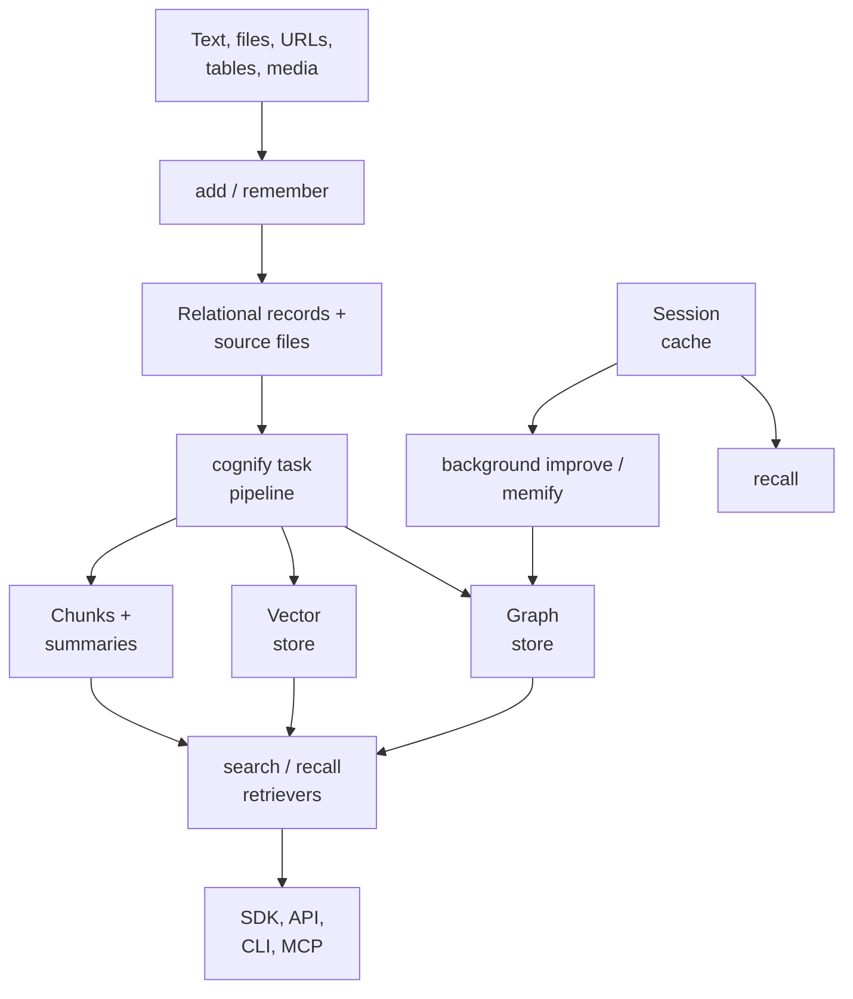

## 1. Executive Summary

Cognee is a memory and knowledge pipeline rather than a thin vector-store
wrapper. It preserves source data, extracts a typed knowledge graph, embeds
chunks and graph material, supports ontology grounding, and exposes many
retrieval strategies over relational, graph, vector, and session stores.

Its best architectural move is the separation between:

- `add`: register and preserve source material.
- `cognify`: turn that material into graph and vector projections.
- `search` / `recall`: query one or more memory views.
- `memify` / `improve`: enrich an existing memory asynchronously.
- `forget`: remove a data item, a dataset, derived memory, or all user data.

The `remember` and `recall` APIs compress this machinery into a smaller
agent-facing mental model. A session write can land in a fast cache and bridge
to permanent graph memory in the background; a permanent write runs
`add` plus `cognify`.

Cognee is the strongest choice in this atlas when the requirement is an
ontology-aware, multimodal knowledge graph with pluggable storage. It is a poor
fit when the requirement is a small, deterministic memory component: its
configuration and adapter surface is large, extraction remains probabilistic,
and consistency spans several stores.

The inspected package version is `1.5.4` (2026-09-04).

Three additions change what the platform can say about its own memory, and all
three are opt-in. An **audit-grade provenance ledger** (`PROVENANCE_TRACKING`)
appends every document, chunk, entity and relationship cognify writes to a
hash-chained relational table. **Contradiction detection**
(`contradiction_detection`) asks an LLM which facts touching the current
ingestion contradict, and writes a `contradicts` edge with both facts, a reason
and a confidence. **Temporal contradiction resolution** keeps the newest target
of a relationship the caller declares single-valued and tags the older edges
`superseded`. None of the three changes what a retriever returns. Two further
changes are on by default: search defaults to `HYBRID_COMPLETION`, and every
`remember`, `recall`, `search`, `forget`, `improve` and prune call writes one
operation row to `pipeline_runs`.


## 2. Mental Model

Cognee treats memory as several projections of source material:

```text
source document / message / trace
    -> relational data record and raw content
    -> chunks
    -> LLM-extracted entities and relations
    -> graph nodes and edges
    -> vector indexes and summaries
    -> optional ontology identifiers, session lessons, and global context
```

The source record is the evidence layer. `DataPoint` objects and graph edges are
derived memory. Dataset membership is both an organizational boundary and an
authorization boundary. Session cache is a hot layer; the graph is the durable,
queryable knowledge layer.

This is not a single memory algorithm. It is a control plane for composing
ingestion, extraction, storage, enrichment, retrieval, migration, and deletion
pipelines.


## 3. Architecture



Local development can run embedded with SQLite plus local graph and vector
stores. Production deployments can consolidate around PostgreSQL or select
specialized adapters such as Neo4j, Neptune, pgvector, Qdrant, Chroma,
Weaviate, or Milvus. The unified engine and pipeline layer hide much of this
variation, but cannot make distributed writes intrinsically atomic.

`cognee/modules/pipelines/` defines reusable task execution. The default
cognify pipeline classifies documents, chunks them, extracts graph structures,
persists data points, and creates embeddings. Rollback and stale-run recovery
are explicit subsystems rather than incidental exception handlers.


## 4. Essential Implementation Paths

Public lifecycle:

- `cognee/api/v1/add/add.py`: resolves sources and runs the ingestion pipeline.
- `cognee/api/v1/cognify/cognify.py`: builds and executes the graph/vector
  extraction pipeline.
- `cognee/api/v1/remember/remember.py`: routes typed entries, permanent
  add-plus-cognify writes, and session-cache writes.
- `cognee/api/v1/recall/recall.py`: merges or short-circuits session and graph
  recall according to an explicit scope.
- `cognee/modules/search/methods/search.py`: authorized dataset search.
- `cognee/modules/memify/memify.py`: post-ingestion enrichment pipelines.
- `cognee/api/v1/forget/forget.py`: exact item, dataset, derived-memory, and
  user-wide deletion.

State and recovery:

- `cognee/infrastructure/engine/models/DataPoint.py`: typed, versioned graph
  data with optional deterministic identity and provenance fields.
- `cognee/tasks/storage/add_data_points.py`: graph/vector persistence.
- `cognee/modules/cognify/rollback.py`: provenance-aware rollback.
- `cognee/modules/cognify/recovery.py`: startup recovery for stale runs.
- `cognee/modules/users/permissions/`: dataset permissions and principals.


## 5. Memory Data Model

`DataPoint` is the base graph-memory unit. It includes:

- UUID, type, creation/update timestamps, and version.
- Optional deterministic identity derived from declared identity fields.
- Ontology validity and stable ontology URI.
- Set membership, topological rank, feedback and importance weights.
- Source pipeline, task, node set, user, and content hash.

Domain-specific Pydantic models extend this base. Graph `Edge` and `Triplet`
types express relationships; chunks and documents retain the connection to
ingested data. Relational `Dataset`, `Data`, pipeline-run, user, permission, and
session records track ownership and lifecycle outside the graph.

The model carries substantial provenance, but ontology validity is not the same
as factual verification. An LLM-extracted relation can be well attributed and
schema-valid while still being wrong.

`DataPoint` also has a `valid_to` field, commented as bi-temporal validity, and a
`close_node` helper in `tasks/storage/close_node.py` that stamps it and an
`is_valid` predicate that reads it. Neither is called outside tests, and no
retriever filters on `valid_to`, so the field is schema without a writer or a
reader and `bitemporal` is not awarded. The supersession that does run —
`resolve_temporal_contradictions`, opt-in — writes `superseded`, `superseded_by`
and `supersession_reason` onto edges, and nothing in `modules/retrieval/` reads
those either.


## 6. Retrieval Mechanics

`SearchType` exposes chunk, lexical chunk, RAG, summary, triplet, graph,
chain-of-thought, context-extension, decomposition, hybrid, Cypher, natural
language structured query, temporal, coding-rule, and agentic modes.

The important distinction is that these modes do not share one universal
ranking contract:

- Chunk and vector modes retrieve source passages.
- Graph modes traverse or complete over extracted entities and relations.
- Summary modes query compressed representations.
- Hybrid modes combine several channels.
- `recall` can search session entries by lexical token overlap before, or
  alongside, permanent graph retrieval.
- `FEELING_LUCKY` / automatic routing selects a strategy for the caller.

Dataset resolution occurs before authorized search: `authorized_search` resolves
the datasets the user holds `read` on, and each is searched inside its own
database context. Backend access control is on by default when the configured
graph and vector handlers can hold a database per dataset — the defaults,
`ladybug` and `lancedb`, can — and a handler that cannot raises an error naming
`ENABLE_BACKEND_ACCESS_CONTROL` rather than silently switching the boundary off.
Setting that variable to `false` runs search without a dataset context over one
shared store. The recall response can label session versus graph origin, which
is valuable when the caller must distinguish hot conversational state from
derived permanent memory.

Retrieval breadth is a strength, but it increases evaluation burden. A top-k
from graph completion is not directly comparable to a top-k chunk list, and
automatic routing can hide which retrieval policy produced an answer.


## 7. Write Mechanics

Permanent `remember` writes call `add` and `cognify`, then optionally
`improve`. `add` resolves inputs, stores source data, assigns dataset
permissions, and records pipeline state. `cognify` performs LLM extraction and
persists derived graph/vector artifacts.

With `session_id`, `remember` instead writes a QA-shaped entry to the session
cache. With self-improvement enabled, it schedules a bridge into permanent
memory. This keeps the interactive path fast while accepting eventual
consistency.

The write path supports deterministic IDs for domain models that declare
identity fields, incremental loading, content hashes, custom graph models,
ontologies, background execution, and dry-run cost estimation.

Contradictions are surfaced rather than resolved, unless the caller declares
which relationships are functional. `detect_contradictions` gathers the edges
around the entities an ingestion touched, including stored ones, and writes a
`contradicts` edge per LLM-confirmed pair; `resolve_temporal_contradictions`
keeps the most recent assertion for each declared single-valued relationship and
tags the rest. Both are off by default, both only add, and both swallow their
own errors so ingestion cannot fail on them. Separately, a
`ToolWriteProposal` — a correction to an external database the user connected,
drafted from evidence such as a detected contradiction — touches that database
only on an explicit `apply_write_proposal` call.

Failure handling is unusually serious. Cognify attaches provenance to generated
artifacts, rolls back by pipeline run, and recovers sufficiently old
non-terminal runs at startup. The age threshold is a pragmatic substitute for a
lease or heartbeat, so a long-running live job still requires careful tuning.


## 8. Agent Integration

Cognee exposes Python, REST, CLI, and MCP surfaces. The `remember`, `recall`,
`improve`, and `forget` vocabulary is the clearest agent integration because it
hides most pipeline details while retaining explicit dataset and session scope.

Typed `MemoryEntry` variants support QA, traces, feedback, and skill-run
records. The repository also includes agent-memory runtime modules, session
lifecycle hooks, migration sources for Mem0, Zep/Graphiti, and Letta, plus
export/push paths.

This breadth enables many integrations but should not become the default agent
tool list. A small governed subset is easier for a model to call correctly than
the full administration and retrieval surface.


## 9. Reliability, Safety, and Trust

Strengths:

- User-to-dataset permissions are enforced before reads and writes, and the
  suite asserts it both ways: a second user's recall and remember on a dataset
  it holds no permission on raise `PermissionDeniedError`, and the same recall
  succeeds after a grant.
- An opt-in provenance ledger is append-only and hash-chained: a re-tracked
  entity's previous row is archived under a versioned key, an invalidation is a
  new chained entry, and `verify_chain` recomputes the chain. It records what
  cognify wrote and nothing that `forget` or `improve` did.
- Every top-level operation writes one `pipeline_runs` row naming the operation,
  user, tenant, dataset, timing, outcome and token spend. The row does not say
  which items changed, and the recorder swallows its own write failures, so it is
  an activity feed rather than a mutation record.
- Supported backends can isolate graph and vector data per user and dataset.
- Provenance-aware rollback removes artifacts introduced by a failed run.
- Startup recovery clears stale processing states.
- `forget` supports exact targets and a `memory_only` mode that retains sources
  for reprocessing.
- Raw sources remain available underneath lossy graph extraction.
- Deterministic node identity can make repeated ingestion idempotent.

Limitations:

- Correctness spans relational, graph, vector, file, and cache stores.
- Session-to-graph improvement is intentionally asynchronous.
- LLM-extracted nodes become queryable without a candidate/verified/rejected
  trust state. `contradicts` edges and `superseded` tags are written beside the
  facts they concern and are not consulted by any retriever.
- Skill-improvement and external-database write proposals have a `proposed`
  status and an explicit apply step, but the apply is an SDK or API call with no
  reviewer identity, so they are a two-step write rather than a review surface.
- Dataset permissions govern access, not truth or instruction safety.
- Local file, outbound HTTP, and raw Cypher capabilities are enabled by
  documented defaults; production operators must narrow them deliberately.
- Backend access control is configurable, so deployments must verify that
  authentication and isolation settings match their threat model.


## 10. Tests, Evals, and Benchmarks

The repository contains broad unit, integration, end-to-end, adapter,
permission, deletion, provenance, recovery, migration, and performance tests —
684 `test_*.py` files. The memory-relevant negative case is
`cognee/tests/test_permissions.py`: with backend access control asserted on,
`user_1`'s recall on `user_2`'s dataset raises `PermissionDeniedError`, its
remember into it raises too, and after `user_2` grants `read` the same recall
returns one result from that dataset. The ledger has 27 manager tests, including
version archiving, a tombstone and a tamper fixture for chain verification.
The source test suite was not run for this atlas review because many paths
require database and model-provider infrastructure.

The committed BEAM report is transparent about its limits. It reports `0.79`
on a held-out 100K conversation using fixed hybrid retrieval and `0.67` on an
exploratory 10M run. The 10M routing configuration was selected on the same
questions used for reporting, and the distributed ingestion orchestration is
not included. Both results use synthetic conversations and LLM judging. They
are useful directional evidence, not a product-level reliability claim.

The report includes configs and per-run artifacts for the evaluation layer;
this atlas inspected those artifacts but did not rerun the benchmark.


## 11. For Your Own Build

### Steal

- Preserve source records before creating graph/vector projections.
- Make a pipeline run and its provenance the unit of rollback.
- Use deterministic IDs only when a model declares stable identity fields.
- Separate session-hot memory from permanent graph memory.
- Let `memory_only` deletion remove projections while retaining reprocessable
  evidence.
- Authorize datasets before retrieval, not after ranking.
- Offer a small memory-oriented API over a composable internal pipeline.
- Estimate expensive extraction before starting it.


### Avoid

- Confusing ontology conformance or provenance with factual verification.
- Treating every search mode as if it had equivalent top-k semantics.
- Exposing raw Cypher, filesystem ingestion, or outbound fetch to agents
  without a separate policy boundary.
- Assuming a unified abstraction makes cross-store writes atomic.
- Enabling automatic permanent promotion without correction and trust states.
- Copying the complete platform when the product needs only evidence storage
  plus retrieval.


### Fit

Borrow Cognee when graph structure, ontology grounding, multimodal ingestion,
storage adapters, and dataset-level access control are central requirements.
Budget for LLM extraction, schema design, backend configuration, and repair
operations.

Build a smaller system when memory is mostly conversational or project-local.
The minimum valuable subset to borrow conceptually is source preservation,
dataset scope, composable derivation, rollback by provenance, hybrid retrieval,
and exact forgetting.

For consequential automation, add a belief-review layer above Cognee's derived
graph. The platform records where a claim came from; the application must still
decide whether to trust it.


## 12. Open Questions

- What consistency guarantees are supported for each graph/vector/relational
  backend combination?
- Can session-to-permanent promotion expose candidate state before activation?
- Will `contradicts` edges or `superseded` tags ever reach a retriever, or are
  they for people and exports only?
- Should `forget` append to the provenance ledger? As written, the ledger shows
  an entity being created and never shows it being removed.
- Which automatic retrieval router is stable enough to be a public contract?
- How are untrusted instructions in source documents fenced at recall time?
- Can stale-run recovery move from an age threshold to a lease or heartbeat?
- Which BEAM configuration generalizes after being frozen on unseen data?


## Appendix: File Index

- `cognee/__init__.py`: public API.
- `cognee/api/v1/remember/remember.py`: unified write path.
- `cognee/api/v1/recall/recall.py`: session and graph recall.
- `cognee/api/v1/add/add.py`: source ingestion.
- `cognee/api/v1/cognify/cognify.py`: default extraction pipeline.
- `cognee/modules/search/types/SearchType.py`: retrieval modes.
- `cognee/modules/search/methods/search.py`: authorized search.
- `cognee/infrastructure/engine/models/DataPoint.py`: base graph record.
- `cognee/modules/cognify/rollback.py`: provenance rollback.
- `cognee/modules/cognify/recovery.py`: stale-run recovery.
- `cognee/modules/provenance/manager.py`, `storage.py`: the opt-in hash-chained ledger.
- `cognee/tasks/provenance/record_provenance.py`: the cognify task that writes it.
- `cognee/tasks/graph/detect_contradictions.py`, `resolve_temporal_contradictions.py`: opt-in contradiction edges and supersession tags.
- `cognee/modules/operations/record_operation.py`: one `pipeline_runs` row per operation.
- `cognee/tasks/storage/close_node.py`: `valid_to` helper with no live caller.
- `cognee/tests/test_permissions.py`: cross-user denial and grant.
- `cognee/api/v1/forget/forget.py`: deletion lifecycle.
- `cognee/eval_framework/beam/REPORT.md`: committed BEAM evaluation.

## History

**2026-09-15** — [`c0d18c80e24b7b78918e7642c03f6f128fdd2aee`](https://github.com/topoteretes/cognee/commit/c0d18c80e24b7b78918e7642c03f6f128fdd2aee) — 1,361 commits on `main`, 2026-09-09, at version 1.5.4. Screened before reading: one auto-run surface (`.devcontainer/devcontainer.json`), nine build-time execution points, five unpinned surfaces and three dependency files inside the seven-day cooldown; nothing was installed or run. The first reading carried one mark and no evidence; this reading ran the producer test on all seven. `negative_eval` is added and was missed: `test_permissions.py` already asserted cross-user recall denial with a grant as its control at the previous pin. `audit_log` is added and is new: the hash-chained provenance ledger landed on 14 August, opt-in and limited to cognify's writes. `scope_enforced` stands on the dataset-permission resolution, with access control on by default on supported backends. Withheld: `bitemporal`, because `valid_to` has neither a live writer nor a reader; `trust_state`, because `contradicts` edges and `superseded` tags are not consulted on retrieval; `human_review`, because proposal apply calls carry no reviewer; `tombstone`, because nothing refuses re-ingestion of forgotten material. The `pipeline_runs` operation rows added on 19 August are recorded as an activity feed, not a mutation audit. Also since the pin: hybrid completion as the default search type, per-user preference weights, code ingestion routes, and SSE streaming for recall.

**2026-07-27** — [`325acf356a81545b9892f19ab1ea7b61c51a776b`](https://github.com/topoteretes/cognee/commit/325acf356a81545b9892f19ab1ea7b61c51a776b) — first reading.
