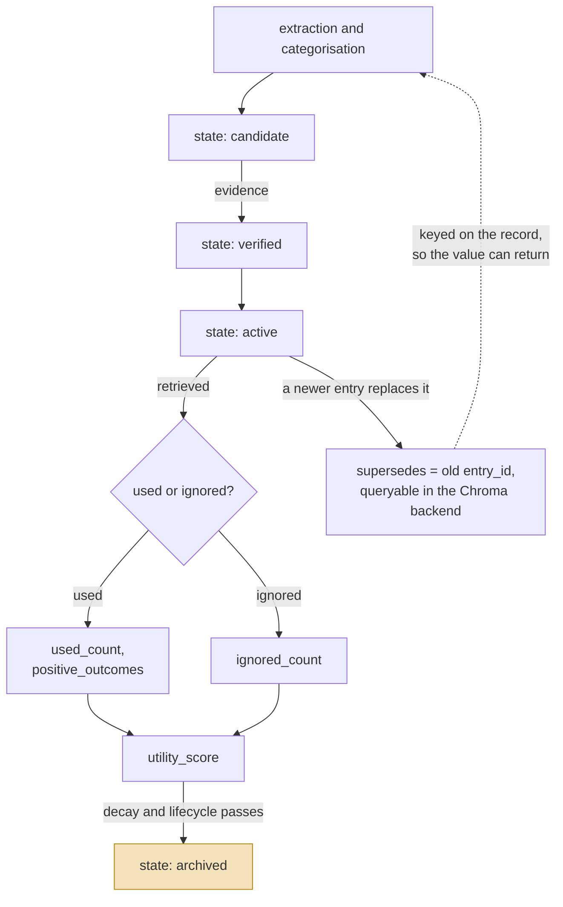

## 1. Executive Summary

CogniCore is an **agent memory service with swappable backends**, MIT, 79,439
lines of Python. It ships an OpenEnv manifest, a Claude Code plugin directory, an
MCP launch path, a UI server, a benchmark harness and a paper directory — the
repository is a research programme with a memory library at the centre of it.

**Two things earn marks and both are unusual enough to name.**

The `memory_entries` schema declares `state TEXT DEFAULT 'candidate'`. A memory
does not arrive believed; it arrives as a candidate and has to become something
else, with `verified`, `active` and `archived` the other values in use. Most
systems in this corpus store a confidence float and call that trust — a float
cannot express *rejected* and cannot express *not yet assessed*. A default of
`candidate` is a stronger statement than any number, and it is one line of DDL.

The same row carries a **utility ledger**: `retrieval_count`, `used_count`,
`ignored_count`, `positive_outcomes`, `negative_outcomes`, `utility_score`. The
distinction between *retrieved*, *used* and *ignored* is the interesting one —
it records that a memory surfaced and the agent declined it, which is the signal
almost every retrieval-scoring design in this atlas lacks.

**The scope mark is earned with a caveat that matters.** `scope` and `scope_id`
are stored on every entry and `ScopedMemory` applies them on the read path — but
by filtering in Python after the backend returns, under a comment saying it does
this "if backend doesn't support scope filtering". A scope applied after the
query means a `limit` is applied before the scope is, so a scoped read can return
fewer rows than it should while reporting no error. It is a real boundary and a
weaker one than a predicate.

**Correction is record-keyed.** `supersedes` holds the id of the entry being
replaced, and the Chroma backend can query `where={"supersedes": entry_id}` to
find what replaced what — better than most, because the supersession is
*searchable* rather than merely recorded. It is still keyed on the record, so
nothing stops a later extraction re-writing a value that was already replaced.

## 2. Mental Model

A memory is a **row that starts as a candidate and accumulates evidence about
its own usefulness**.

The schema carries four groups of columns, and reading them in order is the
design:

| Group | Columns |
| --- | --- |
| Content | `text`, `category`, `memory_type`, `embedding_json` |
| Epistemic | `state`, `correct`, `importance`, `relevance` |
| Scope | `scope`, `scope_id`, `session_id` |
| Provenance and utility | `creation_reason`, `source_component`, `source_agent`, `retrieval_count`, `used_count`, `ignored_count`, `positive_outcomes`, `negative_outcomes`, `utility_score`, `last_accessed` |

Three of those four groups are things most systems in this corpus do not store at
all. `creation_reason` and `source_component` say *why* and *from where*, which
is provenance as a first-class column rather than a metadata blob.

### How a thing becomes a belief, and how it stops being one

The left column is the part worth copying: a memory earns its way from candidate
to active, and its usefulness is measured rather than assumed. The dashed edge is
the familiar gap.

## 3. Architecture

One memory contract (`cognicore/memory/base.py`) with six backends behind it —
`sqlite_backend`, `chroma_backend`, `tfidf_backend`, `graph_backend`,
`multihop_backend` and `hybrid_backend` — plus an async wrapper and a scoped
wrapper that compose over any of them.

Two SQLite databases are committed to the repository at this commit
(`cognicore_memory.db`, `cognicore_trajectories.db`), alongside a benchmark
suite, an experiments directory and a paper directory. A separate
`research/persistent_store.py` keeps `episodes`, `strategies` and `reflections`,
which is the research programme's own store rather than the agent memory.

### Deployment and ergonomics

A Dockerfile, a Procfile and an `openenv.yaml` are all present, so the intended
deployment is a service. The cost to an operator is choosing among six backends
with different capabilities — the Chroma backend can query supersession by
metadata, the scoped wrapper falls back to Python filtering when a backend cannot
express scope, and nothing in the contract makes those differences visible to a
caller.

## 4. Essential Implementation Paths

- **Schema:** `cognicore/memory/sqlite_backend.py:36` — `memory_entries`, with
  `sessions` and `session_memories` below it.
- **Contract and backends:** `cognicore/memory/base.py`, `chroma_backend.py`,
  `graph_backend.py`, `hybrid_backend.py`, `multihop_backend.py`,
  `tfidf_backend.py`.
- **Scope:** `cognicore/memory/scoped.py:34-46` — the read-path filter and the
  comment explaining when it is used.
- **Supersession:** `cognicore/memory/chroma_backend.py:48`, `:147` — set on
  write, queried by `where={"supersedes": entry_id}`.
- **Lifecycle:** `lifecycle.py`, `sleep.py`, `temporal.py`, `utility.py`,
  `evaluator.py`.
- **Write path:** `extractor.py`, `categorize.py`, `decompose.py`, `planner.py`.

## 5. Memory Data Model

The `state` column is the atlas-relevant one and its default is the finding:
`'candidate'`. The values observed in the memory package are `candidate`,
`verified`, `active` and `archived`.

`correct` is a separate integer flag from `state`, which is worth noting because
the two can disagree — a memory can be `verified` as a state and carry a
`correct` value recording an outcome, and nothing in the schema constrains their
relationship. Whether that is a deliberate separation of *assessed* from *right*
was not established.

`memory_type` defaults to `semantic` and is orthogonal to `state`: type says what
kind of memory, state says how far it has been assessed. Keeping those apart is
correct, and several larger systems in this corpus conflate them.

## 6. Retrieval Mechanics

Backend-specific: TF-IDF, embedding similarity, graph traversal, multihop, and a
hybrid combining them, with a reranking benchmark committed at the repository
root.

**Scope is applied above the backend, not inside it.** `ScopedMemory` retrieves
and then filters `e.scope == self.scope and e.scope_id == self.scope_id` in
Python. The comment is candid — it exists for backends that cannot filter on
scope themselves — and the consequence is the one the rubric warns about for
post-filtered scope: any `k` or `limit` the backend applied was applied to the
unscoped set, so a scoped caller can silently receive fewer results than asked
for, and the shortfall looks like an empty store rather than a late filter.

## 7. Write Mechanics

Extraction and categorisation produce entries in the `candidate` state.
`supersedes` is set when a new entry replaces an existing one, and in the Chroma
backend it is stored as searchable metadata rather than an opaque field.

Background work exists and is substantial: a `sleep` module, `lifecycle.py`,
decay (177 occurrences of the vocabulary across the package), `utility.py`
maintaining the outcome counters, and a `tasks` table in
`integrations/task_queue.py`. A memory's `state` and `utility_score` therefore
change without a caller doing anything, which is the intended design and means
the store is not stable between reads.

## 8. Agent Integration

An MCP launch path (`mcp_launch_demo.py`), a `claude-plugin/` directory, an HTTP
and UI server (`cognicore/ui/server.py`, `dashboard.html`), and an `openenv.yaml`
manifest. The breadth is unusual for a memory library and reflects that this is
packaged as an environment rather than as a dependency.

## 9. Reliability, Safety, and Trust

**`trust_state` — earned.** A discrete `state` column defaulting to `candidate`,
with `verified` and `archived` in use.

**`scope_enforced` — earned**, with the post-filter caveat stated in the matrix
rather than buried here.

**`tombstone` — not found.** The vocabulary does not appear in the package;
`supersedes` is record-keyed. The near-miss is real and worth naming: because the
Chroma backend indexes `supersedes` as queryable metadata, the system can already
answer "what replaced this entry", which is the lookup a tombstone needs. What is
missing is keying it on the normalised *value*, so a re-extraction of the same
claim is not recognised as the thing already replaced.

**`audit_log` — not found.** `events.py` is a publish/subscribe observer bus with
`subscribe` and `publish` over in-process callbacks, not a persisted mutation
record. Searched the package for an append-only event table or a log writer and
found none.

**`bitemporal` — not found.** `temporal.py` exists and carries no `valid_from`,
`valid_to`, `valid_at` or `effective` field; the schema has `timestamp` and
`last_accessed`, both record time.

**`human_review` and `negative_eval` — not assessed.** A benchmark harness,
`analyze_verdicts.py` and `run_production_audit.py` are present and were not
traced; neither mark is claimed in either direction.

## 10. Tests, Evals, and Benchmarks

The repository is unusually eval-heavy: `benchmark.py`, `cognicore_bench/`,
`cognicore_benchmarks/`, `run_reranking_benchmark.py`, `analyze_failures.py`,
`analyze_verdicts.py`, `analyze_verdicts_multihop.py`, a `results/` directory and
`trajectories_export.jsonl`.

It is also loose at the root: fourteen `test_*.py` files sit beside `tests/`,
several of them provider smoke tests (`test_groq.py`, `test_gemini_sdk.py`,
`test_quota_15.py`), which is scratch work committed rather than a suite. Two
`.db` files and a `validation.log` are committed alongside them. I did not run
anything.

## 11. For Your Own Build

### Steal

- **`state DEFAULT 'candidate'`.** One line of DDL that makes "not yet assessed"
  representable, which a confidence float cannot do.
- **Separating `used_count` from `ignored_count`.** Recording that a memory
  surfaced and was *declined* is the feedback signal most retrieval scoring in
  this atlas lacks — it distinguishes a bad memory from an unretrieved one.
- **`creation_reason` and `source_component` as columns.** Provenance in the
  schema rather than in a metadata blob means it survives a backend swap.
- **Making supersession queryable.** Storing `supersedes` as searchable metadata
  rather than an opaque column turns a link into a lookup.

### Avoid

- **Scope as a post-filter.** If the backend applied a limit, it applied it to
  the unscoped set. Push the predicate down, or do not apply a limit above it.
- **Six backends behind one contract with different capabilities.** A caller
  cannot tell whether their backend filters scope natively or in Python, and the
  difference changes what a limited query returns.

### Fit

This suits a team that wants **a memory service with an epistemic model already
in the schema** and is prepared to choose a backend deliberately. The candidate
state and the utility ledger are the reasons to read it, and both are portable as
ideas even if nothing else is adopted.

Poor fit if the scope boundary has to be strict — the post-filter is a real
limitation under a limit — or if you want a small dependency: this ships as an
environment with a benchmark programme and a paper directory attached.

## 12. Open Questions

- **What moves an entry from `candidate` to `verified`?** The states exist in the
  schema and the transition was not traced to a gate.
- **How do `state` and `correct` relate?** Two epistemic fields with no
  constraint between them, and no reconciling code was found.
- **Which backends filter scope natively?** The scoped wrapper exists because
  some cannot; which is which determines whether a limited scoped query is safe.
- **What do the committed `.db` files hold?** Two databases are in the tree at
  this commit, and whether they are fixtures or captured runs was not
  established.

## Appendix: File Index

**Storage and schema**
- `cognicore/memory/sqlite_backend.py` — `memory_entries`, `sessions`,
  `session_memories`
- `cognicore/memory/base.py` — the backend contract
- `cognicore/research/persistent_store.py` — episodes, strategies, reflections

**Backends**
- `chroma_backend.py`, `graph_backend.py`, `hybrid_backend.py`,
  `multihop_backend.py`, `tfidf_backend.py`, `vector_memory.py`

**Scope, lifecycle and utility**
- `scoped.py` — the read-path filter
- `lifecycle.py`, `sleep.py`, `temporal.py`, `utility.py`, `evaluator.py`

**Write path**
- `extractor.py`, `categorize.py`, `decompose.py`, `planner.py`

**Integration**
- `mcp_launch_demo.py`, `claude-plugin/`, `cognicore/ui/server.py`,
  `openenv.yaml`, `Dockerfile`

**Evals**
- `benchmark.py`, `cognicore_bench/`, `cognicore_benchmarks/`,
  `run_reranking_benchmark.py`, `analyze_verdicts.py`, `results/`

## History

**2026-08-04** — [`760cdde49328a6cca8c430256b072cc1c4f48247`](https://github.com/cognicore-dev/cognicore-my-openenv/commit/760cdde49328a6cca8c430256b072cc1c4f48247) — first reading.
