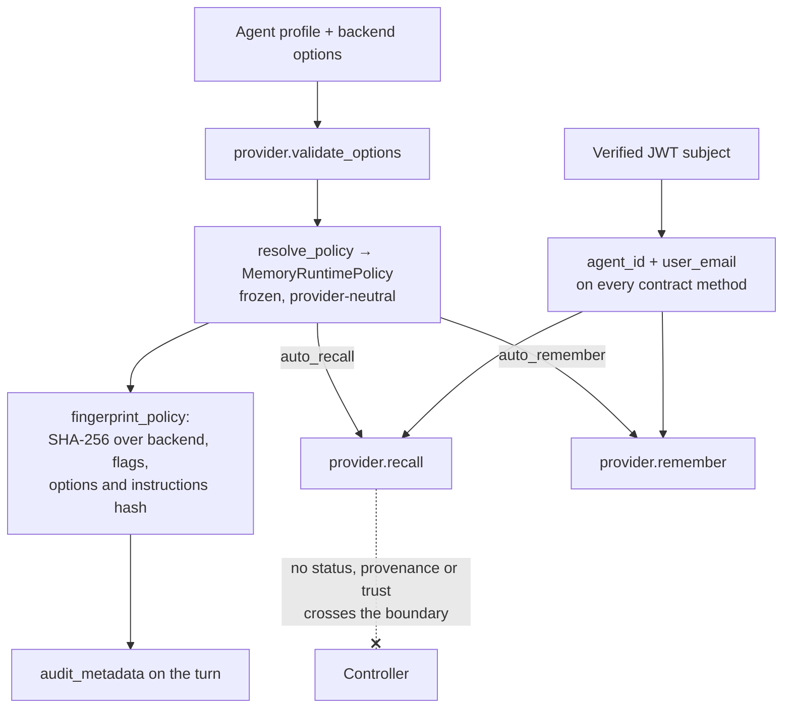

## 1. Executive Summary

Cognis is a Business Source License 1.1 agent OS — 1,495 files, 802 commits —
that separates a controller from executors: the controller owns users, agents,
conversations, workflows, routing and the UI, while executors run tools,
browsers, shells, LSPs and MCP servers wherever the work belongs. It is the
middle piece of a three-service platform by one author, beside
[Mnemory](../mnemory/) for memory and [Intaris](../intaris/) for guardrails.

**It owns no memory store, and that is why it is worth reading.** Its Postgres
holds users, agents, conversations and workflows; memory is a mounted provider
behind `MemoryProvider`, with a Mnemory backend and a `null` backend shipped. So
what this report is about is the *contract*, and the contract does three things
this atlas rarely finds in a host runtime.

**Deletion is in it, twice.** `delete_memory` and `delete_memory_tool` are
separate methods, so the delete an agent can call through a tool is a different
entry point from the host's own — the two can be authorised differently. The
comparison that makes this notable is that AutoGen and ADK both omit deletion
from their memory contracts entirely, and no better implementation can add it
afterwards.

**Identity crosses the boundary on every call.** `agent_id` and `user_email` are
parameters of `recall`, `remember`, `add_memory`, `search` and both deletes. A
provider is never asked to guess whose memory it is operating on.

**And the policy that governed a turn is fingerprinted.** `MemoryRuntimePolicy`
is frozen and provider-neutral — `enabled`, `bootstrap_instructions`,
`bootstrap_core`, `auto_recall`, `auto_remember`, `tools_enabled`, the
instruction text, a mode and a profile — and `fingerprint_policy` hashes the
backend id, the options, every flag and a SHA-256 of the instruction text into
one `policy_fingerprint`. `audit_metadata()` hands that back with the backend and
mode for the turn's record. A reader asking *why did the agent recall nothing on
Tuesday* has a value to compare rather than a configuration to reconstruct.

What the boundary does not carry is anything epistemic. No status, no
provenance, no trust, no tombstone: the host mediates *whether* memory runs and
under which policy, and takes no position on whether what comes back is true.

## 2. Mental Model

The controller decides, the provider remembers, and the policy is the contract
between them for one turn.

**A turn resolves a policy first.** `MemoryBackendOptionsProvider` is
provider-owned — it validates options, publishes `MemoryModeDescriptor` entries
with UI metadata and a `behavior` dict, and resolves them into the frozen runtime
policy. So the *provider* defines what modes exist and the *host* enforces the
resolved policy, which is a cleaner split than a host enumerating backends it
does not own.

**Memory then happens by flag rather than by call site.** `auto_recall` and
`auto_remember` are policy fields, so turning memory off for a profile is one
resolved value rather than a code path.

**Identity is verified, not asserted.** The contract test asserts a JWT with the
wrong audience is rejected, and — the interesting one — that the JWT subject *is
not overridden by an OpenWebUI header*. Whose memory a call touches cannot be
changed by a header a caller controls.

**And the fingerprint travels with the turn.**

The dotted edge is the limit: everything about *whether* memory ran is recorded,
and nothing about whether what it returned can be believed.

## 3. Architecture

A controller process, executors that connect to it, Postgres for the controller's
own state, and companion services for memory and guardrails. Docker files for the
executor and a mock LLM ship in the tree, as does a Makefile and a GitHub
Actions workflow set.

The screen found 0 auto-run surfaces, 5 build-time execution paths, 1 unpinned
dependency surface, and a `uv.lock` unchanged for twelve days — so every version
it resolves is at least that old. Nothing was built or run.

The licence is **BSL 1.1**, which is a caveat rather than an exclusion here: the
code is readable and analysable, and a reader should check the change date and
the additional-use grant before building on it.

## 4. Essential Implementation Paths

- **Contract** — `cognis/providers/base.py`, `class MemoryProvider(Protocol)`:
  `load_session_identity`, `recall`, `remember`, `add_memory`, `search`,
  `delete_memory`, `delete_memory_tool`, `bootstrap_agent`, `health`.
- **Policy** — `cognis/providers/memory/policy.py`: `MemoryRuntimePolicy`,
  `MemoryModeDescriptor`, `MemoryBackendOptionsProvider`, `fingerprint_policy`,
  `audit_metadata`.
- **Backends** — `cognis/providers/memory/mnemory.py` (854 lines),
  `cognis/providers/backends/memory/null.py` (154), and a thinner
  `backends/memory/mnemory.py`.
- **Agent-facing tools** — `cognis/tools/builtin/memory.py` (720 lines).
- **Contract test** — `tests/contract/test_mnemory_contract.py`, plus
  `tests/unit/test_memory_policy.py` and `tests/unit/test_memory_tools.py`.

## 5. Memory Data Model

There is none to describe, and the shape of the *response* is the closest thing.
The contract test pins it: a recall returns a `session_id` string, `instructions`
that may be null or a string, `core_memories` that may be null or a string, a
`search_results` list, and a `stats` dictionary whose key set is asserted exactly.
That last assertion is the useful one — a backend that adds or drops a stat key
fails the contract rather than silently changing what the UI shows.

`load_session_identity` is a first-class method rather than a parameter, which
says the host expects a provider to hold an identity for a session and to be
asked for it rather than told.

## 6. Retrieval Mechanics

`recall` carries `search_mode`, `include_instructions`, `managed`,
`instruction_mode` and `ttl` — so the host can ask for a bootstrap-shaped recall
or a query-shaped one through the same method, and a provider that supports only
one degrades rather than breaking. Ranking, fusion and scoring are entirely the
provider's business; the host contributes the identity, the mode and the budget.

## 7. Write Mechanics

Two write verbs with different meanings: `remember` takes a session's messages,
`add_memory` takes a single piece of content with a type, categories, importance,
a role and a `pinned` flag. Keeping conversational capture and deliberate
assertion apart at the contract is right — they have different failure modes and
different authority — and several host runtimes in this atlas collapse them.

Both are policy-gated: `auto_remember` decides whether the first fires without a
tool call.

## 8. Agent Integration

`cognis/tools/builtin/memory.py` is 720 lines of agent-facing tools, and
`delete_memory_tool` existing separately on the contract is the seam that makes
those tools governable — an agent's delete and the host's delete can be
authorised, logged or refused differently, which is exactly the distinction a
governed write gateway needs and which most tool surfaces flatten.

Guardrails are a sibling provider, so a tool call can be evaluated by
[Intaris](../intaris/) before it runs. Between the two, this platform has the
pieces for policy on both the memory path and the action path; what it does not
have is a shared vocabulary between them.

## 9. Reliability, Safety, and Trust

**Scope is verified rather than asserted, and tested that way.** The JWT subject
is the identity, and the committed contract test asserts an OpenWebUI header
cannot override it. That is a stronger form of `scope_enforced` than a filter
composed into a query, because it protects the input to the filter.

**The policy fingerprint is the mechanism to take.** Hashing the backend, the
options, every behaviour flag and the instruction text into one value that
travels with the turn's audit metadata answers a question this atlas keeps
finding unanswerable: *which rules were in force when this happened.* One other
system here does it, [MemLedger](../memledger/), by canonicalising and hashing
its policy file and stamping the hash on every event it influenced. Cognis does
it a layer up, for the host's own memory policy, and reaches the same property
from a different direction.

**The boundary is thin on epistemics, deliberately.** Nothing carrying trust,
provenance or status crosses it. That is a defensible split for a host — the
provider owns belief — and it has the cost DeerFlow's report records for the same
family: what a backend models and the host does not simply does not travel.

**And the fingerprint is not an audit.** It records which policy governed a turn,
not what changed in the store. No append-only record of memory mutations exists
on this side of the boundary, and the provider's log is the provider's.

## 10. Tests, Evals, and Benchmarks

`tests/contract/test_mnemory_contract.py` is the piece worth copying: a contract
suite that runs against the real provider surface and asserts authentication
behaviour, identity precedence and response shape. `test_memory_policy.py` covers
the resolution and fingerprinting; `test_memory_tools.py` the agent-facing tools;
`tests/integration/test_memory.py` the wiring.

`negative_eval` is earned narrowly and precisely, on
`test_jwt_subject_is_not_overridden_by_openwebui_header` and
`test_whoami_rejects_wrong_jwt_audience` — committed cases asserting that a
caller-supplied header cannot reach another identity's memory. It is an identity
assertion rather than a retrieval assertion, and it is the input the retrieval
boundary depends on.

No benchmark numbers are published, and none are claimed.

## 11. Patterns Worth Stealing

### Steal

**Fingerprint the policy that governed the turn.** A SHA-256 over the backend id,
the resolved flags, the options and a hash of the instruction text, returned as
audit metadata. It is perhaps twenty lines and it turns "what was the memory
configuration in March" from an archaeology problem into a comparison.

**Put deletion in the contract twice.** A host delete and an agent-facing delete
are different authorities wearing the same verb.

**Let the provider own its modes and the host own their enforcement.**
`MemoryBackendOptionsProvider` validates options and publishes descriptors; the
host resolves them into a frozen policy. Neither has to enumerate the other.

**Ship a null backend and a contract test together.** The first makes a new
backend a copy-and-fill exercise; the second is what stops it drifting.

**Verify identity, then test that a header cannot override it.** The assertion is
three lines and it guards every scope filter downstream.

### Avoid

**Do not mistake a policy fingerprint for an audit log.** It says which rules
ran, not what they did.

**Do not let a thin boundary become a silent one.** Nothing epistemic crosses
here; a provider with a trust model has no way to tell the host, and the host has
no way to ask.

### Fit

This is the right shape for a self-hosted platform where memory is somebody
else's service and the host's job is to decide when it runs and under what
policy — and the fingerprint makes that job auditable. Take the policy object and
the contract test regardless of whether you want the rest.

It is the wrong place to look for memory mechanics: the store is elsewhere, and a
reader who wants to know how these memories are corrected should read
[Mnemory](../mnemory/) instead. The BSL licence also makes this a study rather
than a dependency for most readers.

## 12. Antipatterns / Risks

- **No epistemic vocabulary across the provider boundary**, so trust cannot
  travel even when a backend has it.
- **The fingerprint records configuration, not consequence** — no mutation log
  exists host-side.
- **BSL 1.1**, which constrains use rather than reading.
- **A 720-line tool module against a 154-line null backend**: the agent-facing
  surface is where most of the behaviour lives, and it is the part a new backend
  has to satisfy without a template.

## 13. Build-vs-Borrow Takeaways

Borrow `policy.py` almost verbatim — it is small, provider-neutral, and the
fingerprint is the part nobody else builds. Borrow the two-delete contract and
the header-override test.

Do not borrow this as a memory layer; it is a host, and its value to a reader is
the seam it defines rather than anything it stores.

## 14. Open Questions

- Where does `audit_metadata()` land, and is that record append-only?
- Can a provider report that it refused a write, and if so, how does the host
  learn it — `health()` is the only status channel in the contract.
- Does `delete_memory_tool` differ from `delete_memory` in authorisation today,
  or only in name?

## 15. Appendix: File Index

| Path | Role |
| --- | --- |
| `cognis/providers/base.py` | `MemoryProvider` protocol — nine methods including two deletes |
| `cognis/providers/memory/policy.py` | Frozen runtime policy, mode descriptors, `fingerprint_policy`, `audit_metadata` |
| `cognis/providers/memory/mnemory.py` | The Mnemory backend |
| `cognis/providers/backends/memory/null.py` | The template backend |
| `cognis/tools/builtin/memory.py` | Agent-facing memory tools |
| `tests/contract/test_mnemory_contract.py` | Identity precedence, audience rejection, response shape |
| `tests/unit/test_memory_policy.py` | Policy resolution and fingerprinting |

## History

**2026-08-07** — [`b918c94563608e379e4fd2fd28e863371fc86d37`](https://github.com/fpytloun/cognis/commit/b918c94563608e379e4fd2fd28e863371fc86d37) — first reading. Screened before reading: 0 auto-run surfaces, 5 build-time execution paths, 1 unpinned dependency surface, and `uv.lock` unchanged for twelve days, so every version it resolves is at least that old. Nothing was built or run. Licensed BSL 1.1, which is recorded as a caveat rather than an exclusion. The system is the controller of a three-service platform by one author — memory in [Mnemory](../mnemory/), guardrails in [Intaris](../intaris/) — and is read here for its provider contract rather than for a store it does not have.
