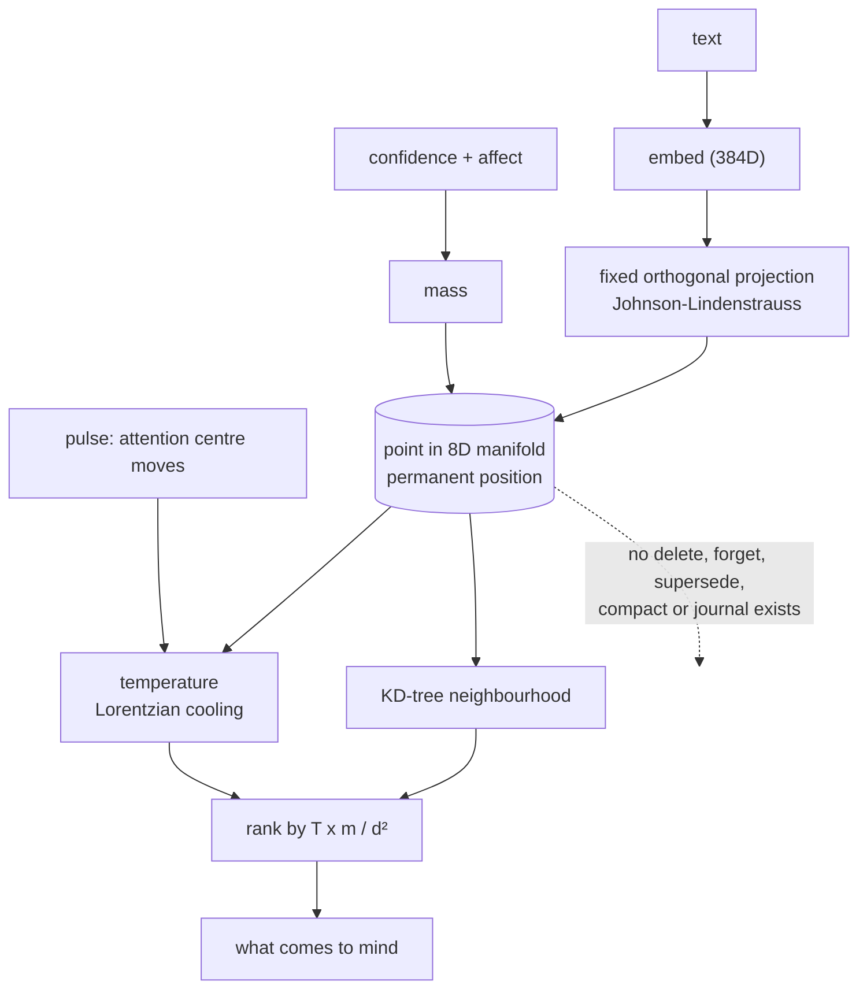

## 1. Executive Summary

**Read the provenance first, because it changes what this report is evidence
for.** `cognitive_space.py`'s docstring ends: *"Originally developed as part of
the Helix AGI cognitive architecture."* This is the spatial engine of
[Helix AGI](../helix-agi/) — already in this atlas — extracted and published as a
standalone library under the same AGPL-3.0 and the same author. The mechanism
below is not a second independent arrival at gravity-ranked retrieval. It is the
first one, packaged for reuse.

That is disclosed rather than hidden, and the disclosure is why the extraction is
worth its own reading: a library is adopted by people who will never see the
parent, and what survived the extraction is not what survived in the parent.

**The mechanism.** Every belief and memory is embedded, then projected into a
fixed 8-dimensional manifold by a deterministic random orthogonal matrix
(Johnson–Lindenstrauss). Position is permanent because the projection is
immutable. Each point carries a **mass** from confidence and affective encoding
and a **temperature** that cools on a Lorentzian curve. Retrieval is not "the
five nearest by cosine" but what is gravitationally close to a moving attention
centre.

**The headline formula is real.** The README states `F = T × m / d²`, and
`cognitive_space.py:504` is `gravity = temperature * mass / (d * d)`. The vector
form at `:913` divides by `dist ** 3` because `direction` is an unnormalised
displacement, which is the same law written for a vector. Both check out; a
README equation that survives contact with the code is not the norm in this
corpus.

**The design idea worth naming is that recency is a force rather than a filter.**
The docstring says it: *"No artificial limits. Recency = gravity, not
exclusion."* A cold memory is not cut off by a threshold or a TTL; it is
outweighed, and enough mass can still bring it back. Most decay designs in this
atlas reach for a cutoff.

**No capability marks, and the reason is one absence rather than seven.** There
is no delete, forget, remove, purge, supersede or compact anywhere in the
package — `grep` finds none of them — and no journal. `add_belief`, `add_memory`,
`store` and `pulse` are the write surface; `query`, `get_context` and `get_stats`
are the read surface. **A point that enters the manifold is permanent.** That is
offered as *"a drop-in RAG replacement"*, and a store you cannot delete from is
not a drop-in replacement for one you can.

There are also **no tests** — no test directory, no test file, nothing — behind
one commit.

## 2. Mental Model

A thought is a position. Storing something computes its permanent address and
gives it a starting mass and heat. Thinking moves an attention centre through the
manifold; whatever is hot, heavy and near rises. Time cools everything that is
not touched.

The state machine is one state wide, and drawing it honestly is the point.

## 3. Architecture

A Python package, ~4,300 lines, three runtime dependencies — `numpy`, `scipy`,
`sentence-transformers` — declared with floating ranges and no lockfile.
`spatial_memory/core/` holds the manifold (1,533 lines), the dual-field mind
(735) and a thin API wrapper (412). `context/` holds a concept extractor and a
preconscious assembler. `hooks/` holds a co-occurrence hook. `providers/` holds
the pluggable embedding and storage backends.

Nothing runs on its own; the caller drives `pulse`.

## 4. Essential Implementation Paths

- **Project.** `CognitiveProjection` maps embedding_dim → 8D through a fixed
  random orthogonal matrix, deterministic across runs so a position is stable.
- **Register.** `CognitiveSpace` holds positions and a KD-tree index;
  `GravityField` splats mass onto a 512-anchor grid and computes potential.
- **Rank.** `query_neighborhood` takes the KD-tree neighbours of the attention
  centre and orders them by `temperature * mass / d²`.
- **Move.** `SpatialMind.pulse` advances the attention centre with inertia (γ)
  toward an identity centre (x*), re-heating what it passes.
- **Persist.** `save_state` / `load_state` write the manifold; beliefs live in
  JSON files or a chosen backend.

## 5. Memory Data Model

A point is an id, an 8D position, a mass and a temperature, plus whatever
metadata the caller passes through `**metadata`. There is no schema beyond that:
no status field, no validity time, no provenance, no scope key, no supersession
pointer.

Confidence exists and feeds mass — so belief strength is a **ranking weight**,
which is precisely the collapse the atlas's rubric separates from a trust state.
A point the system is unsure about is lighter, not withheld.

## 6. Retrieval Mechanics

KD-tree neighbours of the attention centre, ranked by the gravity law. Two
properties follow from choosing a force over a filter, and they are the honest
tradeoff.

In favour: nothing is unreachable. There is no `k` cutoff below which a memory
stops existing, so a cold, distant point with enough mass can still surface —
the failure mode of a TTL or a top-k floor is absent by construction.

Against: nothing is unreachable. Without a status, a withdrawn or wrong value has
no representation that could keep it down; the only way to lower something is to
make it lighter or colder, and both are recoverable by re-mention. The mechanism
that makes recall generous is the mechanism that makes correction impossible.

## 7. Write Mechanics

`store()` embeds, projects and registers. That is all. Nothing dedups against an
existing point, nothing compares an incoming claim with a stored one, and nothing
consults anything before writing. Storing the same fact twice yields two points,
both with mass.

There is no write path that can fail on the content, which is the other half of
why no capability mark lands here.

## 8. Agent Integration

`SpatialMemory.store / query / get_context`, offered as a substitute for a
cosine-similarity retriever. `get_context(trigger_text)` returns an assembled
string, and `preconscious.py` is the assembler. A co-occurrence hook records
which concepts appear together.

## 9. Reliability, Safety, and Trust

The absence of deletion is the dominant fact and it compounds with the licence
and the pitch. AGPL-3.0 is a deliberate, restrictive choice; "drop-in RAG
replacement" invites adoption into an existing pipeline; and a pipeline that had
a delete now does not. Anything with a retention obligation, a
right-to-erasure path, or a user who says *"forget that"* cannot be served by
this package as written, and nothing in the README says so.

There is no audit record of any kind. The parent system has an append-only
journal that this atlas's [Helix AGI](../helix-agi/) report criticises for being
the one store no delete path writes to; the extraction dropped the journal and
the delete paths together, so the criticism does not transfer — it is replaced by
a simpler one.

**The committed audits are self-documentation and earn nothing.** `docs/` holds
three line-by-line technical audits totalling 709 lines, and they are careful
about the code. They are also written by the project about itself, which the
[rubric](../../methodology/atlas-rubric/) declines as evidence, and their file
links point at `file:///home/nemo/AI_Spatial_Memory/…` — the author's local
filesystem, resolving for no reader. A document whose every citation is a dead
local path cannot be checked by the audience it was written for.

## 10. Tests, Evals, and Benchmarks

**There are none.** No test directory, no test file, no eval, no benchmark, no
committed measurement, and no paper. The "drop-in RAG replacement" claim — a
comparative claim about retrieval quality against cosine similarity — has nothing
behind it in this tree.

That is the gap that matters most here, because the design's whole argument is
that gravitational ranking beats cosine ranking on what a system should surface.
It is a testable claim. The parent system ships committed per-run benchmark
artifacts; the extraction shipped none.

## 11. For Your Own Build

### Steal

- **Make recency a force, not a filter.** *"No artificial limits. Recency =
  gravity, not exclusion"* is a real design position: a decayed memory is
  outweighed rather than cut off, so nothing becomes unreachable by crossing a
  threshold. If you have a TTL or a top-k floor today, this is the alternative
  shape.
- **Give a position permanence by deriving it from an immutable projection.** A
  fixed orthogonal matrix means an id's address never moves between runs, so the
  index is reproducible without storing coordinates.
- **State the ranking law as an equation in the README and implement it
  literally.** `F = T × m / d²` is checkable in one grep, which is more than most
  retrieval descriptions in this corpus permit.

### Avoid

- **Shipping a retrieval store with no removal path.** Not as a gap to fill
  later: `store`, `add_belief` and `add_memory` have no counterpart, so the API
  has no shape for a caller to delete against, and adopters will build on that.
- **Calling it a drop-in replacement without an evaluation.** The claim is
  comparative and the tree contains nothing that compares.
- **Committing audits with `file://` links to your own machine.** The document is
  the artifact a reader is meant to check the code against, and none of its
  citations resolve.

### Fit

Take the *idea* — gravitational ranking, permanent positions, recency as mass
rather than a cutoff — and read `cognitive_space.py`, which is legible and worth
the hour. It is the clearest statement of the mechanism in either repository.

Do not take the package as a RAG replacement in anything that stores user
content. There is no delete, no scope key, no status, no test, and one commit; the
first of those is unrecoverable at the API level rather than a missing feature.
If you want this mechanism inside a system that has the rest of the machinery,
the parent — [Helix AGI](../helix-agi/) — is where it runs, with its own
documented deletion gaps to weigh.

## 12. Open Questions

- What does the extraction intend about deletion? The parent has delete paths
  that reach two runtime indexes; the library has none at all, and it is not
  stated whether that is a simplification or an omission.
- Is there a measurement anywhere of gravitational ranking against cosine on the
  same corpus? The claim is the product's whole premise.
- Positions are permanent because the projection is immutable. What happens when
  the embedding model changes — is the manifold rebuilt, and do old and new
  positions remain comparable?
- Mass comes from confidence and affect. What writes affect in a library with no
  affect engine attached, and what is mass when a caller supplies neither?
- 8 dimensions is stated but not argued. What breaks at 4, and what is gained at
  16?

## Appendix: File Index

**Core**
- `spatial_memory/core/cognitive_space.py` — the projection, the manifold, the
  gravity field, the KD-tree index, the interaction engine (1,533 lines)
- `spatial_memory/core/spatial_mind.py` — dual fields, attention centre, inertia,
  identity centre, `save_state`/`load_state` (735)
- `spatial_memory/core/physics_engine.py` — `step_pulse`, `query_neighborhood`,
  `embed_and_project` (412)

**Context**
- `spatial_memory/context/preconscious.py` — context assembly
- `spatial_memory/context/concept_extractor.py`

**Edges**
- `spatial_memory/hooks/co_occurrence_hook.py`
- `spatial_memory/providers/` — embedding and storage backends

**Documentation**
- `docs/audit_part1_core_engine.md`, `part2`, `part3` — 709 lines of
  self-documentation whose file links point at the author's local filesystem

## History

**2026-08-16** — [`39df03a18d202a25f4c066d662109f85128886ef`](https://github.com/munch2u-a11y/Cognitive-Spatial-Memory/commit/39df03a18d202a25f4c066d662109f85128886ef) — First reading, at the repository's single commit, dated 2026-05-23. Screened first: 0 auto-run surfaces, 0 build-time execution paths, 2 unpinned dependency surfaces with no lockfile; nothing was installed or run. No capability marks. The engine is disclosed in its own docstring as extracted from [Helix AGI](../helix-agi/), which this atlas already reports, so it is not independent evidence for gravity-ranked retrieval. The README's `F = T × m / d²` is implemented as stated at `cognitive_space.py:504`. There is no delete, forget, supersede or compact path anywhere in the package, no scope key, no status field, no audit record and no tests, behind a "drop-in RAG replacement" claim with no committed comparison. No paper.
