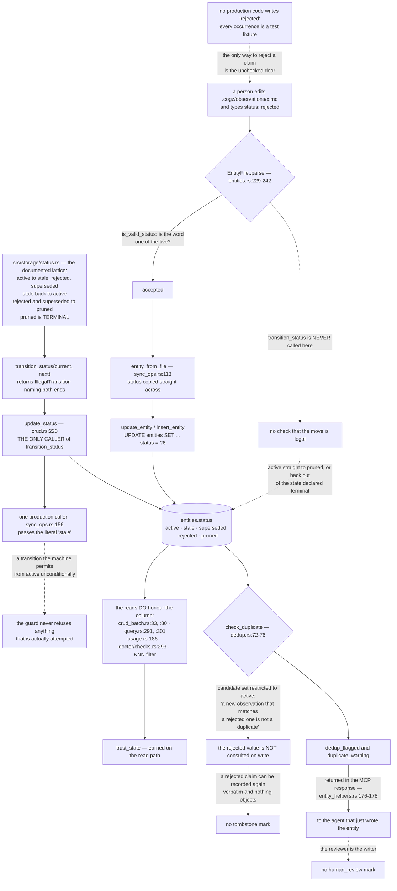

## 1. Executive Summary

CogZ is "[l]ocal-first, code-aware engineering cognition for AI coding agents" —
MIT, Rust, version 0.1.5, 31,088 lines across 145 files in `src/`, giving "a
coding agent persistent memory, contextual retrieval, and continuous cognition
about a software repository — all running locally on your machine, no cloud
services required."

**The mechanism to take away is the two doors into the status column.** CogZ
does something this corpus rewards: it writes its epistemic vocabulary down as
an enforceable machine rather than a set of strings. `src/storage/status.rs`
opens with the lattice as a diagram in its own doc comment:

> ```text
> active    → stale | rejected | superseded
> stale     → active
> rejected  → pruned
> superseded→ pruned
> pruned    → (terminal)
> ```

`transition_status` implements exactly that table and returns a typed
`StorageError::IllegalTransition` naming the attempted move. A unit test asserts
that every target out of `pruned` is an error. This is the real thing, and it is
rarer than it should be.

**The question a state machine has to answer is which writes go through it.**
`transition_status` has exactly one caller in the whole tree: `update_status`
(`src/storage/crud.rs:220`), whose own doc comment describes it as the
"[u]pdate only the status field (frontmatter-only change)" path that "[v]alidates
the transition through the state machine." `update_status` in turn has exactly
one production caller — `mark_deleted_as_stale` at
`src/files/sync_ops.rs:156` — which passes the literal `"stale"`, guarding a
transition the machine allows from `active` in every case.

Every other write of a status goes around it. The canonical record in CogZ is
the markdown file, and `EntityFile::parse` reads the frontmatter's `status:`
value and validates it — but against membership, not motion:

> "invalid status '{}': must be one of active, stale, superseded, rejected,
> pruned"

That check is `is_valid_status`, a lookup in `VALID_STATUSES`. The parsed value
is copied into an `Entity` at `src/files/sync_ops.rs:113` and handed to
`insert_entity` or `update_entity`, and `update_entity` writes `status = ?6`
alongside title and content with no reference to the lattice. Editing a file can
therefore move an entity from `active` directly to `pruned`, or lift one back
out of the state the machine documents as terminal. The rule is spelled out
correctly in the module that owns it and is not consulted on the path the
product actually routes a person down.

**The `rejected` value shows the gap at full width.** Searching the tree for a
production write of `"rejected"` returns nothing: every occurrence is in a test
fixture or in the transition table itself. The status exists, the events
vocabulary reserves `observation_rejected` for it, the prune path treats
`rejected` as one of the two states eligible for tombstoning — and no shipped
surface, CLI or MCP, ever sets it. The only way to reject a claim is to open the
markdown and type the word, through the door that does not check.

**What happens next is the part worth copying, in the negative.** Having a
rejected verdict is useful only if something consults it later. CogZ's
deduplication explicitly declines to, and says so:

> "Only compare against active entities. Stale, rejected, superseded, and
> pruned entities should not trigger duplicate warnings — a new observation
> that matches a rejected one is not a duplicate."

That is a coherent position about *warnings* — you do not want a resurfacing
claim flagged as redundant with a corpse. But it is also the exact inverse of a
tombstone, and it is the reason this report withholds that mark. The rejected
value is keyed to a row, not to its content, and no write path consults it, so a
claim a person threw out can be recorded again verbatim and nothing in the
system registers that it has been here before. The judgement is not retained
where a judgement has to live: on the next attempt to write the same thing.

**The event log, by contrast, keeps more than it needs to.** `events` is
append-only in the strict sense — `record_event` holds the only INSERT, and no
DELETE against the table exists anywhere in the tree — and the edit events carry
the prior text in their payload as `old_content`. That makes it a genuine
mutation record rather than a notification stream. It also means the cascade
delete has a seam: when a pruned tombstone exceeds its retention limit,
`delete_entity_cascade` runs `UPDATE events SET entity_id = NULL` to satisfy the
foreign key and then deletes the entity, so the event row survives with its
`old_content` intact and its link to the entity erased. The body text outlives
the deletion; only the label saying whose it was goes away.

## 2. Mental Model

CogZ is a filesystem-of-record with a disposable index, and almost every
question about it resolves by asking which of the two is being written.

The markdown files under `.cogz/` are canonical. The SQLite database is a
projection that `cogz reset` throws away and rebuilds. This is a good split, and
CogZ is disciplined about it in the places where it matters most: the usage
tables are annotated as "[d]erived state ... disposable and rebuilt from agent
activity, never from canonical files," and the code entities derived from source
are kept separate from the file-backed ones.

The trouble is that validation lives on the projection side while authorship
lives on the canonical side. The state machine is a storage-layer function; the
person edits a file. Between them sits a parser that checks spelling and a
generic upsert that checks nothing.



## 3. Architecture

| Area | Role |
| --- | --- |
| `src/files/` | The canonical layer: markdown with YAML frontmatter, parsed into `EntityFile`, synced into SQLite |
| `src/storage/` | SQLite schema, migrations, CRUD, the status state machine, embeddings, and the events and usage tables |
| `src/search/` | Hybrid FTS5 and vector retrieval with graph expansion over the edges table |
| `src/context/` | Context-pack assembly: ranking, compression, and token budgeting |
| `src/consolidate/` | Deduplication, contradiction detection, observation-to-rule promotion, and duplicate merging |
| `src/mcp/` | Thirteen MCP tools over stdio — the agent's surface |
| `src/hooks/` | Lifecycle events from an agent harness, which drive delivery tracking and hit detection |
| `src/doctor/` | Integrity checks, the prune path, and the dead-weight report |

## 4. Essential Implementation Paths

- `src/storage/status.rs:16-38` — `transition_status`, the lattice in code.
- `src/storage/crud.rs:220-243` — `update_status`, the only caller of the above.
- `src/files/sync_ops.rs:156` — the only production call to `update_status`, passing `"stale"`.
- `src/files/entities.rs:229-242` — frontmatter status parsed and checked for membership only.
- `src/files/sync_ops.rs:113` — the file's status copied into the `Entity` bound for an unguarded upsert.
- `src/storage/crud.rs:193-210` — `update_entity`, writing `status = ?6` with no transition check.
- `src/storage/events.rs:78-90` — `record_event`, the single INSERT into the event log.
- `src/files/events.rs:33-47` — the edit event that carries `old_content`.
- `src/storage/crud_batch.rs:154-162` — the cascade delete that nulls `entity_id` and keeps the payload.
- `src/consolidate/dedup.rs:72-76` — the candidate set restricted to `active`, with its rationale.

## 5. Memory Data Model

An entity is a markdown file with frontmatter carrying `id`, `title`, `type`,
`status`, `created_at`, `updated_at` and `references`; anything else in the
frontmatter is folded into a JSON `properties` column. Three file-backed types
exist — observation, rule, knowledge — alongside code entities (function, class,
file, module) derived from the source tree and managed by the index layer rather
than by files.

The SQLite mirror adds `content_hash` for change detection and the `status`
column this report is largely about. Edges live in their own table; an FTS5
external-content table is kept in sync by insert, delete and update triggers.
Time is single-axis: `created_at` and `updated_at` are write-time stamps, with
no separate field for when a claim was true as distinct from when it was
recorded, so no bitemporal mark applies.

There is no scope key. Separation is one database per repository checkout, which
is a reasonable choice for a local-first tool and is not a stored predicate any
read path enforces, so no scope mark applies either.

## 6. Retrieval Mechanics

Retrieval is hybrid: FTS5 lexical search and vector KNN, combined and then
expanded across the graph. Status filtering runs at every layer — the batch
fetch and the count queries append `status = 'active'`, the usage and doctor
sweeps exclude `status != 'pruned'`, and `src/storage/embeddings.rs:261`
excludes by status before candidates "consume KNN slots," which is the right
place for it: filtering after the nearest-neighbour cut would silently shrink
the result set rather than fill it with live rows.

The general entity query is the one to look at, because its base SQL carries no
status clause at all — `SELECT … FROM entities WHERE 1=1`
(`src/storage/query.rs:35`), with the predicate appended only `if let Some(st) =
filter.status` (`:42-45`). What keeps that from being a hole is that the
omission is unreachable from the two places a caller arrives: `EntityFilter`
implements `Default` with `status: Some("active")` (`:17-21`), and the MCP path
resolves the request field through a documented rule before building the filter
— `None` becomes `"active"`, the literal `"all"` becomes no filter, anything
else is matched literally (`src/mcp/helpers.rs:189-202`), with the same rule
mirrored in `search::resolve_status_filter`. So widening is a word a caller has
to write, and forgetting the field narrows rather than widens. That is the
shape this atlas keeps asking for, and it is worth noting that it is carried by
a default and a resolver rather than by the query itself.

`graph_retrieve` takes the status filter as an explicit parameter, and
`respects_status_filter` is the test that pins it. Context assembly then ranks,
applies MMR for diversity, and compresses to a token budget.

## 7. Write Mechanics

Two checks run on every insert. Title matching compares against existing
entities — case-insensitively, then fuzzily — and embedding similarity flags a
duplicate above a configured cosine threshold. Both degrade gracefully: without
an embedding model only the title check runs.

The candidate set for both is capped, and the code says so honestly:
`get_entities_by_type(conn, entity_type, Some("active"), 100)`, with a warning
logged when the set hits the cap noting that "duplicates of older {entity_type}
entities may be missed." That is a real scale limit stated plainly rather than
hidden, and it belongs in any assessment of how much the dedup layer can be
relied on.

A secret scanner runs before the write and refuses it on a match, with the
preview truncated to four characters so the refusal message does not itself leak
the credential — a small detail done correctly.

Consolidation runs deferred: supported observations are promoted to rules,
confirmed duplicates merged with the loser marked `superseded` and carrying a
`superseded_by` frontmatter field that graph expansion follows to reach the
survivor. Knowledge is "flagged, not auto-merged (human-curated)," and rules are
"surfaced for review, not auto-merged."

## 8. Agent Integration

Thirteen MCP tools cover recording observations, creating rules and knowledge,
querying each type, search, context assembly, status, listing, consolidation and
event capture. Lifecycle hooks are the other half: `session_start` and
`prompt_submit` print a context pack for injection, `file_save` triggers a
single-file reindex, `session_end` runs consolidation.

`post_tool_use` is where the usage loop closes. `detect_touched_entities`
compares the tool's file path and result against what a pending delivery
surfaced, and `record_hits` marks those rows `hit`. The comment there records a
lesson worth repeating:

> "We no longer auto-create observation files for every tool use — that flooded
> `.cogz/observations/` with low-value entries. The agent decides what's salient
> via the `record_observation` MCP tool."

## 9. Reliability, Safety, and Trust

The event log is the strongest instrument. It is append-only with a single
writer, scoped deliberately to domain mutations rather than indexing operations,
and its edit rows carry pre-images. The qualification is the cascade delete,
which preserves the payload and nulls the entity link, so the retention limit
that removes a pruned tombstone does not remove the text that tombstone was
hiding.

The usage instrumentation is the most interesting thing CogZ builds and the most
under-used. `deliveries` records each batch shown to the agent; `entity_usage`
records `pending`, `hit` or `miss` per entity, with misses assigned at the next
delivery boundary. This is the measurement most memory systems in this corpus
never take — whether the context they assembled was looked at. But no ranking
path reads it. The signal terminates in the doctor's dead-weight report, which
lists entities never delivered since a timestamp. The loop is instrumented and
not closed, which is a defensible early-stage choice and worth knowing before
assuming the system learns from delivery outcomes.

The dedup and contradiction flags do not reach a person. They are returned in
the MCP tool response at `src/mcp/entity_helpers.rs:176-178` to the agent that
performed the write, so the entity that judges the duplicate is the entity that
created it. No human_review mark follows: the test is on the approver, and here
the approver is the writer.

## 10. Tests, Evals, and Benchmarks

Tests live beside the code as `#[cfg(test)]` modules and dedicated `*_tests.rs`
files. `respects_status_filter` is the retrieval-level negative test described
above, with its positive control. The status module tests the transition table
directly, including that every move out of `pruned` fails. `fresh_db_has_all_tables`
checks the migration chain end to end.

What is missing is a test that the frontmatter path respects the lattice —
which is unsurprising, because it does not. The state machine's tests assert the
function behaves; nothing asserts that the function is the only way in.

## 11. For Your Own Build

The status lattice is worth copying, and so is the lesson about where to put it.
A transition table in a storage module is a description of intent; it becomes an
invariant only when every write path is routed through it. If your canonical
representation is a file a person edits, the parser is the enforcement point,
and `is_valid_status` is the wrong check there — the right one takes the current
value as well as the new one.

The KNN status filter placement is a detail worth stealing outright: exclude by
status before the nearest-neighbour cut, not after, so a filtered result set
does not silently shrink.

The delivery and usage tables are the cheapest honest instrument here. Recording
`hit`, `miss` and `pending` per delivered entity costs two small tables and
answers the question most memory systems cannot: was any of this read? Build it
early, even if nothing consumes it yet.

And the dedup cap warning is a model for how to state a limit. The code does not
pretend the comparison is exhaustive; it logs that duplicates of older entities
may be missed when the candidate set saturates.

## 12. Open Questions

- Should the frontmatter parser call `transition_status` against the current
  database value? That would make the lattice binding on the path people use, at
  the cost of rejecting hand-edits the parser currently accepts.
- What surface is intended to write `rejected`? The status, its event type and
  its prune eligibility are all built; only the producer is missing.
- Once a claim is rejected, should a later identical write be told? The current
  rationale for excluding rejected rows from dedup is sound for duplicate
  *warnings*, but it leaves no mechanism that notices a rejected claim returning.
- Will the usage outcomes feed ranking? The data is being collected in a shape
  that would support it.

## Appendix: File Index

| Path | What lives there |
| --- | --- |
| `src/storage/status.rs` | The transition table, `VALID_STATUSES`, and their tests |
| `src/storage/crud.rs` | Entity insert, update, `update_status`, and counts |
| `src/storage/crud_batch.rs` | Batch fetch and update, tombstoning, cascade delete |
| `src/storage/events.rs` | `EventType`, `record_event`, and event queries |
| `src/storage/usage.rs` | Deliveries, hits, misses, and the dead-weight query |
| `src/storage/schema.rs` | Tables, indexes, FTS5 triggers, and the migration chain |
| `src/files/entities.rs` | Frontmatter parsing and the `is_valid_status` check |
| `src/files/sync_ops.rs` | File-to-row sync and `mark_deleted_as_stale` |
| `src/consolidate/dedup.rs` | Title and embedding duplicate detection |
| `src/consolidate/merge.rs` | Superseded marking via canonical frontmatter |
| `src/search/graph_retrieval_tests.rs` | `respects_status_filter` and its positive control |
| `src/mcp/entity_helpers.rs` | The write path that returns dedup flags to the agent |

## History

**2026-09-19** — [`6d664c869e503b942f7728e108cd680cda84c936`](https://github.com/balaianu/CogZ/commit/6d664c869e503b942f7728e108cd680cda84c936) — `trust_state` re-tested against the narrowed line, and the record's universal claim — that every retrieval surface filters on the status — was worth pulling on. The hard-coded clauses are all still there and the anchors are re-mapped: the count queries at `src/storage/query.rs:291`, `:301` and a third at `:311`, the batch fetch at `src/storage/crud_batch.rs:33` and `:80`, the usage sweep now at `src/storage/usage.rs:276` and the doctor check at `src/doctor/checks.rs:301`, with a new one in `src/doctor/checks_analysis.rs:16`. But the general entity query has no clause in its base SQL — `WHERE 1=1` at `:35`, with the predicate appended only when the caller supplies one. The omission is unreachable rather than absent: `EntityFilter::default()` sets `status: Some("active")` (`:17-21`), and the MCP path resolves the request field first — missing becomes active, the literal `all` becomes no filter, anything else matches literally (`src/mcp/helpers.rs:189-202`), mirrored in `search::resolve_status_filter`. So the accurate statement is not that every query carries the predicate but that widening takes a word a caller has to write, and forgetting the field narrows. The record and section 6 now say that. Screened again first; nothing was installed and no suite was run.

**2026-09-16** — [`6d664c869e503b942f7728e108cd680cda84c936`](https://github.com/balaianu/CogZ/commit/6d664c869e503b942f7728e108cd680cda84c936) — first reading, at a commit dated 16 September 2026. Screened before opening, from a shallow clone: three files scanned, no auto-run surface, no build-time execution point and no unpinned dependency surface, with two dependency files inside the seven-day cooldown and `Cargo.lock` present. `AGENTS.md` is addressed to a reading agent and was recorded as data. Nothing was installed, built or run.
