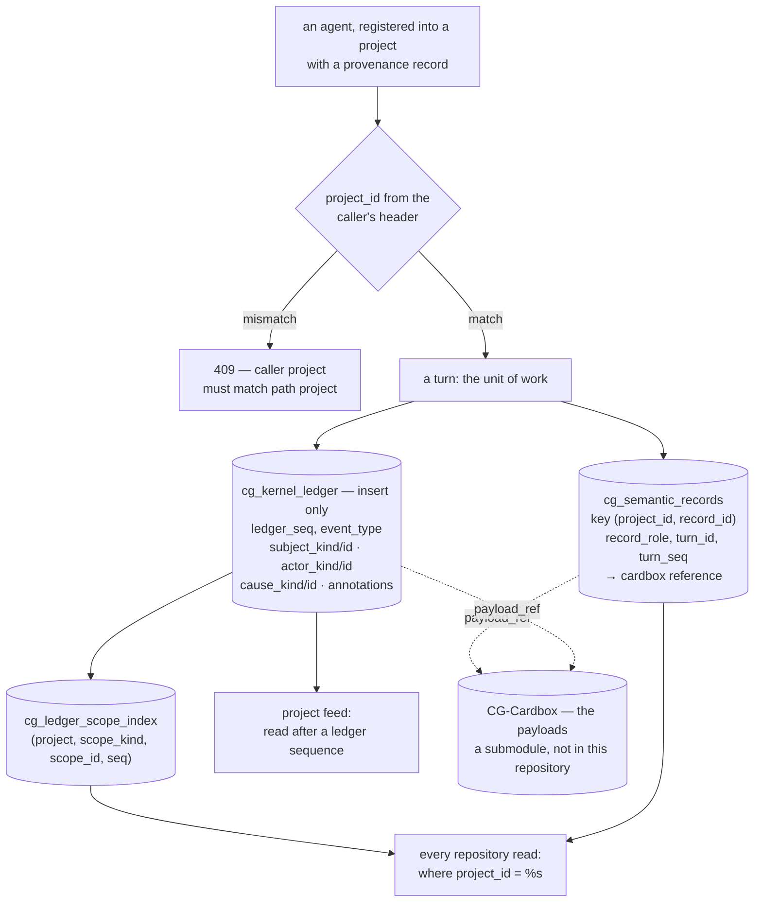

## 1. Executive Summary

CommonGround Kernel is not trying to be a memory that answers questions. It is
trying to be the substrate several independent agents can cooperate over without
one of them owning the state — what the README calls *"a small **constitutional
ledger kernel**: it defines the minimum public facts, work boundaries, semantic
ownership, and causal relationships needed for independent participants to
cooperate without being absorbed into one central runtime."*

Apache-2.0; 20 commits between 15 February and 20 May 2026 from eight authors,
and nothing since; version `v3r1-preview`; 41,006 lines of Python on 3.13+ over
PostgreSQL. The screen found one auto-run surface, one build-time execution path
in a pytest conftest, a `uv.lock` unchanged for 113 days, and an `AGENTS.md`
treated as data; nothing was installed or run.

**The ledger is the mark, and the causal columns are why.** `cg_kernel_ledger`
carries a monotonic `ledger_seq`, the project, an `event_type`, a
`subject_kind`/`subject_id`, an `actor_kind`/`actor_id`, and — the part most
audit tables omit — a nullable `cause_kind`/`cause_id`. So a row records not
only that something happened to a subject and who did it, but what event caused
it. Two statements in the repository layer write the table and both are inserts;
nothing updates or deletes it. A companion `cg_ledger_scope_index` on
`(project_id, scope_kind, scope_id, ledger_seq)` gives a second way in.

**The project key is a primary key, not a filter to remember.** `project_id`
arrives on a request header and is applied as a predicate on every read — there
are twenty-six `where project_id = %s` clauses in the repository layer — but the
stronger property is in the schema: `cg_semantic_records` is keyed
`(project_id, record_id)`, the scope index is keyed with the project first, and
the foreign keys are composite, so a row referencing a parent in another project
is not something a bug can produce. A test drives the boundary end to end: one
project's admin service registering an agent into another project is refused
with `caller project must match path project`, and the agent is then asserted
absent from the target project's topology.

**It deliberately offers no retrieval by meaning.** No embedding, no vector
column, no full-text index, not even an `ilike`. Reading is by identity or by
sequence — fetch a subject, page a feed after a ledger sequence, walk a scope.
For a kernel whose stated job is the minimum public facts, that is a coherent
choice and it is also the thing an adopter must supply themselves.

**The content is not in this repository.** Every ledger row and every semantic
record points at a `cardbox_project_id`/`cardbox_id` pair, and CG-Cardbox is a
git submodule that is not checked in with the parent. So the thing the ledger
indexes — the actual payloads, and with them every question about retention,
correction and deletion of content — sits in a repository this reading did not
have. What is here is the index and the rules; the store is elsewhere.

## 2. Mental Model

Several agents, possibly built by different people on different runtimes, work
on one project. None of them owns the truth. The kernel's job is to hold the
minimum set of facts they all need in order to hand work to each other: who is
registered, what turn is in flight, what was produced, what caused what.

A turn is the unit of work. It produces semantic records — keyed to the turn and
a sequence within it, each with a `record_role` saying what kind of contribution
it is — and it produces ledger events. The records are the *what*; the ledger is
the *history of what*, with an actor and a cause on every line.

Nothing is edited. A correction is a later record with a later sequence, and a
revoked credential is a status change rather than a deletion. The ledger has no
update path at all, which is what lets a participant that has been away rebuild
its picture by replaying from a sequence number.

What the kernel deliberately does not do is interpret. There is no summariser,
no consolidation, no decay, and no search. A participant that wants recall by
meaning builds it over the feed. The design's bet is that agreeing on the facts
is the hard part and that interpretation should stay at the edges — *"Independent
agents at the edges. Durable public work records at the kernel."*



## 3. Architecture

A Python package with a clean separation the code actually keeps. `kernel/`
holds the four small modules that are the design — `ledger.py`, `lifecycle.py`,
`semantic.py`, `topology.py`. `contracts/` holds the ports and the value types:
`TruthRepositoryPort`, `CardBoxPort`, `ClaimToken`, `ConflictError`,
`SemanticRecordSpec`, `TraceContext`. `infra/` holds the Postgres schema and the
repositories that implement those ports. `service/` is the HTTP surface with its
auth, and `sdk/`, `agent_client/` and `projection_client/` are the client sides.

The kernel classes take ports rather than a database — `SemanticKernel(truth:
TruthRepositoryPort, cardbox: CardBoxPort)` — so the domain logic is testable
without Postgres and the payload store is swappable by construction. That is a
hexagonal shape, and it is followed rather than declared.

Operationally: PostgreSQL, Python 3.13, an HTTP service, a CLI for project and
agent provisioning, and an `Integrations` directory. There is no worker, no
queue and no scheduler, which is consistent with a kernel that does not
interpret.

**CG-Cardbox is a submodule.** `.gitmodules` declares one entry pointing at
`Intelligent-Internet/CG-Cardbox`, and the directory is empty in a clone without
`--recursive`. This report is therefore about the kernel: the ledger, the
records, the scoping and the API. The payload store, and everything about how
content is stored, corrected or removed, is in a repository that was not read.

## 4. Essential Implementation Paths

- **Authenticate and scope.** `service/auth.py:32` reads `project_id` from the
  configured agent-project header; every repository read then narrows on it —
  twenty-six `where project_id = %s` clauses in `infra/repositories.py`.
- **Register.** `agent_registration.py` with a provenance kind and external
  reference; the service refuses a caller whose project does not match the path
  project with a 409.
- **Record.** `SemanticKernel` writes a `cg_semantic_records` row keyed
  `(project_id, record_id)` with a `record_role`, a `turn_id` and a `turn_seq`,
  and a Cardbox reference, under a unique constraint on
  `(project_id, turn_id, turn_seq)`.
- **Append.** `kernel/ledger.py` → `infra/repositories.py:1604` and `:1656`,
  both `insert into cg_kernel_ledger (...)`, with the actor, subject and cause
  columns filled from the operation's metadata.
- **Index by scope.** `cg_ledger_scope_index` takes a row per
  `(project_id, scope_kind, scope_id, ledger_seq)`, so a scope's events are a
  range scan rather than a filter over the whole ledger.
- **Replay.** the CLI's `project feed --after-ledger-seq N` and the projection
  client page events after a sequence, which is how a participant that has been
  away rebuilds its view.

## 5. Memory Data Model

**The ledger event.** `ledger_seq` is `bigint generated always as identity` —
monotonic and assigned by the database rather than by the writer. Then
`project_id`, `event_type`, `subject_kind` and `subject_id`, `actor_kind` and
`actor_id`, a nullable `cause_kind` and `cause_id`, `created_at`, a nullable
free-text `note`, a `jsonb annotations` that is `not null`, and
`payload_ref_project_id`/`payload_ref_cardbox_id`.

The actor and cause columns are what raise this above a change log. Most audit
tables record a subject and a timestamp; recording the actor makes attribution
possible, and recording the cause makes a chain reconstructable — this event
happened *because* that one did. A reader asking why a turn was spawned has a
column to follow rather than a timestamp to guess from.

**The semantic record.** `(project_id, record_id)` as the primary key,
`turn_id`, `turn_seq`, `record_role`, and the Cardbox pair, with
`unique (project_id, turn_id, turn_seq)` so a turn's contributions are ordered
and cannot collide. A partial unique index enforces one
`provision_launch_started` record per turn — a single-flight guarantee expressed
in the schema rather than in code.

**What is absent from both.** No confidence, no verification state, no validity
interval. The only status in the schema is on `cg_agent_credentials`, checked to
`active` or `revoked`, which is an authentication state rather than a claim
about whether a stored fact is true. `trust_state` and `bitemporal` are withheld
on that.

**And no content.** Both tables reference Cardbox rather than holding the
payload. The kernel is an index over a store it does not contain.

## 6. Retrieval Mechanics

There is no retrieval by meaning, and the absence is total: a search of the
package for `embedding`, `vector`, `tsvector`, `ilike` and full-text returns
nothing. This report's retrieval arms are empty for that reason.

What exists is address and order. A subject is fetched by its keys. A project
feed is paged after a ledger sequence — the CLI exposes `--after-ledger-seq`
with a default of 0 — which is the replay primitive. A scope's events come
through `cg_ledger_scope_index` as a range over `(project_id, scope_kind,
scope_id, ledger_seq)`.

For a ledger that is the correct design. A participant needing to answer *what
do we know about X* builds a projection over the feed, which is what
`projection_client/` is for. It does mean that adopting CommonGround as an
agent's memory means adopting a substrate and writing the recall layer, not
installing a memory.

## 7. Write Mechanics

Writes go through the `v3r1` HTTP API, authenticated per agent with credentials
carrying an `active`/`revoked` status. The path project and the caller's project
must agree, which is checked before anything is written.

The kernel's contracts carry a `ClaimToken` and a `ConflictError`, which is
optimistic concurrency: a writer holds a token, and a conflicting write is
refused rather than silently ordered. Combined with the unique constraints on
`(project_id, turn_id, turn_seq)` and the partial index for provision-launch,
the concurrency story is expressed at the schema boundary rather than in
application locking.

Ledger writes are inserts, and only inserts. The sequence is database-assigned,
so two concurrent writers cannot produce the same ordering claim. Nothing in the
tree updates or deletes a ledger row.

Because the payload lives in Cardbox, a write here is a fact plus a reference.
That split is what makes the ledger cheap and it also means the durability
argument the README makes — *"durable public work records"* — is only as strong
as the store this repository does not contain.

## 8. Agent Integration

An HTTP API at `/v3r1` with an SDK and two clients: `agent_client` for
participating and `projection_client` for building read models over the feed.
The CLI covers provisioning — creating a project, registering agents, issuing
credentials, reading the feed — and `provision_launch.py` and `provision_roles.py`
handle the bootstrap.

Registration is where the design's care shows. An agent is registered with a
provenance record naming the kind and an external reference, and a test asserts
that the authority which created the project does *not* appear in the kernel's
snapshot or public metadata — `assert "creator" not in
str(snapshot.public_metadata).lower()` beside three assertions that the
registration provenance fields are `None`. Keeping the creator out of the public
substrate is a deliberate constitutional choice, and it is tested.

There is no MCP surface, no harness plugin and no hook. This is infrastructure
several agent runtimes talk to, not something dropped into one.

## 9. Reliability, Safety, and Trust

**Scope — awarded, and it is structural.** The project key is applied on every
repository read, and more importantly it is part of every composite primary key
and every composite foreign key, so a cross-project reference is not a bug that
can be written. The 409 on a mismatched caller is tested end to end, with the
agent then asserted absent from the target project.

**Audit log — awarded, on the causal columns.** An append-only table with a
database-assigned sequence, an actor, a subject and the cause of the event, plus
a scope index and JSONB annotations. Two insert statements, no update and no
delete. This is the shape an audit needs to answer *why*, which most do not.

**Trust state — withheld.** The only status in the schema is on agent
credentials — `active` or `revoked` — which gates authentication rather than
whether a stored fact may be treated as true. No semantic record or ledger event
carries a verification state.

**Tombstone — withheld.** Nothing records a rejected value. A correction is a
later record with a later turn sequence, which is supersession by ordering, and
supersession is explicitly not this mark.

**Bitemporal — withheld.** `created_at` on the ledger and the records, both
record time.

**Human review — withheld.** No surface adjudicates content. The admission
machinery — registration, provenance, credentials — governs *participants*, not
memories.

**Negative evaluation — withheld, with the near miss named.**
`test_other_project_admin_service_cannot_register_into_this_project` is the
right instinct: it drives a cross-project attempt through the API, asserts the
409 and its message, then asserts the agent is absent from the target project's
topology. But that asserts a *write was refused*, not that stored material was
excluded from a populated read. Nothing in the suite seeds two projects' events
and asserts that a feed read for one returns its own and not the other's — which,
given the scope index and the twenty-six predicates, would be a short test and
would convert a structural argument into an observed one.

**The limit that matters more than any mark.** The payload store is a submodule
that is not in this repository. Every question about how content is retained,
corrected or deleted — the questions this atlas exists to ask — has its answer
in CG-Cardbox. What can be said from here is that the kernel's own records are
append-only and scoped, and that is what is claimed above.

## 10. Tests, Evals, and Benchmarks

Fifty-one test files, with support modules for auth and projections, covering
the admin service, project bootstrap, agent credentials, the admission API,
projection feeds and agents, the CLI, and package resources. The suite runs
against a real Postgres — `test_pg_dsn` is a fixture — so the schema constraints
are exercised rather than mocked.

Two tests are worth naming for what they choose to assert.
`test_other_project_admin_service_cannot_register_into_this_project` drives the
boundary through the HTTP API and checks the aftermath, not just the status
code. And `test_creator_authority_does_not_enter_kernel_snapshot_or_metadata`
asserts an absence about the kernel's *own* public surface — that the party who
created a project leaves no trace in the substrate — which is a constitutional
property rather than a functional one, and an unusual thing to test.

No benchmark, and none claimed. No paper: a search of the README and docs for
`arxiv`, `bibtex`, `@article`, `@misc`, `Citation`, `CITATION.cff` and `doi`
returns nothing.

The maturity signal is the commit history rather than the test count: twenty
commits over three months, ending in May 2026, against a `v3r1-preview` label
and a `docs/en/release-notes.md` reference. This is an early cut of a
considered design, not a settled system.

## 11. For Your Own Build

### Steal

- **Put the cause on the audit row.** `cause_kind` and `cause_id` beside
  `actor_kind` and `actor_id` turn a change log into something a reader can walk
  backwards. Two nullable columns.
- **Make the scope a primary key, not a predicate.** Twenty-six `where
  project_id = %s` clauses are good discipline; `primary key (project_id,
  record_id)` and composite foreign keys mean the discipline cannot lapse.
- **Let the database assign the sequence.** `bigint generated always as
  identity` removes a whole class of concurrent-writer ordering bug that a
  writer-assigned sequence invites.
- **Express single-flight in the schema.** A partial unique index —
  `on cg_semantic_records (project_id, turn_id) where record_role =
  'provision_launch_started'` — is a guarantee application code cannot forget.
- **Test that your own authority does not leak.** Asserting the project creator
  is absent from the kernel snapshot and the public metadata is a property most
  systems would never think to check.

### Avoid

- **Splitting the facts from the payloads without saying where the payloads
  went.** The kernel is coherent and incomplete on its own: a reader evaluating
  durability, deletion or correction has to go to another repository, and the
  README does not lead with that.
- **Assuming a scoped write path implies a scoped read test.** The schema makes
  cross-project reference impossible and the suite proves the write is refused;
  nothing proves a read is filtered, which is the assertion an operator would
  want.

### Fit

CommonGround suits a team building several independent agent runtimes that must
cooperate on one project without one of them becoming the owner of state — the
problem it names is real and under-served, and the ledger's actor-and-cause
shape is the right primitive for it. It is a substrate, not a memory: there is no
recall by meaning, no interpretation layer and no consolidation, and an adopter
supplies all three over the feed. It is the wrong choice today for anyone who
wants something finished — twenty commits, four months quiet, a preview label —
and it cannot be evaluated for content durability at all without also reading
CG-Cardbox, which is where the payloads actually live.

## 12. Open Questions

- What does CG-Cardbox guarantee about retention, correction and deletion? Every
  memory question this atlas asks about content has its answer there.
- Is there a read-side test for cross-project isolation anywhere? The schema
  makes the leak structurally impossible, which may be why nobody wrote one.
- Are `cause_kind`/`cause_id` populated on every event, or only where a cause is
  obvious? A causal chain with gaps is a different tool from one without.
- Is the project dormant or paced? Twenty commits ending in May against a
  preview label reads either way.

## Appendix: File Index

| Path | Lines | What it holds |
| --- | --- | --- |
| `CommonGround/` | 41,006 | The kernel package |
| `CommonGround/kernel/` | — | `ledger.py`, `lifecycle.py`, `semantic.py`, `topology.py` — the four modules that are the design |
| `CommonGround/contracts/` | — | `TruthRepositoryPort`, `CardBoxPort`, `ClaimToken`, `ConflictError`, `SemanticRecordSpec`, `TraceContext` |
| `CommonGround/infra/postgres.py` | — | The schema: `cg_semantic_records` (79-90), `cg_kernel_ledger` (106-121), `cg_ledger_scope_index` (123-129), the partial unique index (131-133), the composite foreign keys |
| `CommonGround/infra/repositories.py` | — | Twenty-six `where project_id = %s` reads; the two ledger inserts (1604, 1656) |
| `CommonGround/service/auth.py` | — | The project header (32) |
| `CommonGround/sdk/`, `agent_client/`, `projection_client/` | — | The client sides: participate, and build read models over the feed |
| `CommonGround/cli.py` | — | Project, agent, feed and provisioning subcommands; `--after-ledger-seq` (897) |
| `tests/` | — | Fifty-one files against a real Postgres; the cross-project registration refusal (118-139) and the creator-authority absence test |
| `CG-Cardbox` | — | A submodule pointing at `Intelligent-Internet/CG-Cardbox`; empty in a non-recursive clone, and where the payloads live |

Searches behind the absence claims above, run from the repository root:

```sh
rg -n 'embedding|vector|tsvector|ilike' CommonGround --glob '!*test*'    # none: no retrieval by meaning anywhere
rg -n 'cg_kernel_ledger' CommonGround --glob '*.py' | rg -n 'update|delete'  # none: two inserts and no mutation
rg -n 'status' CommonGround/infra/postgres.py                            # one status column, on agent credentials, checked active/revoked
rg -n 'valid_from|valid_to|as_of' CommonGround                           # none: created_at only, record time
cat .gitmodules                                                          # one entry: CG-Cardbox, the payload store, not in this tree
rg -n -i 'arxiv|bibtex|@article|@misc|Citation|CITATION.cff|doi' README.md docs  # none: no paper
```

## History

**2026-09-10** — [`10b50ddb0fb4f0d5b4a58e841d6f40b52a3cbd5b`](https://github.com/Intelligent-Internet/CommonGround/commit/10b50ddb0fb4f0d5b4a58e841d6f40b52a3cbd5b) — first reading, at the head of `main`, the last commit of 20 May 2026. Screened before reading: one auto-run surface, one build-time execution path in a pytest conftest, no unpinned dependency surface, a `uv.lock` unchanged for 113 days, and an `AGENTS.md` treated as data; nothing was installed or run, and the read was made from a full clone without submodules. Two marks. The reading covered the ledger and its schema, the semantic records, the project scoping and the HTTP and CLI surfaces. CG-Cardbox — the payload store every record references — is a submodule and was not present in the checkout, so nothing here describes how content is retained, corrected or deleted; that is recorded as a limit rather than as an absence in the design.
