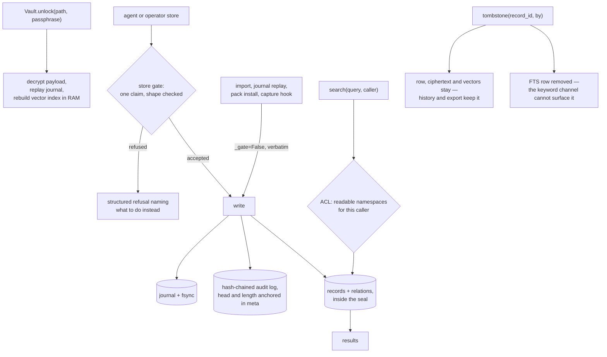

## 1. Executive Summary

Compartment is an encrypted, fully offline memory vault in one sealed `.vault`
file, with an MCP server, editor and agent plugins, a menu-bar app and a CLI over
it. Its audit chain detects truncation of its own tail, and its memory-shape rule
is a refusal in code that replaced a measured prompt. Its weak side is
correction: supersession is keyed on a record id and carries no time.

A passphrase the user sets is the only credential, and the project never
generates one. Four marks. The two findings below are both cases of a design
decision argued in the file that implements it.

**The audit chain knows what a hash chain cannot catch.** `audit.py` states the
problem and its answer in eleven lines:

> A forward-only chain cannot catch a truncation of its own tail: lop the last
> three entries off and what remains still verifies, just shorter. So the head
> and the length are anchored outside the chain, in the meta table, every time
> the vault is saved. `verify()` then requires the chain to EXTEND that anchor:
> fewer entries than were anchored, or a different hash at the anchored
> position, is reported as removal rather than passing as a clean shorter log.

A plain hash chain verifies a truncated log as a clean shorter one. This one
reports the missing tail as removal.

**The store gate replaced a prompt after measuring the prompt.** The header of
`gate.py` records what happened:

> An instruction asking for one-or-two-sentence memories shipped in the MCP
> handshake and was measured not to work: against a real vault the median
> organic memory was 1,938 characters — session logs, headed lists, narrated
> paragraphs — because prose advice competes with everything else in a busy
> context and loses. A structured refusal arrives at the exact moment of the
> mistake, names what to do instead, and is obeyed.

A memory policy usually lives in prompt text. This one was tried, measured
against a real vault, found not to work, and moved into code, with the number
kept.

The gate is also careful about where it applies. It is *"enforced only where an
author can rephrase: agent- and operator-authored stores"*. The restore and
capture paths — imports, journal replay, pack installs, the Claude Code hook, the
Hermes auto-capture writer — *"pass verbatim text they have no license to
rewrite, and bypass with `_gate=False`."* A shape rule that rewrote an import
would be corrupting a record rather than improving one.

**The reason it is protecting.** The same header states why one claim per record
matters, and it is a retrieval argument rather than a tidiness one: *"A blob
embeds as the centroid of its topics, so it matches many queries weakly; when it
does match, one relevant sentence drags kilobytes into the reader's context."*

## 2. Mental Model

A memory is a record in a namespace inside a sealed file, and the caller's ACL
decides which namespaces exist as far as they are concerned.



## 3. Architecture

One file. `Vault.create` writes a sealed `.vault`; `Vault.unlock` decrypts the
payload into RAM, replays the journal and rebuilds the vector index in memory;
writes are journaled and fsynced; `save()` compacts and reseals and `lock()` drops
key material from the process.

**The vector index is never persisted** — it is rebuilt on unlock. That costs
startup time and means an attacker with the file gets ciphertext rather than
embeddings, which for a vault whose premise is offline encryption is the right
trade.

The ACL config lives *next to* the vault as plaintext `<vault>.config.json`, and
the file says why that is safe: it *"contains no secrets — only ACLs and
preferences."*

## 4. Essential Implementation Paths

- **Vault lifecycle** — `src/compartment/vault.py:1-12` (the docstring states it),
  `_readable_namespaces` (1152-1166), `search` (1181-1197), tombstone dispatch
  (979), journal replay of `supersede`, `forget` and `expire` (778-793).
- **Ranking** — `src/compartment/ranking.py`: the recency doctrine (78-133),
  `recency_odds` (326), `aged_evidence` (353); `Vault._rank_candidates`
  (617-681) and `_newer_share` (691-712); the unaged membership floor
  (vault.py:1267-1276).
- **Audit** — `src/compartment/audit.py:1-12`.
- **ACL** — `src/compartment/acl.py:1-6`, defaults (23), `default_namespace` (99),
  `_match` specificity (103-106).
- **Store gate** — `src/compartment/gate.py:1-30`.
- **Store layer** — `src/compartment/store.py`: `discovered` and `expires`
  columns (44-63), `relations` validity columns (90-91), `tombstone` (284-296),
  the recency population (383-445), `query_relations` with `as_of` (762-788).
- **Curation** — `src/compartment/curate.py:1-12`, `apply_plan` (105).
- **Crypto** — `src/compartment/crypto.py`; embedding daemon in `embed_daemon.py`.

## 5. Memory Data Model

A record carries ciphertext, a namespace, a `kind`, tags and three dates:
`created` (when the row was written), `discovered` (the day the fact became
known) and an optional `expires` (its last true day). Relations are a separate
subject-predicate-object table with `valid_from`, `valid_to` and a `created`
timestamp (store.py:44-63, 90-91).

There is no epistemic status on a record — no candidate, verified or rejected —
so **`trust_state` is withheld**. `kind` is a genre and tags are labels. The
nearest field is `quarantined`, a boolean the writer sets for content from an
untrusted source; search returns such a record with `QUARANTINE_WARNING`
attached rather than excluding it, so it labels and never withholds
(vault.py:1300-1301).

**`tombstone` is withheld**, and the near-miss is interesting.
`store.tombstone(record_id, by)` sets `superseded_by` and the docstring describes
a deliberate asymmetry: *"The row, its ciphertext and its vectors stay — history
is kept, and export still carries it — but its FTS row goes, so the keyword
channel can never surface it."* That is supersession keyed on a record id, which
the rubric names as not the mark. The partial removal is a thoughtful design:
the record survives for audit and export while one retrieval arm loses it
permanently.

The duplicate guard is keyed on content, and it does not close the gap. It
compares a new memory's embedding at cosine 0.97 against the RAM index
(vault.py:923-942), and `all_vectors` rebuilds that index from records where
`superseded_by IS NULL`. A superseded claim stored again finds no match and
becomes a new live record.

## 6. Retrieval Mechanics

Three channels: FTS keyword search, vectors held in RAM, and a deterministic
relation filter. The ACL is applied first — `search` resolves the caller's
readable namespaces before anything is scored. `Store.query_relations` keeps
relations whose window covers an `as_of` instant, with open-ended windows always
matching (store.py:762-788).

Namespace scoping is the boundary and it is not optional: the caller is a
required argument, so there is no call shape that skips it.

**Two date windows filter records, one per axis.** `since`/`until` filter on
`created` and `discovered_since`/`discovered_until` on `discovered`, and a record
with no discovery date is excluded from a discovery-date query rather than read
as today (vault.py:1245-1262). The MCP `memory_search` tool exposes both pairs
and its docstring says which question each answers (server.py:503-527).

**A memory's age is the share of the vault written after it.** The semantic
channel is shifted in odds by `2^(-q/0.5)`, where `q` is that share, so the
median memory keeps half its odds and the oldest a quarter (ranking.py:78-133).
The literal channel is not aged, because an identifier names one memory whatever
year it was written. Starter memories and pack records are outside the
population and carry no age.

The population is scoped to the namespaces being searched, so one agent writing
thousands of records does not age another agent's history (store.py:415-445,
tests/test_recency.py:113). The dashboard's `snapshot_search` passes no set and
counts the whole vault (dash.py:229-233).

**Recency never removes a result on the adaptive path, and every shipped surface
uses a fixed window.** With `top_k=None`, membership is cut on the unaged score
and recency only orders what passed (vault.py:1267-1276). An explicit `top_k`
returns the first *k* in aged order, which a test pins
(tests/test_recency.py:304). The MCP tool defaults `top_k` to 8, the CLI's
`--top-k` to 8, and the Hermes provider passes 4 and 6. On those surfaces an old
match can be displaced from the window by newer ones.

## 7. Write Mechanics

Every write is journaled and fsynced before the vault is resealed, so a crash
loses at most the compaction rather than the write. The journal is replayed on
unlock, and the `forget` operation is explicitly built to be replayable.

The gate sits in front of authored writes only. Its bypass is not a loophole but
the correct behaviour for a path that is restoring somebody else's text, and the
distinction is stated where the flag is defined.

## 8. Agent Integration

An MCP server (`mcp.json`, `server.json`), a Claude Code plugin with hooks, a
Gemini extension, a desktop menu bar and systray, and a CLI. The screen flags
three auto-run surfaces, which is what a tool designed to be installed into
several harnesses looks like.

`curate.py` is the interesting integration: it splits blob memories into atomic
ones, and it *"never invents the split. Compartment never calls an LLM and never
touches the network, so the intelligence that turns one 2,000-character blob into
five one-claim memories comes from outside — the user's own agent, reading the
listing this module produces and writing the plan this module applies."* The
module owns the bookkeeping and delegates the judgement. **`human_review` is
withheld** because the plan is authored by an agent rather than approved by a
person, and no command prompts for an approval — but the split of mechanics from
judgement is worth copying regardless.

## 9. Reliability, Safety, and Trust

The threat model is a stolen file and a tampered log, and both are addressed. The
payload is sealed with a user-set passphrase, the vector index never touches disk,
`lock()` drops key material from the process, and the audit chain detects
insertion, reordering and truncation.

`packs/*` namespaces are read-only for every caller including the `*` default,
so shipped content cannot be edited by a caller who was granted everything.

What is absent is epistemics. Nothing records that a memory was judged wrong, and
supersession is by id, so the vault's defence is against tampering rather than
against being mistaken.

## 10. Tests, Evals, and Benchmarks

A substantial suite, and `tests/test_starter_visibility.py` is the one that earns
the mark. `test_the_recent_feed_hides_seeded_memories` asserts no seeded memory
appears in the feed, and on the very next line asserts
`out["counts"]["seeded"] == 6664` — so the absence is measured against a store
containing six and a half thousand of exactly the material being excluded. The
count *is* the vacuity guard.

Its docstring explains why the test exists, which is rarer still: *"Unchanged
behaviour, stated so the fix below cannot be read as a licence to bury real
memories under thousands of starting ones."*

The two date axes are tested apart. `test_the_two_date_filters_are_independent`
stores a fact discovered in 2020 and asserts a save-date filter for the last hour
finds it while a discovery-date filter from 2026 does not
(tests/test_atomic_and_retag.py:387-397). `tests/test_recency.py` pins the
recency population and asserts that a vault's only relevant memory is returned
when it is also the oldest, with its aged score below the floor it passed (289).

`longmemeval.py` and `bench.py` are in the tree; no committed result was found for
either. No paper describes the system and there is no `CITATION.cff`;
`docs/COMPARISON.md` cites one third-party paper on embedding inversion as the
reason vectors are encrypted.

Nothing was run. The screen reports three auto-run surfaces — a `.claude-plugin/`
marketplace manifest, `mcp.json` and `server.json` — and a `tests/conftest.py`
that executes on collection.

## 11. For Your Own Build

### Steal

**Anchor your audit chain's length outside the chain.** A hash chain proves
nothing about its own tail. Writing the head and the count into a separate table
on every save, and requiring a later verification to *extend* that anchor, turns
a silent truncation into a reported removal. Eleven lines of comment and a
meta-table row.

**Measure the prompt before you trust it, and keep the number.** *"The median
organic memory was 1,938 characters"* is the sentence that justifies moving a
rule from the handshake into a refusal. Most projects in this corpus have the
rule in the prompt and no measurement either way.

**Refuse at the door, and say what to do instead.** A structured refusal *"arrives
at the exact moment of the mistake, names what to do instead, and is obeyed"* —
which is what prose advice in a system prompt cannot do.

**Exempt the paths that are restoring, not authoring.** The gate bypasses imports,
journal replay and capture hooks *"verbatim text they have no license to
rewrite"*. A shape rule applied to a restore is data corruption.

**Take the caller as a required argument on your read path.** `search(query,
caller, ...)` has no call shape that omits the scope.

**Keep the record and drop it from one channel.** Tombstoning here retains the
row, the ciphertext and the vectors for history and export while removing the FTS
row permanently. Two different questions — can it be audited, can it be found —
answered separately.

**Count a memory's age in memories written since, per scope.** A quiet vault
does not age its contents, and a busy namespace does not age a neighbour's.
Decide membership on the unaged score so the only relevant memory is never
dropped for being old.

### Avoid

**Superseding by id when the risk is re-assertion.** The record is removed from
the keyword channel and the vector index, and the duplicate guard reads only
that index, so the same claim arriving again is a new record.

**Supersession with no time on it.** A save-date window can list what was written
in March, and a record superseded in April is dropped from that window's results.
Without a time on the supersession, past belief cannot be reconstructed.

**A recency rule stated for one path and shipped on another.** The rule that
recency never removes a match holds when `top_k` is unset, and every shipped
surface sets it.

### Fit

This suits someone who wants agent memory that is private in the strict sense —
encrypted at rest, no network, no model calls from the library itself — and who
will keep a passphrase. The audit design makes it a reasonable choice where the
question "has this been tampered with" has to have an answer.

It is the wrong fit where memory must be shared across people or machines, where
correction has to bind against re-assertion, or where you want the system itself
to summarize and split memories — it deliberately delegates that to your agent
and applies the plan.

## 12. Open Questions

- **Would keying supersession on content fit the sealed design?** The ciphertext
  is there; a digest of the plaintext at write time would be enough.
- **Should supersession carry a time?** With one, `until` could return what was
  live then, and not only what was written then.
- **What does `apply_plan` do with a plan that contradicts the audit chain?** The
  curation path applies an externally authored plan, and the chain records the
  result rather than gating it.
- **Was the 1,938-character median re-measured after the gate shipped?** The
  number that justified the change is the number that would show it worked.
- **Should the agent-facing search default to the adaptive window?** That is the
  path on which the unaged membership floor applies.

## Appendix: File Index

**Vault and storage**

- `src/compartment/vault.py` — lifecycle docstring (1-12), `_rank_candidates`
  (617-681), `_newer_share` (691-712), journal replay (778-793), duplicate guard
  (923-942), tombstone dispatch (979), `_readable_namespaces` (1152-1166),
  `search` (1181-1197), date windows (1245-1262), membership floor (1267-1276)
- `src/compartment/store.py` — record dates (44-63), relation validity (90-91),
  `tombstone` (284-296), recency population (383-445), `query_relations` with
  `as_of` (762-788)
- `src/compartment/ranking.py` — recency doctrine (78-133), `recency_odds` (326),
  `aged_evidence` (353)
- `src/compartment/crypto.py`, `embed.py`, `embed_daemon.py`

**Governance**

- `src/compartment/audit.py` — the chain and its anchor (1-12)
- `src/compartment/acl.py` — namespace grants (1-6, 23, 99-106)
- `src/compartment/gate.py` — the measurement and the bypass (1-30)
- `src/compartment/curate.py` — mechanics-versus-judgement (1-12), `apply_plan` (105)

**Surfaces**

- `mcp.json`, `server.json`, `.claude-plugin/`, `gemini-extension.json`,
  `src/compartment/server.py` (`memory_search`, 503-527), `menubar.py`,
  `systray.py`, `cli.py` (`--top-k`, 2004), `dash.py` (229-233), `claude_hooks.py`,
  `integrations/hermes/compartment/__init__.py`

**Tests**

- `tests/test_starter_visibility.py` (92-97, 150), `tests/test_acl_audit_packs.py`,
  `tests/test_atomic_and_retag.py` (387-397, 404), `tests/test_relations.py`
  (65-81), `tests/test_recency.py` (113, 289, 304),
  `tests/test_long_memory_recall.py` (109)

### Commands behind the absence claims

```sh
grep -rn -i "tombstone" src/compartment/store.py
grep -rn "superseded_at\|superseded_ts" src/
grep -n "WHERE r.superseded_by IS NULL" src/compartment/store.py
grep -n "created" src/compartment/store.py | grep -iE "WHERE|<=|>="
grep -n 'row\["created"\]' src/compartment/vault.py
grep -rn "top_k" src/compartment/server.py src/compartment/cli.py integrations/hermes/compartment/__init__.py
grep -n "confirm\|apply\|--yes\|dry" src/compartment/curate.py
sed -n '/^def cmd_atomize/,/^def cmd_/p' src/compartment/cli.py | grep -n "input(\|isatty\|getpass"
grep -rn "make_recovery_slot" src integrations | grep -v "def make_recovery_slot"
grep -rn -i "arxiv\|bibtex\|@article\|citation\|doi" README.md docs/
git ls-files | grep -iE "result|longmem|bench"
```

## History

**2026-09-26** — [`05c2816a730b9f69aee4344008cfed07dcb88fd8`](https://github.com/MaxFreedomPollard/Compartment/commit/05c2816a730b9f69aee4344008cfed07dcb88fd8) — six commits on. No mark moved. Ranking ages the semantic channel by the share of the searched namespaces written since, and cuts membership on the unaged score only when `top_k` is unset, which no shipped surface does ([section 6](#6-retrieval-mechanics)). The starter pack holds 6,664. Two published claims were wrong at the first pin: `created` is filterable through `search(since, until)`, so the stated limit belongs on supersession, which carries no time; and the relation filter is `query_relations`, not `find_relations`. The `quarantined` flag and the duplicate guard are in [section 5](#5-memory-data-model). Screened first: the same three auto-run surfaces and conftest, plus `pyproject.toml` inside the seven-day cooldown. Nothing installed, built or run.

**2026-09-13** — [`2686197034ed103a2d4283f1e679a7c8a2d929b6`](https://github.com/MaxFreedomPollard/Compartment/commit/2686197034ed103a2d4283f1e679a7c8a2d929b6) — first reading. Screened first: three auto-run surfaces — a `.claude-plugin/` marketplace manifest, `mcp.json` and `server.json` — and a `tests/conftest.py` that executes on collection. Nothing was installed, no harness was wired and the suite was not run. Four marks. `audit_log` is earned on a hash chain that anchors its own head and length in the meta table so a tail truncation is reported as removal rather than verifying as a shorter log. `bitemporal` is earned with a stated limit: the validity window is independently settable and queryable through `as_of`, while the `created` record timestamp is stored and not filterable. `tombstone` is withheld — supersession is keyed on a record id, and the interesting half is that the row, ciphertext and vectors are kept for history and export while the FTS row is removed permanently. `human_review` is withheld because curation applies a plan an agent wrote rather than one a person approved.
