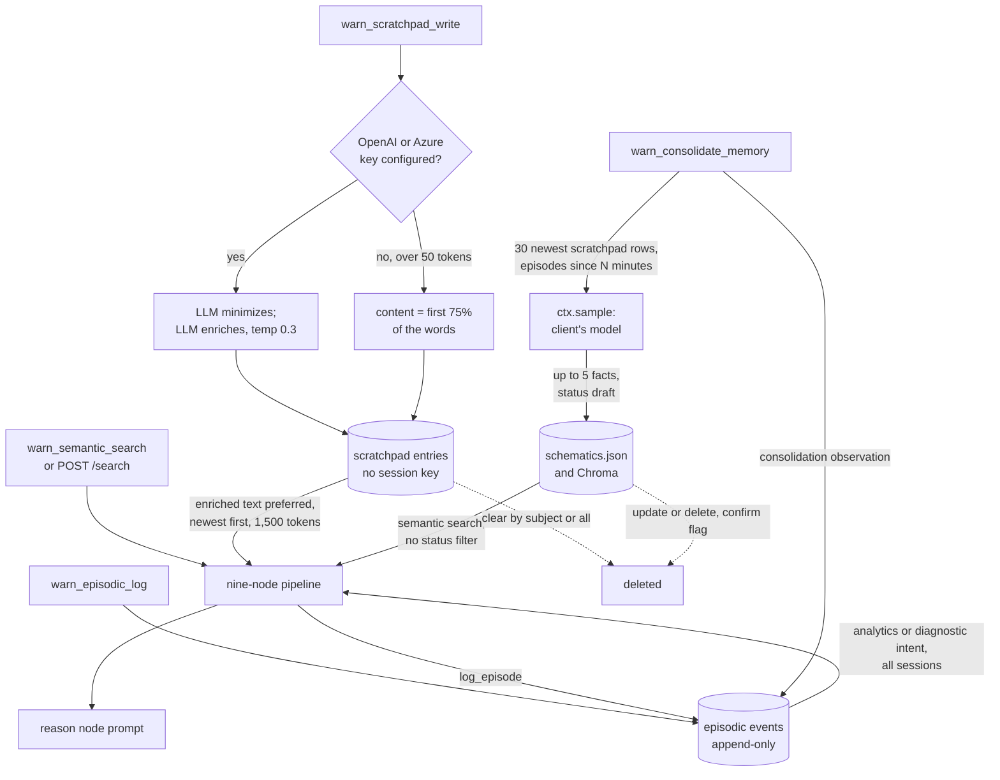

## 1. Executive Summary

WARNERCO Schematica is the flagship teaching app of *Context Engineering with
MCP*, a four-segment course whose repository also holds slide decks, lesson
notebooks and three smaller labs. It is a FastMCP server over a fictional robot
catalogue that implements the four memory tiers of CoALA
([arXiv:2309.02427](https://arxiv.org/abs/2309.02427), submitted 5 September
2023) as four small stores. A working-memory scratchpad and an episodic event
log sit in SQLite, the robot schematics in a JSON file mirrored into Chroma,
and procedural memory is the server's five MCP prompts.

What is notable is how legible each tier is. Episodic recall is
[Generative Agents](../generative-agents/)' recency-importance-relevance score
in about a hundred lines, and every score component is returned with the
event. What is weak is what the injected context says: a scratchpad note
reaches the model as an LLM's expansion of it, or, without an OpenAI key, as
its first 75% of words.

A consolidation tool asks the client's model, through MCP sampling, to extract
up to five durable facts from the scratchpad and recent episodes. It writes
them into the semantic store as `draft` schematics tagged `agent_extracted`.
The docstring calls the pass ADD-only and leaves conflict resolution as
*"homework"*. Nothing marks a scratchpad entry as consolidated, and nothing on
a read path excludes a draft.

The repository is course material first. Its other code — a JavaScript hello
world, a Python chat client whose documents are an in-process dict, a remote
Azure Functions sample that saves snippets to blob storage, and a README for
three npm-published MCP Apps servers — has no memory mechanism this report
covers. Only
`src/warnerco/backend/` is read here.

One mark: `negative_eval`, on a standalone script that asserts a
session-filtered recall leaves out another session's more relevant event.
Section 9 names the six withheld.

## 2. Mental Model

A memory is one of four records, and each tier has its own way of becoming
and ceasing to be believed.

**Scratchpad (working).** An agent calls `warn_scratchpad_write` with a
subject, one of seven predicates, an object and text. The store keeps three
texts: the original, a "minimized" one and an "enriched" one. There is no
candidate state; the row is injected into the next pipeline turn. It stops
being believed only when `warn_scratchpad_clear` deletes every row for its
subject, or all rows. The predicates `contradicts` and `supersedes` are labels:
nothing reads them to retire an earlier row (`app/models/scratchpad.py:36-44`).

**Episodic.** Every turn through the pipeline appends a `user_turn` event, and
an agent can log `observation`, `tool_call` or `agent_response` events itself.
Events are never updated and, on any reachable path, never deleted. They fade
only in rank: recency halves every 24 hours
(`app/adapters/episodic_store.py:318-325`).

**Semantic.** A schematic has a `draft`, `active` or `deprecated` status, set
by whoever writes it. Consolidated facts enter as `draft`. A schematic stops
being believed when an agent updates or deletes it.

**Graph.** A triplet is inserted once, `INSERT OR IGNORE`, and has no delete.

Everything injected is presented as context under a header, with no
qualifier distinguishing an agent's inference from a catalogue entry.

## 3. Architecture

The backend is one Python package, `app/`, run two ways: `warnerco-mcp` serves
the FastMCP server over stdio (`app/mcp_stdio.py`), and `warnerco-serve` runs
FastAPI with the same server mounted at `/mcp` over stateless streamable HTTP
(`app/main.py:22`, `:87`). Both import one module, `app/mcp_tools.py`, 5,024
lines holding 29 tools, 13 resources and 5 prompts.

Four stores sit under `data/` beside the backend. `data/scratchpad/notes.db`
and `data/episodic/events.db` are SQLite in WAL mode with thread-local
connections. `data/graph/knowledge.db` is SQLite mirrored into an in-process
NetworkX graph. The semantic tier is `data/schematics/schematics.json`, loaded
into a dict at construction and rewritten whole on each change
(`app/adapters/json_store.py:22-58`). The configured backend adds a Chroma
`PersistentClient` collection or an Azure AI Search index on top
(`app/adapters/factory.py`); the JSON file stays the source of truth for both.

The JSON file is tracked by git while the three SQLite directories are
ignored (`.gitignore:243-249`). Every schematic an agent creates and every
consolidated fact therefore shows as a modification to a committed file.

Nothing runs in the background. The only model calls are the scratchpad's
minimize and enrich, episodic importance scoring when the caller omits it, the
reason node, and MCP sampling for consolidation and explanation.

### Deployment and ergonomics

Locally: Python 3.13 and `uv sync`; Chroma is the default backend, and its
built-in embedding runs on first use. No key is needed to store anything. An
Anthropic key drives the reason node; an OpenAI or Azure key is what the
scratchpad and importance scorer call. Azure deployment is Bicep plus a
Container App behind API Management, whose policy validates a JWT
(`src/warnerco/infra/apim/validate-jwt.policy.xml`). The local HTTP server has
no authentication and binds `127.0.0.1` by default (`app/config.py:35`).

Every store is inspectable by hand: two SQLite files with one table each, a
graph database with two, and a pretty-printed JSON array.

`Settings` declares `chroma_persist_dir` and `json_schematics_path`, and the
backend `.env.example` documents them as overridable. The `chroma_path` and
`json_path` properties the stores read ignore both and hardcode `data/` under
the backend (`app/config.py:59-63`, `:86-98`). Setting either variable changes
nothing.

## 4. Essential Implementation Paths

**Scratchpad write.** `warn_scratchpad_write` (`app/mcp_tools.py:3959-4064`)
→ `ScratchpadStore.write` (`app/adapters/scratchpad_store.py:285-408`):
validate subject, object and predicate; `_minimize_content` (`:176-231`);
`_enrich_content` (`:233-279`); one `INSERT` (`:366-381`). Both LLM helpers
build `AzureChatOpenAI` or `ChatOpenAI` directly.

**Scratchpad read and inject.** `read` filters by subject and predicate,
newest first (`:414-460`). The pipeline's `inject_scratchpad` node
(`app/langgraph/flow.py:243-273`) calls `get_context_for_injection`
(`scratchpad_store.py:553-595`). It formats every row as `[predicate] subject
-> object: text`, choosing `enriched_content` over `content`, and stops at the
first row that would exceed the budget.

**Episodic write.** `warn_episodic_log` (`mcp_tools.py:4251-4295`) and the
pipeline's `log_episode` node (`flow.py:559-608`) both call
`EpisodicStore.log` (`episodic_store.py:212-262`). The node sets importance by
rule: 0.8 on error, 0.6 diagnostic, 0.4 analytics, 0.3 otherwise.

**Episodic recall.** `recall` (`episodic_store.py:268-359`) reads every event,
or every event of one session, and scores each as
`0.4·recency + 0.3·importance + 0.3·relevance`, with relevance a bag-of-words
cosine (`:74-94`). The pipeline's `recall_episodes` node (`flow.py:276-309`)
runs it only for analytics and diagnostic intents, with no `session_id`
(`:295-298`).

**Semantic retrieval.** `retrieve` (`flow.py:312-356`) routes a `WRN-` ID to
`get_schematic` and everything else to `semantic_search`. Chroma queries with
a `where` built only from caller filters (`chroma_store.py:135-208`) and falls
back to JSON keyword scoring on any exception.

**Graph.** `query_graph` (`flow.py:181-240`) extracts `WRN-` IDs and keywords
and appends one-hop neighbours for diagnostic, lookup and search intents.

**Assembly.** `compress_context` (`flow.py:359-442`) concatenates scratchpad,
episodes, graph and search results under four headers, and `reason`
(`:445-515`) sends that as one user message.

**Consolidation.** `warn_consolidate_memory` (`mcp_tools.py:4375-4409`) →
`consolidate_memory` (`app/langgraph/consolidate.py:185-294`): read the 30
newest scratchpad rows and up to 30 episodes from `since(minutes)`
(`:210-221`); sample; wrap each fact with `_fact_to_schematic` (`:152-182`);
`upsert_schematic`; log the cycle as an observation (`:276-286`).

**Correction.** `warn_update_schematic` (`mcp_tools.py:1107-1311`),
`warn_delete_schematic` (`:1314-1404`) and `warn_scratchpad_clear`
(`:4137-4178`). No tool reaches `EpisodicStore.clear` or a graph delete.

## 5. Memory Data Model

`entries` (scratchpad): `id`, `subject`, `predicate`, `object_`, `content`,
`original_content`, `enriched_content`, three token counts, `created_at`,
`metadata` (`scratchpad_store.py:125-138`). No session, author or status
column.

`events` (episodic): `id`, `session_id`, `kind`, `summary`, `content`,
`importance`, `created_at`, `provenance` (`episodic_store.py:141-150`). The
provenance JSON carries `source` and `trust_level`: `user` from the MCP tool,
`system` from the pipeline and from consolidation.

Schematic (`app/models/schematic.py`): `id`, `model`, `name`, `component`,
`version`, `summary`, `url`, `category`, `status`, `tags`, free-form
`specifications`, and `last_verified`. `warn_update_schematic` sets
`last_verified` to the day of any edit (`mcp_tools.py:1247-1250`), so the
field records when a row was last changed, not checked.

A consolidated fact is a schematic with `model="MEMORY"`, `category=
"consolidated_fact"`, an ID prefixed `FACT-`, and a `specifications` dict
holding `provenance`, `supporting_ids` and `confidence` from the model's
output (`consolidate.py:152-182`). `supporting_ids` is copied as returned;
nothing checks that the IDs exist.

`triplets` (graph): `subject`, `predicate`, `object`, `metadata`,
`created_at`, unique on the triple (`graph_store.py:121-129`). A predicate
outside the vocabulary is logged to stderr and stored anyway (`:208-214`).

Time is `created_at` everywhere. Nothing records when a fact was true.

## 6. Retrieval Mechanics

Retrieval is application-driven. The model calls `warn_semantic_search`, and
the pipeline decides which tiers to consult from a keyword intent classifier
(`flow.py:81-111`).

**Scratchpad** is not retrieved by relevance. `get_context_for_injection`
accepts `query_context` and ignores it (`scratchpad_store.py:553-575`), so
every search injects the newest rows up to 1,500 tokens whatever the query.
One long row at the head stops the loop with `break` (`:589-593`) rather than
being skipped.

**Episodic** recall returns the top five by the weighted sum. With the default
weights an event from the last hour with importance 0.8 and no word in common
with the query scores about 0.63, above an on-topic event from two days ago at
importance 0.3. The pipeline's recall reads across every session.

**Semantic** search returns Chroma's nearest rows, converted to a score as
`1 - distance/2`, re-read from the JSON store. No status is filtered unless the
caller passes one, and `warn_semantic_search` exposes only `category` and
`model` (`mcp_tools.py:616-620`). Drafts, deprecated rows and consolidated
facts rank beside active schematics.

The search tool returns the result list, the reasoning text and the
recalled episode lines. The scratchpad lines shape the reasoning and are not in
the tool's result model (`mcp_tools.py:644-653`).

## 7. Write Mechanics

Writes are hot-path tool calls, plus one automatic event per pipeline turn.

**Minimization degrades to truncation.** `has_llm_config` is true when any of
Anthropic, OpenAI or Azure is configured (`app/config.py:111-117`). The
scratchpad's helpers try Azure, else `ChatOpenAI(api_key=settings.openai_api_key)`,
with no Anthropic branch (`scratchpad_store.py:184-221`). With the course's
Anthropic-only setup that construction has no key. The exception is logged as
a warning, and a note over 50 tokens is stored as its first 75% of words
(`:223-229`). The original survives in `original_content`, which no injection
or consolidation path reads. This was read, not run.

**Enrichment replaces the note in context.** When an OpenAI or Azure key is
present, `_enrich_content` asks for *"relevant context, implications, and
connections"* at temperature 0.3 (`:262-269`). Injection prefers that text
(`:585`). What the agent observed reaches the next prompt as a model's
elaboration of it. `backfill_enrichments` (`:601-634`) would enrich older rows
too; no tool or route calls it.

**Consolidation duplicates.** The pass is ADD-only by design
(`consolidate.py:15-17`). It reads the 30 newest scratchpad rows regardless of
`since_minutes` and never marks them, so a second run over an unchanged
scratchpad asks for the same facts again and appends new `FACT-` IDs.

**Dedup in the other tiers.** Graph triplets deduplicate on the exact triple. Schematic
IDs come from the highest existing `WRN-` number plus one.

### Operational cost

A scratchpad write blocks on up to two model calls when a key is configured.
Every search runs the full pipeline: one model call in `reason` when a key is
configured, and one SQLite insert. Consolidation is one sampling request to the client, capped
at 1,024 tokens. The episodic recall reads every row and scores it in Python,
which the code comment accepts as *"fine for a class app"*
(`episodic_store.py:286-287`). Injection sits inside a single user message
assembled per query, so there is no stable prefix to cache.

## 8. Agent Integration

The model holds every verb. Read, write, clear, update, delete, graph insert,
episodic log and consolidation are all tools in one registry. `warn_search_tools`
and `warn_describe_tool` (`mcp_tools.py:4906-5024`) let a client load tool
descriptions progressively.

Two MCP features are used in memory paths. **Sampling** makes consolidation
run on the client's model, so the server needs no key for it. **Elicitation**
in `warn_feedback_loop` (`:1562-1655`) asks the person for a rating and
comments on a schematic, then returns them to the caller without storing
anything.

`.claude/mcp.json` registers the same backend twice, as
`claude-warnerco-schematica` and `claude-warnerco-coala-memory`, both running
`warnerco-mcp` in one working directory. That produces two processes over one
JSON file (section 9).

Adapting this to another agent means taking a store module, not the server:
`episodic_store.py` and `scratchpad_store.py` depend only on `settings` and
their models.

## 9. Reliability, Safety, and Trust

**Two processes lose each other's semantic writes.** `RawJsonStore` loads the
file once at construction and rewrites the whole dict on each upsert or delete
(`json_store.py:22-58`, `:114-126`). With the HTTP server and a stdio server
running, or the two registered stdio servers, a fact one writes is invisible to
the other, whose next save overwrites it. The SQLite tiers do not have this
problem.

**Agent inference and catalogue data are indistinguishable at read time.**
Consolidated facts carry `status=draft` and `trust_level: agent_extracted`, and
the only reader of `trust_level` anywhere is the writer. The consolidation
docstring says the tags make facts *"filterable"*; no read filters them.

**Provenance is partly model-asserted.** `supporting_ids` are whatever the
model returned. Episodic `trust_level: user` is stamped for any caller of the
MCP tool, which is the model.

**Deletion is uneven.** A deleted schematic leaves its graph triplets and any
consolidated fact derived from it. Episodic events have no delete on any tool
or route. The e2e script deletes the live episodic database (section 10).

**Uncertainty** is representable only as the fact's `confidence` float, which
nothing reads.

Capability marks:

- `negative_eval` — awarded; evidence in section 10.
- `tombstone` — schematic delete and scratchpad clear remove rows. Nothing
  keyed on a rejected value stops consolidation re-extracting it.
- `trust_state` — `draft`, `active` and `deprecated` exist as a field, and
  consolidation sets `draft`. No read excludes a draft or deprecated row, so
  the state withholds nothing.
- `bitemporal` — `created_at` only.
- `scope_enforced` — episodic rows carry `session_id` and `recall` applies
  `WHERE session_id = ?` when a caller passes one. The pipeline's recall, the
  one read that reaches the reasoning prompt, passes none, and the scratchpad
  its docstring calls *"session-scoped"* (`flow.py:250`) has no session column.
- `audit_log` — episodic events record turns and observations. The one
  mutation they record is a consolidation cycle; schematic, scratchpad and
  graph writes leave no event.
- `human_review` — elicitation reaches a person and stores nothing. Status
  changes are on the agent's own `warn_update_schematic`.

## 10. Tests, Evals, and Benchmarks

Nothing was installed, built or run; everything below is from reading the
tests at the pin.

**The negative case.** `test_episodic_e2e.py` is a standalone script with 14
cases, run as `uv run python test_episodic_e2e.py`. `test_recall_session_filter`
(`:302-315`) logs two `sA` events and `beta event` under `sB`, recalls `event`
for `sA`, and passes only if all results are `sA` and exactly two returned.
`beta event` is the closest match to the query, so an unscoped recall would
include it. `test_since` (`:353-376`) asserts a backdated `old` event is absent
and `fresh` present. `main` exits 1 on any failure (`:544`).

Three limits. The script sits outside pytest's `testpaths = tests`, and no
committed workflow runs it. Collected by pytest directly, its cases record
FAIL without asserting and pass. And `cleanup_db` (`:40-61`) unlinks
`settings.episodic_path`, the live `data/episodic/events.db`, before the cases
and again at exit.

**The pytest suite** (192 functions under `tests/`) covers the scratchpad
store, models and tools, the graph store and graph tools, the explain-schematic
sampling tool, and the scratchpad's place in `compress_context`. Stores run on
`tmp_path` databases and LLM helpers are patched. `test_clear_by_subject_removes_matching`
checks the remaining count through `stats()`, not a read, and
`test_read_filter_by_subject` checks a count of one; neither names what must
be absent.

**Not covered.** No committed test exercises `consolidate_memory`, the JSON or
Chroma stores' write-and-search round trip, or the minimization fallback
without a mocked helper. No retrieval-quality evaluation exists. There is no
paper about this system; the tree cites CoALA and Generative Agents as sources
of its design.

## 11. For Your Own Build

### Steal

- **Return the score breakdown with each recalled memory.** Recency,
  importance and relevance per event make a wrong recall diagnosable without a
  debugger.
- **Keep the original beside every rewrite.** Persisting original, minimized
  and enriched text means any of them can be restored; the next step is making
  the verbatim one what the model sees.
- **Record the consolidation act as a memory.** An observation naming the fact
  IDs a cycle produced is the start of a promotion log.
- **Run consolidation on the client's model through MCP sampling.** The server
  stays keyless and the extraction bill lands with the session that asked.

### Avoid

- **Injecting a model's elaboration in place of the observation.** Enrichment
  that adds "implications" is a new, unreviewed claim.
- **A silent lossy fallback on the write path.** Truncating to 75% of words
  when a key is missing turns a configuration gap into data loss.
- **Promotion without a high-water mark.** A pass that cannot tell what it has
  already promoted duplicates on every run.
- **Status as a label nobody filters.** A `draft` that ranks beside `active`
  looks like a trust state and is not one.
- **Whole-file rewrite from a startup snapshot.** Any second process makes it
  last-writer-wins over the entire store.

### Fit

This is a well-annotated specimen of the CoALA vocabulary, built to be
narrated in a fifty-minute segment, and it serves that. Read it to see four
tiers side by side at small scale, or to lift `episodic_store.py` as a starting
recall scorer. Do not run it as memory for a real agent: the context it
injects is not what was written, the semantic tier cannot survive two
processes, and the pass that promotes facts cannot stop repeating itself. Its
own comments say most of this, which is the right posture for teaching code
and the reason not to deploy it.

## 12. Open Questions

- Whether `ChatOpenAI(api_key=None)` raises at construction under the pinned
  `langchain-openai`, which decides whether the Anthropic-only path truncates
  or reaches the network first. Running it would settle this.
- What the notebooks' Segment 3 run of consolidation produced, and whether
  duplicate `FACT-` rows appeared.
- The two committed workflows deploy `coretext-mcp` and `stoic-mcp`, neither of
  which is in the tree at this pin. Whether they were earlier memory servers
  of this course would need the history.

## Appendix: File Index

- **Storage and schema:** `src/warnerco/backend/app/adapters/scratchpad_store.py`,
  `episodic_store.py`, `graph_store.py`, `json_store.py`, `chroma_store.py`,
  `azure_search_store.py`, `factory.py`; `app/models/{scratchpad,episodic,schematic,graph}.py`;
  `app/config.py`.
- **Write path and consolidation:** `app/mcp_tools.py:950-1404, 3631-3712,
  3959-4409`; `app/langgraph/consolidate.py`.
- **Retrieval and assembly:** `app/langgraph/flow.py`.
- **Integration:** `app/mcp_tools.py`, `app/mcp_stdio.py`, `app/main.py`,
  `app/api/routes.py`, `.claude/mcp.json`, `.vscode/mcp.json`.
- **Tests:** `src/warnerco/backend/tests/*.py`, `test_episodic_e2e.py`,
  `test_9node_flow.py`, `pytest.ini`.

### Recorded searches

Checked against the checkout at the pinned revision, from `src/warnerco/backend`
unless stated.

- `grep -rn 'trust_level' app/` — writers only: `consolidate.py:176, 283`, `flow.py:602`, `mcp_tools.py:4284`, and the model's docstring.
- `grep -rn 'supersedes\|contradicts' app/` — docstrings and the predicate dictionary; no reader acts on either.
- `grep -rn '\.clear(\|backfill_enrichments\|\.since(' app/ scripts/` — `mcp_tools.py:4165` (scratchpad) and `consolidate.py:217`; no caller of `EpisodicStore.clear` or `backfill_enrichments`.
- `grep -rn 'DELETE FROM\|delete_entity\|remove_relationship' app/` — the scratchpad and episodic stores only; no graph delete.
- `grep -n '@router\.' app/api/routes.py` — 15 routes; the only memory writes are reindexing and the `user_turn` event `POST /search` appends through the pipeline.
- `grep -rn 'chroma_persist_dir\|json_schematics_path' . --include='*.py'` (tree root) — declared in `config.py:60, 63`, read nowhere.
- `grep -n 'status\|draft\|trust_level' app/langgraph/flow.py app/adapters/*.py` — status filtered only when present in caller filters.
- `grep -rln 'consolidat' src/warnerco/backend/tests src/warnerco/backend/test_*.py notebooks` (tree root) — `notebooks/segment-3.ipynb` only.
- `grep -rliE 'arxiv|bibtex|@article|@misc|doi\.org' . --exclude-dir=.git` (tree root) — a tutorial and three research syntheses citing CoALA, Generative Agents and others; no `CITATION` file.
- `ls .github/workflows` (tree root) — two deploy workflows, no test workflow.

## History

**2026-09-26** — [`0f07bdbd01593ab5213e77db1512dbaf181463c5`](https://github.com/timothywarner-org/context-engineering/commit/0f07bdbd01593ab5213e77db1512dbaf181463c5) — first reading, at the head of `main`, a commit dated 19 September 2026. One mark, `negative_eval`. Screened before reading: one auto-run surface, a `.gitattributes` LFS filter on `.zip` and `.pptx`, checked out with the smudge filter disabled; one build-time execution point (`tests/conftest.py`); 14 dependency files inside the cooldown, every file in the depth-1 clone dating to the tip; six unpinned surfaces. `CLAUDE.md`, `.claude/` and `.github/agents/` were read as data. Only `src/warnerco/backend/` is covered; the labs and slide decks are course material. Read with `grep`, `sed` and `awk`; nothing installed, built or run.
