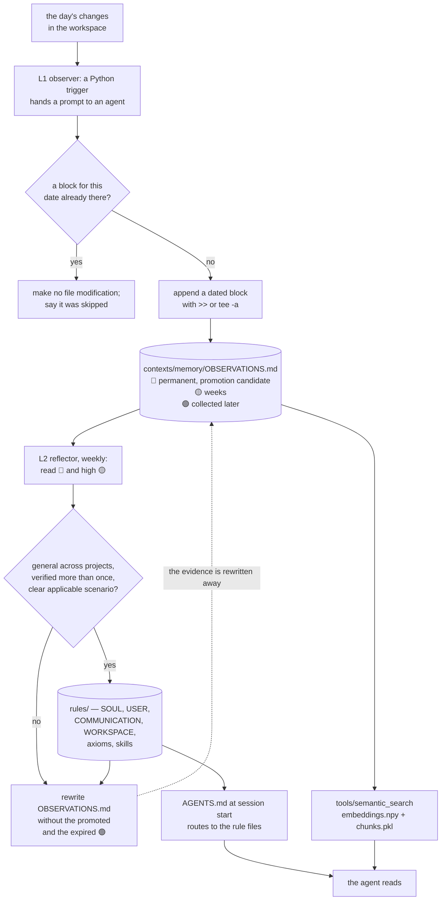

## 1. Executive Summary

Context Infrastructure is the published structure of a system its author says
has been running for a year. The README is unusually clear about what it is not:
*"这不是开箱即用的工具，而是一个可以参考的蓝图"* — this is not an out-of-the-box
tool but a blueprint you can reference — and it says the honest thing about
adoption, that making the AI genuinely yours *"需要从头采集你的行为数据——没有
捷径"*, requires collecting your own behavioural data from scratch, with no
shortcut.

159 commits between 15 March and 6 September 2026 from three authors; 10,646
lines of Markdown against 3,496 lines of Python; the documentation is the
system and the code is its trigger. The screen found no auto-run surface, no
build-time execution path, nothing inside the cooldown, one unpinned dependency
surface, and an `AGENTS.md` treated as data; nothing was installed or run.

**There is no licence file.** Not a permissive one, not a restrictive one —
none. `ls LICENSE* COPYING*` returns nothing and no licence is declared in the
README or a manifest. A reader should treat the contents as all-rights-reserved
by default, which matters for a repository whose stated purpose is to be copied
as a blueprint.

**The memory is three layers and a promotion rule.** An L1 observer runs daily:
a Python trigger hands a prompt to an OpenCode agent, which scans the workspace,
filters what changed, and appends a dated block to
`contexts/memory/OBSERVATIONS.md` under three marks — 🔴 High for cross-project
lessons and hard constraints, kept permanently and eligible for promotion; 🟡
Medium for things that will matter for a few more weeks; 🟢 Low for daily task
flow, garbage-collected periodically. An L2 reflector runs weekly, promotes the
durable entries into `rules/` by responsibility boundary, and then rewrites the
observation file without them.

**The promotion threshold is written down**, which is more than most systems
manage: *"跨项目通用 + 多次验证 + 有明确适用场景"* — general across projects,
verified more than once, with a clear applicable scenario. It is a prompt rather
than a predicate, so nothing enforces it, but it is stated.

**The idempotency rule lives in the prompt that performs the write.** Before
appending, the agent must read `OBSERVATIONS.md` and check for an existing block
for that date; if one exists it must *"不要进行任何文件修改"* — make no file
modification at all — and say so. The prompt also tells the agent to append with
`>>` or `tee -a` rather than editing a large file whole. Both are the right
instructions and both are instructions rather than code.

**It carries no capability marks, and the reason is the same one twice.** The
three priority marks are retention classes an LLM assigns at write time —
🟢 means *collect this later*, not *this might be false* — and nothing filters
recall on them. And consolidation deletes its own evidence: the reflector
rewrites the observation log without the entries it promoted, while a promoted
axiom's frontmatter carries `id`, `category`, `created` and `updated` and no
pointer back to the observations that produced it. After a promotion, the chain
from rule to evidence is gone.

**Nothing in the tree runs as committed.** Both trigger scripts hardcode
`/path/to/your/workspace` and offer a single `--model` choice of
`<your-model-id>`. That is consistent with the blueprint framing and it means a
reader is looking at a shape rather than at a working install.

## 2. Mental Model

A day happens. Overnight, an agent looks at what changed in the workspace and
writes down what it thinks was worth noticing, sorted into three buckets by how
long it expects the note to matter. That file grows.

A week happens. Another agent reads the top two buckets, asks which entries are
general enough to be a rule rather than a record, and moves those into the rule
files — `SOUL.md` for identity and values, `USER.md` for the person,
`COMMUNICATION.md` for style, `WORKSPACE.md` for routing, `skills/` for
methodology. Then it rewrites the observation file, dropping what it promoted
and what has gone stale.

Reading is a routing problem rather than a search problem, most of the time.
`AGENTS.md` is the table an agent hits at session start; it points at the rule
files and at `WORKSPACE.md`, which points at directories. The observation file
carries its own retrieval instruction: do not load me whole. When routing is not
enough, `tools/semantic_search` embeds the tree and answers a query against it.

The shape of the thing is a funnel with a cliff at the end. Observations
accumulate, the durable ones are distilled upward into rules, and the rest is
deleted. What the design does not have is any way back down: a rule cannot be
traced to the observations that justified it, because those were rewritten away
in the same pass that created it.



## 3. Architecture

There is no service. The repository is the system: `rules/` holds the four rule
files plus `axioms/` and `skills/`; `contexts/` holds `memory/OBSERVATIONS.md`,
`daily_records/`, `survey_sessions/` and `thought_review/`; `periodic_jobs/` and
`adhoc_jobs/` hold the scheduled work; `tools/` holds the Python.

The Python splits cleanly into two kinds. The **triggers** are thin: `observer.py`
is 84 lines and `reflector.py` is 57, and most of each is a prompt template — the
work is done by an OpenCode agent the script dispatches to through
`opencode_client.py` (228 lines). The **tool** is real: `tools/semantic_search`
is 418 lines across a chunker, an embedding client, a forward index and a CLI,
with `embeddings.npy` and `chunks.pkl` under an `fcntl` lock and a
`manifest.json`, and mmap used to keep loading cheap.

Beside those sit ordinary utilities — GA4 and Kit metrics, Typefully posting, an
email-to-self script, report templates — which are the author's actual working
surface rather than part of the memory.

`docs/SKILL_ECOSYSTEM.md` names separately installable skill repositories (web
search, Google Docs, Maps, newsletter, OpenCode, PPTX, social media, payment
analysis, home network analysis, a local process launcher) so this repository
*"保持轻量"* — stays light — and capability arrives by installing others.

## 4. Essential Implementation Paths

- **Observe.** cron → `periodic_jobs/ai_heartbeat/src/v0/observer.py <date>` →
  `OpenCodeClient.create_session` → the prompt template at `:18-38` instructing
  the agent to read the SOP, check idempotency, scan the workspace, and append
  a dated block to `contexts/memory/OBSERVATIONS.md`.
- **Constrain the observer.** The same prompt scopes it: *"仅执行 L1 Observer
  任务"* — do only the L1 task, do not modify anything under `rules/`, do not
  promote and do not garbage-collect. The separation between the two layers is a
  sentence in a prompt.
- **Reflect.** cron → `reflector.py` → a prompt at `:12-29`: read the 🔴 and
  high 🟡 entries, promote by responsibility boundary into the five rule
  destinations, then rewrite `OBSERVATIONS.md` dropping the promoted and the
  expired 🟢.
- **Route.** an agent opens the directory → `AGENTS.md` is the root table →
  `rules/WORKSPACE.md` for directory routing → the rule files for identity,
  user, communication and skills.
- **Search.** `tools/semantic_search/main.py` → `search/cli.py` →
  `search/chunker.py` splits the tree → `search/embedding.py` embeds →
  `ForwardIndex` (`search/index.py:11-40`) persists `embeddings.npy`,
  `chunks.pkl` and a manifest under a lock, loading with mmap.

## 5. Memory Data Model

**The observation.** A block under a `Date: YYYY-MM-DD` header, containing lines
prefixed 🔴, 🟡 or 🟢. The file documents the three levels itself: 🔴 High is
*"跨项目通用的经验教训、硬性约束、影响系统架构的重大决策"* — cross-project
lessons, hard constraints, decisions that shape the architecture — *"永久保留,
候选晋升为 axiom 或 skill"*, kept permanently and a candidate for promotion. 🟡
Medium is key progress on active projects and decision background still worth
referring to for a few weeks. 🟢 Low is daily task flow, transient debugging and
temporary context, *"定期垃圾回收"*.

Those are **retention classes, not truth states**. The distinction is what keeps
this report's capability list empty: 🟢 says *this will stop being worth keeping*,
not *this might be wrong*, and no read path consults any of the three.

**The rule.** An axiom is a Markdown file with frontmatter — `id`, `category`,
`created`, `updated` — and a body. `a01_ask_do_paradigm.md` is dated February
2026 and states its core proposition and then argues it. What the frontmatter
does not carry is provenance: there is no field naming the observations that
were promoted into it, and the reflector's own instruction deletes those
observations in the same pass. A reader asking *why does this rule say that*
has the argument in the body and nothing behind it.

**No scope and no validity.** One workspace, one owner. `WORKSPACE.md` routes
directories rather than partitioning memory. Nothing carries a validity interval;
`created` and `updated` on an axiom are record times.

## 6. Retrieval Mechanics

Routing first. `AGENTS.md` is described as *"根路由表（AI 每次 session 的
起点）"* — the root routing table, the starting point for every session — and the
rule files are small enough to load. That is the common path, and it is why the
system works without a query at all for most questions.

The observation file is the exception, and it says so in its own text: *"不要全文
加载这个文件（可能很大）。按需检索"* — do not load this file whole, it may be
large; retrieve on demand. A memory file that carries its own retrieval
instruction is a small, good idea, and it is the kind of thing that only appears
in a system somebody actually ran into trouble with.

`tools/semantic_search` is the on-demand path and it is properly built for its
size: chunks and embeddings persisted as `.npy` and `.pkl`, a manifest, an
`fcntl` lock so a concurrent build cannot corrupt the index, and mmap on load so
a query does not pay for the whole array. It is 418 lines and it does one thing.

Nothing on either path filters by priority mark, by date, or by any other
property of an entry. Retrieval returns what matches.

## 7. Write Mechanics

The write is an LLM appending to a Markdown file, and the interesting engineering
is in the prompt.

**Idempotency before anything else.** The observer's prompt puts the constraint
first and in bold: before any write, read `OBSERVATIONS.md` and check for a block
with this date; if one exists, make no modification and reply that it was
skipped. For a job on a timer that may be retried, that is the correct guard, and
putting it ahead of the task rather than after it is deliberate.

**Append, do not rewrite.** The prompt tells the agent to use `echo ... >>` or
`tee -a`, *"避免对大文件做全文编辑"* — avoid full-text editing of a large file.
This is a prompt working around a real failure mode of agents editing large
files, and it is the same instinct as the retrieval note in the file's header.

**Format discipline.** The date header format is specified exactly, and file
references must be *"相对于根目录的完整路径"* — full paths relative to the root,
not bare filenames — so a later reader or a later search can resolve them.

**Layer separation is a sentence.** The observer is told to do only L1 and not
to touch `rules/` or perform promotion or GC. Nothing enforces that; the model
is asked.

The reflector's write is a rewrite, and that is where the design's cost sits. It
deletes what it promoted, so the observation that justified a rule is gone at the
moment the rule exists.

## 8. Agent Integration

The integration is a directory an agent opens. Claude Code, OpenCode or Cursor
pointed at the checkout, with `AGENTS.md` as the entry point — no MCP server, no
plugin, no hooks. `rules/USER.md` is named as the highest-return first step:
fill it in and behaviour personalises immediately.

Scheduled work goes the other way: cron invokes the trigger scripts, which drive
an OpenCode session through `opencode_client.py` — creating a session, sending
the prompt, and by default deleting the session afterwards, with a `--no-delete`
flag to keep it. `docs/CRONTAB.md` documents the timeline and example crontab.

The skill ecosystem is deliberately external. Rather than growing this
repository, `docs/SKILL_ECOSYSTEM.md` lists ten separately installable skill
repositories, so an adopter composes capability instead of forking a monolith.

## 9. Reliability, Safety, and Trust

**No capability marks, and each absence has a specific cause.**

**Trust state — no.** The three priority marks are the closest thing, and they
grade retention rather than truth: 🔴 is kept permanently, 🟢 is collected later.
An LLM assigns them at write time, no read path consults them, and nothing
anywhere records that a claim turned out to be wrong as opposed to no longer
useful.

**Tombstone — no.** The reflector deletes; nothing is recorded about what was
deleted or why, and nothing consults a record of it on a later write. The same
observation can be written again the next day and will be.

**Audit log — no.** `OBSERVATIONS.md` is append-only in the write path and is
periodically rewritten by the reflector, which is the opposite property. Git
history exists and is a different mechanism, which this atlas does not count as
this mark.

**Scope — no.** One workspace, one owner, one observation file.

**Bitemporal — no.** `created` and `updated` on an axiom, a date on an
observation; all record time.

**Human review — no.** Promotion is performed by an agent against a prose
threshold, not proposed to a person for approval. The threshold is stated —
general across projects, verified more than once, clear applicable scenario —
which makes it reviewable after the fact by reading the rules, and there is no
surface where a person decides before the fact.

**Negative evaluation — no.** The single test file in the tree covers a
PDF-to-Markdown CLI in `rules/skills/tests/`, unrelated to memory or retrieval.

**The finding that outranks the mark list.** Consolidation deletes its own
evidence. The reflector's instruction is explicit — rewrite the file, dropping
what was promoted — and a promoted axiom carries no pointer back. So the system
compounds beliefs upward with no way to audit downward, and a rule that was
promoted from a misreading is indistinguishable from one promoted from a year of
repeated experience. A `source:` list in the axiom frontmatter would cost one
line in the prompt and would make the whole ladder checkable.

## 10. Tests, Evals, and Benchmarks

One test file, `rules/skills/tests/test_pdf_to_markdown_cli.py`, covering a skill
utility. `tools/pytest.ini` exists. There is no test of the observer, the
reflector, the promotion threshold or the search index, and no evaluation of
retrieval quality.

That is consistent with what the repository is — a published structure rather
than a maintained product — and it is worth stating plainly because the
mechanism most in need of a test is the one most exposed: a reflector that
rewrites a file, deleting entries, with no assertion anywhere that what it kept
is what it should have kept.

No benchmark, and none claimed. No paper. A search of the README and `docs/` for
`arxiv`, `bibtex`, `@article`, `@misc`, `Citation`, `CITATION.cff` and `doi`
returns nothing; the background reading the README links is the author's own
essay.

The claim the repository does make is experiential and cannot be checked from
here: that this is *"一个运行了一年的 context infrastructure 系统的完整结构"* —
the complete structure of a context infrastructure system that has run for a
year. Nothing in the tree contradicts it, and nothing in the tree evidences it
either; the commit history begins in March 2026, six months before this reading.

## 11. For Your Own Build

### Steal

- **Put the idempotency rule ahead of the task in the prompt.** The observer is
  told to read the file and check for today's date *before* the instruction to
  scan and write, in bold. A scheduled job that may be retried needs that guard
  first, not as a footnote.
- **Tell the agent to append rather than edit.** `>>` or `tee -a` instead of a
  whole-file edit is a workaround for a real failure mode, and it is one line.
- **Put the retrieval instruction inside the memory file.** `OBSERVATIONS.md`
  opens by telling its reader not to load it whole and to retrieve on demand.
  The file that knows how big it is is the right place to say so.
- **Write the promotion threshold down.** *General across projects, verified
  more than once, clear applicable scenario* is a real bar, stated in the prompt
  that applies it. Most systems promote on a score with no stated meaning.
- **Keep the skill ecosystem in other repositories.** Ten installable skill
  repos and a light core is a better answer than a monolith that grows.

### Avoid

- **Deleting the evidence in the same pass that creates the conclusion.** The
  reflector promotes an observation into a rule and then rewrites the
  observation file without it. A `source:` list in the promoted rule's
  frontmatter would preserve the chain at negligible cost.
- **Grading by retention and reading it as trust.** 🔴/🟡/🟢 answer *how long
  should this be kept*, and a reader will hear *how much should this be
  believed*. They are not the same question and one file cannot carry both.
- **Shipping a blueprint with placeholder paths and calling it a reference
  implementation.** `/path/to/your/workspace` and `<your-model-id>` appear in
  both trigger scripts, so nothing runs as committed — which is defensible for a
  blueprint and should be said in the README's Quick Start rather than
  discovered.
- **Publishing without a licence.** A repository whose stated purpose is to be
  copied, with no licence file, is all-rights-reserved by default.

### Fit

This suits a reader who wants to see the shape of a personal context system that
somebody has actually lived with, and who is prepared to build their own from the
pattern — which is exactly what the README asks for. The promotion ladder, the
routing table and the prompt-level discipline are worth reading whatever you
build on. It is not a tool to adopt: nothing runs as committed, there is no
licence, the documentation is Chinese with an English sibling repository linked,
and the mechanisms that matter are prompts an adopter will rewrite anyway. A team
should not reach for it at all — there is no scope key, one observation file and
one owner — and anyone who does take the pattern should add the provenance field
before the first reflection runs.

## 12. Open Questions

- Should a promoted rule record what it was promoted from? The reflector knows
  the entries at the moment it writes the rule, and the frontmatter already has
  a place for a list.
- What stops the observer re-observing something already promoted? The
  idempotency check is per date, not per content, so a lesson promoted in week
  one can be observed again in week three with nothing to notice it.
- How large does `OBSERVATIONS.md` get between reflections, and what does the
  semantic index do about a file that is rewritten weekly?
- Is the English sibling repository a translation or a fork with its own
  history?

## Appendix: File Index

| Path | Lines | What it holds |
| --- | --- | --- |
| `contexts/memory/OBSERVATIONS.md` | — | The L1/L2 store: the three-level definition, the retrieval instruction, and the dated blocks |
| `periodic_jobs/ai_heartbeat/src/v0/observer.py` | 84 | The L1 trigger and its prompt: idempotency first, append not edit, format discipline, L1-only scope |
| `periodic_jobs/ai_heartbeat/src/v0/reflector.py` | 57 | The L2 trigger and its prompt: promote by responsibility boundary, then rewrite the file without what was promoted |
| `periodic_jobs/ai_heartbeat/src/v0/opencode_client.py` | 228 | Session create, prompt send, delete-unless-`--no-delete` |
| `tools/semantic_search/` | 418 | `chunker.py`, `embedding.py`, `index.py` with the `fcntl` lock and mmap load, `cli.py`, `models.py` |
| `rules/` | — | `SOUL.md`, `USER.md`, `COMMUNICATION.md`, `WORKSPACE.md`, `axioms/` with an `INDEX.md`, `skills/` |
| `AGENTS.md` | — | The root routing table an agent reads at session start |
| `docs/CRONTAB.md`, `docs/SKILL_ECOSYSTEM.md` | — | The schedule; the ten separately installable skill repositories |
| `rules/skills/tests/test_pdf_to_markdown_cli.py` | — | The only test in the repository |

Searches behind the absence claims above, run from the repository root:

```sh
ls LICENSE* COPYING*                                                    # none: no licence file anywhere
rg -n '^(source|derived_from|promoted_from|observations):' rules/axioms/*.md  # none in frontmatter: id, category, created, updated only
rg -n '🔴|🟡|🟢' periodic_jobs tools --glob '*.py'                       # three hits, all inside prompt strings; no code branches on a mark
rg -n 'path/to/your/workspace|<your-model-id>' periodic_jobs             # both trigger scripts, so nothing runs as committed
find . -name 'test_*.py' -o -name '*_test.py'                            # one file, on a PDF skill
rg -n -i 'arxiv|bibtex|@article|@misc|Citation|CITATION.cff|doi' README.md docs  # none: no paper
```

## History

**2026-09-10** — [`421df58bcb2f53ead50f85de2adbd31fdfc9ea3f`](https://github.com/grapeot/context-infrastructure/commit/421df58bcb2f53ead50f85de2adbd31fdfc9ea3f) — first reading, at the head of `main`, the last commit of 6 September 2026. Screened before reading: no auto-run surface, no build-time execution path, nothing inside the seven-day cooldown, one unpinned dependency surface, and an `AGENTS.md` treated as data; nothing was installed or run, and the read was made from a full clone. No marks. The repository has no licence file, which is recorded in section 1 because its stated purpose is to be copied. The reading covered the observation store, the two heartbeat triggers and their prompts, the rule and axiom layout, and the semantic-search tool; the metrics, posting and reporting utilities under `tools/` were read as the author's working surface rather than as memory. The documentation is in Chinese and an English sibling repository is linked from the README; quotations here are from the tree read.
