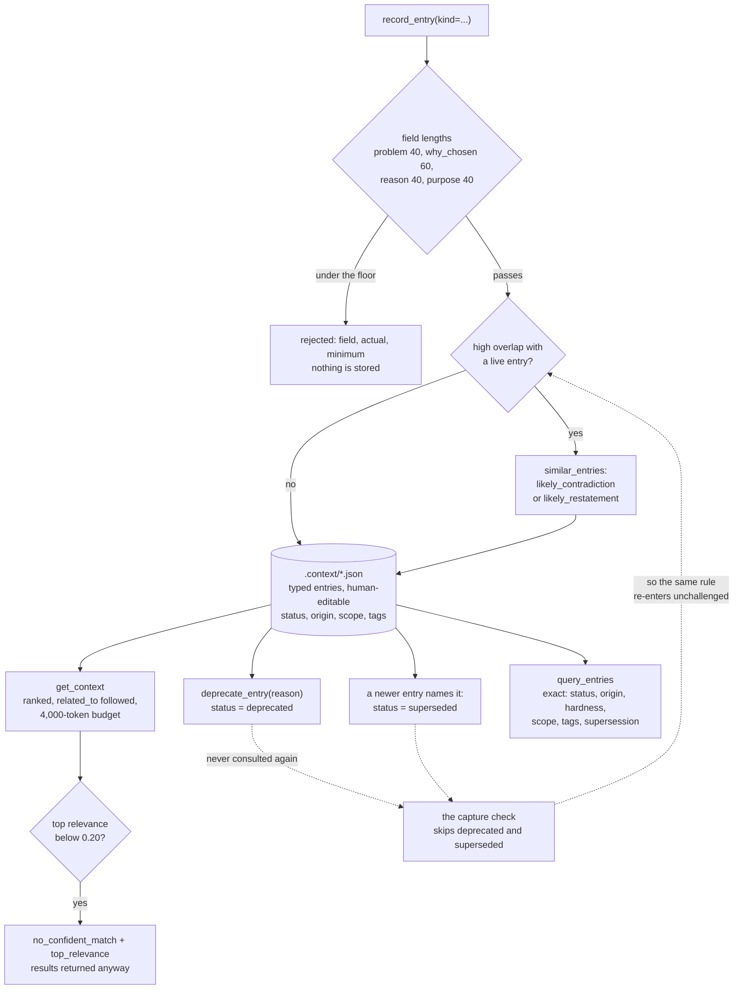

## 1. Executive Summary

Context Keeper is project memory for a coding agent, and its distinguishing
decision is made before anything is stored: **the schema refuses an entry that
is too thin to be worth keeping.** A decision needs a `problem` of at least 40
characters and a `why_chosen` of at least 60; a constraint needs a `reason` of
at least 40; a pipeline needs a `purpose` of at least 40 and at least one step.
`_check_min_lengths` (`server.py:972-996`) returns a rejection carrying the
field, the actual length and the minimum, with the message *"Entry rejected:
required fields missing or too short."* `update_entry` re-applies the same
floors. Most systems in this corpus accept whatever an agent writes and try to
rank the result; this one sets a bar at the door.

MIT; 74 commits between 9 April and 6 August 2026 from three authors; version
0.19.0; 7,587 lines of Python including the hooks, beside 7,510 lines of tests
holding 511 cases; **zero runtime dependencies**. The screen found two auto-run
surfaces — a `hooks/` directory with seven scripts a plugin manifest registers,
and a `server.json` declaring a start command — one build-time execution path in
`tests/conftest.py`, and one unpinned dependency surface; nothing was installed
or run, and the read was made from a full clone.

**Two read paths with different contracts, and the difference is the point.**
`get_context` ranks by tag and text overlap with a scope boost, recency, status
and origin, follows `related_to` links, and fills a 4,000-token budget, setting
`budget_truncated` when it cannot fit everything. `query_entries` applies exact
predicates — status, origin, hardness, tags, scope, `superseded_by`,
`supersedes`, date bounds — and does no ranking whatsoever. A caller that needs
*the relevant thing* and a caller that needs *every entry matching these
fields* are served by different functions, which is a clarity most memory tools
give up in favour of one endpoint with a relevance knob.

**The retrieval knows when it does not know.** `get_context` computes a
relevance signal from tag and text overlap and, when the top entry falls below a
0.20 floor, sets `no_confident_match` and `top_relevance` on the response
(`server.py:2212-2229`). The floor is not a guess: the config comment records it
as *"the highest value with zero false-abstention on the eval set"*, and the
calibration note beside it explains why a raw cosine could not be used —
*"nomic-embed cosines never drop below ~0.51 even for a completely unrelated
question, so comparing a raw cosine to this floor would put every query above it
and disable abstention entirely."* That is a project that measured its own
abstention rather than asserting it.

**Scope has one implementation, and the docstring says what it cost to get
there.** `scope_rules.py` opens by naming four surfaces that each had their own
matcher and disagreed on two of ten cases, with the consequence spelled out: a
substring test matched `webhooks/send.py` against a `hooks/` scope, and because
the guard hook injects each constraint at most once per session, *"a false
positive MARKS THAT CONSTRAINT DELIVERED and the file it actually governs never
receives it. An over-eager match causes a silent under-delivery."* The module
imports nothing, deliberately, because it runs on PreToolUse before every edit.

**The finding that costs it a mark.** `_find_similar_entries` is the one
write-path check that consults what is already stored — it computes Jaccard
overlap against existing entries and labels a high-overlap pair
`likely_contradiction` or `likely_restatement` so the caller can resolve it
before a second live rule contradicts the first. It skips every entry whose
status is `deprecated` or `superseded` (`server.py:1110-1111`). So a constraint
you deprecated last month can be recorded again tomorrow, and the check that
exists to catch exactly that will say nothing. The store holds the record of the
rejection and never consults it.

## 2. Mental Model

An entry becomes memory only if it clears a bar. The agent calls `record_entry`
with a `kind`; the server validates the fields for that kind against character
floors and rejects the write outright if they are short. If it passes, the
server looks for near-duplicates among the *live* entries and hands back a
`similar_entries` list with each pair labelled a likely restatement or a likely
contradiction — a prompt to the caller, not a block.

Once stored, an entry has three ways to stop being true. It can be *superseded*,
which happens automatically when a newer entry names it, demoting it out of
default recall while leaving it findable. It can be *deprecated* by an explicit
call with a mandatory reason, optionally folded into a survivor. Or it can go
*stale* — `prune_stale` reports entries not verified within a threshold, and
`code_drift` counts commits touching the entry's scope since it was last
verified, flagging a scope whose file no longer exists as `orphaned_scope`
rather than as drift. None of the three deletes anything.

Reading is where the design's care shows. The ranked path serves an agent asking
a question and tells it when the answer is weak; the exact path serves a caller
asking for a set and never guesses. Both drop what is not `active` by default.
The hooks close the loop: constraints covering a file are injected before it is
edited, so a rule reaches the agent at the moment it applies rather than at the
start of a session it has since forgotten.



## 3. Architecture

A single-file MCP server — `server.py` is 3,805 lines — beside nine small
modules: `ranking.py` (306) scores entries, `scope_rules.py` (176) owns scope
semantics, `code_drift.py` (322) compares an entry's scope against git history,
`mirror.py` (778) syncs with an optional remote, `quality_checks.py` (252) backs
`verify_quality`, `semantic_index.py` (190) is the opt-in embedder arm,
`store_paths.py` (197) resolves where the store lives, `work_focus.py` (187)
tracks what is being worked on, `usage.py` (118) records which entries were
injected, and `mojibake.py` (177) repairs encoding damage.

The store is JSON files under `.context/` in the project directory. There is no
database and `dependencies = []` in `pyproject.toml` — the zero-dependency
posture is load-bearing rather than minimalist, because `hooks/scope_guard.py`
runs on PreToolUse before every Edit and Write, and the project's own constraint
`con-010-acde` caps what that path may import.

Distribution is a Claude Code plugin, an `.mcpb` bundle built and validated in
CI, and a PyPI package. Sharing works two ways: `export_snapshot` writes a
gzipped store a team commits to git and `import_snapshot` reads it back
non-destructively, auto-running when the local store is empty; and `mirror`
pulls newest-wins from an optional remote or backfills local entries to it.

## 4. Essential Implementation Paths

- **Capture.** `handle_record_*` → `_check_min_lengths(params, {...})`
  (`server.py:972-996`, called at `:1797`, `:1882`, `:1929`) → on failure return
  the rejection with `min_length` and `actual` → `_find_similar_entries`
  (`:1080-1125`) → `_classify_overlap` (`:1055-1077`) labels each pair → write
  the entry with `"status": "active"` (`:1824`, `:1910`, `:1954`).
- **Supersession.** Recording with a predecessor id → the old entry's
  `status` is set to `superseded` in place (`:1851-1853`) unless it is already
  deprecated, and `superseded` is returned on the response (`:1870`).
- **Deprecation.** `handle_deprecate_entry` → `dep["status"] = "deprecated"`
  (`:2927`) with a required reason, and an optional `merge_into` that folds the
  entry into a survivor.
- **Ranked read.** `handle_get_context` → drop non-active entries (`:1261`) →
  `score_entry(e, tags, query, scope, now)` plus an optional semantic weight
  (`:2107`) → follow `related_to` → fill the token budget, set
  `budget_truncated` (`:2458`) → compute `_relevance_signal` on the top entry
  and set `no_confident_match` below the floor (`:2212-2229`).
- **Exact read.** `handle_query_entries` → `_matches` (`:2285-2320`) applies
  every non-`None` predicate as a hard equality or set test; predicates over
  fields a type does not have never match, which the docstring names as
  intended.
- **Scope coverage.** `scope_rules.normalize` / `is_domain` / `components`, used
  by `hooks/scope_guard.py`, `work_focus.py`, `code_drift.py` and the ranking
  path so the four cannot drift apart again.

## 5. Memory Data Model

Three types in three files. A **decision** carries `summary`, `problem`,
`why_chosen`, alternatives considered, tags and scope. A **pipeline** carries a
`name`, a `purpose` and ordered steps. A **constraint** carries a `rule`, a
`reason` and a `hardness`. All three carry an id of the form `dec-021-b607`, a
`status`, an `origin`, a `scope`, `related_to` links, and creation and
verification timestamps.

`status` is `active`, `superseded` or `deprecated`, defaulting to `active`
whenever the field is missing — a backward-compatibility choice that means an
entry hand-edited without the field is trusted rather than quarantined.
`origin` is `user`, `agent` or `import`, and `_normalize_origin`
(`server.py:1003-1009`) coerces anything unrecognised to `agent`, which is the
conservative direction: an unknown writer is treated as the machine, not the
person.

There is **no validity time**. Entries have a creation date and a last-verified
date, both record-time facts. A constraint that applied only to a past release
has no way to say so, and `prune_stale` and `code_drift` approximate the
question from git activity instead — a good approximation of *has this gone
stale* and no answer at all to *when was this true*.

The store is deliberately human-editable, which is a real property here: the
files are plain JSON, `DECISIONS.md` is a regenerable projection, and
`mojibake.py` exists because hand-edited files acquire encoding damage.

## 6. Retrieval Mechanics

`get_context` is the ranked path. `score_entry` combines tag overlap, text
overlap, a scope coverage boost, recency, status and origin; an opt-in local
embedder contributes a calibrated cosine blended by `sem_weight`
(`server.py:2107`). Entries whose status is not `active` are dropped before
scoring (`:1261`). `related_to` links are pulled by default. Results fill a
4,000-token budget with a per-entry cap of 1,000, and the response reports
`budget_truncated` when the budget bound the answer rather than the query.

The abstention signal is the part worth copying. `_relevance_signal` is computed
from tag and text overlap only — explicitly *not* the composite score, because,
as `evals/abstention.py` puts it, *"the composite is inflated by
recency/status/origin and cannot separate 'relevant' from 'merely present.'"*
When the top entry's signal falls under 0.20 the response carries
`no_confident_match` and `top_relevance`. **The results are still returned**;
the flag annotates rather than withholds, which is a deliberate choice and also
the limit — a caller that ignores the flag gets the confabulation the mechanism
was built to catch.

`query_entries` is the exact path and does no ranking. Every predicate is a hard
match: `status`, `origin` and `hardness` as lowercase set membership, `scope` as
exact string equality, tags as any-of or all-of, `superseded_by` as an id match,
`supersedes` resolved once from the target's back-reference, date bounds, and
free text as an AND over substring matches on the same word blob the ranked path
indexes.

Scope behaves differently on the two paths, and it is worth being precise about:
`query_entries` filters on exact equality, while the ranked path uses
`scope_rules` coverage as a score boost. The mark in this report rests on the
first.

## 7. Write Mechanics

Writes are synchronous, local, and validated before anything touches disk. The
floors are per kind and per field, and `_UPDATE_MIN_LENGTHS`
(`server.py:2786-2790`) restates them for the update path so an entry cannot be
edited down below the bar it was admitted at. A rejection is structured: the
field, the actual length, the minimum, and a message naming the schema.

After validation the server runs `_find_similar_entries`: Jaccard overlap of the
new entry's words against every stored entry above a threshold, returning ids,
types, summaries and similarities. `_classify_overlap` then labels each pair —
`likely_contradiction` when the two texts hold opposite polarity, detected by
negation and an antonym-pair check, otherwise `likely_restatement`. The comment
above it is candid about the false-positive rate and why that is acceptable:
*"an occasional false 'contradiction' just prompts a second look — cheap."*

Three things this write path does not do. It does not block on a contradiction —
the caller decides. It does not record who resolved it. And it does not consult
deprecated or superseded entries at all, which is the subject of section 9.

There is **no record of what an entry used to say**. `update_entry` rewrites
the JSON in place; the previous text is gone unless the project's own git
history happens to hold it, and the store is normally gitignored in favour of
the explicit snapshot. The tree's three append-mode writers log sync operations,
compaction events and a `.gitattributes` line — none of them an entry mutation.

## 8. Agent Integration

Fourteen MCP tools. `record_entry` is the unified write, dispatching on `kind`
with the old `record_decision` / `record_pipeline` / `record_constraint` names
kept dispatchable for compatibility. `get_context` and `query_entries` are the
two reads; `get_project_summary` is the session-opener. `update_entry`,
`deprecate_entry`, `prune_stale`, `verify_quality`, `get_compaction_report`,
`reload_constraints`, `export_markdown`, `export_snapshot`, `import_snapshot`
and `mirror` complete the surface.

Seven hooks carry the integration, and `scope_guard` is the interesting one: it
runs on PreToolUse before every Edit and Write, resolves which constraints cover
the target file through `scope_rules`, and injects them — so a rule arrives when
the file it governs is about to change, not at the start of a session. It
injects each constraint at most once per session, which is what makes an
over-eager scope match a silent failure rather than noise. `session_start` and
`subagent_start` seed context, `pre_compact` runs `verify_quality` and
`post_compact` produces a compaction report, `constraint_reinject` re-surfaces
the rules mid-session, and `commit_capture_reminder` prompts for capture at
commit time.

The README is unusually clear about where this sits relative to the harness's
own memory, and it does not overclaim: auto memory is *"good at picking up
incidental preferences with zero effort"* and Context Keeper is for *"the
decisions and rules you want structured, queryable, enforceable, and
portable"*, with `rules_export` writing into `.claude/rules/` rather than
around it.

## 9. Reliability, Safety, and Trust

**Scope — awarded.** A stored `scope` on every entry, one shared implementation
of coverage in `scope_rules.py`, an exact equality filter on `query_entries`,
and a coverage test in the pre-edit hook. The module docstring is the best
argument for the mark: it names the four surfaces that disagreed, the two of ten
cases they disagreed on, and the failure that disagreement produced.

**Trust state — awarded.** `status` is a stored, discrete, three-value field and
it excludes: `get_context` drops anything not `active`, the projection path
drops deprecated entries, `query_entries` matches it exactly. `origin` is a
second discrete field recording whether a user, an agent or an import wrote the
entry, with unknown values coerced to `agent`. Both are used to decide whether
an entry may be returned, not to order what survives — the relevance score does
the ordering, and the two are separate.

**Negative evaluation — awarded.** `test_since_excludes_older_entries` asserts
the new id is present and the old id is absent in the same returned set, and
`test_before_excludes_newer_entries` asserts the mirror image; neither can pass
over an empty result. `test_golden_set_shape` requires the committed
`retrieval_golden.json` to hold at least forty cases of which at least eight are
typed `negative`, and `test_no_private_store_leaks_in` asserts the case stores
are a subset of an allow-list. CI runs the suite on every push.

**Tombstone — withheld, and the reason is one line of code.**
`_find_similar_entries` is the only write-path consultation of stored memory
this system has, and `server.py:1110-1111` reads:

```python
if e.get("status", "active") in ("deprecated", "superseded"):
    continue
```

So the check that exists to stop two contradictory rules going live cannot see
the rule you retired. Deprecation records the value, the reason, and the time —
everything a tombstone stores — and then no later write reads it. The mark asks
for a rejected value that later extraction cannot re-assert; here it can, in
silence, and the machinery to prevent it is four lines away.

**Audit log — withheld, and the search is worth stating precisely.** Three
append-mode writers do exist: `mirror.py:187` appends a timestamped line to
`mirror.log` for each sync operation, the compaction hooks append to
`.context/hook.log`, and `server.py:3334` appends a `merge=ours` line to
`.gitattributes`. None of the three records a mutation of an entry. Both logs
are one-line free text wrapped in a bare `except Exception: pass` — best-effort
by design, and a record that may silently not be written is not an audit trail.
`usage.py` records which entries were injected into a session, which is delivery
rather than mutation. The gap that matters: `update_entry` rewrites an entry's
JSON in place and nothing anywhere records what it said before.

**Bitemporal — withheld.** Creation and verification timestamps only; no
validity interval.

**Human review — withheld.** `verify_quality` is an automated scan for thin
rationale, missing tags and isolated arcs, and `deprecate_entry` is a tool an
agent can call as readily as a person. No surface shows a person a pending entry
and asks for a verdict before it becomes retrievable.

**One safety property worth naming.** The abstention flag annotates and does not
withhold. That is defensible — a caller with no answer may still want the
nearest thing — but it means the protection is advisory, and the response shape
puts the burden on every consumer to check a field.

## 10. Tests, Evals, and Benchmarks

511 test functions across fifteen files, 7,510 lines, run by
`.github/workflows/tests.yml` as `python -m pytest tests/` on every push. The
suite covers the MCP protocol surface, the hooks, the mirror, packaging,
projections, quality checks, supersession, transport, work focus and the
retrieval eval harness.

`tests/test_retrieval_eval.py` is the interesting one because it tests the
*eval* rather than the system: it validates the golden set's shape, asserts a
floor of eight negative cases, asserts the case stores are a subset of an
allow-list so a private store cannot leak into the corpus, checks the lexical
arm is deterministic across two runs, and asserts the eval does not write to
real stores. `test_positive_recall_at_5_holds` pins recall@5 within a tolerance,
so the positive arm is a gate rather than a report.

`evals/` holds more than CI runs. `abstention.py` measures the true-negative
rate on no-answer queries against hard negatives that *"deliberately share
vocabulary with a real entry but ask about something absent — the case most
likely to bait a confident wrong answer out of a token-overlap ranker"*, and
reports the false-abstention cost on answerable queries in the same sweep. It is
the most thoughtful measurement in the repository and **it is not a gate**: it
has no assertion, no threshold exit and no CI invocation, so it is a script
someone runs. The 0.20 floor in the config is the output of having run it.
`mmr_check.py`, `semantic.py`, `token_reduction.py` and the synthetic corpus
builders sit beside it on the same footing.

No paper. A search of the README and `docs/` for `arxiv`, `bibtex`, `@article`,
`@misc`, `Citation`, `CITATION.cff` and `doi` returns nothing, and the project
makes no benchmark claim about itself beyond the eval numbers in its own
`evals/runs/`.

## 11. For Your Own Build

### Steal

- **Put a floor in the schema and reject below it.** Forty characters of
  `problem` and sixty of `why_chosen` is a crude proxy for whether a decision
  was actually thought about, and it costs one function. A store that never
  admits a one-line rationale never has to rank one.
- **Two read tools, two contracts.** A ranked search that may guess and an exact
  filter that may not are different products; giving them different names and
  different response shapes stops a caller silently depending on ranking.
- **Measure abstention, then set the floor from the measurement.** The config
  comment naming 0.20 as *"the highest value with zero false-abstention on the
  eval set"* is a number with a provenance, which is rare.
- **One implementation of what a scope covers.** Four functions each
  reimplementing a matcher disagreed on two of ten cases and produced a silent
  under-delivery. The fix was a module that imports nothing.
- **Test the eval, not just with it.** Asserting the golden set has at least
  eight negative cases stops the corpus quietly losing its hard half.

### Avoid

- **A conflict check that skips what you retired.** Excluding deprecated and
  superseded entries from the capture-time overlap scan makes the store unable
  to tell you that you are re-adopting something you already rejected — the one
  question a deprecation record exists to answer.
- **Editing in place with no history.** `update_entry` rewrites the JSON; the
  previous rationale is gone. For a store whose whole premise is preserving the
  *why*, that is the one mutation worth logging.
- **An advisory signal in a required position.** `no_confident_match` is correct
  and easy to ignore, and nothing in the response shape makes ignoring it hard.

### Fit

This suits a solo developer or a small team on one repository who has felt the
specific failure it names — an agent rewriting a pipeline step because it does
not remember the step exists — and who is willing to write a real rationale at
capture time, because the schema will make them. The zero-dependency install and
the JSON store mean there is nothing to operate, and the snapshot makes team
sharing a commit rather than a service. It is a poor fit where memory must be
correctable with an audit trail, where a retired rule must stay retired without
a human noticing it come back, or where entries need to express when they were
true rather than when they were written. It is also, unusually, a system whose
own source comments cite its own entry ids — `con-011-76f8`, `dec-021-b607`,
`con-010-acde` — which is the strongest evidence available that the authors run
it on themselves.

## 12. Open Questions

- Should the capture-time check consult deprecated entries and label the pair
  `previously_rejected`? The scan already walks every store; the exclusion is
  two lines, and the label would make deprecation load-bearing.
- Should `update_entry` append the prior version anywhere? The store is JSON
  files and the snapshot is gzipped; a sibling history file would cost little.
- Is the abstention flag ever escalated to a refusal? The floor is measured and
  the signal is computed; nothing in the tree turns it into a withheld result.
- What resolves a `likely_contradiction`? The caller is told; no field records
  what it decided, so the same pair is re-labelled on the next similar write.

## Appendix: File Index

| Path | Lines | What it holds |
| --- | --- | --- |
| `server.py` | 3,805 | The fourteen tools; `_check_min_lengths` (972-996), `_normalize_origin` (1003-1009), `_classify_overlap` (1055-1077), `_find_similar_entries` (1080-1125), the ranked read (2100-2240), `_matches` (2285-2320), supersession (1851-1870), deprecation (2920-2945) |
| `scope_rules.py` | 176 | `normalize`, `is_domain`, `components`, and the docstring recording the four-way disagreement |
| `ranking.py` | 306 | `score_entry` — tag and text overlap, scope boost, recency, status, origin |
| `code_drift.py` | 322 | Commits touching a scope since last verification; `orphaned_scope` |
| `mirror.py` | 778 | The optional remote store: `pull` newest-wins, `backfill` local to remote |
| `quality_checks.py`, `work_focus.py`, `usage.py` | 252, 187, 118 | `verify_quality`; what is being worked on; which entries were injected |
| `semantic_index.py`, `mojibake.py`, `store_paths.py` | 190, 177, 197 | The opt-in embedder arm; encoding repair for hand-edited files; store resolution |
| `hooks/` | — | `scope_guard` (PreToolUse before Edit and Write), `session_start`, `subagent_start`, `pre_compact`, `post_compact`, `constraint_reinject`, `commit_capture_reminder` |
| `evals/` | — | `abstention.py`, `run_retrieval_eval.py`, `retrieval_golden.json`, `mmr_check.py`, `semantic.py`, `token_reduction.py`, fixtures and runs |
| `tests/` | 7,510 | Fifteen files, 511 cases |

Searches behind the absence claims above, run from the repository root:

```sh
rg -n 'valid_from|valid_to|valid_time|as_of|effective_date|observed_at' *.py   # none: no validity interval
rg -n 'open\(.*[\x27"]a[\x27"]' *.py hooks/*.py    # three: mirror.log, hook.log, .gitattributes — no entry mutation is logged
rg -n 'deprecated|superseded' server.py | rg -n 'continue'                    # the capture-time skip at 1110-1111
rg -n 'assert|sys.exit|threshold' evals/abstention.py                          # none: the abstention harness reports, it does not gate
rg -n 'evals' .github/workflows/                                              # none: CI runs pytest tests/ only
rg -n -i 'arxiv|bibtex|@article|@misc|Citation|CITATION.cff|doi' README.md docs  # none: no paper
```

## History

**2026-09-10** — [`d08355a46548d5a20d9170d3271e2054c51a4db9`](https://github.com/jarmstrong158/context-keeper/commit/d08355a46548d5a20d9170d3271e2054c51a4db9) — first reading, at the head of `main`, the last commit of 6 August 2026. Screened before reading: two auto-run surfaces — seven hook scripts a plugin manifest registers, and a `server.json` declaring a start command — one build-time execution path in `tests/conftest.py`, one unpinned dependency surface, and a `CLAUDE.md` treated as data; nothing was installed or run, and the read was made from a full clone. Three marks. The reading covered capture validation, the two read paths, the status and origin lifecycle, scope semantics and the eval harness; the mirror, the packaging and the compaction reporting were read as context rather than as subject.
