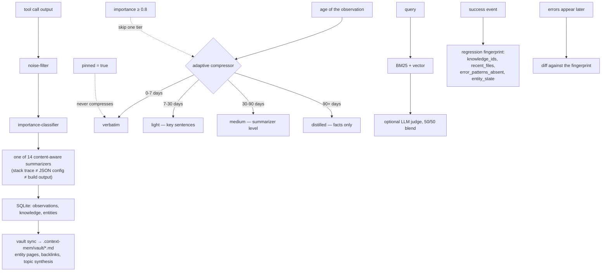

## 1. Executive Summary

Context Mem is an MIT TypeScript memory-and-compression layer for coding agents:
SQLite plus a continuously synced markdown vault, 45+ MCP tools, `init` configs
for nine editors, and plugins for Obsidian and VS Code. It describes itself as a
reference implementation of Karpathy's LLM Wiki pattern with automatic ingest
from tool calls — the same lineage as this atlas's
[llm-wiki-memory](../llm-wiki-memory/), reached independently.

**The mechanism worth taking is compression as the forgetting curve.**
`src/core/adaptive-compressor.ts` ages an observation through four tiers rather
than deleting it:

> "verbatim (0-7 days): Original content intact; light (7-30 days): Key sentences
> retained; medium (30-90 days): Summarizer-level compression; distilled (90+
> days): Facts-only extraction"

with two overrides: `pinned = true` never compresses, and
`importance_score >= 0.8` "skip[s] one tier (compress slower)". Fourteen
content-aware summarizers sit under it, because "a stack trace is not treated the
same way as a JSON config file".

Most systems in this atlas forget by decaying a score until a memory stops being
retrieved, or by deleting it. This one forgets by *losing resolution* — the
memory remains findable at every age and simply says less. That is a different
answer, and for a coding agent it is arguably the right one: you rarely want the
full stdout of a build from March, and you often want to know that it passed.

**And the reason this report leads with a benchmark section is that the
repository contains both the flattering number and the unflattering one, and the
badge is the flattering one.**

## 2. Mental Model

Every tool call is ingested automatically, filtered for noise, classified for
importance, summarized by a type-specific summarizer, and written to SQLite. A
markdown vault is derived from that store — "the raw SQLite store is the
authoritative record; the markdown vault is the derived, human-readable layer" —
and can be read in Obsidian or grepped.



## 3. Architecture

`src/core` holds around fifty modules — the pipeline, the kernel, the adaptive
compressor, an importance classifier, a noise filter, an auto-tagger, an entity
extractor, a knowledge graph, a decision trail, a narrative generator, a topic
detector, a synthesis pass, a dreamer, a pressure predictor, a regression
fingerprinter, time-travel, a budget, an event bus, an SSE stream and a WebSocket
server.

`src/plugins` splits into `knowledge`, `platforms`, `privacy`, `runtimes`,
`search`, `storage` and `summarizers` — a plugin architecture where the fourteen
summarizers are individually replaceable.

99 test files.

**`src/core/regression-fingerprint.ts` deserves a callout.** At a success event it
snapshots `knowledge_ids`, `recent_files`, `entity_state` and — the interesting
field — **`error_patterns_absent`**: the errors that were *not* happening when
things worked. When errors appear later, the current state is diffed against that
fingerprint. Recording an absence as part of a known-good state is a trick this
atlas has not seen elsewhere, and it is exactly what makes "what changed since it
worked" answerable.

## 4. Essential Implementation Paths

**Compress** — `src/core/adaptive-compressor.ts` (the tiers and rules `:1-13`,
`DEFAULT_THRESHOLDS` `:23-27`, `TIER_ORDER` `:29`), `src/plugins/summarizers/`.

**Ingest** — `src/core/pipeline.ts`, `noise-filter.ts`,
`importance-classifier.ts`, `observe-queue.ts`, `entity-extractor.ts`,
`auto-tagger.ts`.

**Derive the vault** — `src/core/vault.ts`, `vault-templates.ts`,
`synthesis.ts`, `narrative-generator.ts`.

**Diff a regression** — `src/core/regression-fingerprint.ts`
(`Fingerprint` `:9-15`, `RegressionDiff` `:17`).

**Redact** — `src/plugins/privacy/privacy-engine.ts` (`BUILT_IN_PATTERNS`,
`strip_tags`, `redact_patterns`, `disabled_detectors`).

## 5. Memory Data Model

Observations and `knowledge` rows in SQLite, with entities and a graph on top,
and the vault as a derived projection. `knowledge` gained a `superseded_by`
column in migration, used by `decision-trail.ts` to reconstruct the alternatives
that a decision displaced:

```sql
WHERE superseded_by = ? OR id IN (SELECT superseded_by FROM knowledge WHERE id = ?)
```

That is a good use — showing what was considered and rejected when explaining a
decision. It is also the column's only use: **no read path filters
`superseded_by IS NULL`**, so a superseded knowledge row is still a normal
retrieval candidate. The field records history rather than governing belief,
which is why the `trust_state` mark is not awarded.

`pinned` and `importance_score` are the two fields that actually change
behaviour, and they change compression rather than retrieval.

## 6. Retrieval Mechanics

Hybrid BM25 plus vector, with an optional LLM judge (Haiku) blended 50/50 into
the ranking, exposed through 45+ MCP tools and also readable as plain markdown in
Obsidian or via grep.

Making the authoritative store SQLite and the human-facing layer a derived
markdown vault is the right way round, and the README says so explicitly. Systems
in this atlas that make markdown authoritative end up with two sources of truth
and a reconciliation problem.

**Scope is structural.** One `.context-mem/` store per project directory; no
project or agent key was found as a predicate on the knowledge read path.

## 7. Write Mechanics

Automatic: hooks ingest every tool call, a noise filter drops what is not worth
keeping, an importance classifier scores what survives, and a type-specific
summarizer compresses it before storage. "No API keys. No cloud account. No data
leaves your machine."

Correction is by supersession (recorded, not enforced) and by compression over
time. Nothing is deleted, nothing is keyed on a rejected value, and there is no
tombstone.

The privacy engine redacts on the way in — AWS keys and a built-in pattern set,
plus caller-supplied `redact_patterns`, a `strip_tags` mode and
`disabled_detectors` for opting out of individual detectors. Redaction at ingest
rather than at read is the correct side of the boundary.

## 8. Agent Integration

`npm i context-mem && npx context-mem init` writes the right config for whichever
of nine editors it detects — Claude Code (`.mcp.json` plus 8 hooks plus
CLAUDE.md), Cursor, Windsurf, VS Code/Copilot, Cline, Roo Code, Aider, Continue,
JetBrains AI — and there are Obsidian, VS Code and OpenClaw plugins, a dashboard,
skills and commands directories.

This is the widest editor coverage in the corpus and the `init` detection is the
reason it is usable: nine editors each with a different config file and a
different rules-file convention is exactly the tedium a setup command should
absorb.

## 9. Reliability, Safety, and Trust

**No marks.**

`superseded_by` is recorded and not filtered (section 5). `pinned` and
`importance_score` govern compression, not belief. Scope is one store per
directory rather than a key on the read path. No append-only mutation log, no
review surface, and no committed case asserting that particular material must not
be retrieved.

The privacy engine is the closest thing to a safety mechanism and it is a
redaction filter, not a memory-integrity one.

**The risk worth naming is that the compression is irreversible and the
classifier is upstream of it.** An observation the importance classifier scores
low is compressed a tier faster and, at 90 days, reduced to facts-only. If the
classifier was wrong, the original text is gone — the tiering is a one-way
transformation of the stored content, not a view over it. Nothing found retains
the verbatim original alongside the distilled form, and nothing measures how
often a low-importance observation is later needed in full.
[AgentWorkingMemory](../agent-working-memory/)'s `discardRegret` is the metric
this design wants.

## 10. Tests, Evals, and Benchmarks

**This is the section that earns the report.** Six benchmark harnesses —
LongMemEval, LoCoMo, BEAM, MemBench, ConvoMem, and an end-to-end QA runner — with
dated result JSONs committed under `benchmarks/results/`. That is more benchmark
infrastructure than almost anything in this corpus, and the results are in the
repository rather than on a website.

**The committed LongMemEval retrieval results** (`lme-full-2026-04-18.json`) are:

| metric | value |
|---|---|
| recall@5 | 0.976 |
| recall@10 | 0.988 |
| nDCG@10 | 0.937 |

over 500 questions, with a per-type breakdown down to
`single-session-preference` at 0.90 recall@5.

**The committed end-to-end QA result** (`e2e-qa-real-500q-T5full.json`, dated
2026-04-19, 500 questions, top_k 2) is:

```json
"accuracy": 0.466
```

with `knowledge-update` at 0.282, `single-session-preference` at 0.267,
`single-session-assistant` at 0.339 and `single-session-user` at 0.814.

**The README badge is a gold `LongMemEval — 100% (500/500)`.**

Being precise about what that number is: the README's own table labels it
"**100.0% R@5** (500/500)" and attributes it to the optional LLM-judge blend
("Haiku, 50/50 blend, 100% R@5"), with the un-judged configuration listed as
97.8% R@5. So inside the table it is honestly qualified.

The problem is that LongMemEval is a **question-answering** benchmark, its
published headline metric is QA accuracy, and a gold badge reading
"LongMemEval — 100% (500/500)" will be read as that. The repository's own
measurement of that metric — 46.6% — is committed one directory away, and the
README says "E2E QA numbers for context-mem will be published with v3.4."

Two things should be said in the project's favour, because they are true and they
are unusual:

- **It committed the 46.6% file.** A project optimising for appearances deletes
  that. The number this report is criticising the badge with came from the
  repository itself.
- **It explicitly refuses a comparison it could have made.** On the competitor
  table: *"Retrieval recall figures for Mem0, Graphiti, Zep, and Letta are not
  published against the same benchmarks… at session-level retrieval recall using
  a methodology comparable to ours… **Do not compare them directly.**"* Almost
  nothing in this atlas declines a favourable comparison in bold.

So this is not a project hiding its numbers. It is a project whose badge reports
its best metric under its most generous configuration, next to a benchmark name
that means something else. Changing the badge to `LongMemEval R@5 — 97.8%` would
cost it nothing it has actually earned.

**I ran nothing.** Every figure above is read from the repository's own committed
result files, and the discrepancy is between two of those files and a badge, not
between the repository and anything I measured.

## 11. For Your Own Build

### Steal

- **Forget by losing resolution, not by deleting.** Verbatim → key sentences →
  summary → facts-only, by age. The memory stays findable at every stage and just
  says less, which is what you actually want from a build log from March.
- **Let importance buy a tier, not an exemption.** `importance ≥ 0.8` skips one
  tier; `pinned` skips all of them. Two levers, clearly separated: "this matters"
  and "never touch this".
- **Compress by content type.** Fourteen summarizers because a stack trace, a
  JSON config and a compiler error have different salvageable structure. One
  general summarizer applied to all three throws away the wrong parts of each.
- **Record what was absent in a known-good snapshot.**
  `error_patterns_absent` in the regression fingerprint makes "what changed since
  it worked" answerable in a way a list of present facts cannot.
- **Make the human-readable layer derived.** SQLite authoritative, markdown vault
  synced from it. The reverse gives you two sources of truth.
- **Redact at ingest.** Built-in patterns, caller patterns, a strip mode, and
  per-detector opt-outs, applied before storage.
- **Absorb the editor-config tedium.** Nine editors, nine config formats, one
  `init` that detects and writes the right one.
- **Print "do not compare them directly" when the comparison is not like for
  like.** In bold, on your own competitor table.

### Avoid

- **Do not badge a metric under a benchmark's name when the benchmark is known
  for a different metric.** The table qualifies it as R@5 and the badge does not,
  and the badge is what gets read and reposted. `LongMemEval R@5 — 97.8%` is both
  accurate and impressive.
- **Do not defer publishing the number you already have.** The 46.6% end-to-end
  result is committed and dated; "E2E QA numbers will be published with v3.4"
  reads oddly next to it.
- **Do not add `superseded_by` and then not filter on it.** Recording what a
  decision displaced is a good use; leaving the superseded row as a normal
  retrieval candidate means the displaced belief still competes.
- **Do not make an irreversible transformation depend on a classifier you do not
  measure.** Distillation at 90 days is one-way, and the importance score that
  accelerates it has no committed accuracy figure.

### Fit

Good for a solo developer or small team that wants automatic capture of every
tool call without the context bill, across whichever editor each person uses. The
compression tiering is the differentiator and it is well thought through.

Take the retrieval numbers as retrieval numbers — 97.8% recall@5 at session
granularity is a real and good result — and take the end-to-end accuracy from the
file rather than the badge.

## 12. Open Questions

- **Is the original text retained anywhere after distillation?** Nothing found
  keeps the verbatim form alongside the compressed one.
- **What is the importance classifier's accuracy?** It gates an irreversible
  transformation and no evaluation of it is committed.
- **Will the badge change?** The README defers E2E QA to v3.4 while the v3.x
  result file is present at 46.6%.
- **Does anything filter `superseded_by` on read?** No such predicate was found.

## Appendix: File Index

**Compression** — `src/core/adaptive-compressor.ts` (the tier docstring and
rules `:1-13`, thresholds `:23-27`), `src/plugins/summarizers/`,
`src/core/truncation.ts`, `src/core/budget.ts`

**Ingest** — `src/core/pipeline.ts`, `noise-filter.ts`,
`importance-classifier.ts`, `observe-queue.ts`, `entity-extractor.ts`,
`auto-tagger.ts`, `topic-detector.ts`

**Vault** — `src/core/vault.ts`, `vault-templates.ts`, `synthesis.ts`,
`narrative-generator.ts`, `knowledge-graph.ts`

**Diagnosis** — `src/core/regression-fingerprint.ts` (`Fingerprint` `:9-15`),
`src/core/time-travel.ts`, `src/core/decision-trail.ts` (the superseded-alternatives
query `:148`, `:179-180`)

**Privacy** — `src/plugins/privacy/privacy-engine.ts`

**Schema** — `src/plugins/storage/migrations.ts` (`superseded_by` `:467`)

**Benchmarks** — `benchmarks/longmemeval.js`, `locomo.js`, `beam.js`,
`membench.js`, `convomem.js`, `e2e-qa.js`, `run-all.js`;
`benchmarks/results/lme-full-2026-04-18.json` (recall@5 0.976, recall@10 0.988,
nDCG@10 0.937), `lme-real-nosynth-2026-04-18.json` (recall@5 0.978),
`e2e-qa-real-500q-T5full.json` (accuracy 0.466)

**Claims** — `README.md` (the gold badge `:15`, the judge blend `:127`, the R@5
table rows `:151`, `:160`, the do-not-compare note `:257`)

## History

**2026-08-09** — [`2a55af0a4bf3467df89f1315a74bb2e15ad903f7`](https://github.com/JubaKitiashvili/context-mem/commit/2a55af0a4bf3467df89f1315a74bb2e15ad903f7) — first reading. Screened before reading; the tree was read, never installed, and no benchmark was run. The figures in section 10 are read from the repository's own committed result files.
