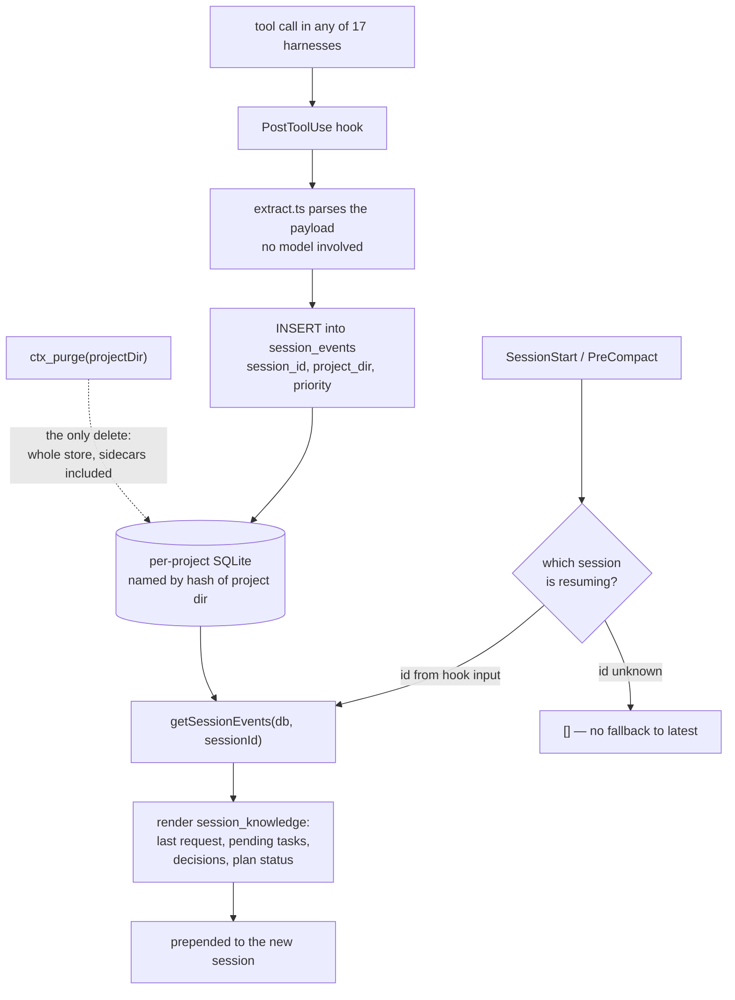

## 1. Executive Summary

Context Mode sells itself as a token-saving MCP server: it runs a tool call in a
sandbox and returns the distilled result rather than the raw output, with a
headline of 315 KB down to 5.4 KB. That is the product. The memory system is
underneath it and is the more interesting half.

Every tool call in a supported harness fires a hook, and the hook writes a typed
event — `file_read`, `error_tool`, `git_branch`, `decision`, `task`,
`plan_enter`/`plan_approved`/`plan_rejected` — into a **per-project SQLite
database** whose filename is a canonical hash of the project directory. At the
start of the next session, `hooks/session-directive.mjs` reads that session's
events back and assembles a `<session_knowledge>` block: last request, pending
tasks (completed ones deliberately excluded), key decisions, plan-mode status,
files touched. Alongside it, `src/search/auto-memory.ts` reads the harness's own
instruction files and a project-scoped memory directory. The result is
cross-session memory for seventeen different coding agents, none of which had to
agree on anything.

What makes it worth reading is not the shape, which is common, but two decisions
about **scope**, both taken after the failure rather than before it.

The first is a committed regression test. Issue #398 records that every
`SessionStart` adapter called `getLatestSessionEvents(db)` — the session with the
most recent `started_at`, whichever project it belonged to — so a second worktree
or a second IDE window would leak its files and errors into the resumed session's
knowledge block. The fix passes the resuming session's own id. The test that pins
it asserts, in the negative, that session B's `file_read` and `error_tool` events
must **not** appear in session A's set, and that an unknown session id returns
`[]` rather than falling back. That is the shape the
[capability index](../../capabilities/) counts as a negative evaluation, and this
is one of the few reports that earns it.

The second is `src/search/ctx-search-schema.ts`, which builds the `ctx_search`
input schema conditionally. The cross-project `project` parameter is spread in
only when the host runs in shared-database mode. In the default per-project
layout the field **does not exist in the tool schema**, which the comment
defends as *"a stronger guarantee than runtime"* validation. A model cannot ask
for another project's memory because there is no argument in which to ask.

Where it is weakest is correction. There is no update path and no per-item
delete. `ctx_purge` wipes every artifact for a project directory — database, WAL
and SHM sidecars, events file, both hash variants on case-insensitive
filesystems — and that is the only forgetting the system has. A wrong decision
event stays in the knowledge block of every future session in that project until
someone destroys the whole store.

The licence is Elastic License 2.0, so the code is readable and modifiable but
may not be offered as a hosted service.

## 2. Mental Model

A memory here is **something a hook saw**, not something a model judged worth
keeping. That single decision explains most of the design.

`src/session/extract.ts` — 2,960 lines — is a set of parsers over hook payloads
from seventeen harnesses. It turns a `PostToolUse` payload into zero or more
`SessionEvent`s with a `type`, a `category`, a `priority`, and a `data` string.
No model is consulted, and there is no extraction prompt anywhere in the tree.
The consequence is the one [zero-LLM capture](../../patterns/zero-llm-capture/)
predicts: capture is complete and cheap, and precision is entirely a function of
how good the parsers are.

The state machine is short, and its shortness is the finding:

- **Written.** An event is inserted with `session_id`, `project_dir`,
  `created_at`, an `attribution_source` and an `attribution_confidence`. It is
  never edited afterwards; there is no `UPDATE` on `session_events` in the tree.
- **Selected, or not.** At the next `SessionStart` the events for *that session
  id* are grouped by category and rendered. Some categories are filtered on their
  way in — a task whose latest status is `completed`, `deleted` or `failed` is
  dropped from the *Pending Tasks* list, with the reason in a comment: *"the model
  should not re-work them."* That is the only content judgement made anywhere on
  the read path.
- **Gone.** Only by `ctx_purge`, and only per project directory.

So a memory has no truth value, no confidence that can change, no supersession
and no rejection. It has a timestamp and a session. The system does model
*attribution* — `attribution_source` and a numeric `attribution_confidence`
recording how sure it is which project an event belongs to — but that is
confidence about the event's address, not about its content.

Control is neither the agent's nor the user's. The agent cannot write a memory:
there is no `remember` tool. The user cannot edit one except by editing an
instruction file, which is a different lane. The hooks decide, and they decide by
firing.

## 3. Architecture

Two processes, and the split matters.

**The hooks** are plain `.mjs` files invoked by the harness — `sessionstart.mjs`,
`pretooluse.mjs`, `posttooluse.mjs`, `precompact.mjs`, `userpromptsubmit.mjs`,
`stop.mjs`, plus `session-directive.mjs` which builds the knowledge block. They
run in a fresh process per event, do their own SQLite open and close, and share
code through pre-bundled `*.bundle.mjs` files so that a hook has no install step.

**The MCP server** (`src/server.ts`) exposes the product surface: `ctx_execute`,
`ctx_execute_file`, `ctx_batch_execute`, `ctx_search`, `ctx_fetch_and_index`,
`ctx_purge`. It runs the sandboxed command, chunks the output, indexes it, and
returns a summary.

The two never share a process, which produces one of the more honest comments in
the tree. `src/session/retrieval-marker.ts` exists because *"context-mode's OWN
MCP retrieval tools never fire a PostToolUse hook for the plugin's own server"*,
so the server writes the byte count of each retrieval into a temp marker keyed by
the session database's basename, and the next ordinary `PostToolUse` picks it up.
The note records that this was *"verified empirically: 0 `mcp_tool_call` events
locally"* — a measurement gap found in production and worked around rather than
assumed away.

Persistence is SQLite via `src/db-base.ts`. `src/session/db.ts` (1,726 lines)
owns `session_events`, `session_meta`, `session_resume` and `tool_calls`.
`src/store.ts` (2,071 lines) owns the content store: two FTS5 virtual tables,
`chunks` for word matching and `chunks_trigram` for substring matching, both
ranked with `bm25(…, 5.0, 1.0)` so the title column outweighs the body.

### Deployment and ergonomics

Node, SQLite, and nothing else. No API key is needed to store anything, no
embedding model is called, and the whole thing runs offline — the only network
path is `ctx_fetch_and_index`, which is a feature rather than a dependency.
Installation is the harness's own plugin or MCP mechanism; the seventeen adapters
under `src/adapters/` exist precisely so that each host's config file is written
in its own dialect.

The store is inspectable with `sqlite3` and the derived events file is Markdown.
Repair by hand is possible for the events file and awkward for the FTS tables,
which is the normal trade for using FTS5.

## 4. Essential Implementation Paths

**Capture.** `hooks/posttooluse.mjs` → `extractEvents(rawInput)` in
`src/session/extract.ts` → `db.insertEvent(sessionId, event, sourceHook)` in
`src/session/db.ts`. Project attribution runs in
`src/session/project-attribution.ts` and lands as `attribution_source` and
`attribution_confidence` columns on the row.

**Context assembly.** `hooks/sessionstart.mjs` → `getSessionEvents(db,
sessionId)` → `buildSessionDirective(source, eventMeta, toolNamer)` in
`hooks/session-directive.mjs`, which emits
`<session_knowledge source="compact|continue">` with a nested `<session_guide>`.
The same module writes a human-readable `events.md` sidecar.

**Retrieval.** `ctx_search` → `searchAllSources` in `src/search/unified.ts`,
which merges three origins — `current-session` chunks from the content store,
`prior-session` events from the session database, and `auto-memory` from
instruction files — under `sort: "relevance"` (content store only, bm25) or
`sort: "timeline"` (all three, chronological).

**Auto-memory.** `searchAutoMemory` in `src/search/auto-memory.ts` reads, in
order: `<projectDir>/<instructionFile>` for each file the adapter names,
`<configDir>/<instructionFile>`, then `<memoryDir>/*.md`. `getMemoryDir` is
documented as required to return a *project-scoped* path, and the adapterless
legacy fallback applies `hashProjectDirCanonical` itself so the contract holds at
both call sites — issue #663 in the comment.

**Delete.** `purgeSession` in `src/session/purge.ts`. Every path is derived
deterministically from the input `projectDir` with, in its own words, *"NO
`readdirSync` + glob-filter loop"*, so two worktrees cannot collapse onto each
other. It unlinks the `.db`, `-wal` and `-shm` triple unconditionally and sweeps
both the canonical lowercased hash and the legacy raw-cased one, because a
partial upgrade on a case-insensitive filesystem otherwise leaves orphans.

**Scope on the tool surface.** `buildCtxSearchSchema` in
`src/search/ctx-search-schema.ts` spreads the `project` field into the Zod object
only when `isSharedMode` is true.

## 5. Memory Data Model

`session_events` is the memory table:

| Column | Carries |
| --- | --- |
| `session_id`, `project_dir` | the two scope keys |
| `type`, `category`, `priority` | what kind of event, and how much it matters |
| `data` | the payload, a string — sometimes JSON, sometimes a path |
| `attribution_source`, `attribution_confidence` | how the project was determined, and how sure |
| `bytes_avoided`, `bytes_returned` | the product's own accounting |
| `source_hook`, `created_at`, `data_hash` | provenance and dedupe |

Three indexes exist and all three lead with `session_id`, which is the schema
saying what the read path is.

`session_meta` holds one row per session with `project_dir`, `started_at`,
`last_event_at`, `event_count` and `compact_count`. `session_resume` holds one
snapshot per session with a `consumed` flag, so a resume is used once.
`tool_calls` aggregates per `(session_id, tool)`.

There is no validity interval, no supersession pointer, no trust field and no
tombstone. `data_hash` is present and is a dedupe key, not a correction
mechanism. Episodic material (events) and reference material (instruction files,
the memory directory) live in different substrates entirely and meet only in
`searchAllSources`.

## 6. Retrieval Mechanics

Two arms, both lexical, no embeddings anywhere.

The content store runs FTS5 twice over the same chunks: a word index and a
trigram index, each ranked `bm25(chunks, 5.0, 1.0)`. The trigram table is what
makes a substring or an identifier fragment findable, which is the right second
arm for code and a better choice than a vector index for a store that must work
offline with no model.

The session arm is not a search at all under the default path — it is
`SELECT … WHERE session_id = ? ORDER BY created_at ASC`, the whole session in
order. Ranking happens only in the rendering, by category and by the
`priority` column.

`searchAllSources` merges the three origins and tags each result
`current-session`, `prior-session` or `auto-memory`, so the caller can see where
a hit came from. Under `projectScope`, content-store results are restricted with
a two-step `IN` clause: the session database translates a `project_dir` into a
list of session ids, and chunks are filtered to those plus legacy
`session_id = ''` rows.

The failure modes are the ones a lexical, complete-capture design produces. A
long session yields a long knowledge block, bounded only by the per-item
truncations in the renderer — the last prompt is cut at 300 characters, a
decision at 150. Nothing scores whether an event is still relevant. And the
knowledge block is assembled from whatever the parsers recognised, so a harness
whose payload shape drifts loses material silently.

## 7. Write Mechanics

Writes are **synchronous inside a hook** and cost no model call. The hook process
opens SQLite, inserts, and exits. A memory written by the `PostToolUse` of one
tool call is readable by the next one, so the lag is a process spawn rather than a
consolidation cycle.

There is no deduplication beyond `data_hash`, no consolidation, and no background
pass — nothing in this tree runs on a timer, and the absence is a deliberate fit
with the hook model rather than an omission.

Filtering of noisy input happens at two places and neither is about truth.
`src/security.ts` and the server's `checkFilePathDenyPolicy` /
`checkProjectBoundary` decide what the sandbox may execute and read.
`src/search/flood-guard.ts` bounds the search side. Neither asks whether an event
is *correct*, because nothing in the design has an opinion about that.

### Operational cost

The write path is **zero-token**. No extraction model, no summarisation, no
embedding — the entire capture path is regular expressions and JSON parsing over
hook payloads.

The read path is where the bill lands, and it is a fixed prepend rather than a
per-turn injection: the `<session_knowledge>` block is emitted once at
`SessionStart` and once at `PreCompact`. That is the friendly shape for
[cache-preserving injection](../../patterns/cache-preserving-injection/) — the
block is byte-stable for the whole session because nothing re-renders it mid-run,
so it sits in the cached prefix rather than invalidating it every turn. Whether
that was reasoned about or fell out of the hook lifecycle, the tree does not say.

The block's size is bounded only by per-item truncation, so a session with many
decisions produces a large one, and the cost is paid at every cache miss for the
rest of that session.

## 8. Agent Integration

Seventeen adapters, and the list is the point: `claude-code`, `codex`, `cursor`,
`gemini-cli`, `qwen-code`, `kimi`, `kiro`, `opencode`, `openclaw`, `pi`, `zed`,
`omp`, `antigravity`, `antigravity-cli`, `copilot-cli`, `vscode-copilot`,
`jetbrains-copilot`. `src/adapters/base.ts` supplies three defaults each one may
override — `getConfigDir()` derived from `sessionDirSegments`,
`getInstructionFiles()` defaulting to `["CLAUDE.md"]`, and `getMemoryDir()`
defaulting to `<configDir>/memory`. That is a small contract, and it is the whole
reason one memory implementation reaches seventeen hosts.

The agent's agency over memory is close to nil, by design. It cannot write, cannot
correct, cannot delete an item, and cannot address a memory by id. It can search
(`ctx_search`) and it can destroy a project's whole store (`ctx_purge`). Injection
is automatic and it is not a tool result — the knowledge block is prepended by the
host at session start.

Compaction is handled explicitly: `precompact.mjs` fires before the harness
compacts, and the knowledge block records `source="compact"` versus
`source="continue"` so the model can tell which boundary it just crossed.

## 9. Reliability, Safety, and Trust

Provenance is genuinely modelled, and unusually so: every event carries which hook
produced it and a numeric confidence in the project it was attributed to. That is
a rarer field than a trust score, and it is answering a different question — not
*is this true* but *is this mine*.

Prompt-injected false memories are structurally difficult here, and for a reason
worth naming: the model never writes to the store. An attacker who controls a
file the agent reads cannot cause a `decision` event to be written, because
`decision` events come from parsing the harness's own payloads. What an attacker
*can* do is influence what the agent reads and runs, which is what
`checkProjectBoundary` and the deny policy are for.

The gaps:

- **No correction of any kind.** A `decision` event captured from a
  misinterpreted prompt is in every future session's knowledge block for that
  project, and the only remedy is `ctx_purge` of the entire store.
- **Attribution is a heuristic with a confidence number, and the number is not
  used as a filter** anywhere on the read path that this reading found. A
  low-confidence attribution produces the same block as a high-confidence one.
- **Shared-database mode widens the surface deliberately.** The `project`
  parameter exists there, and the schema comment is explicit that the guarantee in
  the default mode comes from the field's absence — so the guarantee is a
  deployment property, not a code property.
- **Elastic License 2.0** means an adopter may read and modify but may not offer
  it as a hosted service, which matters for anyone evaluating it as a platform
  component rather than as a local tool.

## 10. Tests, Evals, and Benchmarks

210 test files, and the coverage is broad — adapters, hooks, session extraction,
security, executor, analytics, plus per-harness plugin tests.

The one that earns a mark is `tests/session/cross-session-bleed.test.ts`. Its
header documents the bug, the pull request, and the fixing commit, then states
what the tests pin: *"getSessionEvents(db, sid) returns ONLY events for `sid`"*
and *"getSessionEvents(db, 'unknown') returns [] — no fallback"*. The assertions
are written in the negative — B's `file_read` and B's `error_tool` **must not**
appear in A's set — and the header explains why the shape was chosen: *"If either
contract regresses, all 6 SessionStart adapters silently leak again. These tests
fail loudly instead."* That reasoning is the argument for negative retrieval
assertions, stated by someone who had just been bitten.

`tests/benchmark-results-v04.json` commits measured output: per-tool raw bytes,
context bytes, savings percentage and duration, dated 23 February 2026 at version
0.4.0. It measures the *product* — how much smaller a distilled tool result is —
not memory quality. No retrieval-quality evaluation exists, which is consistent
with a system whose session retrieval is a `WHERE` clause rather than a ranking.

What I would want before trusting it: a test that the `<session_knowledge>` block
rendered for session A contains no string from session B, which is one level
above the contract the current test pins — the leak was in the adapters, and the
test is on the function the adapters call. And a test of the two-step
`projectScope` `IN` clause on the content store, which is the same boundary on the
other arm and is untested as far as this reading found.

I ran nothing. Every claim here comes from reading the tree at
`ff5f911d5732a036336c59684c27f4514f211edf`.

## 11. For Your Own Build

### Steal

- **Delete the parameter instead of validating it.** If a scope must not be
  chosen by the model, leave it out of the tool schema rather than rejecting bad
  values at runtime. The comment's phrasing is the right test — a field the caller
  physically cannot supply is a stronger guarantee than one you check — and the
  conditional-schema trick makes it compatible with a deployment mode that does
  need the field.
- **Write the negative test at the function the leak passed through.** The bug
  here was six adapters calling one convenience function; the test pins the
  function's contract, so a seventh adapter written next year inherits the
  guarantee. Testing each adapter would have been six tests that a new adapter
  does not get.
- **Derive every delete path from the input, never from a directory listing.**
  `purgeSession`'s refusal to glob is what makes it safe across worktrees, and the
  same reasoning applies to any store keyed by a hash of a path.
- **Record which hook produced an event, and how confident you are about the
  scope you assigned it.** Attribution confidence is a different axis from content
  confidence and it is the one a multi-project, multi-window setup actually needs.

### Avoid

- **Do not ship capture without a per-item delete.** A store that can only be
  destroyed wholesale forces the user to choose between one wrong memory and all
  of them, and the wrong memory is the one that keeps getting injected.
- **Do not let the injected block grow without a global bound.** Per-item
  truncation caps the worst single entry and says nothing about the total, which
  is the number that ends up in every prompt.
- **Do not assume your own tool calls are visible to your own hooks.** This
  project found the gap empirically, in production, after building analytics on
  top of it. If you meter your own retrieval, verify the meter fires.

### Fit

This is for someone who works across several coding agents and wants one memory
that follows them, and it is worth adopting for that reason alone — the seventeen
adapters are the expensive part and they already exist. It assumes a local,
single-developer deployment: one machine, one SQLite file per project, no server,
no account.

Walk away if you need memory to be *corrected*. There is no seam to add it: the
schema has no version chain, the read path has no filter to consult, and the write
path has no author to attribute a fix to. Walk away too if you were planning to
host it — the Elastic licence forecloses that specifically — and if what you
actually want is a semantic memory over conversations, since everything here is
lexical over what a hook observed.

## 12. Open Questions

- Does the rendered `<session_knowledge>` block ever exceed a useful size in a
  long session? Per-item truncation is in the code and the total is not bounded
  anywhere this reading found.
- Is `attribution_confidence` consumed anywhere as a threshold, or only recorded?
  Nothing on the read path appeared to read it.
- How does shared-database mode scope the session arm? The `project` parameter
  covers the content store through `projectScope`; whether prior-session events
  are equally filtered there was not traced.
- What proportion of the seventeen adapters actually deliver a session id on
  resume? The fix depends on it, and an adapter that does not would fall into the
  `[]` branch — safe, but silently empty.

## Appendix: File Index

**Storage and schema**
`src/session/db.ts` · `src/db-base.ts` · `src/store.ts` · `src/store-directory.ts`

**Write path**
`src/session/extract.ts` · `src/session/event-emit.ts` ·
`src/session/persist-tool-calls.ts` · `src/session/project-attribution.ts` ·
`hooks/posttooluse.mjs` · `hooks/userpromptsubmit.mjs`

**Retrieval**
`src/search/unified.ts` · `src/search/auto-memory.ts` ·
`src/search/ctx-search-schema.ts` · `src/search/flood-guard.ts`

**Context assembly**
`hooks/session-directive.mjs` · `hooks/sessionstart.mjs` · `hooks/precompact.mjs` ·
`src/session/snapshot.ts`

**Deletion**
`src/session/purge.ts`

**Integration**
`src/server.ts` · `src/adapters/base.ts` · `src/adapters/detect.ts` ·
`src/adapters/client-map.ts`

**Tests and measurement**
`tests/session/cross-session-bleed.test.ts` ·
`tests/adapters/base-adapter-memory.test.ts` ·
`tests/benchmark-results-v04.json`

## History

**2026-08-09** — [`ff5f911d5732a036336c59684c27f4514f211edf`](https://github.com/mksglu/context-mode/commit/ff5f911d5732a036336c59684c27f4514f211edf) —
first reading, from the
[awesome-ai-tokenomics triage](https://github.com/QuesmaOrg/awesome-ai-tokenomics),
where the entry describes only the tool-output sandbox. Screened before reading:
1 auto-run surface (`.claude/settings.json`, which declares permission allow and
deny lists and no hooks), 3 unpinned manifests, no dependency surface inside the
seven-day cooldown. Nothing was executed and nothing was installed.
