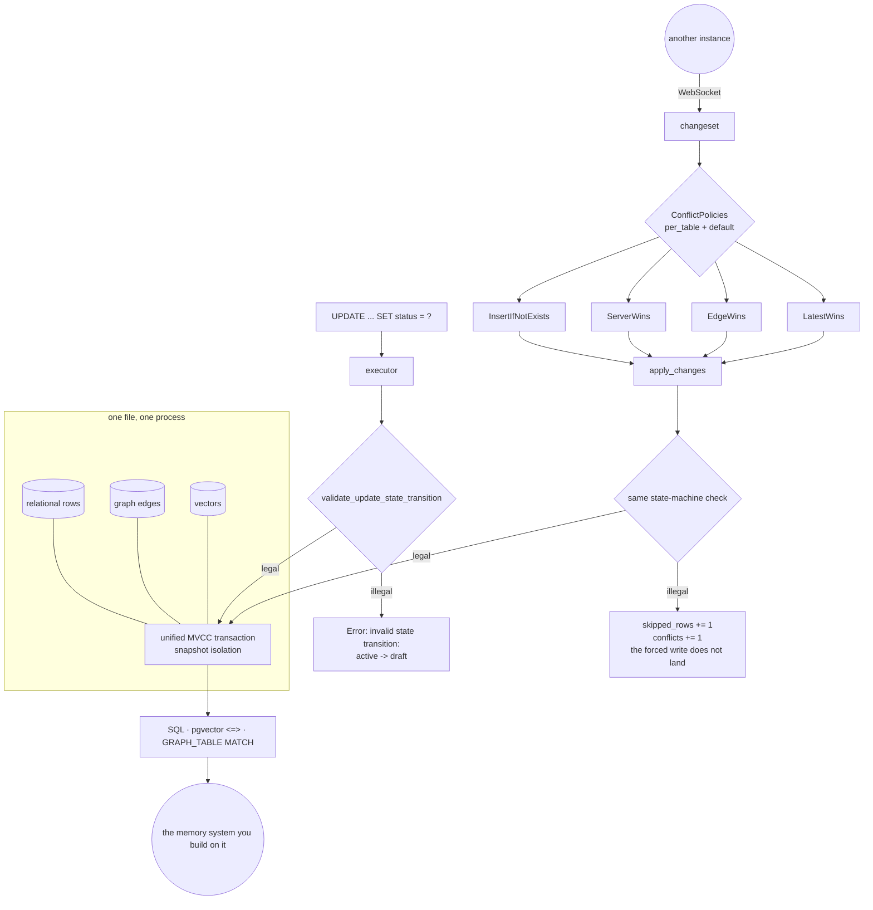

## 1. Executive Summary

contextdb is an embedded database written for agent memory specifically —
relational storage, bounded graph traversal and vector similarity under one MVCC
transaction, in a single file and a single process, with bidirectional sync
between instances over WebSocket. Apache 2.0, Rust, 256 files across ten crates.

**One mark: `negative_eval`.** That is the honest count for what this is, and
the reason is worth stating plainly rather than treating as a shortfall: **it
holds no memories of its own.** There is no status field to be an epistemic
state, no rejected-value record, no scope key, and no second clock — because
those belong to the schema its users write. contextdb is the layer the other six
marks would be built *on*.

What it does carry is a guarantee most of this corpus implements in application
code, and the README states it as the pitch:

```
contextdb> UPDATE decisions SET status = 'draft' WHERE id = '550e8400...';
Error: invalid state transition: active -> draft
```

The interesting part is what happens when that meets sync. A conflict policy of
`EdgeWins` will try to force a remote row over a local one — and if the forced
write is an illegal transition, **the row is skipped and recorded as a conflict
rather than applied.** A merge strategy cannot overrule a declared invariant.
For a memory shared across devices that is the difference between a lifecycle
and a suggestion.

## 2. Mental Model

Every agent, device or service runs its own instance; they reconcile through a
server. A table can declare a state machine, a DAG constraint or a cascade, and
the engine enforces it on every write — including writes that arrive from
another instance.

Conflict resolution is chosen per table rather than globally:
`InsertIfNotExists`, `ServerWins`, `EdgeWins`, `LatestWins`, with a default.
For agent memory those are different policies for different kinds of knowledge —
a fact that should never be overwritten once learned is not the same table as a
status that should track the newest observation.

## 3. Architecture



## 4. Essential Implementation Paths

**The constraint, at the engine** — `crates/contextdb-engine/src/executor.rs:1710`
calls `validate_update_state_transition`, defined at `:2952`, which delegates to
`db.relational_store().validate_state_transition(...)` at `:2978`. The
implementation lives in `contextdb-relational/src/store.rs:411` with an
in-memory counterpart at `mem.rs:86`, so the two backends answer the same
question through the same named method rather than each deciding for itself.

**The same check on the sync path.** `apply_changes` runs a changeset under a
policy and returns `applied_rows`, `skipped_rows` and `conflicts`
(`sync_types.rs:150`). The integration test at
`crates/contextdb-server/tests/sync_integration.rs:1150-1163` sets
`ConflictPolicy::EdgeWins` — the policy that forces the remote row — and asserts
two rows apply, one is skipped, and one conflict is returned, with the comment
naming the cause: *"EdgeWins forces upsert attempt on row B — which fails due to
state machine."*

**The policy map** — `sync_types.rs:124-144`. `ConflictPolicy` is a four-value
enum; `ConflictPolicies` is a `per_table` map plus a `default`, with a `uniform`
constructor for the simple case. Per-table is the right granularity for memory:
the table holding facts and the table holding their current status want
different answers.

**Tombstones, in the storage sense** — `contextdb-vector/src/store.rs:99`,
`tombstone_row(row_id, deleted_tx)`, and a comment in
`contextdb-relational/src/store.rs:40` about counting *"live (non-tombstoned)
postings, useful for leak detection."* These are MVCC delete markers keyed on a
row id and a transaction, which is the correct meaning of the word in a storage
engine and not the atlas's.

## 5. Memory Data Model

The schema is the user's. contextdb supplies the types — rows, edges, vectors —
and the constraints it will enforce over them: state machines, DAG enforcement,
cascading propagation. A memory system built here would declare its own status
column and its own transition table, and the engine would hold them.

## 6. Retrieval Mechanics

PostgreSQL-compatible SQL, pgvector's `<=>` operator for vector distance, and
SQL/PGQ-style `GRAPH_TABLE ... MATCH` for bounded traversal — the README is
explicit that this is *"the subset that matters for bounded traversal, not the
full standard"*. All three under one transaction, which is the pitch: one
snapshot rather than three systems disagreeing about what exists.

## 7. Write Mechanics

Writes are transactional and validated against whatever the table declares.
Remote writes arrive as changesets and go through the same validation.

## 8. Agent Integration

A Rust library and CLI today; the README says Python and TypeScript bindings are
on the roadmap and marks them as such rather than implying they exist.

## 9. Reliability, Safety, and Trust

**`negative_eval`** — section 10.

**Six marks are withheld for one reason.** `tombstone`, `trust_state`,
`bitemporal`, `scope_enforced`, `audit_log` and `human_review` all describe
properties of a memory, and contextdb stores whatever it is given. The mark set
measures systems that decide what to remember; this decides how to store and
merge it. Two details are worth pinning so a later reading does not re-open
them: the tombstones here are MVCC row markers keyed on `(row_id, deleted_tx)`,
and MVCC supplies snapshot isolation — a transaction ordering — but no
world-validity axis, so there is no second clock to read.

**What it does give a memory system, and this is the substantive finding.** A
declared lifecycle that the database enforces is the difference between
`trust_state` as a convention and `trust_state` as a guarantee — most systems in
this corpus enforce their status transitions in application code, where a second
write path can bypass them. And the sync behaviour closes the gap that usually
follows: an invariant enforced locally but abandoned at merge time is not an
invariant. Here the merge is the one that yields.

## 10. Tests, Evals, and Benchmarks

Acceptance, integration and per-crate tests, plus a `benches/` tree. Nothing was
installed and nothing was run.

The must-not cases are about visibility and about invariants surviving a merge:

- `crates/contextdb-server/tests/sync_integration.rs:1158-1163` — under
  `EdgeWins`, *"row B should fail (invalid state transition)"*, asserted as
  `skipped_rows == 1` and one conflict, with rows A and C still applying. The
  test proves the policy did not win, and that the failure was isolated to the
  offending row rather than aborting the batch.
- `crates/contextdb-engine/tests/sql_surface_tests.rs:3093` — *"failed sync pull
  must not make remote rows visible on the server"*. A partial sync must not
  leak.
- `:3202` — *"duplicate logical edge should not leave a second relational row"*.
- `:3356` — noop upserts *"must not leak memory"*, with the baseline in the
  message.

The first is the one that matters for this atlas. A conflict policy that can
override a declared constraint would make every lifecycle in every schema built
here advisory, and it is asserted not to.

No paper.

## 11. For Your Own Build

### Steal

- **Put the lifecycle in the database.** A status transition validated in the
  engine holds for every writer, including the sync path and the next tool
  somebody adds. In application code it holds for the writers that remembered.
- **Make the merge yield to the invariant, and test that it does.** The
  interesting case is not that an illegal update fails — it is that an illegal
  update arriving from another device also fails, under the policy that exists
  to force writes through.
- **Choose conflict resolution per table.** A fact learned once and a status
  tracking the newest observation want different answers, and a single global
  policy makes one of them wrong.
- **Isolate the failure to the row.** Two rows applied and one skipped, with the
  conflict returned, is more useful than a rejected batch.

### Avoid

- **Reading "tombstone" in a storage engine as an epistemic one.** Here it is an
  MVCC marker, correctly so, and it answers a different question than the atlas's
  mark of the same name.

### Fit

Take it if you are building a memory system rather than adopting one, and you
want the lifecycle enforced below your application. It gives you the primitives
the marks on other pages are made of; none of those decisions are made for you.

## 12. Open Questions

- Conflict policy is per table. Is a per-column or per-row policy envisaged for
  a table whose status and content want different merge rules?
- MVCC gives snapshot isolation. Is a valid-time axis in scope, or is world
  validity expected to be a user column with user-written predicates?
- `apply_changes` returns conflicts. Is a durable record of a rejected merge
  intended, or is the caller expected to keep one?
- Bindings for Python and TypeScript are on the roadmap. Will the state-machine
  errors surface as typed errors there, or as strings?

## Appendix: File Index

| Path | What it holds |
| --- | --- |
| `crates/contextdb-engine/src/executor.rs` | `validate_update_state_transition` and its call site on the update path |
| `crates/contextdb-relational/src/store.rs` | `validate_state_transition`, and the live-postings comment about MVCC tombstones |
| `crates/contextdb-relational/src/mem.rs` | the in-memory backend answering the same question by the same name |
| `crates/contextdb-engine/src/sync_types.rs` | `ConflictPolicy`, `ConflictPolicies`, and the conflict list on a result |
| `crates/contextdb-engine/src/database.rs` | the conflict policies held on the database and the upsert path |
| `crates/contextdb-vector/src/store.rs` | `tombstone_row(row_id, deleted_tx)` |
| `crates/contextdb-server/tests/sync_integration.rs` | the EdgeWins-versus-state-machine case |

## Appendix: Recorded Searches

Run from the root of the checkout at the pinned commit.

| Claim | Command | Result at this pin |
| --- | --- | --- |
| The state machine is enforced on both the local and the sync write path | `grep -rn "validate_state_transition\|validate_update_state_transition" --include='*.rs' crates` | `executor.rs:1710` and `:2952-2978`, `relational/src/store.rs:411`, `mem.rs:86`, and the sync case at `contextdb-server/tests/sync_integration.rs:1161` |
| Tombstones here are MVCC row markers | `grep -rn "tombstone" --include='*.rs' crates` | `vector/src/store.rs:99` `tombstone_row(row_id, deleted_tx)` and its two call sites, plus a live-postings comment; nothing keyed on a value |
| There is no valid-time axis | `grep -rln "as_of\|valid_time\|AS OF" --include='*.rs' crates` | Nothing; MVCC supplies transaction ordering only |
| Conflict policy is a four-value enum with a per-table map | read `crates/contextdb-engine/src/sync_types.rs:124-144` | `InsertIfNotExists`, `ServerWins`, `EdgeWins`, `LatestWins`; `per_table: HashMap<String, ConflictPolicy>` beside a `default` |
| The sync crate is inside the engine, not separate | `grep -rln "sync" --include='*.rs' crates` | `contextdb-engine/src/sync_types.rs`, `persistence.rs`, `database.rs`; there is no `contextdb-sync` crate, and a first search for one found nothing for that reason |
| The licence carries no rider | `head -3 LICENSE`; `grep -n -i 'anthropic\|may not' LICENSE` | Stock Apache 2.0; the only match is the standard compliance clause |

## History

**2026-09-20** — [`e6cf60cf972148bbbfe5a002151f40d191e551b9`](https://github.com/context-graph-ai/contextdb/commit/e6cf60cf972148bbbfe5a002151f40d191e551b9) — first reading, at 256 files across ten crates. Screened before reading; nothing was installed, built or run, and the committed `benches/` tree was read rather than executed. Apache 2.0. One mark, `negative_eval`. The other six are withheld together for one reason rather than six: this is a database and the schema belongs to its users, so there is no status, no rejected-value record, no scope key and no second clock of its own to read. The substantive finding is what it offers a memory system built on it — a lifecycle the engine enforces on every writer including the sync path, with a committed case asserting that a conflict policy chosen to force remote writes does not override it.
